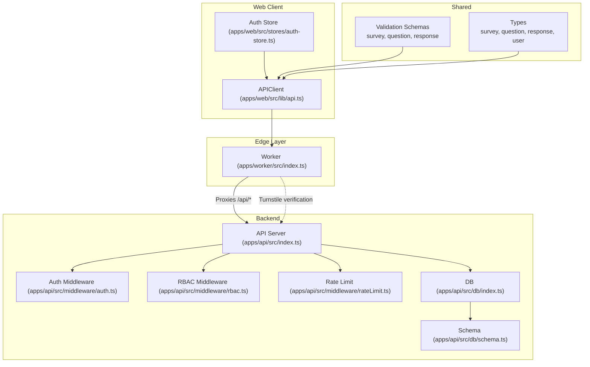
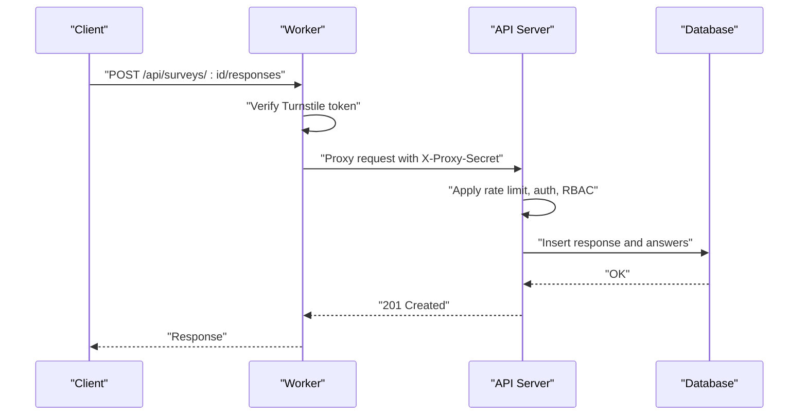
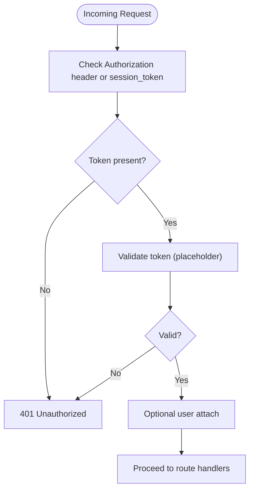
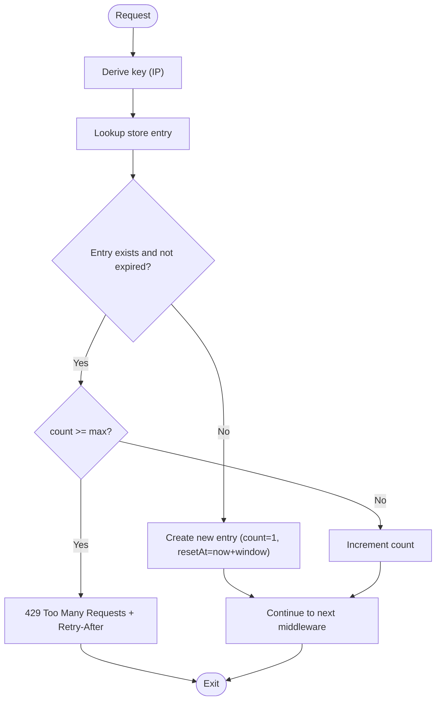
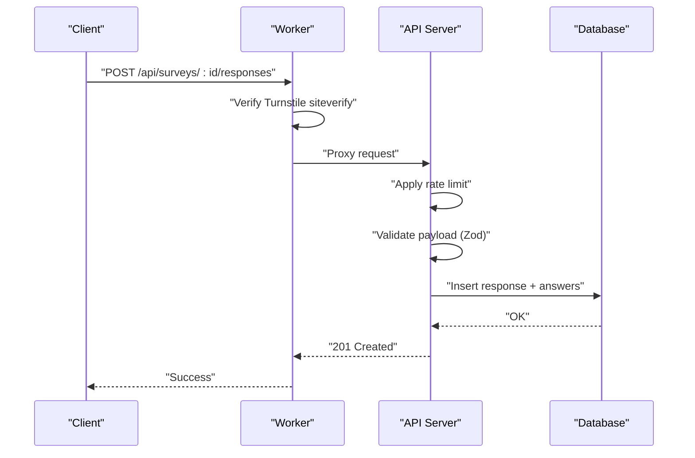
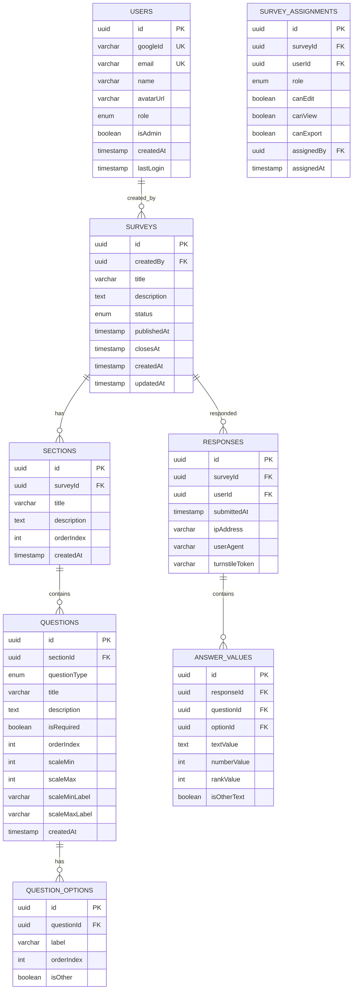
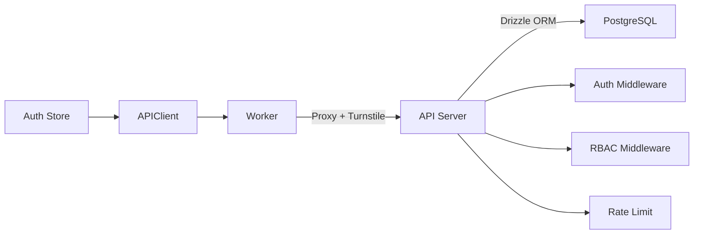

# API Reference

<cite>
**Referenced Files in This Document**
- [index.ts](file://apps/api/src/index.ts)
- [index.ts](file://apps/worker/src/index.ts)
- [rateLimit.ts](file://apps/api/src/middleware/rateLimit.ts)
- [auth.ts](file://apps/api/src/middleware/auth.ts)
- [rbac.ts](file://apps/api/src/middleware/rbac.ts)
- [auth.service.ts](file://apps/api/src/services/auth.service.ts)
- [db/index.ts](file://apps/api/src/db/index.ts)
- [db/schema.ts](file://apps/api/src/db/schema.ts)
- [api.ts](file://apps/web/src/lib/api.ts)
- [auth-store.ts](file://apps/web/src/stores/auth-store.ts)
- [survey.schema.ts](file://packages/shared/src/schemas/survey.schema.ts)
- [question.schema.ts](file://packages/shared/src/schemas/question.schema.ts)
- [response.schema.ts](file://packages/shared/src/schemas/response.schema.ts)
- [survey.ts](file://packages/shared/src/types/survey.ts)
- [question.ts](file://packages/shared/src/types/question.ts)
- [response.ts](file://packages/shared/src/types/response.ts)
- [user.ts](file://packages/shared/src/types/user.ts)
- [plan.md](file://plan.md)
</cite>

## Table of Contents
1. [Introduction](#introduction)
2. [Project Structure](#project-structure)
3. [Core Components](#core-components)
4. [Architecture Overview](#architecture-overview)
5. [Detailed Component Analysis](#detailed-component-analysis)
6. [Dependency Analysis](#dependency-analysis)
7. [Performance Considerations](#performance-considerations)
8. [Troubleshooting Guide](#troubleshooting-guide)
9. [Conclusion](#conclusion)
10. [Appendices](#appendices)

## Introduction
This document provides comprehensive API documentation for the complete API surface, covering survey management, response collection, user authentication, and admin operations. It explains HTTP methods, URL patterns, request/response schemas, authentication requirements, validation rules, error handling, rate limiting, security considerations, and API versioning. Practical examples, common use cases, and client implementation guidelines are included to help developers integrate with the system effectively.

## Project Structure
The API is implemented as a modular system composed of:
- Edge proxy and validation layer (Cloudflare Worker)
- Backend service (Hono server)
- Shared validation and type definitions (shared package)
- Web client (frontend) and authentication store

**Diagram sources**
- [index.ts:1-106](file://apps/worker/src/index.ts#L1-L106)
- [index.ts:1-67](file://apps/api/src/index.ts#L1-L67)
- [auth.ts:1-52](file://apps/api/src/middleware/auth.ts#L1-L52)
- [rbac.ts:1-45](file://apps/api/src/middleware/rbac.ts#L1-L45)
- [rateLimit.ts:1-70](file://apps/api/src/middleware/rateLimit.ts#L1-L70)
- [db/index.ts:1-9](file://apps/api/src/db/index.ts#L1-L9)
- [db/schema.ts:1-247](file://apps/api/src/db/schema.ts#L1-L247)
- [api.ts:1-60](file://apps/web/src/lib/api.ts#L1-L60)
- [auth-store.ts:1-30](file://apps/web/src/stores/auth-store.ts#L1-L30)
- [survey.schema.ts:1-22](file://packages/shared/src/schemas/survey.schema.ts#L1-L22)
- [question.schema.ts:1-65](file://packages/shared/src/schemas/question.schema.ts#L1-L65)
- [response.schema.ts:1-24](file://packages/shared/src/schemas/response.schema.ts#L1-L24)

**Section sources**
- [index.ts:1-67](file://apps/api/src/index.ts#L1-L67)
- [index.ts:1-106](file://apps/worker/src/index.ts#L1-L106)
- [db/schema.ts:1-247](file://apps/api/src/db/schema.ts#L1-L247)

## Core Components
- Edge proxy and validation:
  - Enforces CORS, security headers, request size limits, Turnstile verification for survey responses, and proxies requests to the backend.
- Backend API server:
  - Provides health checks, global error handling, and route mounting placeholders for auth, surveys, and admin.
- Authentication and authorization:
  - Session-based auth via Authorization header or query parameter; placeholder for better-auth integration; role-based access control (RBAC) middleware.
- Rate limiting:
  - In-memory rate limiter with sliding windows; preconfigured for general API, submission, and auth endpoints.
- Database and schema:
  - PostgreSQL schema with enums for roles, statuses, and question types; tables for users, surveys, assignments, sections, questions, options, responses, and answer values.
- Shared validation and types:
  - Zod schemas for survey, question, and response creation/update/validation; TypeScript types for entities and payloads.

**Section sources**
- [index.ts:1-106](file://apps/worker/src/index.ts#L1-L106)
- [index.ts:1-67](file://apps/api/src/index.ts#L1-L67)
- [auth.ts:1-52](file://apps/api/src/middleware/auth.ts#L1-L52)
- [rbac.ts:1-45](file://apps/api/src/middleware/rbac.ts#L1-L45)
- [rateLimit.ts:1-70](file://apps/api/src/middleware/rateLimit.ts#L1-L70)
- [db/schema.ts:1-247](file://apps/api/src/db/schema.ts#L1-L247)
- [survey.schema.ts:1-22](file://packages/shared/src/schemas/survey.schema.ts#L1-L22)
- [question.schema.ts:1-65](file://packages/shared/src/schemas/question.schema.ts#L1-L65)
- [response.schema.ts:1-24](file://packages/shared/src/schemas/response.schema.ts#L1-L24)

## Architecture Overview
The system follows an edge-first design:
- Cloudflare Worker validates requests (Turnstile, rate limiting, size limits) and proxies to the backend.
- Backend applies middleware for logging, CORS, security headers, timeouts, and custom validation.
- Shared schemas and types ensure type safety across frontend, worker, and backend.

**Diagram sources**
- [index.ts:42-79](file://apps/worker/src/index.ts#L42-L79)
- [index.ts:11-37](file://apps/api/src/index.ts#L11-L37)
- [rateLimit.ts:14-52](file://apps/api/src/middleware/rateLimit.ts#L14-L52)
- [db/schema.ts:173-222](file://apps/api/src/db/schema.ts#L173-L222)

## Detailed Component Analysis

### Authentication and Authorization
- Methods:
  - Session-based authentication via Authorization header (Bearer token) or query parameter session_token.
  - Optional auth middleware to attach user context without blocking.
  - Proxy verification via x-proxy-secret header to ensure requests originate from the Worker.
- Roles and permissions:
  - User roles: admin, editor, viewer, user.
  - RBAC middleware supports minimum role checks and per-survey permissions (placeholders for future implementation).
- Admin user provisioning:
  - On OAuth login, if the user’s email matches ADMIN_EMAIL, the user is granted admin privileges.

**Diagram sources**
- [auth.ts:10-25](file://apps/api/src/middleware/auth.ts#L10-L25)
- [rbac.ts:16-27](file://apps/api/src/middleware/rbac.ts#L16-L27)

**Section sources**
- [auth.ts:1-52](file://apps/api/src/middleware/auth.ts#L1-L52)
- [rbac.ts:1-45](file://apps/api/src/middleware/rbac.ts#L1-L45)
- [auth.service.ts:1-48](file://apps/api/src/services/auth.service.ts#L1-L48)
- [user.ts:1-22](file://packages/shared/src/types/user.ts#L1-L22)

### Rate Limiting
- Implemented with an in-memory sliding window store keyed by client IP (x-forwarded-for or x-real-ip).
- Preconfigured limits:
  - General API: 60 requests per minute.
  - Submission endpoint: 3 submissions per 5 minutes.
  - Auth attempts: 5 attempts per 15 seconds.
- Headers:
  - X-RateLimit-Limit, X-RateLimit-Remaining, X-RateLimit-Reset, Retry-After.

**Diagram sources**
- [rateLimit.ts:21-52](file://apps/api/src/middleware/rateLimit.ts#L21-L52)

**Section sources**
- [rateLimit.ts:1-70](file://apps/api/src/middleware/rateLimit.ts#L1-L70)

### Survey Management Endpoints
- Public survey retrieval and response submission:
  - GET /api/surveys
  - GET /api/surveys/:id
  - GET /api/surveys/:id/my-response
  - POST /api/surveys/:id/responses
- Admin survey management:
  - GET /api/admin/surveys
  - POST /api/admin/surveys
  - PATCH /api/admin/surveys/:id
  - DELETE /api/admin/surveys/:id
  - PATCH /api/admin/surveys/:id/status
  - GET /api/admin/surveys/:id/sections
  - POST /api/admin/surveys/:id/sections
  - PATCH /api/admin/sections/:id
  - DELETE /api/admin/sections/:id
  - PUT /api/admin/surveys/:id/sections/reorder
  - GET /api/admin/sections/:id/questions
  - POST /api/admin/sections/:id/questions
  - PATCH /api/admin/questions/:id
  - DELETE /api/admin/questions/:id
  - PUT /api/admin/sections/:id/questions/reorder
  - POST /api/admin/questions/:id/options
  - PATCH /api/admin/options/:id
  - DELETE /api/admin/options/:id
  - GET /api/admin/surveys/:id/responses
  - GET /api/admin/surveys/:id/stats
  - GET /api/admin/surveys/:id/export/csv
  - GET /api/admin/users
  - PATCH /api/admin/users/:id/role
  - POST /api/admin/surveys/:id/assignments
  - PATCH /api/admin/assignments/:id
  - DELETE /api/admin/assignments/:id
  - GET /api/admin/activity-log

Notes:
- Authentication: Admin endpoints require admin role; survey endpoints may require session-based auth depending on implementation.
- Validation: Request bodies are validated against shared Zod schemas.

**Section sources**
- [plan.md:460-514](file://plan.md#L460-L514)
- [survey.schema.ts:1-22](file://packages/shared/src/schemas/survey.schema.ts#L1-L22)
- [question.schema.ts:1-65](file://packages/shared/src/schemas/question.schema.ts#L1-L65)
- [response.schema.ts:1-24](file://packages/shared/src/schemas/response.schema.ts#L1-L24)

### Response Collection Endpoints
- POST /api/surveys/:id/responses
  - Purpose: Submit survey responses with Turnstile verification and rate limiting.
  - Request body:
    - turnstileToken: string (required)
    - answers: array of answer objects (min 1, max 200)
      - questionId: UUID (required)
      - optionId: UUID (optional)
      - textValue: string (max 5000, optional)
      - numberValue: integer (optional)
      - rankValue: integer (min 0, optional)
      - isOtherText: boolean (default false)
    - honeypot: string (must be empty if present, optional)
    - formOpenedAt: number (optional)
  - Response: 201 Created on success; 400/403/429 on validation or rate limit errors.
  - Security: Turnstile verification performed at the edge; duplicate submissions prevented by database constraints.

**Diagram sources**
- [index.ts:42-79](file://apps/worker/src/index.ts#L42-L79)
- [rateLimit.ts:58-60](file://apps/api/src/middleware/rateLimit.ts#L58-L60)
- [response.schema.ts:12-20](file://packages/shared/src/schemas/response.schema.ts#L12-L20)
- [db/schema.ts:173-222](file://apps/api/src/db/schema.ts#L173-L222)

**Section sources**
- [index.ts:42-79](file://apps/worker/src/index.ts#L42-L79)
- [response.schema.ts:1-24](file://packages/shared/src/schemas/response.schema.ts#L1-L24)
- [db/schema.ts:173-222](file://apps/api/src/db/schema.ts#L173-L222)

### Admin Operations Endpoints
- Survey lifecycle:
  - Create, update, delete, change status (draft/published/closed).
- Sections and questions:
  - CRUD operations; reordering endpoints for sections and questions.
- Options:
  - Add/update/delete question options.
- Responses and analytics:
  - List responses, compute statistics, export CSV.
- Users and assignments:
  - Manage user roles and per-survey permissions.
- Audit logging:
  - Retrieve admin activity log.

Access control:
- Require admin role for most admin endpoints; per-survey permissions for editors/viewers (placeholders).

**Section sources**
- [plan.md:479-514](file://plan.md#L479-L514)
- [rbac.ts:16-45](file://apps/api/src/middleware/rbac.ts#L16-L45)

### Authentication Endpoints
- Google OAuth:
  - Redirect to provider and handle callback.
- Session management:
  - Logout, get current user info, get session info.
- Implementation note:
  - Session token currently accepted via Authorization header or query parameter; better-auth integration is planned.

**Section sources**
- [plan.md:462-469](file://plan.md#L462-L469)
- [auth.ts:10-25](file://apps/api/src/middleware/auth.ts#L10-L25)

### Data Models and Validation
- Surveys:
  - Status enum: draft, published, closed.
  - Fields include title, description, status, timestamps, and creator.
- Questions:
  - Types: short_text, long_text, single_choice, multiple_choice, dropdown, linear_scale, rating, yes_no, date, number, ranking, matrix.
  - Validation includes min/max lengths, required fields, and scale labels.
- Responses:
  - Payload includes Turnstile token and answers array; answer values support multiple value types.
- Users:
  - Roles: admin, editor, viewer, user; admin provisioning via ADMIN_EMAIL.

**Diagram sources**
- [db/schema.ts:41-246](file://apps/api/src/db/schema.ts#L41-L246)

**Section sources**
- [db/schema.ts:1-247](file://apps/api/src/db/schema.ts#L1-L247)
- [survey.schema.ts:1-22](file://packages/shared/src/schemas/survey.schema.ts#L1-L22)
- [question.schema.ts:1-65](file://packages/shared/src/schemas/question.schema.ts#L1-L65)
- [response.schema.ts:1-24](file://packages/shared/src/schemas/response.schema.ts#L1-L24)
- [survey.ts:1-50](file://packages/shared/src/types/survey.ts#L1-L50)
- [question.ts:1-66](file://packages/shared/src/types/question.ts#L1-L66)
- [response.ts:1-53](file://packages/shared/src/types/response.ts#L1-L53)
- [user.ts:1-22](file://packages/shared/src/types/user.ts#L1-L22)

## Dependency Analysis
- Edge-to-backend:
  - Worker verifies Turnstile and proxies requests to backend with x-proxy-secret.
- Backend middleware chain:
  - Logging, CORS, security headers, request size limit, timeout, auth, RBAC, rate limiting, and route handlers.
- Database:
  - Drizzle ORM connects to Neon Postgres; enums and indices defined in schema.
- Frontend:
  - APIClient encapsulates Authorization header and JSON handling; auth store manages user state.

**Diagram sources**
- [index.ts:82-103](file://apps/worker/src/index.ts#L82-L103)
- [index.ts:11-37](file://apps/api/src/index.ts#L11-L37)
- [db/index.ts:1-9](file://apps/api/src/db/index.ts#L1-L9)

**Section sources**
- [index.ts:1-106](file://apps/worker/src/index.ts#L1-L106)
- [index.ts:1-67](file://apps/api/src/index.ts#L1-L67)
- [db/index.ts:1-9](file://apps/api/src/db/index.ts#L1-L9)

## Performance Considerations
- Edge validation reduces backend load:
  - Turnstile verification, rate limiting, and request size checks occur at the edge.
- Database constraints prevent duplicates and maintain referential integrity.
- Use pagination for admin endpoints that list large datasets.
- Prefer streaming responses for exports (CSV) when supported by the backend.

## Troubleshooting Guide
- Common errors:
  - 400 Bad Request: Validation failures (missing Turnstile token, invalid payload).
  - 401 Unauthorized: Missing or invalid session token.
  - 403 Forbidden: Access denied or invalid proxy secret.
  - 404 Not Found: Unknown endpoint.
  - 413 Payload Too Large: Request body exceeds 100KB.
  - 429 Too Many Requests: Rate limit exceeded; observe Retry-After header.
  - 500 Internal Server Error: Unhandled server error.
- Diagnostics:
  - Check X-RateLimit-* headers for current quota.
  - Inspect backend logs for unhandled exceptions.
  - Verify Turnstile secret key and site configuration.
- Client tips:
  - Always send Authorization: Bearer <token> for protected endpoints.
  - Respect rate limits and retry after Retry-After.
  - Validate payloads with shared schemas before sending.

**Section sources**
- [index.ts:49-58](file://apps/api/src/index.ts#L49-L58)
- [rateLimit.ts:38-44](file://apps/api/src/middleware/rateLimit.ts#L38-L44)
- [index.ts:33-40](file://apps/worker/src/index.ts#L33-L40)

## Conclusion
This API reference documents the complete public and admin surfaces, including endpoints, schemas, authentication, validation, and security controls. The edge-first architecture with Turnstile, rate limiting, and strict validation ensures robust protection against abuse while maintaining a smooth developer experience. Use the shared schemas and types to keep client and server synchronized, and follow the provided guidelines for authentication, rate limits, and error handling.

## Appendices

### Endpoint Catalog and Examples

- Authentication
  - GET /api/auth/google
    - Description: Redirect to Google OAuth provider.
  - GET /api/auth/google/callback
    - Description: OAuth callback; handles provider response.
  - POST /api/auth/logout
    - Description: Invalidate session.
  - GET /api/auth/me
    - Description: Get current user profile.
  - GET /api/auth/session
    - Description: Get session info.

- Public Surveys
  - GET /api/surveys
    - Description: List published surveys.
  - GET /api/surveys/:id
    - Description: Get survey with sections and questions.
  - GET /api/surveys/:id/my-response
    - Description: Check if the current user has responded to the survey.
  - POST /api/surveys/:id/responses
    - Description: Submit responses; requires Turnstile token and Authorization header.

- Admin Surveys
  - GET /api/admin/surveys
    - Description: List all surveys (draft included).
  - POST /api/admin/surveys
    - Description: Create a new survey.
  - PATCH /api/admin/surveys/:id
    - Description: Update survey metadata.
  - DELETE /api/admin/surveys/:id
    - Description: Delete a survey.
  - PATCH /api/admin/surveys/:id/status
    - Description: Change status to draft/published/closed.

- Admin Sections
  - GET /api/admin/surveys/:id/sections
    - Description: List sections.
  - POST /api/admin/surveys/:id/sections
    - Description: Add a new section.
  - PATCH /api/admin/sections/:id
    - Description: Update section.
  - DELETE /api/admin/sections/:id
    - Description: Delete section.
  - PUT /api/admin/surveys/:id/sections/reorder
    - Description: Reorder sections.

- Admin Questions
  - GET /api/admin/sections/:id/questions
    - Description: List questions.
  - POST /api/admin/sections/:id/questions
    - Description: Add a new question.
  - PATCH /api/admin/questions/:id
    - Description: Update question.
  - DELETE /api/admin/questions/:id
    - Description: Delete question.
  - PUT /api/admin/sections/:id/questions/reorder
    - Description: Reorder questions.

- Admin Options
  - POST /api/admin/questions/:id/options
    - Description: Add an option.
  - PATCH /api/admin/options/:id
    - Description: Update option.
  - DELETE /api/admin/options/:id
    - Description: Delete option.

- Admin Analytics and Export
  - GET /api/admin/surveys/:id/responses
    - Description: List responses with filters and sorting.
  - GET /api/admin/surveys/:id/stats
    - Description: Get response statistics.
  - GET /api/admin/surveys/:id/export/csv
    - Description: Export responses to CSV.

- Admin Users and Permissions
  - GET /api/admin/users
    - Description: List users.
  - PATCH /api/admin/users/:id/role
    - Description: Change user role.
  - POST /api/admin/surveys/:id/assignments
    - Description: Assign editor/viewer permissions.
  - PATCH /api/admin/assignments/:id
    - Description: Update assignment.
  - DELETE /api/admin/assignments/:id
    - Description: Remove assignment.

- Admin Audit Log
  - GET /api/admin/activity-log
    - Description: Retrieve admin activity log.

Common request/response examples:
- Submitting a response:
  - Request headers: Authorization: Bearer <token>, Content-Type: application/json
  - Request body: includes turnstileToken and answers array
  - Response: 201 Created with success message
- Creating a survey:
  - Request body: title, description (optional), closesAt (optional)
  - Response: 201 Created with survey object

Client implementation guidelines:
- Use the APIClient to send requests; it automatically sets Authorization header when a token is provided.
- Handle errors by checking res.ok and throwing descriptive errors.
- For admin endpoints, ensure the user has admin role or appropriate per-survey permissions.

Security considerations:
- Always use HTTPS.
- Send Authorization tokens via Authorization header.
- Respect rate limits and avoid brute-force attempts.
- Validate payloads with shared Zod schemas before sending.

API versioning:
- No explicit versioning is implemented; use stable endpoint paths documented above.

**Section sources**
- [plan.md:460-514](file://plan.md#L460-L514)
- [api.ts:1-60](file://apps/web/src/lib/api.ts#L1-L60)
- [auth-store.ts:1-30](file://apps/web/src/stores/auth-store.ts#L1-L30)