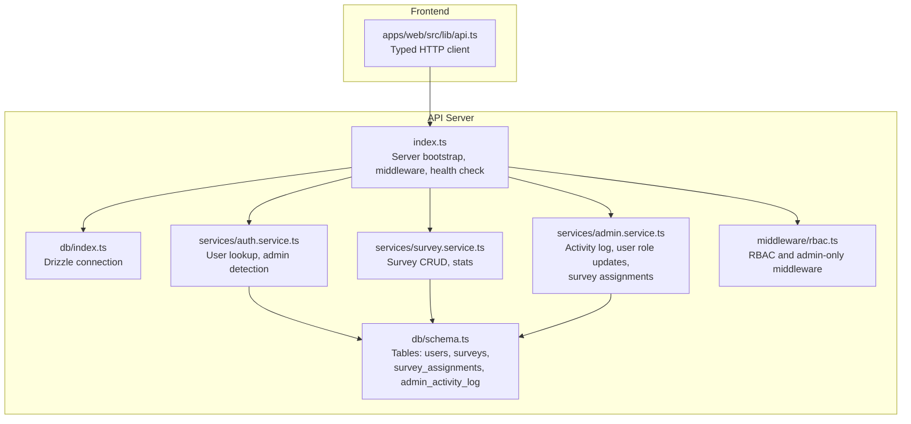
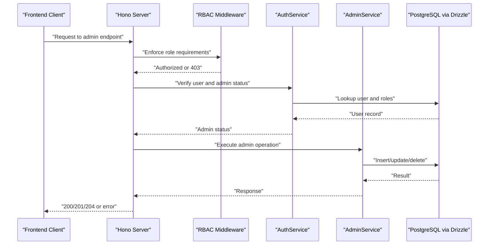
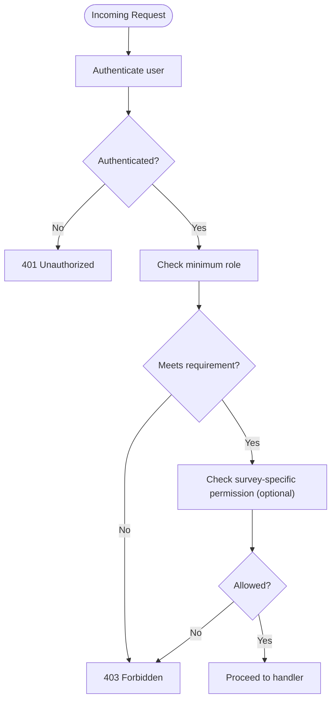
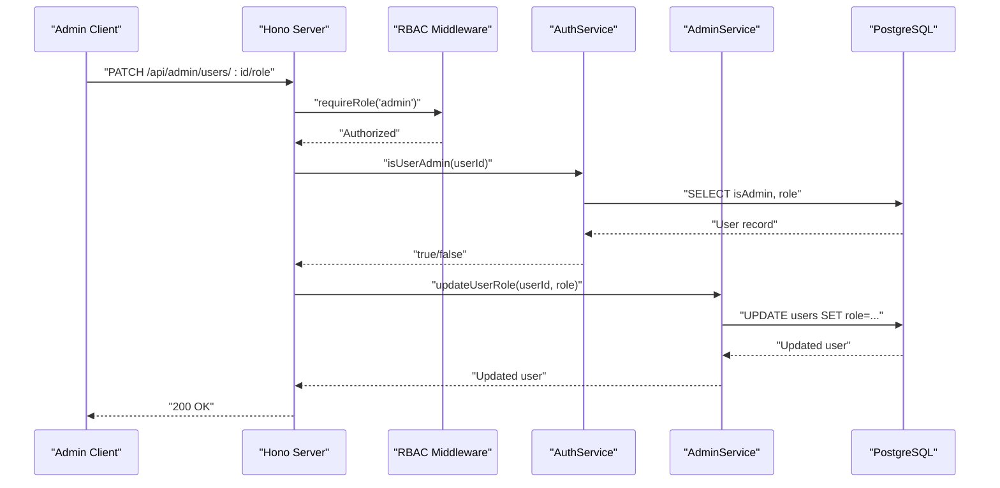
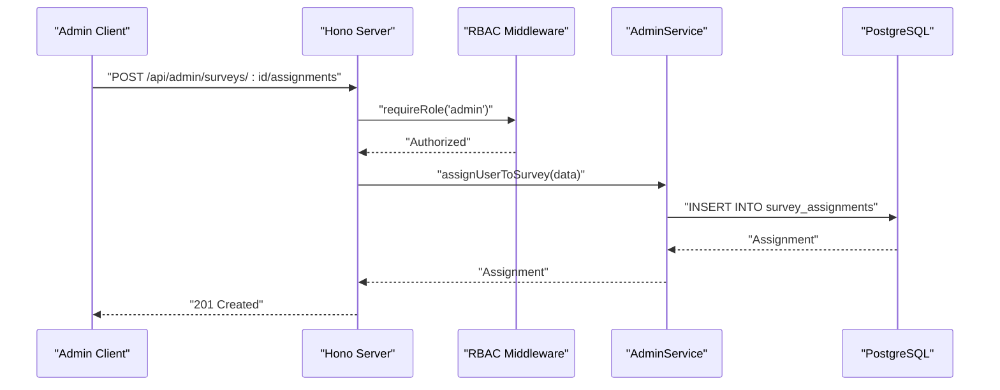
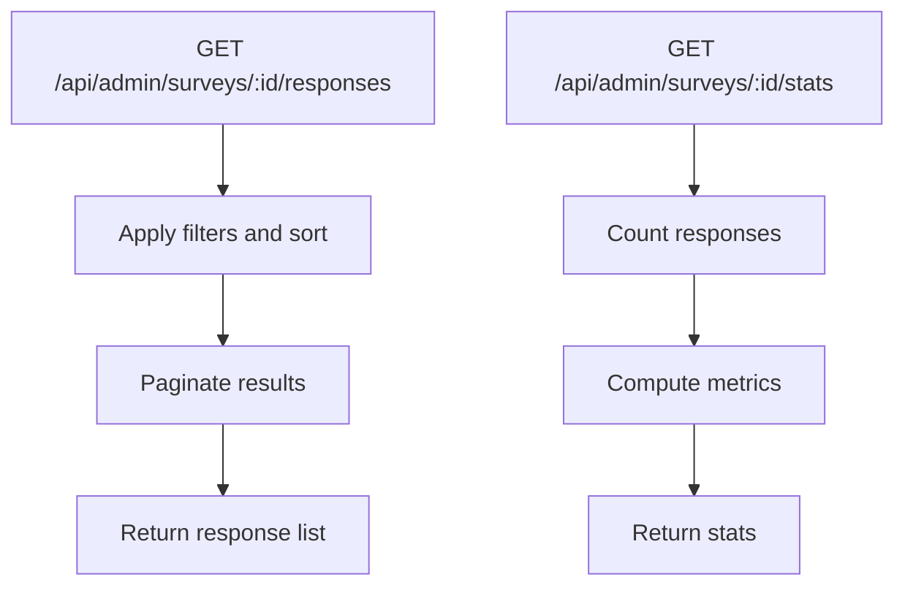
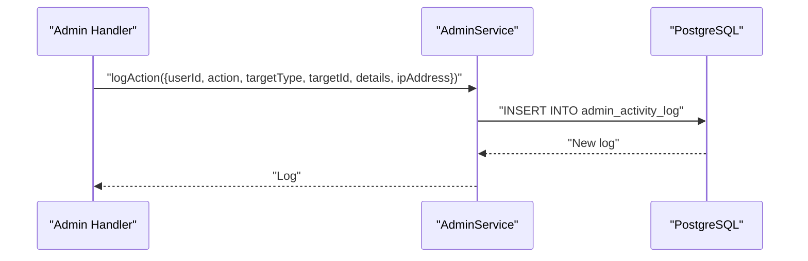
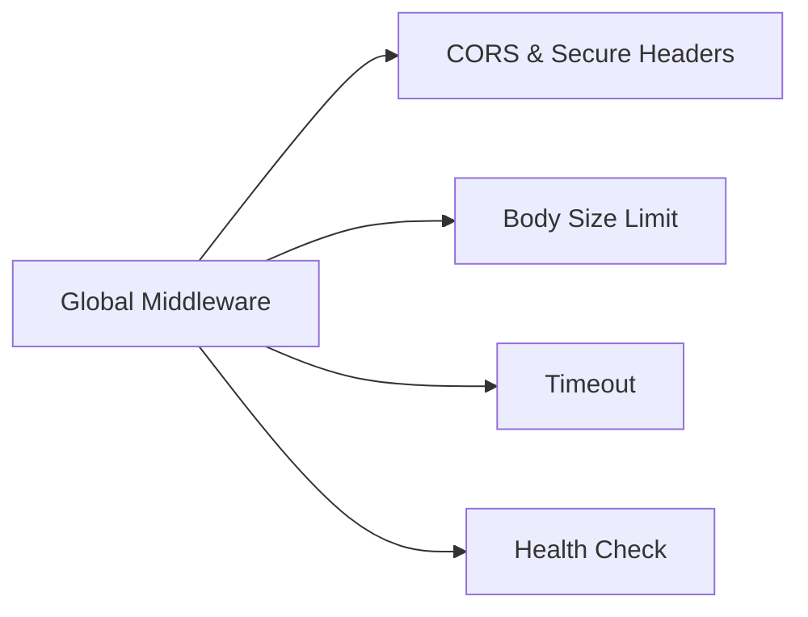
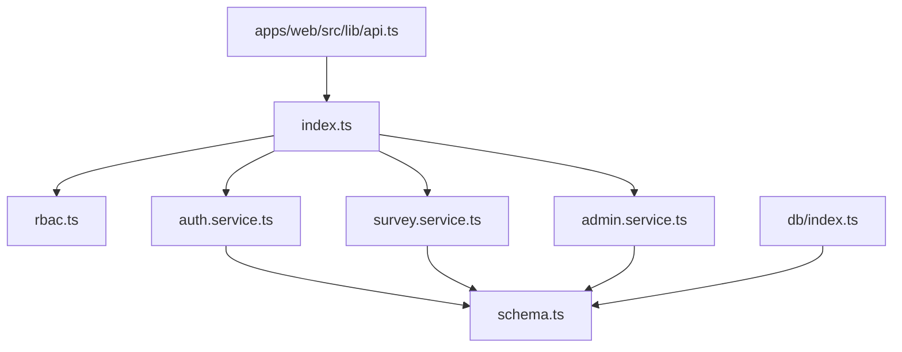

# Admin Endpoints

<cite>
**Referenced Files in This Document**
- [index.ts](file://apps/api/src/index.ts)
- [schema.ts](file://apps/api/src/db/schema.ts)
- [db/index.ts](file://apps/api/src/db/index.ts)
- [auth.service.ts](file://apps/api/src/services/auth.service.ts)
- [survey.service.ts](file://apps/api/src/services/survey.service.ts)
- [admin.service.ts](file://apps/api/src/services/admin.service.ts)
- [rbac.ts](file://apps/api/src/middleware/rbac.ts)
- [user.ts](file://packages/shared/src/types/user.ts)
- [api.ts](file://apps/web/src/lib/api.ts)
- [plan.md](file://plan.md)
</cite>

## Table of Contents
1. [Introduction](#introduction)
2. [Project Structure](#project-structure)
3. [Core Components](#core-components)
4. [Architecture Overview](#architecture-overview)
5. [Detailed Component Analysis](#detailed-component-analysis)
6. [Dependency Analysis](#dependency-analysis)
7. [Performance Considerations](#performance-considerations)
8. [Troubleshooting Guide](#troubleshooting-guide)
9. [Conclusion](#conclusion)
10. [Appendices](#appendices)

## Introduction
This document provides comprehensive API documentation for administrative endpoints. It covers user management operations (creation, modification, deletion), role assignment, system administration, analytics reporting, user activity monitoring, RBAC integration, permission validation, administrative access controls, admin-only endpoints for system maintenance and data export, practical administrative workflows, bulk operations, and system monitoring endpoints. It also addresses audit logging, activity tracking, administrative security measures, and error handling for administrative operations.

## Project Structure
The administrative capabilities are implemented in the API server using Hono, with Drizzle ORM for PostgreSQL persistence. The frontend client communicates via a typed API client. The plan outlines the intended admin endpoints, while the backend provides foundational services and middleware for RBAC and activity logging.

**Diagram sources**
- [index.ts:1-67](file://apps/api/src/index.ts#L1-L67)
- [db/index.ts:1-9](file://apps/api/src/db/index.ts#L1-L9)
- [schema.ts:1-247](file://apps/api/src/db/schema.ts#L1-L247)
- [auth.service.ts:1-105](file://apps/api/src/services/auth.service.ts#L1-L105)
- [survey.service.ts:1-328](file://apps/api/src/services/survey.service.ts#L1-L328)
- [admin.service.ts:1-127](file://apps/api/src/services/admin.service.ts#L1-L127)
- [rbac.ts:1-56](file://apps/api/src/middleware/rbac.ts#L1-L56)
- [api.ts:1-60](file://apps/web/src/lib/api.ts#L1-L60)

**Section sources**
- [index.ts:1-67](file://apps/api/src/index.ts#L1-L67)
- [db/index.ts:1-9](file://apps/api/src/db/index.ts#L1-L9)
- [schema.ts:1-247](file://apps/api/src/db/schema.ts#L1-L247)
- [api.ts:1-60](file://apps/web/src/lib/api.ts#L1-L60)

## Core Components
- Server bootstrap and middleware: CORS, secure headers, request size limits, timeouts, global error handling, and 404 handling.
- Database schema: Users, surveys, sections, questions, question options, responses, answer values, and admin activity log.
- Services:
  - Authentication service: user lookup/creation, admin privilege detection, user listing.
  - Survey service: survey lifecycle, statistics, and CRUD operations.
  - Admin service: activity logging, user role updates, survey assignments.
- RBAC middleware: role-based access control and admin-only enforcement.
- Frontend API client: standardized HTTP client with token support.

**Section sources**
- [index.ts:11-58](file://apps/api/src/index.ts#L11-L58)
- [schema.ts:41-246](file://apps/api/src/db/schema.ts#L41-L246)
- [auth.service.ts:16-103](file://apps/api/src/services/auth.service.ts#L16-L103)
- [survey.service.ts:74-148](file://apps/api/src/services/survey.service.ts#L74-L148)
- [admin.service.ts:9-125](file://apps/api/src/services/admin.service.ts#L9-L125)
- [rbac.ts:16-32](file://apps/api/src/middleware/rbac.ts#L16-L32)
- [api.ts:7-59](file://apps/web/src/lib/api.ts#L7-L59)

## Architecture Overview
Administrative operations are protected by RBAC middleware and logged to the admin activity log. The server exposes health checks and routes for admin functionality, with services encapsulating database operations.

**Diagram sources**
- [index.ts:11-58](file://apps/api/src/index.ts#L11-L58)
- [rbac.ts:16-32](file://apps/api/src/middleware/rbac.ts#L16-L32)
- [auth.service.ts:73-79](file://apps/api/src/services/auth.service.ts#L73-L79)
- [admin.service.ts:9-125](file://apps/api/src/services/admin.service.ts#L9-L125)
- [db/index.ts:7](file://apps/api/src/db/index.ts#L7)

## Detailed Component Analysis

### Administrative Endpoints Catalog
The following endpoints are defined in the plan and supported by backend services and schema. They are grouped by domain and include HTTP methods, paths, and purpose.

- System Administration
  - GET /api/admin/surveys
    - Purpose: List all surveys (including drafts).
    - Authorization: Admin-only.
    - Notes: Supports filtering by status via query parameters.
  - POST /api/admin/surveys
    - Purpose: Create a new survey.
    - Authorization: Admin-only.
  - PATCH /api/admin/surveys/:id
    - Purpose: Update survey metadata.
    - Authorization: Admin-only.
  - DELETE /api/admin/surveys/:id
    - Purpose: Delete a survey and related data.
    - Authorization: Admin-only.
  - PATCH /api/admin/surveys/:id/status
    - Purpose: Set status to draft, published, or closed.
    - Authorization: Admin-only.

- Sections Management
  - GET /api/admin/surveys/:id/sections
    - Purpose: List sections for a survey.
    - Authorization: Admin-only.
  - POST /api/admin/surveys/:id/sections
    - Purpose: Add a new section.
    - Authorization: Admin-only.
  - PATCH /api/admin/sections/:id
    - Purpose: Update a section.
    - Authorization: Admin-only.
  - DELETE /api/admin/sections/:id
    - Purpose: Delete a section.
    - Authorization: Admin-only.
  - PUT /api/admin/surveys/:id/sections/reorder
    - Purpose: Reorder sections transactionally.
    - Authorization: Admin-only.

- Questions Management
  - GET /api/admin/sections/:id/questions
    - Purpose: List questions for a section.
    - Authorization: Admin-only.
  - POST /api/admin/sections/:id/questions
    - Purpose: Add a new question.
    - Authorization: Admin-only.
  - PATCH /api/admin/questions/:id
    - Purpose: Update a question.
    - Authorization: Admin-only.
  - DELETE /api/admin/questions/:id
    - Purpose: Delete a question.
    - Authorization: Admin-only.
  - PUT /api/admin/sections/:id/questions/reorder
    - Purpose: Reorder questions transactionally.
    - Authorization: Admin-only.

- Options Management
  - POST /api/admin/questions/:id/options
    - Purpose: Add an option to a question.
    - Authorization: Admin-only.
  - PATCH /api/admin/options/:id
    - Purpose: Update an option.
    - Authorization: Admin-only.
  - DELETE /api/admin/options/:id
    - Purpose: Delete an option.
    - Authorization: Admin-only.

- Responses and Analytics
  - GET /api/admin/surveys/:id/responses
    - Purpose: List responses with filters and sorting.
    - Authorization: Admin-only.
  - GET /api/admin/surveys/:id/stats
    - Purpose: Retrieve survey statistics.
    - Authorization: Admin-only.
  - GET /api/admin/surveys/:id/export/csv
    - Purpose: Export responses to CSV.
    - Authorization: Admin-only.

- User Management
  - GET /api/admin/users
    - Purpose: List users.
    - Authorization: Admin-only.
  - PATCH /api/admin/users/:id/role
    - Purpose: Change a user’s role.
    - Authorization: Admin-only.

- Survey Assignment and Permissions
  - POST /api/admin/surveys/:id/assignments
    - Purpose: Assign a user to a survey with permissions.
    - Authorization: Admin-only.
  - PATCH /api/admin/assignments/:id
    - Purpose: Update assignment permissions.
    - Authorization: Admin-only.
  - DELETE /api/admin/assignments/:id
    - Purpose: Remove a survey assignment.
    - Authorization: Admin-only.

- Activity Monitoring and Auditing
  - GET /api/admin/activity-log
    - Purpose: Retrieve admin activity log with pagination.
    - Authorization: Admin-only.

- System Health
  - GET /api/health
    - Purpose: Basic health check.
    - Authorization: Not restricted.

**Section sources**
- [plan.md:479-514](file://plan.md#L479-L514)
- [survey.service.ts:74-148](file://apps/api/src/services/survey.service.ts#L74-L148)
- [admin.service.ts:34-125](file://apps/api/src/services/admin.service.ts#L34-L125)

### RBAC Integration and Permission Validation
- Role hierarchy: admin > editor > viewer > user.
- Admin-only middleware: Enforces admin privileges for sensitive endpoints.
- Survey-specific permissions: Editor/viewer assignments with can_edit, can_view, can_export flags.
- Implementation notes:
  - RBAC middleware is present but currently a placeholder; it must be wired after authentication middleware to enforce role checks.
  - Survey permission checks are implemented as a placeholder and must be connected to the survey_assignments table.

**Diagram sources**
- [rbac.ts:16-32](file://apps/api/src/middleware/rbac.ts#L16-L32)
- [rbac.ts:38-54](file://apps/api/src/middleware/rbac.ts#L38-L54)

**Section sources**
- [rbac.ts:16-32](file://apps/api/src/middleware/rbac.ts#L16-L32)
- [rbac.ts:38-54](file://apps/api/src/middleware/rbac.ts#L38-L54)

### User Management Operations
- Listing users: Returns paginated user records with selected columns.
- Updating user role: Changes a user’s role atomically.
- Admin detection: Determines whether a user has admin privileges.

**Diagram sources**
- [auth.service.ts:73-79](file://apps/api/src/services/auth.service.ts#L73-L79)
- [admin.service.ts:53-59](file://apps/api/src/services/admin.service.ts#L53-L59)
- [rbac.ts:32](file://apps/api/src/middleware/rbac.ts#L32)

**Section sources**
- [auth.service.ts:84-103](file://apps/api/src/services/auth.service.ts#L84-L103)
- [admin.service.ts:53-59](file://apps/api/src/services/admin.service.ts#L53-L59)
- [user.ts:1-22](file://packages/shared/src/types/user.ts#L1-L22)

### Survey Assignments and Permissions
- Assign user to survey: Creates an assignment with role and permissions.
- Update assignment: Adjusts role and permissions.
- Remove assignment: Deletes a survey assignment.
- Retrieve assignments: Lists assignments for a given survey with user details.

**Diagram sources**
- [admin.service.ts:65-87](file://apps/api/src/services/admin.service.ts#L65-L87)
- [rbac.ts:32](file://apps/api/src/middleware/rbac.ts#L32)

**Section sources**
- [admin.service.ts:65-125](file://apps/api/src/services/admin.service.ts#L65-L125)
- [schema.ts:75-99](file://apps/api/src/db/schema.ts#L75-L99)

### Analytics Reporting and Data Export
- Responses listing: Paginated, filterable, sortable.
- Statistics: Includes response counts and derived metrics.
- CSV export: Endpoint for exporting responses.

**Diagram sources**
- [survey.service.ts:48-58](file://apps/api/src/services/survey.service.ts#L48-L58)
- [survey.service.ts:74-86](file://apps/api/src/services/survey.service.ts#L74-L86)

**Section sources**
- [survey.service.ts:48-58](file://apps/api/src/services/survey.service.ts#L48-L58)
- [survey.service.ts:74-86](file://apps/api/src/services/survey.service.ts#L74-L86)

### Activity Logging and Monitoring
- Admin actions are logged with user, action, target type/id, details, and IP address.
- Activity log retrieval supports pagination and includes user details.

**Diagram sources**
- [admin.service.ts:9-29](file://apps/api/src/services/admin.service.ts#L9-L29)
- [schema.ts:228-246](file://apps/api/src/db/schema.ts#L228-L246)

**Section sources**
- [admin.service.ts:9-48](file://apps/api/src/services/admin.service.ts#L9-L48)
- [schema.ts:228-246](file://apps/api/src/db/schema.ts#L228-L246)

### Administrative Access Controls
- CORS and security headers are applied globally.
- Request size limit and timeout are enforced for API routes.
- Health check endpoint is publicly accessible.

**Diagram sources**
- [index.ts:12-37](file://apps/api/src/index.ts#L12-L37)
- [index.ts:40-42](file://apps/api/src/index.ts#L40-L42)

**Section sources**
- [index.ts:12-37](file://apps/api/src/index.ts#L12-L37)
- [index.ts:40-42](file://apps/api/src/index.ts#L40-L42)

### Practical Administrative Workflows
- Bulk operations:
  - Reordering sections and questions: Send arrays of { id, orderIndex } to PUT endpoints.
  - Exporting responses: Call CSV export endpoint for a survey.
- System maintenance:
  - Publishing surveys: PATCH /api/admin/surveys/:id/status with published.
  - Closing surveys: PATCH /api/admin/surveys/:id/status with closed.
- User management:
  - Promote/demote users: PATCH /api/admin/users/:id/role.
  - Assign editors/viewers: POST /api/admin/surveys/:id/assignments with appropriate permissions.

**Section sources**
- [survey.service.ts:195-202](file://apps/api/src/services/survey.service.ts#L195-L202)
- [survey.service.ts:278-285](file://apps/api/src/services/survey.service.ts#L278-L285)
- [survey.service.ts:129-141](file://apps/api/src/services/survey.service.ts#L129-L141)
- [admin.service.ts:65-87](file://apps/api/src/services/admin.service.ts#L65-L87)

## Dependency Analysis
- Server depends on middleware, services, and database connection.
- Services depend on the schema for queries and mutations.
- RBAC middleware depends on authenticated user context.
- Frontend client depends on server base URL and token header.

**Diagram sources**
- [index.ts:1-67](file://apps/api/src/index.ts#L1-L67)
- [rbac.ts:1-56](file://apps/api/src/middleware/rbac.ts#L1-L56)
- [auth.service.ts:1-105](file://apps/api/src/services/auth.service.ts#L1-L105)
- [survey.service.ts:1-328](file://apps/api/src/services/survey.service.ts#L1-L328)
- [admin.service.ts:1-127](file://apps/api/src/services/admin.service.ts#L1-L127)
- [db/index.ts:1-9](file://apps/api/src/db/index.ts#L1-L9)
- [schema.ts:1-247](file://apps/api/src/db/schema.ts#L1-L247)
- [api.ts:1-60](file://apps/web/src/lib/api.ts#L1-L60)

**Section sources**
- [index.ts:1-67](file://apps/api/src/index.ts#L1-L67)
- [db/index.ts:1-9](file://apps/api/src/db/index.ts#L1-L9)
- [schema.ts:1-247](file://apps/api/src/db/schema.ts#L1-L247)

## Performance Considerations
- Use pagination for listing users and activity logs to avoid large payloads.
- Apply filters for responses listing to reduce dataset size.
- Batch reordering operations (sections and questions) in a single request to minimize round trips.
- Monitor database indexes for frequently queried columns (e.g., user_id, created_at).

## Troubleshooting Guide
- 401 Unauthorized: Missing or invalid authentication token.
- 403 Forbidden: Insufficient role or missing survey-specific permission.
- 404 Not Found: Endpoint does not exist or resource not found.
- 413 Payload Too Large: Request body exceeds 100 KB limit.
- 408 Request Timeout: Request exceeded 10-second timeout.
- 500 Internal Server Error: Unhandled server error; check server logs.

Operational tips:
- Verify RBAC middleware is applied after authentication.
- Confirm database connectivity and migrations are applied.
- Ensure frontend sets Authorization header for admin endpoints.

**Section sources**
- [index.ts:25-37](file://apps/api/src/index.ts#L25-L37)
- [index.ts:49-58](file://apps/api/src/index.ts#L49-L58)
- [rbac.ts:16-26](file://apps/api/src/middleware/rbac.ts#L16-L26)

## Conclusion
The administrative API provides a robust foundation for managing surveys, users, and permissions, with built-in RBAC and comprehensive audit logging. By enforcing admin-only access, applying request limits and timeouts, and leveraging paginated and filtered endpoints, administrators can efficiently operate the system while maintaining strong security and observability.

## Appendices

### Endpoint Reference Summary
- Admin-only endpoints: All endpoints under /api/admin require admin privileges.
- Public endpoint: GET /api/health for basic system health.
- Pagination defaults: Activity logs and user listings default to 50 items with offset 0.

**Section sources**
- [plan.md:479-514](file://plan.md#L479-L514)
- [admin.service.ts:34-48](file://apps/api/src/services/admin.service.ts#L34-L48)
- [auth.service.ts:84-103](file://apps/api/src/services/auth.service.ts#L84-L103)