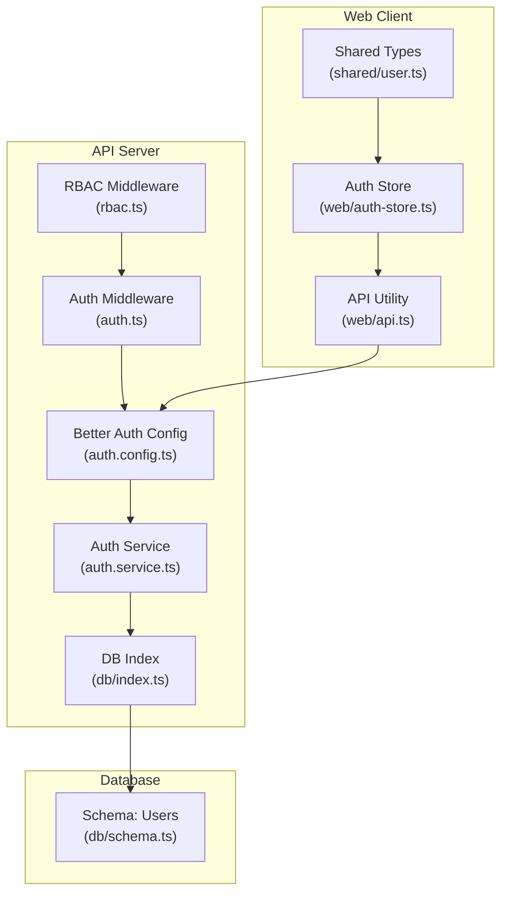
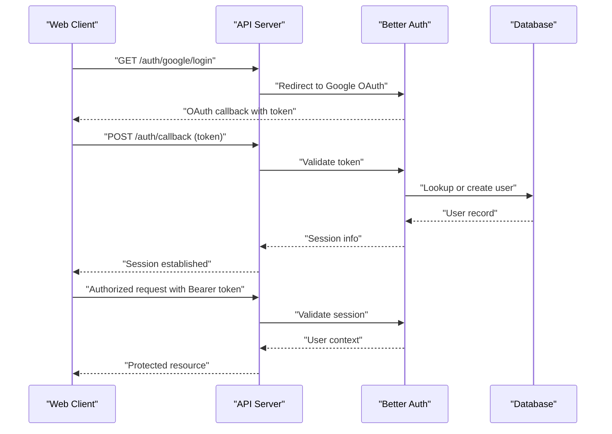
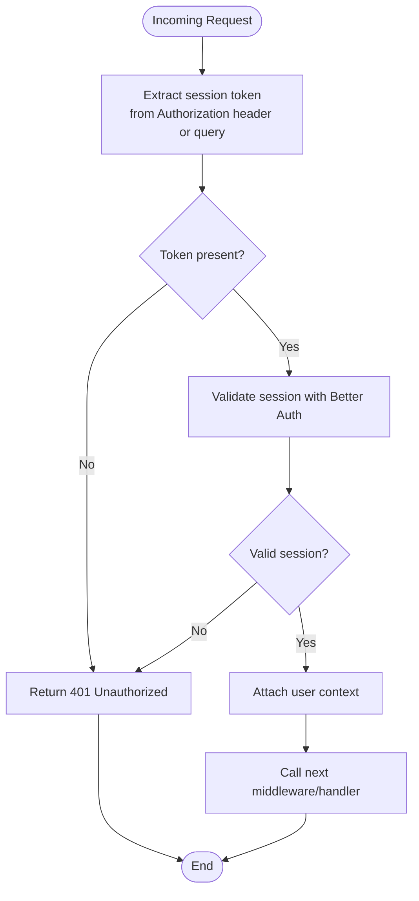
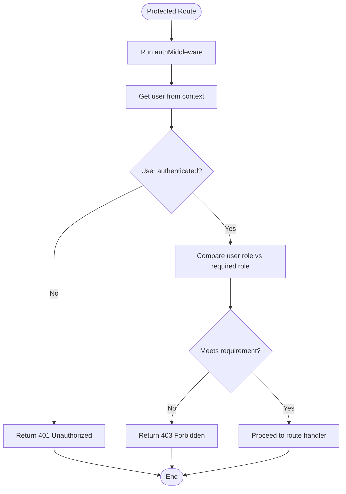
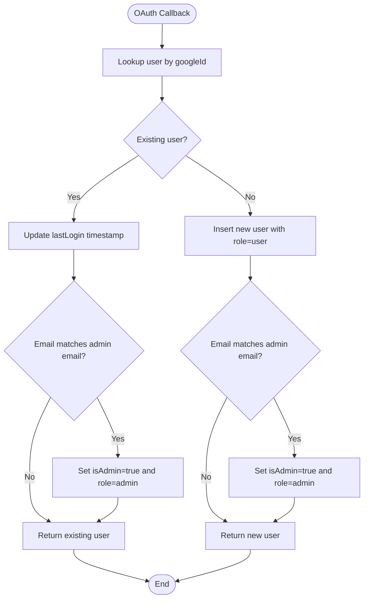
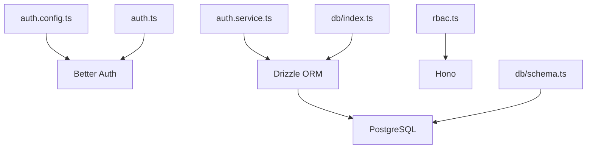

# Authentication Endpoints

<cite>
**Referenced Files in This Document**
- [auth.config.ts](file://apps/api/src/lib/auth.config.ts)
- [auth.service.ts](file://apps/api/src/services/auth.service.ts)
- [auth.ts](file://apps/api/src/middleware/auth.ts)
- [rbac.ts](file://apps/api/src/middleware/rbac.ts)
- [index.ts](file://apps/api/src/index.ts)
- [schema.ts](file://apps/api/src/db/schema.ts)
- [index.ts](file://apps/api/src/db/index.ts)
- [api.ts](file://apps/web/src/lib/api.ts)
- [auth-store.ts](file://apps/web/src/stores/auth-store.ts)
- [user.ts](file://packages/shared/src/types/user.ts)
</cite>

## Table of Contents
1. [Introduction](#introduction)
2. [Project Structure](#project-structure)
3. [Core Components](#core-components)
4. [Architecture Overview](#architecture-overview)
5. [Detailed Component Analysis](#detailed-component-analysis)
6. [Dependency Analysis](#dependency-analysis)
7. [Performance Considerations](#performance-considerations)
8. [Troubleshooting Guide](#troubleshooting-guide)
9. [Conclusion](#conclusion)
10. [Appendices](#appendices)

## Introduction
This document provides comprehensive API documentation for authentication endpoints in the project. It covers Google OAuth integration, session management, and authentication middleware. It also documents endpoint specifications for login, logout, user registration, and session validation, along with request/response schemas, token handling, session persistence, role-based access control (RBAC), and security considerations. Practical examples, error handling strategies, and client-side implementation patterns are included, alongside guidance on token refresh mechanisms, session expiration, and security best practices.

## Project Structure
The authentication system spans the API server, database schema, and the web client:
- API server initializes Better Auth with Google OAuth and session configuration.
- Middleware enforces authentication and optional auth checks.
- RBAC middleware defines role-based access control placeholders.
- Database schema defines user roles and related metadata.
- Web client manages session tokens via Authorization headers and Zustand store.

**Diagram sources**
- [auth.config.ts:1-42](file://apps/api/src/lib/auth.config.ts#L1-L42)
- [auth.ts:1-53](file://apps/api/src/middleware/auth.ts#L1-L53)
- [rbac.ts:1-56](file://apps/api/src/middleware/rbac.ts#L1-L56)
- [auth.service.ts:1-105](file://apps/api/src/services/auth.service.ts#L1-L105)
- [index.ts:1-9](file://apps/api/src/db/index.ts#L1-L9)
- [schema.ts:41-51](file://apps/api/src/db/schema.ts#L41-L51)
- [api.ts:1-60](file://apps/web/src/lib/api.ts#L1-L60)
- [auth-store.ts:1-31](file://apps/web/src/stores/auth-store.ts#L1-L31)
- [user.ts:1-22](file://packages/shared/src/types/user.ts#L1-L22)

**Section sources**
- [auth.config.ts:1-42](file://apps/api/src/lib/auth.config.ts#L1-L42)
- [auth.ts:1-53](file://apps/api/src/middleware/auth.ts#L1-L53)
- [rbac.ts:1-56](file://apps/api/src/middleware/rbac.ts#L1-L56)
- [auth.service.ts:1-105](file://apps/api/src/services/auth.service.ts#L1-L105)
- [index.ts:1-9](file://apps/api/src/db/index.ts#L1-L9)
- [schema.ts:41-51](file://apps/api/src/db/schema.ts#L41-L51)
- [api.ts:1-60](file://apps/web/src/lib/api.ts#L1-L60)
- [auth-store.ts:1-31](file://apps/web/src/stores/auth-store.ts#L1-L31)
- [user.ts:1-22](file://packages/shared/src/types/user.ts#L1-L22)

## Core Components
- Better Auth configuration enables Google OAuth, session caching, and user fields including isAdmin and role.
- Auth service manages user creation/updating and admin privilege assignment.
- Auth middleware validates session tokens via Authorization header or query parameter placeholder.
- RBAC middleware defines role hierarchy and placeholders for enforcing minimum roles and survey-specific permissions.
- Database schema defines user roles and related metadata.
- Web client sends Authorization Bearer tokens and persists session state.

Key implementation references:
- Better Auth config: [auth.config.ts:5-39](file://apps/api/src/lib/auth.config.ts#L5-L39)
- Auth service user creation: [auth.service.ts:16-58](file://apps/api/src/services/auth.service.ts#L16-L58)
- Auth middleware token extraction: [auth.ts:12-14](file://apps/api/src/middleware/auth.ts#L12-L14)
- RBAC role hierarchy: [rbac.ts:5-10](file://apps/api/src/middleware/rbac.ts#L5-L10)
- User schema fields: [schema.ts:41-51](file://apps/api/src/db/schema.ts#L41-L51)
- Client API utility: [api.ts:15-17](file://apps/web/src/lib/api.ts#L15-L17)
- Auth store state: [auth-store.ts:13-30](file://apps/web/src/stores/auth-store.ts#L13-L30)

**Section sources**
- [auth.config.ts:5-39](file://apps/api/src/lib/auth.config.ts#L5-L39)
- [auth.service.ts:16-58](file://apps/api/src/services/auth.service.ts#L16-L58)
- [auth.ts:12-14](file://apps/api/src/middleware/auth.ts#L12-L14)
- [rbac.ts:5-10](file://apps/api/src/middleware/rbac.ts#L5-L10)
- [schema.ts:41-51](file://apps/api/src/db/schema.ts#L41-L51)
- [api.ts:15-17](file://apps/web/src/lib/api.ts#L15-L17)
- [auth-store.ts:13-30](file://apps/web/src/stores/auth-store.ts#L13-L30)

## Architecture Overview
The authentication flow integrates Google OAuth with Better Auth, session management, and RBAC enforcement. The web client authenticates via Google OAuth, receives a session token, and sends it in subsequent requests via the Authorization header. The API validates sessions and enforces role-based access control.

**Diagram sources**
- [auth.config.ts:10-15](file://apps/api/src/lib/auth.config.ts#L10-L15)
- [auth.ts:12-14](file://apps/api/src/middleware/auth.ts#L12-L14)
- [auth.service.ts:16-58](file://apps/api/src/services/auth.service.ts#L16-L58)

## Detailed Component Analysis

### Google OAuth Integration
- Better Auth is configured with Google OAuth client credentials and secret.
- Base URL and session secret are configured for cross-origin and secure cookies.
- Session caching reduces repeated validation overhead; sessions update periodically.

Implementation references:
- OAuth provider config: [auth.config.ts:10-15](file://apps/api/src/lib/auth.config.ts#L10-L15)
- Session settings: [auth.config.ts:18-24](file://apps/api/src/lib/auth.config.ts#L18-L24)
- Base URL and secret: [auth.config.ts:16-17](file://apps/api/src/lib/auth.config.ts#L16-L17)

Security considerations:
- Ensure HTTPS in production and configure CORS origins.
- Store client secrets securely and rotate regularly.
- Validate redirect URIs and enforce PKCE for enhanced security.

**Section sources**
- [auth.config.ts:10-15](file://apps/api/src/lib/auth.config.ts#L10-L15)
- [auth.config.ts:16-24](file://apps/api/src/lib/auth.config.ts#L16-L24)

### Session Management
- Sessions are validated via Authorization header or query parameter placeholder.
- Session cache improves performance; sessions update periodically.
- Logout is not yet implemented in the current codebase.

Implementation references:
- Token extraction: [auth.ts:12-14](file://apps/api/src/middleware/auth.ts#L12-L14)
- Session cache: [auth.config.ts:18-22](file://apps/api/src/lib/auth.config.ts#L18-L22)
- Session update interval: [auth.config.ts:23-23](file://apps/api/src/lib/auth.config.ts#L23-L23)

Token handling:
- Clients send Authorization: Bearer <token>.
- Query parameter session_token is supported for compatibility.

**Section sources**
- [auth.ts:12-14](file://apps/api/src/middleware/auth.ts#L12-L14)
- [auth.config.ts:18-23](file://apps/api/src/lib/auth.config.ts#L18-L23)

### Authentication Middleware
- Enforces session validation and attaches user context.
- Optional auth allows unauthenticated requests while attempting to resolve user context.
- Proxy verification middleware guards internal endpoints.

Implementation references:
- Auth middleware: [auth.ts:10-25](file://apps/api/src/middleware/auth.ts#L10-L25)
- Optional auth: [auth.ts:30-39](file://apps/api/src/middleware/auth.ts#L30-L39)
- Proxy verification: [auth.ts:44-52](file://apps/api/src/middleware/auth.ts#L44-L52)

**Diagram sources**
- [auth.ts:10-25](file://apps/api/src/middleware/auth.ts#L10-L25)

**Section sources**
- [auth.ts:10-25](file://apps/api/src/middleware/auth.ts#L10-L25)
- [auth.ts:30-39](file://apps/api/src/middleware/auth.ts#L30-L39)
- [auth.ts:44-52](file://apps/api/src/middleware/auth.ts#L44-L52)

### Role-Based Access Control (RBAC)
- Defines role hierarchy and placeholders for enforcing minimum roles.
- Admin-only shortcut and survey-specific permission checks are provided as templates.

Implementation references:
- Role hierarchy: [rbac.ts:5-10](file://apps/api/src/middleware/rbac.ts#L5-L10)
- Require role: [rbac.ts:16-26](file://apps/api/src/middleware/rbac.ts#L16-L26)
- Admin-only: [rbac.ts:32-32](file://apps/api/src/middleware/rbac.ts#L32-L32)
- Survey permission: [rbac.ts:38-55](file://apps/api/src/middleware/rbac.ts#L38-L55)

**Diagram sources**
- [rbac.ts:16-26](file://apps/api/src/middleware/rbac.ts#L16-L26)

**Section sources**
- [rbac.ts:5-10](file://apps/api/src/middleware/rbac.ts#L5-L10)
- [rbac.ts:16-26](file://apps/api/src/middleware/rbac.ts#L16-L26)
- [rbac.ts:32-32](file://apps/api/src/middleware/rbac.ts#L32-L32)
- [rbac.ts:38-55](file://apps/api/src/middleware/rbac.ts#L38-L55)

### User Registration and Admin Privileges
- On first login via Google OAuth, users are created with role=user.
- If the email matches the configured admin email, the user is elevated to admin.
- Last login timestamp is updated on subsequent logins.

Implementation references:
- Find or create user: [auth.service.ts:16-58](file://apps/api/src/services/auth.service.ts#L16-L58)
- Admin privilege assignment: [auth.service.ts:33-40](file://apps/api/src/services/auth.service.ts#L33-L40)
- Last login update: [auth.service.ts:28-31](file://apps/api/src/services/auth.service.ts#L28-L31)

**Diagram sources**
- [auth.service.ts:16-58](file://apps/api/src/services/auth.service.ts#L16-L58)

**Section sources**
- [auth.service.ts:16-58](file://apps/api/src/services/auth.service.ts#L16-L58)

### Database Schema for Users
- Users table includes identifiers, profile fields, role enumeration, admin flag, timestamps, and indexes.
- Role enumeration supports admin, editor, viewer, and user.

Implementation references:
- User table definition: [schema.ts:41-51](file://apps/api/src/db/schema.ts#L41-L51)
- Role enum: [schema.ts:19-19](file://apps/api/src/db/schema.ts#L19-L19)

**Section sources**
- [schema.ts:41-51](file://apps/api/src/db/schema.ts#L41-L51)
- [schema.ts:19-19](file://apps/api/src/db/schema.ts#L19-L19)

### Client-Side Implementation Patterns
- The web client sets Authorization: Bearer <token> on requests.
- The auth store tracks user state and authentication status.
- Shared types define SessionUser for frontend consumption.

Implementation references:
- Authorization header: [api.ts:15-17](file://apps/web/src/lib/api.ts#L15-L17)
- Auth store state: [auth-store.ts:13-30](file://apps/web/src/stores/auth-store.ts#L13-L30)
- SessionUser type: [user.ts:15-21](file://packages/shared/src/types/user.ts#L15-L21)

**Section sources**
- [api.ts:15-17](file://apps/web/src/lib/api.ts#L15-L17)
- [auth-store.ts:13-30](file://apps/web/src/stores/auth-store.ts#L13-L30)
- [user.ts:15-21](file://packages/shared/src/types/user.ts#L15-L21)

## Dependency Analysis
The authentication system depends on Better Auth for OAuth and session management, Drizzle ORM for database access, and Hono for middleware and routing.

**Diagram sources**
- [auth.config.ts:1-2](file://apps/api/src/lib/auth.config.ts#L1-L2)
- [auth.service.ts:1-3](file://apps/api/src/services/auth.service.ts#L1-L3)
- [auth.ts:1-5](file://apps/api/src/middleware/auth.ts#L1-L5)
- [rbac.ts:1-1](file://apps/api/src/middleware/rbac.ts#L1-L1)
- [index.ts:1-8](file://apps/api/src/db/index.ts#L1-L8)
- [schema.ts:1-13](file://apps/api/src/db/schema.ts#L1-L13)

**Section sources**
- [auth.config.ts:1-2](file://apps/api/src/lib/auth.config.ts#L1-L2)
- [auth.service.ts:1-3](file://apps/api/src/services/auth.service.ts#L1-L3)
- [auth.ts:1-5](file://apps/api/src/middleware/auth.ts#L1-L5)
- [rbac.ts:1-1](file://apps/api/src/middleware/rbac.ts#L1-L1)
- [index.ts:1-8](file://apps/api/src/db/index.ts#L1-L8)
- [schema.ts:1-13](file://apps/api/src/db/schema.ts#L1-L13)

## Performance Considerations
- Session cache: Enable and tune cookieCache to reduce session validation overhead.
- Session update age: Periodic updates prevent stale sessions while minimizing load.
- Database indexing: Ensure indexes on user identifiers (e.g., googleId, email) for fast lookups.
- Request size limits and timeouts: Prevent abuse and improve responsiveness.

References:
- Session cache: [auth.config.ts:18-22](file://apps/api/src/lib/auth.config.ts#L18-L22)
- Session update age: [auth.config.ts:23-23](file://apps/api/src/lib/auth.config.ts#L23-L23)
- User indexes: [schema.ts:43-44](file://apps/api/src/db/schema.ts#L43-L44)

**Section sources**
- [auth.config.ts:18-23](file://apps/api/src/lib/auth.config.ts#L18-L23)
- [schema.ts:43-44](file://apps/api/src/db/schema.ts#L43-L44)

## Troubleshooting Guide
Common issues and resolutions:
- Missing session token: Ensure Authorization header is set or session_token query parameter is provided.
- Invalid session token: Validate token signature and expiration with Better Auth.
- CORS errors: Confirm frontend URL and allowed headers/methods in CORS configuration.
- RBAC failures: Verify user role hierarchy and that authMiddleware runs before RBAC middleware.
- Database connectivity: Check DATABASE_URL and connection pool settings.

References:
- Token extraction: [auth.ts:12-14](file://apps/api/src/middleware/auth.ts#L12-L14)
- CORS configuration: [index.ts:13-22](file://apps/api/src/index.ts#L13-L22)
- RBAC ordering: [rbac.ts:16-26](file://apps/api/src/middleware/rbac.ts#L16-L26)
- DB connection: [index.ts:1-8](file://apps/api/src/db/index.ts#L1-L8)

**Section sources**
- [auth.ts:12-14](file://apps/api/src/middleware/auth.ts#L12-L14)
- [index.ts:13-22](file://apps/api/src/index.ts#L13-L22)
- [rbac.ts:16-26](file://apps/api/src/middleware/rbac.ts#L16-L26)
- [index.ts:1-8](file://apps/api/src/db/index.ts#L1-L8)

## Conclusion
The authentication system leverages Better Auth for robust Google OAuth and session management, with middleware enforcing authentication and RBAC policies. The web client integrates seamlessly by sending Authorization headers and maintaining session state. Security best practices, performance tuning, and clear error handling are emphasized to ensure a reliable and scalable authentication experience.

## Appendices

### Endpoint Specifications
Note: The following endpoints are placeholders pending implementation. Replace with actual routes when implemented.

- POST /api/auth/login
  - Purpose: Initiate Google OAuth login.
  - Headers: None required.
  - Body: Empty.
  - Response: Redirect to Google OAuth consent page.

- POST /api/auth/callback
  - Purpose: Handle OAuth callback and establish session.
  - Headers: Content-Type: application/json.
  - Body: { token: string }.
  - Response: { user: SessionUser, sessionToken: string }.

- POST /api/auth/logout
  - Purpose: Invalidate current session.
  - Headers: Authorization: Bearer <token>.
  - Body: Empty.
  - Response: { message: string }.

- GET /api/auth/session
  - Purpose: Validate session and return user info.
  - Headers: Authorization: Bearer <token>.
  - Body: Empty.
  - Response: { user: SessionUser }.

- GET /api/auth/health
  - Purpose: Health check for authentication service.
  - Headers: None.
  - Body: Empty.
  - Response: { status: "ok", timestamp: string }.

### Request/Response Schemas
- Login request: Empty body.
- Callback request: { token: string }.
- Logout request: Empty body.
- Session validation request: Empty body.
- Success responses: Standardized with user data and optional session token.
- Error responses: { error: string } with appropriate HTTP status codes.

### Token Handling and Session Persistence
- Clients store session tokens and send Authorization: Bearer <token> on protected requests.
- Sessions persist across browser sessions with cookie-based storage managed by Better Auth.
- Session refresh occurs automatically based on updateAge configuration.

### Role-Based Access Control Integration
- Apply requireRole or adminOnly middleware after authMiddleware.
- User roles: admin, editor, viewer, user.
- Survey-specific permissions can be enforced using requireSurveyPermission.

### Security Considerations
- Use HTTPS in production.
- Configure CORS origins and credentials carefully.
- Store secrets in environment variables.
- Validate OAuth redirect URIs and enforce PKCE.
- Monitor and log authentication events.
- Regularly rotate secrets and review admin privileges.