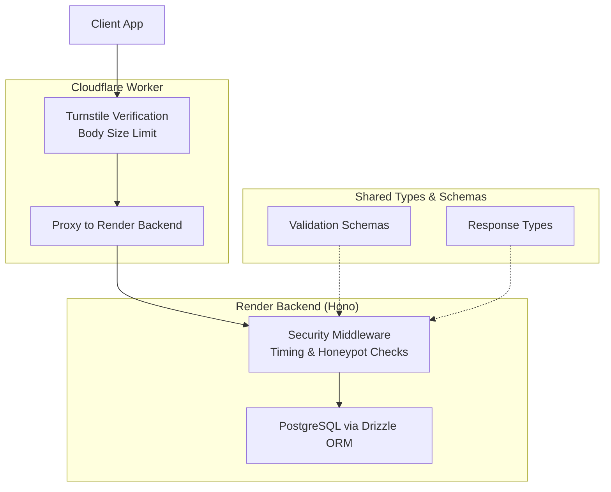
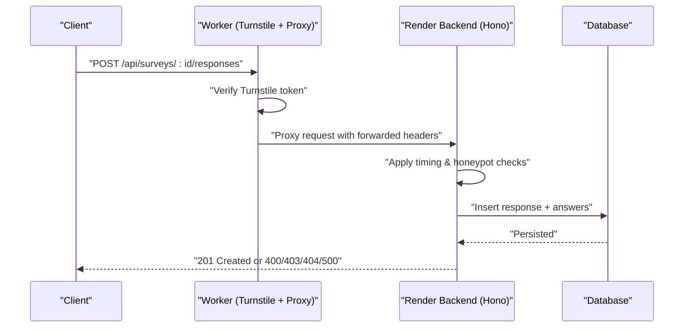
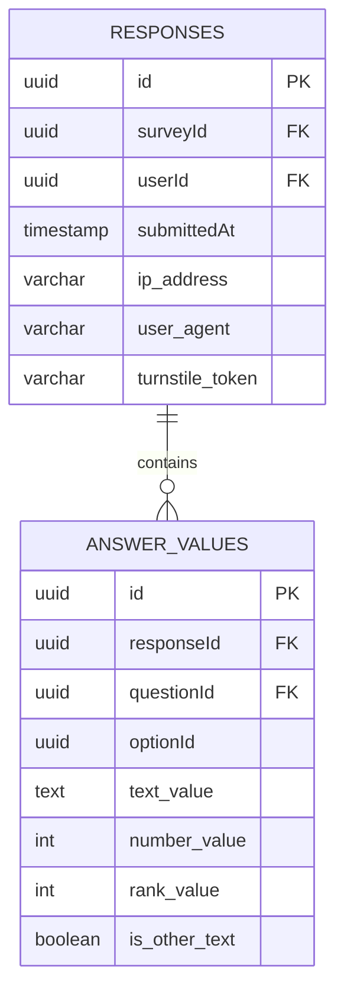
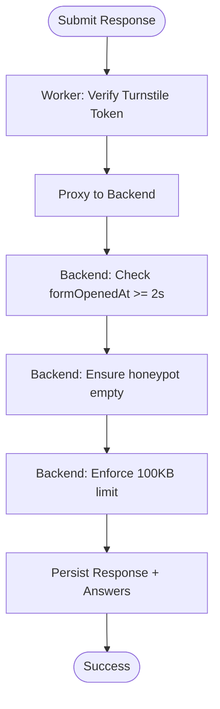
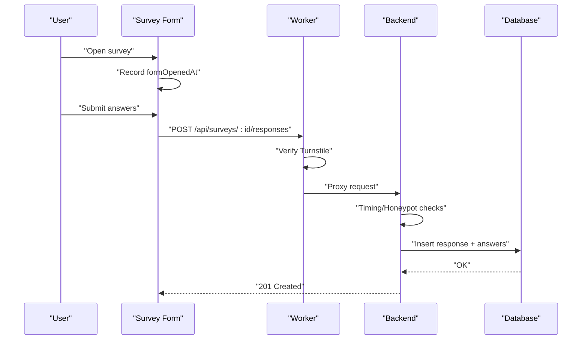
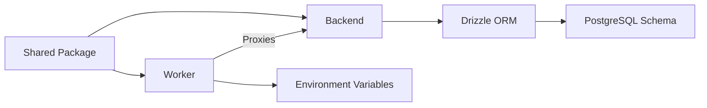

# Response Collection Endpoints

<cite>
**Referenced Files in This Document**
- [apps/api/src/index.ts](file://apps/api/src/index.ts)
- [apps/api/src/db/schema.ts](file://apps/api/src/db/schema.ts)
- [apps/api/src/db/index.ts](file://apps/api/src/db/index.ts)
- [apps/api/src/middleware/security.ts](file://apps/api/src/middleware/security.ts)
- [apps/worker/src/index.ts](file://apps/worker/src/index.ts)
- [packages/shared/src/schemas/response.schema.ts](file://packages/shared/src/schemas/response.schema.ts)
- [packages/shared/src/types/response.ts](file://packages/shared/src/types/response.ts)
- [packages/shared/src/schemas/question.schema.ts](file://packages/shared/src/schemas/question.schema.ts)
- [packages/shared/src/types/survey.ts](file://packages/shared/src/types/survey.ts)
- [plan.md](file://plan.md)
</cite>

## Table of Contents
1. [Introduction](#introduction)
2. [Project Structure](#project-structure)
3. [Core Components](#core-components)
4. [Architecture Overview](#architecture-overview)
5. [Detailed Component Analysis](#detailed-component-analysis)
6. [Dependency Analysis](#dependency-analysis)
7. [Performance Considerations](#performance-considerations)
8. [Troubleshooting Guide](#troubleshooting-guide)
9. [Conclusion](#conclusion)
10. [Appendices](#appendices)

## Introduction
This document provides comprehensive API documentation for response collection endpoints. It covers:
- Endpoint specifications for submitting survey responses, retrieving individual responses, and administrative bulk operations
- Validation rules, duplicate prevention, and data sanitization
- Request/response schemas for different question types and response formats
- Submission workflows, real-time validation, and error handling
- Practical examples for response collection scenarios, batch operations, and data export
- Analytics and aggregation endpoints, plus performance considerations for high-volume response collection

## Project Structure
The response collection system spans three layers:
- Frontend proxy and security enforcement via Cloudflare Worker
- Render backend (Hono) exposing REST endpoints
- Shared validation schemas and type definitions

**Diagram sources**
- [apps/worker/src/index.ts:42-79](file://apps/worker/src/index.ts#L42-L79)
- [apps/worker/src/index.ts:81-103](file://apps/worker/src/index.ts#L81-L103)
- [apps/api/src/index.ts:25-37](file://apps/api/src/index.ts#L25-L37)
- [apps/api/src/middleware/security.ts:7-53](file://apps/api/src/middleware/security.ts#L7-L53)
- [apps/api/src/db/index.ts:1-9](file://apps/api/src/db/index.ts#L1-L9)
- [packages/shared/src/schemas/response.schema.ts:1-24](file://packages/shared/src/schemas/response.schema.ts#L1-L24)
- [packages/shared/src/types/response.ts:1-53](file://packages/shared/src/types/response.ts#L1-L53)

**Section sources**
- [apps/worker/src/index.ts:1-106](file://apps/worker/src/index.ts#L1-L106)
- [apps/api/src/index.ts:1-67](file://apps/api/src/index.ts#L1-L67)
- [apps/api/src/db/index.ts:1-9](file://apps/api/src/db/index.ts#L1-L9)
- [packages/shared/src/schemas/response.schema.ts:1-24](file://packages/shared/src/schemas/response.schema.ts#L1-L24)
- [packages/shared/src/types/response.ts:1-53](file://packages/shared/src/types/response.ts#L1-L53)

## Core Components
- Response submission schema validates turnstile token, answer array size, and per-answer value fields
- Response types define the shape of persisted records and statistics
- Database schema enforces uniqueness of one response per user per survey and stores sanitized metadata
- Worker middleware verifies Turnstile tokens and proxies requests to the backend
- Backend middleware applies timing and honeypot checks and limits request body size

Key validations and constraints:
- One response per user per survey enforced by a unique index
- Body size capped at 100 KB for all /api/* routes
- Minimum form completion time enforced during submission
- Honeypot field must remain empty
- Turnstile verification performed by the worker for response endpoints

**Section sources**
- [packages/shared/src/schemas/response.schema.ts:12-20](file://packages/shared/src/schemas/response.schema.ts#L12-L20)
- [packages/shared/src/schemas/response.schema.ts:3-10](file://packages/shared/src/schemas/response.schema.ts#L3-L10)
- [apps/api/src/db/schema.ts:173-196](file://apps/api/src/db/schema.ts#L173-L196)
- [apps/api/src/db/schema.ts:202-222](file://apps/api/src/db/schema.ts#L202-L222)
- [apps/worker/src/index.ts:42-79](file://apps/worker/src/index.ts#L42-L79)
- [apps/api/src/index.ts:25-37](file://apps/api/src/index.ts#L25-L37)
- [apps/api/src/middleware/security.ts:7-53](file://apps/api/src/middleware/security.ts#L7-L53)

## Architecture Overview
The response collection flow integrates client submission, security checks, and persistence:

**Diagram sources**
- [apps/worker/src/index.ts:42-79](file://apps/worker/src/index.ts#L42-L79)
- [apps/worker/src/index.ts:81-103](file://apps/worker/src/index.ts#L81-L103)
- [apps/api/src/index.ts:25-37](file://apps/api/src/index.ts#L25-L37)
- [apps/api/src/middleware/security.ts:7-53](file://apps/api/src/middleware/security.ts#L7-L53)
- [apps/api/src/db/schema.ts:173-196](file://apps/api/src/db/schema.ts#L173-L196)
- [apps/api/src/db/schema.ts:202-222](file://apps/api/src/db/schema.ts#L202-L222)

## Detailed Component Analysis

### Endpoint Specifications

#### Public Endpoints
- GET /api/surveys
  - Purpose: List published surveys
  - Notes: Part of public survey browsing
- GET /api/surveys/:id
  - Purpose: Retrieve survey details including questions and options
- GET /api/surveys/:id/my-response
  - Purpose: Check if the current user has a response for this survey
- POST /api/surveys/:id/responses
  - Purpose: Submit a response for a published survey

**Section sources**
- [plan.md:471-477](file://plan.md#L471-L477)

#### Administrative Endpoints
- GET /api/admin/surveys/:id/responses
  - Purpose: List responses with filters and sorting
- GET /api/admin/surveys/:id/stats
  - Purpose: Aggregated statistics per question
- GET /api/admin/surveys/:id/export/csv
  - Purpose: Export responses as CSV

**Section sources**
- [plan.md:503-505](file://plan.md#L503-L505)

### Request and Response Schemas

#### Submit Response Payload
- Required fields:
  - turnstileToken: string
  - answers: array of answer objects
- Constraints:
  - At least one answer, maximum 200 answers
  - Honeypot must be empty or omitted
  - Optional formOpenedAt to enforce minimum submission time

#### Submit Answer Payload
- Fields:
  - questionId: UUID
  - optionId: UUID (when applicable)
  - textValue: string up to 5000 chars (when applicable)
  - numberValue: integer (when applicable)
  - rankValue: integer >= 0 (when applicable)
  - isOtherText: boolean (default false)

#### Response Persistence Model
- Response record:
  - surveyId, userId, submittedAt, ipAddress, userAgent, turnstileToken
- Answer record:
  - responseId, questionId, optionId, textValue, numberValue, rankValue, isOtherText

**Diagram sources**
- [apps/api/src/db/schema.ts:173-196](file://apps/api/src/db/schema.ts#L173-L196)
- [apps/api/src/db/schema.ts:202-222](file://apps/api/src/db/schema.ts#L202-L222)

**Section sources**
- [packages/shared/src/schemas/response.schema.ts:12-20](file://packages/shared/src/schemas/response.schema.ts#L12-L20)
- [packages/shared/src/schemas/response.schema.ts:3-10](file://packages/shared/src/schemas/response.schema.ts#L3-L10)
- [packages/shared/src/types/response.ts:1-53](file://packages/shared/src/types/response.ts#L1-L53)
- [apps/api/src/db/schema.ts:173-196](file://apps/api/src/db/schema.ts#L173-L196)
- [apps/api/src/db/schema.ts:202-222](file://apps/api/src/db/schema.ts#L202-L222)

### Validation, Duplicate Prevention, and Sanitization

#### Real-time Validation
- Turnstile verification performed by the Worker before proxying to backend
- Backend middleware enforces:
  - Minimum time between form open and submission
  - Honeypot field must be empty
  - Request body size limit for all /api/* routes

#### Duplicate Prevention
- Unique index on (surveyId, userId) ensures a user can submit only one response per survey

#### Data Sanitization
- IP address and user agent extracted from headers and truncated to safe lengths
- Text values sanitized by length constraints

**Diagram sources**
- [apps/worker/src/index.ts:42-79](file://apps/worker/src/index.ts#L42-L79)
- [apps/api/src/middleware/security.ts:7-53](file://apps/api/src/middleware/security.ts#L7-L53)
- [apps/api/src/index.ts:25-37](file://apps/api/src/index.ts#L25-L37)
- [apps/api/src/db/schema.ts:173-196](file://apps/api/src/db/schema.ts#L173-L196)

**Section sources**
- [apps/worker/src/index.ts:42-79](file://apps/worker/src/index.ts#L42-L79)
- [apps/api/src/middleware/security.ts:7-53](file://apps/api/src/middleware/security.ts#L7-L53)
- [apps/api/src/index.ts:25-37](file://apps/api/src/index.ts#L25-L37)
- [apps/api/src/db/schema.ts:173-196](file://apps/api/src/db/schema.ts#L173-L196)

### Response Submission Workflows

#### Workflow: Submitting a Response
- Client opens the survey and records formOpenedAt
- Client submits answers with turnstileToken
- Worker verifies token and proxies to backend
- Backend applies timing and honeypot checks
- Backend persists response and answers
- Client receives success or error response

**Diagram sources**
- [apps/worker/src/index.ts:42-79](file://apps/worker/src/index.ts#L42-L79)
- [apps/api/src/middleware/security.ts:7-53](file://apps/api/src/middleware/security.ts#L7-L53)
- [apps/api/src/db/schema.ts:173-196](file://apps/api/src/db/schema.ts#L173-L196)

### Error Handling
Common HTTP responses:
- 400 Bad Request: Invalid payload, missing or invalid turnstile token, too-fast submission, honeypot filled
- 403 Forbidden: Turnstile verification failed
- 404 Not Found: Unknown endpoint or survey
- 413 Payload Too Large: Request body exceeds 100 KB
- 500 Internal Server Error: Unexpected server errors

**Section sources**
- [apps/api/src/index.ts:49-58](file://apps/api/src/index.ts#L49-L58)
- [apps/worker/src/index.ts:53-76](file://apps/worker/src/index.ts#L53-L76)
- [apps/api/src/middleware/security.ts:17-24](file://apps/api/src/middleware/security.ts#L17-L24)
- [apps/api/src/middleware/security.ts:45-47](file://apps/api/src/middleware/security.ts#L45-L47)
- [apps/api/src/index.ts:28-30](file://apps/api/src/index.ts#L28-L30)

### Analytics and Aggregation Endpoints
- GET /api/admin/surveys/:id/stats
  - Returns total response count and per-question statistics
  - Includes counts per option for choice questions, averages for numeric/rating, and text previews
- GET /api/admin/surveys/:id/responses
  - Returns paginated and filterable response listings
- GET /api/admin/surveys/:id/export/csv
  - Exports responses in CSV format

**Section sources**
- [packages/shared/src/types/response.ts:39-52](file://packages/shared/src/types/response.ts#L39-L52)
- [plan.md:503-505](file://plan.md#L503-L505)

### Practical Examples

#### Example 1: Submitting a Mixed-Format Response
- A user responds to a short-text, single-choice, and rating question
- Payload includes turnstileToken and three answers with appropriate value fields

#### Example 2: Bulk Response Retrieval
- Admin queries responses for a survey with pagination and filters

#### Example 3: Data Export
- Admin exports CSV for analysis and reporting

Note: Specific request/response bodies are defined by the shared schemas and types.

**Section sources**
- [packages/shared/src/schemas/response.schema.ts:12-20](file://packages/shared/src/schemas/response.schema.ts#L12-L20)
- [packages/shared/src/types/response.ts:25-37](file://packages/shared/src/types/response.ts#L25-L37)
- [plan.md:503-505](file://plan.md#L503-L505)

## Dependency Analysis
The response collection system exhibits layered dependencies:
- Worker depends on environment variables for Turnstile secret and backend URL
- Backend depends on Drizzle ORM and PostgreSQL schema
- Shared package defines validation and type contracts used by both layers

**Diagram sources**
- [apps/worker/src/index.ts:5-11](file://apps/worker/src/index.ts#L5-L11)
- [apps/api/src/db/index.ts:1-9](file://apps/api/src/db/index.ts#L1-L9)
- [apps/api/src/db/schema.ts:1-247](file://apps/api/src/db/schema.ts#L1-L247)
- [packages/shared/src/schemas/response.schema.ts:1-24](file://packages/shared/src/schemas/response.schema.ts#L1-L24)
- [packages/shared/src/types/response.ts:1-53](file://packages/shared/src/types/response.ts#L1-L53)

**Section sources**
- [apps/worker/src/index.ts:1-106](file://apps/worker/src/index.ts#L1-L106)
- [apps/api/src/db/index.ts:1-9](file://apps/api/src/db/index.ts#L1-L9)
- [apps/api/src/db/schema.ts:1-247](file://apps/api/src/db/schema.ts#L1-L247)
- [packages/shared/src/schemas/response.schema.ts:1-24](file://packages/shared/src/schemas/response.schema.ts#L1-L24)
- [packages/shared/src/types/response.ts:1-53](file://packages/shared/src/types/response.ts#L1-L53)

## Performance Considerations
- Request body size limit reduces memory pressure and protects against abuse
- Unique index on (surveyId, userId) prevents duplicate writes and supports efficient lookup
- Indexes on surveyId and userId in responses support filtering and pagination
- Numeric and ranking answers stored as integers reduce storage overhead
- Turnstile verification offloads CAPTCHA processing to Cloudflare
- Worker acts as a thin proxy to minimize latency while enforcing security

[No sources needed since this section provides general guidance]

## Troubleshooting Guide
- Turnstile failures: Verify secret key configuration and network connectivity to Cloudflare
- 400 errors due to timing: Ensure clients record formOpenedAt and wait at least 2 seconds
- 400 errors due to honeypot: Confirm the field is not pre-filled by client-side scripts
- 413 errors: Reduce payload size or remove unnecessary fields
- 404 errors: Confirm endpoint paths match the documented routes
- 500 errors: Check backend logs and database connectivity

**Section sources**
- [apps/worker/src/index.ts:53-76](file://apps/worker/src/index.ts#L53-L76)
- [apps/api/src/middleware/security.ts:17-24](file://apps/api/src/middleware/security.ts#L17-L24)
- [apps/api/src/middleware/security.ts:45-47](file://apps/api/src/middleware/security.ts#L45-L47)
- [apps/api/src/index.ts:28-30](file://apps/api/src/index.ts#L28-L30)
- [apps/api/src/index.ts:49-58](file://apps/api/src/index.ts#L49-L58)

## Conclusion
The response collection system combines robust validation, duplicate prevention, and security measures to handle high-volume submissions reliably. The documented endpoints, schemas, and workflows enable consistent client integrations and efficient administrative operations.

[No sources needed since this section summarizes without analyzing specific files]

## Appendices

### Appendix A: Endpoint Reference
- POST /api/surveys/:id/responses
  - Description: Submit a response for a published survey
  - Authentication: Turnstile token required
  - Body: SubmitResponsePayload
  - Success: 201 Created
  - Errors: 400, 403, 404, 413, 500

- GET /api/surveys
  - Description: List published surveys

- GET /api/surveys/:id
  - Description: Get survey details including questions and options

- GET /api/surveys/:id/my-response
  - Description: Check if the current user has a response for this survey

- GET /api/admin/surveys/:id/responses
  - Description: List responses with filters and sorting

- GET /api/admin/surveys/:id/stats
  - Description: Aggregated statistics per question

- GET /api/admin/surveys/:id/export/csv
  - Description: Export responses as CSV

**Section sources**
- [plan.md:471-477](file://plan.md#L471-L477)
- [plan.md:503-505](file://plan.md#L503-L505)

### Appendix B: Question Types and Value Fields
Supported question types include short_text, long_text, single_choice, multiple_choice, dropdown, linear_scale, rating, yes_no, date, number, ranking, and matrix. Value fields vary by type:
- Short/Long text: textValue
- Numeric: numberValue
- Ranking: rankValue
- Choice-based: optionId

**Section sources**
- [packages/shared/src/schemas/question.schema.ts:3-16](file://packages/shared/src/schemas/question.schema.ts#L3-L16)
- [packages/shared/src/types/response.ts:10-19](file://packages/shared/src/types/response.ts#L10-L19)