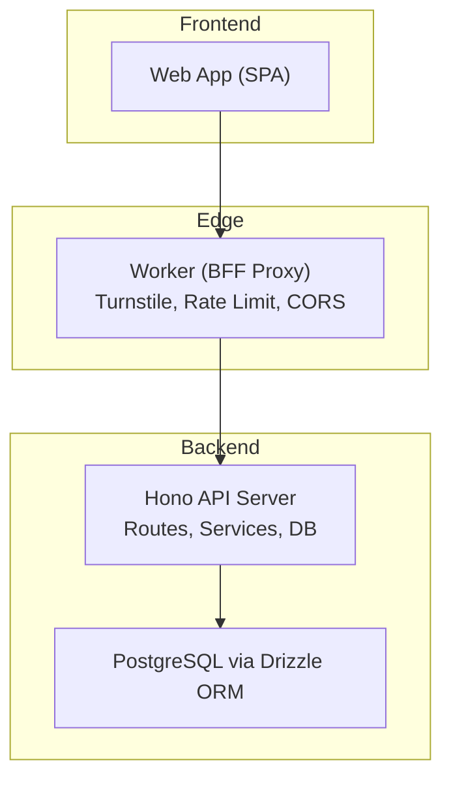
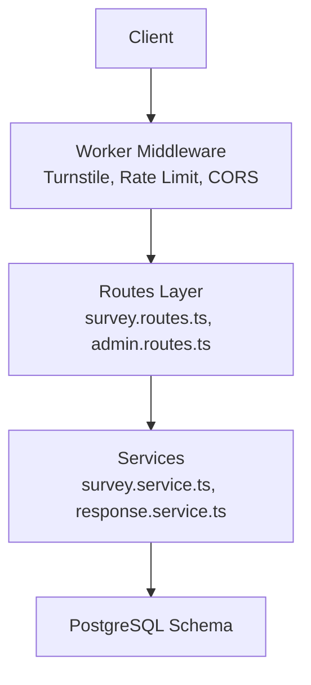
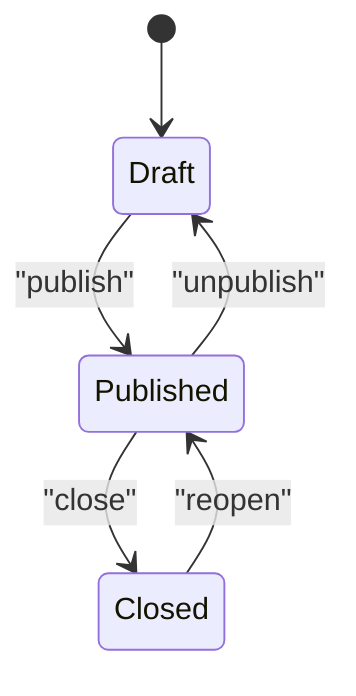
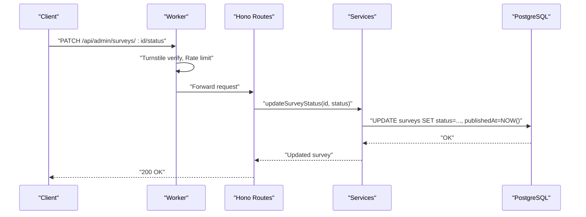
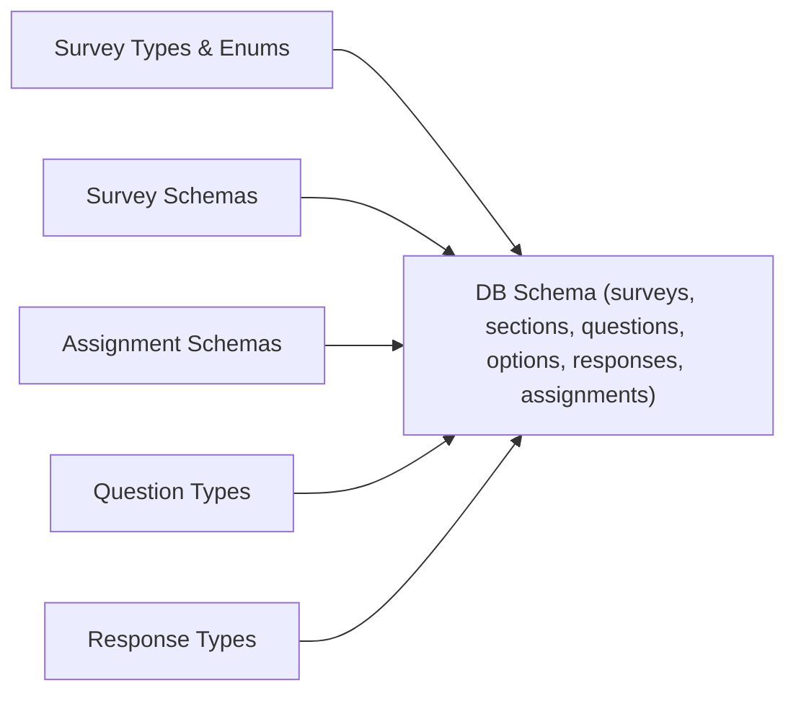

# Survey Management Endpoints

<cite>
**Referenced Files in This Document**
- [apps/api/src/index.ts](file://apps/api/src/index.ts)
- [apps/api/src/db/schema.ts](file://apps/api/src/db/schema.ts)
- [packages/shared/src/types/survey.ts](file://packages/shared/src/types/survey.ts)
- [packages/shared/src/schemas/survey.schema.ts](file://packages/shared/src/schemas/survey.schema.ts)
- [packages/shared/src/schemas/assignment.schema.ts](file://packages/shared/src/schemas/assignment.schema.ts)
- [packages/shared/src/types/question.ts](file://packages/shared/src/types/question.ts)
- [packages/shared/src/types/response.ts](file://packages/shared/src/types/response.ts)
- [apps/web/src/lib/api.ts](file://apps/web/src/lib/api.ts)
- [plan.md](file://plan.md)
</cite>

## Table of Contents
1. [Introduction](#introduction)
2. [Project Structure](#project-structure)
3. [Core Components](#core-components)
4. [Architecture Overview](#architecture-overview)
5. [Detailed Component Analysis](#detailed-component-analysis)
6. [Dependency Analysis](#dependency-analysis)
7. [Performance Considerations](#performance-considerations)
8. [Troubleshooting Guide](#troubleshooting-guide)
9. [Conclusion](#conclusion)
10. [Appendices](#appendices)

## Introduction
This document provides comprehensive API documentation for survey management endpoints. It covers CRUD operations for surveys, status management (draft, published, closed), survey assignment and permissions, section and question organization, request/response schemas, validation rules, publishing workflows, access control, and practical examples. It also outlines search, filtering, and pagination capabilities for surveys.

## Project Structure
The survey management system spans three layers:
- Shared package: Type definitions and validation schemas used across frontend, worker, and backend.
- Worker (Cloudflare Workers): Edge proxy enforcing security, rate limiting, and CORS.
- Backend (Hono.js on Render): REST API implementing survey CRUD, assignments, sections, questions, responses, and admin features.

**Diagram sources**
- [apps/api/src/index.ts:1-67](file://apps/api/src/index.ts#L1-L67)
- [apps/api/src/db/schema.ts:1-247](file://apps/api/src/db/schema.ts#L1-L247)
- [plan.md:141-177](file://plan.md#L141-L177)

**Section sources**
- [apps/api/src/index.ts:1-67](file://apps/api/src/index.ts#L1-L67)
- [apps/api/src/db/schema.ts:1-247](file://apps/api/src/db/schema.ts#L1-L247)
- [plan.md:527-664](file://plan.md#L527-L664)

## Core Components
- Survey data model and status lifecycle
- Assignment roles and granular permissions
- Section and question hierarchy
- Response and answer value models
- Validation schemas for survey creation/update and status transitions

Key types and enums:
- SurveyStatus: draft, published, closed
- AssignmentRole: editor, viewer
- QuestionType: 12 supported question types

**Section sources**
- [packages/shared/src/types/survey.ts:1-50](file://packages/shared/src/types/survey.ts#L1-L50)
- [apps/api/src/db/schema.ts:19-35](file://apps/api/src/db/schema.ts#L19-L35)
- [packages/shared/src/types/question.ts:1-66](file://packages/shared/src/types/question.ts#L1-L66)

## Architecture Overview
The API follows a layered architecture:
- Edge layer validates requests and applies rate limits.
- Backend routes handle survey CRUD, status updates, assignments, sections, questions, and responses.
- Database schema defines relationships among surveys, sections, questions, options, responses, and assignments.

**Diagram sources**
- [apps/api/src/index.ts:1-67](file://apps/api/src/index.ts#L1-L67)
- [apps/api/src/db/schema.ts:57-69](file://apps/api/src/db/schema.ts#L57-L69)
- [plan.md:601-627](file://plan.md#L601-L627)

## Detailed Component Analysis

### Survey CRUD Endpoints
- Public survey listing and detail retrieval
- Admin-only survey creation, update, delete, and status change

Endpoints:
- GET /api/surveys
- GET /api/surveys/:id
- POST /api/admin/surveys
- PATCH /api/admin/surveys/:id
- DELETE /api/admin/surveys/:id
- PATCH /api/admin/surveys/:id/status

Request/Response Schemas:
- Create input: title, description (optional), closesAt (ISO datetime, optional)
- Update input: title (optional), description (optional), closesAt (nullable ISO datetime, optional)
- Status update: status enum (draft, published, closed)

Validation rules:
- Title length: minimum 1, maximum 200
- Description length: maximum 2000
- closesAt: valid ISO datetime when provided

Example usage:
- Create a survey with title and optional description and closing date
- Update survey metadata and timing
- Transition status to published or close

**Section sources**
- [packages/shared/src/schemas/survey.schema.ts:3-17](file://packages/shared/src/schemas/survey.schema.ts#L3-L17)
- [packages/shared/src/types/survey.ts:5-15](file://packages/shared/src/types/survey.ts#L5-L15)
- [plan.md:471-485](file://plan.md#L471-L485)

### Survey Status Management
- Status lifecycle: draft → published → closed
- Status transitions controlled via PATCH /api/admin/surveys/:id/status
- Status field stored in surveys table with enum constraint

**Diagram sources**
- [apps/api/src/db/schema.ts:20-21](file://apps/api/src/db/schema.ts#L20-L21)
- [packages/shared/src/schemas/survey.schema.ts:15-17](file://packages/shared/src/schemas/survey.schema.ts#L15-L17)

**Section sources**
- [apps/api/src/db/schema.ts:57-69](file://apps/api/src/db/schema.ts#L57-L69)
- [packages/shared/src/schemas/survey.schema.ts:15-17](file://packages/shared/src/schemas/survey.schema.ts#L15-L17)

### Survey Assignment and Permissions
- Assignments grant granular permissions per survey per user
- Roles: editor, viewer
- Permissions: canEdit, canView, canExport

Endpoints:
- POST /api/admin/surveys/:id/assignments
- PATCH /api/admin/assignments/:id
- DELETE /api/admin/assignments/:id

Validation schemas:
- Create assignment: userId (UUID), role (enum), canEdit, canView, canExport (booleans)
- Update assignment: role, canEdit, canView, canExport (all optional)

Permission matrix (high-level):
- Admin: full control over surveys
- Editor: edit sections/questions within assigned surveys
- Viewer: view responses within assigned surveys
- Export: CSV export capability within assigned surveys

**Section sources**
- [apps/api/src/db/schema.ts:75-99](file://apps/api/src/db/schema.ts#L75-L99)
- [packages/shared/src/schemas/assignment.schema.ts:3-16](file://packages/shared/src/schemas/assignment.schema.ts#L3-L16)
- [packages/shared/src/types/survey.ts:35-49](file://packages/shared/src/types/survey.ts#L35-L49)
- [plan.md:398-425](file://plan.md#L398-L425)

### Section Organization
- Sections belong to a survey and define ordering
- CRUD endpoints for sections and reordering

Endpoints:
- GET /api/admin/surveys/:id/sections
- POST /api/admin/surveys/:id/sections
- PATCH /api/admin/sections/:id
- DELETE /api/admin/sections/:id
- PUT /api/admin/surveys/:id/sections/reorder

Data model:
- Section: id, surveyId, title, description, orderIndex, createdAt
- SectionWithQuestions: includes questions array

**Section sources**
- [apps/api/src/db/schema.ts:105-120](file://apps/api/src/db/schema.ts#L105-L120)
- [packages/shared/src/types/survey.ts:22-33](file://packages/shared/src/types/survey.ts#L22-L33)

### Question Types and Options
- Supported question types: short_text, long_text, single_choice, multiple_choice, dropdown, linear_scale, rating, yes_no, date, number, ranking, matrix
- Questions have ordering and optional scale labels
- Options support “other” variants

Endpoints:
- GET /api/admin/sections/:id/questions
- POST /api/admin/sections/:id/questions
- PATCH /api/admin/questions/:id
- DELETE /api/admin/questions/:id
- PUT /api/admin/sections/:id/questions/reorder
- POST /api/admin/questions/:id/options
- PATCH /api/admin/options/:id
- DELETE /api/admin/options/:id

Data models:
- Question: id, sectionId, questionType, title, description, isRequired, orderIndex, scaleMin/max, scaleMinLabel/maxLabel
- QuestionWithOptions: includes options array
- QuestionOption: id, questionId, label, orderIndex, isOther

**Section sources**
- [apps/api/src/db/schema.ts:126-147](file://apps/api/src/db/schema.ts#L126-L147)
- [apps/api/src/db/schema.ts:153-167](file://apps/api/src/db/schema.ts#L153-L167)
- [packages/shared/src/types/question.ts:30-66](file://packages/shared/src/types/question.ts#L30-L66)

### Response Submission and Retrieval
- Public endpoints for response submission and checking existing submissions
- Admin endpoints for listing responses, statistics, and CSV export

Endpoints:
- GET /api/surveys/:id/my-response
- POST /api/surveys/:id/responses
- GET /api/admin/surveys/:id/responses
- GET /api/admin/surveys/:id/stats
- GET /api/admin/surveys/:id/export/csv

Data models:
- Response: id, surveyId, userId, submittedAt, ipAddress, userAgent
- AnswerValue: id, responseId, questionId, optionId, textValue, numberValue, rankValue, isOtherText
- SubmitResponsePayload: turnstileToken, answers[]
- SubmitAnswerPayload: questionId, optionId?, textValue?, numberValue?, rankValue?, isOtherText?

**Section sources**
- [packages/shared/src/types/response.ts:1-53](file://packages/shared/src/types/response.ts#L1-L53)
- [apps/api/src/db/schema.ts:173-222](file://apps/api/src/db/schema.ts#L173-L222)
- [plan.md:471-477](file://plan.md#L471-L477)
- [plan.md:503-505](file://plan.md#L503-L505)

### Search, Filtering, and Pagination
- Public survey listing endpoint supports search and filtering
- Admin survey listing supports filtering and sorting
- Pagination is recommended for large datasets

Note: Specific query parameters are not defined in the current implementation. Implementations should define:
- Search: title/description text search
- Filters: status, date range, creator
- Sorting: created_at, updated_at, title
- Pagination: page, limit, offset

**Section sources**
- [plan.md:471-473](file://plan.md#L471-L473)
- [plan.md:503-505](file://plan.md#L503-L505)

### Publishing Workflows and Access Control
- Publishing requires admin privileges or explicit assignment
- Status transitions validated by schema and service logic
- Access control enforced via RBAC middleware and assignment checks

**Diagram sources**
- [apps/api/src/index.ts:25-37](file://apps/api/src/index.ts#L25-L37)
- [apps/api/src/db/schema.ts:57-69](file://apps/api/src/db/schema.ts#L57-L69)
- [packages/shared/src/schemas/survey.schema.ts:15-17](file://packages/shared/src/schemas/survey.schema.ts#L15-L17)

**Section sources**
- [apps/api/src/index.ts:1-67](file://apps/api/src/index.ts#L1-L67)
- [apps/api/src/db/schema.ts:57-69](file://apps/api/src/db/schema.ts#L57-L69)
- [packages/shared/src/schemas/survey.schema.ts:15-17](file://packages/shared/src/schemas/survey.schema.ts#L15-L17)
- [plan.md:398-425](file://plan.md#L398-L425)

### Practical Examples

- Create a survey
  - Method: POST /api/admin/surveys
  - Body: { title, description?, closesAt? }
  - Example: Create a survey titled “Futbol Anketi” with a closing date

- Update a survey
  - Method: PATCH /api/admin/surveys/:id
  - Body: { title?, description?, closesAt? }

- Publish a survey
  - Method: PATCH /api/admin/surveys/:id/status
  - Body: { status: "published" }

- Assign permissions
  - Method: POST /api/admin/surveys/:id/assignments
  - Body: { userId, role, canEdit, canView, canExport }

- Retrieve survey with sections and questions
  - Method: GET /api/admin/surveys/:id
  - Response: includes sections with questions and responseCount

- Submit a response
  - Method: POST /api/surveys/:id/responses
  - Body: { turnstileToken, answers: [{ questionId, optionId?, textValue?, numberValue?, rankValue?, isOtherText? }] }

**Section sources**
- [packages/shared/src/schemas/survey.schema.ts:3-17](file://packages/shared/src/schemas/survey.schema.ts#L3-L17)
- [packages/shared/src/schemas/assignment.schema.ts:3-16](file://packages/shared/src/schemas/assignment.schema.ts#L3-L16)
- [packages/shared/src/types/response.ts:25-37](file://packages/shared/src/types/response.ts#L25-L37)
- [plan.md:471-485](file://plan.md#L471-L485)
- [plan.md:503-505](file://plan.md#L503-L505)

## Dependency Analysis
The backend depends on:
- Drizzle ORM for type-safe database operations
- Zod schemas for runtime validation
- better-auth for session and OAuth
- RBAC middleware for access control

**Diagram sources**
- [apps/api/src/db/schema.ts:19-35](file://apps/api/src/db/schema.ts#L19-L35)
- [packages/shared/src/types/survey.ts:1-50](file://packages/shared/src/types/survey.ts#L1-L50)
- [packages/shared/src/schemas/survey.schema.ts:1-22](file://packages/shared/src/schemas/survey.schema.ts#L1-L22)
- [packages/shared/src/schemas/assignment.schema.ts:1-20](file://packages/shared/src/schemas/assignment.schema.ts#L1-L20)
- [packages/shared/src/types/question.ts:1-66](file://packages/shared/src/types/question.ts#L1-L66)
- [packages/shared/src/types/response.ts:1-53](file://packages/shared/src/types/response.ts#L1-L53)

**Section sources**
- [apps/api/src/db/schema.ts:1-247](file://apps/api/src/db/schema.ts#L1-L247)
- [packages/shared/src/types/survey.ts:1-50](file://packages/shared/src/types/survey.ts#L1-L50)
- [packages/shared/src/schemas/survey.schema.ts:1-22](file://packages/shared/src/schemas/survey.schema.ts#L1-L22)
- [packages/shared/src/schemas/assignment.schema.ts:1-20](file://packages/shared/src/schemas/assignment.schema.ts#L1-L20)
- [packages/shared/src/types/question.ts:1-66](file://packages/shared/src/types/question.ts#L1-L66)
- [packages/shared/src/types/response.ts:1-53](file://packages/shared/src/types/response.ts#L1-L53)

## Performance Considerations
- Edge validation reduces load on backend
- Request size limit prevents oversized payloads
- Indexes on foreign keys and unique constraints optimize joins and uniqueness checks
- Use pagination for listing endpoints
- Consider caching for frequently accessed survey details

[No sources needed since this section provides general guidance]

## Troubleshooting Guide
Common errors and resolutions:
- Validation failures
  - Symptoms: 400 Bad Request with validation messages
  - Causes: Missing/invalid title, description too long, invalid datetime format
  - Resolution: Ensure title length ≤ 200, description ≤ 2000, closesAt is valid ISO datetime

- Permission denials
  - Symptoms: 403 Forbidden or 401 Unauthorized
  - Causes: Missing or invalid session, insufficient role/assignment
  - Resolution: Authenticate via OAuth, ensure assignment exists with required permissions

- Resource conflicts
  - Symptoms: 409 Conflict or database constraint violations
  - Causes: Duplicate response per user per survey
  - Resolution: Check existing response before submitting

- Server errors
  - Symptoms: 500 Internal Server Error
  - Causes: Unhandled exceptions
  - Resolution: Check logs and retry; endpoint returns generic error message

**Section sources**
- [apps/api/src/index.ts:25-37](file://apps/api/src/index.ts#L25-L37)
- [apps/api/src/index.ts:49-58](file://apps/api/src/index.ts#L49-L58)
- [apps/web/src/lib/api.ts:24-29](file://apps/web/src/lib/api.ts#L24-L29)

## Conclusion
The survey management API provides a robust foundation for creating, organizing, and administering surveys with strong validation, permission controls, and extensible question types. By following the documented endpoints, schemas, and workflows, developers can implement reliable survey experiences across public and admin contexts.

[No sources needed since this section summarizes without analyzing specific files]

## Appendices

### Endpoint Reference Summary
- Public
  - GET /api/surveys
  - GET /api/surveys/:id
  - GET /api/surveys/:id/my-response
  - POST /api/surveys/:id/responses

- Admin
  - GET /api/admin/surveys
  - POST /api/admin/surveys
  - PATCH /api/admin/surveys/:id
  - DELETE /api/admin/surveys/:id
  - PATCH /api/admin/surveys/:id/status
  - GET /api/admin/surveys/:id/sections
  - POST /api/admin/surveys/:id/sections
  - PATCH /api/admin/sections/:id
  - DELETE /api/admin/sections/:id
  - PUT /api/admin/surveys/:id/sections/reorder
  - GET /api/admin/sections/:id/questions
  - POST /api/admin/sections/:id/questions
  - PATCH /api/admin/questions/:id
  - DELETE /api/admin/questions/:id
  - PUT /api/admin/sections/:id/questions/reorder
  - POST /api/admin/questions/:id/options
  - PATCH /api/admin/options/:id
  - DELETE /api/admin/options/:id
  - GET /api/admin/surveys/:id/responses
  - GET /api/admin/surveys/:id/stats
  - GET /api/admin/surveys/:id/export/csv
  - POST /api/admin/surveys/:id/assignments
  - PATCH /api/admin/assignments/:id
  - DELETE /api/admin/assignments/:id
  - GET /api/admin/activity-log

**Section sources**
- [plan.md:471-514](file://plan.md#L471-L514)