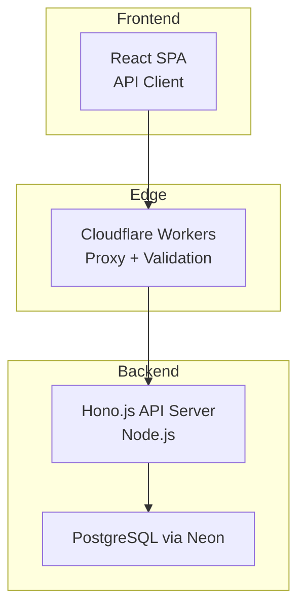
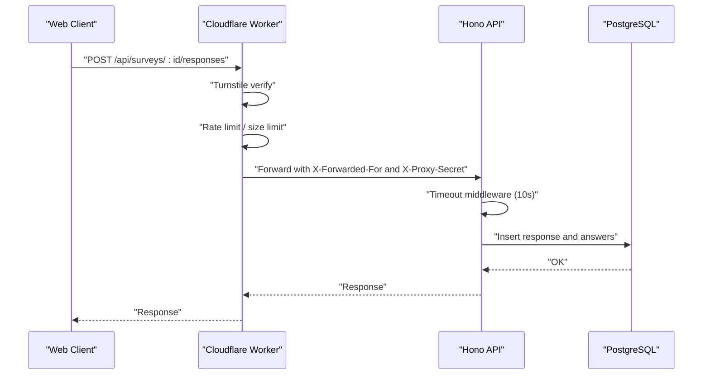
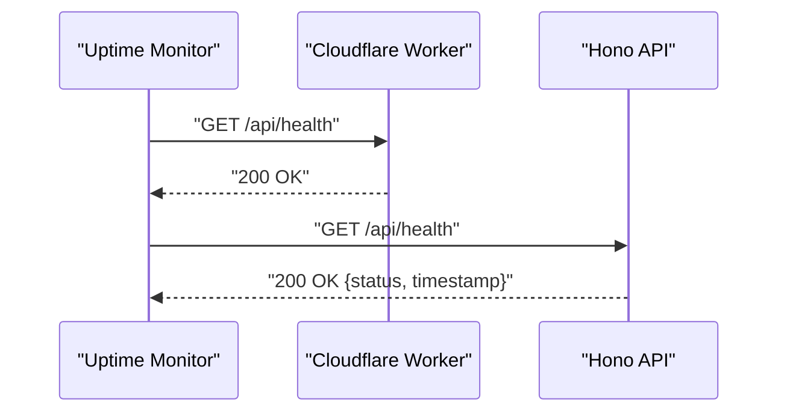
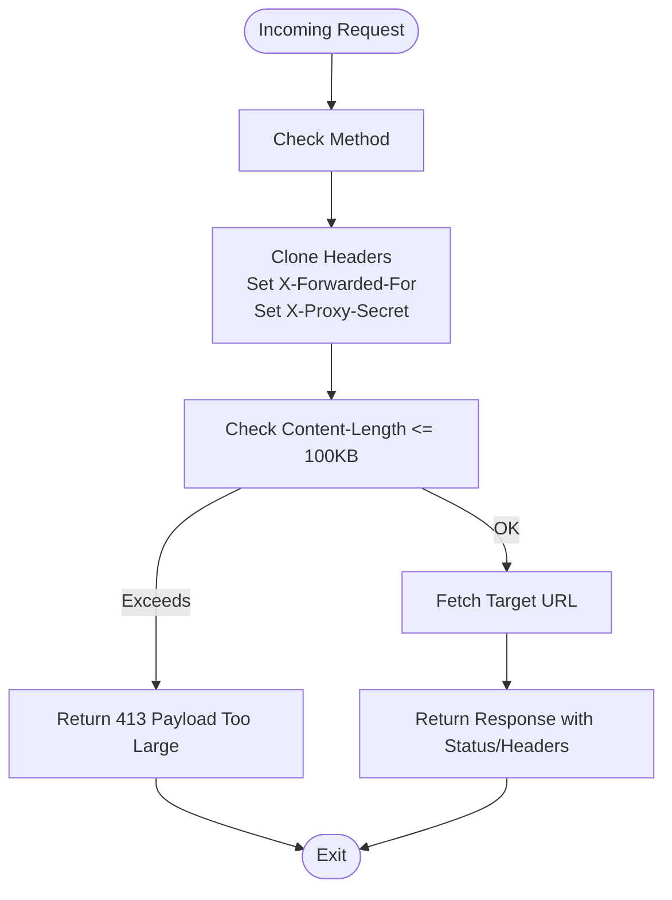
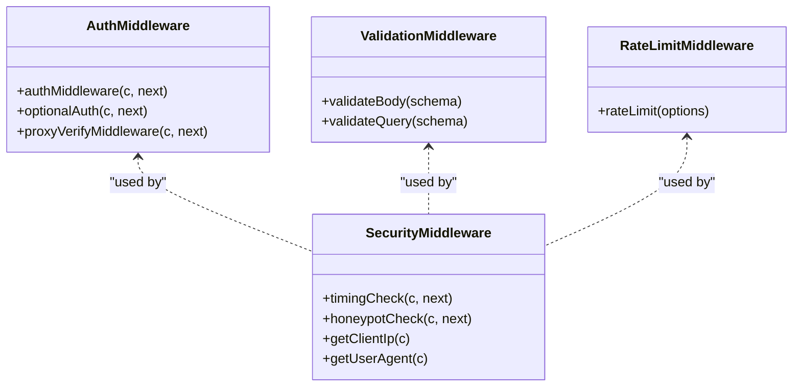
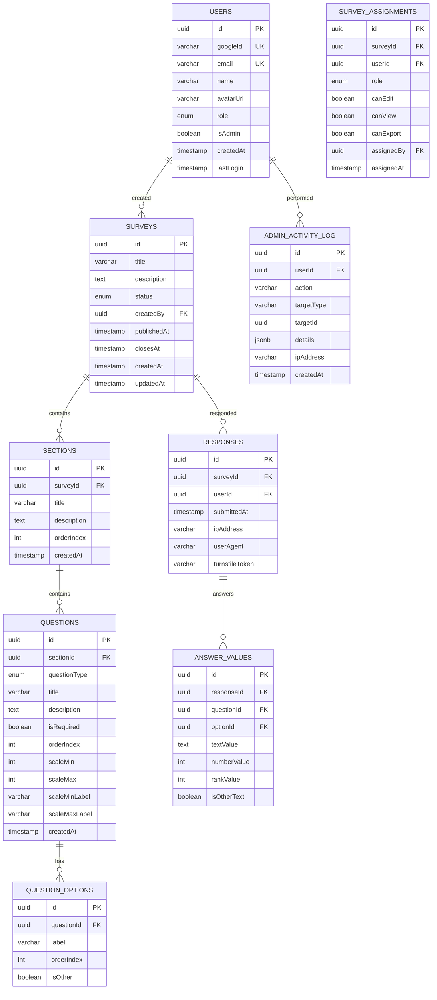
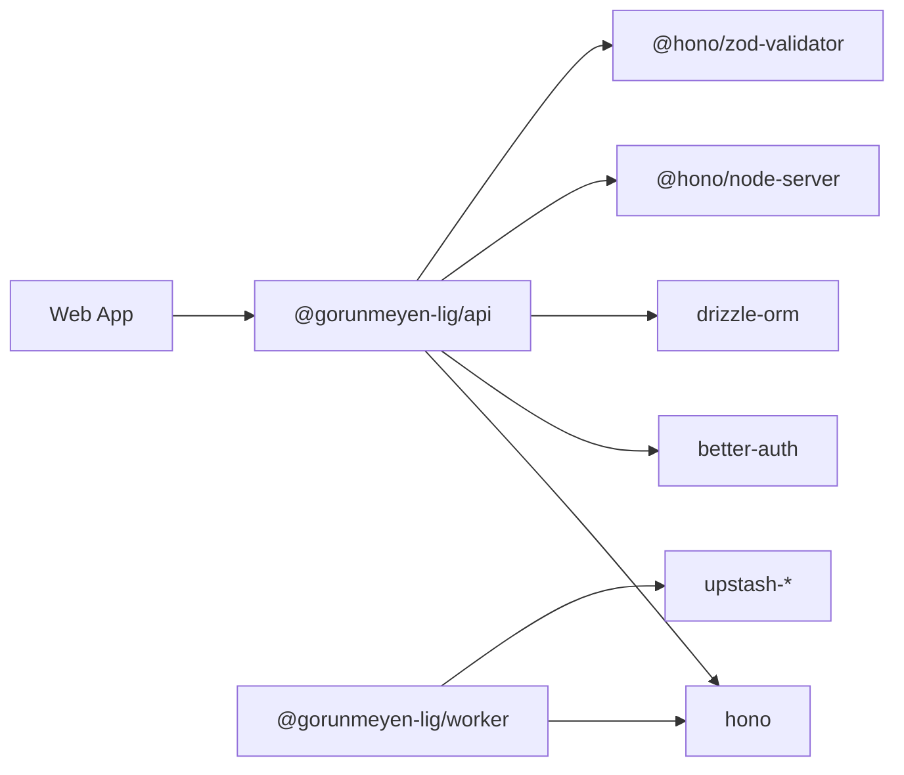

# Utility and System Endpoints

<cite>
**Referenced Files in This Document**
- [apps/api/src/index.ts](file://apps/api/src/index.ts)
- [apps/api/src/middleware/auth.ts](file://apps/api/src/middleware/auth.ts)
- [apps/api/src/middleware/security.ts](file://apps/api/src/middleware/security.ts)
- [apps/api/src/middleware/validate.ts](file://apps/api/src/middleware/validate.ts)
- [apps/api/src/services/survey.service.ts](file://apps/api/src/services/survey.service.ts)
- [apps/api/src/services/response.service.ts](file://apps/api/src/services/response.service.ts)
- [apps/api/drizzle.config.ts](file://apps/api/drizzle.config.ts)
- [apps/api/src/db/schema.ts](file://apps/api/src/db/schema.ts)
- [apps/worker/src/index.ts](file://apps/worker/src/index.ts)
- [apps/worker/wrangler.toml](file://apps/worker/wrangler.toml)
- [apps/web/src/lib/api.ts](file://apps/web/src/lib/api.ts)
- [apps/api/package.json](file://apps/api/package.json)
- [apps/worker/package.json](file://apps/worker/package.json)
- [apps/web/package.json](file://apps/web/package.json)
- [package.json](file://package.json)
</cite>

## Table of Contents
1. [Introduction](#introduction)
2. [Project Structure](#project-structure)
3. [Core Components](#core-components)
4. [Architecture Overview](#architecture-overview)
5. [Detailed Component Analysis](#detailed-component-analysis)
6. [Dependency Analysis](#dependency-analysis)
7. [Performance Considerations](#performance-considerations)
8. [Troubleshooting Guide](#troubleshooting-guide)
9. [Conclusion](#conclusion)
10. [Appendices](#appendices)

## Introduction
This document describes the utility and system endpoints for the platform, focusing on health checks, system status monitoring, diagnostics, and operational management. It also covers worker proxy endpoints, request forwarding, edge computing integrations, timeout handling, request size limits, global error handling, CORS configuration, security headers, and middleware integration. The system follows an edge-first architecture with Cloudflare Workers acting as a proxy and validator, while the backend API runs on a Render-hosted Node.js server behind Hono.js.

## Project Structure
The system is organized as a monorepo with three primary applications:
- Web application (React SPA) for user interface and API client
- Worker application (Cloudflare Workers) for edge proxy, validation, and rate limiting
- API application (Node.js + Hono.js) for business endpoints and data persistence

**Diagram sources**
- [apps/worker/src/index.ts:1-106](file://apps/worker/src/index.ts#L1-L106)
- [apps/api/src/index.ts:1-67](file://apps/api/src/index.ts#L1-L67)
- [apps/api/src/db/schema.ts:1-247](file://apps/api/src/db/schema.ts#L1-L247)

**Section sources**
- [package.json:1-30](file://package.json#L1-L30)
- [apps/api/src/index.ts:1-67](file://apps/api/src/index.ts#L1-L67)
- [apps/worker/src/index.ts:1-106](file://apps/worker/src/index.ts#L1-L106)

## Core Components
- Edge proxy and validation (Workers): Handles CORS, security headers, request size limits, Turnstile verification, and forwards requests to the backend.
- Backend API (Hono.js): Provides health checks, global error handling, timeouts, and route mounting points for future endpoints.
- Database: PostgreSQL schema managed via Drizzle ORM and migrations.
- Frontend API client: Standardized fetch wrapper for API communication.

Key capabilities:
- Health check endpoint for uptime monitoring
- Global error handling and 404 handling
- Request timeout enforcement
- Request body size limit enforcement
- CORS and security headers applied globally
- Proxy secret verification for internal routing

**Section sources**
- [apps/api/src/index.ts:11-58](file://apps/api/src/index.ts#L11-L58)
- [apps/worker/src/index.ts:15-40](file://apps/worker/src/index.ts#L15-L40)
- [apps/api/src/db/schema.ts:1-247](file://apps/api/src/db/schema.ts#L1-L247)

## Architecture Overview
The system enforces a layered defense:
- Cloudflare WAF/DDoS protection at the edge
- Turnstile invisible challenge in Workers
- Rate limiting and request validation
- Backend middleware for timeouts and logging
- Database constraints for data integrity

**Diagram sources**
- [apps/worker/src/index.ts:42-103](file://apps/worker/src/index.ts#L42-L103)
- [apps/api/src/index.ts:34-42](file://apps/api/src/index.ts#L34-L42)
- [apps/api/src/services/response.service.ts:10-63](file://apps/api/src/services/response.service.ts#L10-L63)

## Detailed Component Analysis

### Health Check Endpoint
- Path: GET /api/health
- Purpose: System health probe for uptime monitoring and keep-alive strategies
- Response: JSON with status and timestamp
- Notes: Used by external pingers to prevent Render sleep mode

**Diagram sources**
- [apps/api/src/index.ts:39-42](file://apps/api/src/index.ts#L39-L42)

**Section sources**
- [apps/api/src/index.ts:39-42](file://apps/api/src/index.ts#L39-L42)

### Worker Proxy Endpoints and Request Forwarding
- Path: ALL /api/*
- Purpose: Proxy all API requests to the backend with edge-side validation
- Features:
  - CORS configured per environment
  - Security headers applied
  - Request body size limit enforced
  - Turnstile verification for specific endpoints
  - Forwarded headers: X-Forwarded-For, X-Proxy-Secret
  - Internal proxy secret verification in backend

**Diagram sources**
- [apps/worker/src/index.ts:81-103](file://apps/worker/src/index.ts#L81-L103)

**Section sources**
- [apps/worker/src/index.ts:81-103](file://apps/worker/src/index.ts#L81-L103)
- [apps/api/src/middleware/auth.ts:44-52](file://apps/api/src/middleware/auth.ts#L44-L52)

### Timeout Handling
- Backend timeout middleware: 10-second timeout for all /api/* routes
- Purpose: Prevent long-hanging requests and resource exhaustion
- Behavior: Requests exceeding the timeout return a timeout response

**Section sources**
- [apps/api/src/index.ts:34-37](file://apps/api/src/index.ts#L34-L37)

### Request Size Limits
- Maximum request body size: 100 KB
- Applied to /api/* routes in both Worker and API servers
- Exceeded requests receive 413 status with error payload

**Section sources**
- [apps/worker/src/index.ts:33-40](file://apps/worker/src/index.ts#L33-L40)
- [apps/api/src/index.ts:25-32](file://apps/api/src/index.ts#L25-L32)

### Global Error Handling and 404 Handling
- Global error handler: Logs unhandled errors and returns standardized 500 response
- 404 handler: Returns standardized 404 response for unmatched routes
- Both handlers ensure consistent error semantics across the system

**Section sources**
- [apps/api/src/index.ts:49-58](file://apps/api/src/index.ts#L49-L58)

### CORS Configuration
- Worker CORS:
  - Origin: Environment-specific frontend URL
  - Credentials: Allowed
  - Methods: GET, POST, PUT, PATCH, DELETE
  - Headers: Content-Type, Authorization
  - Max age: 86400 seconds
- API CORS:
  - Origin: Environment-specific frontend URL
  - Credentials: Allowed
  - Methods/Headers: Same as Worker
  - Max age: 86400 seconds

**Section sources**
- [apps/worker/src/index.ts:15-28](file://apps/worker/src/index.ts#L15-L28)
- [apps/api/src/index.ts:13-22](file://apps/api/src/index.ts#L13-L22)

### Security Headers
- Both Worker and API apply security headers globally to mitigate common web vulnerabilities

**Section sources**
- [apps/worker/src/index.ts](file://apps/worker/src/index.ts#L31)
- [apps/api/src/index.ts](file://apps/api/src/index.ts#L23)

### Middleware Integration
- Logging: Structured logs for all requests
- Authentication: Session validation middleware (placeholder for better-auth)
- Optional authentication: Non-blocking auth for public endpoints
- Proxy verification: Ensures requests originate from Workers
- Validation: Zod-based request body/query validation helpers
- Security: Timing checks and honeypot checks for bot mitigation
- Rate limiting: In-memory rate limiter (with Upstash Redis planned)

**Diagram sources**
- [apps/api/src/middleware/auth.ts:1-52](file://apps/api/src/middleware/auth.ts#L1-L52)
- [apps/api/src/middleware/security.ts:1-73](file://apps/api/src/middleware/security.ts#L1-L73)
- [apps/api/src/middleware/validate.ts:1-48](file://apps/api/src/middleware/validate.ts#L1-L48)
- [apps/api/src/middleware/rateLimit.ts:1-42](file://apps/api/src/middleware/rateLimit.ts#L1-L42)

**Section sources**
- [apps/api/src/middleware/auth.ts:1-52](file://apps/api/src/middleware/auth.ts#L1-L52)
- [apps/api/src/middleware/security.ts:1-73](file://apps/api/src/middleware/security.ts#L1-L73)
- [apps/api/src/middleware/validate.ts:1-48](file://apps/api/src/middleware/validate.ts#L1-L48)
- [apps/api/src/middleware/rateLimit.ts:1-42](file://apps/api/src/middleware/rateLimit.ts#L1-L42)

### Operational Metrics and Diagnostics
- Response statistics endpoint: Aggregates total responses and per-question metrics
- CSV export endpoint: Exports raw responses for administrative analysis
- Admin activity log: Tracks administrative actions with IP and timestamps
- Database schema: Defines normalized tables for surveys, responses, answers, and audit logs

**Diagram sources**
- [apps/api/src/db/schema.ts:1-247](file://apps/api/src/db/schema.ts#L1-L247)

**Section sources**
- [apps/api/src/db/schema.ts:1-247](file://apps/api/src/db/schema.ts#L1-L247)
- [apps/api/src/services/response.service.ts:108-189](file://apps/api/src/services/response.service.ts#L108-L189)

### API Versioning
- Current implementation does not expose explicit API version endpoints
- Versioning is managed via deployment and migration scripts; clients consume stable endpoints under /api/*

**Section sources**
- [apps/api/package.json:1-34](file://apps/api/package.json#L1-L34)
- [apps/worker/package.json:1-24](file://apps/worker/package.json#L1-L24)

### System Information Retrieval
- Health endpoint returns system status and timestamp for monitoring
- No dedicated system information endpoint is exposed; health is the primary operational signal

**Section sources**
- [apps/api/src/index.ts:39-42](file://apps/api/src/index.ts#L39-L42)

### Operational Management Examples
- Keep-alive strategy: External monitor pings /api/health every 14 minutes to prevent Render sleep
- IP whitelist: Render firewall allows only Cloudflare IPs
- Proxy secret: Internal header ensures only proxied requests reach backend

**Section sources**
- [apps/worker/src/index.ts:86-88](file://apps/worker/src/index.ts#L86-L88)
- [apps/api/src/middleware/auth.ts:44-52](file://apps/api/src/middleware/auth.ts#L44-L52)

## Dependency Analysis
Runtime dependencies and their roles:
- Hono.js: Web framework for both Worker and API servers
- @hono/node-server: Node.js server adapter for Hono
- @hono/zod-validator: Request validation with Zod
- @upstash/redis and @upstash/ratelimit: Rate limiting (Workers)
- better-auth: Authentication (planned)
- drizzle-orm: Database ORM
- dotenv: Environment configuration

**Diagram sources**
- [apps/web/package.json:1-51](file://apps/web/package.json#L1-L51)
- [apps/api/package.json:16-26](file://apps/api/package.json#L16-L26)
- [apps/worker/package.json:12-17](file://apps/worker/package.json#L12-L17)

**Section sources**
- [apps/web/package.json:1-51](file://apps/web/package.json#L1-L51)
- [apps/api/package.json:16-26](file://apps/api/package.json#L16-L26)
- [apps/worker/package.json:12-17](file://apps/worker/package.json#L12-L17)

## Performance Considerations
- Edge-first processing reduces backend load by validating and rate limiting at the edge
- Request size limits prevent memory pressure on both Worker and API servers
- Timeouts protect backend resources from slow or stuck requests
- Database queries are optimized with indexes on frequently filtered columns
- Keep-alive strategy prevents cold starts on Render

## Troubleshooting Guide
Common issues and resolutions:
- 403 Forbidden due to proxy secret mismatch: Verify X-Proxy-Secret header matches internal value
- 400 Bad Request due to Turnstile failure: Ensure turnstileToken is present and valid
- 400 Bad Request due to timing or honeypot checks: Validate formOpenedAt and remove hidden honeypot fields
- 403 Forbidden due to unauthorized access: Confirm proxy secret verification passes
- 413 Payload Too Large: Reduce request body size below 100 KB
- 504 Gateway Timeout: Exceeded 10-second backend timeout; optimize request or retry
- 500 Internal Server Error: Inspect global error logs and stack traces

Operational diagnostics:
- Health endpoint: GET /api/health for system status
- CORS misconfiguration: Check Worker and API CORS origins and credentials
- Rate limiting: Inspect X-RateLimit-* headers and Retry-After on 429 responses

**Section sources**
- [apps/worker/src/index.ts:42-79](file://apps/worker/src/index.ts#L42-L79)
- [apps/api/src/middleware/security.ts:7-30](file://apps/api/src/middleware/security.ts#L7-L30)
- [apps/api/src/index.ts:25-37](file://apps/api/src/index.ts#L25-L37)
- [apps/api/src/index.ts:49-58](file://apps/api/src/index.ts#L49-L58)

## Conclusion
The system employs a robust edge-first architecture with Cloudflare Workers handling validation and rate limiting, while the backend API focuses on business logic and data persistence. Health checks, timeouts, request size limits, and global error handling provide operational reliability. The database schema supports comprehensive survey and response analytics, enabling effective monitoring and diagnostics.

## Appendices

### Endpoint Reference

- GET /api/health
  - Description: Health probe for uptime monitoring
  - Response: JSON with status and timestamp
  - Typical use: Cron job or uptime monitor

- ALL /api/*
  - Description: Proxy endpoint for all backend routes
  - Features: CORS, security headers, size limits, Turnstile verification, forwarding with X-Forwarded-For and X-Proxy-Secret

- POST /api/surveys/:id/responses
  - Description: Submit a survey response
  - Validation: Zod schema, timing checks, honeypot checks, Turnstile verification
  - Rate limiting: Configurable via middleware
  - Response: Created response object

- GET /api/surveys
  - Description: List published surveys
  - Response: Array of surveys with basic metadata

- GET /api/surveys/:id
  - Description: Get survey with details
  - Response: Survey with sections, questions, and options

- GET /api/surveys/:id/my-response
  - Description: Check if current user has responded
  - Response: Boolean flag and response metadata

- GET /api/surveys/:id/responses
  - Description: Admin endpoint to list responses
  - Response: Paginated list of responses with answers and user info

- GET /api/surveys/:id/stats
  - Description: Admin endpoint for survey statistics
  - Response: Total responses and per-question metrics

- GET /api/surveys/:id/export/csv
  - Description: Admin endpoint to export responses as CSV
  - Response: CSV data

- GET /api/admin/activity-log
  - Description: Admin endpoint for audit log
  - Response: Activity log entries with IP and timestamps

Notes:
- API versioning is implicit; clients consume stable endpoints under /api/*
- CORS and security headers are applied globally in Worker and API
- Timeout is set to 10 seconds for all /api/* routes
- Request body size is limited to 100 KB

**Section sources**
- [apps/api/src/index.ts:39-42](file://apps/api/src/index.ts#L39-L42)
- [apps/worker/src/index.ts:81-103](file://apps/worker/src/index.ts#L81-L103)
- [apps/api/src/routes/survey.routes.ts:12-78](file://apps/api/src/routes/survey.routes.ts#L12-L78)
- [apps/api/src/services/response.service.ts:76-103](file://apps/api/src/services/response.service.ts#L76-L103)
- [apps/api/src/services/response.service.ts:108-189](file://apps/api/src/services/response.service.ts#L108-L189)
- [apps/api/src/services/response.service.ts:194-216](file://apps/api/src/services/response.service.ts#L194-L216)
- [apps/api/src/db/schema.ts:228-246](file://apps/api/src/db/schema.ts#L228-L246)