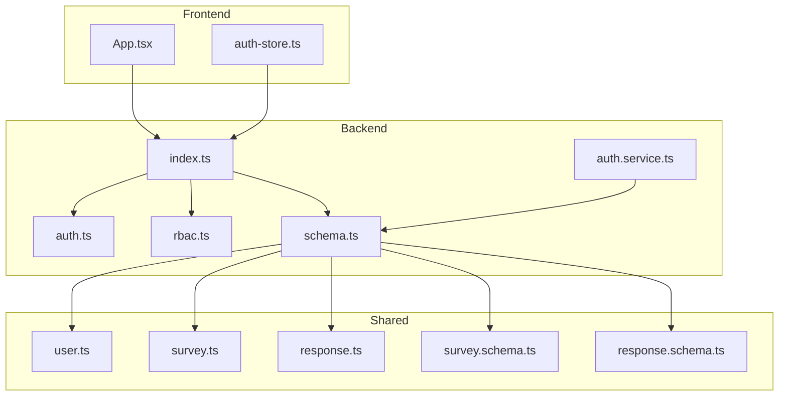
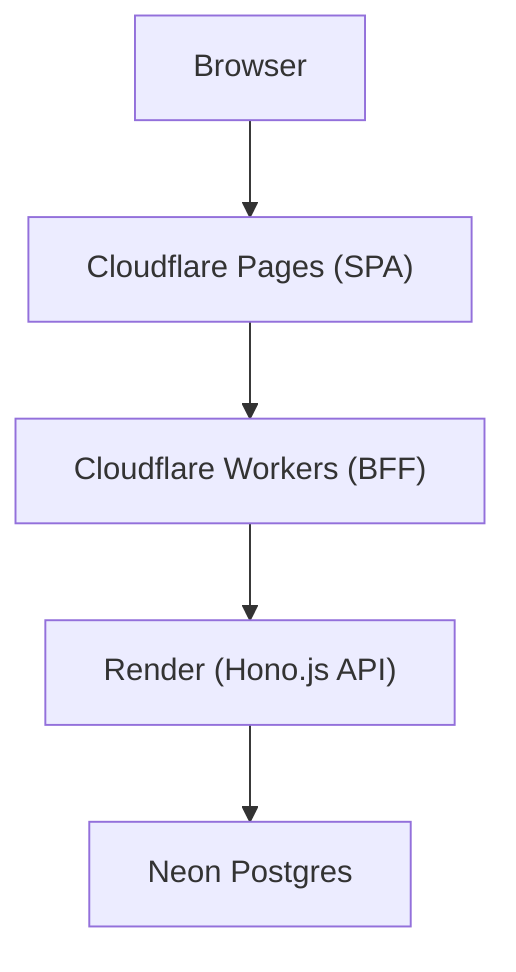
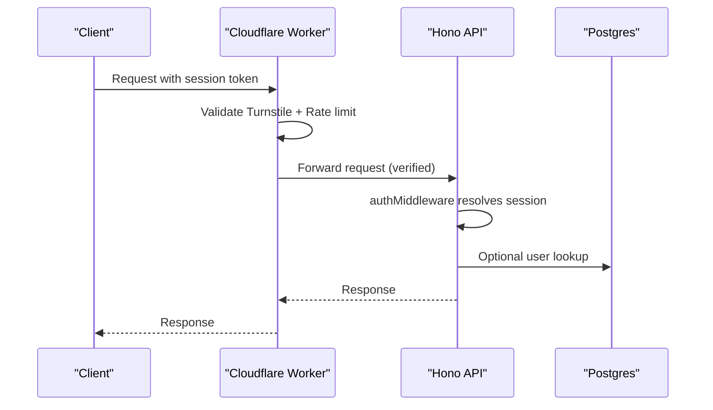
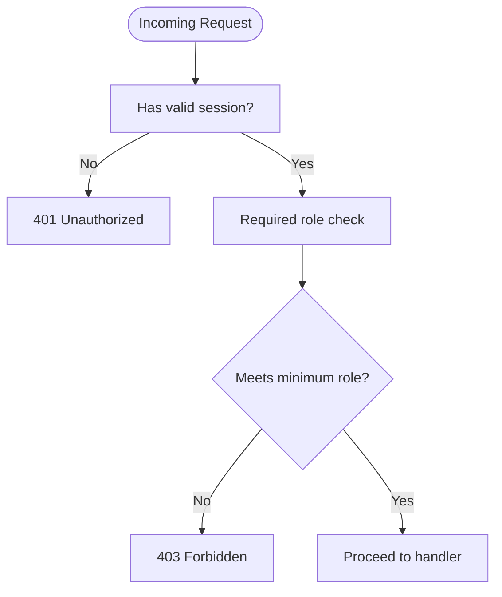
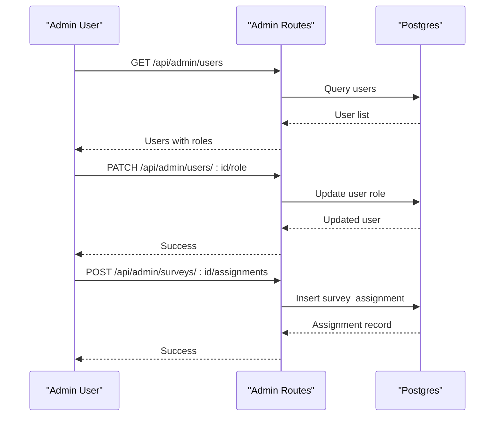
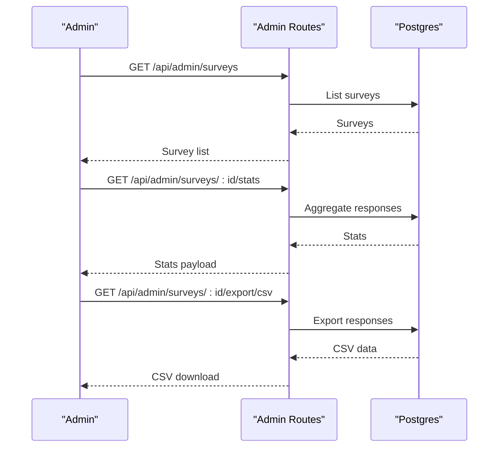
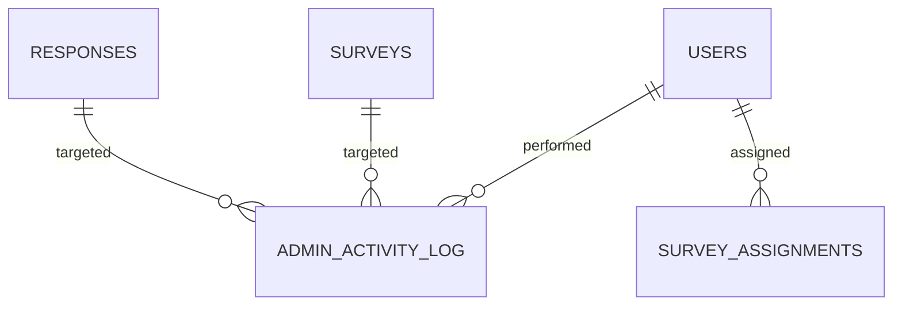
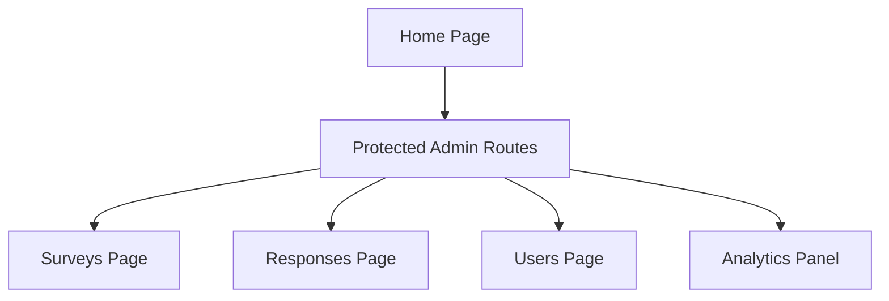
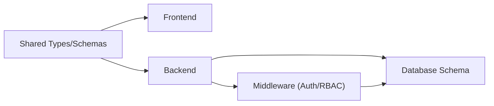

# Admin Dashboard

<cite>
**Referenced Files in This Document**
- [App.tsx](file://apps/web/src/App.tsx)
- [auth-store.ts](file://apps/web/src/stores/auth-store.ts)
- [index.ts](file://apps/api/src/index.ts)
- [auth.ts](file://apps/api/src/middleware/auth.ts)
- [rbac.ts](file://apps/api/src/middleware/rbac.ts)
- [auth.service.ts](file://apps/api/src/services/auth.service.ts)
- [schema.ts](file://apps/api/src/db/schema.ts)
- [plan.md](file://plan.md)
- [user.ts](file://packages/shared/src/types/user.ts)
- [survey.schema.ts](file://packages/shared/src/schemas/survey.schema.ts)
- [response.schema.ts](file://packages/shared/src/schemas/response.schema.ts)
- [survey.ts](file://packages/shared/src/types/survey.ts)
- [response.ts](file://packages/shared/src/types/response.ts)
</cite>

## Table of Contents
1. [Introduction](#introduction)
2. [Project Structure](#project-structure)
3. [Core Components](#core-components)
4. [Architecture Overview](#architecture-overview)
5. [Detailed Component Analysis](#detailed-component-analysis)
6. [Dependency Analysis](#dependency-analysis)
7. [Performance Considerations](#performance-considerations)
8. [Troubleshooting Guide](#troubleshooting-guide)
9. [Conclusion](#conclusion)
10. [Appendices](#appendices)

## Introduction
This document describes the admin dashboard functionality for managing users, assigning roles, and monitoring system activity. It explains the administrative interface for survey lifecycle management, analytics and reporting capabilities, and system administration features. It also documents security considerations for admin access, audit trails, and privileged operations, and outlines the complete admin workflow from user management through system oversight.

## Project Structure
The admin dashboard spans three layers:
- Frontend (React SPA): Provides admin UI pages, protected routes, and state management for authentication.
- Backend (Hono.js API): Implements admin endpoints, RBAC, audit logging, and integrates with the database via Drizzle ORM.
- Shared Types and Schemas: Define data contracts for admin operations, survey management, and response analytics.

**Diagram sources**
- [App.tsx:1-23](file://apps/web/src/App.tsx#L1-L23)
- [auth-store.ts:1-31](file://apps/web/src/stores/auth-store.ts#L1-L31)
- [index.ts:1-67](file://apps/api/src/index.ts#L1-L67)
- [auth.ts:1-52](file://apps/api/src/middleware/auth.ts#L1-L52)
- [rbac.ts:1-45](file://apps/api/src/middleware/rbac.ts#L1-L45)
- [auth.service.ts:1-48](file://apps/api/src/services/auth.service.ts#L1-L48)
- [schema.ts:1-247](file://apps/api/src/db/schema.ts#L1-L247)
- [user.ts:1-22](file://packages/shared/src/types/user.ts#L1-L22)
- [survey.ts:1-49](file://packages/shared/src/types/survey.ts#L1-L49)
- [response.ts:1-52](file://packages/shared/src/types/response.ts#L1-L52)
- [survey.schema.ts:1-22](file://packages/shared/src/schemas/survey.schema.ts#L1-L22)
- [response.schema.ts:1-24](file://packages/shared/src/schemas/response.schema.ts#L1-L24)

**Section sources**
- [App.tsx:1-23](file://apps/web/src/App.tsx#L1-L23)
- [auth-store.ts:1-31](file://apps/web/src/stores/auth-store.ts#L1-L31)
- [index.ts:1-67](file://apps/api/src/index.ts#L1-L67)
- [schema.ts:1-247](file://apps/api/src/db/schema.ts#L1-L247)
- [plan.md:527-664](file://plan.md#L527-L664)

## Core Components
- Authentication and session management: Validates sessions and optionally attaches user context for protected routes.
- Role-Based Access Control (RBAC): Enforces minimum role requirements for admin endpoints and per-survey permissions.
- Admin endpoints: Provide CRUD for surveys, sections, questions, options, responses, user roles, assignments, and activity logs.
- Analytics and reporting: Exposes response statistics and CSV export endpoints for survey insights.
- Audit logging: Records admin actions with target type, target ID, and details for compliance and oversight.
- Shared types and schemas: Define contracts for user roles, survey lifecycle, response submission, and analytics.

Key responsibilities:
- Frontend: Renders admin pages, handles protected routes, and manages user state.
- Backend: Enforces auth and RBAC, orchestrates service operations, persists data, and emits audit logs.
- Shared: Ensures type-safe contracts across frontend, worker, and backend.

**Section sources**
- [auth.ts:1-52](file://apps/api/src/middleware/auth.ts#L1-L52)
- [rbac.ts:1-45](file://apps/api/src/middleware/rbac.ts#L1-L45)
- [plan.md:479-514](file://plan.md#L479-L514)
- [user.ts:1-22](file://packages/shared/src/types/user.ts#L1-L22)
- [survey.ts:1-49](file://packages/shared/src/types/survey.ts#L1-L49)
- [response.ts:1-52](file://packages/shared/src/types/response.ts#L1-L52)

## Architecture Overview
The admin dashboard follows a layered architecture:
- Cloudflare Workers (BFF Proxy) validates requests, rate limits, enforces CORS, and forwards to the backend.
- Render (Backend API) exposes admin endpoints secured by auth and RBAC middleware.
- Neon Postgres stores users, surveys, responses, assignments, and admin activity logs.
- Frontend SPA renders admin UI and interacts with backend APIs.

**Diagram sources**
- [plan.md:139-177](file://plan.md#L139-L177)
- [index.ts:1-67](file://apps/api/src/index.ts#L1-L67)

**Section sources**
- [plan.md:139-177](file://plan.md#L139-L177)
- [index.ts:1-67](file://apps/api/src/index.ts#L1-L67)

## Detailed Component Analysis

### Authentication and Session Management
- Session resolution: Extracts session token from Authorization header or query parameter.
- Optional auth: Attaches user context when present without blocking.
- Proxy verification: Ensures requests originate from Cloudflare Workers via a shared secret.

**Diagram sources**
- [auth.ts:1-52](file://apps/api/src/middleware/auth.ts#L1-L52)
- [index.ts:1-67](file://apps/api/src/index.ts#L1-L67)

**Section sources**
- [auth.ts:1-52](file://apps/api/src/middleware/auth.ts#L1-L52)
- [index.ts:1-67](file://apps/api/src/index.ts#L1-L67)

### Role-Based Access Control (RBAC)
- Role hierarchy: admin > editor > viewer > user.
- Admin-only middleware: Restricts endpoints to admin role.
- Per-survey permissions: Checks survey_assignments for can_edit, can_view, can_export.

**Diagram sources**
- [rbac.ts:1-45](file://apps/api/src/middleware/rbac.ts#L1-L45)

**Section sources**
- [rbac.ts:1-45](file://apps/api/src/middleware/rbac.ts#L1-L45)
- [plan.md:398-426](file://plan.md#L398-L426)

### Admin User Management Workflow
- Discover admin capability: First admin is auto-promoted via ADMIN_EMAIL during user creation.
- Manage roles: Admin can view users and change roles.
- Assign survey permissions: Admin grants granular permissions per survey (editor/viewer) with can_edit, can_view, can_export toggles.

**Diagram sources**
- [plan.md:507-511](file://plan.md#L507-L511)
- [auth.service.ts:1-48](file://apps/api/src/services/auth.service.ts#L1-L48)
- [schema.ts:295-307](file://apps/api/src/db/schema.ts#L295-L307)

**Section sources**
- [plan.md:415-425](file://plan.md#L415-L425)
- [auth.service.ts:1-48](file://apps/api/src/services/auth.service.ts#L1-L48)
- [schema.ts:295-307](file://apps/api/src/db/schema.ts#L295-L307)

### Survey Management and Analytics
- Survey lifecycle: Create, update, delete, and toggle status (draft/published/closed).
- Content management: Sections and questions CRUD with drag-to-reorder endpoints.
- Options management: Add/update/delete question options.
- Responses and stats: Retrieve response lists, compute statistics, and export CSV.
- Real-time monitoring: Hourly polling for dashboard counters.

**Diagram sources**
- [plan.md:481-505](file://plan.md#L481-L505)
- [schema.ts:173-222](file://apps/api/src/db/schema.ts#L173-L222)

**Section sources**
- [plan.md:481-505](file://plan.md#L481-L505)
- [schema.ts:173-222](file://apps/api/src/db/schema.ts#L173-L222)
- [survey.schema.ts:1-22](file://packages/shared/src/schemas/survey.schema.ts#L1-L22)
- [response.schema.ts:1-24](file://packages/shared/src/schemas/response.schema.ts#L1-L24)

### Audit Trail and Activity Logging
- Admin activity log captures actions performed by admins, including target type and ID, details, and IP address.
- Supports compliance and oversight by maintaining a searchable history of privileged operations.

**Diagram sources**
- [schema.ts:228-246](file://apps/api/src/db/schema.ts#L228-L246)
- [schema.ts:295-307](file://apps/api/src/db/schema.ts#L295-L307)

**Section sources**
- [schema.ts:228-246](file://apps/api/src/db/schema.ts#L228-L246)
- [plan.md:225-225](file://plan.md#L225-L225)

### Frontend Admin UI Integration
- Protected routes: Admin pages are rendered under protected routes ensuring only authenticated users with sufficient roles can access.
- State management: Authentication state is centralized using a store to manage user session and loading states.

**Diagram sources**
- [App.tsx:1-23](file://apps/web/src/App.tsx#L1-L23)
- [auth-store.ts:1-31](file://apps/web/src/stores/auth-store.ts#L1-L31)

**Section sources**
- [App.tsx:1-23](file://apps/web/src/App.tsx#L1-L23)
- [auth-store.ts:1-31](file://apps/web/src/stores/auth-store.ts#L1-L31)

## Dependency Analysis
The admin dashboard depends on:
- Shared types and schemas for consistent contracts across layers.
- Database schema for storing users, surveys, responses, assignments, and audit logs.
- Middleware for authentication, RBAC, and security enforcement.

**Diagram sources**
- [user.ts:1-22](file://packages/shared/src/types/user.ts#L1-L22)
- [survey.ts:1-49](file://packages/shared/src/types/survey.ts#L1-L49)
- [response.ts:1-52](file://packages/shared/src/types/response.ts#L1-L52)
- [survey.schema.ts:1-22](file://packages/shared/src/schemas/survey.schema.ts#L1-L22)
- [response.schema.ts:1-24](file://packages/shared/src/schemas/response.schema.ts#L1-L24)
- [schema.ts:1-247](file://apps/api/src/db/schema.ts#L1-L247)
- [auth.ts:1-52](file://apps/api/src/middleware/auth.ts#L1-L52)
- [rbac.ts:1-45](file://apps/api/src/middleware/rbac.ts#L1-L45)

**Section sources**
- [user.ts:1-22](file://packages/shared/src/types/user.ts#L1-L22)
- [survey.ts:1-49](file://packages/shared/src/types/survey.ts#L1-L49)
- [response.ts:1-52](file://packages/shared/src/types/response.ts#L1-L52)
- [survey.schema.ts:1-22](file://packages/shared/src/schemas/survey.schema.ts#L1-L22)
- [response.schema.ts:1-24](file://packages/shared/src/schemas/response.schema.ts#L1-L24)
- [schema.ts:1-247](file://apps/api/src/db/schema.ts#L1-L247)
- [auth.ts:1-52](file://apps/api/src/middleware/auth.ts#L1-L52)
- [rbac.ts:1-45](file://apps/api/src/middleware/rbac.ts#L1-L45)

## Performance Considerations
- Hourly polling: Admin dashboards poll for updates every hour to balance freshness and cost.
- Request size limits and timeouts: Prevent resource exhaustion and improve reliability.
- Indexes on frequently queried columns: Improve response times for audit logs and analytics.

[No sources needed since this section provides general guidance]

## Troubleshooting Guide
Common admin operations and diagnostics:
- Admin access denied: Verify session presence and role hierarchy; ensure RBAC middleware is applied after auth.
- Missing audit entries: Confirm admin activity logging is enabled and database writes succeed.
- Survey stats not updating: Check hourly polling configuration and response aggregation logic.
- Export failures: Validate CSV generation logic and database connectivity.

**Section sources**
- [rbac.ts:1-45](file://apps/api/src/middleware/rbac.ts#L1-L45)
- [index.ts:25-37](file://apps/api/src/index.ts#L25-L37)
- [schema.ts:228-246](file://apps/api/src/db/schema.ts#L228-L246)

## Conclusion
The admin dashboard provides a comprehensive system for managing surveys, users, and permissions while ensuring robust security and transparency through RBAC, audit logging, and validated data contracts. The layered architecture with Cloudflare Workers, Render, and Neon Postgres delivers a secure, scalable foundation for admin oversight and analytics.

## Appendices

### Admin API Reference
Endpoints for admin operations:
- Surveys: list, create, update, delete, status toggle
- Sections: list, create, update, delete, reorder
- Questions: list, create, update, delete, reorder
- Options: create, update, delete
- Responses: list, stats, CSV export
- Users: list, role update
- Assignments: create, update, delete
- Activity log: list

**Section sources**
- [plan.md:479-514](file://plan.md#L479-L514)

### Security Considerations
- Triple-layer protection: Cloudflare WAF/DDoS → Workers validation → Hono middleware.
- Strict CORS and security headers enforced at the edge.
- Admin-only endpoints guarded by RBAC middleware.
- Audit trail maintained for all privileged actions.

**Section sources**
- [plan.md:187-262](file://plan.md#L187-L262)
- [index.ts:1-67](file://apps/api/src/index.ts#L1-L67)
- [rbac.ts:1-45](file://apps/api/src/middleware/rbac.ts#L1-L45)