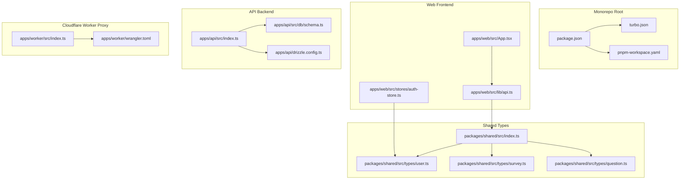
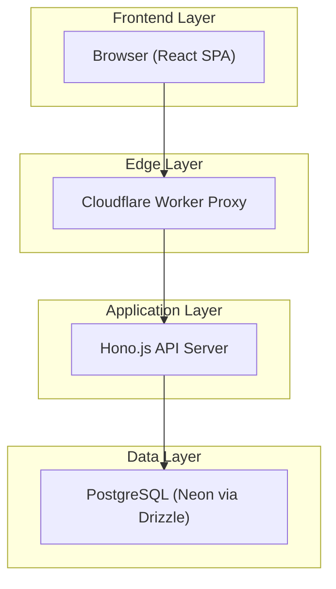
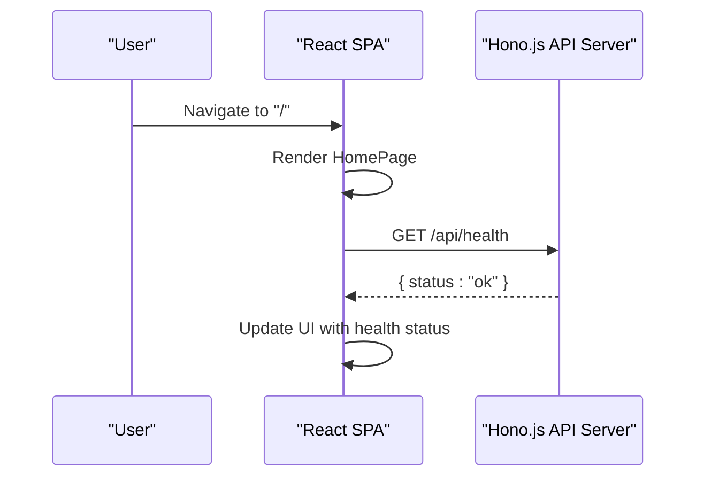
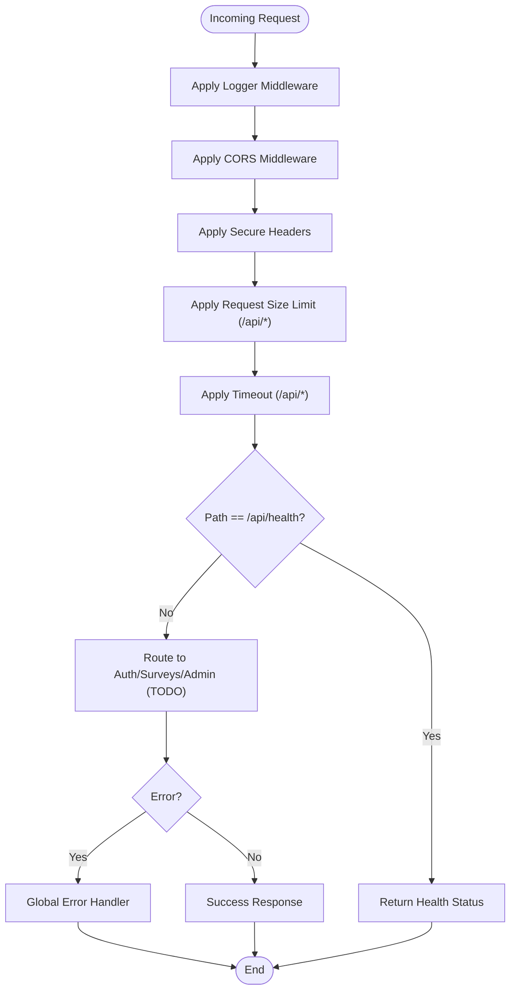
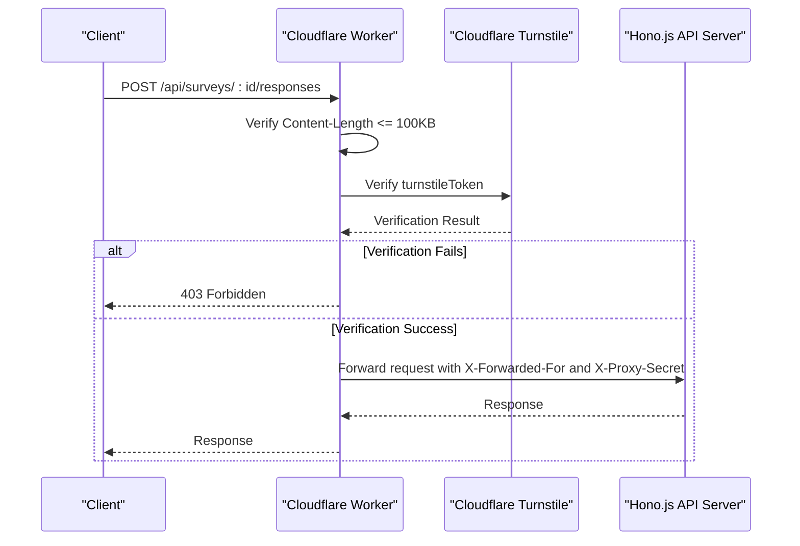
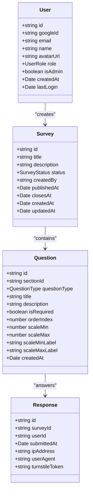
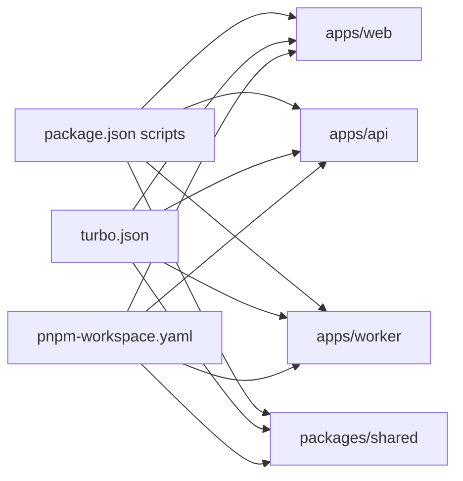
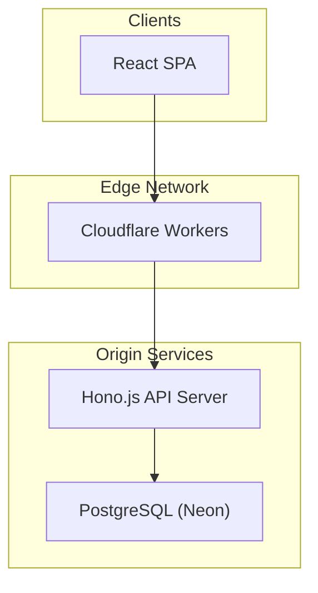

# Architecture Documentation

<cite>
**Referenced Files in This Document**
- [apps/web/src/App.tsx](file://apps/web/src/App.tsx)
- [apps/web/src/lib/api.ts](file://apps/web/src/lib/api.ts)
- [apps/web/src/stores/auth-store.ts](file://apps/web/src/stores/auth-store.ts)
- [apps/api/src/index.ts](file://apps/api/src/index.ts)
- [apps/api/src/db/schema.ts](file://apps/api/src/db/schema.ts)
- [apps/api/drizzle.config.ts](file://apps/api/drizzle.config.ts)
- [apps/worker/src/index.ts](file://apps/worker/src/index.ts)
- [apps/worker/wrangler.toml](file://apps/worker/wrangler.toml)
- [packages/shared/src/index.ts](file://packages/shared/src/index.ts)
- [packages/shared/src/types/user.ts](file://packages/shared/src/types/user.ts)
- [packages/shared/src/types/survey.ts](file://packages/shared/src/types/survey.ts)
- [packages/shared/src/types/question.ts](file://packages/shared/src/types/question.ts)
- [package.json](file://package.json)
- [turbo.json](file://turbo.json)
- [pnpm-workspace.yaml](file://pnpm-workspace.yaml)
</cite>

## Table of Contents
1. [Introduction](#introduction)
2. [Project Structure](#project-structure)
3. [Core Components](#core-components)
4. [Architecture Overview](#architecture-overview)
5. [Detailed Component Analysis](#detailed-component-analysis)
6. [Dependency Analysis](#dependency-analysis)
7. [Performance Considerations](#performance-considerations)
8. [Security and Cross-Cutting Concerns](#security-and-cross-cutting-constraints)
9. [Deployment Topology](#deployment-topology)
10. [Troubleshooting Guide](#troubleshooting-guide)
11. [Conclusion](#conclusion)

## Introduction
This document describes the cursoranket system architecture. It is a monorepo containing a React Single Page Application (SPA), a Hono.js API server, and a Cloudflare Worker proxy. The system follows layered architecture with clear separation of concerns: the web frontend handles user interactions, the API backend manages business logic and persistence, and the Cloudflare Worker acts as an edge proxy enforcing security and routing traffic to the backend. The design leverages edge computing for low-latency responses and robust security controls, while the shared package ensures type safety across services.

## Project Structure
The repository is organized as a monorepo with three primary applications and a shared package:
- apps/web: React SPA with routing, API client, and authentication store
- apps/api: Hono.js server with middleware, health checks, and database schema
- apps/worker: Cloudflare Worker proxy implementing CORS, security headers, request limits, and Turnstile verification
- packages/shared: TypeScript types and schemas shared across applications

**Diagram sources**
- [package.json:1-25](file://package.json#L1-L25)
- [turbo.json:1-29](file://turbo.json#L1-L29)
- [pnpm-workspace.yaml:1-4](file://pnpm-workspace.yaml#L1-L4)
- [apps/web/src/App.tsx:1-23](file://apps/web/src/App.tsx#L1-L23)
- [apps/web/src/lib/api.ts:1-60](file://apps/web/src/lib/api.ts#L1-L60)
- [apps/web/src/stores/auth-store.ts:1-31](file://apps/web/src/stores/auth-store.ts#L1-L31)
- [apps/api/src/index.ts:1-67](file://apps/api/src/index.ts#L1-L67)
- [apps/api/src/db/schema.ts:1-247](file://apps/api/src/db/schema.ts#L1-L247)
- [apps/api/drizzle.config.ts:1-11](file://apps/api/drizzle.config.ts#L1-L11)
- [apps/worker/src/index.ts:1-106](file://apps/worker/src/index.ts#L1-L106)
- [apps/worker/wrangler.toml:1-13](file://apps/worker/wrangler.toml#L1-L13)
- [packages/shared/src/index.ts:1-10](file://packages/shared/src/index.ts#L1-L10)
- [packages/shared/src/types/user.ts:1-22](file://packages/shared/src/types/user.ts#L1-L22)
- [packages/shared/src/types/survey.ts:1-50](file://packages/shared/src/types/survey.ts#L1-L50)
- [packages/shared/src/types/question.ts:1-66](file://packages/shared/src/types/question.ts#L1-L66)

**Section sources**
- [package.json:1-25](file://package.json#L1-L25)
- [turbo.json:1-29](file://turbo.json#L1-L29)
- [pnpm-workspace.yaml:1-4](file://pnpm-workspace.yaml#L1-L4)

## Core Components
- React SPA (apps/web): Provides user interface, routing, API client, and authentication state management.
- Hono.js API Server (apps/api): Exposes REST endpoints behind middleware for logging, CORS, security headers, timeouts, and error handling.
- Cloudflare Worker Proxy (apps/worker): Enforces CORS, security headers, request size limits, Turnstile CAPTCHA verification for survey responses, and proxies requests to the backend.
- Shared Package (packages/shared): Defines TypeScript types and schemas for users, surveys, questions, and responses to ensure consistency across services.

Key responsibilities:
- Web frontend: Renders UI, authenticates users, and communicates with the API via a typed client.
- API backend: Implements business logic, validates requests, and persists data using Drizzle ORM with PostgreSQL.
- Worker proxy: Acts as the edge gateway, applying security policies and routing to the backend.

**Section sources**
- [apps/web/src/App.tsx:1-23](file://apps/web/src/App.tsx#L1-L23)
- [apps/web/src/lib/api.ts:1-60](file://apps/web/src/lib/api.ts#L1-L60)
- [apps/web/src/stores/auth-store.ts:1-31](file://apps/web/src/stores/auth-store.ts#L1-L31)
- [apps/api/src/index.ts:1-67](file://apps/api/src/index.ts#L1-L67)
- [apps/api/src/db/schema.ts:1-247](file://apps/api/src/db/schema.ts#L1-L247)
- [apps/worker/src/index.ts:1-106](file://apps/worker/src/index.ts#L1-L106)
- [packages/shared/src/index.ts:1-10](file://packages/shared/src/index.ts#L1-L10)

## Architecture Overview
The system follows a layered architecture with clear separation between presentation, API, and data layers. The Cloudflare Worker sits at the edge, validating requests and forwarding them to the backend. The API server manages business logic and interacts with the database through Drizzle ORM.

**Diagram sources**
- [apps/web/src/lib/api.ts:1-60](file://apps/web/src/lib/api.ts#L1-L60)
- [apps/worker/src/index.ts:1-106](file://apps/worker/src/index.ts#L1-L106)
- [apps/api/src/index.ts:1-67](file://apps/api/src/index.ts#L1-L67)
- [apps/api/src/db/schema.ts:1-247](file://apps/api/src/db/schema.ts#L1-L247)

## Detailed Component Analysis

### React SPA
The SPA provides a single-page experience with routing and a centralized API client. It uses a Zustand store for authentication state and imports shared types for type safety.

**Diagram sources**
- [apps/web/src/App.tsx:1-23](file://apps/web/src/App.tsx#L1-L23)
- [apps/api/src/index.ts:40-42](file://apps/api/src/index.ts#L40-L42)

**Section sources**
- [apps/web/src/App.tsx:1-23](file://apps/web/src/App.tsx#L1-L23)
- [apps/web/src/lib/api.ts:1-60](file://apps/web/src/lib/api.ts#L1-L60)
- [apps/web/src/stores/auth-store.ts:1-31](file://apps/web/src/stores/auth-store.ts#L1-L31)

### Hono.js API Server
The API server initializes Hono, applies middleware for logging, CORS, security headers, and timeouts, exposes a health endpoint, and defines placeholders for authentication, surveys, and admin routes. It also includes a global error handler and a 404 handler.

**Diagram sources**
- [apps/api/src/index.ts:11-58](file://apps/api/src/index.ts#L11-L58)

**Section sources**
- [apps/api/src/index.ts:1-67](file://apps/api/src/index.ts#L1-L67)

### Cloudflare Worker Proxy
The worker enforces CORS, security headers, request size limits, and Turnstile verification for survey response submissions. It proxies all other requests to the backend with forwarded IP and internal secret headers.

**Diagram sources**
- [apps/worker/src/index.ts:33-103](file://apps/worker/src/index.ts#L33-L103)

**Section sources**
- [apps/worker/src/index.ts:1-106](file://apps/worker/src/index.ts#L1-L106)
- [apps/worker/wrangler.toml:1-13](file://apps/worker/wrangler.toml#L1-L13)

### Shared Types and Schemas
The shared package exports user, survey, question, and response types and schemas, ensuring consistent data contracts across the frontend and backend.

**Diagram sources**
- [packages/shared/src/types/user.ts:1-22](file://packages/shared/src/types/user.ts#L1-L22)
- [packages/shared/src/types/survey.ts:1-50](file://packages/shared/src/types/survey.ts#L1-L50)
- [packages/shared/src/types/question.ts:1-66](file://packages/shared/src/types/question.ts#L1-L66)

**Section sources**
- [packages/shared/src/index.ts:1-10](file://packages/shared/src/index.ts#L1-L10)
- [packages/shared/src/types/user.ts:1-22](file://packages/shared/src/types/user.ts#L1-L22)
- [packages/shared/src/types/survey.ts:1-50](file://packages/shared/src/types/survey.ts#L1-L50)
- [packages/shared/src/types/question.ts:1-66](file://packages/shared/src/types/question.ts#L1-L66)

## Dependency Analysis
The monorepo uses Turbo for task orchestration and PNPM for workspace management. Scripts enable development and build tasks for each application and database operations.

**Diagram sources**
- [package.json:6-18](file://package.json#L6-L18)
- [turbo.json:3-27](file://turbo.json#L3-L27)
- [pnpm-workspace.yaml:1-4](file://pnpm-workspace.yaml#L1-L4)

**Section sources**
- [package.json:1-25](file://package.json#L1-L25)
- [turbo.json:1-29](file://turbo.json#L1-L29)
- [pnpm-workspace.yaml:1-4](file://pnpm-workspace.yaml#L1-L4)

## Performance Considerations
- Edge-first design: Cloudflare Workers execute close to users, minimizing latency for API requests.
- Request size limits: Enforced at the edge to prevent oversized payloads and reduce backend load.
- Timeouts: Configured middleware ensures requests do not hang indefinitely.
- Database indexing: Schema includes indexes on frequently queried columns to optimize read performance.
- Caching opportunities: Redis can be integrated via Upstash for session caching and rate limiting at the edge.

[No sources needed since this section provides general guidance]

## Security and Cross-Cutting Concerns
- CORS: Strictly configured origins for both the API server and the worker.
- Security headers: Applied globally to mitigate common web vulnerabilities.
- Request size limits: Prevents abuse and reduces resource consumption.
- Rate limiting: Can be implemented at the edge using Redis for IP-based quotas.
- Authentication: OAuth with Google is supported by the user model; integrate provider flows in the frontend and backend.
- Data validation: Shared schemas ensure consistent validation across services.
- Internal proxy secret: Worker sets an internal header to distinguish proxied requests.

**Section sources**
- [apps/api/src/index.ts:12-22](file://apps/api/src/index.ts#L12-L22)
- [apps/worker/src/index.ts:15-28](file://apps/worker/src/index.ts#L15-L28)
- [apps/api/src/db/schema.ts:41-51](file://apps/api/src/db/schema.ts#L41-L51)

## Deployment Topology
The system is designed for scalable deployment:
- Frontend: Hosted statically (Vite build) behind CDN.
- API: Deployed to a platform supporting Hono servers (e.g., Render or Vercel Functions).
- Worker: Deployed to Cloudflare Workers with environment variables and secrets.
- Database: PostgreSQL managed service (e.g., Neon) accessed via Drizzle ORM.

**Diagram sources**
- [apps/worker/wrangler.toml:1-13](file://apps/worker/wrangler.toml#L1-L13)
- [apps/api/drizzle.config.ts:1-11](file://apps/api/drizzle.config.ts#L1-L11)

## Troubleshooting Guide
Common issues and resolutions:
- CORS errors: Verify allowed origins match the frontend URL in both the API server and worker.
- Health check failures: Confirm the API server is running and listening on the configured port.
- Turnstile verification failures: Ensure the secret key is set and the site key is configured in the frontend.
- Database connectivity: Validate DATABASE_URL and migration status using Drizzle CLI commands.
- Proxy secret mismatch: Ensure the internal header is present when the worker forwards requests.

**Section sources**
- [apps/api/src/index.ts:12-22](file://apps/api/src/index.ts#L12-L22)
- [apps/worker/src/index.ts:15-28](file://apps/worker/src/index.ts#L15-L28)
- [apps/api/drizzle.config.ts:1-11](file://apps/api/drizzle.config.ts#L1-L11)

## Conclusion
The cursoranket architecture combines a modern React SPA, a Hono.js API server, and a Cloudflare Worker proxy to deliver a fast, secure, and scalable survey platform. The monorepo structure and shared types promote maintainability and consistency. By leveraging edge computing, strict security controls, and a well-designed data layer, the system is positioned to handle growth and evolving requirements.