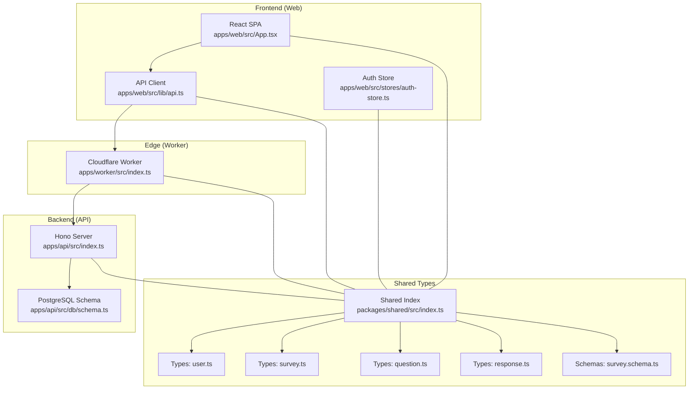
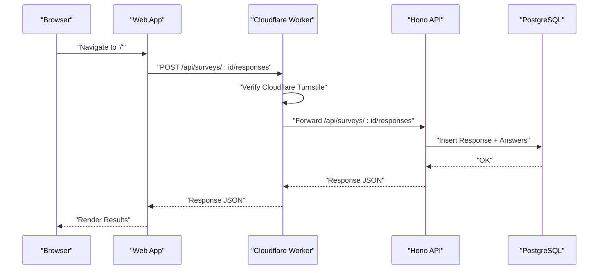
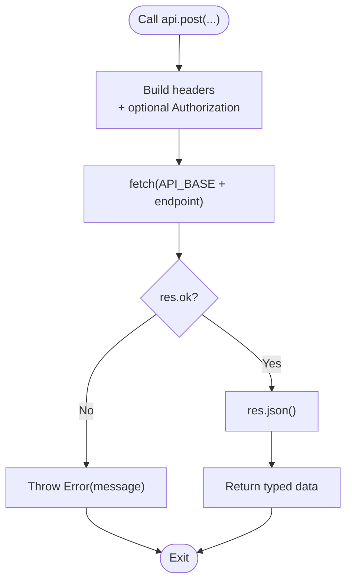
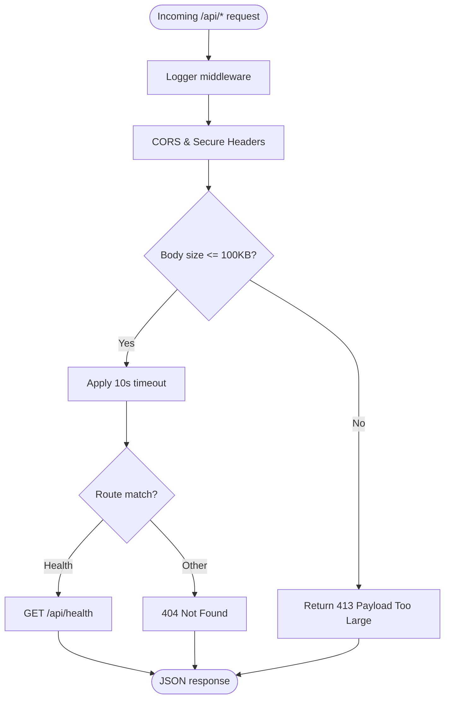
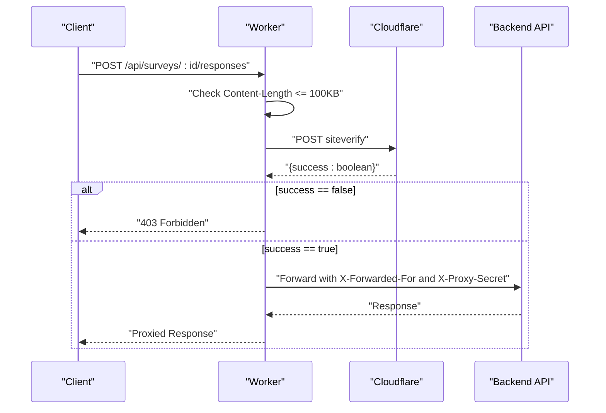
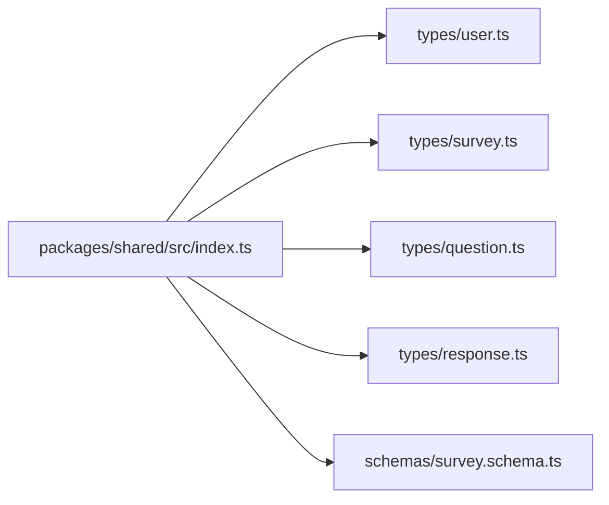
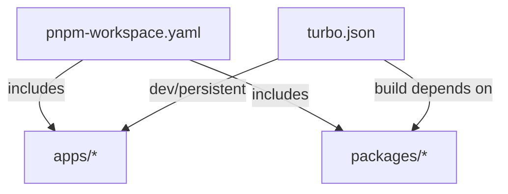

# Component Relationships

<cite>
**Referenced Files in This Document**
- [apps/web/src/App.tsx](file://apps/web/src/App.tsx)
- [apps/web/src/lib/api.ts](file://apps/web/src/lib/api.ts)
- [apps/web/src/stores/auth-store.ts](file://apps/web/src/stores/auth-store.ts)
- [apps/api/src/index.ts](file://apps/api/src/index.ts)
- [apps/api/src/db/schema.ts](file://apps/api/src/db/schema.ts)
- [apps/worker/src/index.ts](file://apps/worker/src/index.ts)
- [packages/shared/src/index.ts](file://packages/shared/src/index.ts)
- [packages/shared/src/types/user.ts](file://packages/shared/src/types/user.ts)
- [packages/shared/src/types/survey.ts](file://packages/shared/src/types/survey.ts)
- [packages/shared/src/types/question.ts](file://packages/shared/src/types/question.ts)
- [packages/shared/src/types/response.ts](file://packages/shared/src/types/response.ts)
- [packages/shared/src/schemas/survey.schema.ts](file://packages/shared/src/schemas/survey.schema.ts)
- [turbo.json](file://turbo.json)
- [pnpm-workspace.yaml](file://pnpm-workspace.yaml)
</cite>

## Table of Contents
1. [Introduction](#introduction)
2. [Project Structure](#project-structure)
3. [Core Components](#core-components)
4. [Architecture Overview](#architecture-overview)
5. [Detailed Component Analysis](#detailed-component-analysis)
6. [Dependency Analysis](#dependency-analysis)
7. [Performance Considerations](#performance-considerations)
8. [Troubleshooting Guide](#troubleshooting-guide)
9. [Conclusion](#conclusion)

## Introduction
This document explains how the three main applications in the cursoranket system relate to each other and collaborate:
- The React SPA frontend (web app) renders the user interface and manages client-side state.
- The Hono.js backend API (API server) exposes REST endpoints and interacts with the database.
- The Cloudflare Worker proxy (worker) acts as a gateway that validates requests, enforces security policies, and proxies traffic to the backend API.
- A shared package defines cross-cutting types and validation schemas used by all components to maintain type consistency and reduce integration drift.

We describe data flow patterns, API communication protocols, and state management coordination, and we show how the shared package is the integration point that ties everything together.

## Project Structure
The repository follows a monorepo layout with three applications and a shared package:
- apps/web: Vite-based React SPA with routing, API client, and Zustand-based auth store.
- apps/api: Hono.js server with middleware, health endpoint, and placeholder route mounts.
- apps/worker: Cloudflare Worker that applies CORS, security headers, rate-limit-like checks, Cloudflare Turnstile verification, and proxies /api/* to the backend.
- packages/shared: TypeScript types and Zod schemas exported via a central index for reuse across the stack.

**Diagram sources**
- [apps/web/src/App.tsx:1-23](file://apps/web/src/App.tsx#L1-L23)
- [apps/web/src/lib/api.ts:1-60](file://apps/web/src/lib/api.ts#L1-L60)
- [apps/web/src/stores/auth-store.ts:1-31](file://apps/web/src/stores/auth-store.ts#L1-L31)
- [apps/worker/src/index.ts:1-106](file://apps/worker/src/index.ts#L1-L106)
- [apps/api/src/index.ts:1-67](file://apps/api/src/index.ts#L1-L67)
- [apps/api/src/db/schema.ts:1-247](file://apps/api/src/db/schema.ts#L1-L247)
- [packages/shared/src/index.ts:1-10](file://packages/shared/src/index.ts#L1-L10)
- [packages/shared/src/types/user.ts:1-22](file://packages/shared/src/types/user.ts#L1-L22)
- [packages/shared/src/types/survey.ts:1-50](file://packages/shared/src/types/survey.ts#L1-L50)
- [packages/shared/src/types/question.ts:1-66](file://packages/shared/src/types/question.ts#L1-L66)
- [packages/shared/src/types/response.ts:1-53](file://packages/shared/src/types/response.ts#L1-L53)
- [packages/shared/src/schemas/survey.schema.ts:1-22](file://packages/shared/src/schemas/survey.schema.ts#L1-L22)

**Section sources**
- [pnpm-workspace.yaml:1-4](file://pnpm-workspace.yaml#L1-L4)
- [turbo.json:1-29](file://turbo.json#L1-L29)

## Core Components
- React SPA (web):
  - Provides routing and UI scaffolding.
  - Uses a typed API client to communicate with the backend.
  - Manages authentication state with a Zustand store that imports shared types.
- Hono.js API (api):
  - Serves middleware, health checks, and future route mounts.
  - Interacts with PostgreSQL via Drizzle ORM using the schema definitions.
- Cloudflare Worker (worker):
  - Enforces CORS and security headers.
  - Validates Cloudflare Turnstile tokens for specific endpoints.
  - Proxies /api/* requests to the backend with forwarded headers and a secret header for internal trust.
- Shared package:
  - Exports reusable types and Zod schemas.
  - Ensures frontend, backend, and worker use identical shapes for data contracts.

**Section sources**
- [apps/web/src/App.tsx:1-23](file://apps/web/src/App.tsx#L1-L23)
- [apps/web/src/lib/api.ts:1-60](file://apps/web/src/lib/api.ts#L1-L60)
- [apps/web/src/stores/auth-store.ts:1-31](file://apps/web/src/stores/auth-store.ts#L1-L31)
- [apps/api/src/index.ts:1-67](file://apps/api/src/index.ts#L1-L67)
- [apps/api/src/db/schema.ts:1-247](file://apps/api/src/db/schema.ts#L1-L247)
- [apps/worker/src/index.ts:1-106](file://apps/worker/src/index.ts#L1-L106)
- [packages/shared/src/index.ts:1-10](file://packages/shared/src/index.ts#L1-L10)

## Architecture Overview
The system uses a classic layered architecture with a clear separation of concerns:
- Frontend: UI and client-side state.
- Edge: Cloudflare Worker handles cross-origin, security, and request forwarding.
- Backend: Hono server with middleware and database access.
- Shared: Types and schemas unify contracts across layers.

**Diagram sources**
- [apps/web/src/lib/api.ts:1-60](file://apps/web/src/lib/api.ts#L1-L60)
- [apps/worker/src/index.ts:42-103](file://apps/worker/src/index.ts#L42-L103)
- [apps/api/src/index.ts:39-58](file://apps/api/src/index.ts#L39-L58)
- [apps/api/src/db/schema.ts:173-222](file://apps/api/src/db/schema.ts#L173-L222)

## Detailed Component Analysis

### React SPA Frontend
- Routing and UI:
  - The SPA sets up a basic route for the home page using React Router.
- API client:
  - A generic fetch wrapper constructs requests, injects Authorization headers when present, and parses JSON responses. It throws on non-OK responses with a user-friendly message.
- Authentication state:
  - A Zustand store holds user session data and derived flags (authenticated, loading). It imports shared types to keep the client state shape aligned with backend/user contracts.

**Diagram sources**
- [apps/web/src/lib/api.ts:7-30](file://apps/web/src/lib/api.ts#L7-L30)

**Section sources**
- [apps/web/src/App.tsx:1-23](file://apps/web/src/App.tsx#L1-L23)
- [apps/web/src/lib/api.ts:1-60](file://apps/web/src/lib/api.ts#L1-L60)
- [apps/web/src/stores/auth-store.ts:1-31](file://apps/web/src/stores/auth-store.ts#L1-L31)

### Hono.js Backend API
- Middleware and security:
  - Logger, CORS configured to allow the frontend origin, and secure headers are applied globally.
- Request limits and timeouts:
  - Body size enforcement for /api/* prevents oversized payloads.
  - A timeout middleware ensures requests fail fast after a threshold.
- Health check:
  - A GET /api/health endpoint returns a simple heartbeat payload.
- Future routes:
  - Placeholder mounts indicate where authentication, surveys, and admin endpoints will be wired.

**Diagram sources**
- [apps/api/src/index.ts:11-58](file://apps/api/src/index.ts#L11-L58)

**Section sources**
- [apps/api/src/index.ts:1-67](file://apps/api/src/index.ts#L1-L67)
- [apps/api/src/db/schema.ts:1-247](file://apps/api/src/db/schema.ts#L1-L247)

### Cloudflare Worker Proxy
- CORS and security:
  - Applies CORS allowing only the configured frontend origin and secure headers.
- Request validation:
  - Enforces a 100KB body size limit for /api/*.
  - For POST to /api/surveys/:id/responses, verifies Cloudflare Turnstile token against the Cloudflare endpoint.
- Proxying:
  - Forwards matched requests to the backend API base URL with forwarded IP and an internal secret header to mark the request as proxied.

**Diagram sources**
- [apps/worker/src/index.ts:15-103](file://apps/worker/src/index.ts#L15-L103)

**Section sources**
- [apps/worker/src/index.ts:1-106](file://apps/worker/src/index.ts#L1-L106)

### Shared Package: Types and Schemas
- Central exports:
  - The shared index re-exports user, survey, question, and response types, plus survey, question, response, and assignment schemas.
- User types:
  - Defines roles and user/session shapes used across the system.
- Survey types:
  - Includes statuses, sections, assignments, and enriched survey payloads.
- Question types:
  - Enumerates question types and related structures like options and matrix rows/columns.
- Response types:
  - Covers response records, answer values, submission payloads, and statistics.
- Validation schemas:
  - Zod schemas for survey creation/update/status updates ensure consistent input validation on the backend.

**Diagram sources**
- [packages/shared/src/index.ts:1-10](file://packages/shared/src/index.ts#L1-L10)
- [packages/shared/src/types/user.ts:1-22](file://packages/shared/src/types/user.ts#L1-L22)
- [packages/shared/src/types/survey.ts:1-50](file://packages/shared/src/types/survey.ts#L1-L50)
- [packages/shared/src/types/question.ts:1-66](file://packages/shared/src/types/question.ts#L1-L66)
- [packages/shared/src/types/response.ts:1-53](file://packages/shared/src/types/response.ts#L1-L53)
- [packages/shared/src/schemas/survey.schema.ts:1-22](file://packages/shared/src/schemas/survey.schema.ts#L1-L22)

**Section sources**
- [packages/shared/src/index.ts:1-10](file://packages/shared/src/index.ts#L1-L10)
- [packages/shared/src/types/user.ts:1-22](file://packages/shared/src/types/user.ts#L1-L22)
- [packages/shared/src/types/survey.ts:1-50](file://packages/shared/src/types/survey.ts#L1-L50)
- [packages/shared/src/types/question.ts:1-66](file://packages/shared/src/types/question.ts#L1-L66)
- [packages/shared/src/types/response.ts:1-53](file://packages/shared/src/types/response.ts#L1-L53)
- [packages/shared/src/schemas/survey.schema.ts:1-22](file://packages/shared/src/schemas/survey.schema.ts#L1-L22)

## Dependency Analysis
- Workspace and build orchestration:
  - The workspace includes apps and packages.
  - Turborepo tasks define build and development workflows, ensuring downstream apps build after upstream packages.
- Cross-component dependencies:
  - The frontend imports shared types for state typing and API payloads.
  - The backend imports shared types for request/response shapes and uses Zod schemas for validation.
  - The worker imports shared types to align with user and survey contracts and to enforce consistent headers.

**Diagram sources**
- [pnpm-workspace.yaml:1-4](file://pnpm-workspace.yaml#L1-L4)
- [turbo.json:3-11](file://turbo.json#L3-L11)

**Section sources**
- [pnpm-workspace.yaml:1-4](file://pnpm-workspace.yaml#L1-L4)
- [turbo.json:1-29](file://turbo.json#L1-L29)

## Performance Considerations
- Edge caching and latency:
  - Cloudflare Worker proximity reduces latency for global users. Keep middleware minimal to avoid increasing edge processing time.
- Request sizing:
  - Both worker and API enforce a 100KB request body limit to prevent resource exhaustion.
- Timeouts:
  - The API server applies a 10-second timeout for /api/* to fail fast under load.
- Database throughput:
  - The schema includes indexes on foreign keys and composite unique constraints to optimize reads/writes for responses, answers, and assignments.

[No sources needed since this section provides general guidance]

## Troubleshooting Guide
- CORS errors from the browser:
  - Verify the frontend origin matches the allowed origin in both the API server and the Worker.
- Turnstile verification failures:
  - Ensure the Cloudflare secret key is configured and that the frontend sends the token in the submission payload for the protected endpoint.
- Proxy secrets and internal trust:
  - The Worker sets an internal secret header when forwarding to the backend. Confirm the backend does not require this header for public endpoints.
- Body size errors:
  - Requests exceeding 100KB will be rejected. Compress payloads or split large submissions.
- Health checks:
  - Use the /api/health endpoint to confirm the backend is reachable and responsive.
- Type mismatches:
  - If frontend or backend types diverge, update the shared package and rebuild all apps to ensure alignment.

**Section sources**
- [apps/api/src/index.ts:15-22](file://apps/api/src/index.ts#L15-L22)
- [apps/worker/src/index.ts:18-28](file://apps/worker/src/index.ts#L18-L28)
- [apps/worker/src/index.ts:57-76](file://apps/worker/src/index.ts#L57-L76)
- [apps/worker/src/index.ts:86-96](file://apps/worker/src/index.ts#L86-L96)
- [apps/api/src/index.ts:27-32](file://apps/api/src/index.ts#L27-L32)

## Conclusion
The cursoranket system integrates a React SPA, a Hono.js API, and a Cloudflare Worker proxy around a shared package that defines types and validation schemas. This design ensures consistent contracts across components, simplifies state management on the frontend, and centralizes security and validation logic at the edge. By following the documented data flows and leveraging the shared package, teams can extend the system with confidence while maintaining type safety and operational reliability.