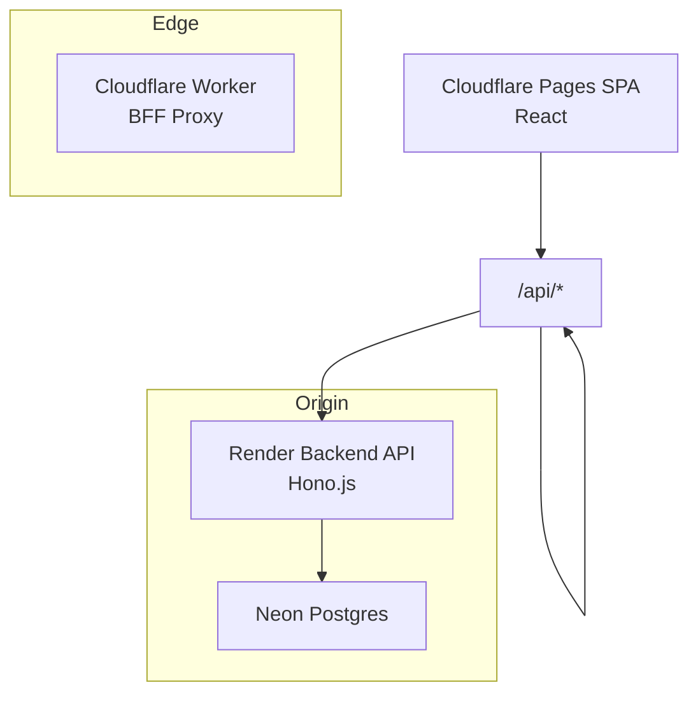
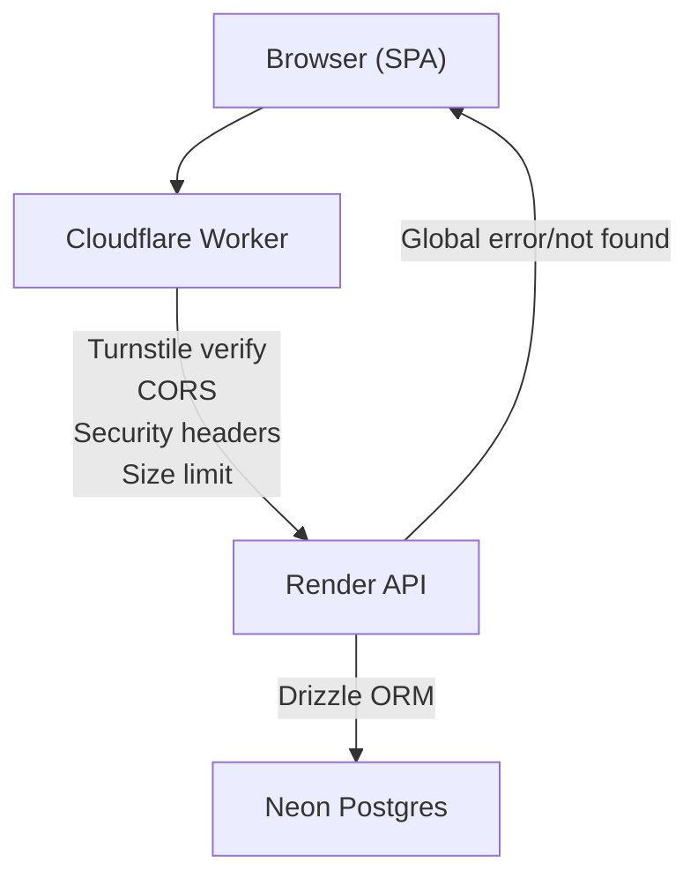
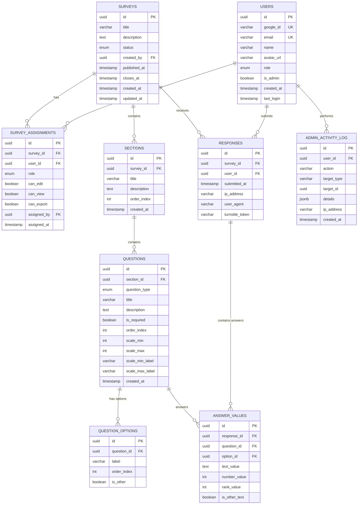
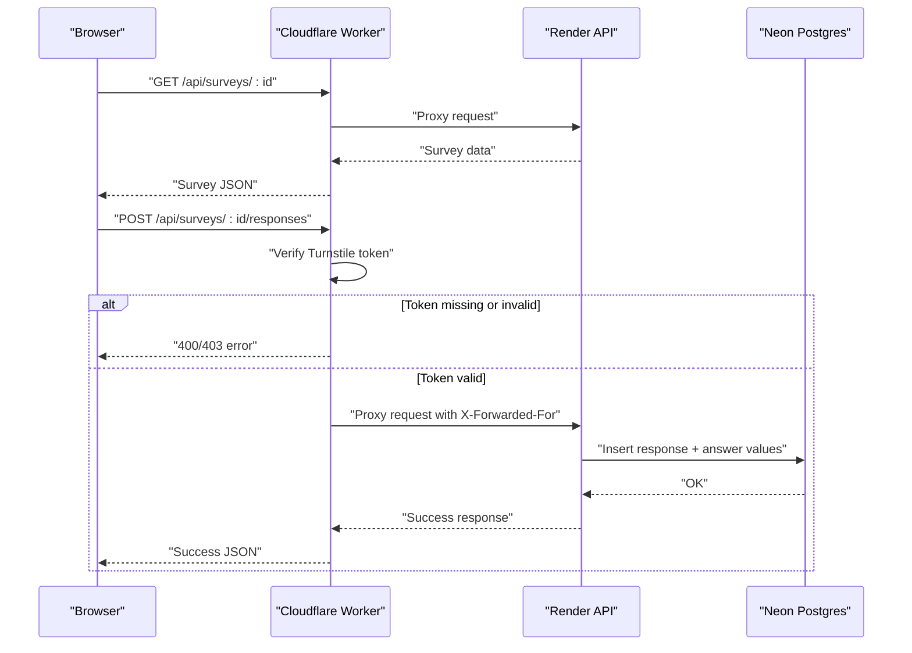
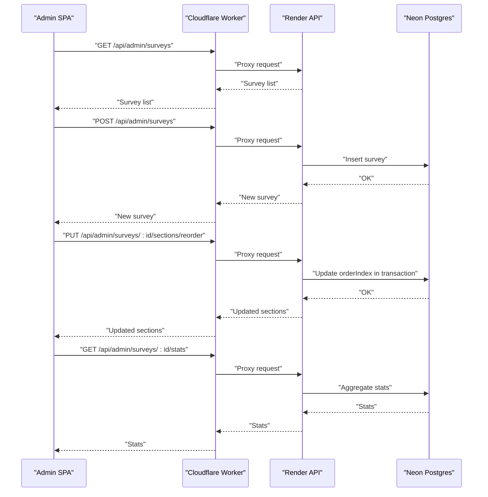
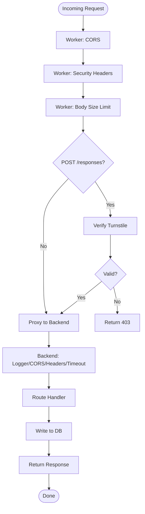
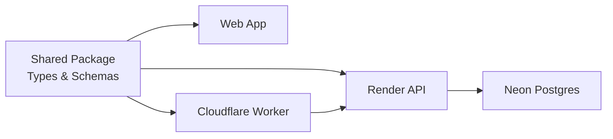

# Data Flow Diagrams

<cite>
**Referenced Files in This Document**
- [apps/api/src/index.ts](file://apps/api/src/index.ts)
- [apps/api/src/db/schema.ts](file://apps/api/src/db/schema.ts)
- [apps/api/src/db/index.ts](file://apps/api/src/db/index.ts)
- [apps/worker/src/index.ts](file://apps/worker/src/index.ts)
- [apps/worker/wrangler.toml](file://apps/worker/wrangler.toml)
- [apps/web/src/lib/api.ts](file://apps/web/src/lib/api.ts)
- [apps/web/src/stores/auth-store.ts](file://apps/web/src/stores/auth-store.ts)
- [packages/shared/src/index.ts](file://packages/shared/src/index.ts)
- [packages/shared/src/types/survey.ts](file://packages/shared/src/types/survey.ts)
- [packages/shared/src/types/response.ts](file://packages/shared/src/types/response.ts)
- [packages/shared/src/schemas/survey.schema.ts](file://packages/shared/src/schemas/survey.schema.ts)
- [plan.md](file://plan.md)
</cite>

## Table of Contents
1. [Introduction](#introduction)
2. [Project Structure](#project-structure)
3. [Core Components](#core-components)
4. [Architecture Overview](#architecture-overview)
5. [Detailed Component Analysis](#detailed-component-analysis)
6. [Dependency Analysis](#dependency-analysis)
7. [Performance Considerations](#performance-considerations)
8. [Troubleshooting Guide](#troubleshooting-guide)
9. [Conclusion](#conclusion)
10. [Appendices](#appendices)

## Introduction
This document provides comprehensive data flow documentation for the cursoranket system. It traces how user requests traverse the architecture layers from Cloudflare Workers (edge BFF proxy), through the backend API hosted on Render, to the database, while highlighting edge computing benefits, security validations, caching strategies, rate limiting, and error handling patterns. Sequence diagrams illustrate typical workflows such as survey completion and admin operations.

## Project Structure
The system is organized as a monorepo with three primary applications and a shared package:
- Cloudflare Worker (BFF Proxy): Enforces CORS, security headers, request size limits, Cloudflare Turnstile verification, and proxies API traffic to the backend.
- Backend API (Render): Hono.js REST API with middleware for logging, CORS, security headers, timeouts, and global error handling.
- Frontend (Cloudflare Pages): React SPA that communicates with the backend via a typed API client.
- Shared Package: Type definitions and Zod schemas shared across frontend and backend.

**Diagram sources**
- [apps/worker/src/index.ts:1-106](file://apps/worker/src/index.ts#L1-L106)
- [apps/api/src/index.ts:1-67](file://apps/api/src/index.ts#L1-L67)
- [apps/api/src/db/schema.ts:1-247](file://apps/api/src/db/schema.ts#L1-L247)

**Section sources**
- [apps/worker/src/index.ts:1-106](file://apps/worker/src/index.ts#L1-L106)
- [apps/api/src/index.ts:1-67](file://apps/api/src/index.ts#L1-L67)
- [apps/web/src/lib/api.ts:1-60](file://apps/web/src/lib/api.ts#L1-L60)
- [packages/shared/src/index.ts:1-10](file://packages/shared/src/index.ts#L1-L10)
- [plan.md:139-184](file://plan.md#L139-L184)

## Core Components
- Cloudflare Worker (BFF Proxy):
  - Enforces CORS for the frontend origin only.
  - Applies security headers globally.
  - Validates request body size for API endpoints.
  - Performs Cloudflare Turnstile verification for survey response submissions.
  - Proxies all /api/* requests to the backend with forwarded client metadata.
- Backend API (Render):
  - Hono.js server with logging, CORS, security headers, and timeout middleware.
  - Health check endpoint.
  - Global error and not-found handlers.
- Frontend API Client:
  - Typed fetch wrapper that injects Authorization headers and handles HTTP errors.
- Shared Types and Schemas:
  - Strongly-typed survey, question, response, and assignment models.
  - Zod schemas for runtime validation of survey creation/update and response submission.

**Section sources**
- [apps/worker/src/index.ts:15-103](file://apps/worker/src/index.ts#L15-L103)
- [apps/api/src/index.ts:11-58](file://apps/api/src/index.ts#L11-L58)
- [apps/web/src/lib/api.ts:7-30](file://apps/web/src/lib/api.ts#L7-L30)
- [packages/shared/src/types/survey.ts:1-50](file://packages/shared/src/types/survey.ts#L1-L50)
- [packages/shared/src/types/response.ts:1-53](file://packages/shared/src/types/response.ts#L1-L53)
- [packages/shared/src/schemas/survey.schema.ts:1-22](file://packages/shared/src/schemas/survey.schema.ts#L1-L22)

## Architecture Overview
The system employs a layered edge-to-origin architecture:
- Edge (Cloudflare Workers): Performs bot protection, rate limiting, CORS enforcement, security headers, and request size checks before proxying to the backend.
- Origin (Render): Runs the Hono.js API with middleware and routes for authentication, surveys, responses, and admin operations.
- Database (Neon Postgres): Stores users, surveys, assignments, sections, questions, responses, answer values, and admin activity logs.

**Diagram sources**
- [apps/worker/src/index.ts:15-103](file://apps/worker/src/index.ts#L15-L103)
- [apps/api/src/index.ts:11-58](file://apps/api/src/index.ts#L11-L58)
- [apps/api/src/db/index.ts:1-9](file://apps/api/src/db/index.ts#L1-L9)

## Detailed Component Analysis

### Data Model Overview
The database schema defines entities for users, surveys, assignments, sections, questions, question options, responses, answer values, and admin activity logs. Unique constraints enforce one response per user per survey.

**Diagram sources**
- [apps/api/src/db/schema.ts:41-246](file://apps/api/src/db/schema.ts#L41-L246)

**Section sources**
- [apps/api/src/db/schema.ts:1-247](file://apps/api/src/db/schema.ts#L1-L247)

### Request Flow: Survey Completion (End-to-End)
This sequence illustrates a user completing a survey, including authentication, response submission, and validation at the edge and origin.

**Diagram sources**
- [apps/worker/src/index.ts:42-103](file://apps/worker/src/index.ts#L42-L103)
- [apps/api/src/db/schema.ts:173-222](file://apps/api/src/db/schema.ts#L173-L222)

**Section sources**
- [apps/worker/src/index.ts:42-103](file://apps/worker/src/index.ts#L42-L103)
- [apps/api/src/db/schema.ts:173-222](file://apps/api/src/db/schema.ts#L173-L222)

### Request Flow: Admin Operations (Surveys Management)
This sequence covers admin actions such as creating, updating, and publishing surveys, including reorder operations and statistics retrieval.

**Diagram sources**
- [apps/worker/src/index.ts:81-103](file://apps/worker/src/index.ts#L81-L103)
- [apps/api/src/db/schema.ts:57-99](file://apps/api/src/db/schema.ts#L57-L99)

**Section sources**
- [apps/worker/src/index.ts:81-103](file://apps/worker/src/index.ts#L81-L103)
- [apps/api/src/db/schema.ts:57-99](file://apps/api/src/db/schema.ts#L57-L99)

### Data Transformation Patterns
- Frontend to Worker:
  - The API client serializes payloads and attaches Authorization headers.
  - The Worker forwards headers including client IP and sets internal proxy secret.
- Worker to Backend:
  - The Worker clones the request body for verification, then proxies the request with modified headers.
- Backend to Database:
  - Drizzle ORM executes parameterized queries with strong typing from the schema.
- Backend to Worker:
  - Responses are streamed back with status and headers preserved.
- Worker to Frontend:
  - Responses are returned to the browser with appropriate status codes.

**Section sources**
- [apps/web/src/lib/api.ts:7-30](file://apps/web/src/lib/api.ts#L7-L30)
- [apps/worker/src/index.ts:82-103](file://apps/worker/src/index.ts#L82-L103)
- [apps/api/src/db/index.ts:1-9](file://apps/api/src/db/index.ts#L1-L9)

### Validation and Security Middleware Execution Order
- Cloudflare Worker:
  - CORS enforcement for the frontend origin.
  - Security headers applied globally.
  - Request body size limit enforced for API paths.
  - Turnstile verification for POST /api/surveys/*/responses.
  - Proxy to backend with forwarded client metadata.
- Render Backend:
  - Logging, CORS, security headers, and timeout middleware applied.
  - Global error and not-found handlers.

**Diagram sources**
- [apps/worker/src/index.ts:15-103](file://apps/worker/src/index.ts#L15-L103)
- [apps/api/src/index.ts:11-37](file://apps/api/src/index.ts#L11-L37)

**Section sources**
- [apps/worker/src/index.ts:15-103](file://apps/worker/src/index.ts#L15-L103)
- [apps/api/src/index.ts:11-37](file://apps/api/src/index.ts#L11-L37)

### Routing and Endpoint Examples
- Public:
  - GET /api/surveys
  - GET /api/surveys/:id
  - GET /api/surveys/:id/my-response
  - POST /api/surveys/:id/responses
- Admin:
  - GET /api/admin/surveys
  - POST /api/admin/surveys
  - PATCH /api/admin/surveys/:id
  - DELETE /api/admin/surveys/:id
  - PATCH /api/admin/surveys/:id/status
  - PUT /api/admin/surveys/:id/sections/reorder
  - PUT /api/admin/sections/:id/questions/reorder
  - GET /api/admin/surveys/:id/stats
  - GET /api/admin/surveys/:id/export/csv

These endpoints are proxied by the Worker and handled by the backend routes.

**Section sources**
- [plan.md:460-514](file://plan.md#L460-L514)
- [apps/worker/src/index.ts:81-103](file://apps/worker/src/index.ts#L81-L103)

### Error Handling Patterns
- Worker:
  - Returns 413 for oversized bodies.
  - Returns 400/403 for missing or invalid Turnstile tokens.
  - Proxies backend errors with status codes preserved.
- Backend:
  - Global error handler returns generic 500.
  - Not found handler returns 404.

**Section sources**
- [apps/worker/src/index.ts:33-79](file://apps/worker/src/index.ts#L33-L79)
- [apps/api/src/index.ts:49-58](file://apps/api/src/index.ts#L49-L58)

## Dependency Analysis
The frontend depends on the shared package for types and schemas, while the Worker and Backend both depend on the shared package for type-safe contracts. The Backend depends on Drizzle ORM and Neon for persistence.

**Diagram sources**
- [packages/shared/src/index.ts:1-10](file://packages/shared/src/index.ts#L1-L10)
- [apps/web/src/lib/api.ts:1-60](file://apps/web/src/lib/api.ts#L1-L60)
- [apps/worker/src/index.ts:1-106](file://apps/worker/src/index.ts#L1-L106)
- [apps/api/src/db/index.ts:1-9](file://apps/api/src/db/index.ts#L1-L9)

**Section sources**
- [packages/shared/src/index.ts:1-10](file://packages/shared/src/index.ts#L1-L10)
- [apps/web/src/lib/api.ts:1-60](file://apps/web/src/lib/api.ts#L1-L60)
- [apps/worker/src/index.ts:1-106](file://apps/worker/src/index.ts#L1-L106)
- [apps/api/src/db/index.ts:1-9](file://apps/api/src/db/index.ts#L1-L9)

## Performance Considerations
- Edge-first validation reduces backend load:
  - Turnstile verification occurs at the edge to block bots before reaching the backend.
  - Request size limits prevent large payloads from traversing the network.
- Streaming responses:
  - The Worker streams backend responses back to the client, minimizing latency.
- Keep-alive strategy:
  - A scheduled health check keeps the Render service warm during free tier idle periods.
- Caching and polling:
  - Admin dashboard uses hourly polling and cache-control headers to reduce unnecessary loads.

**Section sources**
- [apps/worker/src/index.ts:42-103](file://apps/worker/src/index.ts#L42-L103)
- [apps/api/src/index.ts:34-42](file://apps/api/src/index.ts#L34-L42)
- [plan.md:516-524](file://plan.md#L516-L524)
- [apps/worker/wrangler.toml:5-7](file://apps/worker/wrangler.toml#L5-L7)

## Troubleshooting Guide
- Turnstile failures:
  - Symptom: 403 responses on survey submission.
  - Cause: Missing or invalid token; verification endpoint unreachable.
  - Action: Ensure TURNSTILE_SECRET_KEY is configured; retry submission.
- Oversized request body:
  - Symptom: 413 responses.
  - Cause: Content-Length exceeds 100 KB.
  - Action: Reduce payload size or split requests.
- CORS errors:
  - Symptom: Preflight or fetch blocked.
  - Cause: Origin mismatch or misconfigured Worker CORS.
  - Action: Verify FRONTEND_URL matches the SPA origin.
- Backend errors:
  - Symptom: 500 responses.
  - Cause: Unhandled exceptions in route handlers.
  - Action: Check backend logs; confirm database connectivity and Drizzle queries.
- Authentication issues:
  - Symptom: Redirect loops or unauthorized access.
  - Cause: Better-auth misconfiguration or missing Authorization header.
  - Action: Confirm BFF proxy forwards headers and backend session is active.

**Section sources**
- [apps/worker/src/index.ts:15-103](file://apps/worker/src/index.ts#L15-L103)
- [apps/api/src/index.ts:49-58](file://apps/api/src/index.ts#L49-L58)
- [apps/web/src/lib/api.ts:15-17](file://apps/web/src/lib/api.ts#L15-L17)
- [apps/web/src/stores/auth-store.ts:1-31](file://apps/web/src/stores/auth-store.ts#L1-L31)

## Conclusion
The cursoranket system leverages Cloudflare Workers as an edge BFF to enforce security, validate requests, and proxy traffic to a Hono.js backend hosted on Render. The backend interacts with a strongly typed database schema via Drizzle ORM, ensuring data integrity and type safety. The architecture balances edge computing benefits with robust middleware, validation, and error handling to deliver a secure and performant survey platform.

## Appendices

### Edge Computing Benefits
- Bot mitigation via Turnstile at the edge.
- Reduced origin load through early request filtering.
- Faster response times by validating and proxying efficiently.

**Section sources**
- [apps/worker/src/index.ts:42-103](file://apps/worker/src/index.ts#L42-L103)
- [plan.md:179-184](file://plan.md#L179-L184)

### Security Middleware Execution Order
- Worker: CORS → Security headers → Body size limit → Turnstile verification → Proxy.
- Backend: Logger → CORS → Security headers → Timeout → Route handler → Global error handler.

**Section sources**
- [apps/worker/src/index.ts:15-103](file://apps/worker/src/index.ts#L15-L103)
- [apps/api/src/index.ts:11-58](file://apps/api/src/index.ts#L11-L58)