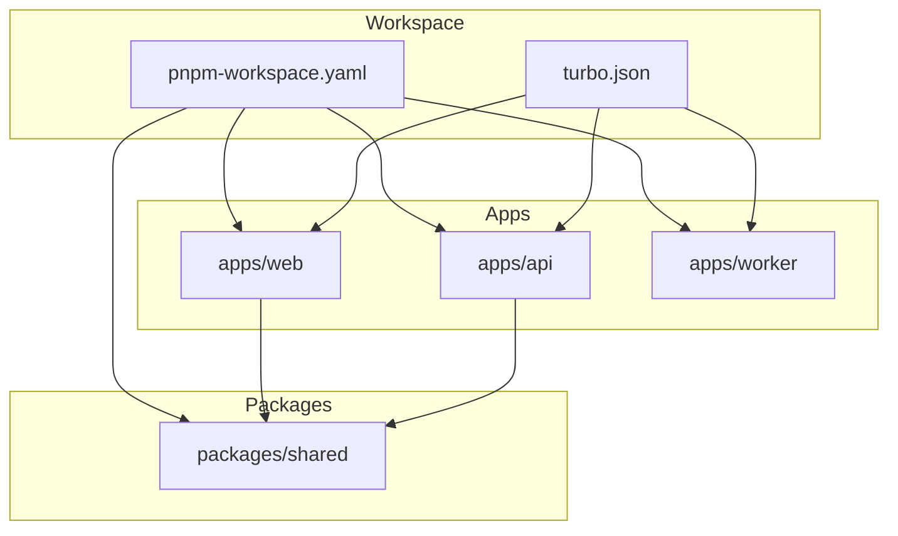
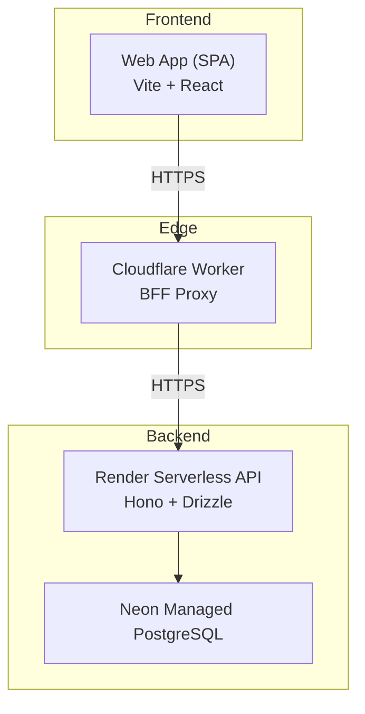
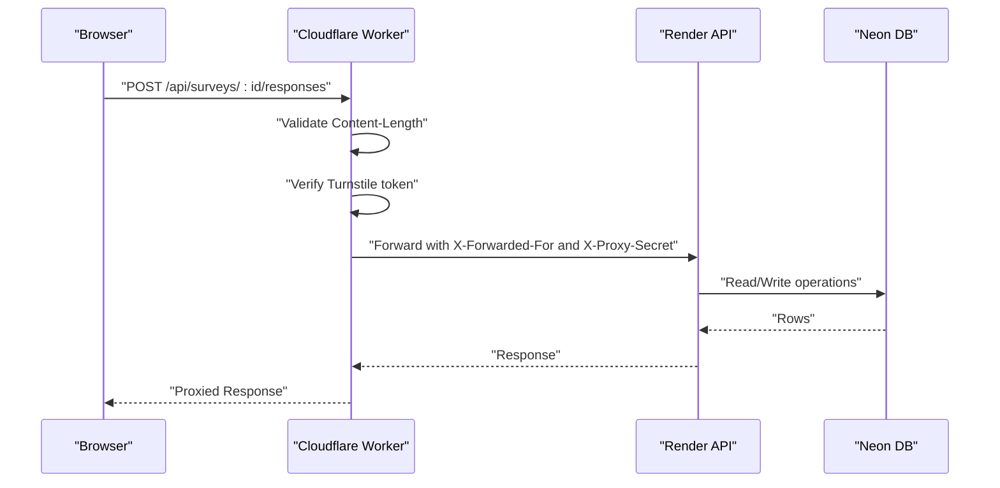
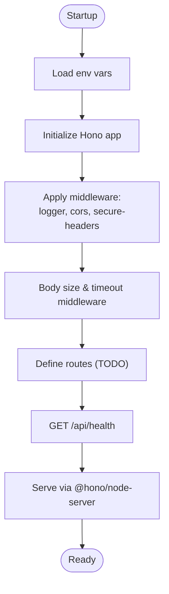
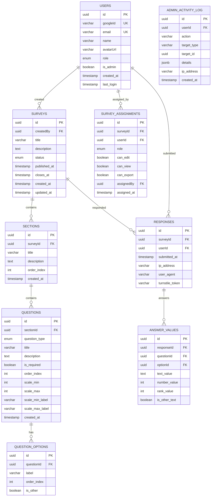
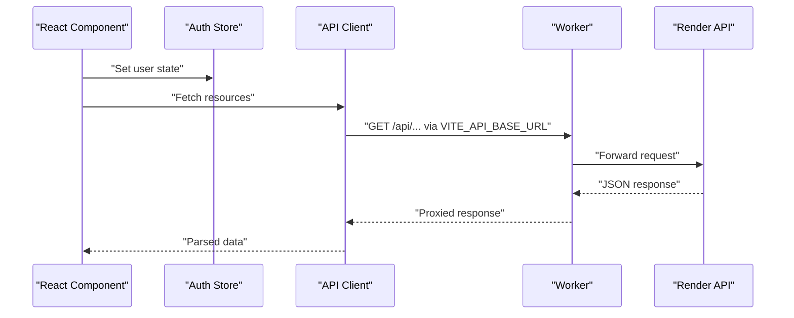
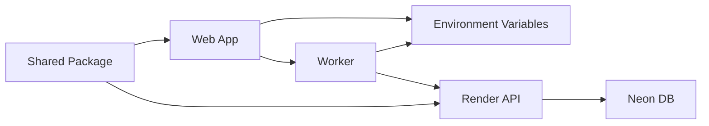
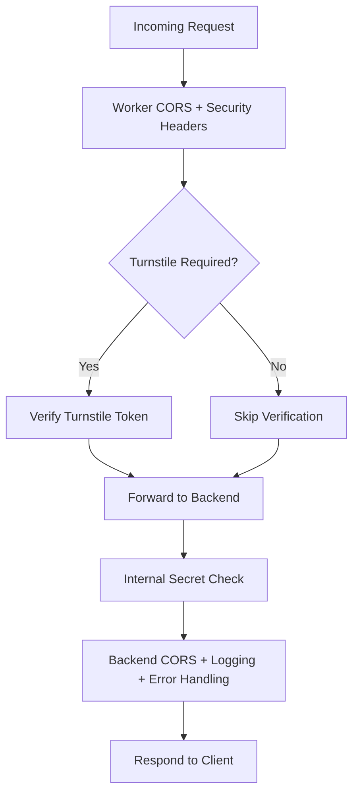

# Infrastructure Design

<cite>
**Referenced Files in This Document**
- [wrangler.toml](file://apps/worker/wrangler.toml)
- [worker index.ts](file://apps/worker/src/index.ts)
- [api package.json](file://apps/api/package.json)
- [api index.ts](file://apps/api/src/index.ts)
- [api db index.ts](file://apps/api/src/db/index.ts)
- [api drizzle config.ts](file://apps/api/drizzle.config.ts)
- [api schema.ts](file://apps/api/src/db/schema.ts)
- [web package.json](file://apps/web/package.json)
- [vite.config.ts](file://apps/web/vite.config.ts)
- [web api.ts](file://apps/web/src/lib/api.ts)
- [auth-store.ts](file://apps/web/src/stores/auth-store.ts)
- [shared index.ts](file://packages/shared/src/index.ts)
- [survey.schema.ts](file://packages/shared/src/schemas/survey.schema.ts)
- [turbo.json](file://turbo.json)
- [pnpm-workspace.yaml](file://pnpm-workspace.yaml)
</cite>

## Table of Contents
1. [Introduction](#introduction)
2. [Project Structure](#project-structure)
3. [Core Components](#core-components)
4. [Architecture Overview](#architecture-overview)
5. [Detailed Component Analysis](#detailed-component-analysis)
6. [Dependency Analysis](#dependency-analysis)
7. [Performance Considerations](#performance-considerations)
8. [Security Layering](#security-layering)
9. [Deployment Strategy](#deployment-strategy)
10. [Scalability and Cost Optimization](#scalability-and-cost-optimization)
11. [Monitoring and Observability](#monitoring-and-observability)
12. [Infrastructure Configuration and Environment Management](#infrastructure-configuration-and-environment-management)
13. [Disaster Recovery and Maintenance](#disaster-recovery-and-maintenance)
14. [Provider and Service Selection Justification](#provider-and-service-selection-justification)
15. [Conclusion](#conclusion)

## Introduction
This document describes the cursoranket infrastructure design with a cloud-native topology. It covers the edge computing implementation using Cloudflare Workers as a browser-friendly facade (BFF) proxy, the serverless backend hosted on Render, and the managed PostgreSQL database on Neon. It also documents the deployment strategy, reverse proxy architecture, security layering approach, scalability and cost optimization strategies, monitoring and observability setup, infrastructure configuration, environment variable management, deployment automation, disaster recovery planning, backup strategies, and maintenance procedures.

## Project Structure
The repository follows a monorepo layout with a workspace configuration and task orchestration:
- Workspace: packages and apps organized under a unified configuration
- Task orchestration: Turbo manages build, dev, lint, type-check, and database tasks across packages

**Diagram sources**
- [pnpm-workspace.yaml:1-4](file://pnpm-workspace.yaml#L1-L4)
- [turbo.json:1-29](file://turbo.json#L1-L29)

**Section sources**
- [pnpm-workspace.yaml:1-4](file://pnpm-workspace.yaml#L1-L4)
- [turbo.json:1-29](file://turbo.json#L1-L29)

## Core Components
- Edge BFF Proxy: Cloudflare Worker implementing CORS, security headers, request size limits, Cloudflare Turnstile verification, and proxying to the Render backend
- Serverless Backend: Hono-based API service with Drizzle ORM, Neon Postgres, and environment-driven configuration
- Frontend SPA: Vite-based React application with API client and authentication store
- Shared Types and Schemas: Reusable TypeScript types and Zod schemas for cross-app consistency

Key implementation references:
- Worker runtime and environment bindings
- API server middleware stack and health endpoint
- Database connection and migration configuration
- Web app proxy configuration and API client

**Section sources**
- [worker index.ts:1-106](file://apps/worker/src/index.ts#L1-L106)
- [api index.ts:1-67](file://apps/api/src/index.ts#L1-L67)
- [api db index.ts:1-9](file://apps/api/src/db/index.ts#L1-L9)
- [api drizzle config.ts:1-11](file://apps/api/drizzle.config.ts#L1-L11)
- [vite.config.ts:1-26](file://apps/web/vite.config.ts#L1-L26)
- [web api.ts:1-60](file://apps/web/src/lib/api.ts#L1-L60)

## Architecture Overview
The system uses a reverse proxy pattern: the Cloudflare Worker acts as the public entrypoint and BFF, validating traffic and forwarding requests to the Render-hosted backend. The backend connects to a managed Neon database and exposes REST endpoints for the frontend.

**Diagram sources**
- [worker index.ts:82-103](file://apps/worker/src/index.ts#L82-L103)
- [api index.ts:39-47](file://apps/api/src/index.ts#L39-L47)
- [api db index.ts:1-9](file://apps/api/src/db/index.ts#L1-L9)

## Detailed Component Analysis

### Cloudflare Worker BFF Proxy
The Worker implements:
- CORS allowing only the configured frontend origin
- Security headers for hardened responses
- Request body size enforcement
- Cloudflare Turnstile verification for specific endpoints
- Reverse proxy to the Render backend with forwarded headers and internal secret header

**Diagram sources**
- [worker index.ts:42-79](file://apps/worker/src/index.ts#L42-L79)
- [worker index.ts:82-103](file://apps/worker/src/index.ts#L82-L103)
- [api index.ts:25-37](file://apps/api/src/index.ts#L25-L37)

**Section sources**
- [wrangler.toml:1-13](file://apps/worker/wrangler.toml#L1-L13)
- [worker index.ts:15-40](file://apps/worker/src/index.ts#L15-L40)
- [worker index.ts:42-79](file://apps/worker/src/index.ts#L42-L79)
- [worker index.ts:82-103](file://apps/worker/src/index.ts#L82-L103)

### Render Serverless API
The API service:
- Initializes Hono, logging, CORS, and security headers
- Enforces request size limits and timeouts
- Exposes a health endpoint
- Uses Drizzle ORM with Neon Postgres
- Reads configuration from environment variables

**Diagram sources**
- [api index.ts:9-67](file://apps/api/src/index.ts#L9-L67)

**Section sources**
- [api index.ts:1-67](file://apps/api/src/index.ts#L1-L67)
- [api db index.ts:1-9](file://apps/api/src/db/index.ts#L1-L9)
- [api drizzle config.ts:1-11](file://apps/api/drizzle.config.ts#L1-L11)

### Database Schema and ORM
The backend uses Drizzle ORM with a managed PostgreSQL schema:
- Enumerations for roles, statuses, and question types
- Tables for users, surveys, assignments, sections, questions, options, responses, answers, and admin logs
- Indexes for performance on foreign keys and uniqueness constraints

**Diagram sources**
- [api schema.ts:1-247](file://apps/api/src/db/schema.ts#L1-L247)

**Section sources**
- [api schema.ts:1-247](file://apps/api/src/db/schema.ts#L1-L247)
- [api db index.ts:1-9](file://apps/api/src/db/index.ts#L1-L9)

### Frontend Application
The web app:
- Uses Vite with React and Tailwind
- Proxies API calls during development to the local backend
- Implements a typed API client and an authentication store

**Diagram sources**
- [web api.ts:1-60](file://apps/web/src/lib/api.ts#L1-L60)
- [vite.config.ts:14-19](file://apps/web/vite.config.ts#L14-L19)

**Section sources**
- [web package.json:1-51](file://apps/web/package.json#L1-L51)
- [vite.config.ts:1-26](file://apps/web/vite.config.ts#L1-L26)
- [web api.ts:1-60](file://apps/web/src/lib/api.ts#L1-L60)
- [auth-store.ts:1-31](file://apps/web/src/stores/auth-store.ts#L1-L31)

## Dependency Analysis
- Worker depends on environment variables for backend base URL, frontend URL, and security tokens
- API depends on Neon database URL and Drizzle configuration
- Web app depends on Vite proxy and environment variables for API base URL
- Shared package provides reusable types and schemas across apps

**Diagram sources**
- [wrangler.toml:5-12](file://apps/worker/wrangler.toml#L5-L12)
- [api db index.ts:5-6](file://apps/api/src/db/index.ts#L5-L6)
- [vite.config.ts:14-19](file://apps/web/vite.config.ts#L14-L19)
- [shared index.ts:1-10](file://packages/shared/src/index.ts#L1-L10)

**Section sources**
- [wrangler.toml:1-13](file://apps/worker/wrangler.toml#L1-L13)
- [api package.json:16-26](file://apps/api/package.json#L16-L26)
- [web package.json:12-38](file://apps/web/package.json#L12-L38)
- [shared index.ts:1-10](file://packages/shared/src/index.ts#L1-L10)

## Performance Considerations
- Worker-level request size limits prevent abuse and reduce downstream load
- API middleware applies timeouts to bound request duration
- Database schema includes targeted indexes to optimize joins and lookups
- Drizzle migrations support controlled schema evolution

Recommendations:
- Enable compression at the Worker level if not handled upstream
- Use CDN caching for static assets and immutable responses where safe
- Monitor backend latency and scale horizontally on Render if needed
- Optimize database queries with EXPLAIN plans and consider connection pooling

**Section sources**
- [worker index.ts:33-40](file://apps/worker/src/index.ts#L33-L40)
- [api index.ts:34-37](file://apps/api/src/index.ts#L34-L37)
- [api schema.ts:94-98](file://apps/api/src/db/schema.ts#L94-L98)
- [api drizzle config.ts:1-11](file://apps/api/drizzle.config.ts#L1-L11)

## Security Layering
The system applies defense-in-depth:
- Worker enforces CORS, security headers, request size limits, and Cloudflare Turnstile verification for sensitive endpoints
- Internal proxy secret header protects backend from direct exposure
- API applies CORS, security headers, logging, and global error handling
- Environment variables store secrets and configuration

**Diagram sources**
- [worker index.ts:15-40](file://apps/worker/src/index.ts#L15-L40)
- [worker index.ts:42-79](file://apps/worker/src/index.ts#L42-L79)
- [worker index.ts:82-103](file://apps/worker/src/index.ts#L82-L103)
- [api index.ts:11-23](file://apps/api/src/index.ts#L11-L23)

**Section sources**
- [worker index.ts:15-40](file://apps/worker/src/index.ts#L15-L40)
- [worker index.ts:42-79](file://apps/worker/src/index.ts#L42-L79)
- [worker index.ts:82-103](file://apps/worker/src/index.ts#L82-L103)
- [api index.ts:11-23](file://apps/api/src/index.ts#L11-L23)

## Deployment Strategy
- Static hosting: Cloudflare Pages can host the built SPA (configure production build output)
- Edge proxy: Cloudflare Worker serves as the public entrypoint and BFF
- Backend: Render hosts the serverless API
- Database: Neon provides managed PostgreSQL

Automation and configuration:
- Environment variables are loaded via dotenv in development and via platform secrets in production
- Worker secrets are injected via Wrangler CLI
- Build and dev scripts orchestrated by Turbo

Note: The current repository does not include Pages configuration files. Production deployment requires adding Pages configuration and ensuring the frontend build output aligns with Pages expectations.

**Section sources**
- [wrangler.toml:1-13](file://apps/worker/wrangler.toml#L1-L13)
- [api package.json:6-14](file://apps/api/package.json#L6-L14)
- [vite.config.ts:21-24](file://apps/web/vite.config.ts#L21-L24)
- [turbo.json:3-26](file://turbo.json#L3-L26)

## Scalability and Cost Optimization
- Cloudflare Worker: Auto-scales with traffic; use appropriate plan for desired concurrency and CPU/memory
- Render: Choose serverless plan suited to peak request volume and cold start tolerance
- Neon: Use serverless tier for low-to-moderate workloads; monitor connections and adjust pool settings
- Free tier utilization: Leverage free tiers of Cloudflare, Render, and Neon to minimize costs while validating performance

Cost-saving tips:
- Minimize unnecessary compute by offloading processing to the edge where feasible
- Right-size database connections and enable connection pooling
- Monitor and cap request sizes to avoid excessive bandwidth usage

[No sources needed since this section provides general guidance]

## Monitoring and Observability
- Worker: Enable Cloudflare Logs for request analytics and error visibility
- API: Use Hono logger middleware for request logging; consider structured logging and correlation IDs
- Database: Utilize Neon’s built-in metrics and slow query logs
- Frontend: Add error reporting and performance monitoring libraries

[No sources needed since this section provides general guidance]

## Infrastructure Configuration and Environment Management
- Worker environment:
  - Variables: API base URL, frontend URL
  - Secrets: Turnstile secret, Upstash Redis REST URL/token
- API environment:
  - DATABASE_URL for Neon
  - FRONTEND_URL for CORS
  - API_PORT for local development
- Web environment:
  - VITE_API_BASE_URL for production API base
  - Development proxy targets localhost backend

Secrets management:
- Store sensitive values as platform secrets (Cloudflare Workers, Render)
- Use dotenv for local development only

**Section sources**
- [wrangler.toml:5-12](file://apps/worker/wrangler.toml#L5-L12)
- [api index.ts:16-16](file://apps/api/src/index.ts#L16-L16)
- [api db index.ts:5-6](file://apps/api/src/db/index.ts#L5-L6)
- [vite.config.ts:14-19](file://apps/web/vite.config.ts#L14-L19)

## Disaster Recovery and Maintenance
- Backups:
  - Neon: rely on managed snapshots and point-in-time recovery
  - Worker: maintain configuration and secrets in version-controlled files (avoid secrets in code)
  - API: keep Drizzle migration history and schema diffs under version control
- Maintenance:
  - Apply schema changes via Drizzle migrations
  - Test rollback procedures using migration scripts
  - Monitor logs and alerts for early detection of incidents

[No sources needed since this section provides general guidance]

## Provider and Service Selection Justification
- Cloudflare Workers: Low-latency edge compute, integrated security, and seamless integration with Cloudflare ecosystem
- Render: Simple serverless deployment for APIs with good developer experience
- Neon: Managed PostgreSQL with serverless scaling and strong performance characteristics
- Vite/Turbo: Fast builds and efficient task orchestration for modern frontend/backend workflows

[No sources needed since this section provides general guidance]

## Conclusion
The cursoranket infrastructure leverages edge-first design with Cloudflare Workers as a hardened BFF proxy, a Render-hosted serverless API, and a managed Neon database. The architecture emphasizes security through layered controls, operational simplicity via platform-native tooling, and cost-effectiveness by utilizing free tiers. With proper environment management, monitoring, and maintenance procedures, the system can scale efficiently while remaining observable and resilient.