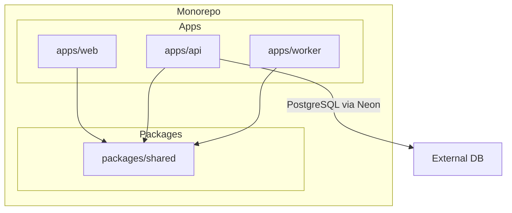
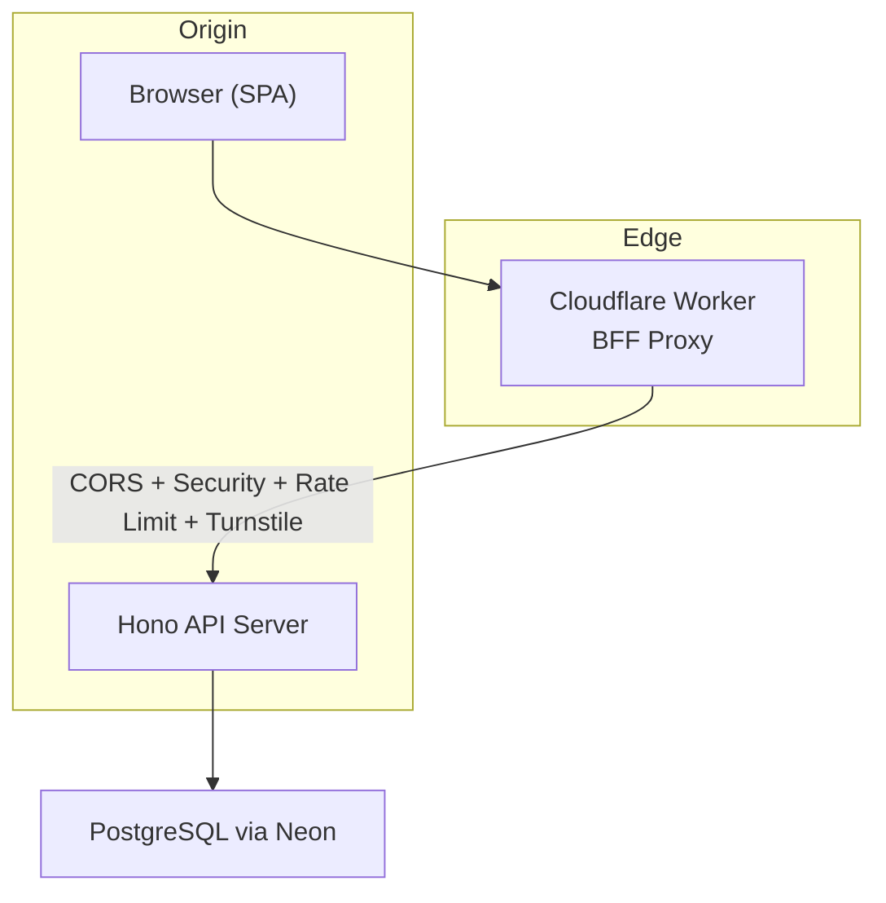
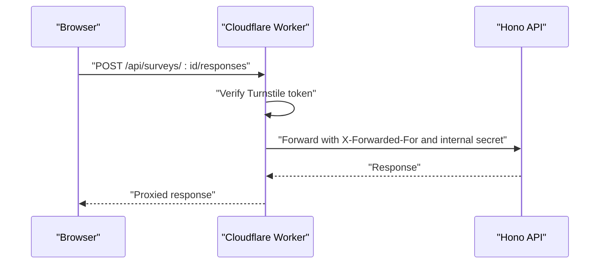
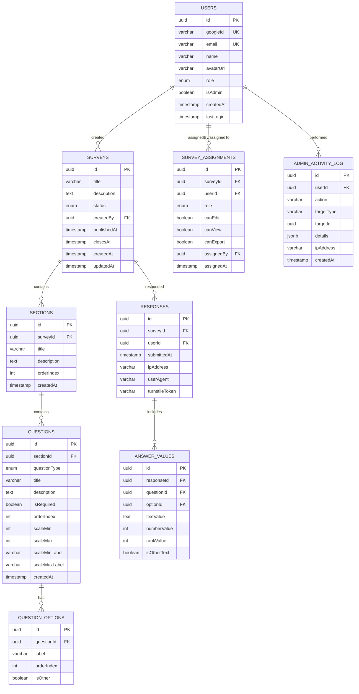
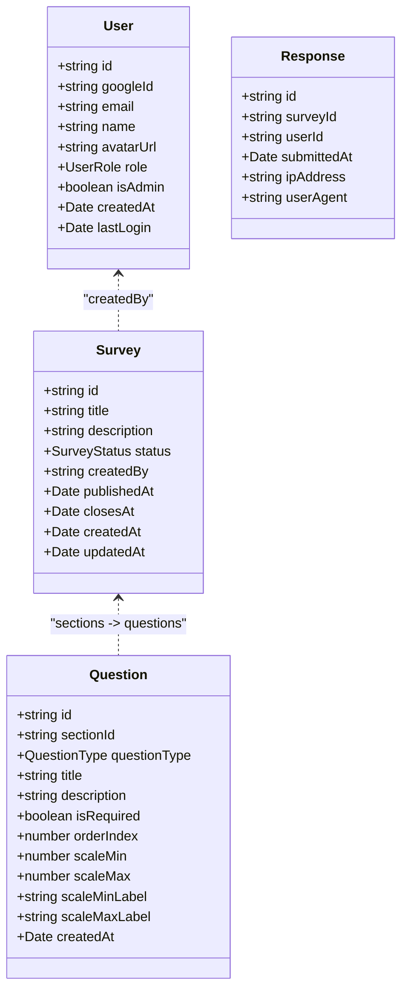
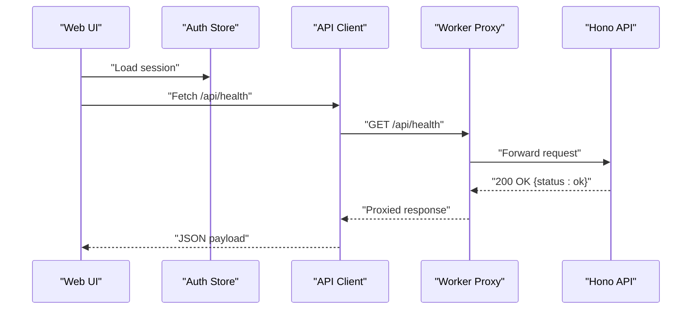
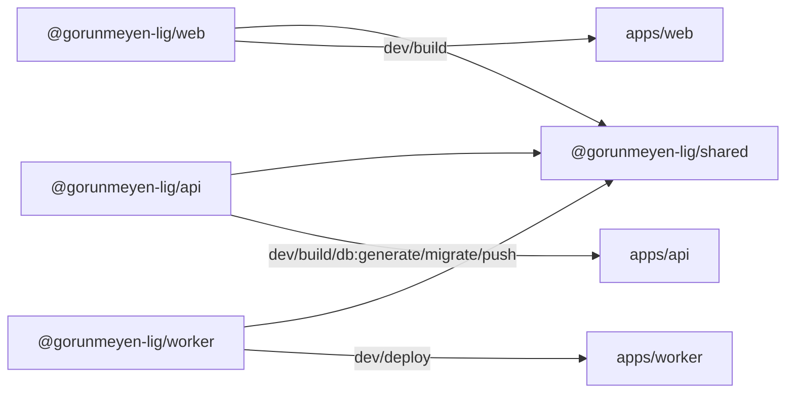

# System Overview

<cite>
**Referenced Files in This Document**
- [App.tsx](file://apps/web/src/App.tsx)
- [api.ts](file://apps/web/src/lib/api.ts)
- [auth-store.ts](file://apps/web/src/stores/auth-store.ts)
- [index.ts](file://apps/api/src/index.ts)
- [index.ts](file://apps/api/src/db/index.ts)
- [schema.ts](file://apps/api/src/db/schema.ts)
- [index.ts](file://apps/worker/src/index.ts)
- [wrangler.toml](file://apps/worker/wrangler.toml)
- [index.ts](file://packages/shared/src/index.ts)
- [user.ts](file://packages/shared/src/types/user.ts)
- [survey.ts](file://packages/shared/src/types/survey.ts)
- [question.ts](file://packages/shared/src/types/question.ts)
- [response.ts](file://packages/shared/src/types/response.ts)
- [package.json](file://apps/web/package.json)
- [package.json](file://apps/api/package.json)
- [package.json](file://apps/worker/package.json)
- [package.json](file://packages/shared/package.json)
- [package.json](file://package.json)
- [pnpm-workspace.yaml](file://pnpm-workspace.yaml)
- [turbo.json](file://turbo.json)
</cite>

## Table of Contents
1. [Introduction](#introduction)
2. [Project Structure](#project-structure)
3. [Core Components](#core-components)
4. [Architecture Overview](#architecture-overview)
5. [Detailed Component Analysis](#detailed-component-analysis)
6. [Dependency Analysis](#dependency-analysis)
7. [Performance Considerations](#performance-considerations)
8. [Troubleshooting Guide](#troubleshooting-guide)
9. [Conclusion](#conclusion)

## Introduction
Cursoranket is a Turkish football supporter survey platform designed to collect insights from fans through structured, permissioned surveys. The system emphasizes a modern, distributed architecture centered around three applications: a React-based web frontend, a Hono-powered API backend, and a Cloudflare Worker proxy that acts as a BFF (Backend For Frontend) and edge gateway. The design philosophy prioritizes:
- Edge-first delivery for low-latency, globally distributed access
- Triple firewall security across network, transport, and application layers
- Type-safe end-to-end data flow using shared TypeScript packages
- Monorepo organization with clear separation of concerns

This document explains the system’s purpose, high-level design principles, and practical component relationships, with examples suitable for both beginners and experienced developers.

## Project Structure
The repository follows a monorepo layout managed by pnpm workspaces and Turbo. It is organized into:
- apps/web: Next-generation React SPA with routing and state management
- apps/api: Hono-based REST server with database connectivity and middleware
- apps/worker: Cloudflare Worker acting as a BFF proxy and edge security layer
- packages/shared: Shared TypeScript types and Zod schemas consumed by all apps



**Diagram sources**
- [pnpm-workspace.yaml:1-4](file://pnpm-workspace.yaml#L1-L4)
- [turbo.json:1-29](file://turbo.json#L1-L29)
- [package.json:1-30](file://package.json#L1-L30)

**Section sources**
- [pnpm-workspace.yaml:1-4](file://pnpm-workspace.yaml#L1-L4)
- [turbo.json:1-29](file://turbo.json#L1-L29)
- [package.json:1-30](file://package.json#L1-L30)

## Core Components
- Web Frontend (React SPA)
  - Provides the user interface and handles navigation, state, and API interactions.
  - Uses a dedicated API client and a Zustand-backed auth store.
  - Example references:
    - [App.tsx:14-22](file://apps/web/src/App.tsx#L14-L22)
    - [api.ts:7-30](file://apps/web/src/lib/api.ts#L7-L30)
    - [auth-store.ts:13-30](file://apps/web/src/stores/auth-store.ts#L13-L30)

- API Backend (Hono Server)
  - Implements middleware-driven request processing, health checks, and placeholder routes.
  - Integrates with a PostgreSQL database via Neon and Drizzle ORM.
  - Example references:
    - [index.ts:9-67](file://apps/api/src/index.ts#L9-L67)
    - [index.ts:1-9](file://apps/api/src/db/index.ts#L1-L9)
    - [schema.ts:1-247](file://apps/api/src/db/schema.ts#L1-L247)

- Cloudflare Worker Proxy (BFF)
  - Acts as a reverse proxy and edge security layer, enforcing CORS, security headers, rate limits, and Cloudflare Turnstile verification for specific endpoints.
  - Proxies requests to the API backend with internal headers and IP forwarding.
  - Example references:
    - [index.ts:13-106](file://apps/worker/src/index.ts#L13-L106)
    - [wrangler.toml:5-12](file://apps/worker/wrangler.toml#L5-L12)

- Shared Package
  - Centralizes TypeScript types and Zod schemas for consistent data contracts across the stack.
  - Example references:
    - [index.ts:1-10](file://packages/shared/src/index.ts#L1-L10)
    - [user.ts:1-22](file://packages/shared/src/types/user.ts#L1-L22)
    - [survey.ts:1-50](file://packages/shared/src/types/survey.ts#L1-L50)
    - [question.ts:1-66](file://packages/shared/src/types/question.ts#L1-L66)
    - [response.ts:1-53](file://packages/shared/src/types/response.ts#L1-L53)

**Section sources**
- [App.tsx:14-22](file://apps/web/src/App.tsx#L14-L22)
- [api.ts:7-30](file://apps/web/src/lib/api.ts#L7-L30)
- [auth-store.ts:13-30](file://apps/web/src/stores/auth-store.ts#L13-L30)
- [index.ts:9-67](file://apps/api/src/index.ts#L9-L67)
- [index.ts:1-9](file://apps/api/src/db/index.ts#L1-L9)
- [schema.ts:1-247](file://apps/api/src/db/schema.ts#L1-L247)
- [index.ts:13-106](file://apps/worker/src/index.ts#L13-L106)
- [wrangler.toml:5-12](file://apps/worker/wrangler.toml#L5-L12)
- [index.ts:1-10](file://packages/shared/src/index.ts#L1-L10)
- [user.ts:1-22](file://packages/shared/src/types/user.ts#L1-L22)
- [survey.ts:1-50](file://packages/shared/src/types/survey.ts#L1-L50)
- [question.ts:1-66](file://packages/shared/src/types/question.ts#L1-L66)
- [response.ts:1-53](file://packages/shared/src/types/response.ts#L1-L53)

## Architecture Overview
The system employs an edge-first, BFF-oriented architecture:
- Edge Computing: Cloudflare Worker enforces security and proxies requests to the backend, reducing latency and centralizing policy enforcement.
- BFF Proxy: The Worker serves as a Backend For Frontend, handling CORS, security headers, rate limiting, and Turnstile verification before forwarding to the API.
- Triple Firewall Security Model:
  - Network: Origin-restricted CORS and secure headers.
  - Transport: TLS termination at Cloudflare and Hono secure headers.
  - Application: Turnstile verification for sensitive endpoints and internal proxy secret for inter-service trust.
- Type-Safe End-to-End Data Flow: Shared types and schemas ensure consistent contracts between frontend, worker, and backend.



**Diagram sources**
- [index.ts:13-106](file://apps/worker/src/index.ts#L13-L106)
- [index.ts:9-67](file://apps/api/src/index.ts#L9-L67)
- [index.ts:1-9](file://apps/api/src/db/index.ts#L1-L9)

**Section sources**
- [index.ts:13-106](file://apps/worker/src/index.ts#L13-L106)
- [index.ts:9-67](file://apps/api/src/index.ts#L9-L67)
- [index.ts:1-9](file://apps/api/src/db/index.ts#L1-L9)

## Detailed Component Analysis

### Edge Computing and BFF Proxy
The Cloudflare Worker acts as the edge gateway:
- Enforces CORS for the frontend origin only
- Applies secure headers
- Limits request body size
- Verifies Cloudflare Turnstile for survey response submissions
- Proxies requests to the API backend with forwarded client IPs and an internal secret header



**Diagram sources**
- [index.ts:42-79](file://apps/worker/src/index.ts#L42-L79)
- [index.ts:81-103](file://apps/worker/src/index.ts#L81-L103)

**Section sources**
- [index.ts:13-106](file://apps/worker/src/index.ts#L13-L106)
- [wrangler.toml:5-12](file://apps/worker/wrangler.toml#L5-L12)

### API Backend Layer
The Hono server provides:
- Logging, CORS, and secure headers middleware
- Request size and timeout controls
- Health check endpoint
- Placeholder routes for auth, surveys, and admin
- Global error handling and 404 handling

```mermaid
flowchart TD
Start(["Incoming Request"]) --> Log["Logger Middleware"]
Log --> CORS["CORS & Secure Headers"]
CORS --> Size["Body Size Check"]
Size --> Timeout["Timeout Middleware"]
Timeout --> Route{"Route Match?"}
Route --> |"/api/health"| Health["Health Check"]
Route --> |"/api/*"| NotFound["404 Not Found"]
Route --> |"/api/auth|...|"/api/admin"| Todo["TODO: Mount Routes"]
Health --> End(["Response"])
NotFound --> End
Todo --> End
```

**Diagram sources**
- [index.ts:11-58](file://apps/api/src/index.ts#L11-L58)

**Section sources**
- [index.ts:9-67](file://apps/api/src/index.ts#L9-L67)

### Database Schema and RBAC Foundation
The backend uses Drizzle ORM with PostgreSQL via Neon. The schema defines:
- Users with roles and admin flags
- Surveys with status lifecycle
- Assignments with granular permissions (edit/view/export)
- Sections and Questions with rich types
- Responses and Answer Values for analytics
- Admin activity logging



**Diagram sources**
- [schema.ts:19-246](file://apps/api/src/db/schema.ts#L19-L246)

**Section sources**
- [schema.ts:1-247](file://apps/api/src/db/schema.ts#L1-L247)

### Shared Types and Schemas
Shared types define the contract for users, surveys, questions, and responses. These types are consumed by the frontend and backend to maintain type safety across the stack.



**Diagram sources**
- [user.ts:1-22](file://packages/shared/src/types/user.ts#L1-L22)
- [survey.ts:1-50](file://packages/shared/src/types/survey.ts#L1-L50)
- [question.ts:1-66](file://packages/shared/src/types/question.ts#L1-L66)
- [response.ts:1-53](file://packages/shared/src/types/response.ts#L1-L53)

**Section sources**
- [index.ts:1-10](file://packages/shared/src/index.ts#L1-L10)
- [user.ts:1-22](file://packages/shared/src/types/user.ts#L1-L22)
- [survey.ts:1-50](file://packages/shared/src/types/survey.ts#L1-L50)
- [question.ts:1-66](file://packages/shared/src/types/question.ts#L1-L66)
- [response.ts:1-53](file://packages/shared/src/types/response.ts#L1-L53)

### Frontend Integration and Data Flow
The React frontend consumes the shared types and communicates with the backend through a typed API client. Authentication state is managed via a Zustand store.



**Diagram sources**
- [api.ts:7-30](file://apps/web/src/lib/api.ts#L7-L30)
- [index.ts:40-42](file://apps/api/src/index.ts#L40-L42)
- [index.ts:81-103](file://apps/worker/src/index.ts#L81-L103)

**Section sources**
- [api.ts:7-30](file://apps/web/src/lib/api.ts#L7-L30)
- [auth-store.ts:13-30](file://apps/web/src/stores/auth-store.ts#L13-L30)
- [index.ts:40-42](file://apps/api/src/index.ts#L40-L42)
- [index.ts:81-103](file://apps/worker/src/index.ts#L81-L103)

## Dependency Analysis
The monorepo uses pnpm workspaces and Turbo tasks to orchestrate builds, development, and database tooling. Dependencies among apps and the shared package are explicit and versioned consistently.



**Diagram sources**
- [pnpm-workspace.yaml:1-4](file://pnpm-workspace.yaml#L1-L4)
- [package.json:6-18](file://package.json#L6-L18)
- [package.json:12-23](file://apps/web/package.json#L12-L23)
- [package.json:16-25](file://apps/api/package.json#L16-L25)
- [package.json:12-17](file://apps/worker/package.json#L12-L17)
- [package.json:11](file://packages/shared/package.json#L11)

**Section sources**
- [pnpm-workspace.yaml:1-4](file://pnpm-workspace.yaml#L1-L4)
- [turbo.json:3-26](file://turbo.json#L3-L26)
- [package.json:6-18](file://package.json#L6-L18)
- [apps/web/package.json:12-23](file://apps/web/package.json#L12-L23)
- [apps/api/package.json:16-25](file://apps/api/package.json#L16-L25)
- [apps/worker/package.json:12-17](file://apps/worker/package.json#L12-L17)
- [packages/shared/package.json:11](file://packages/shared/package.json#L11)

## Performance Considerations
- Edge-first delivery: Cloudflare Worker proximity reduces latency and offloads CPU from the origin server.
- Request shaping: Early body size checks and timeouts prevent resource exhaustion.
- Database connectivity: Neon serverless connection minimizes cold starts and scales automatically.
- Caching opportunities: Consider Redis-backed rate limiting and caching at the edge for repeated reads.
- Build and dev ergonomics: Turbo’s persistent dev tasks and caching reduce iteration time during development.

## Troubleshooting Guide
Common areas to inspect:
- Worker configuration and secrets
  - Verify environment variables and secret keys for Turnstile and Upstash Redis.
  - Reference: [wrangler.toml:5-12](file://apps/worker/wrangler.toml#L5-L12)

- CORS and origin restrictions
  - Confirm the frontend origin matches the allowed origin in the Worker CORS configuration.
  - Reference: [index.ts:15-28](file://apps/worker/src/index.ts#L15-L28)

- API health and middleware
  - Test the health endpoint to validate middleware pipeline.
  - Reference: [index.ts:40-42](file://apps/api/src/index.ts#L40-L42)

- Database connectivity
  - Ensure DATABASE_URL is configured and reachable via Neon.
  - Reference: [index.ts:5-7](file://apps/api/src/db/index.ts#L5-L7)

- Frontend API base URL
  - Confirm VITE_API_BASE_URL points to the Worker or API depending on deployment mode.
  - Reference: [api.ts:1](file://apps/web/src/lib/api.ts#L1)

**Section sources**
- [wrangler.toml:5-12](file://apps/worker/wrangler.toml#L5-L12)
- [index.ts:15-28](file://apps/worker/src/index.ts#L15-L28)
- [index.ts:40-42](file://apps/api/src/index.ts#L40-L42)
- [index.ts:5-7](file://apps/api/src/db/index.ts#L5-L7)
- [api.ts:1](file://apps/web/src/lib/api.ts#L1)

## Conclusion
Cursoranket’s architecture balances simplicity and scalability by separating concerns across a React frontend, a Hono API backend, and a Cloudflare Worker BFF. The edge-first approach, triple firewall security model, and type-safe contracts enable a robust, maintainable system suited for global users. The monorepo structure and shared package streamline development while preserving clear boundaries between components.