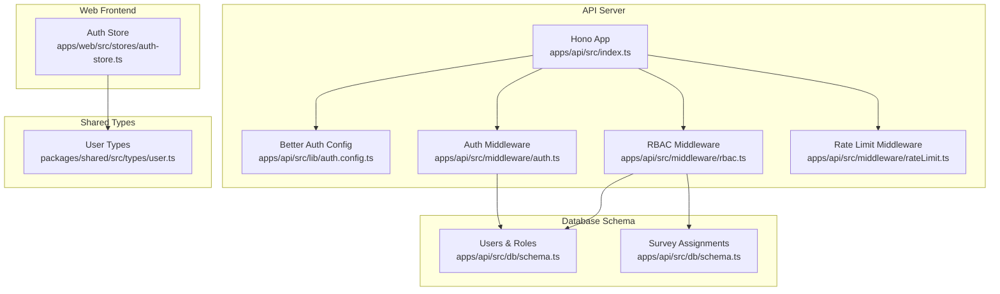
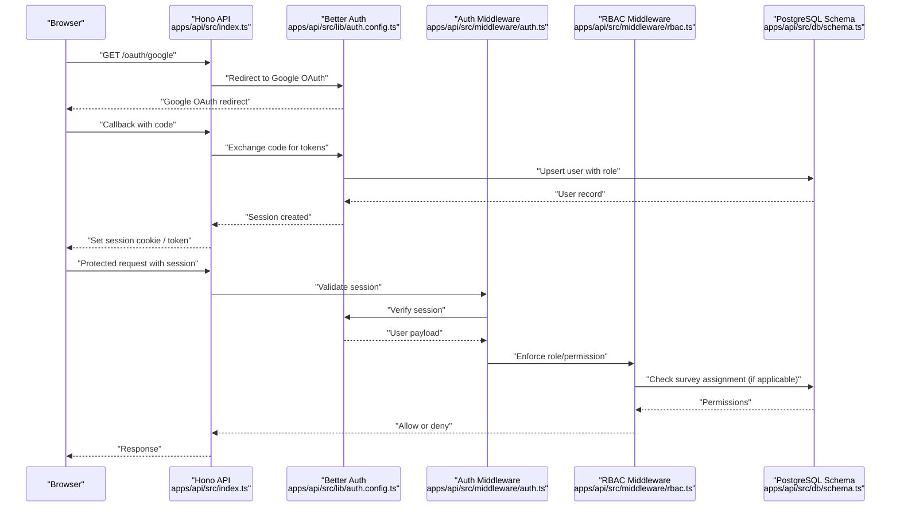
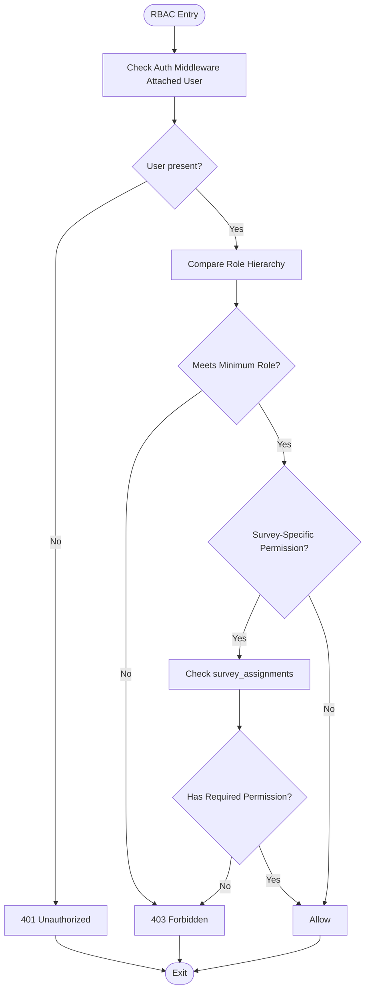
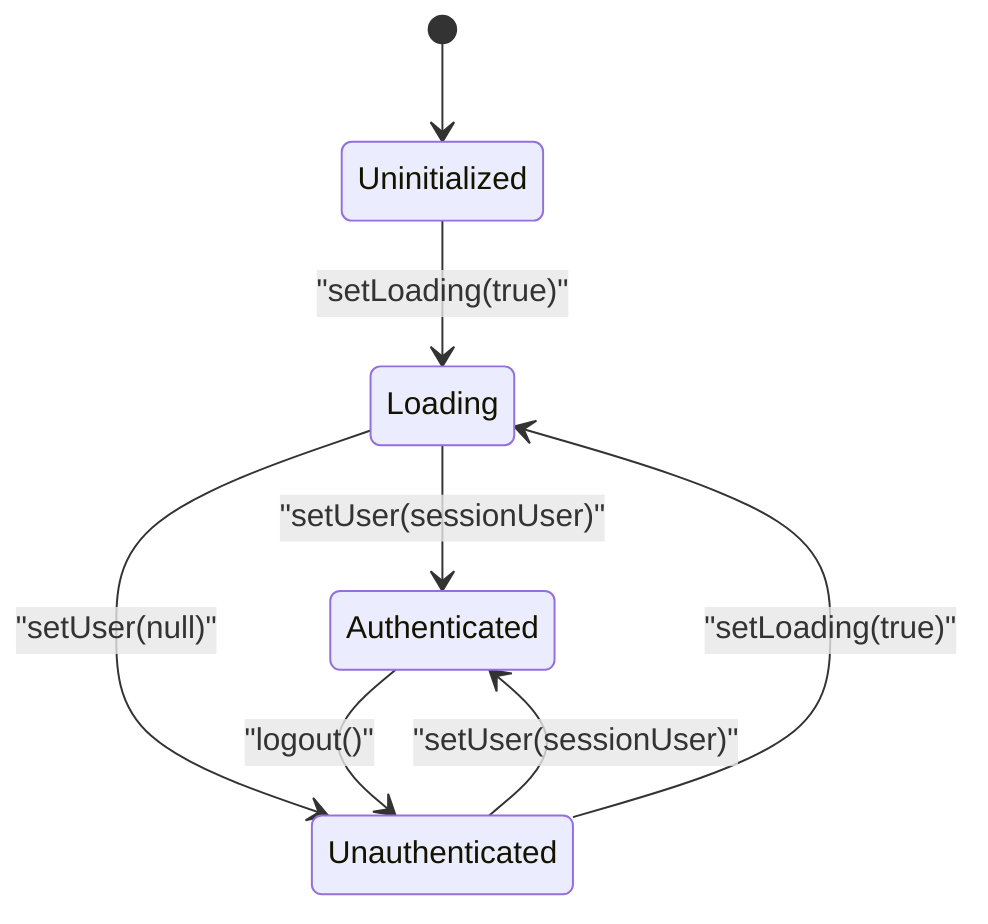
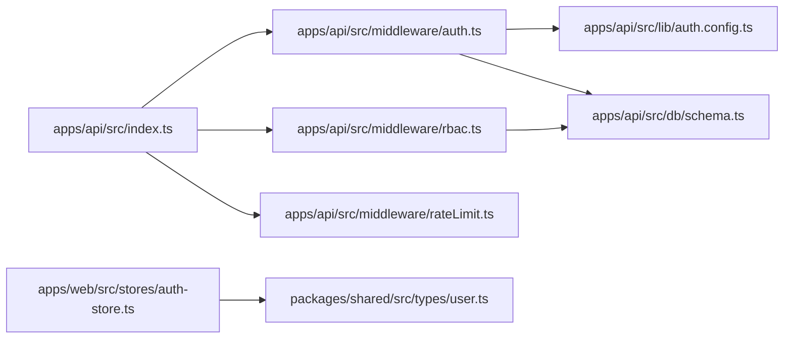

# Authentication and Authorization

<cite>
**Referenced Files in This Document**
- [index.ts](file://apps/api/src/index.ts)
- [auth.config.ts](file://apps/api/src/lib/auth.config.ts)
- [auth.ts](file://apps/api/src/middleware/auth.ts)
- [rbac.ts](file://apps/api/src/middleware/rbac.ts)
- [rateLimit.ts](file://apps/api/src/middleware/rateLimit.ts)
- [schema.ts](file://apps/api/src/db/schema.ts)
- [user.ts](file://packages/shared/src/types/user.ts)
- [auth-store.ts](file://apps/web/src/stores/auth-store.ts)
</cite>

## Table of Contents
1. [Introduction](#introduction)
2. [Project Structure](#project-structure)
3. [Core Components](#core-components)
4. [Architecture Overview](#architecture-overview)
5. [Detailed Component Analysis](#detailed-component-analysis)
6. [Dependency Analysis](#dependency-analysis)
7. [Performance Considerations](#performance-considerations)
8. [Troubleshooting Guide](#troubleshooting-guide)
9. [Conclusion](#conclusion)

## Introduction
This document explains the authentication and authorization system with a focus on Google OAuth integration and role-based access control (RBAC). It covers the better-auth integration for flexible authentication strategies, session management, token handling, and the planned RBAC enforcement. It also documents user types, role assignments, permission inheritance patterns, middleware usage, and practical examples of authentication flows and protected routes. Security considerations, session security, and troubleshooting steps are included to support safe deployment and operation.

## Project Structure
The authentication and authorization system spans three primary areas:
- Backend API server with Hono and better-auth
- Database schema with user roles and survey-specific permissions
- Shared frontend types and Zustand store for session state



**Diagram sources**
- [index.ts:1-67](file://apps/api/src/index.ts#L1-L67)
- [auth.config.ts:1-42](file://apps/api/src/lib/auth.config.ts#L1-L42)
- [auth.ts:1-52](file://apps/api/src/middleware/auth.ts#L1-L52)
- [rbac.ts:1-56](file://apps/api/src/middleware/rbac.ts#L1-L56)
- [rateLimit.ts:1-71](file://apps/api/src/middleware/rateLimit.ts#L1-L71)
- [schema.ts:1-247](file://apps/api/src/db/schema.ts#L1-L247)
- [user.ts:1-22](file://packages/shared/src/types/user.ts#L1-L22)
- [auth-store.ts:1-31](file://apps/web/src/stores/auth-store.ts#L1-L31)

**Section sources**
- [index.ts:1-67](file://apps/api/src/index.ts#L1-L67)
- [auth.config.ts:1-42](file://apps/api/src/lib/auth.config.ts#L1-L42)
- [schema.ts:1-247](file://apps/api/src/db/schema.ts#L1-L247)
- [user.ts:1-22](file://packages/shared/src/types/user.ts#L1-L22)
- [auth-store.ts:1-31](file://apps/web/src/stores/auth-store.ts#L1-L31)

## Core Components
- Better Auth configuration defines Google OAuth, session caching, and user fields.
- Auth middleware currently stubs session validation and will integrate with better-auth.
- RBAC middleware defines role hierarchy and survey-specific permissions.
- Database schema models users, roles, and survey assignments with granular permissions.
- Shared user types define frontend-visible session user shape.
- Web auth store manages frontend session state.

Key implementation references:
- Better Auth config: [auth.config.ts:5-39](file://apps/api/src/lib/auth.config.ts#L5-L39)
- Auth middleware (stubbed): [auth.ts:10-25](file://apps/api/src/middleware/auth.ts#L10-L25)
- RBAC middleware (planned): [rbac.ts:16-27](file://apps/api/src/middleware/rbac.ts#L16-L27), [rbac.ts:38-55](file://apps/api/src/middleware/rbac.ts#L38-L55)
- User schema and enums: [schema.ts:19-51](file://apps/api/src/db/schema.ts#L19-L51)
- Survey assignment schema: [schema.ts:75-99](file://apps/api/src/db/schema.ts#L75-L99)
- Shared user types: [user.ts:1-22](file://packages/shared/src/types/user.ts#L1-L22)
- Frontend auth store: [auth-store.ts:13-30](file://apps/web/src/stores/auth-store.ts#L13-L30)

**Section sources**
- [auth.config.ts:1-42](file://apps/api/src/lib/auth.config.ts#L1-L42)
- [auth.ts:1-52](file://apps/api/src/middleware/auth.ts#L1-L52)
- [rbac.ts:1-56](file://apps/api/src/middleware/rbac.ts#L1-L56)
- [schema.ts:1-247](file://apps/api/src/db/schema.ts#L1-L247)
- [user.ts:1-22](file://packages/shared/src/types/user.ts#L1-L22)
- [auth-store.ts:1-31](file://apps/web/src/stores/auth-store.ts#L1-L31)

## Architecture Overview
The system integrates Google OAuth via better-auth, manages sessions, and enforces RBAC. The frontend authenticates through the backend and stores a lightweight session user object.



**Diagram sources**
- [index.ts:40-47](file://apps/api/src/index.ts#L40-L47)
- [auth.config.ts:5-39](file://apps/api/src/lib/auth.config.ts#L5-L39)
- [auth.ts:10-25](file://apps/api/src/middleware/auth.ts#L10-L25)
- [rbac.ts:16-27](file://apps/api/src/middleware/rbac.ts#L16-L27)
- [schema.ts:41-51](file://apps/api/src/db/schema.ts#L41-L51)
- [schema.ts:75-99](file://apps/api/src/db/schema.ts#L75-L99)

## Detailed Component Analysis

### Better Auth Integration (Google OAuth)
- Configuration enables Google OAuth with client credentials and sets base URL and secret.
- Session caching is enabled with a short cache TTL.
- Additional user field for admin flag is supported.
- Account linking is disabled for security.

Implementation references:
- [auth.config.ts:5-39](file://apps/api/src/lib/auth.config.ts#L5-L39)

Security considerations:
- Keep secrets in environment variables.
- Use HTTPS and secure cookies in production.
- Consider enabling CSRF protection and session regeneration.

**Section sources**
- [auth.config.ts:1-42](file://apps/api/src/lib/auth.config.ts#L1-L42)

### Session Management and Token Handling
- The API server exposes a health endpoint and mounts middleware globally.
- Auth middleware currently validates presence of a session token from Authorization header or query param and forwards to next middleware.
- Planned integration will validate the token against better-auth and attach user context.

Implementation references:
- [index.ts:39-47](file://apps/api/src/index.ts#L39-L47)
- [auth.ts:10-25](file://apps/api/src/middleware/auth.ts#L10-L25)

Token handling patterns:
- Prefer Authorization Bearer header for API requests.
- Support query param fallback for testing and specific flows.

**Section sources**
- [index.ts:1-67](file://apps/api/src/index.ts#L1-L67)
- [auth.ts:1-52](file://apps/api/src/middleware/auth.ts#L1-L52)

### Role-Based Access Control (RBAC)
- Role hierarchy: admin > editor > viewer > user.
- Middleware requires role enforcement after auth middleware.
- Survey-specific permissions include can_edit, can_view, can_export, resolved via survey_assignments.

Planned implementation references:
- [rbac.ts:5-10](file://apps/api/src/middleware/rbac.ts#L5-L10)
- [rbac.ts:16-27](file://apps/api/src/middleware/rbac.ts#L16-L27)
- [rbac.ts:38-55](file://apps/api/src/middleware/rbac.ts#L38-L55)
- [schema.ts:75-99](file://apps/api/src/db/schema.ts#L75-L99)



**Diagram sources**
- [rbac.ts:16-27](file://apps/api/src/middleware/rbac.ts#L16-L27)
- [rbac.ts:38-55](file://apps/api/src/middleware/rbac.ts#L38-L55)
- [schema.ts:75-99](file://apps/api/src/db/schema.ts#L75-L99)

**Section sources**
- [rbac.ts:1-56](file://apps/api/src/middleware/rbac.ts#L1-L56)
- [schema.ts:19-51](file://apps/api/src/db/schema.ts#L19-L51)
- [schema.ts:75-99](file://apps/api/src/db/schema.ts#L75-L99)

### User Types and Role Assignments
- User role enum includes admin, editor, viewer, user.
- User interface includes id, googleId, email, name, avatarUrl, role, isAdmin, timestamps.
- SessionUser mirrors minimal user info for frontend consumption.
- Database schema enforces unique googleId and email, default role user, and admin flag.

Implementation references:
- [user.ts:1-22](file://packages/shared/src/types/user.ts#L1-L22)
- [schema.ts:19-51](file://apps/api/src/db/schema.ts#L19-L51)

```mermaid
classDiagram
class User {
+string id
+string googleId
+string email
+string name
+string avatarUrl
+UserRole role
+boolean isAdmin
+Date createdAt
+Date lastLogin
}
class SessionUser {
+string id
+string email
+string name
+UserRole role
+boolean isAdmin
}
class UserRole {
<<enum>>
"admin"
"editor"
"viewer"
"user"
}
User --> UserRole : "has"
SessionUser --> UserRole : "has"
```

**Diagram sources**
- [user.ts:1-22](file://packages/shared/src/types/user.ts#L1-L22)
- [schema.ts:19-51](file://apps/api/src/db/schema.ts#L19-L51)

**Section sources**
- [user.ts:1-22](file://packages/shared/src/types/user.ts#L1-L22)
- [schema.ts:19-51](file://apps/api/src/db/schema.ts#L19-L51)

### Frontend Session Lifecycle
- Auth store holds user, isAuthenticated, and isLoading state.
- setUser updates authentication state and clears loading.
- logout resets state to unauthenticated.

Implementation references:
- [auth-store.ts:13-30](file://apps/web/src/stores/auth-store.ts#L13-L30)



**Diagram sources**
- [auth-store.ts:13-30](file://apps/web/src/stores/auth-store.ts#L13-L30)

**Section sources**
- [auth-store.ts:1-31](file://apps/web/src/stores/auth-store.ts#L1-L31)

### Middleware Implementation
- Auth middleware validates session presence and will integrate with better-auth.
- Optional auth middleware attempts resolution without blocking.
- Proxy verification middleware guards internal endpoints.
- Rate limiting middleware provides configurable limits with cleanup.

Implementation references:
- [auth.ts:10-25](file://apps/api/src/middleware/auth.ts#L10-L25)
- [auth.ts:30-39](file://apps/api/src/middleware/auth.ts#L30-L39)
- [auth.ts:44-52](file://apps/api/src/middleware/auth.ts#L44-L52)
- [rateLimit.ts:14-53](file://apps/api/src/middleware/rateLimit.ts#L14-L53)
- [rateLimit.ts:58-60](file://apps/api/src/middleware/rateLimit.ts#L58-L60)

**Section sources**
- [auth.ts:1-52](file://apps/api/src/middleware/auth.ts#L1-L52)
- [rateLimit.ts:1-71](file://apps/api/src/middleware/rateLimit.ts#L1-L71)

## Dependency Analysis
- The API server depends on better-auth for OAuth and session management.
- Auth and RBAC middleware depend on the database schema for user and assignment data.
- Frontend auth store depends on shared user types.
- Rate limiting middleware is self-contained but interacts with request context.



**Diagram sources**
- [index.ts:1-67](file://apps/api/src/index.ts#L1-L67)
- [auth.ts:1-52](file://apps/api/src/middleware/auth.ts#L1-L52)
- [rbac.ts:1-56](file://apps/api/src/middleware/rbac.ts#L1-L56)
- [rateLimit.ts:1-71](file://apps/api/src/middleware/rateLimit.ts#L1-L71)
- [auth.config.ts:1-42](file://apps/api/src/lib/auth.config.ts#L1-L42)
- [schema.ts:1-247](file://apps/api/src/db/schema.ts#L1-L247)
- [auth-store.ts:1-31](file://apps/web/src/stores/auth-store.ts#L1-L31)
- [user.ts:1-22](file://packages/shared/src/types/user.ts#L1-L22)

**Section sources**
- [index.ts:1-67](file://apps/api/src/index.ts#L1-L67)
- [auth.ts:1-52](file://apps/api/src/middleware/auth.ts#L1-L52)
- [rbac.ts:1-56](file://apps/api/src/middleware/rbac.ts#L1-L56)
- [rateLimit.ts:1-71](file://apps/api/src/middleware/rateLimit.ts#L1-L71)
- [auth.config.ts:1-42](file://apps/api/src/lib/auth.config.ts#L1-L42)
- [schema.ts:1-247](file://apps/api/src/db/schema.ts#L1-L247)
- [auth-store.ts:1-31](file://apps/web/src/stores/auth-store.ts#L1-L31)
- [user.ts:1-22](file://packages/shared/src/types/user.ts#L1-L22)

## Performance Considerations
- Session caching reduces repeated database lookups for session validation.
- Rate limiting prevents abuse and protects downstream services.
- Use database indexes on frequently queried columns (e.g., users.google_id, users.email, survey_assignments).
- Consider moving rate limiting to a distributed store (e.g., Upstash Redis) behind Cloudflare Workers for production.

[No sources needed since this section provides general guidance]

## Troubleshooting Guide
Common issues and resolutions:
- Missing session token: Ensure Authorization header or session_token query param is provided.
- 401 Unauthorized: Verify better-auth session validation is properly configured and cookies are accepted.
- 403 Forbidden: Confirm user role meets minimum requirement or survey assignment grants permission.
- Rate limit exceeded: Implement exponential backoff and reduce request frequency.
- CORS errors: Verify allowed origins, credentials, and exposed headers match frontend configuration.
- Proxy verification failures: Ensure x-proxy-secret header matches internal value.

Operational references:
- [auth.ts:16-18](file://apps/api/src/middleware/auth.ts#L16-L18)
- [rbac.ts:21-23](file://apps/api/src/middleware/rbac.ts#L21-L23)
- [rateLimit.ts:38-44](file://apps/api/src/middleware/rateLimit.ts#L38-L44)
- [index.ts:15-22](file://apps/api/src/index.ts#L15-L22)

**Section sources**
- [auth.ts:1-52](file://apps/api/src/middleware/auth.ts#L1-L52)
- [rbac.ts:1-56](file://apps/api/src/middleware/rbac.ts#L1-L56)
- [rateLimit.ts:1-71](file://apps/api/src/middleware/rateLimit.ts#L1-L71)
- [index.ts:1-67](file://apps/api/src/index.ts#L1-L67)

## Conclusion
The system leverages better-auth for robust Google OAuth and session management, with a clear path to implement RBAC and survey-specific permissions. The frontend auth store aligns with shared user types to maintain consistency. By integrating the auth and RBAC middlewares, enforcing rate limits, and securing sessions, the platform achieves a strong foundation for authentication and authorization. Future work includes completing the middleware integrations and adding database-backed permission checks.