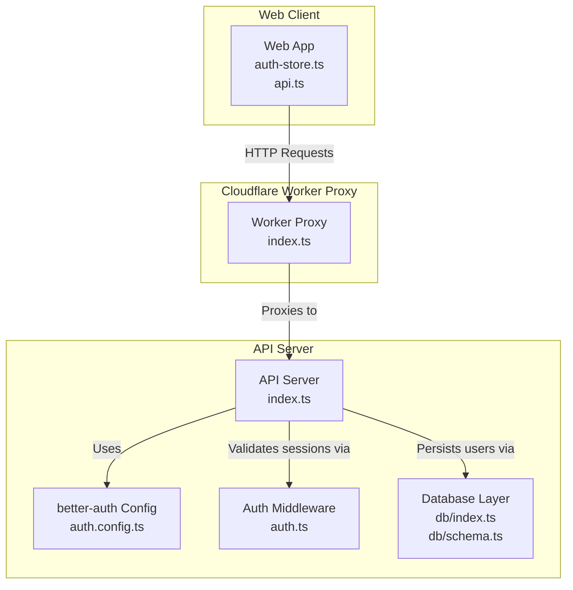
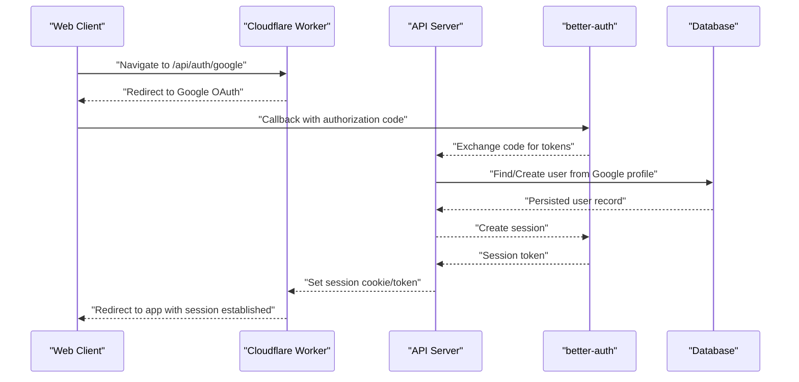
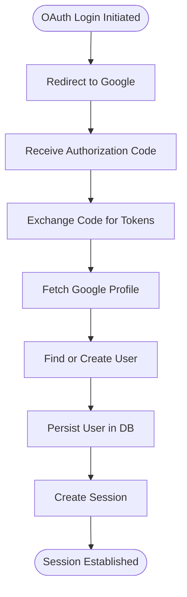
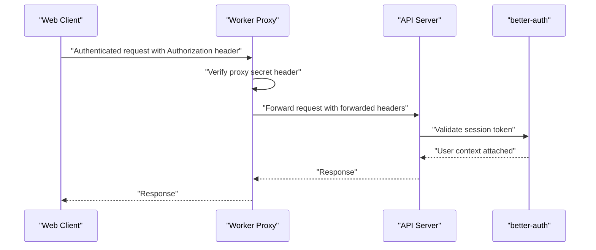
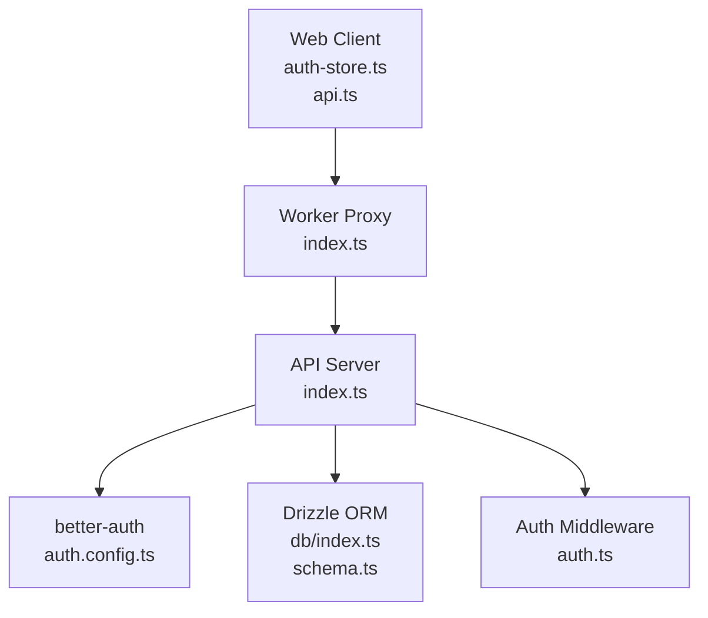

# Google OAuth Integration

<cite>
**Referenced Files in This Document**
- [auth.config.ts](file://apps/api/src/lib/auth.config.ts)
- [auth.service.ts](file://apps/api/src/services/auth.service.ts)
- [auth.ts](file://apps/api/src/middleware/auth.ts)
- [index.ts](file://apps/api/src/index.ts)
- [schema.ts](file://apps/api/src/db/schema.ts)
- [index.ts](file://apps/api/src/db/index.ts)
- [drizzle.config.ts](file://apps/api/drizzle.config.ts)
- [index.ts](file://apps/worker/src/index.ts)
- [auth-store.ts](file://apps/web/src/stores/auth-store.ts)
- [api.ts](file://apps/web/src/lib/api.ts)
- [index.ts](file://apps/api/src/index.ts)
</cite>

## Table of Contents
1. [Introduction](#introduction)
2. [Project Structure](#project-structure)
3. [Core Components](#core-components)
4. [Architecture Overview](#architecture-overview)
5. [Detailed Component Analysis](#detailed-component-analysis)
6. [Dependency Analysis](#dependency-analysis)
7. [Performance Considerations](#performance-considerations)
8. [Troubleshooting Guide](#troubleshooting-guide)
9. [Conclusion](#conclusion)
10. [Appendices](#appendices)

## Introduction
This document explains the Google OAuth integration built with better-auth in the API application and the supporting infrastructure across the API server, Cloudflare Worker proxy, and the web client. It covers configuration, authentication flow, callback handling, user profile extraction, account linking, session establishment, and integration with Cloudflare Workers for secure proxy functionality and session validation.

## Project Structure
The OAuth integration spans three primary parts:
- API server configured with better-auth for Google OAuth, session management, and user persistence
- Cloudflare Worker acting as a reverse proxy to the API server with security enforcement
- Web client managing user state and making authenticated requests via the proxy

**Diagram sources**
- [index.ts:1-106](file://apps/worker/src/index.ts#L1-L106)
- [index.ts:1-67](file://apps/api/src/index.ts#L1-L67)
- [auth.config.ts:1-42](file://apps/api/src/lib/auth.config.ts#L1-L42)
- [auth.ts:1-53](file://apps/api/src/middleware/auth.ts#L1-L53)
- [index.ts:1-9](file://apps/api/src/db/index.ts#L1-L9)
- [schema.ts:1-247](file://apps/api/src/db/schema.ts#L1-L247)

**Section sources**
- [index.ts:1-67](file://apps/api/src/index.ts#L1-L67)
- [auth.config.ts:1-42](file://apps/api/src/lib/auth.config.ts#L1-L42)
- [auth.ts:1-53](file://apps/api/src/middleware/auth.ts#L1-L53)
- [index.ts:1-9](file://apps/api/src/db/index.ts#L1-L9)
- [schema.ts:1-247](file://apps/api/src/db/schema.ts#L1-L247)
- [index.ts:1-106](file://apps/worker/src/index.ts#L1-L106)
- [auth-store.ts:1-31](file://apps/web/src/stores/auth-store.ts#L1-L31)
- [api.ts:1-60](file://apps/web/src/lib/api.ts#L1-L60)

## Core Components
- better-auth configuration for Google OAuth provider, session caching, and user fields
- User service for finding or creating users based on Google profile data
- Authentication middleware for session validation and proxy verification
- Database schema modeling users and roles
- Cloudflare Worker proxy enforcing CORS, security headers, rate limits, and forwarding requests to the API
- Web client state management and API client helpers

Key implementation references:
- Google OAuth provider configuration and session settings: [auth.config.ts:10-24](file://apps/api/src/lib/auth.config.ts#L10-L24)
- User persistence and admin role assignment: [auth.service.ts:16-59](file://apps/api/src/services/auth.service.ts#L16-L59)
- Session validation and proxy verification: [auth.ts:10-52](file://apps/api/src/middleware/auth.ts#L10-L52)
- User table schema and indexes: [schema.ts:41-51](file://apps/api/src/db/schema.ts#L41-L51)
- Proxy behavior and security headers: [index.ts:15-103](file://apps/worker/src/index.ts#L15-L103)
- Frontend session state and API client: [auth-store.ts:1-31](file://apps/web/src/stores/auth-store.ts#L1-L31), [api.ts:1-60](file://apps/web/src/lib/api.ts#L1-L60)

**Section sources**
- [auth.config.ts:1-42](file://apps/api/src/lib/auth.config.ts#L1-L42)
- [auth.service.ts:1-105](file://apps/api/src/services/auth.service.ts#L1-L105)
- [auth.ts:1-53](file://apps/api/src/middleware/auth.ts#L1-L53)
- [schema.ts:1-247](file://apps/api/src/db/schema.ts#L1-L247)
- [index.ts:1-106](file://apps/worker/src/index.ts#L1-L106)
- [auth-store.ts:1-31](file://apps/web/src/stores/auth-store.ts#L1-L31)
- [api.ts:1-60](file://apps/web/src/lib/api.ts#L1-L60)

## Architecture Overview
The system integrates Google OAuth via better-auth on the API server. The web client initiates OAuth with the API server, receives a session token, and communicates with backend endpoints through the Cloudflare Worker proxy. The proxy enforces security policies and forwards requests to the API server, which validates sessions and persists user data.

**Diagram sources**
- [auth.config.ts:10-15](file://apps/api/src/lib/auth.config.ts#L10-L15)
- [auth.service.ts:16-59](file://apps/api/src/services/auth.service.ts#L16-L59)
- [index.ts:40-47](file://apps/api/src/index.ts#L40-L47)
- [index.ts:82-103](file://apps/worker/src/index.ts#L82-L103)

## Detailed Component Analysis

### better-auth Configuration for Google OAuth
- Provider registration: Google OAuth is configured with client ID and client secret from environment variables.
- Base URL and secret: Used for signing cookies and constructing OAuth URLs.
- Session settings: Cookie cache enabled with short TTL; session update interval configured.
- Account linking: Disabled to reduce risk during initial rollout.
- Additional user fields: Supports an admin flag and role assignment.

Implementation references:
- Provider configuration: [auth.config.ts:10-15](file://apps/api/src/lib/auth.config.ts#L10-L15)
- Session and account settings: [auth.config.ts:16-29](file://apps/api/src/lib/auth.config.ts#L16-L29)
- Additional user fields: [auth.config.ts:30-38](file://apps/api/src/lib/auth.config.ts#L30-L38)

**Section sources**
- [auth.config.ts:1-42](file://apps/api/src/lib/auth.config.ts#L1-L42)

### Authentication Flow: Login, Callback, and Session Creation
- Initiation: The web client triggers the Google OAuth flow through the API server’s OAuth route.
- Token Exchange: better-auth exchanges the authorization code for tokens and retrieves the user profile.
- User Persistence: The API finds an existing user by Google identifier or creates a new one, assigning admin role if the email matches the configured admin email.
- Session Establishment: better-auth creates a session and returns a session token/cookie to the client.

Implementation references:
- User persistence and admin role: [auth.service.ts:16-59](file://apps/api/src/services/auth.service.ts#L16-L59)
- API route placeholder for auth: [index.ts:44-47](file://apps/api/src/index.ts#L44-L47)

**Diagram sources**
- [auth.service.ts:16-59](file://apps/api/src/services/auth.service.ts#L16-L59)
- [auth.config.ts:10-15](file://apps/api/src/lib/auth.config.ts#L10-L15)

**Section sources**
- [auth.service.ts:1-105](file://apps/api/src/services/auth.service.ts#L1-L105)
- [index.ts:40-47](file://apps/api/src/index.ts#L40-L47)

### OAuth Callback Handling and User Profile Extraction
- The API server relies on better-auth to handle the OAuth callback and extract profile data.
- The user service receives profile identifiers (e.g., Google sub, email) and enriches the record with name and avatar if present.
- Admin privileges are assigned based on a configured admin email.

Implementation references:
- Profile extraction and persistence: [auth.service.ts:16-59](file://apps/api/src/services/auth.service.ts#L16-L59)

**Section sources**
- [auth.service.ts:1-105](file://apps/api/src/services/auth.service.ts#L1-L105)

### Account Linking Mechanisms
- Account linking is disabled in the better-auth configuration for security and simplicity.
- Users are identified by Google’s unique identifier stored in the database.

Implementation references:
- Account linking disabled: [auth.config.ts:25-29](file://apps/api/src/lib/auth.config.ts#L25-L29)
- Unique Google identifier field: [schema.ts](file://apps/api/src/db/schema.ts#L43)

**Section sources**
- [auth.config.ts:25-29](file://apps/api/src/lib/auth.config.ts#L25-L29)
- [schema.ts:41-51](file://apps/api/src/db/schema.ts#L41-L51)

### User Session Establishment and Validation
- Session creation is handled by better-auth after successful OAuth flow.
- The API middleware currently contains placeholders for session validation; it reads a session token from headers or query parameters and passes through until proper validation is implemented.
- The Cloudflare Worker proxy enforces CORS, security headers, and verifies a dedicated proxy secret header before forwarding requests.

Implementation references:
- Session validation placeholder: [auth.ts:10-25](file://apps/api/src/middleware/auth.ts#L10-L25)
- Optional auth placeholder: [auth.ts:30-39](file://apps/api/src/middleware/auth.ts#L30-L39)
- Proxy verification middleware: [auth.ts:44-52](file://apps/api/src/middleware/auth.ts#L44-L52)
- Proxy security and forwarding: [index.ts:15-103](file://apps/worker/src/index.ts#L15-L103)

**Diagram sources**
- [auth.ts:10-25](file://apps/api/src/middleware/auth.ts#L10-L25)
- [auth.ts:44-52](file://apps/api/src/middleware/auth.ts#L44-L52)
- [index.ts:82-103](file://apps/worker/src/index.ts#L82-L103)

**Section sources**
- [auth.ts:1-53](file://apps/api/src/middleware/auth.ts#L1-L53)
- [index.ts:1-106](file://apps/worker/src/index.ts#L1-L106)

### Cloudflare Workers Integration for Secure OAuth Proxy
- CORS: Restricts origins to the frontend URL and allows credentials.
- Security headers: Adds secure headers to all responses.
- Body size limit: Enforces a 100KB request body limit for API endpoints.
- Turnstile verification: Validates Cloudflare Turnstile challenges for specific endpoints.
- Reverse proxy: Forwards all /api/* requests to the API base URL, adding forwarded IP and a proxy secret header.
- Session validation: The API middleware reads session tokens from headers or query parameters and will validate them against better-auth.

Implementation references:
- CORS and security: [index.ts:15-31](file://apps/worker/src/index.ts#L15-L31)
- Body size limit: [index.ts:33-40](file://apps/worker/src/index.ts#L33-L40)
- Turnstile verification: [index.ts:42-79](file://apps/worker/src/index.ts#L42-L79)
- Proxy forwarding: [index.ts:81-103](file://apps/worker/src/index.ts#L81-L103)
- Proxy secret verification: [auth.ts:44-52](file://apps/api/src/middleware/auth.ts#L44-L52)

**Section sources**
- [index.ts:1-106](file://apps/worker/src/index.ts#L1-L106)
- [auth.ts:44-52](file://apps/api/src/middleware/auth.ts#L44-L52)

### Web Client Session Management
- The web client maintains user state using a Zustand store with fields for user identity, authentication status, and loading state.
- The API client supports passing an Authorization header with Bearer tokens for authenticated requests.

Implementation references:
- Store state: [auth-store.ts:4-11](file://apps/web/src/stores/auth-store.ts#L4-L11)
- API client with Authorization header: [api.ts:15-17](file://apps/web/src/lib/api.ts#L15-L17)

**Section sources**
- [auth-store.ts:1-31](file://apps/web/src/stores/auth-store.ts#L1-L31)
- [api.ts:1-60](file://apps/web/src/lib/api.ts#L1-L60)

## Dependency Analysis
The OAuth integration depends on:
- better-auth for OAuth provider configuration, token exchange, and session management
- Drizzle ORM for database access and schema definitions
- Cloudflare Worker for proxying and enforcing security policies
- Web client for initiating OAuth and maintaining session state

**Diagram sources**
- [auth-store.ts:1-31](file://apps/web/src/stores/auth-store.ts#L1-L31)
- [api.ts:1-60](file://apps/web/src/lib/api.ts#L1-L60)
- [index.ts:1-106](file://apps/worker/src/index.ts#L1-L106)
- [index.ts:1-67](file://apps/api/src/index.ts#L1-L67)
- [auth.config.ts:1-42](file://apps/api/src/lib/auth.config.ts#L1-L42)
- [index.ts:1-9](file://apps/api/src/db/index.ts#L1-L9)
- [schema.ts:1-247](file://apps/api/src/db/schema.ts#L1-L247)
- [auth.ts:1-53](file://apps/api/src/middleware/auth.ts#L1-L53)

**Section sources**
- [auth.config.ts:1-42](file://apps/api/src/lib/auth.config.ts#L1-L42)
- [index.ts:1-9](file://apps/api/src/db/index.ts#L1-L9)
- [schema.ts:1-247](file://apps/api/src/db/schema.ts#L1-L247)
- [index.ts:1-106](file://apps/worker/src/index.ts#L1-L106)
- [auth.ts:1-53](file://apps/api/src/middleware/auth.ts#L1-L53)
- [auth-store.ts:1-31](file://apps/web/src/stores/auth-store.ts#L1-L31)
- [api.ts:1-60](file://apps/web/src/lib/api.ts#L1-L60)

## Performance Considerations
- Session cache: better-auth cookie cache is enabled with a short TTL to balance freshness and performance.
- Session update interval: Sessions are updated periodically to maintain activity timestamps.
- Database indexing: Unique indexes on user identifiers (e.g., Google ID, email) improve lookup performance.
- Proxy request size limits: Enforced to prevent oversized payloads.
- Network latency: Using a reverse proxy adds minimal overhead; ensure DNS and TLS termination are optimized.

Recommendations:
- Monitor session cache hit rates and adjust TTL based on traffic patterns.
- Consider enabling token refresh strategies in better-auth if long-lived sessions are required.
- Add database query timeouts and connection pooling tuning for high-load scenarios.

**Section sources**
- [auth.config.ts:18-24](file://apps/api/src/lib/auth.config.ts#L18-L24)
- [schema.ts:43-44](file://apps/api/src/db/schema.ts#L43-L44)
- [schema.ts](file://apps/api/src/db/schema.ts#L48)
- [index.ts:33-40](file://apps/worker/src/index.ts#L33-L40)

## Troubleshooting Guide
Common OAuth issues and resolutions:
- Redirect URI mismatch
  - Ensure the OAuth base URL and provider redirect URIs match the deployed environment.
  - Verify the base URL setting in better-auth configuration.
  - References: [auth.config.ts](file://apps/api/src/lib/auth.config.ts#L16)

- Consent screen configuration
  - Confirm that the OAuth client is configured to use the production consent screen with approved domains.
  - Ensure the authorized redirect URIs include the deployment’s callback endpoint.

- Token exchange failures
  - Validate client ID and client secret environment variables.
  - Check network connectivity and TLS termination for the OAuth endpoints.
  - References: [auth.config.ts:12-13](file://apps/api/src/lib/auth.config.ts#L12-L13)

- Session validation errors
  - The current middleware reads session tokens from headers or query parameters but does not yet validate them with better-auth.
  - Implement proper session validation using better-auth’s session APIs.
  - References: [auth.ts:10-25](file://apps/api/src/middleware/auth.ts#L10-L25)

- Proxy verification failures
  - Ensure the proxy secret header is included in proxied requests.
  - Verify the worker’s proxy secret header matches the API middleware’s expectation.
  - References: [index.ts:86-88](file://apps/worker/src/index.ts#L86-L88), [auth.ts:44-52](file://apps/api/src/middleware/auth.ts#L44-L52)

- Database constraints
  - Unique constraints on Google ID and email must be respected; handle conflicts gracefully during user creation.
  - References: [schema.ts:43-44](file://apps/api/src/db/schema.ts#L43-L44), [schema.ts:47-48](file://apps/api/src/db/schema.ts#L47-L48)

**Section sources**
- [auth.config.ts:12-16](file://apps/api/src/lib/auth.config.ts#L12-L16)
- [auth.ts:10-25](file://apps/api/src/middleware/auth.ts#L10-L25)
- [index.ts:86-88](file://apps/worker/src/index.ts#L86-L88)
- [schema.ts:43-44](file://apps/api/src/db/schema.ts#L43-L44)
- [schema.ts:47-48](file://apps/api/src/db/schema.ts#L47-L48)

## Conclusion
The Google OAuth integration leverages better-auth for provider configuration, token exchange, and session management, while the Cloudflare Worker proxy enforces security and acts as a gateway to the API server. The web client manages user state and authenticated requests. The current implementation focuses on secure transport and basic session validation, with room to enhance session validation and token refresh strategies as needs evolve.

## Appendices

### Practical Configuration Examples
- Environment variables for OAuth
  - GOOGLE_CLIENT_ID
  - GOOGLE_CLIENT_SECRET
  - BETTER_AUTH_URL
  - BETTER_AUTH_SECRET
  - DATABASE_URL
  - ADMIN_EMAIL

- Example callback URL setup
  - Ensure the OAuth provider’s authorized redirect URIs include the API server’s OAuth callback endpoint under the configured base URL.

- Session establishment
  - After successful OAuth, the API server returns a session token/cookie. The web client stores this token and sends it in subsequent requests via the worker proxy.

- Token refresh strategies
  - Configure better-auth’s session settings for automatic renewal and consider implementing refresh endpoints if long-lived sessions are required.

**Section sources**
- [auth.config.ts:10-17](file://apps/api/src/lib/auth.config.ts#L10-L17)
- [auth.ts:10-25](file://apps/api/src/middleware/auth.ts#L10-L25)
- [index.ts:82-103](file://apps/worker/src/index.ts#L82-L103)