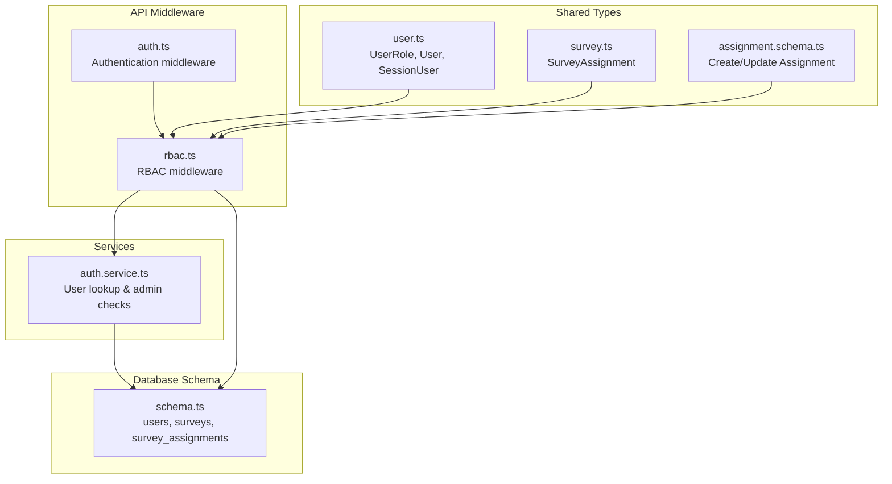
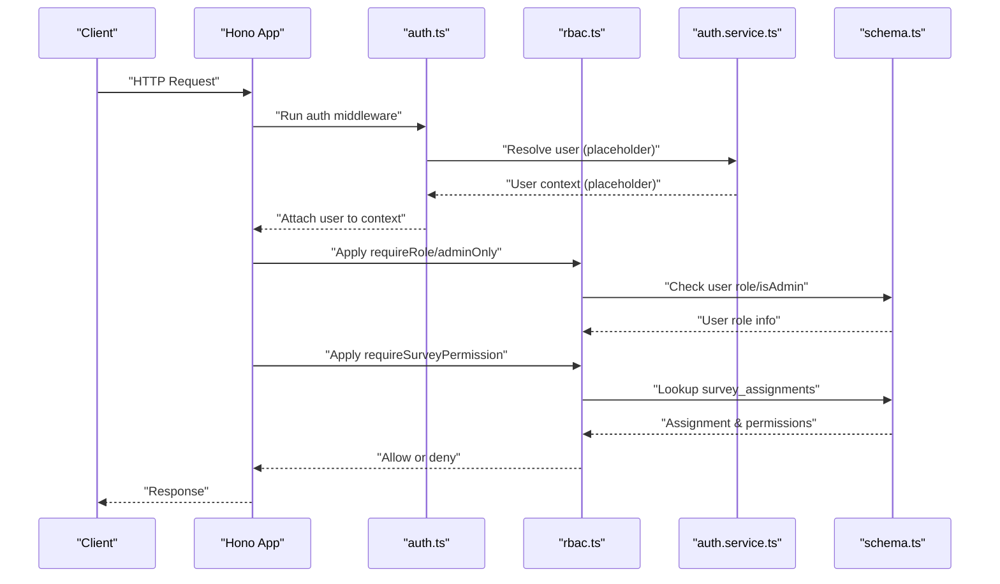
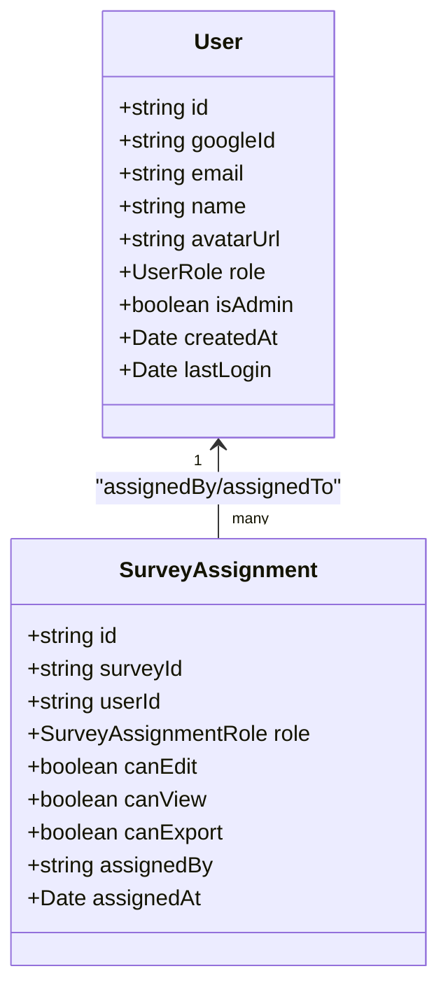
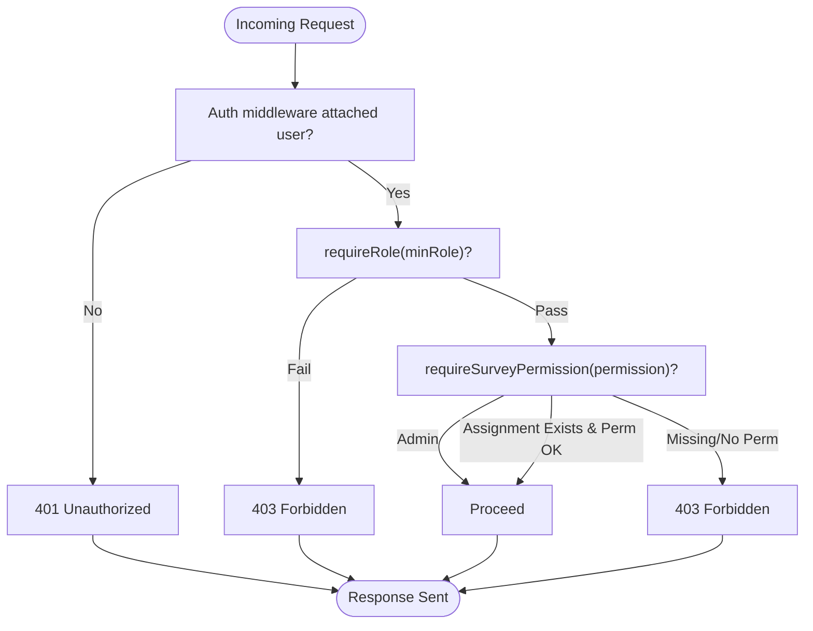
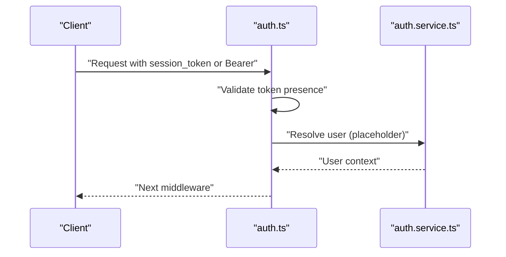
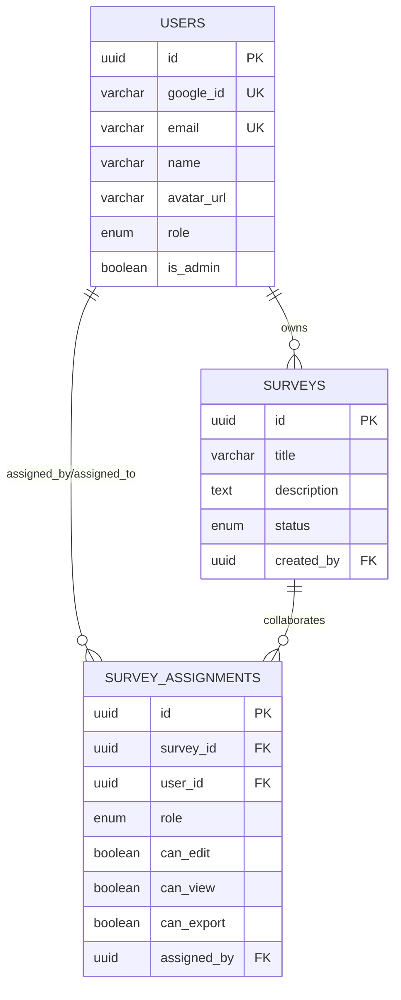
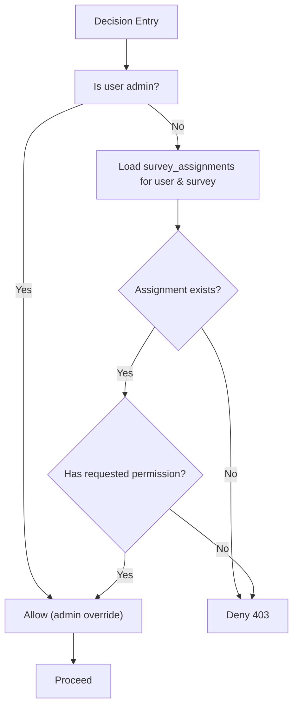
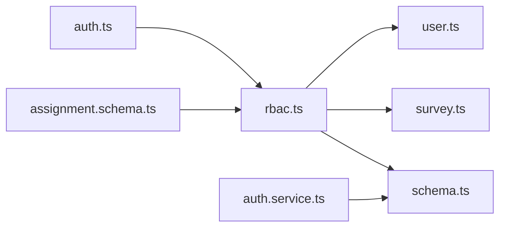

# Role-Based Access Control (RBAC)

<cite>
**Referenced Files in This Document**
- [rbac.ts](file://apps/api/src/middleware/rbac.ts)
- [auth.ts](file://apps/api/src/middleware/auth.ts)
- [auth.service.ts](file://apps/api/src/services/auth.service.ts)
- [schema.ts](file://apps/api/src/db/schema.ts)
- [user.ts](file://packages/shared/src/types/user.ts)
- [assignment.schema.ts](file://packages/shared/src/schemas/assignment.schema.ts)
- [survey.ts](file://packages/shared/src/types/survey.ts)
- [index.ts](file://apps/api/src/index.ts)
</cite>

## Table of Contents
1. [Introduction](#introduction)
2. [Project Structure](#project-structure)
3. [Core Components](#core-components)
4. [Architecture Overview](#architecture-overview)
5. [Detailed Component Analysis](#detailed-component-analysis)
6. [Dependency Analysis](#dependency-analysis)
7. [Performance Considerations](#performance-considerations)
8. [Troubleshooting Guide](#troubleshooting-guide)
9. [Conclusion](#conclusion)

## Introduction
This document explains the Role-Based Access Control (RBAC) system implemented in the backend API. It covers the user role hierarchy, middleware enforcement, role assignment mechanisms, permission inheritance patterns, and access control decision logic. It also documents how roles relate to survey ownership for collaborative access control, along with practical examples and operational guidance for role escalation, permission conflicts, and policy maintenance.

## Project Structure
The RBAC implementation spans middleware, database schema, shared types, and service logic:
- Middleware enforces authentication and role-based authorization.
- Database schema defines user roles and per-survey assignments.
- Shared types define role enums and assignment structures.
- Services handle user creation, admin detection, and role persistence.

**Diagram sources**
- [auth.ts:1-53](file://apps/api/src/middleware/auth.ts#L1-L53)
- [rbac.ts:1-56](file://apps/api/src/middleware/rbac.ts#L1-L56)
- [auth.service.ts:1-105](file://apps/api/src/services/auth.service.ts#L1-L105)
- [schema.ts:1-247](file://apps/api/src/db/schema.ts#L1-L247)
- [user.ts:1-22](file://packages/shared/src/types/user.ts#L1-L22)
- [survey.ts:1-50](file://packages/shared/src/types/survey.ts#L1-L50)
- [assignment.schema.ts:1-20](file://packages/shared/src/schemas/assignment.schema.ts#L1-L20)

**Section sources**
- [index.ts:1-67](file://apps/api/src/index.ts#L1-L67)

## Core Components
- Role hierarchy and middleware:
  - Role hierarchy is defined for admin, editor, viewer, and user.
  - requireRole enforces minimum role thresholds.
  - adminOnly is a convenience wrapper for admin-only access.
  - requireSurveyPermission enforces per-survey permissions (edit/view/export) via survey_assignments.
- Authentication middleware:
  - Extracts session tokens from Authorization header or query param.
  - Validates presence and defers full session verification to a future integration.
- User roles and admin detection:
  - UserRole enum supports admin/editor/viewer/user.
  - Admin detection via isAdmin flag or role field.
  - Admin email environment variable seeds initial admin.
- Per-survey assignments:
  - survey_assignments table stores role and granular permissions per user and survey.
  - Shared types and Zod schemas define assignment shapes and defaults.

**Section sources**
- [rbac.ts:1-56](file://apps/api/src/middleware/rbac.ts#L1-L56)
- [auth.ts:1-53](file://apps/api/src/middleware/auth.ts#L1-L53)
- [user.ts:1-22](file://packages/shared/src/types/user.ts#L1-L22)
- [auth.service.ts:1-105](file://apps/api/src/services/auth.service.ts#L1-L105)
- [schema.ts:75-99](file://apps/api/src/db/schema.ts#L75-L99)
- [assignment.schema.ts:1-20](file://packages/shared/src/schemas/assignment.schema.ts#L1-L20)
- [survey.ts:35-50](file://packages/shared/src/types/survey.ts#L35-L50)

## Architecture Overview
The RBAC architecture integrates authentication, role checks, and per-resource permissions:
- Authentication middleware attaches a user context (placeholder).
- RBAC middleware enforces global role requirements and per-survey permissions.
- Services and database enforce admin status and maintain user-role state.
- Shared types and schemas standardize role and assignment structures.

**Diagram sources**
- [auth.ts:10-25](file://apps/api/src/middleware/auth.ts#L10-L25)
- [rbac.ts:16-27](file://apps/api/src/middleware/rbac.ts#L16-L27)
- [rbac.ts:38-55](file://apps/api/src/middleware/rbac.ts#L38-L55)
- [auth.service.ts:73-79](file://apps/api/src/services/auth.service.ts#L73-L79)
- [schema.ts:41-51](file://apps/api/src/db/schema.ts#L41-L51)
- [schema.ts:75-99](file://apps/api/src/db/schema.ts#L75-L99)

## Detailed Component Analysis

### Role Hierarchy and Permission Model
- Global roles:
  - admin: highest privilege; intended for administrative tasks.
  - editor: can edit survey content.
  - viewer: can view survey content.
  - user: baseline authenticated role.
- Per-survey permissions:
  - can_edit, can_view, can_export are stored per assignment.
  - Roles include editor and viewer; assignment role maps to these values.
- Admin override:
  - Administrators bypass per-survey permission checks.

**Diagram sources**
- [user.ts:3-13](file://packages/shared/src/types/user.ts#L3-L13)
- [survey.ts:37-49](file://packages/shared/src/types/survey.ts#L37-L49)
- [schema.ts:41-51](file://apps/api/src/db/schema.ts#L41-L51)
- [schema.ts:75-99](file://apps/api/src/db/schema.ts#L75-L99)

**Section sources**
- [rbac.ts:3-10](file://apps/api/src/middleware/rbac.ts#L3-L10)
- [user.ts:1-22](file://packages/shared/src/types/user.ts#L1-L22)
- [assignment.schema.ts:3-9](file://packages/shared/src/schemas/assignment.schema.ts#L3-L9)
- [survey.ts:35-50](file://packages/shared/src/types/survey.ts#L35-L50)

### RBAC Middleware Implementation
- requireRole:
  - Enforces minimum role threshold using a numeric hierarchy.
  - Currently a placeholder; expects user context from auth middleware.
- adminOnly:
  - Shortcut for requireRole("admin").
- requireSurveyPermission:
  - Checks per-survey permissions (can_edit, can_view, can_export).
  - Admin override is supported.
  - Uses survey_assignments to validate permissions.

**Diagram sources**
- [rbac.ts:16-27](file://apps/api/src/middleware/rbac.ts#L16-L27)
- [rbac.ts:38-55](file://apps/api/src/middleware/rbac.ts#L38-L55)

**Section sources**
- [rbac.ts:1-56](file://apps/api/src/middleware/rbac.ts#L1-L56)

### Authentication Middleware and User Resolution
- Extracts session token from Authorization header or query param.
- Validates presence and attaches user context (placeholder).
- Future integration will validate tokens against a session store.

**Diagram sources**
- [auth.ts:10-25](file://apps/api/src/middleware/auth.ts#L10-L25)
- [auth.service.ts:16-59](file://apps/api/src/services/auth.service.ts#L16-L59)

**Section sources**
- [auth.ts:1-53](file://apps/api/src/middleware/auth.ts#L1-L53)
- [auth.service.ts:1-105](file://apps/api/src/services/auth.service.ts#L1-L105)

### Role Assignment Mechanisms and Permission Inheritance
- Initial admin seeding:
  - Admin email environment variable determines initial admin.
  - Users with matching email are granted isAdmin and role=admin.
- Per-survey assignments:
  - Assignments include role (editor/viewer) and granular permissions.
  - Defaults ensure safe baseline permissions (e.g., canView true by default).
- Ownership and collaboration:
  - Surveys are owned by users (created_by).
  - Collaborators are granted editor/viewer roles via survey_assignments.

**Diagram sources**
- [schema.ts:41-51](file://apps/api/src/db/schema.ts#L41-L51)
- [schema.ts:57-69](file://apps/api/src/db/schema.ts#L57-L69)
- [schema.ts:75-99](file://apps/api/src/db/schema.ts#L75-L99)

**Section sources**
- [auth.service.ts:8-59](file://apps/api/src/services/auth.service.ts#L8-L59)
- [assignment.schema.ts:3-16](file://packages/shared/src/schemas/assignment.schema.ts#L3-L16)
- [schema.ts:75-99](file://apps/api/src/db/schema.ts#L75-L99)

### Access Control Decision Logic
- Global role checks:
  - Compare user role against minimum required role using numeric hierarchy.
- Per-survey checks:
  - If user is admin, bypass per-survey checks.
  - Otherwise, verify existence of assignment and presence of requested permission.
- Dynamic permission checking:
  - Permissions are evaluated per endpoint/resource using requireSurveyPermission.

**Diagram sources**
- [rbac.ts:38-55](file://apps/api/src/middleware/rbac.ts#L38-L55)
- [schema.ts:75-99](file://apps/api/src/db/schema.ts#L75-L99)

**Section sources**
- [rbac.ts:1-56](file://apps/api/src/middleware/rbac.ts#L1-L56)

### Practical Examples

- Role-based route protection:
  - Apply adminOnly to administrative endpoints.
  - Apply requireRole to enforce minimum role thresholds across resources.
- Resource-level authorization:
  - Use requireSurveyPermission("can_edit"/"can_view"/"can_export") to gate per-survey actions.
- Dynamic permission checking:
  - Evaluate permissions at runtime based on current assignment and requested capability.

Note: The middleware currently contains placeholders and requires user context population from auth middleware and database-backed permission resolution.

**Section sources**
- [rbac.ts:16-32](file://apps/api/src/middleware/rbac.ts#L16-L32)
- [rbac.ts:38-55](file://apps/api/src/middleware/rbac.ts#L38-L55)

### Role Escalation Scenarios, Conflicts, and Policy Maintenance
- Role escalation:
  - Admin override allows bypassing per-survey restrictions.
  - Assignments can be updated to escalate or downgrade roles/permissions.
- Permission conflicts:
  - If a user lacks a required permission, deny access with 403.
  - Prefer explicit assignment checks to avoid ambiguous behavior.
- Policy maintenance:
  - Centralize role and permission definitions in shared types and schemas.
  - Keep middleware logic minimal and focused on enforcement.

**Section sources**
- [rbac.ts:3-10](file://apps/api/src/middleware/rbac.ts#L3-L10)
- [assignment.schema.ts:3-16](file://packages/shared/src/schemas/assignment.schema.ts#L3-L16)

## Dependency Analysis
RBAC depends on authentication, user roles, and per-survey assignments. The middleware relies on shared types and database schema to evaluate access.

**Diagram sources**
- [auth.ts:1-53](file://apps/api/src/middleware/auth.ts#L1-L53)
- [rbac.ts:1-56](file://apps/api/src/middleware/rbac.ts#L1-L56)
- [user.ts:1-22](file://packages/shared/src/types/user.ts#L1-L22)
- [survey.ts:1-50](file://packages/shared/src/types/survey.ts#L1-L50)
- [schema.ts:1-247](file://apps/api/src/db/schema.ts#L1-L247)
- [assignment.schema.ts:1-20](file://packages/shared/src/schemas/assignment.schema.ts#L1-L20)
- [auth.service.ts:1-105](file://apps/api/src/services/auth.service.ts#L1-L105)

**Section sources**
- [rbac.ts:1-56](file://apps/api/src/middleware/rbac.ts#L1-L56)
- [auth.ts:1-53](file://apps/api/src/middleware/auth.ts#L1-L53)
- [schema.ts:1-247](file://apps/api/src/db/schema.ts#L1-L247)

## Performance Considerations
- Middleware ordering:
  - Place auth middleware before RBAC to ensure user context is available.
- Database queries:
  - Cache frequently accessed user roles and admin flags where feasible.
  - Indexes on survey_assignments (surveyId, userId) reduce lookup costs.
- Request validation:
  - Keep middleware lightweight; defer heavy checks to services.

[No sources needed since this section provides general guidance]

## Troubleshooting Guide
- 401 Unauthorized:
  - Missing session token; ensure Authorization header or session_token query param is present.
- 403 Forbidden:
  - Insufficient role or missing per-survey permission; verify assignment and requested permission.
- Admin override not working:
  - Confirm user.isAdmin or role is admin; ensure RBAC logic evaluates admin before per-survey checks.
- Assignment not found:
  - Verify survey_assignments record exists for user and survey; confirm unique constraint and indexes.

**Section sources**
- [auth.ts:16-18](file://apps/api/src/middleware/auth.ts#L16-L18)
- [rbac.ts:21-23](file://apps/api/src/middleware/rbac.ts#L21-L23)
- [rbac.ts:49-51](file://apps/api/src/middleware/rbac.ts#L49-L51)
- [schema.ts:94-99](file://apps/api/src/db/schema.ts#L94-L99)

## Conclusion
The RBAC system establishes a clear role hierarchy and per-survey permission model. Authentication middleware prepares the user context, while RBAC middleware enforces both global and resource-level access controls. Shared types and database schema define consistent role and assignment semantics. The current implementation includes placeholders for user context and database-backed permission resolution, which should be implemented to enable full enforcement.