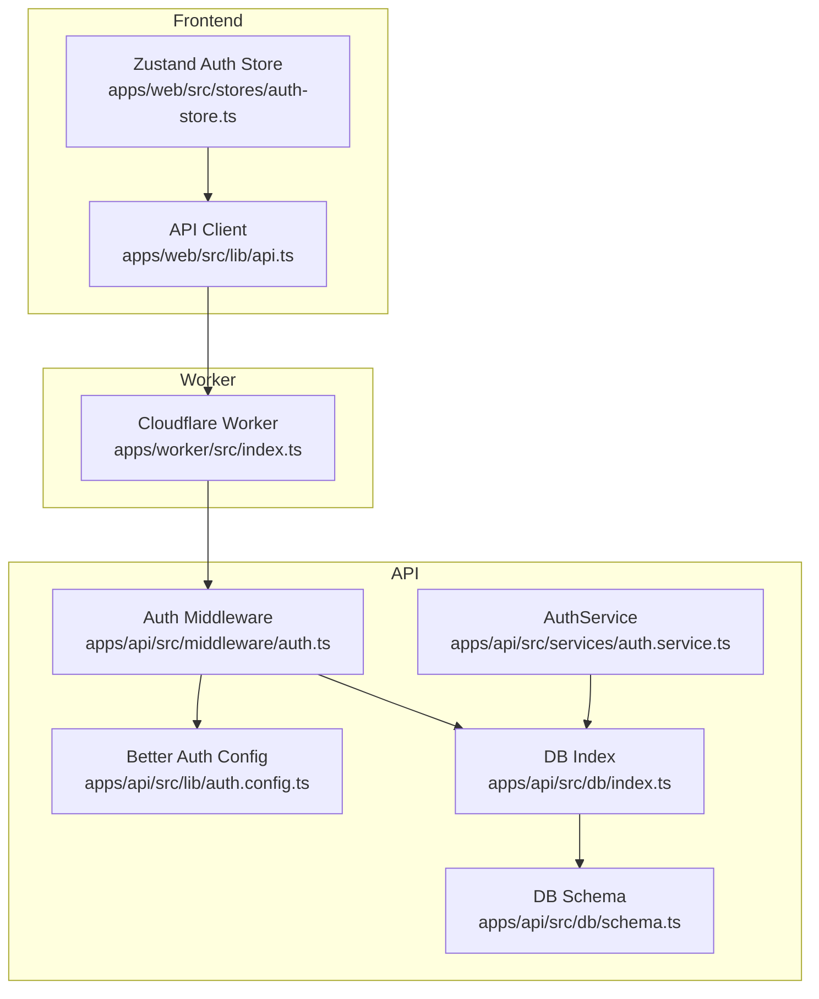
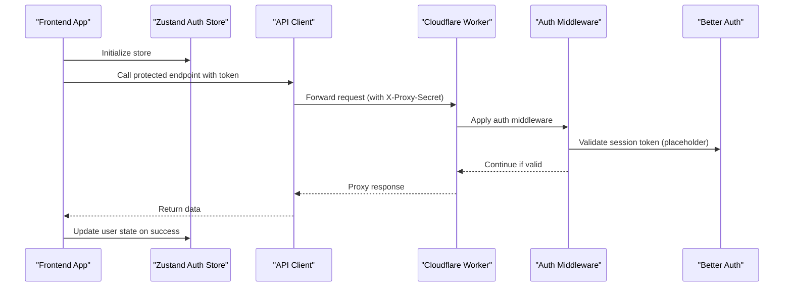
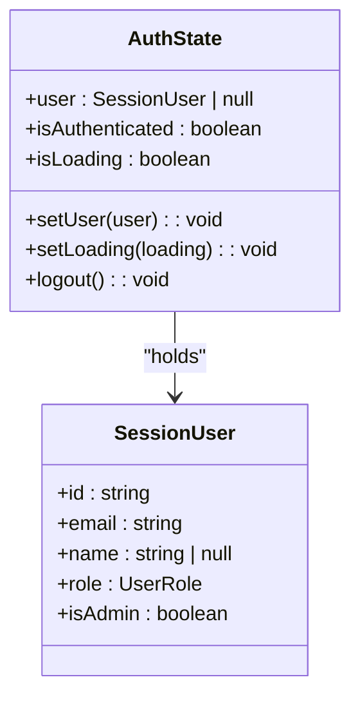
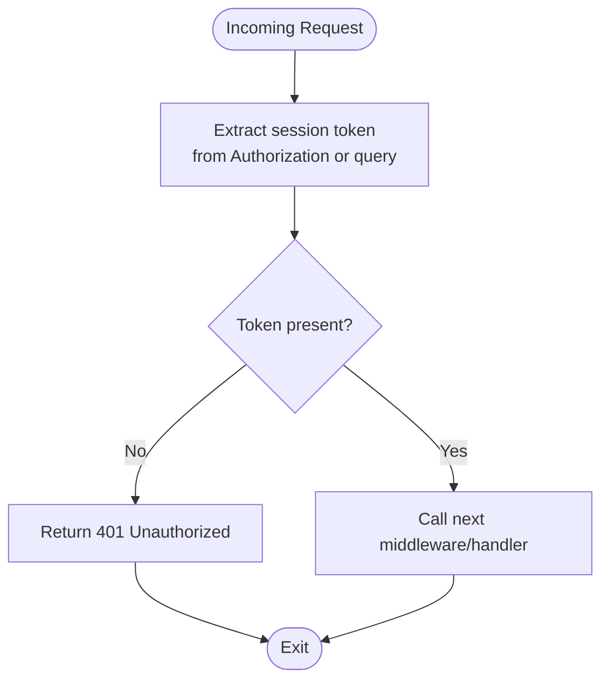
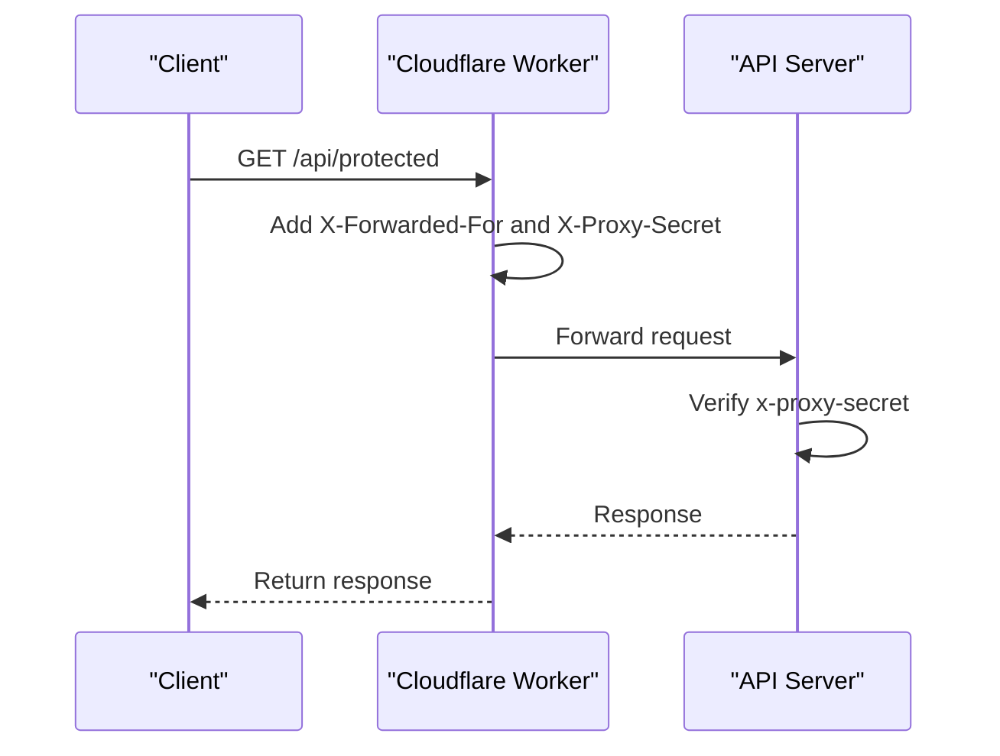
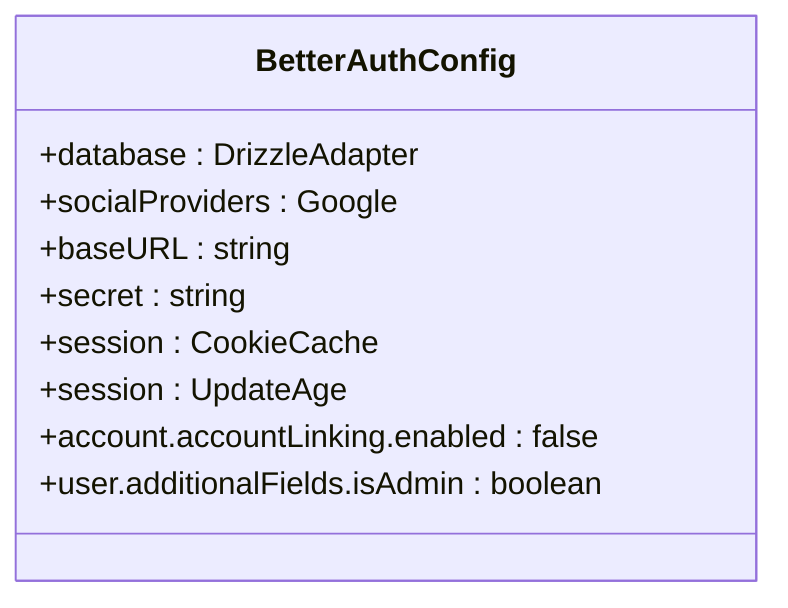
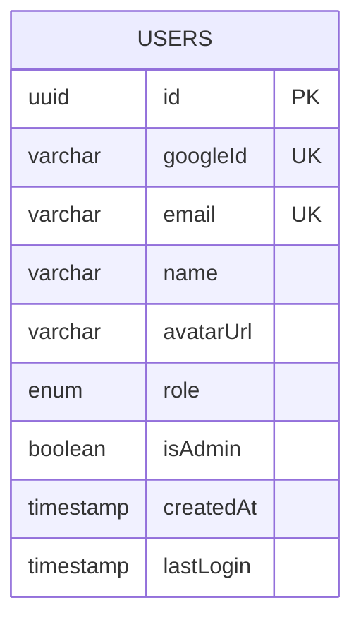
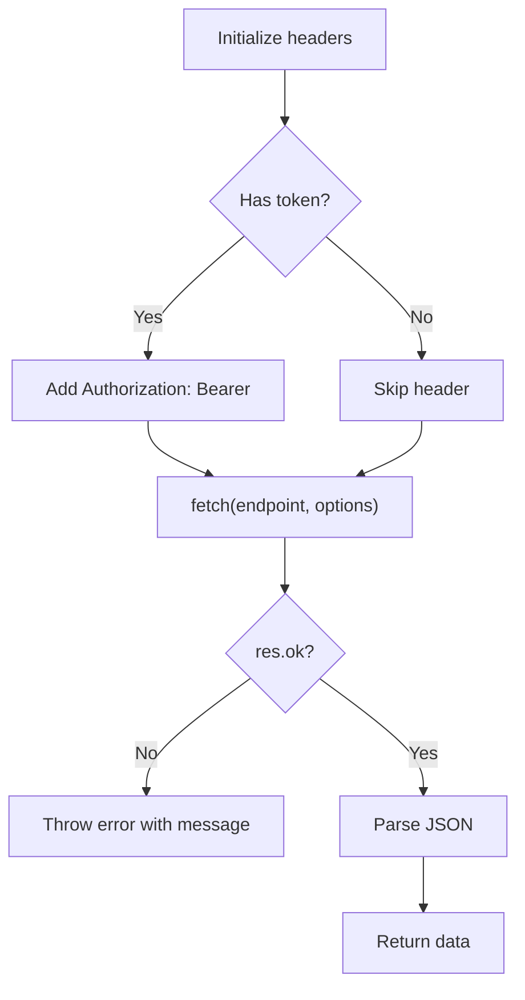
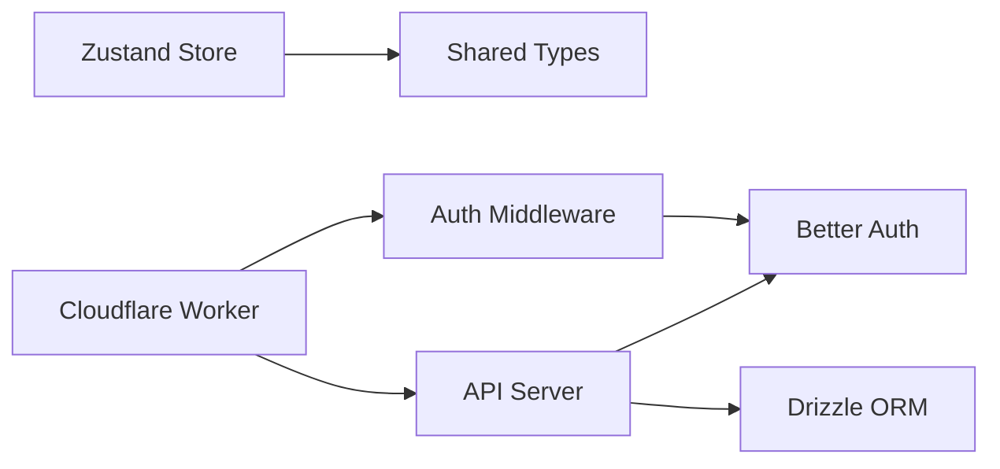

# Session Management

<cite>
**Referenced Files in This Document**
- [auth-store.ts](file://apps/web/src/stores/auth-store.ts)
- [api.ts](file://apps/web/src/lib/api.ts)
- [index.ts](file://apps/worker/src/index.ts)
- [index.ts](file://apps/api/src/index.ts)
- [auth.ts](file://apps/api/src/middleware/auth.ts)
- [auth.config.ts](file://apps/api/src/lib/auth.config.ts)
- [user.ts](file://packages/shared/src/types/user.ts)
- [schema.ts](file://apps/api/src/db/schema.ts)
- [index.ts](file://apps/api/src/db/index.ts)
- [auth.service.ts](file://apps/api/src/services/auth.service.ts)
</cite>

## Table of Contents
1. [Introduction](#introduction)
2. [Project Structure](#project-structure)
3. [Core Components](#core-components)
4. [Architecture Overview](#architecture-overview)
5. [Detailed Component Analysis](#detailed-component-analysis)
6. [Dependency Analysis](#dependency-analysis)
7. [Performance Considerations](#performance-considerations)
8. [Troubleshooting Guide](#troubleshooting-guide)
9. [Conclusion](#conclusion)

## Introduction
This document explains the session management system across the frontend and backend. It covers authentication state handling and session lifecycle, token validation, persistence, and renewal strategies. It also documents the authentication middleware for session verification and user context attachment, the frontend authentication store integration with Zustand, and the proxy verification middleware for Cloudflare Worker authentication and internal API security. Practical examples illustrate session initialization, token refresh workflows, and logout procedures, along with security considerations such as token storage, CSRF protection, and session timeout handling.

## Project Structure
The session management spans three layers:
- Frontend (React + Zustand): Reactive state for user session and loading states.
- Worker (Cloudflare): Proxy and security middleware for internal routing and external verification.
- API (Hono + better-auth): Authentication middleware, session configuration, and database-backed user management.

**Diagram sources**
- [auth-store.ts:1-31](file://apps/web/src/stores/auth-store.ts#L1-L31)
- [api.ts:1-60](file://apps/web/src/lib/api.ts#L1-L60)
- [index.ts:1-106](file://apps/worker/src/index.ts#L1-L106)
- [auth.ts:1-53](file://apps/api/src/middleware/auth.ts#L1-L53)
- [auth.config.ts:1-41](file://apps/api/src/lib/auth.config.ts#L1-L41)
- [index.ts:1-9](file://apps/api/src/db/index.ts#L1-L9)
- [schema.ts:1-247](file://apps/api/src/db/schema.ts#L1-L247)
- [auth.service.ts:1-50](file://apps/api/src/services/auth.service.ts#L1-L50)

**Section sources**
- [auth-store.ts:1-31](file://apps/web/src/stores/auth-store.ts#L1-L31)
- [api.ts:1-60](file://apps/web/src/lib/api.ts#L1-L60)
- [index.ts:1-106](file://apps/worker/src/index.ts#L1-L106)
- [auth.ts:1-53](file://apps/api/src/middleware/auth.ts#L1-L53)
- [auth.config.ts:1-41](file://apps/api/src/lib/auth.config.ts#L1-L41)
- [index.ts:1-9](file://apps/api/src/db/index.ts#L1-L9)
- [schema.ts:1-247](file://apps/api/src/db/schema.ts#L1-L247)
- [auth.service.ts:1-50](file://apps/api/src/services/auth.service.ts#L1-L50)

## Core Components
- Frontend Zustand store manages user identity, authentication state, and loading state. It exposes setters for user, loading, and logout.
- API authentication middleware validates session tokens from Authorization headers or query parameters and passes through for now (placeholder for better-auth integration).
- Worker proxy verifies internal requests via a shared secret header and forwards API traffic to the backend.
- Better Auth configuration defines session caching, update intervals, and user fields.
- Database schema models users and supports session-linked user records.

Key responsibilities:
- Token validation: Authorization header bearer token or query parameter.
- Session persistence: Cookie cache and session update age configured in better-auth.
- Renewal strategy: Periodic session updates governed by better-auth settings.
- Frontend state: Reactive store updates on login/logout and loading transitions.

**Section sources**
- [auth-store.ts:4-11](file://apps/web/src/stores/auth-store.ts#L4-L11)
- [auth.ts:10-25](file://apps/api/src/middleware/auth.ts#L10-L25)
- [index.ts:82-103](file://apps/worker/src/index.ts#L82-L103)
- [auth.config.ts:18-24](file://apps/api/src/lib/auth.config.ts#L18-L24)
- [schema.ts:41-51](file://apps/api/src/db/schema.ts#L41-L51)

## Architecture Overview
The system routes frontend requests through the Cloudflare Worker proxy, which enforces internal security and forwards requests to the backend API server. The API applies authentication middleware and better-auth session configuration to manage user sessions.

**Diagram sources**
- [auth-store.ts:13-30](file://apps/web/src/stores/auth-store.ts#L13-L30)
- [api.ts:7-30](file://apps/web/src/lib/api.ts#L7-L30)
- [index.ts:82-103](file://apps/worker/src/index.ts#L82-L103)
- [auth.ts:10-25](file://apps/api/src/middleware/auth.ts#L10-L25)
- [auth.config.ts:5-39](file://apps/api/src/lib/auth.config.ts#L5-L39)

## Detailed Component Analysis

### Frontend Authentication Store (Zustand)
The store encapsulates:
- user: current session user or null
- isAuthenticated: derived from presence of user
- isLoading: indicates async initialization/loading state
- setUser: updates user and toggles loading
- setLoading: sets loading flag
- logout: clears user and resets flags

**Diagram sources**
- [auth-store.ts:4-11](file://apps/web/src/stores/auth-store.ts#L4-L11)
- [user.ts:15-21](file://packages/shared/src/types/user.ts#L15-L21)

Practical usage patterns:
- Initialization: Set loading true initially; after hydration, set user or null.
- Login: On successful auth, call setUser with SessionUser payload.
- Logout: Call logout to clear state.

**Section sources**
- [auth-store.ts:13-30](file://apps/web/src/stores/auth-store.ts#L13-L30)
- [user.ts:15-21](file://packages/shared/src/types/user.ts#L15-L21)

### API Authentication Middleware
The middleware:
- Extracts session token from Authorization header (Bearer) or query parameter.
- Returns unauthorized if missing.
- Currently acts as a placeholder for better-auth validation.

Optional auth variant allows non-blocking resolution of user context.

**Diagram sources**
- [auth.ts:10-25](file://apps/api/src/middleware/auth.ts#L10-L25)

**Section sources**
- [auth.ts:10-39](file://apps/api/src/middleware/auth.ts#L10-L39)

### Proxy Verification Middleware (Cloudflare Worker)
The Worker:
- Enforces CORS for the frontend origin.
- Proxies all /api/* requests to the backend.
- Adds internal headers: X-Forwarded-For and X-Proxy-Secret.
- Verifies internal requests via x-proxy-secret header.

**Diagram sources**
- [index.ts:82-103](file://apps/worker/src/index.ts#L82-L103)
- [auth.ts:44-52](file://apps/api/src/middleware/auth.ts#L44-L52)

**Section sources**
- [index.ts:15-28](file://apps/worker/src/index.ts#L15-L28)
- [index.ts:82-103](file://apps/worker/src/index.ts#L82-L103)
- [auth.ts:44-52](file://apps/api/src/middleware/auth.ts#L44-L52)

### Better Auth Session Configuration
Better Auth is configured with:
- Database adapter using Drizzle ORM and PostgreSQL.
- Social provider (Google) credentials.
- Session cookie cache enabled with short TTL.
- Session update interval to refresh last activity.
- Additional user field for isAdmin.
- Account linking disabled for security.

**Diagram sources**
- [auth.config.ts:5-39](file://apps/api/src/lib/auth.config.ts#L5-L39)

**Section sources**
- [auth.config.ts:5-39](file://apps/api/src/lib/auth.config.ts#L5-L39)

### Database Schema and User Model
The users table includes:
- Unique identifiers and profile fields.
- Role enumeration and admin flag.
- Timestamps for creation and last login.

**Diagram sources**
- [schema.ts:41-51](file://apps/api/src/db/schema.ts#L41-L51)

**Section sources**
- [schema.ts:41-51](file://apps/api/src/db/schema.ts#L41-L51)
- [user.ts:3-21](file://packages/shared/src/types/user.ts#L3-L21)

### API Client and Token Propagation
The API client:
- Accepts an optional token.
- Attaches Authorization header with Bearer scheme when provided.
- Throws on non-OK responses with extracted messages.

**Diagram sources**
- [api.ts:7-30](file://apps/web/src/lib/api.ts#L7-L30)

**Section sources**
- [api.ts:1-60](file://apps/web/src/lib/api.ts#L1-L60)

### Practical Workflows

#### Session Initialization
- Frontend initializes Zustand store with loading=true.
- On app boot, hydrate from persisted state or backend.
- If user exists, set user and isAuthenticated; otherwise remain unauthenticated.

Paths:
- [auth-store.ts:13-30](file://apps/web/src/stores/auth-store.ts#L13-L30)

#### Token Refresh Workflow
- Better Auth session updateAge governs periodic refresh.
- Frontend can re-fetch user info or call a dedicated refresh endpoint if implemented.
- Worker proxies maintain internal headers; backend validates session via middleware.

Paths:
- [auth.config.ts:18-24](file://apps/api/src/lib/auth.config.ts#L18-L24)
- [auth.ts:10-25](file://apps/api/src/middleware/auth.ts#L10-L25)
- [index.ts:82-103](file://apps/worker/src/index.ts#L82-L103)

#### Logout Procedure
- Frontend calls store.logout to clear user and reset flags.
- Optionally invalidate token on backend (to be implemented).
- Redirect to home or login route.

Paths:
- [auth-store.ts:24-29](file://apps/web/src/stores/auth-store.ts#L24-L29)

## Dependency Analysis
- Frontend depends on shared types for SessionUser.
- API depends on better-auth for session management and Drizzle for persistence.
- Worker depends on internal secret header to verify authenticity of proxied requests.

**Diagram sources**
- [auth-store.ts:1-2](file://apps/web/src/stores/auth-store.ts#L1-L2)
- [user.ts:1-22](file://packages/shared/src/types/user.ts#L1-L22)
- [auth.config.ts:1-39](file://apps/api/src/lib/auth.config.ts#L1-L39)
- [index.ts:1-9](file://apps/api/src/db/index.ts#L1-L9)
- [index.ts:1-106](file://apps/worker/src/index.ts#L1-L106)
- [auth.ts:1-53](file://apps/api/src/middleware/auth.ts#L1-L53)

**Section sources**
- [auth-store.ts:1-2](file://apps/web/src/stores/auth-store.ts#L1-L2)
- [user.ts:1-22](file://packages/shared/src/types/user.ts#L1-L22)
- [auth.config.ts:1-39](file://apps/api/src/lib/auth.config.ts#L1-L39)
- [index.ts:1-9](file://apps/api/src/db/index.ts#L1-L9)
- [index.ts:1-106](file://apps/worker/src/index.ts#L1-L106)
- [auth.ts:1-53](file://apps/api/src/middleware/auth.ts#L1-L53)

## Performance Considerations
- Session caching: Cookie cache TTL of a few minutes reduces repeated validation overhead.
- Session update interval: Frequent updates keep sessions fresh without requiring explicit refresh calls.
- Worker request forwarding: Minimal processing overhead; ensure body size limits and timeouts are respected.
- Frontend state updates: Keep store actions minimal to avoid unnecessary re-renders.

[No sources needed since this section provides general guidance]

## Troubleshooting Guide
Common issues and resolutions:
- Missing session token: Ensure Authorization header is set or session_token query parameter is included.
- Unauthorized access: Verify token validity and that better-auth middleware is applied.
- Internal proxy errors: Confirm x-proxy-secret header matches expected value.
- CORS failures: Ensure frontend origin is whitelisted in Worker CORS configuration.
- Rate limiting: Monitor X-RateLimit-* headers and adjust client retry behavior.

**Section sources**
- [auth.ts:16-18](file://apps/api/src/middleware/auth.ts#L16-L18)
- [index.ts:44-49](file://apps/worker/src/index.ts#L44-L49)
- [index.ts:15-28](file://apps/worker/src/index.ts#L15-L28)

## Conclusion
The session management system integrates a frontend Zustand store for reactive state, a Cloudflare Worker proxy for internal security and routing, and a backend powered by better-auth with Drizzle ORM for session validation and user persistence. While token validation remains a placeholder today, the architecture is designed to support robust session lifecycle management, including caching, periodic updates, and secure internal communication. Future enhancements can focus on implementing token validation, CSRF protection, and explicit logout flows to strengthen security and user experience.