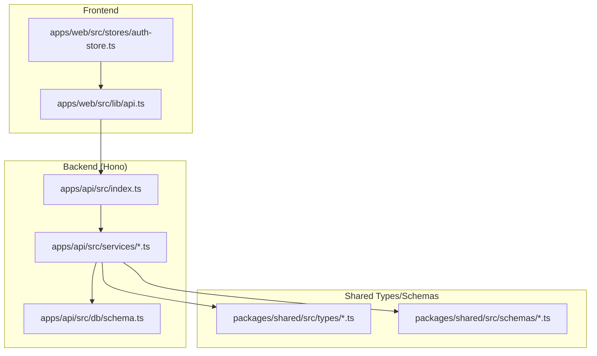
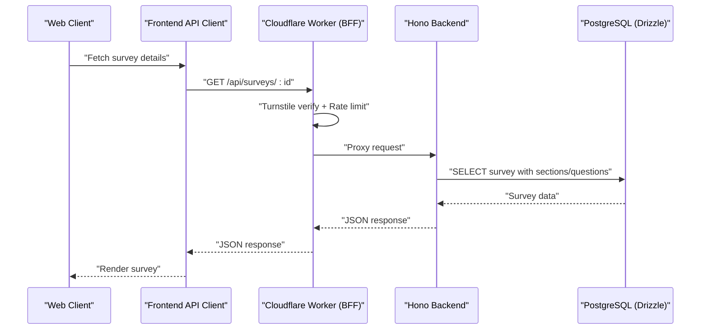
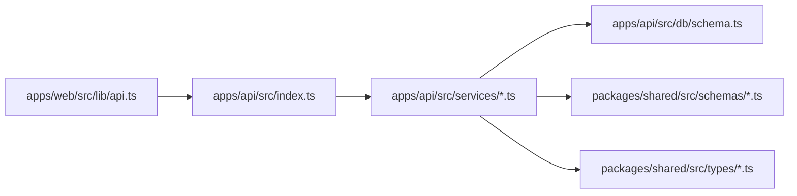

# API Endpoints and Routes

<cite>
**Referenced Files in This Document**
- [index.ts](file://apps/api/src/index.ts)
- [schema.ts](file://apps/api/src/db/schema.ts)
- [survey.schema.ts](file://packages/shared/src/schemas/survey.schema.ts)
- [question.schema.ts](file://packages/shared/src/schemas/question.schema.ts)
- [response.schema.ts](file://packages/shared/src/schemas/response.schema.ts)
- [survey.ts](file://packages/shared/src/types/survey.ts)
- [user.ts](file://packages/shared/src/types/user.ts)
- [api.ts](file://apps/web/src/lib/api.ts)
- [auth-store.ts](file://apps/web/src/stores/auth-store.ts)
- [survey.service.ts](file://apps/api/src/services/survey.service.ts)
- [response.service.ts](file://apps/api/src/services/response.service.ts)
- [auth.service.ts](file://apps/api/src/services/auth.service.ts)
- [plan.md](file://plan.md)
</cite>

## Table of Contents
1. [Introduction](#introduction)
2. [Project Structure](#project-structure)
3. [Core Components](#core-components)
4. [Architecture Overview](#architecture-overview)
5. [Detailed Component Analysis](#detailed-component-analysis)
6. [Dependency Analysis](#dependency-analysis)
7. [Performance Considerations](#performance-considerations)
8. [Troubleshooting Guide](#troubleshooting-guide)
9. [Conclusion](#conclusion)
10. [Appendices](#appendices)

## Introduction
This document specifies the planned RESTful API endpoints for the backend service. It covers authentication via Google OAuth, survey management (CRUD and ordering), admin management, and user management. For each endpoint, it documents HTTP methods, URL patterns, request/response schemas, authentication and authorization requirements, parameters, validation rules, error responses, and practical usage examples. It also outlines rate limiting, pagination, filtering, and sorting capabilities as defined in the project plan.

## Project Structure
The API is implemented with Hono.js and organized into services backed by Drizzle ORM and a PostgreSQL schema. Shared validation schemas and types define request/response contracts across the stack. The frontend integrates with the API using a typed fetch wrapper and a Zustand auth store.

**Diagram sources**
- [index.ts:1-67](file://apps/api/src/index.ts#L1-L67)
- [api.ts:1-60](file://apps/web/src/lib/api.ts#L1-L60)
- [auth-store.ts:1-31](file://apps/web/src/stores/auth-store.ts#L1-L31)
- [schema.ts:1-247](file://apps/api/src/db/schema.ts#L1-L247)
- [survey.service.ts:1-328](file://apps/api/src/services/survey.service.ts#L1-L328)
- [response.service.ts:1-218](file://apps/api/src/services/response.service.ts#L1-L218)
- [auth.service.ts:1-105](file://apps/api/src/services/auth.service.ts#L1-L105)
- [survey.schema.ts:1-22](file://packages/shared/src/schemas/survey.schema.ts#L1-L22)
- [question.schema.ts:1-65](file://packages/shared/src/schemas/question.schema.ts#L1-L65)
- [response.schema.ts:1-24](file://packages/shared/src/schemas/response.schema.ts#L1-L24)
- [survey.ts:1-50](file://packages/shared/src/types/survey.ts#L1-L50)
- [user.ts:1-22](file://packages/shared/src/types/user.ts#L1-L22)

**Section sources**
- [index.ts:1-67](file://apps/api/src/index.ts#L1-L67)
- [plan.md:527-664](file://plan.md#L527-L664)

## Core Components
- Authentication service: Handles Google OAuth user lookup/creation, admin flag assignment, and user retrieval.
- Survey service: Implements survey lifecycle operations (list, create, update, delete, status), section and question management, and reordering.
- Response service: Manages response submission, duplicate prevention, response listing, statistics, and CSV export.
- Shared schemas/types: Define validation rules and TypeScript contracts for requests and responses.

Key validations and constraints:
- Request body size limit enforced at the edge/proxy layer.
- Unique response constraint per survey-user pair enforced at the database level.
- Zod schemas validate inputs for survey creation/update, question creation/update, and response submission.

**Section sources**
- [auth.service.ts:1-105](file://apps/api/src/services/auth.service.ts#L1-L105)
- [survey.service.ts:1-328](file://apps/api/src/services/survey.service.ts#L1-L328)
- [response.service.ts:1-218](file://apps/api/src/services/response.service.ts#L1-L218)
- [survey.schema.ts:1-22](file://packages/shared/src/schemas/survey.schema.ts#L1-L22)
- [question.schema.ts:1-65](file://packages/shared/src/schemas/question.schema.ts#L1-L65)
- [response.schema.ts:1-24](file://packages/shared/src/schemas/response.schema.ts#L1-L24)
- [schema.ts:346-356](file://apps/api/src/db/schema.ts#L346-L356)

## Architecture Overview
The API follows a layered architecture:
- Entry point registers middleware and routes.
- Services encapsulate business logic and interact with the database via Drizzle ORM.
- Shared packages provide type-safe contracts for validation and data modeling.
- Frontend consumes the API through a typed fetch client and maintains session state.

**Diagram sources**
- [index.ts:1-67](file://apps/api/src/index.ts#L1-L67)
- [api.ts:1-60](file://apps/web/src/lib/api.ts#L1-L60)
- [plan.md:428-458](file://plan.md#L428-L458)

**Section sources**
- [index.ts:1-67](file://apps/api/src/index.ts#L1-L67)
- [plan.md:428-458](file://plan.md#L428-L458)

## Detailed Component Analysis

### Authentication Endpoints (Google OAuth)
- Purpose: Initiate Google OAuth, handle callback, manage session, and retrieve current user info.
- Authorization: Not required for initiating OAuth; session required for protected endpoints.
- Security: Admin auto-assignment based on environment variable; CSRF protection via better-auth.

Endpoints:
- GET /api/auth/google
  - Description: Redirects to Google OAuth provider.
  - Authentication: None.
  - Response: Redirect to provider.
  - Notes: Implemented in dedicated auth routes module.

- GET /api/auth/google/callback
  - Description: OAuth callback endpoint; creates/updates user and sets session.
  - Authentication: None.
  - Response: Redirect to frontend with session established.
  - Notes: Implemented in dedicated auth routes module.

- POST /api/auth/logout
  - Description: Clears session.
  - Authentication: None.
  - Response: Success message.
  - Notes: Implemented in dedicated auth routes module.

- GET /api/auth/me
  - Description: Returns current user profile.
  - Authentication: Required (session).
  - Response: User object with id, email, name, role, isAdmin.
  - Notes: Implemented in dedicated auth routes module.

- GET /api/auth/session
  - Description: Returns current session info.
  - Authentication: Required (session).
  - Response: Session object.
  - Notes: Implemented in dedicated auth routes module.

Validation and schemas:
- User type and role enums are defined in shared types.
- Admin flag assignment occurs during OAuth flow based on ADMIN_EMAIL.

Common request/response scenarios:
- Successful login: Redirect to dashboard with session cookie.
- Admin user: isAdmin and role set upon first login matching ADMIN_EMAIL.

**Section sources**
- [plan.md:462-469](file://plan.md#L462-L469)
- [auth.service.ts:1-105](file://apps/api/src/services/auth.service.ts#L1-L105)
- [user.ts:1-22](file://packages/shared/src/types/user.ts#L1-L22)

### Public Survey Endpoints
- Purpose: Retrieve published surveys, survey details with sections/questions/options, check user’s prior response, and submit responses.

Endpoints:
- GET /api/surveys
  - Description: List published surveys.
  - Authentication: None.
  - Query parameters: None planned in current routes; pagination via service defaults.
  - Response: Array of survey summaries (id, title, description, timestamps).
  - Notes: Implemented in survey service.

- GET /api/surveys/:id
  - Description: Get survey with sections, questions, and options; includes response count.
  - Authentication: None.
  - Path parameters: id (UUID).
  - Response: Survey with nested sections and questions; includes responseCount.
  - Notes: Implemented in survey service.

- GET /api/surveys/:id/my-response
  - Description: Check if the current user has already responded to the survey.
  - Authentication: Required (session).
  - Path parameters: id (UUID).
  - Response: Presence indicator (exists or not).
  - Notes: Implemented in response service.

- POST /api/surveys/:id/responses
  - Description: Submit a response for a survey.
  - Authentication: Required (session).
  - Path parameters: id (UUID).
  - Request body: submitResponseSchema (turnstileToken, answers[], optional honeypot/formOpenedAt).
  - Validation rules:
    - answers array length: min 1, max 200.
    - Each answer: questionId (UUID), one of optionId/textValue/numberValue/rankValue, optional isOtherText.
    - turnstileToken required.
  - Response: Submitted response metadata.
  - Error responses:
    - 400: Validation errors from Zod.
    - 409: Already responded (duplicate).
    - 413: Request entity too large.
    - 500: Internal server error.
  - Notes: Implemented in response service; middleware enforces request size and timeouts.

Practical examples:
- Submitting a response with multiple-choice and text answers.
- Checking eligibility before rendering the form.

**Section sources**
- [plan.md:471-477](file://plan.md#L471-L477)
- [survey.service.ts:1-328](file://apps/api/src/services/survey.service.ts#L1-L328)
- [response.service.ts:1-218](file://apps/api/src/services/response.service.ts#L1-L218)
- [response.schema.ts:1-24](file://packages/shared/src/schemas/response.schema.ts#L1-L24)
- [index.ts:25-37](file://apps/api/src/index.ts#L25-L37)

### Admin Survey Management Endpoints
- Purpose: Manage surveys, sections, questions, and options; view responses and statistics; export data.

Endpoints:
- GET /api/admin/surveys
  - Description: List all surveys (draft included).
  - Authentication: Required (admin/editor/viewer with appropriate permissions).
  - Query parameters: status (draft/published/closed) via service filter.
  - Response: Array of surveys with minimal details.
  - Notes: Implemented in survey service.

- POST /api/admin/surveys
  - Description: Create a new survey.
  - Authentication: Required (admin/editor with create permission).
  - Request body: createSurveySchema (title, description optional, closesAt optional).
  - Response: Created survey.
  - Notes: Implemented in survey service.

- PATCH /api/admin/surveys/:id
  - Description: Update survey metadata.
  - Authentication: Required (admin/editor with edit permission).
  - Path parameters: id (UUID).
  - Request body: updateSurveySchema (partial fields).
  - Response: Updated survey.
  - Notes: Implemented in survey service.

- DELETE /api/admin/surveys/:id
  - Description: Delete a survey.
  - Authentication: Required (admin/editor with delete permission).
  - Path parameters: id (UUID).
  - Response: Deletion confirmation.
  - Notes: Implemented in survey service.

- PATCH /api/admin/surveys/:id/status
  - Description: Update survey status (draft/published/closed); sets publishedAt on publish.
  - Authentication: Required (admin/editor with publish permission).
  - Path parameters: id (UUID).
  - Request body: updateSurveyStatusSchema.
  - Response: Updated survey.
  - Notes: Implemented in survey service.

- GET /api/admin/surveys/:id/sections
  - Description: List sections for a survey.
  - Authentication: Required (admin/editor/viewer).
  - Path parameters: id (UUID).
  - Response: Array of sections.
  - Notes: Implemented in survey service.

- POST /api/admin/surveys/:id/sections
  - Description: Add a new section.
  - Authentication: Required (admin/editor with edit permission).
  - Path parameters: id (UUID).
  - Request body: section creation payload (title, description optional).
  - Response: Created section.
  - Notes: Implemented in survey service.

- PATCH /api/admin/sections/:id
  - Description: Update a section.
  - Authentication: Required (admin/editor with edit permission).
  - Path parameters: id (UUID).
  - Request body: partial section fields.
  - Response: Updated section.
  - Notes: Implemented in survey service.

- DELETE /api/admin/sections/:id
  - Description: Delete a section.
  - Authentication: Required (admin/editor with edit permission).
  - Path parameters: id (UUID).
  - Response: Deletion confirmation.
  - Notes: Implemented in survey service.

- PUT /api/admin/surveys/:id/sections/reorder
  - Description: Reorder sections transactionally.
  - Authentication: Required (admin/editor with edit permission).
  - Path parameters: id (UUID).
  - Request body: items array with id and orderIndex.
  - Response: Success confirmation.
  - Notes: Implemented in survey service.

- GET /api/admin/sections/:id/questions
  - Description: List questions for a section.
  - Authentication: Required (admin/editor/viewer).
  - Path parameters: id (UUID).
  - Response: Array of questions.
  - Notes: Implemented in survey service.

- POST /api/admin/sections/:id/questions
  - Description: Add a new question.
  - Authentication: Required (admin/editor with edit permission).
  - Path parameters: id (UUID).
  - Request body: createQuestionSchema (questionType, title, description optional, isRequired default true, scale options optional, options optional).
  - Response: Created question.
  - Notes: Implemented in survey service.

- PATCH /api/admin/questions/:id
  - Description: Update a question.
  - Authentication: Required (admin/editor with edit permission).
  - Path parameters: id (UUID).
  - Request body: updateQuestionSchema (partial fields including optional orderIndex).
  - Response: Updated question.
  - Notes: Implemented in survey service.

- DELETE /api/admin/questions/:id
  - Description: Delete a question.
  - Authentication: Required (admin/editor with edit permission).
  - Path parameters: id (UUID).
  - Response: Deletion confirmation.
  - Notes: Implemented in survey service.

- PUT /api/admin/sections/:id/questions/reorder
  - Description: Reorder questions transactionally.
  - Authentication: Required (admin/editor with edit permission).
  - Path parameters: id (UUID).
  - Request body: items array with id and orderIndex.
  - Response: Success confirmation.
  - Notes: Implemented in survey service.

- POST /api/admin/questions/:id/options
  - Description: Add an option to a question.
  - Authentication: Required (admin/editor with edit permission).
  - Path parameters: id (UUID).
  - Request body: createOptionSchema (label, isOther optional).
  - Response: Created option.
  - Notes: Implemented in survey service.

- PATCH /api/admin/options/:id
  - Description: Update an option.
  - Authentication: Required (admin/editor with edit permission).
  - Path parameters: id (UUID).
  - Request body: updateOptionSchema (partial fields).
  - Response: Updated option.
  - Notes: Implemented in survey service.

- DELETE /api/admin/options/:id
  - Description: Delete an option.
  - Authentication: Required (admin/editor with edit permission).
  - Path parameters: id (UUID).
  - Response: Deletion confirmation.
  - Notes: Implemented in survey service.

- GET /api/admin/surveys/:id/responses
  - Description: List responses for a survey with pagination.
  - Authentication: Required (admin/editor/viewer with view permission).
  - Path parameters: id (UUID).
  - Query parameters: limit, offset (service defaults apply).
  - Response: Array of responses with user and answers.
  - Notes: Implemented in response service.

- GET /api/admin/surveys/:id/stats
  - Description: Get survey statistics (counts, averages, option counts).
  - Authentication: Required (admin/editor/viewer with view permission).
  - Path parameters: id (UUID).
  - Response: Stats object with totals and per-question breakdown.
  - Notes: Implemented in response service.

- GET /api/admin/surveys/:id/export/csv
  - Description: Export responses as CSV data.
  - Authentication: Required (admin/editor with export permission).
  - Path parameters: id (UUID).
  - Response: CSV payload.
  - Notes: Implemented in response service.

Validation and schemas:
- Survey: createSurveySchema, updateSurveySchema, updateSurveyStatusSchema.
- Question: createQuestionSchema, updateQuestionSchema, reorderSchema, createOptionSchema, updateOptionSchema.
- Response: submitResponseSchema, submitAnswerSchema.

Authorization model:
- Role-based access control (RBAC) applies across endpoints; granular permissions per survey via assignments.

**Section sources**
- [plan.md:479-514](file://plan.md#L479-L514)
- [survey.service.ts:1-328](file://apps/api/src/services/survey.service.ts#L1-L328)
- [response.service.ts:1-218](file://apps/api/src/services/response.service.ts#L1-L218)
- [survey.schema.ts:1-22](file://packages/shared/src/schemas/survey.schema.ts#L1-L22)
- [question.schema.ts:1-65](file://packages/shared/src/schemas/question.schema.ts#L1-L65)
- [response.schema.ts:1-24](file://packages/shared/src/schemas/response.schema.ts#L1-L24)

### Admin User Management Endpoints
- Purpose: Manage users and roles, assign survey-specific permissions.

Endpoints:
- GET /api/admin/users
  - Description: List users with pagination.
  - Authentication: Required (admin).
  - Query parameters: limit, offset (service defaults apply).
  - Response: Array of users with profile and role info.
  - Notes: Implemented in auth service.

- PATCH /api/admin/users/:id/role
  - Description: Change a user’s role.
  - Authentication: Required (admin).
  - Path parameters: id (UUID).
  - Request body: role change payload.
  - Response: Updated user.
  - Notes: Implemented in auth service.

- POST /api/admin/surveys/:id/assignments
  - Description: Assign a user to a survey with role and permissions.
  - Authentication: Required (admin/editor with assign permission).
  - Path parameters: id (UUID).
  - Request body: assignment payload (userId, role, canEdit/canView/canExport).
  - Response: Created assignment.
  - Notes: Implemented in survey service.

- PATCH /api/admin/assignments/:id
  - Description: Update an existing assignment.
  - Authentication: Required (admin/editor with assign permission).
  - Path parameters: id (UUID).
  - Request body: partial assignment fields.
  - Response: Updated assignment.
  - Notes: Implemented in survey service.

- DELETE /api/admin/assignments/:id
  - Description: Remove a user’s assignment to a survey.
  - Authentication: Required (admin/editor with assign permission).
  - Path parameters: id (UUID).
  - Response: Deletion confirmation.
  - Notes: Implemented in survey service.

Authorization:
- Admin-only endpoints require admin role; assignment endpoints require editor or admin with proper permissions.

**Section sources**
- [plan.md:507-513](file://plan.md#L507-L513)
- [auth.service.ts:1-105](file://apps/api/src/services/auth.service.ts#L1-L105)
- [survey.ts:35-49](file://packages/shared/src/types/survey.ts#L35-L49)

### Additional Backend Utilities
- Health check: GET /api/health
  - Description: Basic health probe for load balancers and monitoring.
  - Authentication: None.
  - Response: Status object with timestamp.
  - Notes: Registered in entry point.

- Global error handling and 404 handling:
  - Centralized error handler returns generic server error.
  - 404 handler returns endpoint not found.

**Section sources**
- [index.ts:39-58](file://apps/api/src/index.ts#L39-L58)

## Dependency Analysis
The API depends on:
- Drizzle ORM for database operations and schema definitions.
- Shared validation schemas and types for request/response contracts.
- Frontend typed API client and auth store for integration.

**Diagram sources**
- [api.ts:1-60](file://apps/web/src/lib/api.ts#L1-L60)
- [index.ts:1-67](file://apps/api/src/index.ts#L1-L67)
- [schema.ts:1-247](file://apps/api/src/db/schema.ts#L1-L247)
- [survey.service.ts:1-328](file://apps/api/src/services/survey.service.ts#L1-L328)
- [response.service.ts:1-218](file://apps/api/src/services/response.service.ts#L1-L218)
- [auth.service.ts:1-105](file://apps/api/src/services/auth.service.ts#L1-L105)
- [survey.schema.ts:1-22](file://packages/shared/src/schemas/survey.schema.ts#L1-L22)
- [question.schema.ts:1-65](file://packages/shared/src/schemas/question.schema.ts#L1-L65)
- [response.schema.ts:1-24](file://packages/shared/src/schemas/response.schema.ts#L1-L24)
- [survey.ts:1-50](file://packages/shared/src/types/survey.ts#L1-L50)
- [user.ts:1-22](file://packages/shared/src/types/user.ts#L1-L22)

**Section sources**
- [index.ts:1-67](file://apps/api/src/index.ts#L1-L67)
- [schema.ts:1-247](file://apps/api/src/db/schema.ts#L1-L247)

## Performance Considerations
- Pagination defaults: Services use default page sizes (e.g., 50) for listing endpoints; clients should pass explicit limit/offset for large datasets.
- Sorting: Many endpoints sort by creation or publication timestamps in descending order to show latest items first.
- Indexes: Database schema includes indexes on frequently queried columns (e.g., assignments, sections, questions, responses).
- Rate limiting and request size limits: Enforced at the edge/proxy layer to protect backend resources.

[No sources needed since this section provides general guidance]

## Troubleshooting Guide
Common issues and resolutions:
- Authentication failures:
  - Ensure Authorization header is present for protected endpoints.
  - Verify session validity and that the user exists in the database.
- Validation errors:
  - Review request bodies against shared Zod schemas.
  - Pay attention to field lengths, types, and required fields.
- Duplicate submissions:
  - The database enforces a unique constraint on survey-user pairs; expect conflict errors if resubmitting.
- Request too large:
  - Edge/proxy enforces a 100 KB request body limit; reduce payload size or split requests.
- Timeouts:
  - Requests are subject to a 10-second timeout; simplify queries or paginate results.

**Section sources**
- [index.ts:25-37](file://apps/api/src/index.ts#L25-L37)
- [response.service.ts:24-63](file://apps/api/src/services/response.service.ts#L24-L63)
- [schema.ts:346-356](file://apps/api/src/db/schema.ts#L346-L356)

## Conclusion
The API defines a comprehensive, type-safe, and secure REST interface for authentication, survey management, admin operations, and user management. It leverages shared validation schemas and types to maintain consistency across the stack, incorporates robust security measures, and provides clear patterns for pagination, filtering, and sorting. The documented endpoints and contracts enable reliable client integration and predictable behavior.

[No sources needed since this section summarizes without analyzing specific files]

## Appendices

### Endpoint Routing Summary
- Authentication: /api/auth/*
- Public Surveys: /api/surveys/*
- Admin Surveys: /api/admin/surveys/*
- Admin Sections: /api/admin/sections/*
- Admin Questions: /api/admin/questions/*
- Admin Options: /api/admin/options/*
- Admin Users: /api/admin/users/*
- Admin Activity: /api/admin/activity-log

**Section sources**
- [plan.md:462-514](file://plan.md#L462-L514)

### Request/Response Schemas Overview
- Survey creation/update and status updates use shared schemas.
- Question creation/update and option management use shared schemas.
- Response submission uses shared schemas with Turnstile verification and duplicate checks.

**Section sources**
- [survey.schema.ts:1-22](file://packages/shared/src/schemas/survey.schema.ts#L1-L22)
- [question.schema.ts:1-65](file://packages/shared/src/schemas/question.schema.ts#L1-L65)
- [response.schema.ts:1-24](file://packages/shared/src/schemas/response.schema.ts#L1-L24)

### Frontend Integration Patterns
- Typed fetch client handles Authorization headers and error extraction.
- Auth store manages user session state and loading indicators.
- Example usage: Initialize API client with token, call endpoints, and handle errors gracefully.

**Section sources**
- [api.ts:1-60](file://apps/web/src/lib/api.ts#L1-L60)
- [auth-store.ts:1-31](file://apps/web/src/stores/auth-store.ts#L1-L31)