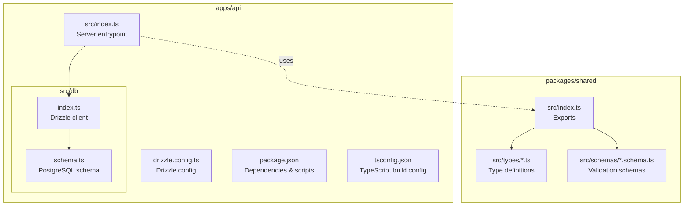
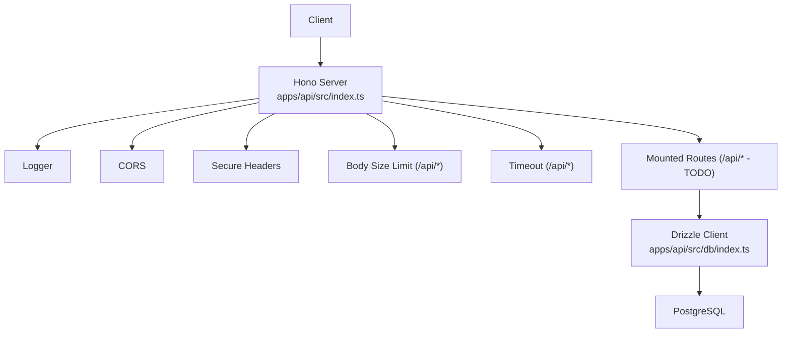
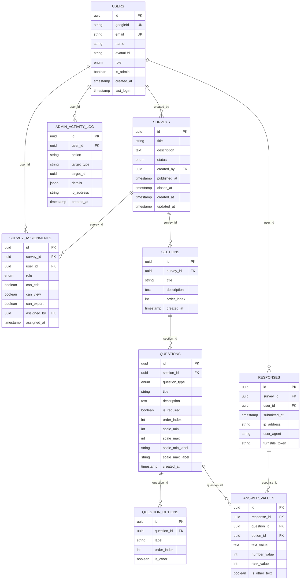
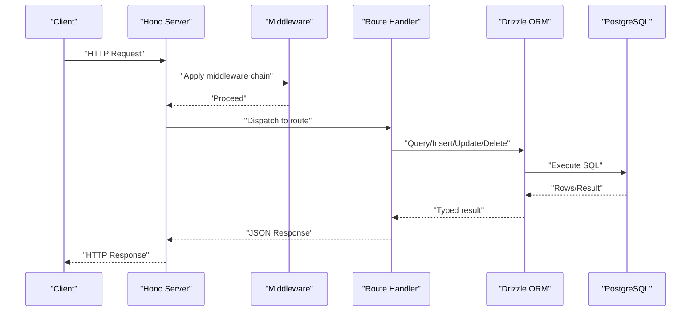
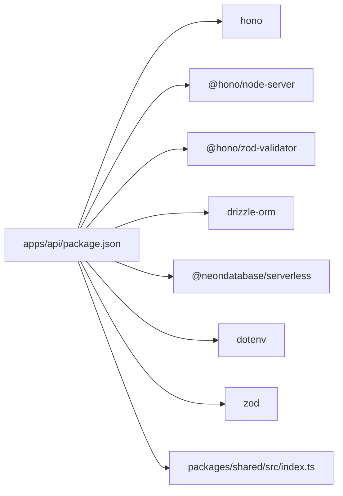

# Backend API Server (Hono)

<cite>
**Referenced Files in This Document**
- [apps/api/src/index.ts](file://apps/api/src/index.ts)
- [apps/api/src/db/index.ts](file://apps/api/src/db/index.ts)
- [apps/api/src/db/schema.ts](file://apps/api/src/db/schema.ts)
- [apps/api/package.json](file://apps/api/package.json)
- [apps/api/drizzle.config.ts](file://apps/api/drizzle.config.ts)
- [apps/api/tsconfig.json](file://apps/api/tsconfig.json)
- [packages/shared/src/index.ts](file://packages/shared/src/index.ts)
- [packages/shared/src/types/user.ts](file://packages/shared/src/types/user.ts)
- [packages/shared/src/types/survey.ts](file://packages/shared/src/types/survey.ts)
- [packages/shared/src/types/question.ts](file://packages/shared/src/types/question.ts)
- [packages/shared/src/types/response.ts](file://packages/shared/src/types/response.ts)
- [packages/shared/src/schemas/survey.schema.ts](file://packages/shared/src/schemas/survey.schema.ts)
- [packages/shared/src/schemas/question.schema.ts](file://packages/shared/src/schemas/question.schema.ts)
- [packages/shared/src/schemas/response.schema.ts](file://packages/shared/src/schemas/response.schema.ts)
- [packages/shared/src/schemas/assignment.schema.ts](file://packages/shared/src/schemas/assignment.schema.ts)
</cite>

## Table of Contents
1. [Introduction](#introduction)
2. [Project Structure](#project-structure)
3. [Core Components](#core-components)
4. [Architecture Overview](#architecture-overview)
5. [Detailed Component Analysis](#detailed-component-analysis)
6. [Dependency Analysis](#dependency-analysis)
7. [Performance Considerations](#performance-considerations)
8. [Troubleshooting Guide](#troubleshooting-guide)
9. [Conclusion](#conclusion)
10. [Appendices](#appendices)

## Introduction
This document describes the backend API server built with Hono.js. It covers server configuration, middleware stack, route organization, and handler patterns. It documents database integration via Drizzle ORM with the complete schema and relationships, and outlines RESTful API design, request/response handling, and error management. Security, performance, and scalability considerations are included, along with practical examples of route handlers, middleware usage, and database operations. The API endpoint structure and the end-to-end data flow from request to response are explained.

## Project Structure
The API server is organized as a standalone Hono application with a dedicated database module and a shared package containing typed models and validation schemas used by both frontend and backend.

**Diagram sources**
- [apps/api/src/index.ts:1-67](file://apps/api/src/index.ts#L1-L67)
- [apps/api/src/db/index.ts:1-9](file://apps/api/src/db/index.ts#L1-L9)
- [apps/api/src/db/schema.ts:1-247](file://apps/api/src/db/schema.ts#L1-L247)
- [apps/api/drizzle.config.ts:1-11](file://apps/api/drizzle.config.ts#L1-L11)
- [apps/api/package.json:1-34](file://apps/api/package.json#L1-L34)
- [apps/api/tsconfig.json:1-11](file://apps/api/tsconfig.json#L1-L11)
- [packages/shared/src/index.ts:1-10](file://packages/shared/src/index.ts#L1-L10)

**Section sources**
- [apps/api/src/index.ts:1-67](file://apps/api/src/index.ts#L1-L67)
- [apps/api/src/db/index.ts:1-9](file://apps/api/src/db/index.ts#L1-L9)
- [apps/api/src/db/schema.ts:1-247](file://apps/api/src/db/schema.ts#L1-L247)
- [apps/api/package.json:1-34](file://apps/api/package.json#L1-L34)
- [apps/api/drizzle.config.ts:1-11](file://apps/api/drizzle.config.ts#L1-L11)
- [apps/api/tsconfig.json:1-11](file://apps/api/tsconfig.json#L1-L11)
- [packages/shared/src/index.ts:1-10](file://packages/shared/src/index.ts#L1-L10)

## Core Components
- Hono server initialization and middleware stack
- Health check endpoint
- Global error and 404 handling
- Drizzle ORM client and PostgreSQL schema
- Shared types and Zod validation schemas

Key implementation references:
- Server and middleware: [apps/api/src/index.ts:9-58](file://apps/api/src/index.ts#L9-L58)
- Drizzle client: [apps/api/src/db/index.ts:1-9](file://apps/api/src/db/index.ts#L1-L9)
- Schema definitions: [apps/api/src/db/schema.ts:1-247](file://apps/api/src/db/schema.ts#L1-L247)
- Shared exports: [packages/shared/src/index.ts:1-10](file://packages/shared/src/index.ts#L1-L10)

**Section sources**
- [apps/api/src/index.ts:9-58](file://apps/api/src/index.ts#L9-L58)
- [apps/api/src/db/index.ts:1-9](file://apps/api/src/db/index.ts#L1-L9)
- [apps/api/src/db/schema.ts:1-247](file://apps/api/src/db/schema.ts#L1-L247)
- [packages/shared/src/index.ts:1-10](file://packages/shared/src/index.ts#L1-L10)

## Architecture Overview
The API server uses Hono’s lightweight middleware pipeline to enforce logging, CORS, security headers, request size limits, timeouts, and centralized error handling. Routes are mounted under /api and will integrate authentication, surveys, and admin modules. Drizzle ORM connects to a PostgreSQL database configured via environment variables.

**Diagram sources**
- [apps/api/src/index.ts:9-58](file://apps/api/src/index.ts#L9-L58)
- [apps/api/src/db/index.ts:1-9](file://apps/api/src/db/index.ts#L1-L9)

**Section sources**
- [apps/api/src/index.ts:9-58](file://apps/api/src/index.ts#L9-L58)
- [apps/api/src/db/index.ts:1-9](file://apps/api/src/db/index.ts#L1-L9)

## Detailed Component Analysis

### Hono Server Configuration and Middleware Stack
- Logger middleware logs all requests.
- CORS middleware allows cross-origin requests from the configured frontend URL, supports credentials, and selected methods/headers.
- Secure headers middleware applies recommended security headers.
- Body size limit middleware rejects requests exceeding 100 KB.
- Timeout middleware enforces a 10-second request timeout for /api/* routes.
- Health check endpoint returns server status.
- Global error handler returns a generic 500 error and logs unhandled errors.
- 404 handler returns a not-found message.

Practical usage examples:
- Mounting routes under /api (placeholder): [apps/api/src/index.ts:44-47](file://apps/api/src/index.ts#L44-L47)
- Health check: [apps/api/src/index.ts:39-42](file://apps/api/src/index.ts#L39-L42)
- Error handling: [apps/api/src/index.ts:49-58](file://apps/api/src/index.ts#L49-L58)

Security and performance notes:
- CORS origin is configurable via environment variable.
- Body size and timeout prevent resource exhaustion.
- Centralized error handling ensures consistent responses.

**Section sources**
- [apps/api/src/index.ts:9-58](file://apps/api/src/index.ts#L9-L58)

### Route Organization and Handler Patterns
- Routes are mounted under /api and are currently placeholders.
- Typical handler pattern:
  - Define route under /api/*.
  - Use Zod validator middleware for request bodies.
  - Access Drizzle client for database operations.
  - Return structured JSON responses with appropriate HTTP status codes.
  - Use global error handler for uncaught exceptions.

Example patterns (conceptual):
- Authentication routes: mount under /api/auth.
- Surveys CRUD: mount under /api/surveys.
- Admin routes: mount under /api/admin.

Note: Current placeholder mounting is documented at: [apps/api/src/index.ts:44-47](file://apps/api/src/index.ts#L44-L47)

**Section sources**
- [apps/api/src/index.ts:44-47](file://apps/api/src/index.ts#L44-L47)

### Middleware Stack Details
- Logger: [apps/api/src/index.ts](file://apps/api/src/index.ts#L12)
- CORS: [apps/api/src/index.ts:13-22](file://apps/api/src/index.ts#L13-L22)
- Secure headers: [apps/api/src/index.ts](file://apps/api/src/index.ts#L23)
- Body size limit: [apps/api/src/index.ts:25-32](file://apps/api/src/index.ts#L25-L32)
- Timeout: [apps/api/src/index.ts:34-37](file://apps/api/src/index.ts#L34-L37)

Validation middleware:
- Zod validator is available via @hono/zod-validator and can be applied to routes for schema validation.

**Section sources**
- [apps/api/src/index.ts:12-37](file://apps/api/src/index.ts#L12-L37)
- [apps/api/package.json:24-24](file://apps/api/package.json#L24-L24)

### Database Integration with Drizzle ORM
- Drizzle client connects to Neon PostgreSQL using DATABASE_URL environment variable.
- Schema defines enums and tables for Users, Surveys, Assignments, Sections, Questions, Question Options, Responses, Answer Values, and Admin Activity Log.
- Indexes are defined for performance on foreign keys and frequently queried columns.

Key references:
- Drizzle client: [apps/api/src/db/index.ts:1-9](file://apps/api/src/db/index.ts#L1-L9)
- Schema definitions: [apps/api/src/db/schema.ts:1-247](file://apps/api/src/db/schema.ts#L1-L247)
- Drizzle config: [apps/api/drizzle.config.ts:1-11](file://apps/api/drizzle.config.ts#L1-L11)

**Diagram sources**
- [apps/api/src/db/schema.ts:1-247](file://apps/api/src/db/schema.ts#L1-L247)

**Section sources**
- [apps/api/src/db/index.ts:1-9](file://apps/api/src/db/index.ts#L1-L9)
- [apps/api/src/db/schema.ts:1-247](file://apps/api/src/db/schema.ts#L1-L247)
- [apps/api/drizzle.config.ts:1-11](file://apps/api/drizzle.config.ts#L1-L11)

### RESTful API Design Patterns, Request/Response Handling, and Error Management
- RESTful endpoints under /api/* with standard HTTP verbs and status codes.
- Validation using Zod schemas from the shared package.
- Structured JSON responses; centralized error handling returns 500 for unhandled errors and 404 for missing endpoints.
- 404 handler ensures consistent not-found responses.

References:
- Health check: [apps/api/src/index.ts:39-42](file://apps/api/src/index.ts#L39-L42)
- Error handling: [apps/api/src/index.ts:49-58](file://apps/api/src/index.ts#L49-L58)
- 404 handling: [apps/api/src/index.ts:55-58](file://apps/api/src/index.ts#L55-L58)
- Validation schemas (shared): [packages/shared/src/schemas/survey.schema.ts:1-22](file://packages/shared/src/schemas/survey.schema.ts#L1-L22), [packages/shared/src/schemas/question.schema.ts:1-65](file://packages/shared/src/schemas/question.schema.ts#L1-L65), [packages/shared/src/schemas/response.schema.ts:1-24](file://packages/shared/src/schemas/response.schema.ts#L1-L24), [packages/shared/src/schemas/assignment.schema.ts:1-20](file://packages/shared/src/schemas/assignment.schema.ts#L1-L20)

**Section sources**
- [apps/api/src/index.ts:39-58](file://apps/api/src/index.ts#L39-L58)
- [packages/shared/src/schemas/survey.schema.ts:1-22](file://packages/shared/src/schemas/survey.schema.ts#L1-L22)
- [packages/shared/src/schemas/question.schema.ts:1-65](file://packages/shared/src/schemas/question.schema.ts#L1-L65)
- [packages/shared/src/schemas/response.schema.ts:1-24](file://packages/shared/src/schemas/response.schema.ts#L1-L24)
- [packages/shared/src/schemas/assignment.schema.ts:1-20](file://packages/shared/src/schemas/assignment.schema.ts#L1-L20)

### Practical Examples

#### Example: Health Check Endpoint
- Endpoint: GET /api/health
- Response: JSON with status and timestamp
- Reference: [apps/api/src/index.ts:39-42](file://apps/api/src/index.ts#L39-L42)

#### Example: Request Validation with Zod
- Use @hono/zod-validator to validate request bodies against shared schemas.
- Example schemas:
  - Create/update survey: [packages/shared/src/schemas/survey.schema.ts:1-22](file://packages/shared/src/schemas/survey.schema.ts#L1-L22)
  - Create/update question: [packages/shared/src/schemas/question.schema.ts:1-65](file://packages/shared/src/schemas/question.schema.ts#L1-L65)
  - Submit response: [packages/shared/src/schemas/response.schema.ts:1-24](file://packages/shared/src/schemas/response.schema.ts#L1-L24)
  - Create/update assignment: [packages/shared/src/schemas/assignment.schema.ts:1-20](file://packages/shared/src/schemas/assignment.schema.ts#L1-L20)

#### Example: Database Operation with Drizzle
- Connect to database: [apps/api/src/db/index.ts:1-9](file://apps/api/src/db/index.ts#L1-L9)
- Use schema tables to query/insert/update/delete records.
- Example tables: [apps/api/src/db/schema.ts:1-247](file://apps/api/src/db/schema.ts#L1-L247)

#### Example: Middleware Usage
- Logger: [apps/api/src/index.ts](file://apps/api/src/index.ts#L12)
- CORS: [apps/api/src/index.ts:13-22](file://apps/api/src/index.ts#L13-L22)
- Secure headers: [apps/api/src/index.ts](file://apps/api/src/index.ts#L23)
- Body size limit: [apps/api/src/index.ts:25-32](file://apps/api/src/index.ts#L25-L32)
- Timeout: [apps/api/src/index.ts:34-37](file://apps/api/src/index.ts#L34-L37)

**Section sources**
- [apps/api/src/index.ts:12-37](file://apps/api/src/index.ts#L12-L37)
- [apps/api/src/db/index.ts:1-9](file://apps/api/src/db/index.ts#L1-L9)
- [apps/api/src/db/schema.ts:1-247](file://apps/api/src/db/schema.ts#L1-L247)
- [packages/shared/src/schemas/survey.schema.ts:1-22](file://packages/shared/src/schemas/survey.schema.ts#L1-L22)
- [packages/shared/src/schemas/question.schema.ts:1-65](file://packages/shared/src/schemas/question.schema.ts#L1-L65)
- [packages/shared/src/schemas/response.schema.ts:1-24](file://packages/shared/src/schemas/response.schema.ts#L1-L24)
- [packages/shared/src/schemas/assignment.schema.ts:1-20](file://packages/shared/src/schemas/assignment.schema.ts#L1-L20)

### Security Considerations
- CORS origin is configurable via environment variable and supports credentials.
- Body size limit prevents large payload attacks.
- Timeout protects against slowloris-style attacks.
- Secure headers middleware applies recommended security headers.
- Validation middleware (Zod) should be used to sanitize and validate all incoming requests.
- Consider adding authentication middleware (e.g., JWT verification) and RBAC checks before exposing sensitive endpoints.

References:
- CORS configuration: [apps/api/src/index.ts:13-22](file://apps/api/src/index.ts#L13-L22)
- Body size limit: [apps/api/src/index.ts:25-32](file://apps/api/src/index.ts#L25-L32)
- Timeout: [apps/api/src/index.ts:34-37](file://apps/api/src/index.ts#L34-L37)
- Secure headers: [apps/api/src/index.ts](file://apps/api/src/index.ts#L23)
- Validation schemas: [packages/shared/src/schemas/survey.schema.ts:1-22](file://packages/shared/src/schemas/survey.schema.ts#L1-L22), [packages/shared/src/schemas/question.schema.ts:1-65](file://packages/shared/src/schemas/question.schema.ts#L1-L65), [packages/shared/src/schemas/response.schema.ts:1-24](file://packages/shared/src/schemas/response.schema.ts#L1-L24), [packages/shared/src/schemas/assignment.schema.ts:1-20](file://packages/shared/src/schemas/assignment.schema.ts#L1-L20)

**Section sources**
- [apps/api/src/index.ts:13-37](file://apps/api/src/index.ts#L13-L37)
- [packages/shared/src/schemas/survey.schema.ts:1-22](file://packages/shared/src/schemas/survey.schema.ts#L1-L22)
- [packages/shared/src/schemas/question.schema.ts:1-65](file://packages/shared/src/schemas/question.schema.ts#L1-L65)
- [packages/shared/src/schemas/response.schema.ts:1-24](file://packages/shared/src/schemas/response.schema.ts#L1-L24)
- [packages/shared/src/schemas/assignment.schema.ts:1-20](file://packages/shared/src/schemas/assignment.schema.ts#L1-L20)

### Performance Optimization and Scalability Patterns
- Use indexes defined in schema for foreign keys and frequent filters.
- Apply pagination for list endpoints.
- Use streaming responses for large datasets when applicable.
- Keep middleware minimal and ordered to reduce latency.
- Consider caching for read-heavy endpoints (e.g., survey metadata).
- Scale horizontally by deploying multiple instances behind a load balancer.

References:
- Indexes in schema: [apps/api/src/db/schema.ts:94-98](file://apps/api/src/db/schema.ts#L94-L98), [apps/api/src/db/schema.ts:117-119](file://apps/api/src/db/schema.ts#L117-L119), [apps/api/src/db/schema.ts:144-146](file://apps/api/src/db/schema.ts#L144-L146), [apps/api/src/db/schema.ts:164-166](file://apps/api/src/db/schema.ts#L164-L166), [apps/api/src/db/schema.ts:188-195](file://apps/api/src/db/schema.ts#L188-L195), [apps/api/src/db/schema.ts:218-221](file://apps/api/src/db/schema.ts#L218-L221), [apps/api/src/db/schema.ts:242-245](file://apps/api/src/db/schema.ts#L242-L245)

**Section sources**
- [apps/api/src/db/schema.ts:94-98](file://apps/api/src/db/schema.ts#L94-L98)
- [apps/api/src/db/schema.ts:117-119](file://apps/api/src/db/schema.ts#L117-L119)
- [apps/api/src/db/schema.ts:144-146](file://apps/api/src/db/schema.ts#L144-L146)
- [apps/api/src/db/schema.ts:164-166](file://apps/api/src/db/schema.ts#L164-L166)
- [apps/api/src/db/schema.ts:188-195](file://apps/api/src/db/schema.ts#L188-L195)
- [apps/api/src/db/schema.ts:218-221](file://apps/api/src/db/schema.ts#L218-L221)
- [apps/api/src/db/schema.ts:242-245](file://apps/api/src/db/schema.ts#L242-L245)

### Complete API Endpoint Structure and Data Flow
- Base path: /api/*
- Health check: GET /api/health
- To be implemented:
  - Authentication: POST /api/auth/register, POST /api/auth/login, POST /api/auth/logout, GET /api/auth/me
  - Surveys: GET/POST /api/surveys, GET/PUT/DELETE /api/surveys/:id
  - Assignments: POST /api/surveys/:id/assignments, GET/PUT /api/assignments/:id
  - Responses: POST /api/responses, GET /api/surveys/:id/responses/stats
- Data flow:
  - Client → Hono server → Middleware → Route handler → Drizzle ORM → PostgreSQL → Response

References:
- Health check: [apps/api/src/index.ts:39-42](file://apps/api/src/index.ts#L39-L42)
- Route mounting (placeholder): [apps/api/src/index.ts:44-47](file://apps/api/src/index.ts#L44-L47)
- Drizzle client: [apps/api/src/db/index.ts:1-9](file://apps/api/src/db/index.ts#L1-L9)
- Schema: [apps/api/src/db/schema.ts:1-247](file://apps/api/src/db/schema.ts#L1-L247)

**Diagram sources**
- [apps/api/src/index.ts:9-58](file://apps/api/src/index.ts#L9-L58)
- [apps/api/src/db/index.ts:1-9](file://apps/api/src/db/index.ts#L1-L9)
- [apps/api/src/db/schema.ts:1-247](file://apps/api/src/db/schema.ts#L1-L247)

**Section sources**
- [apps/api/src/index.ts:39-47](file://apps/api/src/index.ts#L39-L47)
- [apps/api/src/db/index.ts:1-9](file://apps/api/src/db/index.ts#L1-L9)
- [apps/api/src/db/schema.ts:1-247](file://apps/api/src/db/schema.ts#L1-L247)

## Dependency Analysis
- Hono server and middleware dependencies are declared in the API package.
- Drizzle ORM and Neon driver connect to PostgreSQL.
- Shared package provides types and validation schemas consumed by the API.

**Diagram sources**
- [apps/api/package.json:16-26](file://apps/api/package.json#L16-L26)
- [packages/shared/src/index.ts:1-10](file://packages/shared/src/index.ts#L1-L10)

**Section sources**
- [apps/api/package.json:16-26](file://apps/api/package.json#L16-L26)
- [packages/shared/src/index.ts:1-10](file://packages/shared/src/index.ts#L1-L10)

## Performance Considerations
- Use indexes defined in schema to optimize joins and lookups.
- Apply pagination for list endpoints to avoid large payloads.
- Minimize middleware overhead by ordering and limiting middleware usage.
- Use streaming for large responses when feasible.
- Monitor and tune timeouts and body size limits based on workload.

References:
- Indexes: [apps/api/src/db/schema.ts:94-98](file://apps/api/src/db/schema.ts#L94-L98), [apps/api/src/db/schema.ts:117-119](file://apps/api/src/db/schema.ts#L117-L119), [apps/api/src/db/schema.ts:144-146](file://apps/api/src/db/schema.ts#L144-L146), [apps/api/src/db/schema.ts:164-166](file://apps/api/src/db/schema.ts#L164-L166), [apps/api/src/db/schema.ts:188-195](file://apps/api/src/db/schema.ts#L188-L195), [apps/api/src/db/schema.ts:218-221](file://apps/api/src/db/schema.ts#L218-L221), [apps/api/src/db/schema.ts:242-245](file://apps/api/src/db/schema.ts#L242-L245)

**Section sources**
- [apps/api/src/db/schema.ts:94-98](file://apps/api/src/db/schema.ts#L94-L98)
- [apps/api/src/db/schema.ts:117-119](file://apps/api/src/db/schema.ts#L117-L119)
- [apps/api/src/db/schema.ts:144-146](file://apps/api/src/db/schema.ts#L144-L146)
- [apps/api/src/db/schema.ts:164-166](file://apps/api/src/db/schema.ts#L164-L166)
- [apps/api/src/db/schema.ts:188-195](file://apps/api/src/db/schema.ts#L188-L195)
- [apps/api/src/db/schema.ts:218-221](file://apps/api/src/db/schema.ts#L218-L221)
- [apps/api/src/db/schema.ts:242-245](file://apps/api/src/db/schema.ts#L242-L245)

## Troubleshooting Guide
- Health check: Verify GET /api/health returns a JSON object with status and timestamp.
  - Reference: [apps/api/src/index.ts:39-42](file://apps/api/src/index.ts#L39-L42)
- CORS issues: Ensure FRONTEND_URL environment variable matches the client origin and credentials are enabled.
  - Reference: [apps/api/src/index.ts:13-22](file://apps/api/src/index.ts#L13-L22)
- Request too large: Requests exceeding 100 KB will receive a 413 error.
  - Reference: [apps/api/src/index.ts:25-32](file://apps/api/src/index.ts#L25-L32)
- Timeout errors: Requests exceeding 10 seconds will be terminated.
  - Reference: [apps/api/src/index.ts:34-37](file://apps/api/src/index.ts#L34-L37)
- Unhandled errors: All unhandled exceptions return a 500 error with a generic message.
  - Reference: [apps/api/src/index.ts:49-53](file://apps/api/src/index.ts#L49-L53)
- Not found: Non-existent endpoints return a 404 error.
  - Reference: [apps/api/src/index.ts:55-58](file://apps/api/src/index.ts#L55-L58)
- Database connectivity: Ensure DATABASE_URL is set and Drizzle client connects properly.
  - Reference: [apps/api/src/db/index.ts:1-9](file://apps/api/src/db/index.ts#L1-L9)

**Section sources**
- [apps/api/src/index.ts:25-58](file://apps/api/src/index.ts#L25-L58)
- [apps/api/src/db/index.ts:1-9](file://apps/api/src/db/index.ts#L1-L9)

## Conclusion
The Hono-based API server provides a solid foundation with robust middleware, validation-ready schemas, and a well-structured Drizzle ORM schema. By implementing authentication, RBAC, and rate limiting middleware, and by following the outlined patterns for routes and handlers, the API can evolve into a secure, scalable, and maintainable backend service. The shared types and schemas ensure consistency across the stack.

## Appendices

### Appendix A: TypeScript Build Configuration
- Build output and module resolution are configured for ESNext and bundler resolution.
- References:
  - [apps/api/tsconfig.json:1-11](file://apps/api/tsconfig.json#L1-L11)

**Section sources**
- [apps/api/tsconfig.json:1-11](file://apps/api/tsconfig.json#L1-L11)

### Appendix B: Drizzle Configuration
- Drizzle kit configuration pointing to the schema and migrations directory.
- References:
  - [apps/api/drizzle.config.ts:1-11](file://apps/api/drizzle.config.ts#L1-L11)

**Section sources**
- [apps/api/drizzle.config.ts:1-11](file://apps/api/drizzle.config.ts#L1-L11)