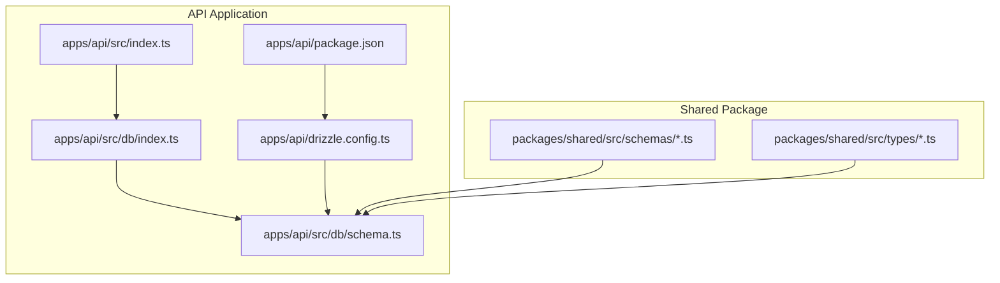
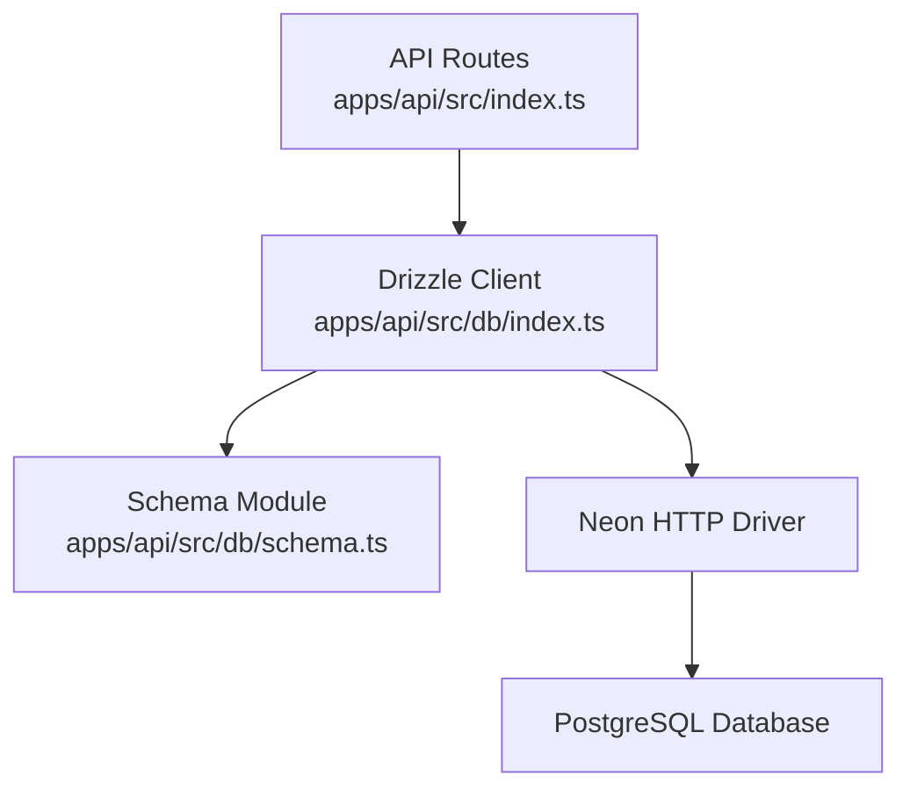
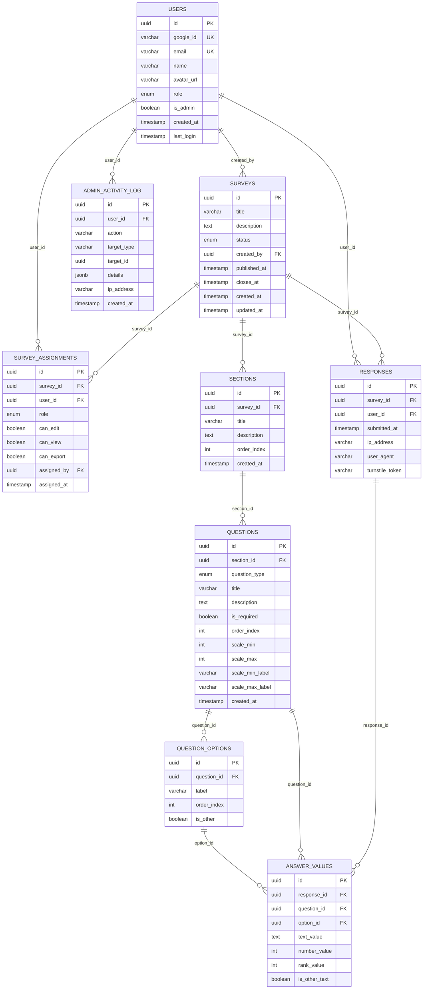
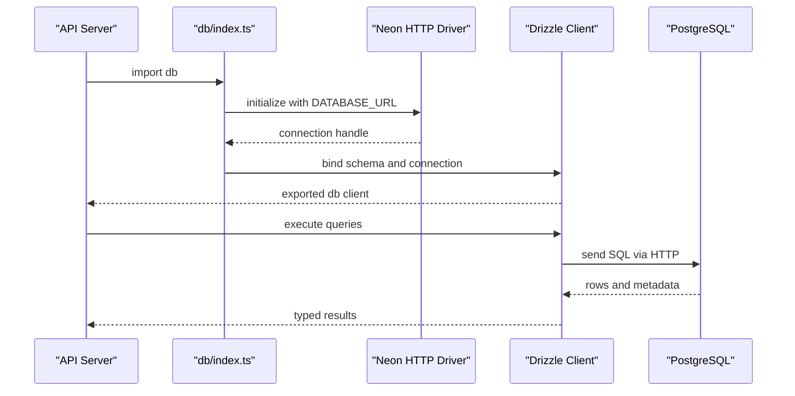
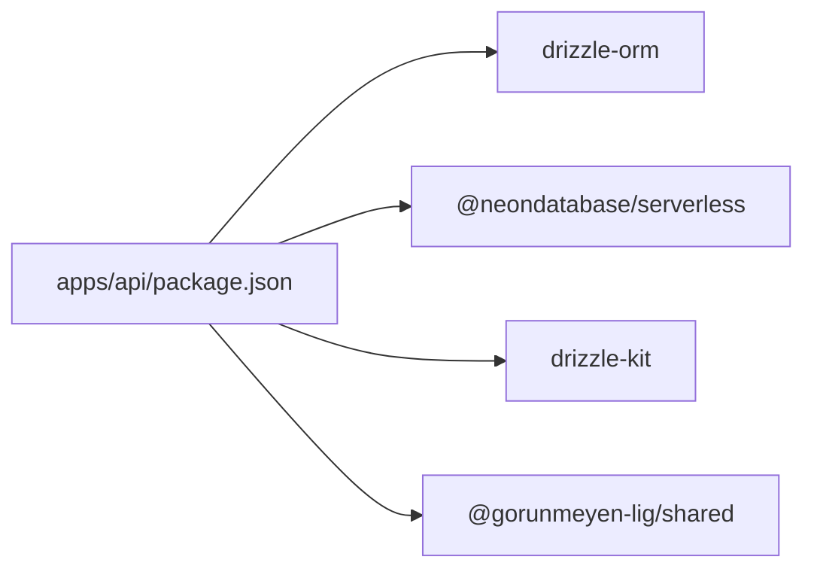

# Database Integration with Drizzle ORM

<cite>
**Referenced Files in This Document**
- [apps/api/src/db/schema.ts](file://apps/api/src/db/schema.ts)
- [apps/api/src/db/index.ts](file://apps/api/src/db/index.ts)
- [apps/api/drizzle.config.ts](file://apps/api/drizzle.config.ts)
- [apps/api/package.json](file://apps/api/package.json)
- [apps/api/src/index.ts](file://apps/api/src/index.ts)
- [packages/shared/src/schemas/assignment.schema.ts](file://packages/shared/src/schemas/assignment.schema.ts)
- [packages/shared/src/schemas/question.schema.ts](file://packages/shared/src/schemas/question.schema.ts)
- [packages/shared/src/schemas/response.schema.ts](file://packages/shared/src/schemas/response.schema.ts)
- [packages/shared/src/schemas/survey.schema.ts](file://packages/shared/src/schemas/survey.schema.ts)
- [packages/shared/src/types/user.ts](file://packages/shared/src/types/user.ts)
- [packages/shared/src/types/survey.ts](file://packages/shared/src/types/survey.ts)
- [packages/shared/src/types/question.ts](file://packages/shared/src/types/question.ts)
- [packages/shared/src/types/response.ts](file://packages/shared/src/types/response.ts)
</cite>

## Table of Contents
1. [Introduction](#introduction)
2. [Project Structure](#project-structure)
3. [Core Components](#core-components)
4. [Architecture Overview](#architecture-overview)
5. [Detailed Component Analysis](#detailed-component-analysis)
6. [Dependency Analysis](#dependency-analysis)
7. [Performance Considerations](#performance-considerations)
8. [Troubleshooting Guide](#troubleshooting-guide)
9. [Conclusion](#conclusion)
10. [Appendices](#appendices)

## Introduction
This document explains the database integration built with Drizzle ORM in the project. It covers the complete 12-table relational schema, connection setup, migration strategies, and practical patterns for CRUD, complex queries, and transactions. It also documents entity modeling, relationship mapping, data validation, performance optimization, indexing strategies, connection pooling, schema evolution, and error handling.

## Project Structure
The database layer is organized under the API application with a dedicated schema module and Drizzle configuration. Shared validation schemas and TypeScript types define the domain model across the stack.

**Diagram sources**
- [apps/api/src/db/index.ts:1-9](file://apps/api/src/db/index.ts#L1-L9)
- [apps/api/src/db/schema.ts:1-247](file://apps/api/src/db/schema.ts#L1-L247)
- [apps/api/drizzle.config.ts:1-11](file://apps/api/drizzle.config.ts#L1-L11)
- [apps/api/package.json:1-34](file://apps/api/package.json#L1-L34)
- [apps/api/src/index.ts:1-67](file://apps/api/src/index.ts#L1-L67)
- [packages/shared/src/schemas/assignment.schema.ts:1-20](file://packages/shared/src/schemas/assignment.schema.ts#L1-L20)
- [packages/shared/src/schemas/question.schema.ts:1-65](file://packages/shared/src/schemas/question.schema.ts#L1-L65)
- [packages/shared/src/schemas/response.schema.ts:1-24](file://packages/shared/src/schemas/response.schema.ts#L1-L24)
- [packages/shared/src/schemas/survey.schema.ts:1-22](file://packages/shared/src/schemas/survey.schema.ts#L1-L22)
- [packages/shared/src/types/user.ts:1-22](file://packages/shared/src/types/user.ts#L1-L22)
- [packages/shared/src/types/survey.ts:1-50](file://packages/shared/src/types/survey.ts#L1-L50)
- [packages/shared/src/types/question.ts:1-66](file://packages/shared/src/types/question.ts#L1-L66)
- [packages/shared/src/types/response.ts:1-53](file://packages/shared/src/types/response.ts#L1-L53)

**Section sources**
- [apps/api/src/db/index.ts:1-9](file://apps/api/src/db/index.ts#L1-L9)
- [apps/api/src/db/schema.ts:1-247](file://apps/api/src/db/schema.ts#L1-L247)
- [apps/api/drizzle.config.ts:1-11](file://apps/api/drizzle.config.ts#L1-L11)
- [apps/api/package.json:1-34](file://apps/api/package.json#L1-L34)
- [apps/api/src/index.ts:1-67](file://apps/api/src/index.ts#L1-L67)

## Core Components
- Drizzle connection: Uses Neon serverless Postgres driver with HTTP transport and binds the schema module to the ORM client.
- Schema module: Defines enums, tables, foreign keys, indexes, and constraints for the 12-table domain.
- Drizzle Kit configuration: Centralized config for migrations, studio, and push commands.
- Shared validation and types: Zod schemas and TypeScript interfaces define input contracts and domain shapes.

Key responsibilities:
- Connection management: One exported client instance for all database operations.
- Schema design: Strongly typed tables with explicit constraints and indexes.
- Migration tooling: Scripts to generate, migrate, and preview schema changes.
- Validation: Input validation aligned with schema definitions.

**Section sources**
- [apps/api/src/db/index.ts:1-9](file://apps/api/src/db/index.ts#L1-L9)
- [apps/api/src/db/schema.ts:1-247](file://apps/api/src/db/schema.ts#L1-L247)
- [apps/api/drizzle.config.ts:1-11](file://apps/api/drizzle.config.ts#L1-L11)
- [apps/api/package.json:10-14](file://apps/api/package.json#L10-L14)

## Architecture Overview
The database architecture centers around a normalized relational model with explicit ownership and cascading rules. The API server imports the Drizzle client and uses shared validation schemas to enforce data contracts.

**Diagram sources**
- [apps/api/src/index.ts:1-67](file://apps/api/src/index.ts#L1-L67)
- [apps/api/src/db/index.ts:1-9](file://apps/api/src/db/index.ts#L1-L9)
- [apps/api/src/db/schema.ts:1-247](file://apps/api/src/db/schema.ts#L1-L247)

## Detailed Component Analysis

### Relational Schema Design
The schema defines 12 tables with enums, foreign keys, indexes, and constraints. Below is the entity-relationship view and highlights of key relationships.

**Diagram sources**
- [apps/api/src/db/schema.ts:41-246](file://apps/api/src/db/schema.ts#L41-L246)

Key constraints and indexes:
- Unique constraints:
  - Users: unique google_id and email.
  - Survey assignments: unique combination of surveyId and userId.
  - Responses: unique combination of surveyId and userId.
- Foreign keys with cascade deletes:
  - Surveys.created_by -> Users.id
  - SurveyAssignments.surveyId -> Surveys.id
  - SurveyAssignments.userId -> Users.id
  - SurveyAssignments.assignedBy -> Users.id
  - Sections.surveyId -> Surveys.id
  - Questions.sectionId -> Sections.id
  - QuestionOptions.questionId -> Questions.id
  - Responses.surveyId -> Surveys.id
  - Responses.userId -> Users.id
  - AnswerValues.responseId -> Responses.id
  - AnswerValues.questionId -> Questions.id
  - AnswerValues.optionId -> QuestionOptions.id
  - AdminActivityLog.userId -> Users.id
- Indexes:
  - Assignments: unique_survey_user, assignments_survey_idx, assignments_user_idx
  - Sections: sections_survey_idx
  - Questions: questions_section_idx
  - Responses: unique_survey_user_response, responses_survey_idx, responses_user_idx
  - AnswerValues: answers_response_idx, answers_question_idx
  - AdminActivityLog: activity_log_user_idx, activity_log_created_idx

**Section sources**
- [apps/api/src/db/schema.ts:19-35](file://apps/api/src/db/schema.ts#L19-L35)
- [apps/api/src/db/schema.ts:41-51](file://apps/api/src/db/schema.ts#L41-L51)
- [apps/api/src/db/schema.ts:57-69](file://apps/api/src/db/schema.ts#L57-L69)
- [apps/api/src/db/schema.ts:75-99](file://apps/api/src/db/schema.ts#L75-L99)
- [apps/api/src/db/schema.ts:105-120](file://apps/api/src/db/schema.ts#L105-L120)
- [apps/api/src/db/schema.ts:126-147](file://apps/api/src/db/schema.ts#L126-L147)
- [apps/api/src/db/schema.ts:153-167](file://apps/api/src/db/schema.ts#L153-L167)
- [apps/api/src/db/schema.ts:173-196](file://apps/api/src/db/schema.ts#L173-L196)
- [apps/api/src/db/schema.ts:202-222](file://apps/api/src/db/schema.ts#L202-L222)
- [apps/api/src/db/schema.ts:228-246](file://apps/api/src/db/schema.ts#L228-L246)

### Drizzle Configuration and Connection Management
- Connection setup:
  - Uses Neon serverless Postgres driver via HTTP transport.
  - Creates a Drizzle client bound to the schema module.
  - Exports a typed database client for type-safe operations.
- Drizzle Kit configuration:
  - Points to the schema module, migration output directory, PostgreSQL dialect, and DATABASE_URL credential.
- Scripts:
  - db:generate, db:migrate, db:push, db:studio for development and maintenance.

**Diagram sources**
- [apps/api/src/db/index.ts:1-9](file://apps/api/src/db/index.ts#L1-L9)
- [apps/api/drizzle.config.ts:1-11](file://apps/api/drizzle.config.ts#L1-L11)
- [apps/api/package.json:10-14](file://apps/api/package.json#L10-L14)

**Section sources**
- [apps/api/src/db/index.ts:1-9](file://apps/api/src/db/index.ts#L1-L9)
- [apps/api/drizzle.config.ts:1-11](file://apps/api/drizzle.config.ts#L1-L11)
- [apps/api/package.json:10-14](file://apps/api/package.json#L10-L14)

### Migration Strategies
- Generation: Use the generation script to produce migration files from the schema module.
- Migration: Apply pending migrations to the database.
- Push: Synchronize schema changes directly (use cautiously in production).
- Studio: Launch Drizzle Studio for visual schema exploration and ad-hoc queries.

Operational guidance:
- Run generation locally, review diffs, commit migrations.
- Apply migrations in CI/CD before deploying application changes.
- Use push only for rapid local iteration; prefer migrate for production.

**Section sources**
- [apps/api/package.json:10-14](file://apps/api/package.json#L10-L14)
- [apps/api/drizzle.config.ts:1-11](file://apps/api/drizzle.config.ts#L1-11)

### CRUD Operations and Query Patterns
- Create:
  - Insert users, surveys, sections, questions, options, responses, answer values, and admin logs.
  - Use unique constraints to prevent duplicates (e.g., unique survey-user response).
- Read:
  - Join surveys with sections and questions to build survey views.
  - Use indexes on foreign keys for efficient filtering and joins.
  - Aggregate response counts and stats using grouped queries.
- Update:
  - Update survey status, question metadata, and assignment permissions.
  - Partial updates via optional fields in shared schemas.
- Delete:
  - Cascade deletes propagate from parent entities to child entities.

Common patterns:
- Upsert-like behavior using unique indexes and conflict handling (e.g., responses unique constraint).
- Multi-row inserts for options and answer values.
- Aggregation queries for response statistics.

Note: Specific query code is not included here; refer to the schema and client usage in the API routes when implemented.

**Section sources**
- [apps/api/src/db/schema.ts:75-99](file://apps/api/src/db/schema.ts#L75-L99)
- [apps/api/src/db/schema.ts:173-196](file://apps/api/src/db/schema.ts#L173-L196)
- [apps/api/src/db/schema.ts:202-222](file://apps/api/src/db/schema.ts#L202-L222)
- [packages/shared/src/schemas/survey.schema.ts:1-22](file://packages/shared/src/schemas/survey.schema.ts#L1-L22)
- [packages/shared/src/schemas/assignment.schema.ts:1-20](file://packages/shared/src/schemas/assignment.schema.ts#L1-L20)
- [packages/shared/src/schemas/question.schema.ts:1-65](file://packages/shared/src/schemas/question.schema.ts#L1-L65)
- [packages/shared/src/schemas/response.schema.ts:1-24](file://packages/shared/src/schemas/response.schema.ts#L1-L24)

### Transactions and Concurrency
- Use Drizzle transactions for multi-step writes (e.g., creating a survey with sections and questions).
- Wrap related inserts/updates in a transaction block to maintain atomicity.
- Handle concurrent writes with unique indexes and proper isolation levels.

Recommended approach:
- Begin transaction before survey creation.
- Insert survey, sections, questions, and options in sequence.
- Commit only after all steps succeed; rollback on errors.

**Section sources**
- [apps/api/src/db/schema.ts:57-69](file://apps/api/src/db/schema.ts#L57-L69)
- [apps/api/src/db/schema.ts:105-120](file://apps/api/src/db/schema.ts#L105-L120)
- [apps/api/src/db/schema.ts:126-147](file://apps/api/src/db/schema.ts#L126-L147)

### Entity Modeling and Relationship Mapping
- Users: Role-based access and admin flag.
- Surveys: Status lifecycle and scheduling fields.
- Assignments: Per-survey permissions and roles.
- Sections and Questions: Hierarchical content with ordering and type-specific attributes.
- Options: Choice variants for multiple-choice and dropdown questions.
- Responses and Answers: Submission records and typed answer values.
- Admin log: Audit trail for administrative actions.

Validation alignment:
- Shared Zod schemas validate inputs for create/update operations.
- Types define runtime-safe interfaces for frontend/backend communication.

**Section sources**
- [packages/shared/src/types/user.ts:1-22](file://packages/shared/src/types/user.ts#L1-L22)
- [packages/shared/src/types/survey.ts:1-50](file://packages/shared/src/types/survey.ts#L1-L50)
- [packages/shared/src/types/question.ts:1-66](file://packages/shared/src/types/question.ts#L1-L66)
- [packages/shared/src/types/response.ts:1-53](file://packages/shared/src/types/response.ts#L1-L53)
- [packages/shared/src/schemas/assignment.schema.ts:1-20](file://packages/shared/src/schemas/assignment.schema.ts#L1-L20)
- [packages/shared/src/schemas/question.schema.ts:1-65](file://packages/shared/src/schemas/question.schema.ts#L1-L65)
- [packages/shared/src/schemas/response.schema.ts:1-24](file://packages/shared/src/schemas/response.schema.ts#L1-L24)
- [packages/shared/src/schemas/survey.schema.ts:1-22](file://packages/shared/src/schemas/survey.schema.ts#L1-L22)

### Data Validation
- Input validation:
  - Survey: title length, optional description, datetime close window.
  - Question: type enumeration, title bounds, optional scale labels and bounds.
  - Assignment: role and permission booleans.
  - Response submission: array bounds, optional honeypot, recaptcha token.
- Domain types:
  - Enumerated statuses and roles mapped to database enums.
  - Strict interfaces for frontend/backend contracts.

**Section sources**
- [packages/shared/src/schemas/survey.schema.ts:1-22](file://packages/shared/src/schemas/survey.schema.ts#L1-L22)
- [packages/shared/src/schemas/question.schema.ts:1-65](file://packages/shared/src/schemas/question.schema.ts#L1-L65)
- [packages/shared/src/schemas/assignment.schema.ts:1-20](file://packages/shared/src/schemas/assignment.schema.ts#L1-L20)
- [packages/shared/src/schemas/response.schema.ts:1-24](file://packages/shared/src/schemas/response.schema.ts#L1-L24)
- [packages/shared/src/types/survey.ts:1-50](file://packages/shared/src/types/survey.ts#L1-L50)
- [packages/shared/src/types/question.ts:1-66](file://packages/shared/src/types/question.ts#L1-L66)
- [packages/shared/src/types/response.ts:1-53](file://packages/shared/src/types/response.ts#L1-L53)

## Dependency Analysis
The API application depends on Drizzle ORM and the Neon driver. Drizzle Kit is used for migrations. Shared packages provide validation and type definitions consumed by the API.

**Diagram sources**
- [apps/api/package.json:16-32](file://apps/api/package.json#L16-L32)

**Section sources**
- [apps/api/package.json:16-32](file://apps/api/package.json#L16-L32)

## Performance Considerations
- Indexing:
  - Foreign-key indexes on join-heavy tables (surveys, sections, questions, responses, answer values).
  - Unique composite indexes for business uniqueness (survey-user response, assignment pair).
- Query patterns:
  - Prefer filtered queries with indexed columns.
  - Use LIMIT/OFFSET for pagination; consider cursor-based pagination for large datasets.
  - Batch inserts for options and answers.
- Connection pooling:
  - Neon serverless HTTP driver manages connections efficiently; avoid creating multiple clients.
- Data types:
  - Use appropriate numeric and text sizes to minimize storage and improve cache locality.
- Aggregations:
  - Precompute counts and stats where feasible; denormalize selectively for read-heavy dashboards.

[No sources needed since this section provides general guidance]

## Troubleshooting Guide
- Connection issues:
  - Verify DATABASE_URL environment variable is set and reachable.
  - Confirm Neon service availability and network policies.
- Migration failures:
  - Review drift warnings; regenerate and reapply migrations carefully.
  - Use Drizzle Studio to inspect current schema state.
- Constraint violations:
  - Unique violations indicate duplicate entries; adjust inputs or upsert logic.
  - Foreign key violations imply missing parent records; ensure parent creation precedes children.
- Validation errors:
  - Shared Zod schemas surface field-level errors; align frontend messages with backend constraints.
- Timeout and large payloads:
  - API middleware sets timeouts and payload limits; adjust as needed for heavy submissions.

**Section sources**
- [apps/api/src/index.ts:25-37](file://apps/api/src/index.ts#L25-L37)
- [apps/api/src/db/index.ts:5-7](file://apps/api/src/db/index.ts#L5-L7)
- [apps/api/package.json:10-14](file://apps/api/package.json#L10-L14)

## Conclusion
The project implements a robust, schema-driven database layer with Drizzle ORM, clear separation of concerns, and strong validation. The 12-table schema supports surveys, assignments, content hierarchy, and responses with comprehensive constraints and indexes. Drizzle Kit streamlines migrations, while Neon provides reliable connectivity. Following the recommended patterns ensures maintainable, performant, and scalable database operations.

[No sources needed since this section summarizes without analyzing specific files]

## Appendices

### Schema Evolution and Deployment
- Local development:
  - Generate migrations, review diffs, and apply locally.
- CI/CD pipeline:
  - Run migrations before deploying application code.
  - Use push only for ephemeral environments or controlled scenarios.
- Rollback strategy:
  - Keep migrations reversible where possible; test rollback procedures.

**Section sources**
- [apps/api/package.json:10-14](file://apps/api/package.json#L10-L14)
- [apps/api/drizzle.config.ts:1-11](file://apps/api/drizzle.config.ts#L1-L11)

### Database-Specific Optimizations
- PostgreSQL-specific:
  - Use JSONB for flexible audit details; leverage GIN/BTree indexes as needed.
  - Consider partitioning for large historical tables (e.g., admin logs).
- Network:
  - Neon serverless minimizes latency; keep queries small and focused.

**Section sources**
- [apps/api/src/db/schema.ts:228-246](file://apps/api/src/db/schema.ts#L228-L246)