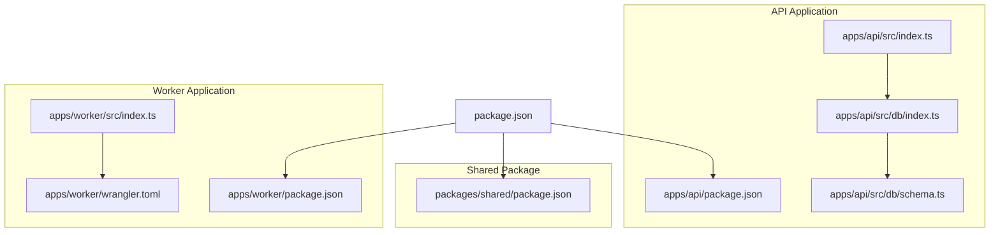
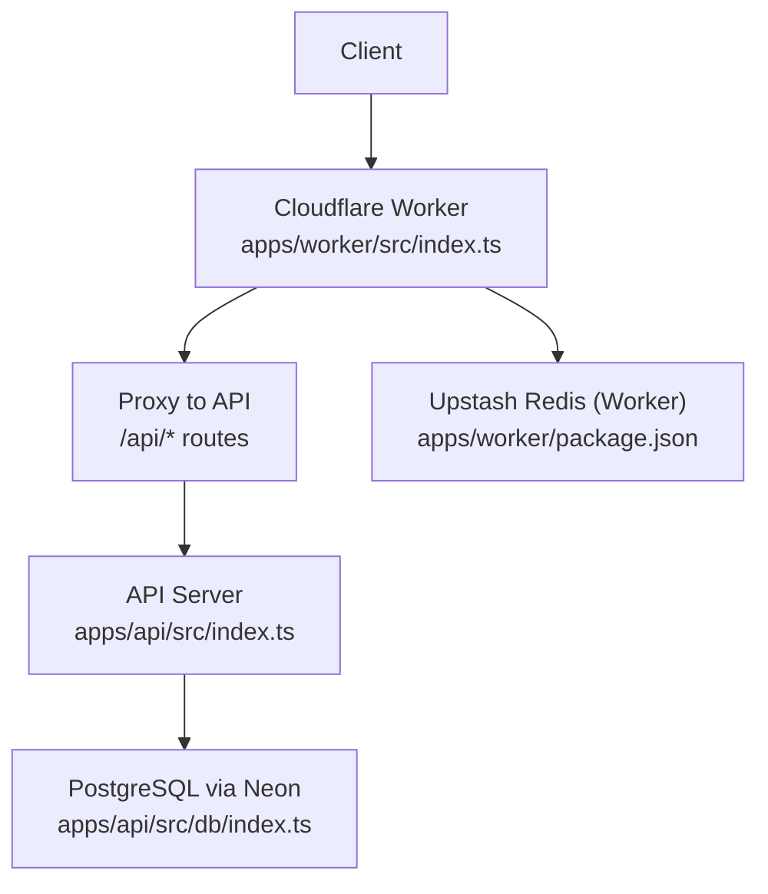
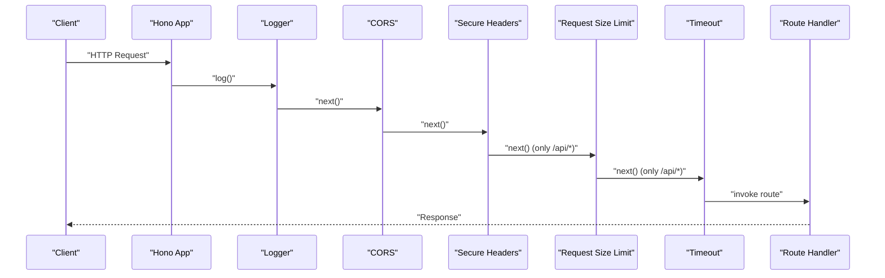
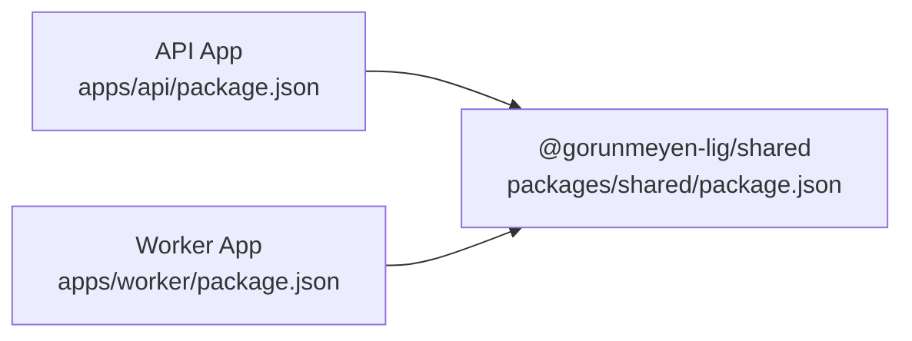

# Hono.js Server Configuration

<cite>
**Referenced Files in This Document**
- [apps/api/src/index.ts](file://apps/api/src/index.ts)
- [apps/api/package.json](file://apps/api/package.json)
- [apps/api/drizzle.config.ts](file://apps/api/drizzle.config.ts)
- [apps/api/src/db/index.ts](file://apps/api/src/db/index.ts)
- [apps/api/src/db/schema.ts](file://apps/api/src/db/schema.ts)
- [apps/api/src/lib/auth.config.ts](file://apps/api/src/lib/auth.config.ts)
- [apps/api/src/middleware/auth.ts](file://apps/api/src/middleware/auth.ts)
- [apps/api/src/middleware/security.ts](file://apps/api/src/middleware/security.ts)
- [apps/api/src/middleware/rateLimit.ts](file://apps/api/src/middleware/rateLimit.ts)
- [apps/api/src/middleware/validate.ts](file://apps/api/src/middleware/validate.ts)
- [apps/worker/src/index.ts](file://apps/worker/src/index.ts)
- [apps/worker/wrangler.toml](file://apps/worker/wrangler.toml)
- [apps/worker/package.json](file://apps/worker/package.json)
- [package.json](file://package.json)
</cite>

## Table of Contents
1. [Introduction](#introduction)
2. [Project Structure](#project-structure)
3. [Core Components](#core-components)
4. [Architecture Overview](#architecture-overview)
5. [Detailed Component Analysis](#detailed-component-analysis)
6. [Dependency Analysis](#dependency-analysis)
7. [Performance Considerations](#performance-considerations)
8. [Troubleshooting Guide](#troubleshooting-guide)
9. [Conclusion](#conclusion)
10. [Appendices](#appendices)

## Introduction
This document explains the Hono.js server configuration for the API application and the Cloudflare Worker proxy. It covers server initialization, middleware stack setup, routing structure, CORS configuration, security headers, request size limits, timeout settings, health checks, global error handling, environment variable configuration, and production deployment considerations. Practical examples and diagrams illustrate the middleware order and execution flow, enabling both beginners and experienced developers to configure, optimize, and monitor the servers effectively.

## Project Structure
The project is a monorepo with three applications:
- API server built with Hono and Node server adapter
- Cloudflare Worker acting as a proxy and security gateway
- Shared package for cross-app schemas and types

**Diagram sources**
- [apps/api/src/index.ts:1-67](file://apps/api/src/index.ts#L1-L67)
- [apps/api/src/db/index.ts:1-9](file://apps/api/src/db/index.ts#L1-L9)
- [apps/api/src/db/schema.ts:1-247](file://apps/api/src/db/schema.ts#L1-L247)
- [apps/api/package.json:1-34](file://apps/api/package.json#L1-L34)
- [apps/worker/src/index.ts:1-106](file://apps/worker/src/index.ts#L1-L106)
- [apps/worker/wrangler.toml:1-13](file://apps/worker/wrangler.toml#L1-L13)
- [apps/worker/package.json:1-24](file://apps/worker/package.json#L1-L24)
- [package.json:1-30](file://package.json#L1-L30)

**Section sources**
- [package.json:1-30](file://package.json#L1-L30)
- [apps/api/src/index.ts:1-67](file://apps/api/src/index.ts#L1-L67)
- [apps/worker/src/index.ts:1-106](file://apps/worker/src/index.ts#L1-L106)

## Core Components
- Hono instance creation and server binding
- Middleware stack: logger, CORS, secure headers, request size limits, timeout
- Health check endpoint
- Global error handling and 404 handling
- Environment-driven configuration for origins and ports
- Database connectivity and authentication configuration

Key implementation references:
- Hono instance and middleware registration: [apps/api/src/index.ts:9-23](file://apps/api/src/index.ts#L9-L23)
- Request size limit middleware: [apps/api/src/index.ts:25-32](file://apps/api/src/index.ts#L25-L32)
- Timeout middleware: [apps/api/src/index.ts:34-37](file://apps/api/src/index.ts#L34-L37)
- Health check endpoint: [apps/api/src/index.ts:39-42](file://apps/api/src/index.ts#L39-L42)
- Global error handling: [apps/api/src/index.ts:49-53](file://apps/api/src/index.ts#L49-L53)
- 404 handling: [apps/api/src/index.ts:55-58](file://apps/api/src/index.ts#L55-L58)
- Server startup: [apps/api/src/index.ts:60-64](file://apps/api/src/index.ts#L60-L64)

**Section sources**
- [apps/api/src/index.ts:1-67](file://apps/api/src/index.ts#L1-L67)

## Architecture Overview
The API server runs on Node.js using the Hono Node server adapter. Requests can flow directly to the API server or through the Cloudflare Worker proxy, which enforces CORS, security headers, request size limits, Cloudflare Turnstile verification, and proxies requests to the API backend while adding internal headers.

**Diagram sources**
- [apps/api/src/index.ts:1-67](file://apps/api/src/index.ts#L1-L67)
- [apps/worker/src/index.ts:1-106](file://apps/worker/src/index.ts#L1-L106)
- [apps/worker/package.json:1-24](file://apps/worker/package.json#L1-L24)
- [apps/api/src/db/index.ts:1-9](file://apps/api/src/db/index.ts#L1-L9)

## Detailed Component Analysis

### Hono Instance Creation and Server Initialization
- Creates a Hono app instance and binds it to the Node server adapter with a configurable port.
- Exports the app for potential reuse or testing.

Implementation references:
- Hono instance: [apps/api/src/index.ts:9](file://apps/api/src/index.ts#L9)
- Server startup: [apps/api/src/index.ts:60-64](file://apps/api/src/index.ts#L60-L64)

**Section sources**
- [apps/api/src/index.ts:1-67](file://apps/api/src/index.ts#L1-L67)

### Middleware Stack Setup and Execution Order
The middleware order ensures logging, CORS, and secure headers are applied broadly, followed by request size limits and timeouts scoped to API routes. The order is:
1. Logger middleware for all routes
2. CORS middleware for all routes
3. Secure headers middleware for all routes
4. Request size limit middleware for /api/*
5. Timeout middleware for /api/*

**Diagram sources**
- [apps/api/src/index.ts:12-37](file://apps/api/src/index.ts#L12-L37)

**Section sources**
- [apps/api/src/index.ts:12-37](file://apps/api/src/index.ts#L12-L37)

### CORS Configuration
- Origin is configured from an environment variable with a fallback to a development URL.
- Credentials are allowed, and allowed methods/headers are explicitly set.
- Max age is set to a day to reduce preflight overhead.

Implementation references:
- CORS configuration: [apps/api/src/index.ts:13-22](file://apps/api/src/index.ts#L13-L22)
- Worker CORS configuration: [apps/worker/src/index.ts:15-28](file://apps/worker/src/index.ts#L15-L28)

**Section sources**
- [apps/api/src/index.ts:13-22](file://apps/api/src/index.ts#L13-L22)
- [apps/worker/src/index.ts:15-28](file://apps/worker/src/index.ts#L15-L28)

### Security Headers
- Secure headers middleware is applied globally to set security-related headers for all responses.

Implementation references:
- Secure headers: [apps/api/src/index.ts:23](file://apps/api/src/index.ts#L23)
- Worker secure headers: [apps/worker/src/index.ts:31](file://apps/worker/src/index.ts#L31)

**Section sources**
- [apps/api/src/index.ts:23](file://apps/api/src/index.ts#L23)
- [apps/worker/src/index.ts:31](file://apps/worker/src/index.ts#L31)

### Request Size Limits
- A middleware checks the Content-Length header and rejects requests exceeding 100 KB with a 413 error.
- Applied to /api/* routes.

Implementation references:
- Size limit middleware: [apps/api/src/index.ts:25-32](file://apps/api/src/index.ts#L25-L32)
- Worker size limit: [apps/worker/src/index.ts:33-40](file://apps/worker/src/index.ts#L33-L40)

**Section sources**
- [apps/api/src/index.ts:25-32](file://apps/api/src/index.ts#L25-L32)
- [apps/worker/src/index.ts:33-40](file://apps/worker/src/index.ts#L33-L40)

### Timeout Settings
- A timeout middleware enforces a 10-second deadline for /api/* routes.
- Ensures long-running requests are terminated proactively.

Implementation references:
- Timeout middleware: [apps/api/src/index.ts:34-37](file://apps/api/src/index.ts#L34-L37)
- Worker timeout equivalent: [apps/worker/src/index.ts:82-103](file://apps/worker/src/index.ts#L82-L103)

**Section sources**
- [apps/api/src/index.ts:34-37](file://apps/api/src/index.ts#L34-L37)
- [apps/worker/src/index.ts:82-103](file://apps/worker/src/index.ts#L82-L103)

### Health Check Endpoint
- A GET endpoint at /api/health returns a JSON object with status and timestamp.

Implementation references:
- Health endpoint: [apps/api/src/index.ts:39-42](file://apps/api/src/index.ts#L39-L42)

**Section sources**
- [apps/api/src/index.ts:39-42](file://apps/api/src/index.ts#L39-L42)

### Global Error Handling and 404 Handling
- Unhandled errors are caught globally and responded with a 500 JSON payload.
- Not-found routes return a 404 JSON payload.

Implementation references:
- Global error handler: [apps/api/src/index.ts:49-53](file://apps/api/src/index.ts#L49-L53)
- 404 handler: [apps/api/src/index.ts:55-58](file://apps/api/src/index.ts#L55-L58)

**Section sources**
- [apps/api/src/index.ts:49-58](file://apps/api/src/index.ts#L49-L58)

### Authentication Middleware
- Provides session validation via Authorization header or query parameter.
- Includes optional auth and a proxy verification middleware for internal traffic.

Implementation references:
- Auth middleware: [apps/api/src/middleware/auth.ts:10-25](file://apps/api/src/middleware/auth.ts#L10-L25)
- Optional auth: [apps/api/src/middleware/auth.ts:30-39](file://apps/api/src/middleware/auth.ts#L30-L39)
- Proxy verification: [apps/api/src/middleware/auth.ts:44-52](file://apps/api/src/middleware/auth.ts#L44-L52)

**Section sources**
- [apps/api/src/middleware/auth.ts:1-52](file://apps/api/src/middleware/auth.ts#L1-L52)

### Security Middleware (Timing, Honeypot, Helpers)
- Timing check rejects very fast submissions.
- Honeypot check rejects submissions with a non-empty honeypot field.
- Helper functions extract client IP and user agent.

Implementation references:
- Timing check: [apps/api/src/middleware/security.ts:7-30](file://apps/api/src/middleware/security.ts#L7-L30)
- Honeypot check: [apps/api/src/middleware/security.ts:36-53](file://apps/api/src/middleware/security.ts#L36-L53)
- Client IP helper: [apps/api/src/middleware/security.ts:58-65](file://apps/api/src/middleware/security.ts#L58-L65)
- User agent helper: [apps/api/src/middleware/security.ts:70-72](file://apps/api/src/middleware/security.ts#L70-L72)

**Section sources**
- [apps/api/src/middleware/security.ts:1-72](file://apps/api/src/middleware/security.ts#L1-L72)

### Rate Limiting Middleware
- In-memory rate limiter with sliding window and cleanup interval.
- Preconfigured limiters for API, submissions, and authentication.

Implementation references:
- Rate limiter factory: [apps/api/src/middleware/rateLimit.ts:14-53](file://apps/api/src/middleware/rateLimit.ts#L14-L53)
- Preconfigured limiters: [apps/api/src/middleware/rateLimit.ts:58-60](file://apps/api/src/middleware/rateLimit.ts#L58-L60)
- Cleanup interval: [apps/api/src/middleware/rateLimit.ts:63-70](file://apps/api/src/middleware/rateLimit.ts#L63-L70)

**Section sources**
- [apps/api/src/middleware/rateLimit.ts:1-70](file://apps/api/src/middleware/rateLimit.ts#L1-L70)

### Validation Middleware (Zod)
- Validates request bodies and query parameters using Zod schemas.
- Attaches parsed data to context and sanitizes string inputs.

Implementation references:
- Body validation: [apps/api/src/middleware/validate.ts:7-28](file://apps/api/src/middleware/validate.ts#L7-L28)
- Query validation: [apps/api/src/middleware/validate.ts:33-49](file://apps/api/src/middleware/validate.ts#L33-L49)
- String sanitizer: [apps/api/src/middleware/validate.ts:54-59](file://apps/api/src/middleware/validate.ts#L54-L59)
- Object sanitizer: [apps/api/src/middleware/validate.ts:64-83](file://apps/api/src/middleware/validate.ts#L64-L83)

**Section sources**
- [apps/api/src/middleware/validate.ts:1-83](file://apps/api/src/middleware/validate.ts#L1-L83)

### Database and Authentication Configuration
- PostgreSQL connection via Neon with Drizzle ORM.
- Better Auth configuration for Google OAuth and session management.

Implementation references:
- Database connection: [apps/api/src/db/index.ts:1-9](file://apps/api/src/db/index.ts#L1-L9)
- Drizzle config: [apps/api/drizzle.config.ts:1-11](file://apps/api/drizzle.config.ts#L1-L11)
- Auth config: [apps/api/src/lib/auth.config.ts:5-39](file://apps/api/src/lib/auth.config.ts#L5-L39)

**Section sources**
- [apps/api/src/db/index.ts:1-9](file://apps/api/src/db/index.ts#L1-L9)
- [apps/api/drizzle.config.ts:1-11](file://apps/api/drizzle.config.ts#L1-L11)
- [apps/api/src/lib/auth.config.ts:1-42](file://apps/api/src/lib/auth.config.ts#L1-L42)

### Worker Proxy and Cloudflare Integration
- Enforces CORS and secure headers.
- Validates Cloudflare Turnstile for survey responses.
- Proxies /api/* requests to the API backend with internal headers.

Implementation references:
- Turnstile verification: [apps/worker/src/index.ts:42-79](file://apps/worker/src/index.ts#L42-L79)
- Proxy logic: [apps/worker/src/index.ts:81-103](file://apps/worker/src/index.ts#L81-L103)
- Worker env vars: [apps/worker/wrangler.toml:5-12](file://apps/worker/wrangler.toml#L5-L12)

**Section sources**
- [apps/worker/src/index.ts:1-106](file://apps/worker/src/index.ts#L1-L106)
- [apps/worker/wrangler.toml:1-13](file://apps/worker/wrangler.toml#L1-L13)

## Dependency Analysis
- API application depends on Hono, Node server adapter, and Drizzle ORM with Neon for PostgreSQL.
- Worker application depends on Hono and Upstash Redis for rate limiting.
- Shared package provides Zod-based schemas and types.

**Diagram sources**
- [apps/api/package.json:16-26](file://apps/api/package.json#L16-L26)
- [apps/worker/package.json:12-17](file://apps/worker/package.json#L12-L17)
- [packages/shared/package.json:11-12](file://packages/shared/package.json#L11-L12)

**Section sources**
- [apps/api/package.json:1-34](file://apps/api/package.json#L1-L34)
- [apps/worker/package.json:1-24](file://apps/worker/package.json#L1-L24)
- [packages/shared/package.json:1-18](file://packages/shared/package.json#L1-L18)

## Performance Considerations
- Middleware order minimizes overhead: log -> cors -> secure headers -> size limit -> timeout.
- Use Upstash Redis for rate limiting in production to avoid memory limitations.
- Tune timeout values based on workload characteristics.
- Enable compression and caching at the CDN/proxy layer when applicable.
- Monitor slow endpoints and consider pagination for large datasets.

[No sources needed since this section provides general guidance]

## Troubleshooting Guide
Common issues and resolutions:
- CORS failures: Verify FRONTEND_URL matches the origin and credentials are allowed.
- 413 errors: Reduce request payload size below 100 KB or adjust middleware logic.
- 429 errors: Implement client-side retry-after handling and reduce request frequency.
- 500 errors: Check global error logs and ensure proper error propagation.
- 404 errors: Confirm route registration and base path correctness.

**Section sources**
- [apps/api/src/index.ts:13-22](file://apps/api/src/index.ts#L13-L22)
- [apps/api/src/index.ts:25-32](file://apps/api/src/index.ts#L25-L32)
- [apps/api/src/middleware/rateLimit.ts:38-44](file://apps/api/src/middleware/rateLimit.ts#L38-L44)
- [apps/api/src/index.ts:49-58](file://apps/api/src/index.ts#L49-L58)

## Conclusion
The Hono.js configuration establishes a robust foundation for the API server and worker proxy, emphasizing security, reliability, and maintainability. By leveraging environment-driven settings, structured middleware ordering, and global error handling, the system supports scalable deployments. Production hardening should focus on external rate limiting, improved auth integration, and comprehensive monitoring.

[No sources needed since this section summarizes without analyzing specific files]

## Appendices

### Environment Variables
- API server:
  - FRONTEND_URL: Allowed origin for CORS
  - API_PORT: Server port (defaults to 3001)
  - DATABASE_URL: PostgreSQL connection string
  - BETTER_AUTH_URL: Base URL for Better Auth
  - BETTER_AUTH_SECRET: Secret for Better Auth sessions
  - GOOGLE_CLIENT_ID, GOOGLE_CLIENT_SECRET: Google OAuth credentials
- Worker:
  - API_BASE_URL: Target API backend URL
  - FRONTEND_URL: Allowed origin for CORS
  - TURNSTILE_SECRET_KEY: Cloudflare Turnstile secret
  - UPSTASH_REDIS_REST_URL, UPSTASH_REDIS_REST_TOKEN: Upstash Redis credentials

**Section sources**
- [apps/api/src/index.ts:15-16](file://apps/api/src/index.ts#L15-L16)
- [apps/api/src/lib/auth.config.ts:16-17](file://apps/api/src/lib/auth.config.ts#L16-L17)
- [apps/worker/wrangler.toml:6-7](file://apps/worker/wrangler.toml#L6-L7)
- [apps/worker/src/index.ts:8, 19-20:8-20](file://apps/worker/src/index.ts#L8-L20)

### Server Startup Examples
- Local development:
  - API: Run the dev script to start the server with hot reload.
  - Worker: Use Wrangler dev to run locally with secrets and vars.
- Production:
  - API: Build TypeScript and start the compiled Node.js server.
  - Worker: Deploy using Wrangler with secrets configured.

**Section sources**
- [apps/api/package.json:7](file://apps/api/package.json#L7)
- [apps/worker/package.json:7](file://apps/worker/package.json#L7)
- [apps/api/package.json:9](file://apps/api/package.json#L9)
- [apps/worker/package.json:8-9](file://apps/worker/package.json#L8-L9)

### Monitoring and Observability
- Use the logger middleware output for request tracing.
- Integrate structured logging and metrics collection in production.
- Add circuit breakers and health probes for resilience.

[No sources needed since this section provides general guidance]