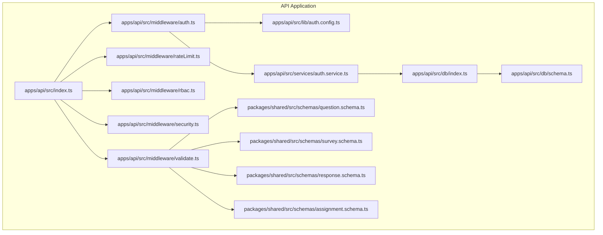
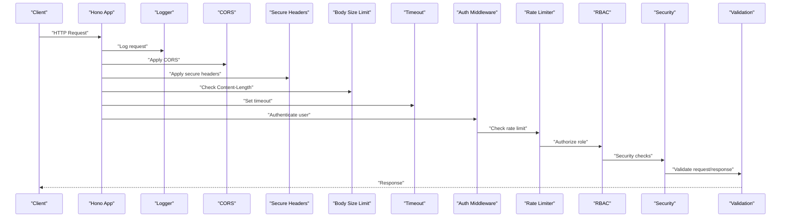
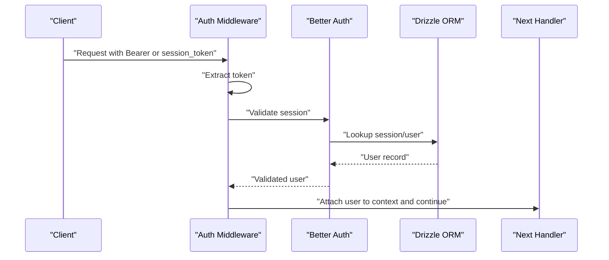
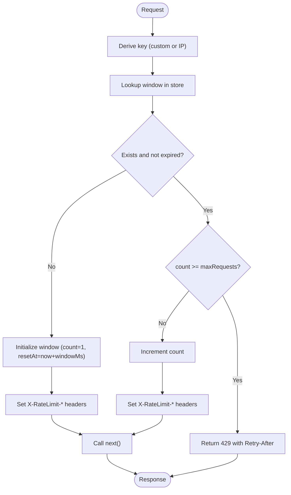
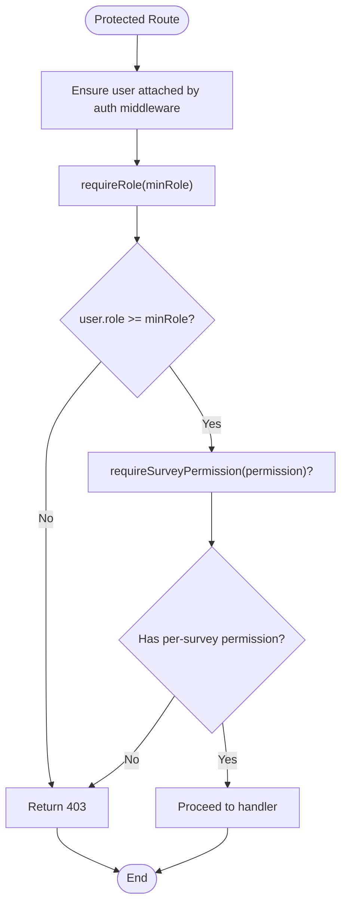
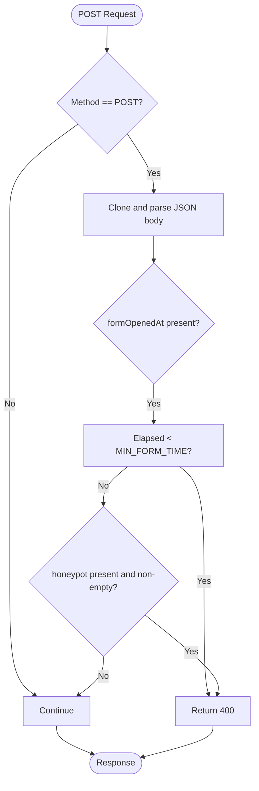
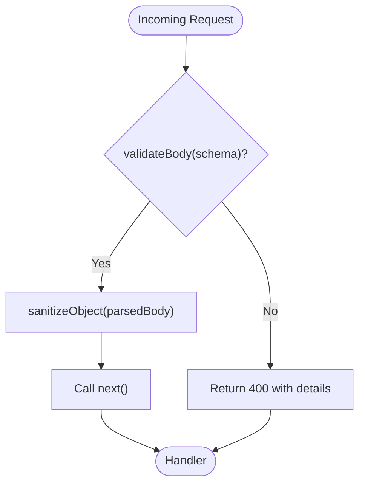
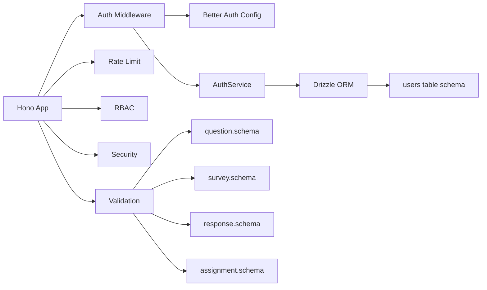

# Middleware System

<cite>
**Referenced Files in This Document**
- [index.ts](file://apps/api/src/index.ts)
- [auth.config.ts](file://apps/api/src/lib/auth.config.ts)
- [auth.service.ts](file://apps/api/src/services/auth.service.ts)
- [auth.ts](file://apps/api/src/middleware/auth.ts)
- [rateLimit.ts](file://apps/api/src/middleware/rateLimit.ts)
- [rbac.ts](file://apps/api/src/middleware/rbac.ts)
- [security.ts](file://apps/api/src/middleware/security.ts)
- [validate.ts](file://apps/api/src/middleware/validate.ts)
- [schema.ts](file://apps/api/src/db/schema.ts)
- [index.ts](file://apps/api/src/db/index.ts)
- [question.schema.ts](file://packages/shared/src/schemas/question.schema.ts)
- [survey.schema.ts](file://packages/shared/src/schemas/survey.schema.ts)
- [response.schema.ts](file://packages/shared/src/schemas/response.schema.ts)
- [assignment.schema.ts](file://packages/shared/src/schemas/assignment.schema.ts)
</cite>

## Table of Contents
1. [Introduction](#introduction)
2. [Project Structure](#project-structure)
3. [Core Components](#core-components)
4. [Architecture Overview](#architecture-overview)
5. [Detailed Component Analysis](#detailed-component-analysis)
6. [Dependency Analysis](#dependency-analysis)
7. [Performance Considerations](#performance-considerations)
8. [Troubleshooting Guide](#troubleshooting-guide)
9. [Conclusion](#conclusion)
10. [Appendices](#appendices)

## Introduction
This document explains the middleware system powering the API server. It covers authentication, rate limiting, role-based access control (RBAC), security safeguards, and validation middleware. It also documents the architecture, execution order, dependencies, and practical usage patterns. The system integrates better-auth for session and OAuth management, Drizzle ORM for persistence, and Zod for schema validation.

## Project Structure
The middleware system resides in the API application under apps/api/src. Key areas:
- Middleware implementations: apps/api/src/middleware
- Authentication configuration and service: apps/api/src/lib and apps/api/src/services
- Database schema and connection: apps/api/src/db
- Shared validation schemas: packages/shared/src/schemas

**Diagram sources**
- [index.ts:1-67](file://apps/api/src/index.ts#L1-L67)
- [auth.ts:1-53](file://apps/api/src/middleware/auth.ts#L1-L53)
- [rateLimit.ts:1-71](file://apps/api/src/middleware/rateLimit.ts#L1-L71)
- [rbac.ts:1-56](file://apps/api/src/middleware/rbac.ts#L1-L56)
- [security.ts:1-73](file://apps/api/src/middleware/security.ts#L1-L73)
- [validate.ts:1-84](file://apps/api/src/middleware/validate.ts#L1-L84)
- [auth.config.ts:1-42](file://apps/api/src/lib/auth.config.ts#L1-L42)
- [auth.service.ts:1-105](file://apps/api/src/services/auth.service.ts#L1-L105)
- [index.ts:1-9](file://apps/api/src/db/index.ts#L1-L9)
- [schema.ts:1-247](file://apps/api/src/db/schema.ts#L1-L247)
- [question.schema.ts:1-65](file://packages/shared/src/schemas/question.schema.ts#L1-L65)
- [survey.schema.ts:1-22](file://packages/shared/src/schemas/survey.schema.ts#L1-L22)
- [response.schema.ts:1-24](file://packages/shared/src/schemas/response.schema.ts#L1-L24)
- [assignment.schema.ts:1-20](file://packages/shared/src/schemas/assignment.schema.ts#L1-L20)

**Section sources**
- [index.ts:1-67](file://apps/api/src/index.ts#L1-L67)
- [auth.config.ts:1-42](file://apps/api/src/lib/auth.config.ts#L1-L42)
- [auth.service.ts:1-105](file://apps/api/src/services/auth.service.ts#L1-L105)
- [auth.ts:1-53](file://apps/api/src/middleware/auth.ts#L1-L53)
- [rateLimit.ts:1-71](file://apps/api/src/middleware/rateLimit.ts#L1-L71)
- [rbac.ts:1-56](file://apps/api/src/middleware/rbac.ts#L1-L56)
- [security.ts:1-73](file://apps/api/src/middleware/security.ts#L1-L73)
- [validate.ts:1-84](file://apps/api/src/middleware/validate.ts#L1-L84)
- [schema.ts:1-247](file://apps/api/src/db/schema.ts#L1-L247)
- [index.ts:1-9](file://apps/api/src/db/index.ts#L1-L9)
- [question.schema.ts:1-65](file://packages/shared/src/schemas/question.schema.ts#L1-L65)
- [survey.schema.ts:1-22](file://packages/shared/src/schemas/survey.schema.ts#L1-L22)
- [response.schema.ts:1-24](file://packages/shared/src/schemas/response.schema.ts#L1-L24)
- [assignment.schema.ts:1-20](file://packages/shared/src/schemas/assignment.schema.ts#L1-L20)

## Core Components
- Authentication middleware: Validates session tokens and attaches user context. Integrates with better-auth and supports bearer tokens and query-based tokens.
- Rate limiting middleware: In-memory rate limiter with configurable windows and thresholds; includes preconfigured presets for API, submission, and auth attempts.
- RBAC middleware: Role hierarchy enforcement and per-survey permission checks; designed to be used after authentication.
- Security middleware: Form timing checks, honeypot validation, and helpers for extracting client IP and user agent.
- Validation middleware: Zod-based request/response validation with parsing and sanitization utilities.

**Section sources**
- [auth.ts:1-53](file://apps/api/src/middleware/auth.ts#L1-L53)
- [rateLimit.ts:1-71](file://apps/api/src/middleware/rateLimit.ts#L1-L71)
- [rbac.ts:1-56](file://apps/api/src/middleware/rbac.ts#L1-L56)
- [security.ts:1-73](file://apps/api/src/middleware/security.ts#L1-L73)
- [validate.ts:1-84](file://apps/api/src/middleware/validate.ts#L1-L84)

## Architecture Overview
The middleware stack is mounted globally and route-specifically. The Hono app initializes logging, CORS, and secure headers early. Route groups apply request size limits and timeouts. Individual routes then compose middleware in a specific order to enforce auth, rate limits, RBAC, security, and validation.

**Diagram sources**
- [index.ts:12-37](file://apps/api/src/index.ts#L12-L37)
- [auth.ts:10-25](file://apps/api/src/middleware/auth.ts#L10-L25)
- [rateLimit.ts:21-52](file://apps/api/src/middleware/rateLimit.ts#L21-L52)
- [rbac.ts:16-27](file://apps/api/src/middleware/rbac.ts#L16-L27)
- [security.ts:7-30](file://apps/api/src/middleware/security.ts#L7-L30)
- [validate.ts:7-28](file://apps/api/src/middleware/validate.ts#L7-L28)

## Detailed Component Analysis

### Authentication Middleware
Purpose:
- Validate session presence via Authorization header or query parameter.
- Attach user context for downstream middleware and handlers.
- Integrate with better-auth for robust session validation and Google OAuth.

Key behaviors:
- Accepts bearer tokens or session_token query param.
- Returns 401 when missing.
- Includes a proxy verification guard using a shared secret header.
- Uses better-auth configuration for session caching and cookie settings.

**Diagram sources**
- [auth.ts:10-25](file://apps/api/src/middleware/auth.ts#L10-L25)
- [auth.config.ts:5-39](file://apps/api/src/lib/auth.config.ts#L5-L39)
- [auth.service.ts:16-59](file://apps/api/src/services/auth.service.ts#L16-L59)

Practical usage:
- Apply globally for protected routes or route groups.
- Use optionalAuth for public endpoints that still want user context if present.
- Use proxyVerifyMiddleware for internal Cloudflare Worker traffic.

Integration notes:
- Session validation placeholder is marked for better-auth integration.
- User context attachment is pending implementation; current stub allows flow to continue.

**Section sources**
- [auth.ts:1-53](file://apps/api/src/middleware/auth.ts#L1-L53)
- [auth.config.ts:1-42](file://apps/api/src/lib/auth.config.ts#L1-L42)
- [auth.service.ts:1-105](file://apps/api/src/services/auth.service.ts#L1-L105)

### Rate Limiting Middleware
Purpose:
- Prevent abuse via configurable sliding-window rate limits.
- Support IP-based keys with fallbacks and preconfigured presets.

Key behaviors:
- In-memory store with automatic cleanup of expired windows.
- Exposes X-RateLimit-* headers and Retry-After on quota exhaustion.
- Supports custom key functions (defaults to x-forwarded-for/x-real-ip).

**Diagram sources**
- [rateLimit.ts:21-52](file://apps/api/src/middleware/rateLimit.ts#L21-L52)

Preconfigured presets:
- apiRateLimit: 60 requests per minute.
- submitRateLimit: 3 submissions per 5 minutes.
- authRateLimit: 5 authentication attempts per 15 seconds.

Operational details:
- Cleanup runs every 5 minutes to remove expired entries.

**Section sources**
- [rateLimit.ts:1-71](file://apps/api/src/middleware/rateLimit.ts#L1-L71)

### RBAC Middleware
Purpose:
- Enforce role-based access control using a role hierarchy.
- Support per-survey permissions for editors/viewers.

Key behaviors:
- requireRole enforces minimum role threshold.
- adminOnly is a convenience for admin-only endpoints.
- requireSurveyPermission checks per-survey assignments for edit/view/export rights.

**Diagram sources**
- [rbac.ts:16-27](file://apps/api/src/middleware/rbac.ts#L16-L27)
- [rbac.ts:38-55](file://apps/api/src/middleware/rbac.ts#L38-L55)

Notes:
- Current implementation is a placeholder; user context and DB queries are marked as TODO.

**Section sources**
- [rbac.ts:1-56](file://apps/api/src/middleware/rbac.ts#L1-L56)

### Security Middleware
Purpose:
- Deter automated submissions and bot abuse.
- Extract client IP and user agent for logging/tracing.

Key behaviors:
- timingCheck: Rejects forms submitted faster than a minimum duration; requires formOpenedAt in body.
- honeypotCheck: Rejects submissions with non-empty honeypot field.
- getClientIp: Extracts real IP from Cloudflare or proxy headers.
- getUserAgent: Extracts and truncates user agent string.

**Diagram sources**
- [security.ts:7-30](file://apps/api/src/middleware/security.ts#L7-L30)
- [security.ts:36-53](file://apps/api/src/middleware/security.ts#L36-L53)

**Section sources**
- [security.ts:1-73](file://apps/api/src/middleware/security.ts#L1-L73)

### Validation Middleware
Purpose:
- Enforce strict request/response schemas using Zod.
- Provide sanitized inputs and structured error responses.

Key behaviors:
- validateBody: Parses and validates request body; attaches parsed data to context.
- validateQuery: Validates query parameters; attaches parsed data to context.
- sanitizeString: Removes HTML tags and control characters, trims whitespace.
- sanitizeObject: Recursively sanitizes nested objects and arrays.

**Diagram sources**
- [validate.ts:7-28](file://apps/api/src/middleware/validate.ts#L7-L28)
- [validate.ts:64-83](file://apps/api/src/middleware/validate.ts#L64-L83)

Shared schemas:
- Question, Survey, Response, and Assignment schemas define canonical validation rules for frontend/backend alignment.

**Section sources**
- [validate.ts:1-84](file://apps/api/src/middleware/validate.ts#L1-L84)
- [question.schema.ts:1-65](file://packages/shared/src/schemas/question.schema.ts#L1-L65)
- [survey.schema.ts:1-22](file://packages/shared/src/schemas/survey.schema.ts#L1-L22)
- [response.schema.ts:1-24](file://packages/shared/src/schemas/response.schema.ts#L1-L24)
- [assignment.schema.ts:1-20](file://packages/shared/src/schemas/assignment.schema.ts#L1-L20)

## Dependency Analysis
- Hono app depends on middleware modules and mounts them globally or per-route.
- Authentication middleware depends on better-auth configuration and the AuthService for user lookup.
- AuthService depends on Drizzle ORM and the users table schema.
- Validation middleware depends on shared Zod schemas.
- Security middleware relies on request headers and body parsing.

**Diagram sources**
- [index.ts:12-37](file://apps/api/src/index.ts#L12-L37)
- [auth.ts:1-53](file://apps/api/src/middleware/auth.ts#L1-L53)
- [rateLimit.ts:1-71](file://apps/api/src/middleware/rateLimit.ts#L1-L71)
- [rbac.ts:1-56](file://apps/api/src/middleware/rbac.ts#L1-L56)
- [security.ts:1-73](file://apps/api/src/middleware/security.ts#L1-L73)
- [validate.ts:1-84](file://apps/api/src/middleware/validate.ts#L1-L84)
- [auth.config.ts:1-42](file://apps/api/src/lib/auth.config.ts#L1-L42)
- [auth.service.ts:1-105](file://apps/api/src/services/auth.service.ts#L1-L105)
- [index.ts:1-9](file://apps/api/src/db/index.ts#L1-L9)
- [schema.ts:41-51](file://apps/api/src/db/schema.ts#L41-L51)
- [question.schema.ts:1-65](file://packages/shared/src/schemas/question.schema.ts#L1-L65)
- [survey.schema.ts:1-22](file://packages/shared/src/schemas/survey.schema.ts#L1-L22)
- [response.schema.ts:1-24](file://packages/shared/src/schemas/response.schema.ts#L1-L24)
- [assignment.schema.ts:1-20](file://packages/shared/src/schemas/assignment.schema.ts#L1-L20)

**Section sources**
- [index.ts:1-67](file://apps/api/src/index.ts#L1-L67)
- [auth.ts:1-53](file://apps/api/src/middleware/auth.ts#L1-L53)
- [rateLimit.ts:1-71](file://apps/api/src/middleware/rateLimit.ts#L1-L71)
- [rbac.ts:1-56](file://apps/api/src/middleware/rbac.ts#L1-L56)
- [security.ts:1-73](file://apps/api/src/middleware/security.ts#L1-L73)
- [validate.ts:1-84](file://apps/api/src/middleware/validate.ts#L1-L84)
- [auth.config.ts:1-42](file://apps/api/src/lib/auth.config.ts#L1-L42)
- [auth.service.ts:1-105](file://apps/api/src/services/auth.service.ts#L1-L105)
- [index.ts:1-9](file://apps/api/src/db/index.ts#L1-L9)
- [schema.ts:1-247](file://apps/api/src/db/schema.ts#L1-L247)
- [question.schema.ts:1-65](file://packages/shared/src/schemas/question.schema.ts#L1-L65)
- [survey.schema.ts:1-22](file://packages/shared/src/schemas/survey.schema.ts#L1-L22)
- [response.schema.ts:1-24](file://packages/shared/src/schemas/response.schema.ts#L1-L24)
- [assignment.schema.ts:1-20](file://packages/shared/src/schemas/assignment.schema.ts#L1-L20)

## Performance Considerations
- Rate limiter:
  - Current in-memory store is fine for single-instance deployments; for distributed environments, replace with Upstash Redis via Cloudflare Workers as indicated in comments.
  - Cleanup interval removes stale entries; tune frequency based on expected traffic.
- Validation:
  - Zod parsing occurs per request; keep schemas concise and avoid overly complex nested structures.
  - sanitizeObject recursively processes objects; avoid excessive nesting in payloads.
- Security:
  - timingCheck and honeypotCheck add minimal overhead; ensure clients send required fields to avoid false positives.
- Authentication:
  - better-auth session caching reduces DB load; ensure cache TTL aligns with session update age.

[No sources needed since this section provides general guidance]

## Troubleshooting Guide
Common issues and resolutions:
- Authentication failures:
  - Missing Authorization header or invalid session_token yields 401. Ensure clients pass either a Bearer token or session_token query param.
  - Proxy verification failures return 403; confirm x-proxy-secret header matches expected value.
- Rate limiting:
  - 429 responses indicate quota exceeded; inspect X-RateLimit-* headers to debug remaining requests and reset time.
  - For distributed deployments, switch to Redis-backed store to avoid inconsistent counts across instances.
- RBAC rejections:
  - 403 responses occur when role or per-survey permissions are insufficient; verify user role and survey assignments.
- Validation errors:
  - 400 responses with structured details indicate schema mismatches; review shared schemas and payload shape.
- Security checks:
  - 400 responses for timing or honeypot violations suggest bot-like behavior or misconfigured client; ensure formOpenedAt and honeypot fields are handled correctly.

**Section sources**
- [auth.ts:16-18](file://apps/api/src/middleware/auth.ts#L16-L18)
- [auth.ts:44-50](file://apps/api/src/middleware/auth.ts#L44-L50)
- [rateLimit.ts:38-44](file://apps/api/src/middleware/rateLimit.ts#L38-L44)
- [rbac.ts:21-23](file://apps/api/src/middleware/rbac.ts#L21-L23)
- [validate.ts:13-19](file://apps/api/src/middleware/validate.ts#L13-L19)
- [security.ts:21-23](file://apps/api/src/middleware/security.ts#L21-L23)
- [security.ts:45-47](file://apps/api/src/middleware/security.ts#L45-L47)

## Conclusion
The middleware system provides a layered defense: early global middleware for transport and security, followed by specialized middleware for authentication, rate limiting, RBAC, security, and validation. The design leverages better-auth for session management, Drizzle ORM for persistence, and Zod for schema enforcement. By composing middleware in the recommended order and using the provided presets, teams can build secure, scalable APIs with predictable behavior.

[No sources needed since this section summarizes without analyzing specific files]

## Appendices

### Execution Order Best Practices
- Mount logging, CORS, and secure headers early.
- Apply body size and timeout middleware to API routes.
- Apply auth middleware before rate limiting and RBAC.
- Place security checks (timing, honeypot) before validation to fail fast.
- Use validation middleware last in the chain to ensure sanitized inputs reach handlers.

**Section sources**
- [index.ts:12-37](file://apps/api/src/index.ts#L12-L37)
- [auth.ts:1-53](file://apps/api/src/middleware/auth.ts#L1-L53)
- [rateLimit.ts:1-71](file://apps/api/src/middleware/rateLimit.ts#L1-L71)
- [rbac.ts:1-56](file://apps/api/src/middleware/rbac.ts#L1-L56)
- [security.ts:1-73](file://apps/api/src/middleware/security.ts#L1-L73)
- [validate.ts:1-84](file://apps/api/src/middleware/validate.ts#L1-L84)

### Custom Middleware Creation
Steps:
- Define a Hono middleware function returning an async (c, next) => {...}.
- Use c.req and c.res for request/response inspection/modification.
- Use c.set and c.get to pass data between middleware and handlers.
- Export the middleware and compose it in route handlers.

Reference patterns:
- Auth middleware pattern: [auth.ts:10-25](file://apps/api/src/middleware/auth.ts#L10-L25)
- Rate limiter pattern: [rateLimit.ts:14-53](file://apps/api/src/middleware/rateLimit.ts#L14-L53)
- RBAC pattern: [rbac.ts:16-27](file://apps/api/src/middleware/rbac.ts#L16-L27)
- Security pattern: [security.ts:7-30](file://apps/api/src/middleware/security.ts#L7-L30)
- Validation pattern: [validate.ts:7-28](file://apps/api/src/middleware/validate.ts#L7-L28)

**Section sources**
- [auth.ts:1-53](file://apps/api/src/middleware/auth.ts#L1-L53)
- [rateLimit.ts:1-71](file://apps/api/src/middleware/rateLimit.ts#L1-L71)
- [rbac.ts:1-56](file://apps/api/src/middleware/rbac.ts#L1-L56)
- [security.ts:1-73](file://apps/api/src/middleware/security.ts#L1-L73)
- [validate.ts:1-84](file://apps/api/src/middleware/validate.ts#L1-L84)