# Cloudflare Worker Proxy

<cite>
**Referenced Files in This Document**
- [index.ts](file://apps/worker/src/index.ts)
- [wrangler.toml](file://apps/worker/wrangler.toml)
- [package.json](file://apps/worker/package.json)
- [index.ts](file://apps/api/src/index.ts)
- [rateLimit.ts](file://apps/api/src/middleware/rateLimit.ts)
- [security.ts](file://apps/api/src/middleware/security.ts)
- [api.ts](file://apps/web/src/lib/api.ts)
- [plan.md](file://plan.md)
</cite>

## Table of Contents
1. [Introduction](#introduction)
2. [Project Structure](#project-structure)
3. [Core Components](#core-components)
4. [Architecture Overview](#architecture-overview)
5. [Detailed Component Analysis](#detailed-component-analysis)
6. [Dependency Analysis](#dependency-analysis)
7. [Performance Considerations](#performance-considerations)
8. [Troubleshooting Guide](#troubleshooting-guide)
9. [Conclusion](#conclusion)
10. [Appendices](#appendices)

## Introduction
This document explains the Cloudflare Worker proxy implementation that serves as an edge security layer between the client application and the backend API. It covers the worker's role as a request proxy, security middleware integration (CORS, Turnstile CAPTCHA, request size limits), rate limiting mechanisms, and deployment configuration via Wrangler TOML. It also details how the worker forwards requests to the backend, modifies headers, and handles errors, while providing practical guidance on deployment, monitoring, performance optimization, and troubleshooting.

## Project Structure
The worker is implemented as a Cloudflare Worker using Hono.js and deployed with Wrangler. The repository includes:
- A Cloudflare Worker project under apps/worker with the main entry point, configuration, and scripts
- A backend API project under apps/api with Hono.js server-side middleware
- A frontend project under apps/web that consumes the API via a simple fetch wrapper
- Shared types under packages/shared used across the stack

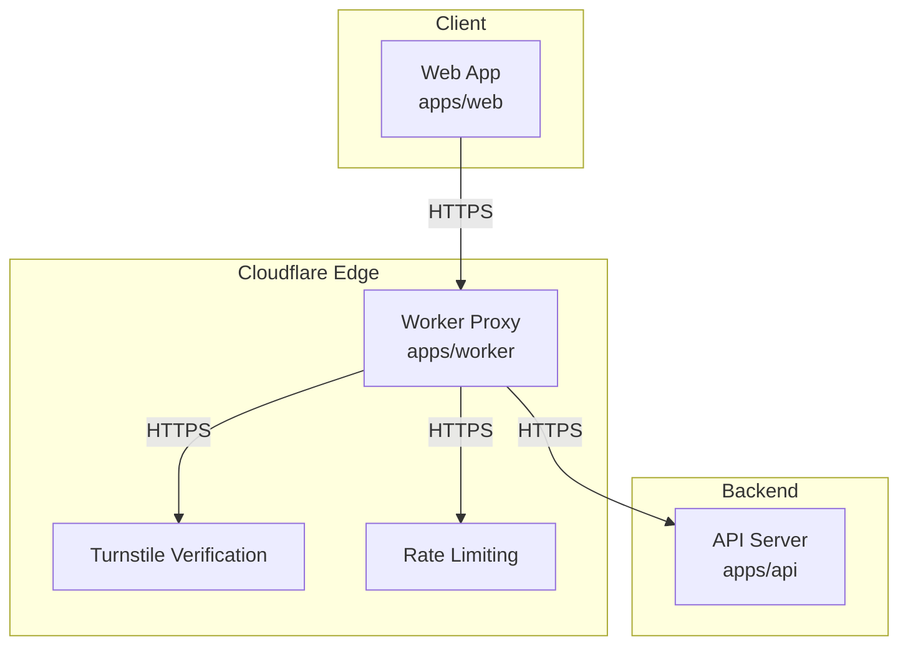

**Diagram sources**
- [index.ts:1-106](file://apps/worker/src/index.ts#L1-L106)
- [index.ts:1-67](file://apps/api/src/index.ts#L1-L67)

**Section sources**
- [index.ts:1-106](file://apps/worker/src/index.ts#L1-L106)
- [wrangler.toml:1-13](file://apps/worker/wrangler.toml#L1-L13)
- [package.json:1-24](file://apps/worker/package.json#L1-L24)

## Core Components
- Worker entry and routing: The worker defines middleware and routes for CORS, security headers, request size limits, Turnstile verification, and proxying all /api/* requests to the backend.
- Turnstile CAPTCHA integration: Validates submissions for survey responses using Cloudflare Turnstile siteverify endpoint.
- Rate limiting: Uses Upstash Redis for distributed rate limiting (configured in the worker environment).
- CORS configuration: Restricts origins to the frontend URL and allows credentials and essential methods/headers.
- Request proxy: Forwards requests to the backend with forwarded IP and internal secret header.
- Deployment: Wrangler configuration and scripts define local development, build, and deployment commands.

**Section sources**
- [index.ts:15-28](file://apps/worker/src/index.ts#L15-L28)
- [index.ts:33-40](file://apps/worker/src/index.ts#L33-L40)
- [index.ts:42-79](file://apps/worker/src/index.ts#L42-L79)
- [index.ts:81-103](file://apps/worker/src/index.ts#L81-L103)
- [wrangler.toml:1-13](file://apps/worker/wrangler.toml#L1-L13)
- [package.json:6-11](file://apps/worker/package.json#L6-L11)

## Architecture Overview
The worker acts as a security-first reverse proxy at the Cloudflare edge. It enforces CORS, applies security headers, validates Turnstile tokens for specific endpoints, enforces request size limits, and proxies requests to the backend API. The backend API also applies similar middleware for robustness.

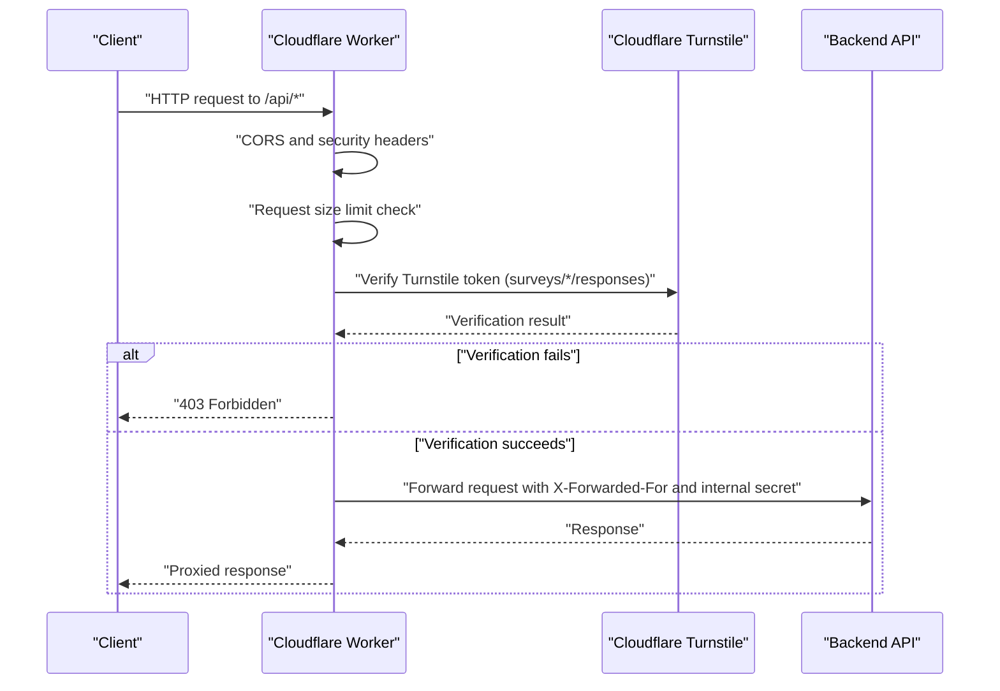

**Diagram sources**
- [index.ts:15-28](file://apps/worker/src/index.ts#L15-L28)
- [index.ts:33-40](file://apps/worker/src/index.ts#L33-L40)
- [index.ts:42-79](file://apps/worker/src/index.ts#L42-L79)
- [index.ts:81-103](file://apps/worker/src/index.ts#L81-L103)

## Detailed Component Analysis

### Worker Implementation Details
- Environment bindings: API base URL, frontend URL, Turnstile secret, Upstash Redis REST URL and token.
- Middleware order and responsibilities:
  - CORS: Origin-restricted to frontend URL, credentials allowed, specific methods and headers.
  - Security headers: Applied globally.
  - Request size limit: Enforced for /api/* routes using Content-Length header.
  - Turnstile verification: Required for POST requests to survey response endpoints; validates token against Cloudflare Turnstile.
  - Proxy: Forwards all /api/* requests to the backend with forwarded IP and an internal secret header.

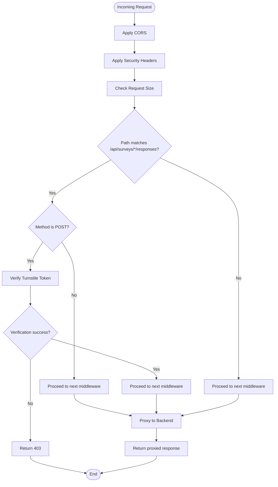

**Diagram sources**
- [index.ts:15-28](file://apps/worker/src/index.ts#L15-L28)
- [index.ts:33-40](file://apps/worker/src/index.ts#L33-L40)
- [index.ts:42-79](file://apps/worker/src/index.ts#L42-L79)
- [index.ts:81-103](file://apps/worker/src/index.ts#L81-L103)

**Section sources**
- [index.ts:5-11](file://apps/worker/src/index.ts#L5-L11)
- [index.ts:15-28](file://apps/worker/src/index.ts#L15-L28)
- [index.ts:33-40](file://apps/worker/src/index.ts#L33-L40)
- [index.ts:42-79](file://apps/worker/src/index.ts#L42-L79)
- [index.ts:81-103](file://apps/worker/src/index.ts#L81-L103)

### Turnstile CAPTCHA Integration
- Endpoint scope: POST requests to survey response endpoints.
- Validation process:
  - Extracts the Turnstile token from the request body.
  - Calls Cloudflare Turnstile siteverify endpoint with the configured secret key.
  - Rejects the request with appropriate status codes if the token is missing or invalid.

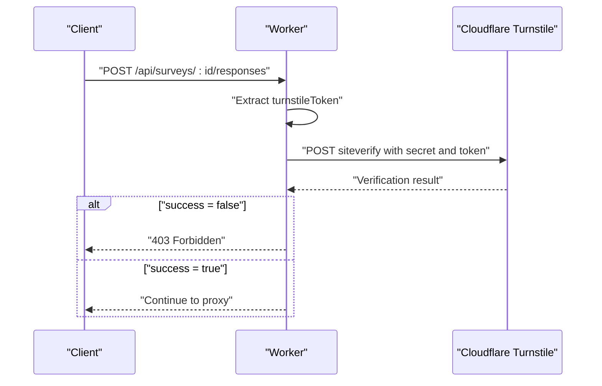

**Diagram sources**
- [index.ts:42-79](file://apps/worker/src/index.ts#L42-L79)

**Section sources**
- [index.ts:42-79](file://apps/worker/src/index.ts#L42-L79)

### Rate Limiting Mechanisms
- Worker-level rate limiting:
  - The worker declares Upstash Redis environment variables for REST URL and token, indicating integration potential.
  - The backend API includes a rate limiting middleware with sliding window logic and pre-configured limits for general API, submissions, and authentication attempts.
- Backend rate limiting:
  - In-memory store with periodic cleanup.
  - Exposes X-RateLimit-* headers and returns 429 when exceeded.
  - Provides helper functions to extract client IP from Cloudflare headers.

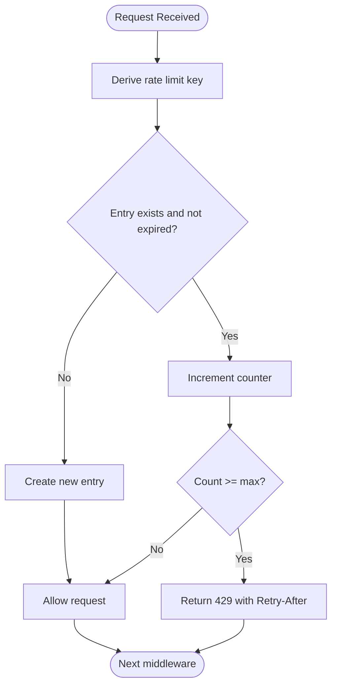

**Diagram sources**
- [rateLimit.ts:14-53](file://apps/api/src/middleware/rateLimit.ts#L14-L53)

**Section sources**
- [index.ts:8-10](file://apps/worker/src/index.ts#L8-L10)
- [rateLimit.ts:1-71](file://apps/api/src/middleware/rateLimit.ts#L1-L71)
- [security.ts:58-64](file://apps/api/src/middleware/security.ts#L58-L64)

### CORS Configuration
- Origin restriction: Only the configured frontend URL is allowed.
- Credentials: Allowed for authenticated flows.
- Methods and headers: Standard HTTP methods and Content-Type/Authorization headers.
- Max age: 86400 seconds to reduce preflight overhead.

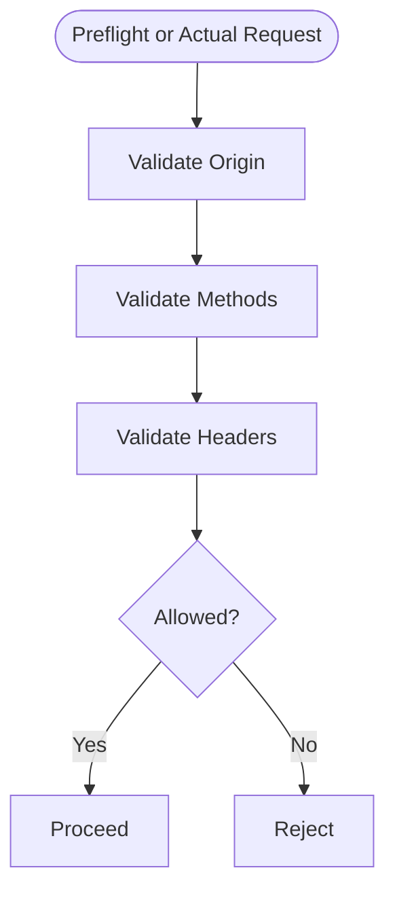

**Diagram sources**
- [index.ts:15-28](file://apps/worker/src/index.ts#L15-L28)

**Section sources**
- [index.ts:15-28](file://apps/worker/src/index.ts#L15-L28)

### Request Proxy Functionality
- Path rewriting: All /api/* paths are forwarded to the backend API base URL.
- Header forwarding:
  - X-Forwarded-For populated from x-real-ip or cf-connecting-ip.
  - Internal secret header included for backend verification.
- Body handling: Non-GET/HEAD requests send the raw ArrayBuffer body.
- Response passthrough: Returns the backend response with status, statusText, and headers.

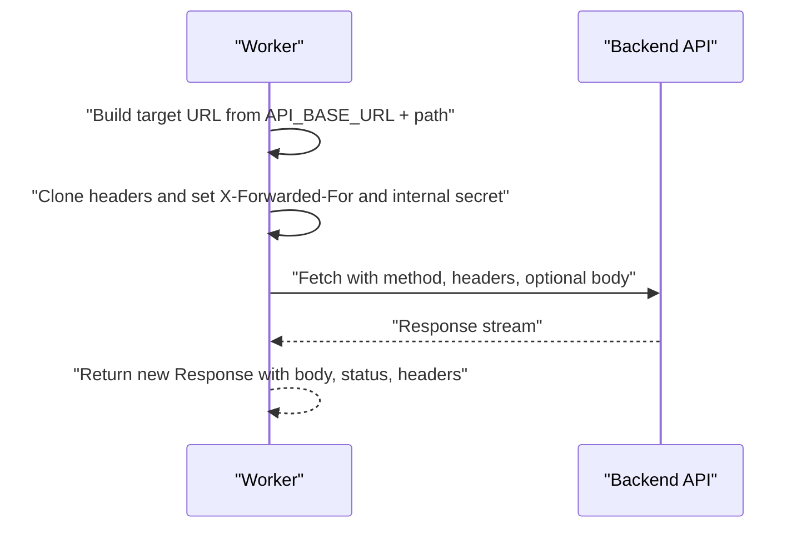

**Diagram sources**
- [index.ts:81-103](file://apps/worker/src/index.ts#L81-L103)

**Section sources**
- [index.ts:81-103](file://apps/worker/src/index.ts#L81-L103)

### Security Middleware Integration
- Worker:
  - Applies global security headers.
  - Enforces request size limits for /api/*.
  - Integrates Turnstile verification for survey responses.
- Backend:
  - Applies CORS and security headers.
  - Enforces request size limits.
  - Includes timing checks and honeypot checks for submissions.
  - Provides IP and user agent helpers for security analytics.

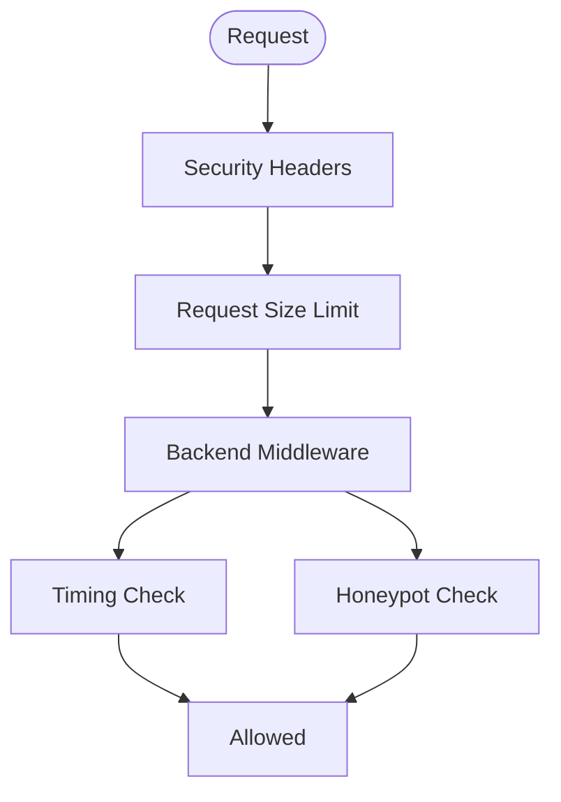

**Diagram sources**
- [index.ts:30-40](file://apps/worker/src/index.ts#L30-L40)
- [index.ts:11-23](file://apps/api/src/index.ts#L11-L23)
- [security.ts:7-30](file://apps/api/src/middleware/security.ts#L7-L30)
- [security.ts:36-53](file://apps/api/src/middleware/security.ts#L36-L53)

**Section sources**
- [index.ts:30-40](file://apps/worker/src/index.ts#L30-L40)
- [index.ts:11-23](file://apps/api/src/index.ts#L11-L23)
- [security.ts:1-73](file://apps/api/src/middleware/security.ts#L1-L73)

### Deployment Configuration and Platform Integration
- Name and entry: Worker name and main entry point defined in Wrangler configuration.
- Compatibility date: Ensures runtime compatibility.
- Variables:
  - API_BASE_URL and FRONTEND_URL configured locally.
  - Secrets placeholder for Turnstile secret, Upstash Redis REST URL, and token.
- Scripts:
  - Local development, dry-run build, and deployment commands.

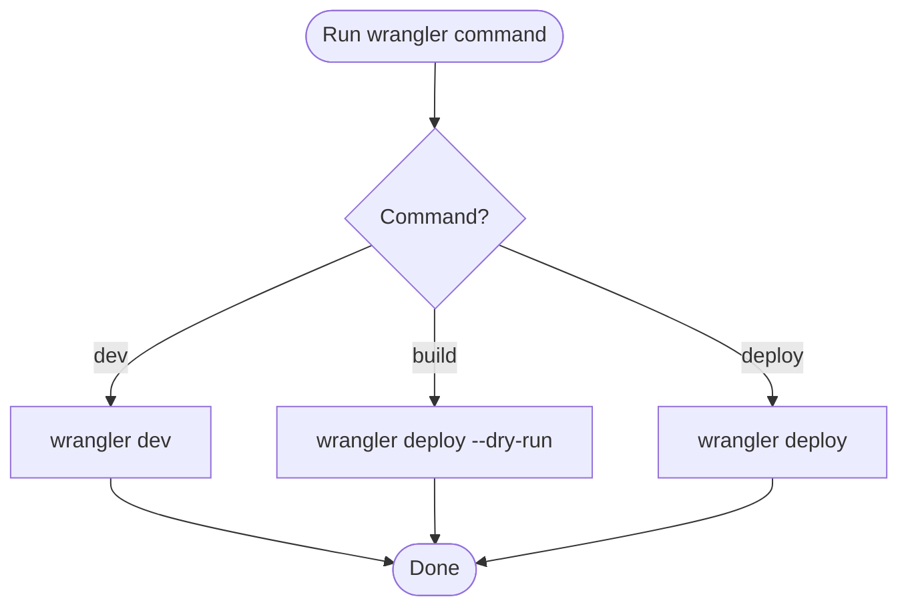

**Diagram sources**
- [wrangler.toml:1-13](file://apps/worker/wrangler.toml#L1-L13)
- [package.json:6-11](file://apps/worker/package.json#L6-L11)

**Section sources**
- [wrangler.toml:1-13](file://apps/worker/wrangler.toml#L1-L13)
- [package.json:6-11](file://apps/worker/package.json#L6-L11)

### How the Worker Acts as a Security Layer
- Edge-first validation: CORS, Turnstile, and request size limits prevent malicious traffic from reaching the backend.
- Request forwarding: The worker forwards validated requests with proper headers and minimal modifications.
- Response modification: The worker returns backend responses unchanged, preserving status codes and headers.
- Error handling: The worker returns structured error responses for validation failures and proxies backend errors.

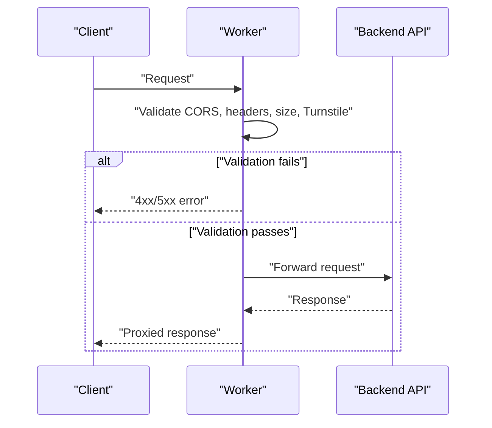

**Diagram sources**
- [index.ts:15-28](file://apps/worker/src/index.ts#L15-L28)
- [index.ts:33-40](file://apps/worker/src/index.ts#L33-L40)
- [index.ts:42-79](file://apps/worker/src/index.ts#L42-L79)
- [index.ts:81-103](file://apps/worker/src/index.ts#L81-L103)

**Section sources**
- [index.ts:15-28](file://apps/worker/src/index.ts#L15-L28)
- [index.ts:33-40](file://apps/worker/src/index.ts#L33-L40)
- [index.ts:42-79](file://apps/worker/src/index.ts#L42-L79)
- [index.ts:81-103](file://apps/worker/src/index.ts#L81-L103)

## Dependency Analysis
- Worker dependencies:
  - Hono.js for routing and middleware.
  - Upstash rate limiting and Redis SDK for distributed rate limiting.
- Backend dependencies:
  - Hono.js with CORS, security headers, logger, and timeout middleware.
  - Additional middleware for rate limiting, security checks, and RBAC.
- Frontend dependency:
  - Simple fetch wrapper for API calls.

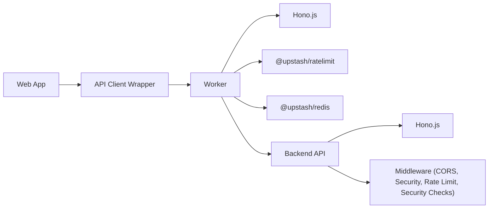

**Diagram sources**
- [package.json:12-17](file://apps/worker/package.json#L12-L17)
- [index.ts:1-67](file://apps/api/src/index.ts#L1-L67)

**Section sources**
- [package.json:12-17](file://apps/worker/package.json#L12-L17)
- [index.ts:1-67](file://apps/api/src/index.ts#L1-L67)

## Performance Considerations
- Edge caching: Leverage Cloudflare caching for static assets and cacheable API responses where appropriate.
- Minimize body processing: The worker forwards request bodies as-is to reduce CPU overhead.
- Efficient headers: Avoid unnecessary header cloning and manipulation.
- Rate limiting placement: Apply rate limiting early to reduce backend load.
- Monitoring: Use Cloudflare Analytics and Upstash metrics to track request volume, latency, and errors.

[No sources needed since this section provides general guidance]

## Troubleshooting Guide
- Turnstile verification failures:
  - Ensure the Turnstile secret is set via secrets management and the token is present in the request body.
  - Check network connectivity to the Turnstile endpoint.
- CORS errors:
  - Verify FRONTEND_URL matches the origin sending requests.
  - Confirm credentials and allowed methods/headers align with client requests.
- Request size errors:
  - Ensure client requests do not exceed the enforced limit.
- Rate limiting:
  - Confirm Upstash Redis configuration and that keys derive from the correct client IP.
- Proxy issues:
  - Verify API_BASE_URL points to the correct backend endpoint.
  - Check that internal secret header is accepted by the backend.

**Section sources**
- [index.ts:42-79](file://apps/worker/src/index.ts#L42-L79)
- [index.ts:15-28](file://apps/worker/src/index.ts#L15-L28)
- [index.ts:33-40](file://apps/worker/src/index.ts#L33-L40)
- [index.ts:81-103](file://apps/worker/src/index.ts#L81-L103)
- [rateLimit.ts:14-53](file://apps/api/src/middleware/rateLimit.ts#L14-L53)

## Conclusion
The Cloudflare Worker proxy provides a robust, edge-first security layer that validates requests, enforces rate limits, and proxies traffic to the backend API. By combining CORS, Turnstile, request size limits, and Upstash-backed rate limiting, it significantly reduces the risk of abuse while maintaining low latency. Proper deployment and monitoring ensure reliable operation across environments.

[No sources needed since this section summarizes without analyzing specific files]

## Appendices

### Practical Examples
- Local development:
  - Run the worker locally using the provided script.
- Deployment:
  - Set secrets for Turnstile and Upstash Redis.
  - Deploy using the deployment script.
- Monitoring:
  - Use Cloudflare dashboard logs and Upstash metrics to monitor traffic and rate limiting.

**Section sources**
- [package.json:6-11](file://apps/worker/package.json#L6-L11)
- [wrangler.toml:9-12](file://apps/worker/wrangler.toml#L9-L12)

### Worker Configuration Reference
- Environment variables:
  - API_BASE_URL: Backend API base URL.
  - FRONTEND_URL: Allowed origin for CORS.
  - TURNSTILE_SECRET_KEY: Secret key for Turnstile verification.
  - UPSTASH_REDIS_REST_URL and UPSTASH_REDIS_REST_TOKEN: Upstash Redis credentials for rate limiting.
- Routes:
  - /api/*: Proxied to the backend API.
  - Specific path for Turnstile verification: POST to survey response endpoints.

**Section sources**
- [index.ts:5-11](file://apps/worker/src/index.ts#L5-L11)
- [index.ts:42-79](file://apps/worker/src/index.ts#L42-L79)
- [index.ts:81-103](file://apps/worker/src/index.ts#L81-L103)

### Backend API Security Context
- Backend middleware complements the worker with additional protections:
  - CORS and security headers.
  - Request size limits.
  - Timing and honeypot checks for submissions.
  - Rate limiting with sliding windows and cleanup intervals.

**Section sources**
- [index.ts:11-23](file://apps/api/src/index.ts#L11-L23)
- [index.ts:25-37](file://apps/api/src/index.ts#L25-L37)
- [security.ts:7-30](file://apps/api/src/middleware/security.ts#L7-L30)
- [security.ts:36-53](file://apps/api/src/middleware/security.ts#L36-L53)
- [rateLimit.ts:14-53](file://apps/api/src/middleware/rateLimit.ts#L14-L53)