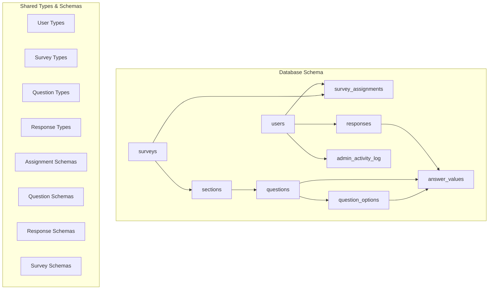
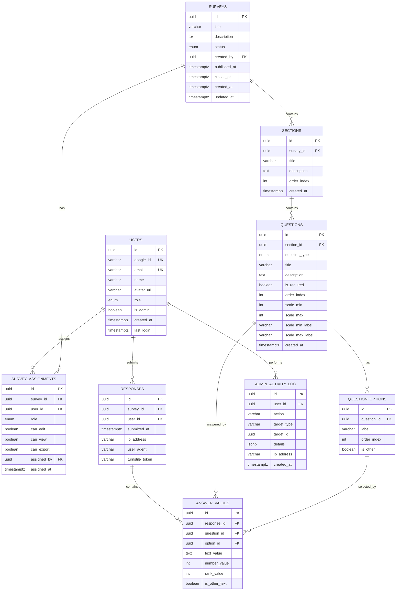
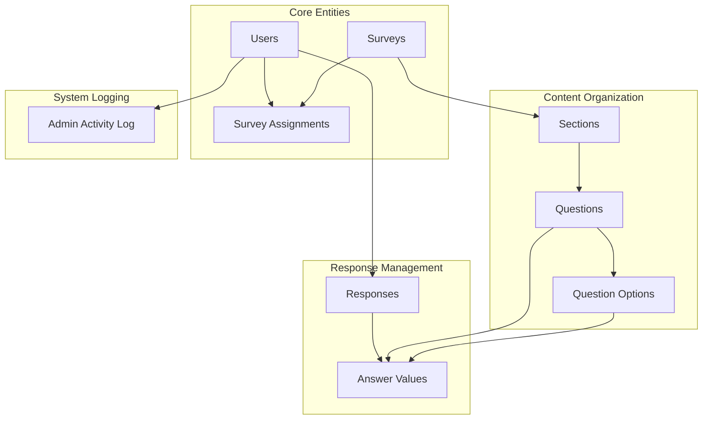

# Complete Table Reference

<cite>
**Referenced Files in This Document**
- [schema.ts](file://apps/api/src/db/schema.ts)
- [index.ts](file://apps/api/src/db/index.ts)
- [drizzle.config.ts](file://apps/api/drizzle.config.ts)
- [assignment.schema.ts](file://packages/shared/src/schemas/assignment.schema.ts)
- [question.schema.ts](file://packages/shared/src/schemas/question.schema.ts)
- [response.schema.ts](file://packages/shared/src/schemas/response.schema.ts)
- [survey.schema.ts](file://packages/shared/src/schemas/survey.schema.ts)
- [user.ts](file://packages/shared/src/types/user.ts)
- [survey.ts](file://packages/shared/src/types/survey.ts)
- [response.ts](file://packages/shared/src/types/response.ts)
- [question.ts](file://packages/shared/src/types/question.ts)
</cite>

## Table of Contents
1. [Introduction](#introduction)
2. [Project Structure](#project-structure)
3. [Core Components](#core-components)
4. [Architecture Overview](#architecture-overview)
5. [Detailed Component Analysis](#detailed-component-analysis)
6. [Dependency Analysis](#dependency-analysis)
7. [Performance Considerations](#performance-considerations)
8. [Troubleshooting Guide](#troubleshooting-guide)
9. [Conclusion](#conclusion)

## Introduction
This document provides a comprehensive table reference for the 12 database tables that power the survey application. It covers the purpose, field definitions, data types, constraints, indexes, and relationships for each table. The documentation includes authentication fields and role management for users, survey lifecycle tracking, permission management via assignments, survey organization through sections, question types and options, response submission tracking, answer storage, and administrative audit trails.

## Project Structure
The database schema is defined using Drizzle ORM with PostgreSQL enums and constraints. The schema file defines all 12 tables and their relationships. The shared package contains TypeScript interfaces and Zod schemas that validate and model the data structures used by the API and frontend.

**Diagram sources**
- [schema.ts:41-246](file://apps/api/src/db/schema.ts#L41-L246)
- [user.ts:3-21](file://packages/shared/src/types/user.ts#L3-L21)
- [survey.ts:5-49](file://packages/shared/src/types/survey.ts#L5-L49)
- [question.ts:30-65](file://packages/shared/src/types/question.ts#L30-L65)
- [response.ts:1-53](file://packages/shared/src/types/response.ts#L1-L53)

**Section sources**
- [schema.ts:1-247](file://apps/api/src/db/schema.ts#L1-L247)
- [drizzle.config.ts:1-11](file://apps/api/drizzle.config.ts#L1-L11)

## Core Components
This section documents each of the 12 database tables with their fields, data types, constraints, and indexes. Business rule justifications are included to explain why certain constraints and defaults exist.

### Users Table
Purpose: Stores user profiles, authentication identifiers, roles, and system metadata.

Fields:
- id: UUID, primary key, auto-generated random value
- googleId: VARCHAR(255), unique, not null, used for Google OAuth identification
- email: VARCHAR(255), unique, not null, used for login and communication
- name: VARCHAR(255), nullable, user's display name
- avatarUrl: VARCHAR(500), nullable, URL to user's avatar image
- role: ENUM(user_role), default "user", not null, system role for access control
- isAdmin: BOOLEAN, default false, not null, admin flag for elevated permissions
- createdAt: TIMESTAMP WITH TIME ZONE, default now, not null, record creation timestamp
- lastLogin: TIMESTAMP WITH TIME ZONE, nullable, last successful login timestamp

Constraints and Indexes:
- Unique constraint on googleId and email
- Indexes: implicit primary key index on id

Business Rules:
- Unique identifiers prevent duplicate accounts
- Role-based access control determines permissions across the application
- Admin flag provides explicit elevation for system administration tasks

**Section sources**
- [schema.ts:41-51](file://apps/api/src/db/schema.ts#L41-L51)
- [user.ts:1-22](file://packages/shared/src/types/user.ts#L1-L22)

### Surveys Table
Purpose: Manages survey lifecycle, metadata, and scheduling.

Fields:
- id: UUID, primary key, auto-generated random value
- title: VARCHAR(200), not null, survey title
- description: TEXT, nullable, detailed description
- status: ENUM(survey_status), default "draft", not null, lifecycle state
- createdBy: UUID, not null, foreign key to users(id), cascade delete
- publishedAt: TIMESTAMP WITH TIME ZONE, nullable, publication timestamp
- closesAt: TIMESTAMP WITH TIME ZONE, nullable, closure timestamp
- createdAt: TIMESTAMP WITH TIME ZONE, default now, not null, creation timestamp
- updatedAt: TIMESTAMP WITH TIME ZONE, default now, not null, last update timestamp

Constraints and Indexes:
- Foreign key constraint on createdBy referencing users(id) with cascade delete
- Indexes: implicit primary key index on id

Business Rules:
- Status progression: draft → published → closed
- Cascade deletion ensures orphaned records cleanup when users are removed
- Timestamps track survey activity and compliance with deadlines

**Section sources**
- [schema.ts:57-69](file://apps/api/src/db/schema.ts#L57-L69)
- [survey.ts:5-15](file://packages/shared/src/types/survey.ts#L5-L15)

### Survey Assignments Table
Purpose: Controls user permissions and access rights for specific surveys.

Fields:
- id: UUID, primary key, auto-generated random value
- surveyId: UUID, not null, foreign key to surveys(id), cascade delete
- userId: UUID, not null, foreign key to users(id), cascade delete
- role: ENUM(assignment_role), not null, "editor" or "viewer"
- canEdit: BOOLEAN, default false, not null, edit permissions
- canView: BOOLEAN, default true, not null, view permissions
- canExport: BOOLEAN, default false, not null, export permissions
- assignedBy: UUID, not null, foreign key to users(id), cascade delete
- assignedAt: TIMESTAMP WITH TIME ZONE, default now, not null, assignment timestamp

Constraints and Indexes:
- Unique composite index on (surveyId, userId)
- Indexes: survey_idx on surveyId, user_idx on userId

Business Rules:
- Prevents duplicate assignments for the same user-survey pair
- Role-based permissions control editing and viewing capabilities
- Assignment tracking enables auditability and permission revocation

**Section sources**
- [schema.ts:75-99](file://apps/api/src/db/schema.ts#L75-L99)
- [survey.ts:37-49](file://packages/shared/src/types/survey.ts#L37-L49)
- [assignment.schema.ts:3-16](file://packages/shared/src/schemas/assignment.schema.ts#L3-L16)

### Sections Table
Purpose: Organizes questions within a survey into logical groupings.

Fields:
- id: UUID, primary key, auto-generated random value
- surveyId: UUID, not null, foreign key to surveys(id), cascade delete
- title: VARCHAR(200), not null, section title
- description: TEXT, nullable, section description
- orderIndex: INTEGER, not null, ordering for display
- createdAt: TIMESTAMP WITH TIME ZONE, default now, not null, creation timestamp

Constraints and Indexes:
- Foreign key constraint on surveyId referencing surveys(id) with cascade delete
- Index: sections_survey_idx on surveyId

Business Rules:
- Order index ensures consistent presentation across clients
- Cascade deletion maintains referential integrity when surveys are removed

**Section sources**
- [schema.ts:105-120](file://apps/api/src/db/schema.ts#L105-L120)
- [survey.ts:22-29](file://packages/shared/src/types/survey.ts#L22-L29)

### Questions Table
Purpose: Defines individual survey questions with type-specific attributes.

Fields:
- id: UUID, primary key, auto-generated random value
- sectionId: UUID, not null, foreign key to sections(id), cascade delete
- questionType: ENUM(question_type), not null, question type identifier
- title: VARCHAR(500), not null, question text
- description: TEXT, nullable, additional context
- isRequired: BOOLEAN, default true, not null, mandatory completion
- orderIndex: INTEGER, not null, ordering within section
- scaleMin: INTEGER, nullable, minimum for linear scales
- scaleMax: INTEGER, nullable, maximum for linear scales
- scaleMinLabel: VARCHAR(50), nullable, label for minimum value
- scaleMaxLabel: VARCHAR(50), nullable, label for maximum value
- createdAt: TIMESTAMP WITH TIME ZONE, default now, not null, creation timestamp

Constraints and Indexes:
- Foreign key constraint on sectionId referencing sections(id) with cascade delete
- Index: questions_section_idx on sectionId

Business Rules:
- Enumerated question types support 12 distinct input mechanisms
- Scale attributes enable numeric rating and linear scale questions
- Required flag enforces mandatory responses

**Section sources**
- [schema.ts:126-147](file://apps/api/src/db/schema.ts#L126-L147)
- [question.ts:30-43](file://packages/shared/src/types/question.ts#L30-L43)
- [question.schema.ts:3-35](file://packages/shared/src/schemas/question.schema.ts#L3-L35)

### Question Options Table
Purpose: Provides choices for multiple-choice and dropdown questions.

Fields:
- id: UUID, primary key, auto-generated random value
- questionId: UUID, not null, foreign key to questions(id), cascade delete
- label: VARCHAR(200), not null, option text
- orderIndex: INTEGER, not null, ordering for display
- isOther: BOOLEAN, default false, not null, indicates "other" option

Constraints and Indexes:
- Foreign key constraint on questionId referencing questions(id) with cascade delete
- Index: options_question_idx on questionId

Business Rules:
- Order index controls presentation consistency
- "Other" flag identifies open-ended alternatives
- Cascade deletion removes options when questions are deleted

**Section sources**
- [schema.ts:153-167](file://apps/api/src/db/schema.ts#L153-L167)
- [question.ts:45-51](file://packages/shared/src/types/question.ts#L45-L51)

### Responses Table
Purpose: Tracks submissions for each user-survey combination.

Fields:
- id: UUID, primary key, auto-generated random value
- surveyId: UUID, not null, foreign key to surveys(id), cascade delete
- userId: UUID, not null, foreign key to users(id), cascade delete
- submittedAt: TIMESTAMP WITH TIME ZONE, default now, not null, submission timestamp
- ipAddress: VARCHAR(45), nullable, client IP address
- userAgent: VARCHAR(500), nullable, browser/user agent string
- turnstileToken: VARCHAR(500), nullable, Cloudflare Turnstile verification token

Constraints and Indexes:
- Unique composite index on (surveyId, userId)
- Indexes: responses_survey_idx on surveyId, responses_user_idx on userId

Business Rules:
- Unique constraint prevents multiple submissions per user per survey
- IP and user agent capture help detect potential abuse
- Turnstile token validates human interaction

**Section sources**
- [schema.ts:173-196](file://apps/api/src/db/schema.ts#L173-L196)
- [response.ts:1-8](file://packages/shared/src/types/response.ts#L1-L8)
- [response.schema.ts:12-20](file://packages/shared/src/schemas/response.schema.ts#L12-L20)

### Answer Values Table
Purpose: Stores the actual answers provided by users.

Fields:
- id: UUID, primary key, auto-generated random value
- responseId: UUID, not null, foreign key to responses(id), cascade delete
- questionId: UUID, not null, foreign key to questions(id), cascade delete
- optionId: UUID, nullable, foreign key to question_options(id), set null on delete
- textValue: TEXT, nullable, free-text responses
- numberValue: INTEGER, nullable, numeric responses
- rankValue: INTEGER, nullable, ranking responses
- isOtherText: BOOLEAN, default false, not null, indicates "other" text

Constraints and Indexes:
- Foreign key constraints with cascade delete for responseId and questionId
- Optional foreign key constraint for optionId with set null on delete
- Indexes: answers_response_idx on responseId, answers_question_idx on questionId

Business Rules:
- Flexible value storage accommodates all question types
- OptionId links to predefined choices for multiple-choice questions
- isOtherText flag distinguishes "other" responses from standard options

**Section sources**
- [schema.ts:202-222](file://apps/api/src/db/schema.ts#L202-L222)
- [response.ts:10-19](file://packages/shared/src/types/response.ts#L10-L19)
- [response.schema.ts:3-10](file://packages/shared/src/schemas/response.schema.ts#L3-L10)

### Admin Activity Log Table
Purpose: Maintains audit trail for administrative actions.

Fields:
- id: UUID, primary key, auto-generated random value
- userId: UUID, not null, foreign key to users(id), cascade delete
- action: VARCHAR(100), not null, action performed
- targetType: VARCHAR(50), not null, type of target entity
- targetId: UUID, nullable, identifier of target entity
- details: JSONB, nullable, structured details about the action
- ipAddress: VARCHAR(45), nullable, IP address of requester
- createdAt: TIMESTAMP WITH TIME ZONE, default now, not null, timestamp

Constraints and Indexes:
- Foreign key constraint on userId referencing users(id) with cascade delete
- Indexes: activity_log_user_idx on userId, activity_log_created_idx on createdAt

Business Rules:
- Comprehensive logging enables compliance and troubleshooting
- JSONB details support flexible event metadata
- Timestamp indexing facilitates chronological queries

**Section sources**
- [schema.ts:228-246](file://apps/api/src/db/schema.ts#L228-L246)

## Architecture Overview
The database follows a normalized relational design with clear foreign key relationships. The schema uses PostgreSQL enums for type safety and cascading deletes for referential integrity. Shared TypeScript interfaces and Zod schemas provide validation and typing across the API and frontend layers.

**Diagram sources**
- [schema.ts:41-246](file://apps/api/src/db/schema.ts#L41-L246)

## Detailed Component Analysis

### Authentication and Role Management
The users table implements a robust authentication and authorization system with multiple layers of security and flexibility.

Key Features:
- OAuth integration via googleId for external authentication
- Role-based access control with four distinct levels
- Admin flag for explicit system administration privileges
- Creation timestamps for audit and compliance

Business Rules:
- Unique googleId and email prevent account duplication
- Role hierarchy supports granular permission control
- Admin flag provides explicit elevation for sensitive operations

**Section sources**
- [schema.ts:41-51](file://apps/api/src/db/schema.ts#L41-L51)
- [user.ts:1-22](file://packages/shared/src/types/user.ts#L1-L22)

### Survey Lifecycle Management
Surveys table manages the complete lifecycle from creation to closure with built-in scheduling capabilities.

Key Features:
- Status tracking with draft, published, and closed states
- Publication and closure timestamps
- Creator attribution with cascade deletion
- Automatic timestamp updates

Business Rules:
- Status progression enforces proper survey workflow
- Timestamps enable deadline enforcement and reporting
- Cascade deletion maintains data integrity

**Section sources**
- [schema.ts:57-69](file://apps/api/src/db/schema.ts#L57-L69)
- [survey.ts:5-15](file://packages/shared/src/types/survey.ts#L5-L15)
- [survey.schema.ts:3-17](file://packages/shared/src/schemas/survey.schema.ts#L3-L17)

### Permission Management System
Survey assignments provide granular control over who can access and modify surveys.

Key Features:
- Role-based permissions (editor, viewer)
- Capability flags for editing, viewing, and exporting
- Assignment tracking with timestamps
- Unique user-survey combinations

Business Rules:
- Unique constraints prevent conflicting permissions
- Role hierarchy determines capability inheritance
- Assignment timestamps enable audit trails

**Section sources**
- [schema.ts:75-99](file://apps/api/src/db/schema.ts#L75-L99)
- [survey.ts:37-49](file://packages/shared/src/types/survey.ts#L37-L49)
- [assignment.schema.ts:3-16](file://packages/shared/src/schemas/assignment.schema.ts#L3-L16)

### Question Type System
The questions table supports 12 distinct question types with flexible configuration options.

Supported Types:
- Text-based: short_text, long_text
- Choice-based: single_choice, multiple_choice, dropdown
- Rating: linear_scale, rating, yes_no
- Numeric: date, number, ranking
- Matrix: matrix

Configuration Options:
- Required field enforcement
- Scale parameters for numeric questions
- Ordering within sections
- Descriptive text for context

**Section sources**
- [schema.ts:126-147](file://apps/api/src/db/schema.ts#L126-L147)
- [question.ts:1-28](file://packages/shared/src/types/question.ts#L1-L28)
- [question.schema.ts:3-35](file://packages/shared/src/schemas/question.schema.ts#L3-L35)

### Response Submission Tracking
The responses table provides comprehensive tracking of survey submissions with security measures.

Submission Features:
- Unique user-survey combinations prevent duplicate submissions
- IP address and user agent capture for security
- Turnstile integration for bot prevention
- Timestamp tracking for timing analysis

Security Measures:
- Unique constraint prevents multiple submissions
- CAPTCHA token validation
- Client metadata capture for abuse detection

**Section sources**
- [schema.ts:173-196](file://apps/api/src/db/schema.ts#L173-L196)
- [response.ts:1-8](file://packages/shared/src/types/response.ts#L1-L8)
- [response.schema.ts:12-20](file://packages/shared/src/schemas/response.schema.ts#L12-L20)

### Answer Storage Architecture
Answer values table implements a flexible schema that accommodates all question types while maintaining referential integrity.

Storage Strategy:
- Multiple value columns for different question types
- Option linking for choice-based questions
- "Other" text handling for open-ended responses
- Rank ordering for ranking questions

Data Integrity:
- Cascade deletion maintains referential integrity
- Optional foreign keys handle missing options gracefully
- Type-specific constraints ensure data validity

**Section sources**
- [schema.ts:202-222](file://apps/api/src/db/schema.ts#L202-L222)
- [response.ts:10-19](file://packages/shared/src/types/response.ts#L10-L19)
- [response.schema.ts:3-10](file://packages/shared/src/schemas/response.schema.ts#L3-L10)

### Administrative Audit Trail
Admin activity log captures all administrative actions for compliance and troubleshooting.

Audit Features:
- Action categorization and target tracking
- Structured details in JSONB format
- IP address and timestamp logging
- User attribution for accountability

Compliance Benefits:
- Complete audit trail for regulatory requirements
- Timeline analysis for security incidents
- User activity monitoring for policy violations

**Section sources**
- [schema.ts:228-246](file://apps/api/src/db/schema.ts#L228-L246)

## Dependency Analysis
The database schema exhibits clear dependency relationships with proper referential integrity enforcement.

**Diagram sources**
- [schema.ts:41-246](file://apps/api/src/db/schema.ts#L41-L246)

Key Dependencies:
- Users cascade-delete to assignments, responses, and logs
- Surveys cascade-delete to sections and assignments
- Sections cascade-delete to questions and options
- Questions cascade-delete to options and answers
- Responses cascade-delete to answers

**Section sources**
- [schema.ts:41-246](file://apps/api/src/db/schema.ts#L41-L246)

## Performance Considerations
The schema includes strategic indexes and constraints for optimal query performance:

- Composite unique indexes on (surveyId, userId) for fast duplicate prevention
- Single-column indexes on foreign keys for efficient joins
- Enumerations for type safety and storage efficiency
- Cascade deletes for automatic cleanup without application overhead

Optimization Recommendations:
- Monitor query patterns and add indexes for frequently filtered columns
- Consider partitioning large tables by date ranges
- Implement connection pooling for high-concurrency scenarios
- Regular maintenance of statistics for query planner optimization

## Troubleshooting Guide
Common issues and their resolutions:

Database Connection Issues:
- Verify DATABASE_URL environment variable is set correctly
- Check network connectivity to database server
- Ensure proper SSL/TLS configuration for production

Constraint Violations:
- Unique constraint errors indicate duplicate entries
- Foreign key constraint errors require valid parent records
- Check enum values match defined enumerations

Performance Problems:
- Monitor slow query logs for optimization opportunities
- Verify indexes are being utilized effectively
- Consider query batching for bulk operations

Audit and Compliance:
- Review admin activity logs for suspicious activities
- Monitor user session and login patterns
- Track survey response rates and completion times

**Section sources**
- [index.ts:1-9](file://apps/api/src/db/index.ts#L1-L9)

## Conclusion
The database schema provides a robust foundation for a comprehensive survey application with strong data integrity, flexible question types, and comprehensive audit capabilities. The design balances normalization with practical query performance through strategic indexing and constraint enforcement. The shared TypeScript interfaces and Zod schemas ensure type safety and validation across the entire application stack.

The 12-table structure efficiently handles authentication, survey management, content organization, response collection, and administrative oversight while maintaining scalability and maintainability for future enhancements.