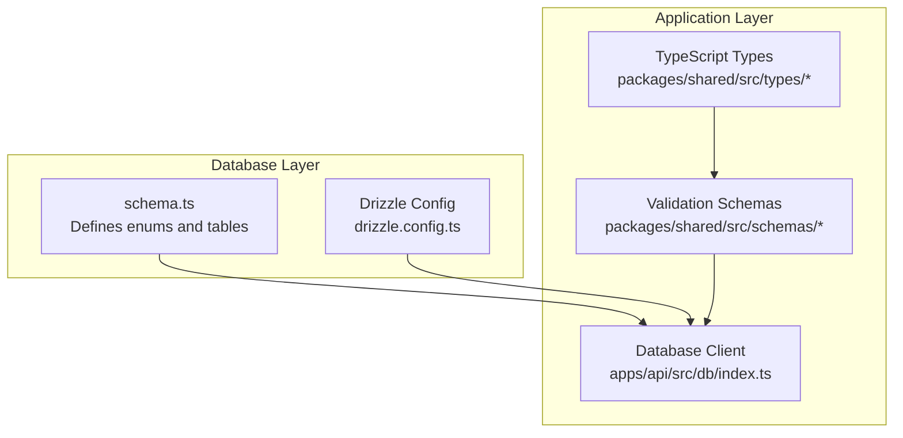
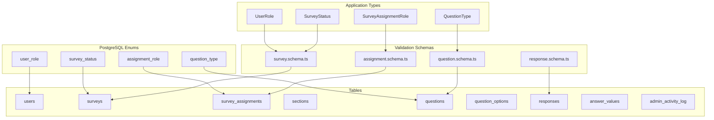
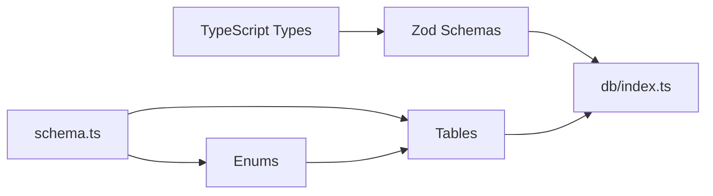

# Data Types, Constraints, and Validation Rules

<cite>
**Referenced Files in This Document**
- [schema.ts](file://apps/api/src/db/schema.ts)
- [index.ts](file://apps/api/src/db/index.ts)
- [drizzle.config.ts](file://apps/api/drizzle.config.ts)
- [assignment.schema.ts](file://packages/shared/src/schemas/assignment.schema.ts)
- [question.schema.ts](file://packages/shared/src/schemas/question.schema.ts)
- [response.schema.ts](file://packages/shared/src/schemas/response.schema.ts)
- [survey.schema.ts](file://packages/shared/src/schemas/survey.schema.ts)
- [user.ts](file://packages/shared/src/types/user.ts)
- [survey.ts](file://packages/shared/src/types/survey.ts)
- [question.ts](file://packages/shared/src/types/question.ts)
- [response.ts](file://packages/shared/src/types/response.ts)
</cite>

## Table of Contents
1. [Introduction](#introduction)
2. [Project Structure](#project-structure)
3. [Core Components](#core-components)
4. [Architecture Overview](#architecture-overview)
5. [Detailed Component Analysis](#detailed-component-analysis)
6. [Dependency Analysis](#dependency-analysis)
7. [Performance Considerations](#performance-considerations)
8. [Troubleshooting Guide](#troubleshooting-guide)
9. [Conclusion](#conclusion)

## Introduction
This document provides a comprehensive analysis of data types, constraints, and validation rules across all database tables in the project. It documents:
- Enum types and their allowed values with business meanings
- Field definitions, data types, length constraints, and defaults
- Primary keys, unique constraints, and composite indexes
- Check constraints, not-null requirements, and validation rules
- Examples of valid data entries and constraint violations
- Type safety benefits provided by TypeScript enums mapped to PostgreSQL enums
- Database-level and application-level validation strategies

## Project Structure
The database schema is defined in a single Drizzle ORM schema file and consumed by the API application. Shared validation schemas and TypeScript types define application-level constraints and type safety.

**Diagram sources**
- [schema.ts:1-247](file://apps/api/src/db/schema.ts#L1-L247)
- [drizzle.config.ts:1-11](file://apps/api/drizzle.config.ts#L1-L11)
- [index.ts:1-9](file://apps/api/src/db/index.ts#L1-L9)
- [user.ts:1-22](file://packages/shared/src/types/user.ts#L1-L22)
- [survey.ts:1-50](file://packages/shared/src/types/survey.ts#L1-L50)
- [question.ts:1-66](file://packages/shared/src/types/question.ts#L1-L66)
- [response.ts:1-53](file://packages/shared/src/types/response.ts#L1-L53)
- [assignment.schema.ts:1-20](file://packages/shared/src/schemas/assignment.schema.ts#L1-L20)
- [question.schema.ts:1-65](file://packages/shared/src/schemas/question.schema.ts#L1-L65)
- [response.schema.ts:1-24](file://packages/shared/src/schemas/response.schema.ts#L1-L24)
- [survey.schema.ts:1-22](file://packages/shared/src/schemas/survey.schema.ts#L1-L22)

**Section sources**
- [schema.ts:1-247](file://apps/api/src/db/schema.ts#L1-L247)
- [drizzle.config.ts:1-11](file://apps/api/drizzle.config.ts#L1-L11)
- [index.ts:1-9](file://apps/api/src/db/index.ts#L1-L9)

## Core Components
This section summarizes the database enums and their business meanings, along with the complete set of tables and their constraints.

- Enums
  - user_role: admin, editor, viewer, user
  - survey_status: draft, published, closed
  - assignment_role: editor, viewer
  - question_type: short_text, long_text, single_choice, multiple_choice, dropdown, linear_scale, rating, yes_no, date, number, ranking, matrix

- Users
  - Fields: id (UUID, PK, defaultRandom), googleId (varchar 255, unique, notNull), email (varchar 255, unique, notNull), name (varchar 255), avatarUrl (varchar 500), role (user_role, default user, notNull), isAdmin (boolean, default false, notNull), createdAt (timestamp with timezone, defaultNow, notNull), lastLogin (timestamp with timezone)
  - Unique constraints: googleId, email
  - Not-null constraints: googleId, email, role, isAdmin, createdAt

- Surveys
  - Fields: id (UUID, PK, defaultRandom), title (varchar 200, notNull), description (text), status (survey_status, default draft, notNull), createdBy (UUID, references users.id cascade), publishedAt (timestamp with timezone), closesAt (timestamp with timezone), createdAt (timestamp with timezone, defaultNow, notNull), updatedAt (timestamp with timezone, defaultNow, notNull)
  - Not-null constraints: title, status, createdBy, createdAt, updatedAt
  - Foreign key: createdBy -> users.id (onDelete: cascade)

- Survey Assignments
  - Fields: id (UUID, PK, defaultRandom), surveyId (UUID, notNull, references surveys.id cascade), userId (UUID, notNull, references users.id cascade), role (assignment_role, notNull), canEdit (boolean, default false, notNull), canView (boolean, default true, notNull), canExport (boolean, default false, notNull), assignedBy (UUID, notNull, references users.id cascade), assignedAt (timestamp with timezone, defaultNow, notNull)
  - Unique constraints: (surveyId, userId)
  - Indexes: assignments_survey_idx(surveyId), assignments_user_idx(userId)
  - Not-null constraints: surveyId, userId, role, canEdit, canView, canExport, assignedBy, assignedAt
  - Foreign keys: surveyId -> surveys.id (onDelete: cascade), userId -> users.id (onDelete: cascade), assignedBy -> users.id (onDelete: cascade)

- Sections
  - Fields: id (UUID, PK, defaultRandom), surveyId (UUID, notNull, references surveys.id cascade), title (varchar 200, notNull), description (text), orderIndex (integer, notNull), createdAt (timestamp with timezone, defaultNow, notNull)
  - Indexes: sections_survey_idx(surveyId)
  - Not-null constraints: title, orderIndex, createdAt
  - Foreign key: surveyId -> surveys.id (onDelete: cascade)

- Questions
  - Fields: id (UUID, PK, defaultRandom), sectionId (UUID, notNull, references sections.id cascade), questionType (question_type, notNull), title (varchar 500, notNull), description (text), isRequired (boolean, default true, notNull), orderIndex (integer, notNull), scaleMin (integer), scaleMax (integer), scaleMinLabel (varchar 50), scaleMaxLabel (varchar 50), createdAt (timestamp with timezone, defaultNow, notNull)
  - Indexes: questions_section_idx(sectionId)
  - Not-null constraints: questionType, title, isRequired, orderIndex, createdAt
  - Foreign key: sectionId -> sections.id (onDelete: cascade)

- Question Options
  - Fields: id (UUID, PK, defaultRandom), questionId (UUID, notNull, references questions.id cascade), label (varchar 200, notNull), orderIndex (integer, notNull), isOther (boolean, default false, notNull)
  - Indexes: options_question_idx(questionId)
  - Not-null constraints: label, orderIndex, isOther
  - Foreign key: questionId -> questions.id (onDelete: cascade)

- Responses
  - Fields: id (UUID, PK, defaultRandom), surveyId (UUID, notNull, references surveys.id cascade), userId (UUID, notNull, references users.id cascade), submittedAt (timestamp with timezone, defaultNow, notNull), ipAddress (varchar 45), userAgent (varchar 500), turnstileToken (varchar 500)
  - Unique constraints: (surveyId, userId)
  - Indexes: responses_survey_idx(surveyId), responses_user_idx(userId)
  - Not-null constraints: surveyId, userId, submittedAt
  - Foreign keys: surveyId -> surveys.id (onDelete: cascade), userId -> users.id (onDelete: cascade)

- Answer Values
  - Fields: id (UUID, PK, defaultRandom), responseId (UUID, notNull, references responses.id cascade), questionId (UUID, notNull, references questions.id cascade), optionId (UUID, references questionOptions.id set null), textValue (text), numberValue (integer), rankValue (integer), isOtherText (boolean, default false, notNull)
  - Indexes: answers_response_idx(responseId), answers_question_idx(questionId)
  - Not-null constraints: isOtherText
  - Foreign keys: responseId -> responses.id (onDelete: cascade), questionId -> questions.id (onDelete: cascade), optionId -> questionOptions.id (onDelete: set null)

- Admin Activity Log
  - Fields: id (UUID, PK, defaultRandom), userId (UUID, notNull, references users.id cascade), action (varchar 100, notNull), targetType (varchar 50, notNull), targetId (UUID), details (jsonb), ipAddress (varchar 45), createdAt (timestamp with timezone, defaultNow, notNull)
  - Indexes: activity_log_user_idx(userId), activity_log_created_idx(createdAt)
  - Not-null constraints: action, targetType, userId, createdAt
  - Foreign key: userId -> users.id (onDelete: cascade)

**Section sources**
- [schema.ts:19-35](file://apps/api/src/db/schema.ts#L19-L35)
- [schema.ts:41-51](file://apps/api/src/db/schema.ts#L41-L51)
- [schema.ts:57-69](file://apps/api/src/db/schema.ts#L57-L69)
- [schema.ts:75-99](file://apps/api/src/db/schema.ts#L75-L99)
- [schema.ts:105-120](file://apps/api/src/db/schema.ts#L105-L120)
- [schema.ts:126-147](file://apps/api/src/db/schema.ts#L126-L147)
- [schema.ts:153-167](file://apps/api/src/db/schema.ts#L153-L167)
- [schema.ts:173-196](file://apps/api/src/db/schema.ts#L173-L196)
- [schema.ts:202-222](file://apps/api/src/db/schema.ts#L202-L222)
- [schema.ts:228-246](file://apps/api/src/db/schema.ts#L228-L246)

## Architecture Overview
The system enforces type safety and validation at two levels:
- Database level: enums, not-null constraints, unique indexes, foreign keys, and indexes
- Application level: Zod schemas and TypeScript types

**Diagram sources**
- [schema.ts:19-35](file://apps/api/src/db/schema.ts#L19-L35)
- [schema.ts:41-246](file://apps/api/src/db/schema.ts#L41-L246)
- [user.ts:1-22](file://packages/shared/src/types/user.ts#L1-L22)
- [survey.ts:1-50](file://packages/shared/src/types/survey.ts#L1-L50)
- [question.ts:1-66](file://packages/shared/src/types/question.ts#L1-L66)
- [survey.schema.ts:1-22](file://packages/shared/src/schemas/survey.schema.ts#L1-L22)
- [assignment.schema.ts:1-20](file://packages/shared/src/schemas/assignment.schema.ts#L1-L20)
- [question.schema.ts:1-65](file://packages/shared/src/schemas/question.schema.ts#L1-L65)
- [response.schema.ts:1-24](file://packages/shared/src/schemas/response.schema.ts#L1-L24)

## Detailed Component Analysis

### Enum Types and Business Meanings
- user_role
  - Allowed values: admin, editor, viewer, user
  - Business meaning: Defines platform-wide user permissions and access levels
- survey_status
  - Allowed values: draft, published, closed
  - Business meaning: Lifecycle state of a survey (editable, visible to respondents, archived)
- assignment_role
  - Allowed values: editor, viewer
  - Business meaning: Per-survey collaboration roles for users
- question_type
  - Allowed values: short_text, long_text, single_choice, multiple_choice, dropdown, linear_scale, rating, yes_no, date, number, ranking, matrix
  - Business meaning: Controls rendering and validation behavior for survey questions

**Section sources**
- [schema.ts:19-35](file://apps/api/src/db/schema.ts#L19-L35)
- [user.ts:1-22](file://packages/shared/src/types/user.ts#L1-L22)
- [survey.ts:3-3](file://packages/shared/src/types/survey.ts#L3-L3)
- [question.ts:1-13](file://packages/shared/src/types/question.ts#L1-L13)
- [survey.schema.ts:15-17](file://packages/shared/src/schemas/survey.schema.ts#L15-L17)
- [assignment.schema.ts:5-5](file://packages/shared/src/schemas/assignment.schema.ts#L5-L5)
- [question.schema.ts:3-16](file://packages/shared/src/schemas/question.schema.ts#L3-L16)

### Users Table
- Data types and constraints
  - id: UUID, primary key, defaultRandom
  - googleId: varchar(255), unique, notNull
  - email: varchar(255), unique, notNull
  - name: varchar(255)
  - avatarUrl: varchar(500)
  - role: user_role enum, default user, notNull
  - isAdmin: boolean, default false, notNull
  - createdAt: timestamp with timezone, defaultNow, notNull
  - lastLogin: timestamp with timezone
- Validation rules
  - Unique constraints on googleId and email
  - Not-null constraints on googleId, email, role, isAdmin, createdAt
- Examples
  - Valid: { googleId: "123456", email: "user@example.com", role: "user", isAdmin: false }
  - Constraint violation: Duplicate email or missing role

**Section sources**
- [schema.ts:41-51](file://apps/api/src/db/schema.ts#L41-L51)
- [user.ts:3-13](file://packages/shared/src/types/user.ts#L3-L13)

### Surveys Table
- Data types and constraints
  - id: UUID, primary key, defaultRandom
  - title: varchar(200), notNull
  - description: text
  - status: survey_status enum, default draft, notNull
  - createdBy: UUID, notNull, references users(id) cascade
  - publishedAt: timestamp with timezone
  - closesAt: timestamp with timezone
  - createdAt: timestamp with timezone, defaultNow, notNull
  - updatedAt: timestamp with timezone, defaultNow, notNull
- Validation rules
  - Not-null constraints on title, status, createdBy, createdAt, updatedAt
  - Cascade delete on user deletion affects surveys
- Examples
  - Valid: { title: "Customer Feedback", status: "draft", createdBy: "..." }
  - Constraint violation: Non-existent createdBy or invalid status value

**Section sources**
- [schema.ts:57-69](file://apps/api/src/db/schema.ts#L57-L69)
- [survey.ts:5-15](file://packages/shared/src/types/survey.ts#L5-L15)
- [survey.schema.ts:3-7](file://packages/shared/src/schemas/survey.schema.ts#L3-L7)

### Survey Assignments Table
- Data types and constraints
  - id: UUID, primary key, defaultRandom
  - surveyId: UUID, notNull, references surveys(id) cascade
  - userId: UUID, notNull, references users(id) cascade
  - role: assignment_role enum, notNull
  - canEdit: boolean, default false, notNull
  - canView: boolean, default true, notNull
  - canExport: boolean, default false, notNull
  - assignedBy: UUID, notNull, references users(id) cascade
  - assignedAt: timestamp with timezone, defaultNow, notNull
- Unique constraints
  - (surveyId, userId): Prevents duplicate assignments
- Indexes
  - assignments_survey_idx(surveyId)
  - assignments_user_idx(userId)
- Validation rules
  - Unique constraint prevents duplicate assignments
  - Not-null constraints on all fields except optional timestamps
  - Cascade deletes on survey/user deletion
- Examples
  - Valid: { surveyId: "...", userId: "...", role: "editor", canEdit: true, assignedBy: "..." }
  - Constraint violation: Duplicate (surveyId, userId) pair

**Section sources**
- [schema.ts:75-99](file://apps/api/src/db/schema.ts#L75-L99)
- [survey.ts:37-49](file://packages/shared/src/types/survey.ts#L37-L49)
- [assignment.schema.ts:3-16](file://packages/shared/src/schemas/assignment.schema.ts#L3-L16)

### Sections Table
- Data types and constraints
  - id: UUID, primary key, defaultRandom
  - surveyId: UUID, notNull, references surveys(id) cascade
  - title: varchar(200), notNull
  - description: text
  - orderIndex: integer, notNull
  - createdAt: timestamp with timezone, defaultNow, notNull
- Indexes
  - sections_survey_idx(surveyId)
- Validation rules
  - Not-null constraints on title, orderIndex, createdAt
- Examples
  - Valid: { surveyId: "...", title: "Section A", orderIndex: 0 }
  - Constraint violation: Missing title or negative orderIndex

**Section sources**
- [schema.ts:105-120](file://apps/api/src/db/schema.ts#L105-L120)
- [survey.ts:22-29](file://packages/shared/src/types/survey.ts#L22-L29)

### Questions Table
- Data types and constraints
  - id: UUID, primary key, defaultRandom
  - sectionId: UUID, notNull, references sections(id) cascade
  - questionType: question_type enum, notNull
  - title: varchar(500), notNull
  - description: text
  - isRequired: boolean, default true, notNull
  - orderIndex: integer, notNull
  - scaleMin: integer
  - scaleMax: integer
  - scaleMinLabel: varchar(50)
  - scaleMaxLabel: varchar(50)
  - createdAt: timestamp with timezone, defaultNow, notNull
- Indexes
  - questions_section_idx(sectionId)
- Validation rules
  - Not-null constraints on questionType, title, isRequired, orderIndex, createdAt
- Examples
  - Valid: { sectionId: "...", questionType: "single_choice", title: "Favorite color?", isRequired: true, orderIndex: 1 }
  - Constraint violation: Invalid questionType or missing title

**Section sources**
- [schema.ts:126-147](file://apps/api/src/db/schema.ts#L126-L147)
- [question.ts:30-43](file://packages/shared/src/types/question.ts#L30-L43)
- [question.schema.ts:18-35](file://packages/shared/src/schemas/question.schema.ts#L18-L35)

### Question Options Table
- Data types and constraints
  - id: UUID, primary key, defaultRandom
  - questionId: UUID, notNull, references questions(id) cascade
  - label: varchar(200), notNull
  - orderIndex: integer, notNull
  - isOther: boolean, default false, notNull
- Indexes
  - options_question_idx(questionId)
- Validation rules
  - Not-null constraints on label, orderIndex, isOther
- Examples
  - Valid: { questionId: "...", label: "Blue", orderIndex: 0, isOther: false }
  - Constraint violation: Missing label or negative orderIndex

**Section sources**
- [schema.ts:153-167](file://apps/api/src/db/schema.ts#L153-L167)
- [question.ts:45-51](file://packages/shared/src/types/question.ts#L45-L51)
- [question.schema.ts:50-58](file://packages/shared/src/schemas/question.schema.ts#L50-L58)

### Responses Table
- Data types and constraints
  - id: UUID, primary key, defaultRandom
  - surveyId: UUID, notNull, references surveys(id) cascade
  - userId: UUID, notNull, references users(id) cascade
  - submittedAt: timestamp with timezone, defaultNow, notNull
  - ipAddress: varchar(45)
  - userAgent: varchar(500)
  - turnstileToken: varchar(500)
- Unique constraints
  - (surveyId, userId): Ensures one response per user per survey
- Indexes
  - responses_survey_idx(surveyId)
  - responses_user_idx(userId)
- Validation rules
  - Unique constraint prevents duplicate responses
  - Not-null constraints on surveyId, userId, submittedAt
- Examples
  - Valid: { surveyId: "...", userId: "...", submittedAt: "2023-01-01T00:00:00Z" }
  - Constraint violation: Duplicate (surveyId, userId) pair

**Section sources**
- [schema.ts:173-196](file://apps/api/src/db/schema.ts#L173-L196)
- [response.ts:1-8](file://packages/shared/src/types/response.ts#L1-L8)
- [response.schema.ts:12-20](file://packages/shared/src/schemas/response.schema.ts#L12-L20)

### Answer Values Table
- Data types and constraints
  - id: UUID, primary key, defaultRandom
  - responseId: UUID, notNull, references responses(id) cascade
  - questionId: UUID, notNull, references questions(id) cascade
  - optionId: UUID, references questionOptions(id) set null
  - textValue: text
  - numberValue: integer
  - rankValue: integer
  - isOtherText: boolean, default false, notNull
- Indexes
  - answers_response_idx(responseId)
  - answers_question_idx(questionId)
- Validation rules
  - Not-null constraint on isOtherText
- Examples
  - Valid: { responseId: "...", questionId: "...", isOtherText: false }
  - Constraint violation: Missing isOtherText

**Section sources**
- [schema.ts:202-222](file://apps/api/src/db/schema.ts#L202-L222)
- [response.ts:10-19](file://packages/shared/src/types/response.ts#L10-L19)
- [response.schema.ts:3-10](file://packages/shared/src/schemas/response.schema.ts#L3-L10)

### Admin Activity Log Table
- Data types and constraints
  - id: UUID, primary key, defaultRandom
  - userId: UUID, notNull, references users(id) cascade
  - action: varchar(100), notNull
  - targetType: varchar(50), notNull
  - targetId: UUID
  - details: jsonb
  - ipAddress: varchar(45)
  - createdAt: timestamp with timezone, defaultNow, notNull
- Indexes
  - activity_log_user_idx(userId)
  - activity_log_created_idx(createdAt)
- Validation rules
  - Not-null constraints on action, targetType, userId, createdAt
- Examples
  - Valid: { userId: "...", action: "survey.create", targetType: "surveys", createdAt: "2023-01-01T00:00:00Z" }
  - Constraint violation: Missing action or targetType

**Section sources**
- [schema.ts:228-246](file://apps/api/src/db/schema.ts#L228-L246)

### Validation Rules and Examples

#### Database-Level Validation
- Enum enforcement: PostgreSQL enums restrict values to predefined sets
- Not-null constraints: Prevent insertion/update of null where required
- Unique constraints: Enforce uniqueness across columns or combinations
- Foreign keys: Maintain referential integrity with cascading deletes
- Indexes: Improve query performance on frequently filtered columns

Examples of constraint violations:
- Inserting a survey with status "invalid" will fail because only draft, published, closed are allowed
- Creating a question with questionType "invalid_type" will fail
- Attempting to insert duplicate (surveyId, userId) in responses will fail
- Assigning a user to a non-existent surveyId will fail due to foreign key constraint

#### Application-Level Validation
- Zod schemas enforce business rules and provide user-friendly error messages
- TypeScript types ensure compile-time safety and IDE support

Examples of application-level validation failures:
- Submitting a response with fewer than one answer or more than 200 answers will fail
- Creating a question with title exceeding 500 characters or options with labels exceeding 200 characters will fail
- Updating a survey with closesAt set to an invalid datetime string will fail

**Section sources**
- [survey.schema.ts:3-13](file://packages/shared/src/schemas/survey.schema.ts#L3-L13)
- [question.schema.ts:18-39](file://packages/shared/src/schemas/question.schema.ts#L18-L39)
- [response.schema.ts:12-20](file://packages/shared/src/schemas/response.schema.ts#L12-L20)
- [assignment.schema.ts:3-16](file://packages/shared/src/schemas/assignment.schema.ts#L3-L16)

## Dependency Analysis
The database schema defines enums and tables, while the application consumes them through Drizzle ORM and Zod schemas.

**Diagram sources**
- [schema.ts:19-35](file://apps/api/src/db/schema.ts#L19-L35)
- [schema.ts:41-246](file://apps/api/src/db/schema.ts#L41-L246)
- [user.ts:1-22](file://packages/shared/src/types/user.ts#L1-L22)
- [survey.ts:1-50](file://packages/shared/src/types/survey.ts#L1-L50)
- [question.ts:1-66](file://packages/shared/src/types/question.ts#L1-L66)
- [response.ts:1-53](file://packages/shared/src/types/response.ts#L1-L53)
- [survey.schema.ts:1-22](file://packages/shared/src/schemas/survey.schema.ts#L1-L22)
- [assignment.schema.ts:1-20](file://packages/shared/src/schemas/assignment.schema.ts#L1-L20)
- [question.schema.ts:1-65](file://packages/shared/src/schemas/question.schema.ts#L1-L65)
- [response.schema.ts:1-24](file://packages/shared/src/schemas/response.schema.ts#L1-L24)
- [index.ts:1-9](file://apps/api/src/db/index.ts#L1-L9)

**Section sources**
- [schema.ts:1-247](file://apps/api/src/db/schema.ts#L1-L247)
- [index.ts:1-9](file://apps/api/src/db/index.ts#L1-L9)

## Performance Considerations
- Indexes on foreign keys and frequently queried columns improve query performance
- Unique constraints prevent duplicates and enable efficient lookups
- Timestamps with timezone ensure consistent time handling across deployments
- JSONB fields allow flexible storage for logs and metadata

## Troubleshooting Guide
Common issues and resolutions:
- Enum mismatch errors: Ensure values match the allowed enum sets
- Unique constraint violations: Check for existing records before insert
- Foreign key violations: Verify referenced records exist
- Zod validation errors: Review schema constraints and adjust input accordingly

**Section sources**
- [schema.ts:41-246](file://apps/api/src/db/schema.ts#L41-L246)
- [survey.schema.ts:3-13](file://packages/shared/src/schemas/survey.schema.ts#L3-L13)
- [question.schema.ts:18-39](file://packages/shared/src/schemas/question.schema.ts#L18-L39)
- [response.schema.ts:12-20](file://packages/shared/src/schemas/response.schema.ts#L12-L20)
- [assignment.schema.ts:3-16](file://packages/shared/src/schemas/assignment.schema.ts#L3-L16)

## Conclusion
The project implements robust data validation through a combination of PostgreSQL enums and constraints, along with comprehensive Zod schemas and TypeScript types. This dual-layer approach ensures data integrity at the database level and provides strong developer experience with compile-time safety and clear validation feedback at the application level.