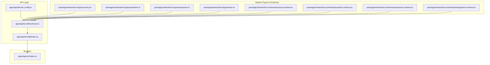
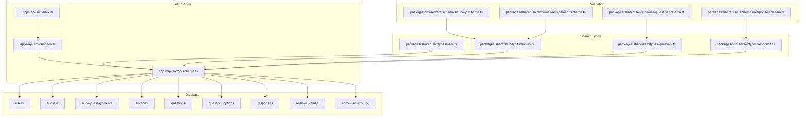
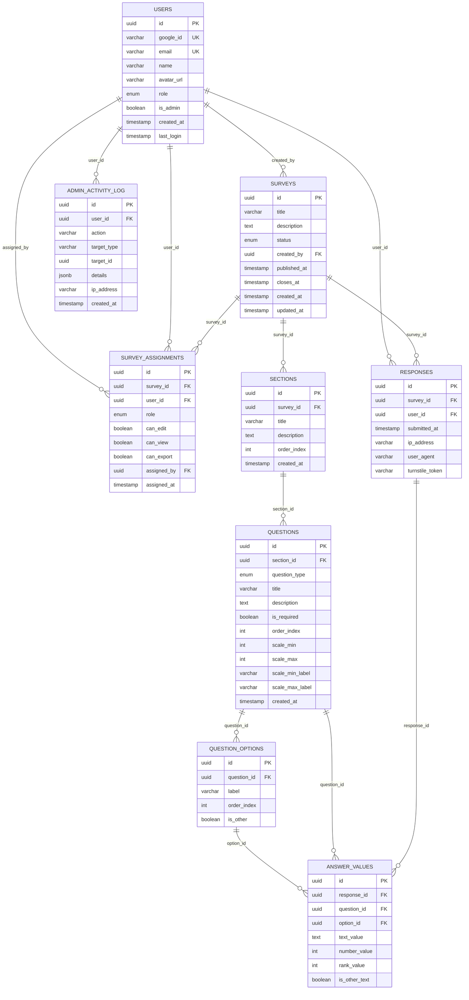
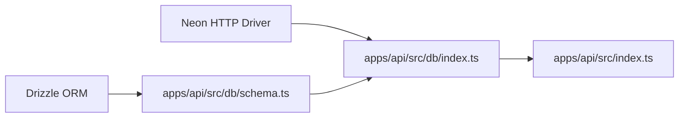

# Database Schema Design

<cite>
**Referenced Files in This Document**
- [schema.ts](file://apps/api/src/db/schema.ts)
- [drizzle.config.ts](file://apps/api/drizzle.config.ts)
- [index.ts](file://apps/api/src/db/index.ts)
- [survey.schema.ts](file://packages/shared/src/schemas/survey.schema.ts)
- [question.schema.ts](file://packages/shared/src/schemas/question.schema.ts)
- [response.schema.ts](file://packages/shared/src/schemas/response.schema.ts)
- [assignment.schema.ts](file://packages/shared/src/schemas/assignment.schema.ts)
- [survey.ts](file://packages/shared/src/types/survey.ts)
- [question.ts](file://packages/shared/src/types/question.ts)
- [response.ts](file://packages/shared/src/types/response.ts)
- [user.ts](file://packages/shared/src/types/user.ts)
- [index.ts](file://apps/api/src/index.ts)
</cite>

## Table of Contents
1. [Introduction](#introduction)
2. [Project Structure](#project-structure)
3. [Core Components](#core-components)
4. [Architecture Overview](#architecture-overview)
5. [Detailed Component Analysis](#detailed-component-analysis)
6. [Dependency Analysis](#dependency-analysis)
7. [Performance Considerations](#performance-considerations)
8. [Troubleshooting Guide](#troubleshooting-guide)
9. [Conclusion](#conclusion)
10. [Appendices](#appendices)

## Introduction
This document provides comprehensive database schema documentation for a survey management system. It covers the complete 12-table relational schema supporting surveys, questions, responses, and user management. The schema emphasizes type safety through PostgreSQL enums, enforces referential integrity with foreign keys, and defines indexes for optimal query performance. It also documents data validation rules, access control via RBAC, and operational considerations such as caching, performance tuning, and data lifecycle management.

## Project Structure
The database schema is defined in a centralized Drizzle ORM module and consumed by the API server. Shared validation schemas and TypeScript types ensure consistency across the frontend and backend.

**Diagram sources**
- [schema.ts:1-247](file://apps/api/src/db/schema.ts#L1-L247)
- [drizzle.config.ts:1-11](file://apps/api/drizzle.config.ts#L1-L11)
- [index.ts:1-9](file://apps/api/src/db/index.ts#L1-L9)
- [survey.ts:1-50](file://packages/shared/src/types/survey.ts#L1-L50)
- [question.ts:1-66](file://packages/shared/src/types/question.ts#L1-L66)
- [response.ts:1-53](file://packages/shared/src/types/response.ts#L1-L53)
- [user.ts:1-22](file://packages/shared/src/types/user.ts#L1-L22)
- [survey.schema.ts:1-22](file://packages/shared/src/schemas/survey.schema.ts#L1-L22)
- [question.schema.ts:1-65](file://packages/shared/src/schemas/question.schema.ts#L1-L65)
- [response.schema.ts:1-24](file://packages/shared/src/schemas/response.schema.ts#L1-L24)
- [assignment.schema.ts:1-20](file://packages/shared/src/schemas/assignment.schema.ts#L1-L20)
- [index.ts:1-67](file://apps/api/src/index.ts#L1-L67)

**Section sources**
- [schema.ts:1-247](file://apps/api/src/db/schema.ts#L1-L247)
- [drizzle.config.ts:1-11](file://apps/api/drizzle.config.ts#L1-L11)
- [index.ts:1-9](file://apps/api/src/db/index.ts#L1-L9)
- [survey.ts:1-50](file://packages/shared/src/types/survey.ts#L1-L50)
- [question.ts:1-66](file://packages/shared/src/types/question.ts#L1-L66)
- [response.ts:1-53](file://packages/shared/src/types/response.ts#L1-L53)
- [user.ts:1-22](file://packages/shared/src/types/user.ts#L1-L22)
- [survey.schema.ts:1-22](file://packages/shared/src/schemas/survey.schema.ts#L1-L22)
- [question.schema.ts:1-65](file://packages/shared/src/schemas/question.schema.ts#L1-L65)
- [response.schema.ts:1-24](file://packages/shared/src/schemas/response.schema.ts#L1-L24)
- [assignment.schema.ts:1-20](file://packages/shared/src/schemas/assignment.schema.ts#L1-L20)
- [index.ts:1-67](file://apps/api/src/index.ts#L1-L67)

## Core Components
This section outlines the 12-table schema, enumerations, and their relationships. Each table’s primary keys, unique constraints, indexes, and foreign keys are documented alongside data types and validation rules.

- Enumerations
  - user_role: admin, editor, viewer, user
  - survey_status: draft, published, closed
  - assignment_role: editor, viewer
  - question_type: short_text, long_text, single_choice, multiple_choice, dropdown, linear_scale, rating, yes_no, date, number, ranking, matrix

- Users
  - Fields: id (UUID, PK), google_id (varchar, unique), email (varchar, unique), name, avatar_url, role (enum), isAdmin (boolean), created_at (timestamp), last_login (timestamp)
  - Unique constraints: google_id, email
  - Validation rules: email format enforced by database; role defaults to user; isAdmin defaults to false

- Surveys
  - Fields: id (UUID, PK), title (varchar), description (text), status (enum), created_by (UUID, FK to users), published_at (timestamp), closes_at (timestamp), created_at (timestamp), updated_at (timestamp)
  - Foreign keys: created_by -> users(id) with cascade delete
  - Indexes: none explicitly defined
  - Validation rules: title length <= 200; status defaults to draft

- Survey Assignments
  - Fields: id (UUID, PK), survey_id (UUID, FK), user_id (UUID, FK), role (enum), can_edit (boolean), can_view (boolean), can_export (boolean), assigned_by (UUID, FK), assigned_at (timestamp)
  - Unique constraint: (survey_id, user_id)
  - Foreign keys: survey_id -> surveys(id), user_id -> users(id), assigned_by -> users(id) with cascade delete
  - Indexes: assignments_survey_idx, assignments_user_idx
  - Validation rules: can_view defaults to true; can_edit/can_export default to false

- Sections
  - Fields: id (UUID, PK), survey_id (UUID, FK), title (varchar), description (text), order_index (integer), created_at (timestamp)
  - Foreign keys: survey_id -> surveys(id) with cascade delete
  - Indexes: sections_survey_idx
  - Validation rules: title length <= 200; order_index >= 0

- Questions
  - Fields: id (UUID, PK), section_id (UUID, FK), question_type (enum), title (varchar), description (text), is_required (boolean), order_index (integer), scale_min (integer), scale_max (integer), scale_min_label (varchar), scale_max_label (varchar), created_at (timestamp)
  - Foreign keys: section_id -> sections(id) with cascade delete
  - Indexes: questions_section_idx
  - Validation rules: title length <= 500; is_required defaults to true; scale bounds validated by application logic

- Question Options
  - Fields: id (UUID, PK), question_id (UUID, FK), label (varchar), order_index (integer), is_other (boolean)
  - Foreign keys: question_id -> questions(id) with cascade delete
  - Indexes: options_question_idx
  - Validation rules: label length <= 200; is_other defaults to false

- Responses
  - Fields: id (UUID, PK), survey_id (UUID, FK), user_id (UUID, FK), submitted_at (timestamp), ip_address (varchar), user_agent (varchar), turnstile_token (varchar)
  - Unique constraint: (survey_id, user_id)
  - Foreign keys: survey_id -> surveys(id), user_id -> users(id) with cascade delete
  - Indexes: responses_survey_idx, responses_user_idx
  - Validation rules: ip_address length <= 45; user_agent length <= 500; turnstile_token length <= 500

- Answer Values
  - Fields: id (UUID, PK), response_id (UUID, FK), question_id (UUID, FK), option_id (UUID, FK), text_value (text), number_value (integer), rank_value (integer), is_other_text (boolean)
  - Foreign keys: response_id -> responses(id), question_id -> questions(id), option_id -> question_options(id) with set null
  - Indexes: answers_response_idx, answers_question_idx
  - Validation rules: is_other_text defaults to false; mutual exclusivity of value types enforced by application logic

- Admin Activity Log
  - Fields: id (UUID, PK), user_id (UUID, FK), action (varchar), target_type (varchar), target_id (UUID), details (jsonb), ip_address (varchar), created_at (timestamp)
  - Foreign keys: user_id -> users(id) with cascade delete
  - Indexes: activity_log_user_idx, activity_log_created_idx
  - Validation rules: action length <= 100; target_type length <= 50; ip_address length <= 45

**Section sources**
- [schema.ts:1-247](file://apps/api/src/db/schema.ts#L1-L247)
- [survey.schema.ts:1-22](file://packages/shared/src/schemas/survey.schema.ts#L1-L22)
- [question.schema.ts:1-65](file://packages/shared/src/schemas/question.schema.ts#L1-L65)
- [response.schema.ts:1-24](file://packages/shared/src/schemas/response.schema.ts#L1-L24)
- [assignment.schema.ts:1-20](file://packages/shared/src/schemas/assignment.schema.ts#L1-L20)
- [survey.ts:1-50](file://packages/shared/src/types/survey.ts#L1-L50)
- [question.ts:1-66](file://packages/shared/src/types/question.ts#L1-L66)
- [response.ts:1-53](file://packages/shared/src/types/response.ts#L1-L53)
- [user.ts:1-22](file://packages/shared/src/types/user.ts#L1-L22)

## Architecture Overview
The database layer uses Drizzle ORM with PostgreSQL enums and indexes. The API server connects to the database via Neon HTTP driver and exposes routes for health checks and future endpoints. Shared validation schemas and TypeScript types ensure consistent data contracts across the stack.

**Diagram sources**
- [schema.ts:1-247](file://apps/api/src/db/schema.ts#L1-L247)
- [index.ts:1-9](file://apps/api/src/db/index.ts#L1-L9)
- [index.ts:1-67](file://apps/api/src/index.ts#L1-L67)
- [user.ts:1-22](file://packages/shared/src/types/user.ts#L1-L22)
- [survey.ts:1-50](file://packages/shared/src/types/survey.ts#L1-L50)
- [question.ts:1-66](file://packages/shared/src/types/question.ts#L1-L66)
- [response.ts:1-53](file://packages/shared/src/types/response.ts#L1-L53)
- [survey.schema.ts:1-22](file://packages/shared/src/schemas/survey.schema.ts#L1-L22)
- [question.schema.ts:1-65](file://packages/shared/src/schemas/question.schema.ts#L1-L65)
- [response.schema.ts:1-24](file://packages/shared/src/schemas/response.schema.ts#L1-L24)
- [assignment.schema.ts:1-20](file://packages/shared/src/schemas/assignment.schema.ts#L1-L20)

## Detailed Component Analysis

### Entity Relationship Model
The schema enforces a hierarchical structure: Users create Surveys; Surveys contain Sections; Sections contain Questions; Questions may have Options; Users respond to Surveys via Responses; Answers are stored in Answer Values linked to Questions and Options.

**Diagram sources**
- [schema.ts:1-247](file://apps/api/src/db/schema.ts#L1-L247)

### Enum-Based Type Safety
PostgreSQL enums enforce strict typing for roles, statuses, and question types. Application-level Zod schemas mirror these constraints to ensure frontend/backend consistency.

- user_role: admin, editor, viewer, user
- survey_status: draft, published, closed
- assignment_role: editor, viewer
- question_type: short_text, long_text, single_choice, multiple_choice, dropdown, linear_scale, rating, yes_no, date, number, ranking, matrix

Validation rules:
- Survey creation/update: title length limits, optional description, optional closesAt datetime
- Question creation: questionType enum, title length limits, optional description, isRequired default true, optional scaleMin/scaleMax with application-defined bounds, optional labels
- Response submission: answers array min 1, max 200, each answer validates mutually exclusive value fields

**Section sources**
- [schema.ts:19-35](file://apps/api/src/db/schema.ts#L19-L35)
- [survey.schema.ts:1-22](file://packages/shared/src/schemas/survey.schema.ts#L1-L22)
- [question.schema.ts:1-65](file://packages/shared/src/schemas/question.schema.ts#L1-L65)
- [response.schema.ts:1-24](file://packages/shared/src/schemas/response.schema.ts#L1-L24)
- [assignment.schema.ts:1-20](file://packages/shared/src/schemas/assignment.schema.ts#L1-L20)

### Data Access Patterns and Indexes
- Unique constraints:
  - users.google_id, users.email
  - survey_assignments (survey_id, user_id)
  - responses (survey_id, user_id)
- Indexes:
  - assignments_survey_idx, assignments_user_idx
  - sections_survey_idx
  - questions_section_idx
  - responses_survey_idx, responses_user_idx
  - answers_response_idx, answers_question_idx
  - activity_log_user_idx, activity_log_created_idx

These indexes optimize frequent joins and lookups:
- Finding assignments by survey or user
- Finding sections by survey
- Finding questions by section
- Finding responses by survey or user
- Finding answers by response or question
- Filtering admin logs by user or time

**Section sources**
- [schema.ts:94-99](file://apps/api/src/db/schema.ts#L94-L99)
- [schema.ts:117-120](file://apps/api/src/db/schema.ts#L117-L120)
- [schema.ts:144-147](file://apps/api/src/db/schema.ts#L144-L147)
- [schema.ts:188-196](file://apps/api/src/db/schema.ts#L188-L196)
- [schema.ts:218-222](file://apps/api/src/db/schema.ts#L218-L222)
- [schema.ts:242-246](file://apps/api/src/db/schema.ts#L242-L246)

### Sample Data Structures
Representative structures for each major entity:

- User
  - id, googleId, email, name, avatarUrl, role, isAdmin, createdAt, lastLogin
- Survey
  - id, title, description, status, createdBy, publishedAt, closesAt, createdAt, updatedAt
- Survey Assignment
  - id, surveyId, userId, role, canEdit, canView, canExport, assignedBy, assignedAt
- Section
  - id, surveyId, title, description, orderIndex, createdAt
- Question
  - id, sectionId, questionType, title, description, isRequired, orderIndex, scaleMin, scaleMax, scaleMinLabel, scaleMaxLabel, createdAt
- Question Option
  - id, questionId, label, orderIndex, isOther
- Response
  - id, surveyId, userId, submittedAt, ipAddress, userAgent, turnstileToken
- Answer Value
  - id, responseId, questionId, optionId, textValue, numberValue, rankValue, isOtherText
- Admin Activity Log
  - id, userId, action, targetType, targetId, details, ipAddress, createdAt

**Section sources**
- [user.ts:1-22](file://packages/shared/src/types/user.ts#L1-L22)
- [survey.ts:1-50](file://packages/shared/src/types/survey.ts#L1-L50)
- [question.ts:1-66](file://packages/shared/src/types/question.ts#L1-L66)
- [response.ts:1-53](file://packages/shared/src/types/response.ts#L1-L53)

### RBAC and Access Control
- User roles: admin, editor, viewer, user
- Survey assignment roles: editor, viewer with granular permissions (can_edit, can_view, can_export)
- Access patterns:
  - Only editors can modify surveys and sections
  - Viewers can view surveys and responses
  - Admins have elevated privileges and are tracked in admin_activity_log
- Unique constraints prevent duplicate assignments per user per survey

**Section sources**
- [schema.ts:19-35](file://apps/api/src/db/schema.ts#L19-L35)
- [schema.ts:75-99](file://apps/api/src/db/schema.ts#L75-L99)
- [survey.ts:35-49](file://packages/shared/src/types/survey.ts#L35-L49)
- [user.ts:1-22](file://packages/shared/src/types/user.ts#L1-L22)

## Dependency Analysis
The API server depends on Drizzle ORM and Neon HTTP driver to connect to the database. The schema module centralizes table definitions, enums, and indexes. Shared validation schemas and TypeScript types ensure consistent contracts across the stack.

**Diagram sources**
- [schema.ts:1-247](file://apps/api/src/db/schema.ts#L1-L247)
- [index.ts:1-9](file://apps/api/src/db/index.ts#L1-L9)
- [index.ts:1-67](file://apps/api/src/index.ts#L1-L67)

**Section sources**
- [schema.ts:1-247](file://apps/api/src/db/schema.ts#L1-L247)
- [index.ts:1-9](file://apps/api/src/db/index.ts#L1-L9)
- [index.ts:1-67](file://apps/api/src/index.ts#L1-L67)

## Performance Considerations
- Index coverage:
  - Use assignments_survey_idx and assignments_user_idx for assignment queries
  - Use sections_survey_idx for section enumeration
  - Use questions_section_idx for question ordering
  - Use responses_survey_idx and responses_user_idx for response aggregation
  - Use answers_response_idx and answers_question_idx for answer retrieval
  - Use activity_log_user_idx and activity_log_created_idx for audit trails
- Query patterns:
  - Prefer filtered queries with indexed columns
  - Batch operations for reordering questions and answers
  - Limit response counts and pagination for large datasets
- Caching strategies:
  - Cache frequently accessed survey metadata and section/question lists
  - Cache user permissions per survey to reduce RBAC checks
  - Cache recent admin activity logs for dashboards
- Data types:
  - Use UUIDs for primary keys to avoid hotspots
  - Use enums for constrained fields to reduce storage and improve performance
  - Use JSONB for flexible admin log details

[No sources needed since this section provides general guidance]

## Troubleshooting Guide
Common issues and resolutions:
- Connection failures:
  - Verify DATABASE_URL environment variable is set
  - Ensure Neon service is reachable and credentials are correct
- Migration issues:
  - Confirm drizzle config points to the correct schema path
  - Run migrations using drizzle-kit CLI
- Data integrity errors:
  - Check unique constraints on users (google_id, email)
  - Validate assignment uniqueness (survey_id, user_id)
  - Validate response uniqueness (survey_id, user_id)
- Permission errors:
  - Ensure user roles and assignment permissions match intended access
  - Review admin_activity_log for suspicious activities

**Section sources**
- [drizzle.config.ts:1-11](file://apps/api/drizzle.config.ts#L1-L11)
- [index.ts:1-9](file://apps/api/src/db/index.ts#L1-L9)
- [schema.ts:41-51](file://apps/api/src/db/schema.ts#L41-L51)
- [schema.ts:75-99](file://apps/api/src/db/schema.ts#L75-L99)
- [schema.ts:173-196](file://apps/api/src/db/schema.ts#L173-L196)

## Conclusion
The database schema provides a robust foundation for a survey management system with strong type safety, referential integrity, and performance-oriented indexing. The shared validation and type definitions ensure consistency across the frontend and backend. RBAC controls access effectively, while admin activity logging supports auditing. With proper caching and migration strategies, the system can scale efficiently and remain maintainable.

[No sources needed since this section summarizes without analyzing specific files]

## Appendices

### Data Lifecycle Management and Retention Policies
- Surveys:
  - Draft vs published vs closed lifecycle
  - Automatic closure based on closes_at
- Responses:
  - One response per user per survey enforced by unique constraint
  - Retention governed by business policy (e.g., keep forever, anonymize after N years)
- Audit logs:
  - Retain admin activity logs per compliance requirements
- Data deletion:
  - Cascade deletes propagate from users to related records
  - Consider soft-deletion patterns for sensitive data

[No sources needed since this section provides general guidance]

### Migration Strategies
- Use drizzle-kit to generate and apply migrations
- Version control migrations alongside schema changes
- Test migrations in staging before production rollout
- Back up database before major schema updates

**Section sources**
- [drizzle.config.ts:1-11](file://apps/api/drizzle.config.ts#L1-L11)

### Security and Privacy
- Enforce HTTPS and secure headers in API middleware
- Sanitize and validate all inputs using Zod schemas
- Limit IP address and user agent storage to necessary minimum
- Implement rate limiting and CAPTCHA verification for submissions
- Encrypt sensitive fields at rest if required by policy

**Section sources**
- [index.ts:1-67](file://apps/api/src/index.ts#L1-L67)
- [response.schema.ts:1-24](file://packages/shared/src/schemas/response.schema.ts#L1-L24)