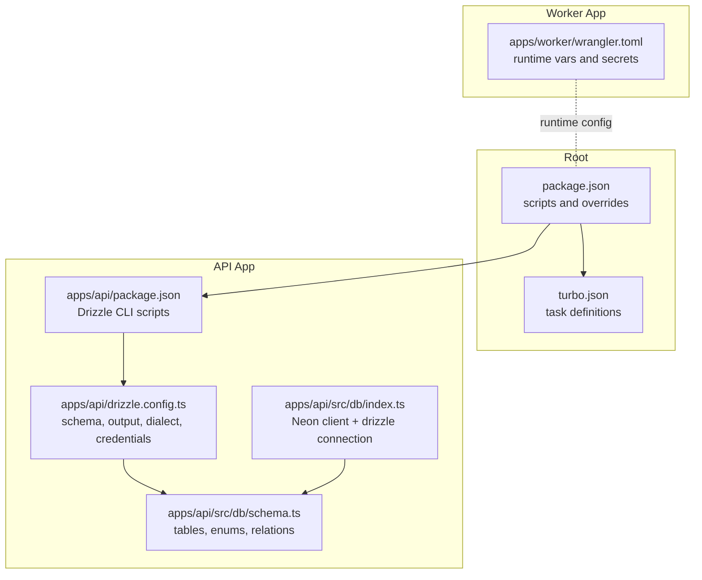
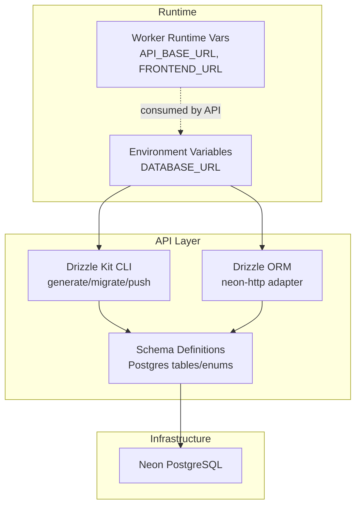
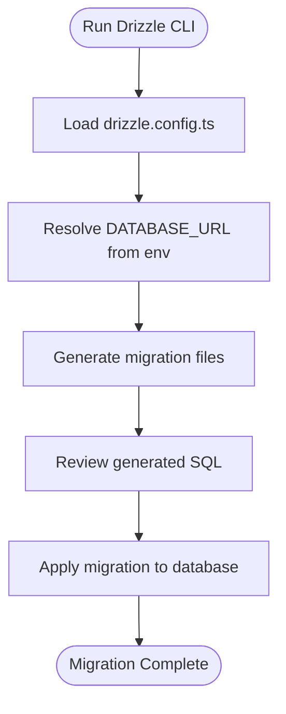
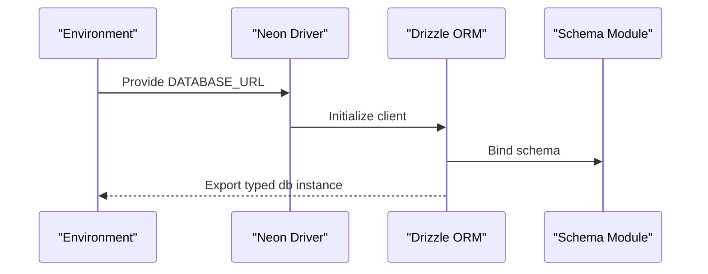
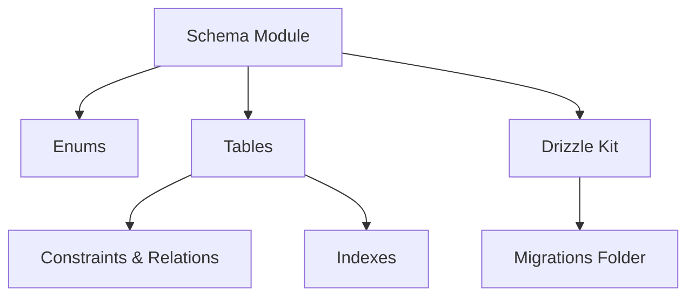
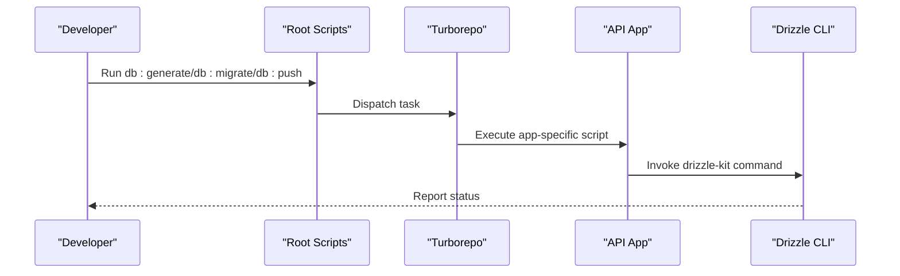
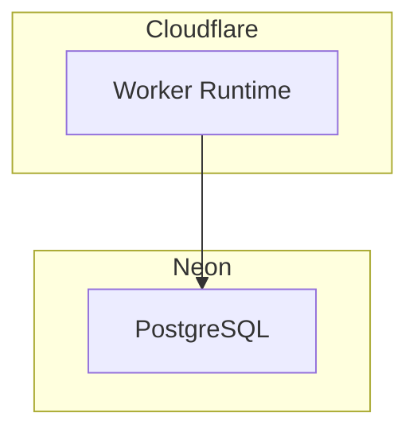
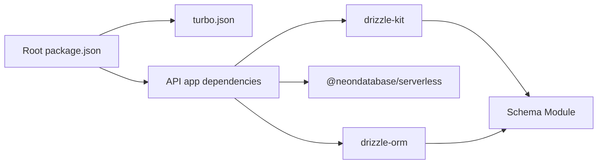

# Migration Strategies and Deployment

<cite>
**Referenced Files in This Document**
- [drizzle.config.ts](file://apps/api/drizzle.config.ts)
- [db/index.ts](file://apps/api/src/db/index.ts)
- [db/schema.ts](file://apps/api/src/db/schema.ts)
- [package.json (root)](file://package.json)
- [package.json (api app)](file://apps/api/package.json)
- [turbo.json](file://turbo.json)
- [wrangler.toml](file://apps/worker/wrangler.toml)
</cite>

## Table of Contents
1. [Introduction](#introduction)
2. [Project Structure](#project-structure)
3. [Core Components](#core-components)
4. [Architecture Overview](#architecture-overview)
5. [Detailed Component Analysis](#detailed-component-analysis)
6. [Dependency Analysis](#dependency-analysis)
7. [Performance Considerations](#performance-considerations)
8. [Troubleshooting Guide](#troubleshooting-guide)
9. [Conclusion](#conclusion)
10. [Appendices](#appendices)

## Introduction
This document provides a comprehensive guide to database migration strategies and deployment considerations for the project. It documents the Drizzle ORM configuration and migration setup, schema versioning, migration file organization, and deployment automation. It also outlines production deployment strategy using Neon PostgreSQL and Cloudflare infrastructure, database initialization and seed data management, rollback procedures, environment-specific configurations, scaling and backup strategies, monitoring approaches, and best practices for zero-downtime migrations and data consistency during updates.

## Project Structure
The database layer is encapsulated within the API application and configured via Drizzle Kit. The root monorepo orchestrates tasks across apps and packages. The Worker application defines runtime variables and secrets for deployment.

**Diagram sources**
- [package.json (root):1-30](file://package.json#L1-L30)
- [turbo.json:1-29](file://turbo.json#L1-L29)
- [drizzle.config.ts:1-11](file://apps/api/drizzle.config.ts#L1-L11)
- [db/index.ts:1-9](file://apps/api/src/db/index.ts#L1-L9)
- [db/schema.ts:1-247](file://apps/api/src/db/schema.ts#L1-L247)
- [wrangler.toml:1-13](file://apps/worker/wrangler.toml#L1-L13)

**Section sources**
- [package.json (root):1-30](file://package.json#L1-L30)
- [turbo.json:1-29](file://turbo.json#L1-L29)
- [drizzle.config.ts:1-11](file://apps/api/drizzle.config.ts#L1-L11)
- [db/index.ts:1-9](file://apps/api/src/db/index.ts#L1-L9)
- [db/schema.ts:1-247](file://apps/api/src/db/schema.ts#L1-L247)
- [wrangler.toml:1-13](file://apps/worker/wrangler.toml#L1-L13)

## Core Components
- Drizzle configuration: Defines schema location, migration output directory, PostgreSQL dialect, and database credentials via environment variable.
- Drizzle connection: Initializes a Neon serverless client and creates a drizzle instance bound to the schema.
- Schema definitions: Centralized Postgres schema with enums, tables, foreign keys, and indexes.

Key responsibilities:
- Drizzle configuration controls migration generation and execution.
- Drizzle connection provides type-safe database access.
- Schema definitions enforce data modeling and referential integrity.

**Section sources**
- [drizzle.config.ts:1-11](file://apps/api/drizzle.config.ts#L1-L11)
- [db/index.ts:1-9](file://apps/api/src/db/index.ts#L1-L9)
- [db/schema.ts:1-247](file://apps/api/src/db/schema.ts#L1-L247)

## Architecture Overview
The database architecture integrates Drizzle ORM with Neon PostgreSQL and is orchestrated by Turborepo. The Worker app exposes runtime variables consumed by the API.

**Diagram sources**
- [drizzle.config.ts:1-11](file://apps/api/drizzle.config.ts#L1-L11)
- [db/index.ts:1-9](file://apps/api/src/db/index.ts#L1-L9)
- [db/schema.ts:1-247](file://apps/api/src/db/schema.ts#L1-L247)
- [wrangler.toml:1-13](file://apps/worker/wrangler.toml#L1-L13)

## Detailed Component Analysis

### Drizzle Configuration and Migration Setup
- Schema location: Migrations are generated from the schema file path defined in the Drizzle configuration.
- Output directory: Migrations are written to the specified output folder.
- Dialect: PostgreSQL is selected for compatibility with Neon.
- Credentials: The database URL is sourced from the environment variable, enabling environment-specific connections.

**Diagram sources**
- [drizzle.config.ts:1-11](file://apps/api/drizzle.config.ts#L1-L11)

**Section sources**
- [drizzle.config.ts:1-11](file://apps/api/drizzle.config.ts#L1-L11)

### Drizzle Connection and Neon Integration
- Neon client: The Neon serverless driver is initialized with the database URL from environment variables.
- Drizzle instance: A typed drizzle instance is exported for use across the API application.
- Schema binding: The drizzle instance is bound to the centralized schema definitions.

**Diagram sources**
- [db/index.ts:1-9](file://apps/api/src/db/index.ts#L1-L9)
- [db/schema.ts:1-247](file://apps/api/src/db/schema.ts#L1-L247)

**Section sources**
- [db/index.ts:1-9](file://apps/api/src/db/index.ts#L1-L9)
- [db/schema.ts:1-247](file://apps/api/src/db/schema.ts#L1-L247)

### Schema Versioning and Migration File Organization
- Centralized schema: All Postgres entities are defined in a single schema module.
- Enumerations: Domain enums are declared at the top of the schema file for reuse.
- Tables and relations: Tables are defined with primary keys, constraints, and foreign keys.
- Indexes: Composite and single-column indexes are defined alongside tables for performance.
- Migration output: Drizzle Kit writes migration files to the configured output directory.

**Diagram sources**
- [db/schema.ts:1-247](file://apps/api/src/db/schema.ts#L1-L247)
- [drizzle.config.ts:1-11](file://apps/api/drizzle.config.ts#L1-L11)

**Section sources**
- [db/schema.ts:1-247](file://apps/api/src/db/schema.ts#L1-L247)
- [drizzle.config.ts:1-11](file://apps/api/drizzle.config.ts#L1-L11)

### Deployment Automation with Turborepo
- Root scripts: The root package.json defines scripts to orchestrate database tasks across the monorepo.
- Task caching disabled: Database tasks are configured to avoid caching for deterministic behavior.
- API app scripts: The API app package.json defines Drizzle CLI commands for generating, migrating, pushing, and opening Drizzle Studio.

**Diagram sources**
- [package.json (root):6-18](file://package.json#L6-L18)
- [turbo.json:18-26](file://turbo.json#L18-L26)
- [package.json (api app):10-14](file://apps/api/package.json#L10-L14)

**Section sources**
- [package.json (root):6-18](file://package.json#L6-L18)
- [turbo.json:18-26](file://turbo.json#L18-L26)
- [package.json (api app):10-14](file://apps/api/package.json#L10-L14)

### Production Deployment Strategy: Neon and Cloudflare
- Neon PostgreSQL: The database connection uses the Neon serverless driver, suitable for production-grade scaling and low-latency access.
- Cloudflare Worker: The Worker app configuration defines runtime variables and secrets, aligning with Cloudflare’s deployment model.
- Environment separation: DATABASE_URL enables environment-specific connections (development, staging, production).

**Diagram sources**
- [db/index.ts:1-9](file://apps/api/src/db/index.ts#L1-L9)
- [wrangler.toml:1-13](file://apps/worker/wrangler.toml#L1-L13)

**Section sources**
- [db/index.ts:1-9](file://apps/api/src/db/index.ts#L1-L9)
- [wrangler.toml:1-13](file://apps/worker/wrangler.toml#L1-L13)

### Database Initialization, Seed Data, and Rollback Procedures
- Initialization: Use the Drizzle Kit push command to apply schema changes directly to the database for development or controlled environments.
- Seeding: Define seed scripts in the API app to populate initial data after migrations.
- Rollback: Use Drizzle Kit’s migration system to roll back to previous versions when necessary.

Note: The current repository does not include explicit seed scripts or rollback commands. Add seed scripts and maintain backward-compatible migrations for robustness.

**Section sources**
- [package.json (api app):10-14](file://apps/api/package.json#L10-L14)

### Environment-Specific Configurations
- Development: DATABASE_URL points to a local or staging database for iterative development.
- Staging: DATABASE_URL targets a dedicated staging environment for pre-production validation.
- Production: DATABASE_URL connects to the production Neon database; ensure secrets management and least-privilege credentials.

Best practices:
- Store DATABASE_URL as a secret in your deployment platform.
- Use separate databases for each environment.
- Limit write permissions for automated CI/CD migrations.

**Section sources**
- [drizzle.config.ts:7-9](file://apps/api/drizzle.config.ts#L7-L9)
- [db/index.ts:5-6](file://apps/api/src/db/index.ts#L5-L6)
- [wrangler.toml:9-12](file://apps/worker/wrangler.toml#L9-L12)

### Zero-Downtime Migrations and Data Consistency
- Use online-friendly schema changes supported by PostgreSQL and Neon.
- Prefer additive-only changes (adding columns, indexes) when possible.
- For destructive changes, plan maintenance windows and use shadow tables or blue/green deployment patterns.
- Validate migrations against a staging replica before applying to production.
- Monitor transaction durations and lock contention during migrations.

[No sources needed since this section provides general guidance]

### Relationship Between Schema Changes and Application Deployments
- Schema changes should be reviewed and tested before application deployment.
- Ensure the API app’s drizzle instance remains aligned with schema definitions.
- Coordinate deployment of schema migrations with application releases to prevent runtime errors.

**Section sources**
- [db/schema.ts:1-247](file://apps/api/src/db/schema.ts#L1-L247)
- [db/index.ts:1-9](file://apps/api/src/db/index.ts#L1-L9)

## Dependency Analysis
The API app depends on Drizzle ORM and Neon for database connectivity, while Turborepo orchestrates database tasks across the monorepo.

**Diagram sources**
- [package.json (root):1-30](file://package.json#L1-L30)
- [turbo.json:1-29](file://turbo.json#L1-L29)
- [package.json (api app):16-32](file://apps/api/package.json#L16-L32)
- [db/schema.ts:1-247](file://apps/api/src/db/schema.ts#L1-L247)

**Section sources**
- [package.json (root):1-30](file://package.json#L1-L30)
- [turbo.json:1-29](file://turbo.json#L1-L29)
- [package.json (api app):16-32](file://apps/api/package.json#L16-L32)
- [db/schema.ts:1-247](file://apps/api/src/db/schema.ts#L1-L247)

## Performance Considerations
- Indexing strategy: Leverage composite and single-column indexes defined in the schema to optimize query performance.
- Connection pooling: Neon serverless manages connections efficiently; ensure application-level batching and minimal connection churn.
- Migration performance: Keep migrations small and incremental to reduce downtime and lock times.

[No sources needed since this section provides general guidance]

## Troubleshooting Guide
Common issues and resolutions:
- Missing DATABASE_URL: Ensure the environment variable is set for all environments.
- Drift between schema and database: Use Drizzle Kit push for quick alignment in development; prefer migrations for production.
- Migration conflicts: Review generated SQL and resolve conflicts before applying to production.
- Worker runtime variables: Verify API_BASE_URL and FRONTEND_URL in the Worker configuration for proper routing.

**Section sources**
- [drizzle.config.ts:7-9](file://apps/api/drizzle.config.ts#L7-L9)
- [package.json (api app):10-14](file://apps/api/package.json#L10-L14)
- [wrangler.toml:5-7](file://apps/worker/wrangler.toml#L5-L7)

## Conclusion
This guide outlined the Drizzle ORM configuration, migration setup, and deployment strategy for Neon PostgreSQL with Cloudflare infrastructure. By centralizing schema definitions, automating migrations via Turborepo, and enforcing environment-specific configurations, teams can achieve reliable, repeatable, and safe database updates. Adopt zero-downtime practices, monitor performance, and maintain strict separation of environments for robust operations.

[No sources needed since this section summarizes without analyzing specific files]

## Appendices

### Appendix A: Drizzle CLI Commands
- Generate migrations: Run the generate script from the API app.
- Apply migrations: Run the migrate script from the API app.
- Push schema: Run the push script from the API app for development.
- Open Drizzle Studio: Run the studio script from the API app for schema inspection.

**Section sources**
- [package.json (api app):10-14](file://apps/api/package.json#L10-L14)

### Appendix B: Neon and Cloudflare Checklist
- Confirm DATABASE_URL secret is set in the deployment platform.
- Validate Worker runtime variables for API and frontend URLs.
- Test migrations in staging before production rollout.
- Monitor database performance and connection metrics.

**Section sources**
- [db/index.ts:5-6](file://apps/api/src/db/index.ts#L5-L6)
- [wrangler.toml:5-7](file://apps/worker/wrangler.toml#L5-L7)