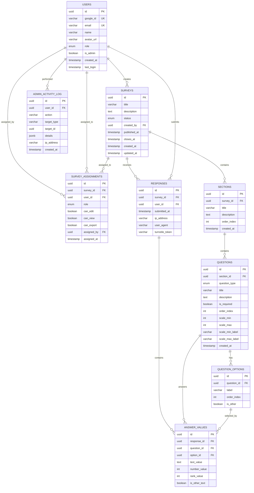
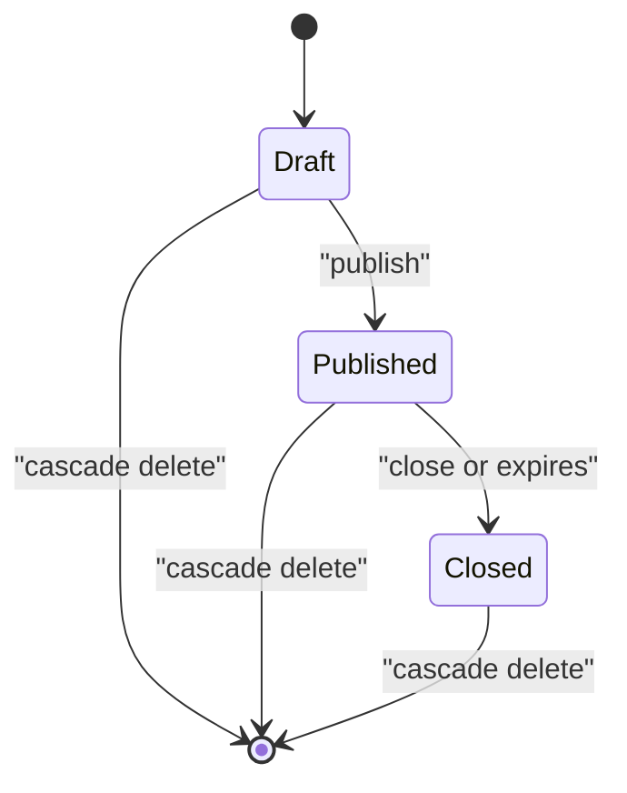
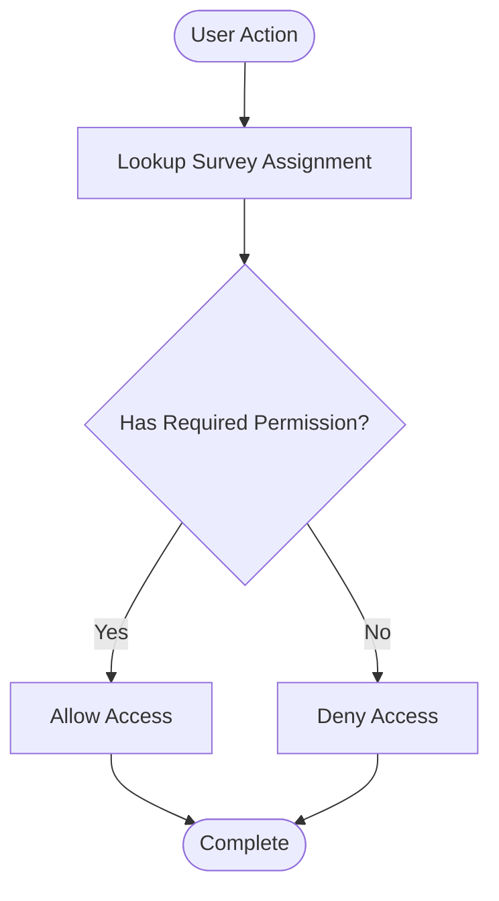
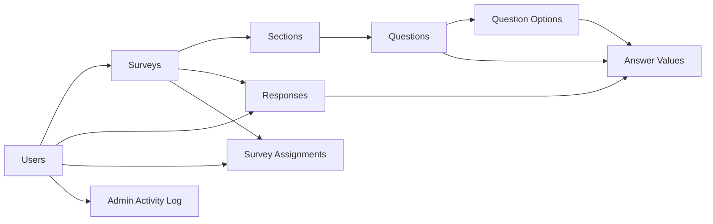

# Schema Overview and Entity Relationships

<cite>
**Referenced Files in This Document**
- [schema.ts](file://apps/api/src/db/schema.ts)
- [drizzle.config.ts](file://apps/api/drizzle.config.ts)
- [index.ts](file://apps/api/src/db/index.ts)
- [survey.schema.ts](file://packages/shared/src/schemas/survey.schema.ts)
- [question.schema.ts](file://packages/shared/src/schemas/question.schema.ts)
- [response.schema.ts](file://packages/shared/src/schemas/response.schema.ts)
- [assignment.schema.ts](file://packages/shared/src/schemas/assignment.schema.ts)
- [survey.ts](file://packages/shared/src/types/survey.ts)
- [user.ts](file://packages/shared/src/types/user.ts)
- [question.ts](file://packages/shared/src/types/question.ts)
- [response.ts](file://packages/shared/src/types/response.ts)
</cite>

## Table of Contents
1. [Introduction](#introduction)
2. [Project Structure](#project-structure)
3. [Core Components](#core-components)
4. [Architecture Overview](#architecture-overview)
5. [Detailed Component Analysis](#detailed-component-analysis)
6. [Dependency Analysis](#dependency-analysis)
7. [Performance Considerations](#performance-considerations)
8. [Troubleshooting Guide](#troubleshooting-guide)
9. [Conclusion](#conclusion)

## Introduction
This document provides a comprehensive overview of the database schema and entity relationships for the survey application. It explains the 12-table relational structure, how entities interconnect via foreign keys, cascade delete behaviors, referential integrity constraints, and the survey lifecycle from creation to completion. It also documents indexing strategies, performance considerations for common queries, and the Role-Based Access Control (RBAC) model implemented through survey assignments and user roles.

## Project Structure
The schema is defined using Drizzle ORM with PostgreSQL dialect. The schema module exports all table definitions and enums. Drizzle Kit configuration points to the schema file and migration output location. The database client is initialized with a Neon HTTP connection and the schema namespace.

```mermaid
graph TB
subgraph "API Layer"
DRIZZLE_CFG["Drizzle Config<br/>drizzle.config.ts"]
DB_INDEX["Database Client<br/>src/db/index.ts"]
SCHEMA_TS["Schema Definition<br/>src/db/schema.ts"]
end
subgraph "Shared Types and Schemas"
SURVEY_SCHEMA["Survey Zod Schemas<br/>packages/shared/schemas/survey.schema.ts"]
QUESTION_SCHEMA["Question Zod Schemas<br/>packages/shared/schemas/question.schema.ts"]
RESPONSE_SCHEMA["Response Zod Schemas<br/>packages/shared/schemas/response.schema.ts"]
ASSIGNMENT_SCHEMA["Assignment Zod Schemas<br/>packages/shared/src/schemas/assignment.schema.ts"]
SURVEY_TYPES["Survey Types<br/>packages/shared/src/types/survey.ts"]
USER_TYPES["User Types<br/>packages/shared/src/types/user.ts"]
QUESTION_TYPES["Question Types<br/>packages/shared/src/types/question.ts"]
RESPONSE_TYPES["Response Types<br/>packages/shared/src/types/response.ts"]
end
DRIZZLE_CFG --> SCHEMA_TS
DB_INDEX --> SCHEMA_TS
SURVEY_SCHEMA --> SCHEMA_TS
QUESTION_SCHEMA --> SCHEMA_TS
RESPONSE_SCHEMA --> SCHEMA_TS
ASSIGNMENT_SCHEMA --> SCHEMA_TS
SURVEY_TYPES --> SCHEMA_TS
USER_TYPES --> SCHEMA_TS
QUESTION_TYPES --> SCHEMA_TS
RESPONSE_TYPES --> SCHEMA_TS
```

**Diagram sources**
- [drizzle.config.ts:1-11](file://apps/api/drizzle.config.ts#L1-L11)
- [index.ts:1-9](file://apps/api/src/db/index.ts#L1-L9)
- [schema.ts:1-247](file://apps/api/src/db/schema.ts#L1-L247)
- [survey.schema.ts:1-22](file://packages/shared/src/schemas/survey.schema.ts#L1-L22)
- [question.schema.ts:1-65](file://packages/shared/src/schemas/question.schema.ts#L1-L65)
- [response.schema.ts:1-24](file://packages/shared/src/schemas/response.schema.ts#L1-L24)
- [assignment.schema.ts:1-20](file://packages/shared/src/schemas/assignment.schema.ts#L1-L20)
- [survey.ts:1-50](file://packages/shared/src/types/survey.ts#L1-L50)
- [user.ts:1-22](file://packages/shared/src/types/user.ts#L1-L22)
- [question.ts:1-66](file://packages/shared/src/types/question.ts#L1-L66)
- [response.ts:1-53](file://packages/shared/src/types/response.ts#L1-L53)

**Section sources**
- [drizzle.config.ts:1-11](file://apps/api/drizzle.config.ts#L1-L11)
- [index.ts:1-9](file://apps/api/src/db/index.ts#L1-L9)
- [schema.ts:1-247](file://apps/api/src/db/schema.ts#L1-L247)

## Core Components
This section outlines the primary entities and their attributes, enumerations, and constraints. It also summarizes cascade behaviors and unique constraints.

- Users
  - Primary key: id
  - Unique constraints: googleId, email
  - Enumerations: role (admin, editor, viewer, user)
  - Additional fields: isAdmin, createdAt, lastLogin

- Surveys
  - Primary key: id
  - Foreign key: created_by → users.id (onDelete: cascade)
  - Enumerations: status (draft, published, closed)
  - Additional fields: title, description, publishedAt, closesAt, createdAt, updatedAt

- Survey Assignments
  - Primary key: id
  - Unique constraint: (survey_id, user_id)
  - Foreign keys: survey_id → surveys.id (onDelete: cascade), user_id → users.id (onDelete: cascade), assigned_by → users.id (onDelete: cascade)
  - Enumerations: role (editor, viewer)
  - Permissions: canEdit, canView, canExport
  - Additional fields: assignedAt

- Sections
  - Primary key: id
  - Foreign key: survey_id → surveys.id (onDelete: cascade)
  - Additional fields: title, description, orderIndex, createdAt

- Questions
  - Primary key: id
  - Foreign key: section_id → sections.id (onDelete: cascade)
  - Enumerations: question_type (short_text, long_text, single_choice, multiple_choice, dropdown, linear_scale, rating, yes_no, date, number, ranking, matrix)
  - Additional fields: title, description, isRequired, orderIndex, scaleMin, scaleMax, scaleMinLabel, scaleMaxLabel, createdAt

- Question Options
  - Primary key: id
  - Foreign key: question_id → questions.id (onDelete: cascade)
  - Additional fields: label, orderIndex, isOther

- Responses
  - Primary key: id
  - Unique constraint: (survey_id, user_id)
  - Foreign keys: survey_id → surveys.id (onDelete: cascade), user_id → users.id (onDelete: cascade)
  - Additional fields: submittedAt, ipAddress, userAgent, turnstileToken

- Answer Values
  - Primary key: id
  - Foreign keys: response_id → responses.id (onDelete: cascade), question_id → questions.id (onDelete: cascade), option_id → questionOptions.id (onDelete: set null)
  - Additional fields: textValue, numberValue, rankValue, isOtherText

- Admin Activity Log
  - Primary key: id
  - Foreign key: user_id → users.id (onDelete: cascade)
  - Additional fields: action, targetType, targetId, details, ipAddress, createdAt

**Section sources**
- [schema.ts:19-35](file://apps/api/src/db/schema.ts#L19-L35)
- [schema.ts:41-51](file://apps/api/src/db/schema.ts#L41-L51)
- [schema.ts:57-69](file://apps/api/src/db/schema.ts#L57-L69)
- [schema.ts:75-99](file://apps/api/src/db/schema.ts#L75-L99)
- [schema.ts:105-120](file://apps/api/src/db/schema.ts#L105-L120)
- [schema.ts:126-147](file://apps/api/src/db/schema.ts#L126-L147)
- [schema.ts:153-167](file://apps/api/src/db/schema.ts#L153-L167)
- [schema.ts:173-196](file://apps/api/src/db/schema.ts#L173-L196)
- [schema.ts:202-222](file://apps/api/src/db/schema.ts#L202-L222)
- [schema.ts:228-246](file://apps/api/src/db/schema.ts#L228-L246)

## Architecture Overview
The schema follows a strict relational hierarchy:
- Users create Surveys
- Surveys contain Sections
- Sections contain Questions
- Questions have Question Options
- Users respond to Surveys via Responses
- Responses contain Answer Values linked to Questions and optional Question Options

Cascade delete ensures referential integrity when parent entities are removed. Unique constraints enforce business rules such as one assignment per user-survey pair and one response per user-survey pair.

**Diagram sources**
- [schema.ts:41-51](file://apps/api/src/db/schema.ts#L41-L51)
- [schema.ts:57-69](file://apps/api/src/db/schema.ts#L57-L69)
- [schema.ts:75-99](file://apps/api/src/db/schema.ts#L75-L99)
- [schema.ts:105-120](file://apps/api/src/db/schema.ts#L105-L120)
- [schema.ts:126-147](file://apps/api/src/db/schema.ts#L126-L147)
- [schema.ts:153-167](file://apps/api/src/db/schema.ts#L153-L167)
- [schema.ts:173-196](file://apps/api/src/db/schema.ts#L173-L196)
- [schema.ts:202-222](file://apps/api/src/db/schema.ts#L202-L222)
- [schema.ts:228-246](file://apps/api/src/db/schema.ts#L228-L246)

## Detailed Component Analysis

### Users
- Purpose: Authentication and authorization backbone
- Constraints: Unique identifiers (googleId, email); role enumeration supports RBAC
- Cascade behavior: Referenced by multiple entities; cascading deletes propagate to dependent records

**Section sources**
- [schema.ts:41-51](file://apps/api/src/db/schema.ts#L41-L51)
- [user.ts:1-22](file://packages/shared/src/types/user.ts#L1-L22)

### Surveys
- Purpose: Container for survey metadata and lifecycle
- Lifecycle fields: status, publishedAt, closesAt
- Ownership: created_by references users.id with cascade delete
- Cascade behavior: Deleting a survey removes dependent sections, questions, assignments, responses, and answers

**Section sources**
- [schema.ts:57-69](file://apps/api/src/db/schema.ts#L57-L69)
- [survey.ts:5-15](file://packages/shared/src/types/survey.ts#L5-L15)
- [survey.schema.ts:3-17](file://packages/shared/src/schemas/survey.schema.ts#L3-L17)

### Survey Assignments
- Purpose: RBAC bridge between users and surveys
- Unique constraint: Ensures a user can be assigned to a survey only once
- Permissions: canEdit, canView, canExport
- Cascade behavior: Deletion propagates to dependent records when survey or user is removed

**Section sources**
- [schema.ts:75-99](file://apps/api/src/db/schema.ts#L75-L99)
- [survey.ts:37-49](file://packages/shared/src/types/survey.ts#L37-L49)
- [assignment.schema.ts:3-16](file://packages/shared/src/schemas/assignment.schema.ts#L3-L16)

### Sections
- Purpose: Logical grouping of questions within a survey
- Ordering: orderIndex controls presentation sequence
- Cascade behavior: Deleting a section removes dependent questions

**Section sources**
- [schema.ts:105-120](file://apps/api/src/db/schema.ts#L105-L120)
- [survey.ts:22-29](file://packages/shared/src/types/survey.ts#L22-L29)

### Questions
- Purpose: Individual survey items with typed responses
- Type system: question_type enumeration supports diverse question formats
- Optional scales: min/max labels for linear scales and ratings
- Cascade behavior: Deleting a question removes options and answers

**Section sources**
- [schema.ts:126-147](file://apps/api/src/db/schema.ts#L126-L147)
- [question.ts:30-43](file://packages/shared/src/types/question.ts#L30-L43)
- [question.schema.ts:3-35](file://packages/shared/src/schemas/question.schema.ts#L3-L35)

### Question Options
- Purpose: Discrete choices for choice-based questions
- Ordering: orderIndex controls display sequence
- Cascade behavior: Deleting an option removes related answers

**Section sources**
- [schema.ts:153-167](file://apps/api/src/db/schema.ts#L153-L167)
- [question.ts:45-51](file://packages/shared/src/types/question.ts#L45-L51)
- [question.schema.ts:50-53](file://packages/shared/src/schemas/question.schema.ts#L50-L53)

### Responses
- Purpose: Single submission per user per survey
- Unique constraint: Prevents duplicate submissions
- Tracking: submittedAt, IP, user agent, turnstile token
- Cascade behavior: Deleting a response removes related answers

**Section sources**
- [schema.ts:173-196](file://apps/api/src/db/schema.ts#L173-L196)
- [response.ts:1-8](file://packages/shared/src/types/response.ts#L1-L8)
- [response.schema.ts:12-20](file://packages/shared/src/schemas/response.schema.ts#L12-L20)

### Answer Values
- Purpose: Typed storage for response answers
- Flexibility: Supports text, numeric, and ranked values; optional selection of question options
- Cascade behavior: Deleting a response or question removes related answers; deleting an option sets answer option references to null

**Section sources**
- [schema.ts:202-222](file://apps/api/src/db/schema.ts#L202-L222)
- [response.ts:10-19](file://packages/shared/src/types/response.ts#L10-L19)
- [response.schema.ts:3-10](file://packages/shared/src/schemas/response.schema.ts#L3-L10)

### Admin Activity Log
- Purpose: Audit trail for administrative actions
- Cascade behavior: Deleting a user removes related activity logs

**Section sources**
- [schema.ts:228-246](file://apps/api/src/db/schema.ts#L228-L246)

### Survey Lifecycle
- Creation: A user creates a survey with title, description, and optional close date
- Publishing: Status transitions to published; publishedAt timestamp recorded
- Completion: Responses are collected until closesAt or closure by status change
- Deletion: Cascade deletes remove all dependent entities when a survey is deleted

**Diagram sources**
- [schema.ts:57-69](file://apps/api/src/db/schema.ts#L57-L69)

### RBAC Through Survey Assignments
- Roles: editor, viewer
- Permissions: canEdit, canView, canExport
- Enforcement: Route handlers and middleware derive permissions from survey assignments and user roles

**Diagram sources**
- [schema.ts:75-99](file://apps/api/src/db/schema.ts#L75-L99)
- [survey.ts:37-49](file://packages/shared/src/types/survey.ts#L37-L49)
- [assignment.schema.ts:3-16](file://packages/shared/src/schemas/assignment.schema.ts#L3-L16)

## Dependency Analysis
The schema exhibits strong referential integrity with targeted cascade deletes. The following diagram highlights key dependencies and their cascade effects.

**Diagram sources**
- [schema.ts:41-51](file://apps/api/src/db/schema.ts#L41-L51)
- [schema.ts:57-69](file://apps/api/src/db/schema.ts#L57-L69)
- [schema.ts:75-99](file://apps/api/src/db/schema.ts#L75-L99)
- [schema.ts:105-120](file://apps/api/src/db/schema.ts#L105-L120)
- [schema.ts:126-147](file://apps/api/src/db/schema.ts#L126-L147)
- [schema.ts:153-167](file://apps/api/src/db/schema.ts#L153-L167)
- [schema.ts:173-196](file://apps/api/src/db/schema.ts#L173-L196)
- [schema.ts:202-222](file://apps/api/src/db/schema.ts#L202-L222)
- [schema.ts:228-246](file://apps/api/src/db/schema.ts#L228-L246)

## Performance Considerations
Common query patterns and recommended indexes:
- Survey listing and filtering by status
  - Indexes: none explicitly defined for status; consider adding an index on surveys(status) if frequently filtered
- Survey assignments lookup by survey or user
  - Existing indexes: assignments_survey_idx, assignments_user_idx
  - Composite unique index: unique_survey_user ensures fast uniqueness checks
- Sections and questions ordering
  - Indexes: sections_survey_idx, questions_section_idx
  - Consider adding indexes on sections(survey_id, order_index) and questions(section_id, order_index) for ordered retrieval
- Responses and answers
  - Unique index: unique_survey_user_response prevents duplicates and supports fast per-user-per-survey lookups
  - Indexes: responses_survey_idx, responses_user_idx, answers_response_idx, answers_question_idx
- Admin activity log
  - Indexes: activity_log_user_idx, activity_log_created_idx

Recommendations:
- Add selective indexes for frequently filtered columns (e.g., surveys.status)
- Monitor slow queries and add covering indexes for common projection queries
- Use EXPLAIN/ANALYZE to validate index usage after deployment

**Section sources**
- [schema.ts:94-99](file://apps/api/src/db/schema.ts#L94-L99)
- [schema.ts:117-120](file://apps/api/src/db/schema.ts#L117-L120)
- [schema.ts:144-147](file://apps/api/src/db/schema.ts#L144-L147)
- [schema.ts:188-196](file://apps/api/src/db/schema.ts#L188-L196)
- [schema.ts:218-222](file://apps/api/src/db/schema.ts#L218-L222)
- [schema.ts:242-246](file://apps/api/src/db/schema.ts#L242-L246)

## Troubleshooting Guide
- Duplicate assignment errors
  - Cause: Attempting to create another assignment for the same user-survey pair
  - Resolution: Enforce unique constraint; ensure frontend/backend validates uniqueness before insert
- Duplicate response errors
  - Cause: Submitting multiple responses for the same user-survey combination
  - Resolution: Use unique index; return appropriate error when violation occurs
- Orphaned answer values
  - Cause: Deleting a question or option without cleaning up answers
  - Resolution: Rely on cascade deletes; verify triggers if custom logic is introduced
- Permission denials
  - Cause: Missing or incorrect role/permission flags in survey assignments
  - Resolution: Validate assignment record and user role before granting access

**Section sources**
- [schema.ts:94-99](file://apps/api/src/db/schema.ts#L94-L99)
- [schema.ts:188-196](file://apps/api/src/db/schema.ts#L188-L196)
- [schema.ts:206-212](file://apps/api/src/db/schema.ts#L206-L212)

## Conclusion
The schema establishes a robust, normalized relational model supporting a complete survey lifecycle, flexible question types, and strong RBAC via survey assignments. Cascade deletes maintain referential integrity across the hierarchy, while strategic indexes support common query patterns. The shared TypeScript and Zod schemas ensure consistent typing and validation across the frontend and backend.