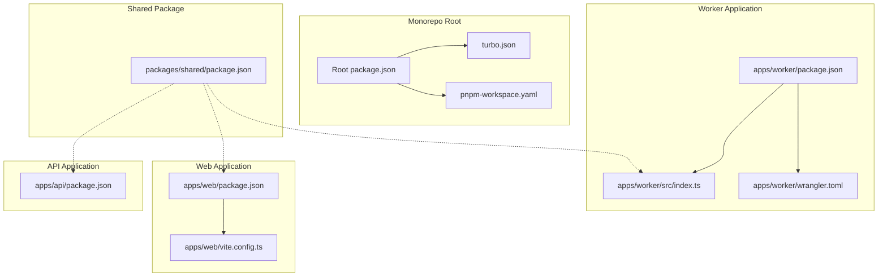
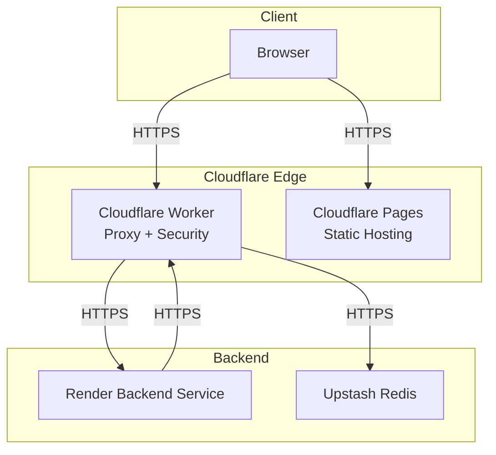
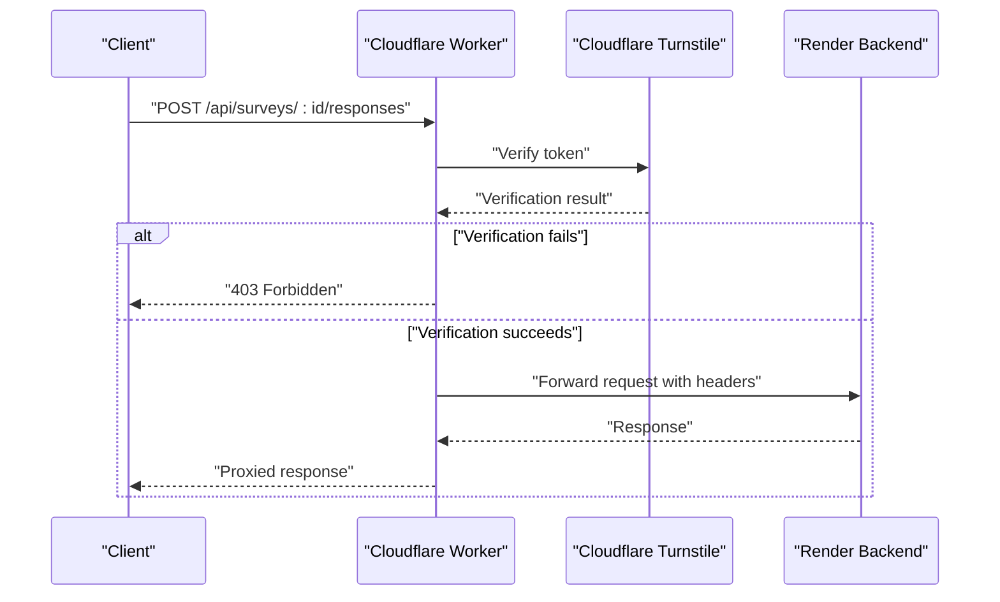
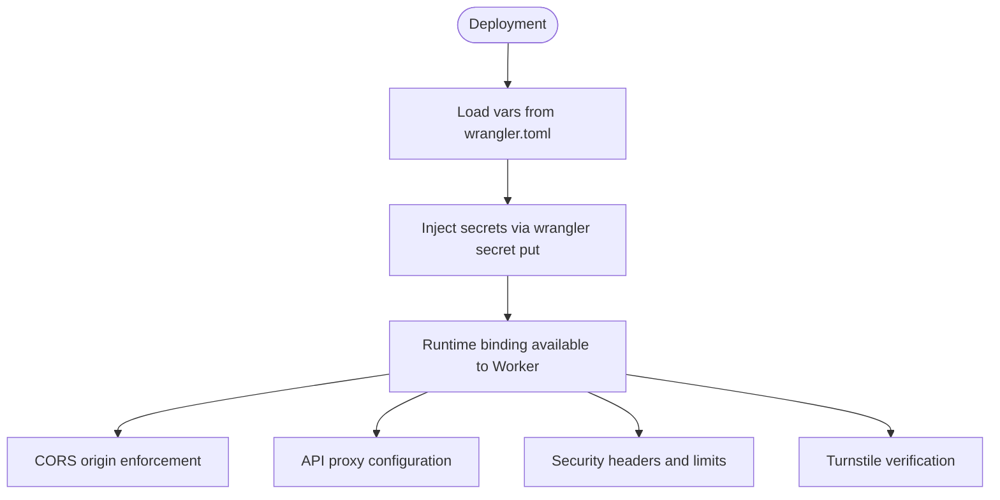
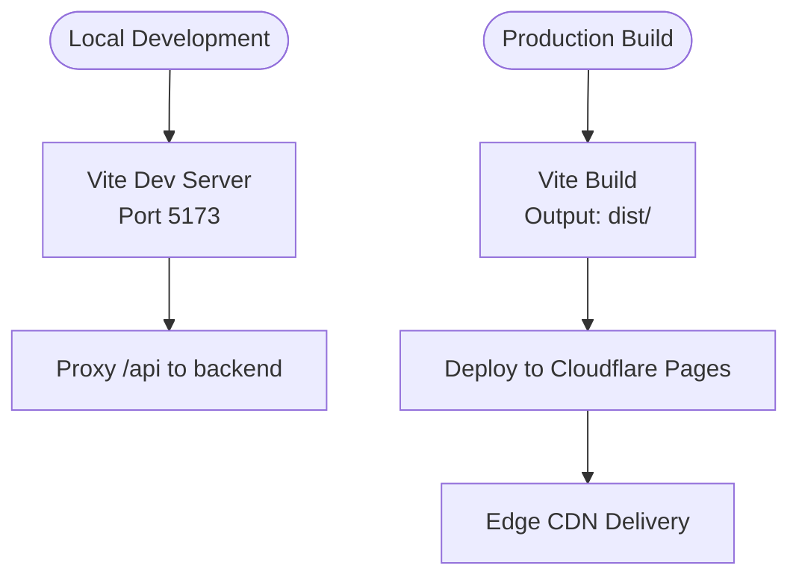
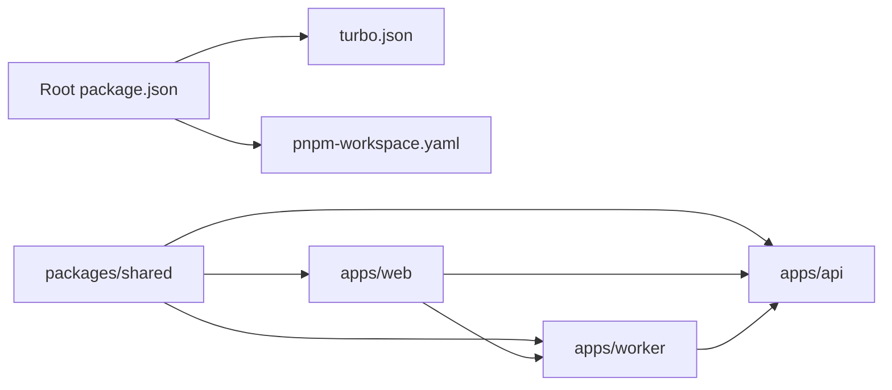

# Cloudflare Deployment

<cite>
**Referenced Files in This Document**
- [wrangler.toml](file://apps/worker/wrangler.toml)
- [worker index.ts](file://apps/worker/src/index.ts)
- [worker package.json](file://apps/worker/package.json)
- [web vite.config.ts](file://apps/web/vite.config.ts)
- [web package.json](file://apps/web/package.json)
- [api package.json](file://apps/api/package.json)
- [shared package.json](file://packages/shared/package.json)
- [root package.json](file://package.json)
- [turbo.json](file://turbo.json)
- [pnpm-workspace.yaml](file://pnpm-workspace.yaml)
</cite>

## Table of Contents
1. [Introduction](#introduction)
2. [Project Structure](#project-structure)
3. [Core Components](#core-components)
4. [Architecture Overview](#architecture-overview)
5. [Detailed Component Analysis](#detailed-component-analysis)
6. [Dependency Analysis](#dependency-analysis)
7. [Performance Considerations](#performance-considerations)
8. [Troubleshooting Guide](#troubleshooting-guide)
9. [Conclusion](#conclusion)
10. [Appendices](#appendices)

## Introduction
This document provides comprehensive guidance for deploying the project to production using Cloudflare infrastructure. It covers:
- Wrangler TOML configuration for Workers, including environment variables and secrets management
- Cloudflare Worker deployment process, proxy functionality, and routing configuration
- Cloudflare Pages deployment for the frontend application, including build configuration and custom domains
- Environment variable management, secret handling, and deployment workflows
- Production deployment strategies, rollback procedures, and monitoring setup
- Complete deployment pipeline from local development to production with environment segregation and security considerations

## Project Structure
The project is organized as a monorepo with three primary applications and a shared package:
- Worker: Cloudflare Worker implementing proxy and security middleware
- Web: React-based frontend application
- API: Backend service (Node.js/Hono) for data operations
- Shared: Shared TypeScript schemas and types used across packages

**Diagram sources**
- [root package.json:1-30](file://package.json#L1-L30)
- [turbo.json:1-29](file://turbo.json#L1-L29)
- [pnpm-workspace.yaml:1-4](file://pnpm-workspace.yaml#L1-L4)
- [wrangler.toml:1-13](file://apps/worker/wrangler.toml#L1-L13)
- [worker package.json:1-24](file://apps/worker/package.json#L1-L24)
- [worker index.ts:1-106](file://apps/worker/src/index.ts#L1-L106)
- [web package.json:1-51](file://apps/web/package.json#L1-L51)
- [web vite.config.ts:1-26](file://apps/web/vite.config.ts#L1-L26)
- [api package.json:1-34](file://apps/api/package.json#L1-L34)
- [shared package.json:1-18](file://packages/shared/package.json#L1-L18)

**Section sources**
- [root package.json:1-30](file://package.json#L1-L30)
- [turbo.json:1-29](file://turbo.json#L1-L29)
- [pnpm-workspace.yaml:1-4](file://pnpm-workspace.yaml#L1-L4)

## Core Components
This section focuses on the Cloudflare-specific components and their configuration.

### Worker Configuration (Wrangler TOML)
The Worker configuration defines the runtime environment, compatibility date, and environment variables. It also documents the location for secrets management.

Key configuration areas:
- Runtime identification and compatibility
- Environment variables for API base URL and frontend URL
- Secret placeholders for security tokens and Upstash Redis credentials

Operational implications:
- Environment variables are loaded at runtime and used for proxy target resolution and CORS origin enforcement
- Secrets are managed externally and injected at deployment time

**Section sources**
- [wrangler.toml:1-13](file://apps/worker/wrangler.toml#L1-L13)

### Worker Runtime (TypeScript)
The Worker implements:
- CORS policy restricted to the configured frontend origin
- Security headers for enhanced protection
- Request body size limiting for API routes
- Cloudflare Turnstile verification for specific endpoints
- Proxy logic for all /api/* routes to the backend service

Security and routing highlights:
- CORS origin validation ensures only the configured frontend can access the Worker
- Turnstile verification adds bot protection for survey response creation
- Proxy preserves original request headers and adds internal forwarding metadata
- Body handling respects HTTP methods and avoids unnecessary processing for GET/HEAD

**Section sources**
- [worker index.ts:1-106](file://apps/worker/src/index.ts#L1-L106)

### Frontend Build Configuration (Vite)
The frontend build configuration supports:
- Local development proxy targeting the backend service
- Production build output directory and source map settings
- React plugin and path aliasing for efficient development

Build and development implications:
- Development proxy simplifies local testing without CORS issues
- Production build settings optimize for Cloudflare Pages deployment

**Section sources**
- [web vite.config.ts:1-26](file://apps/web/vite.config.ts#L1-L26)

### Monorepo Scripts and Tooling
The root package.json orchestrates development and build tasks across all packages using Turbo. This enables coordinated builds and development workflows.

Key capabilities:
- Unified dev/build commands for web, API, and Worker
- Type checking and linting across the monorepo
- Database-related scripts for schema generation and migrations

**Section sources**
- [root package.json:1-30](file://package.json#L1-L30)
- [turbo.json:1-29](file://turbo.json#L1-L29)

## Architecture Overview
The deployment architecture integrates Cloudflare Workers for routing and security, Cloudflare Pages for frontend hosting, and a backend service for data operations.

**Diagram sources**
- [worker index.ts:82-103](file://apps/worker/src/index.ts#L82-L103)
- [worker index.ts:42-79](file://apps/worker/src/index.ts#L42-L79)
- [worker index.ts:15-28](file://apps/worker/src/index.ts#L15-L28)

## Detailed Component Analysis

### Worker Security and Proxy Implementation
The Worker enforces security policies and acts as a reverse proxy to the backend service.

**Diagram sources**
- [worker index.ts:42-79](file://apps/worker/src/index.ts#L42-L79)
- [worker index.ts:82-103](file://apps/worker/src/index.ts#L82-L103)

**Section sources**
- [worker index.ts:15-28](file://apps/worker/src/index.ts#L15-L28)
- [worker index.ts:33-40](file://apps/worker/src/index.ts#L33-L40)
- [worker index.ts:42-79](file://apps/worker/src/index.ts#L42-L79)
- [worker index.ts:82-103](file://apps/worker/src/index.ts#L82-L103)

### Environment Variables and Secrets Management
Environment variables are defined in the Worker configuration and consumed at runtime. Secrets are managed externally and injected during deployment.

**Diagram sources**
- [wrangler.toml:5-12](file://apps/worker/wrangler.toml#L5-L12)
- [worker index.ts:5-11](file://apps/worker/src/index.ts#L5-L11)

**Section sources**
- [wrangler.toml:5-12](file://apps/worker/wrangler.toml#L5-L12)
- [worker index.ts:5-11](file://apps/worker/src/index.ts#L5-L11)

### Frontend Build and Pages Deployment
The frontend is built using Vite and deployed to Cloudflare Pages. The build configuration specifies the output directory and development proxy settings.

**Diagram sources**
- [web vite.config.ts:12-24](file://apps/web/vite.config.ts#L12-L24)
- [web package.json:6-11](file://apps/web/package.json#L6-L11)

**Section sources**
- [web vite.config.ts:1-26](file://apps/web/vite.config.ts#L1-L26)
- [web package.json:1-51](file://apps/web/package.json#L1-L51)

## Dependency Analysis
The monorepo uses PNPM workspaces and Turbo to manage dependencies and orchestrate tasks across packages.

**Diagram sources**
- [root package.json:1-30](file://package.json#L1-L30)
- [turbo.json:1-29](file://turbo.json#L1-L29)
- [pnpm-workspace.yaml:1-4](file://pnpm-workspace.yaml#L1-L4)
- [shared package.json:1-18](file://packages/shared/package.json#L1-L18)
- [web package.json:1-51](file://apps/web/package.json#L1-L51)
- [worker package.json:1-24](file://apps/worker/package.json#L1-L24)
- [api package.json:1-34](file://apps/api/package.json#L1-L34)

**Section sources**
- [root package.json:1-30](file://package.json#L1-L30)
- [turbo.json:1-29](file://turbo.json#L1-L29)
- [pnpm-workspace.yaml:1-4](file://pnpm-workspace.yaml#L1-L4)

## Performance Considerations
- Worker cold starts: Minimize initialization overhead by deferring heavy computations until first request
- Edge caching: Leverage Cloudflare's edge caching for static assets and repeated API responses
- Request body limits: Enforce reasonable limits to prevent resource exhaustion
- CORS preflight optimization: Keep allowed methods and headers minimal to reduce preflight overhead
- Redis connectivity: Use Upstash Redis for low-latency caching and rate limiting

## Troubleshooting Guide
Common issues and resolutions:
- CORS failures: Verify FRONTEND_URL matches the origin attempting to access the Worker
- Turnstile verification errors: Confirm TURNSTILE_SECRET_KEY is set and token is present in request payload
- Proxy timeouts: Check API_BASE_URL reachability and network policies
- Secret injection: Ensure secrets are properly set via wrangler secret put before deployment
- Build artifacts: Confirm dist directory is generated and uploaded for Pages deployment

**Section sources**
- [worker index.ts:15-28](file://apps/worker/src/index.ts#L15-L28)
- [worker index.ts:42-79](file://apps/worker/src/index.ts#L42-L79)
- [worker index.ts:82-103](file://apps/worker/src/index.ts#L82-L103)
- [wrangler.toml:9-12](file://apps/worker/wrangler.toml#L9-L12)

## Conclusion
This Cloudflare deployment configuration establishes a secure, scalable edge architecture with clear separation of concerns between the frontend, Worker, and backend services. The monorepo structure and tooling enable efficient development and deployment workflows, while environment segregation and secret management support robust production operations.

## Appendices

### Production Deployment Pipeline
- Local development: Use root scripts to start web, API, and Worker services concurrently
- Build coordination: Run unified build commands to ensure dependencies are satisfied
- Worker deployment: Configure environment variables and inject secrets, then deploy using wrangler
- Frontend deployment: Build and upload the dist directory to Cloudflare Pages
- Monitoring: Set up logging and metrics for Worker and Pages performance

### Rollback Procedures
- Worker: Deploy previous version tag and verify routing continuity
- Frontend: Revert Pages deployment to previous successful build
- Backend: Maintain database migrations and rollback plans for API changes

### Security Considerations
- Environment segregation: Use separate variables for development, staging, and production
- Secret rotation: Regularly update secrets and invalidate old keys
- Access controls: Restrict Worker access to approved origins and enforce request limits
- Network policies: Ensure backend service allows traffic from Cloudflare IP ranges