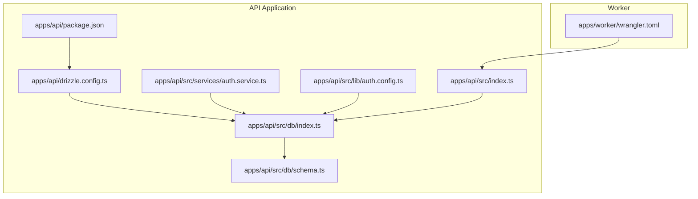
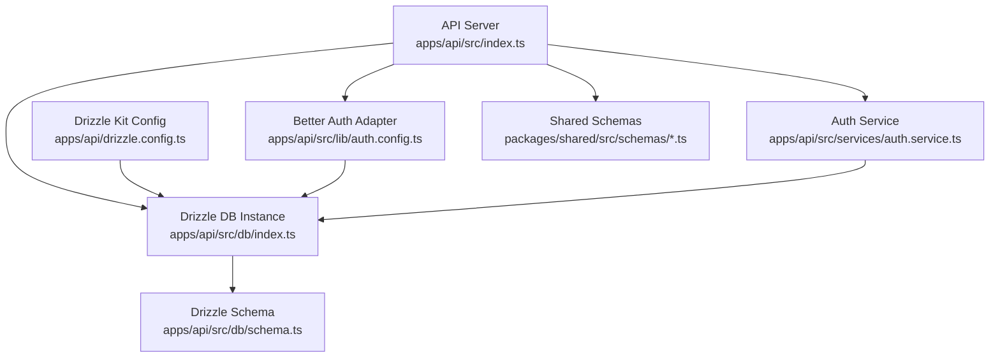
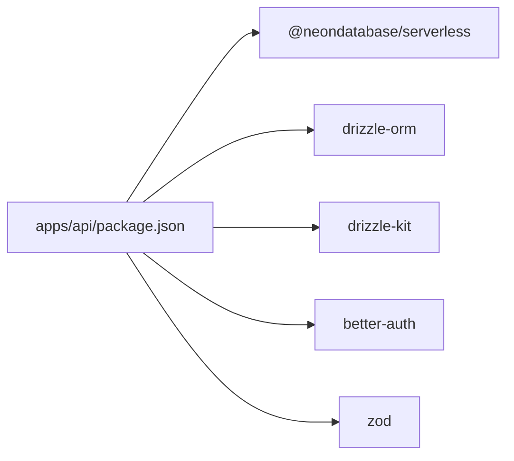

# Database Management

<cite>
**Referenced Files in This Document**
- [apps/api/src/db/index.ts](file://apps/api/src/db/index.ts)
- [apps/api/src/db/schema.ts](file://apps/api/src/db/schema.ts)
- [apps/api/drizzle.config.ts](file://apps/api/drizzle.config.ts)
- [apps/api/package.json](file://apps/api/package.json)
- [apps/api/src/index.ts](file://apps/api/src/index.ts)
- [apps/api/src/lib/auth.config.ts](file://apps/api/src/lib/auth.config.ts)
- [apps/api/src/services/auth.service.ts](file://apps/api/src/services/auth.service.ts)
- [apps/worker/wrangler.toml](file://apps/worker/wrangler.toml)
- [packages/shared/src/schemas/assignment.schema.ts](file://packages/shared/src/schemas/assignment.schema.ts)
- [packages/shared/src/schemas/question.schema.ts](file://packages/shared/src/schemas/question.schema.ts)
- [packages/shared/src/schemas/response.schema.ts](file://packages/shared/src/schemas/response.schema.ts)
- [packages/shared/src/schemas/survey.schema.ts](file://packages/shared/src/schemas/survey.schema.ts)
</cite>

## Table of Contents
1. [Introduction](#introduction)
2. [Project Structure](#project-structure)
3. [Core Components](#core-components)
4. [Architecture Overview](#architecture-overview)
5. [Detailed Component Analysis](#detailed-component-analysis)
6. [Dependency Analysis](#dependency-analysis)
7. [Performance Considerations](#performance-considerations)
8. [Troubleshooting Guide](#troubleshooting-guide)
9. [Conclusion](#conclusion)
10. [Appendices](#appendices)

## Introduction
This document provides comprehensive guidance for managing a Neon PostgreSQL-backed database within the project. It covers Drizzle ORM configuration, connection pooling, schema design, migration and seeding workflows, environment configuration, security settings, backup and recovery, performance monitoring, scaling, and operational best practices. The focus is on the API application’s database layer and its integration with Neon serverless connections.

## Project Structure
The database layer is primarily located under the API application:
- Drizzle ORM configuration and schema definitions
- Drizzle Kit migrations configuration
- Environment-driven database connection setup
- Authentication adapter using Drizzle with Neon

**Diagram sources**
- [apps/api/src/db/index.ts:1-9](file://apps/api/src/db/index.ts#L1-L9)
- [apps/api/src/db/schema.ts:1-247](file://apps/api/src/db/schema.ts#L1-L247)
- [apps/api/drizzle.config.ts:1-11](file://apps/api/drizzle.config.ts#L1-L11)
- [apps/api/package.json:1-34](file://apps/api/package.json#L1-L34)
- [apps/api/src/services/auth.service.ts:1-104](file://apps/api/src/services/auth.service.ts#L1-L104)
- [apps/api/src/lib/auth.config.ts:1-41](file://apps/api/src/lib/auth.config.ts#L1-L41)
- [apps/api/src/index.ts:1-67](file://apps/api/src/index.ts#L1-L67)
- [apps/worker/wrangler.toml:1-13](file://apps/worker/wrangler.toml#L1-L13)

**Section sources**
- [apps/api/src/db/index.ts:1-9](file://apps/api/src/db/index.ts#L1-L9)
- [apps/api/src/db/schema.ts:1-247](file://apps/api/src/db/schema.ts#L1-L247)
- [apps/api/drizzle.config.ts:1-11](file://apps/api/drizzle.config.ts#L1-L11)
- [apps/api/package.json:1-34](file://apps/api/package.json#L1-L34)
- [apps/api/src/index.ts:1-67](file://apps/api/src/index.ts#L1-L67)
- [apps/worker/wrangler.toml:1-13](file://apps/worker/wrangler.toml#L1-L13)

## Core Components
- Neon serverless connection and Drizzle ORM integration
- Drizzle schema definitions for domain entities and indexes
- Drizzle Kit configuration for migrations and schema generation
- Environment-driven configuration for database URLs and secrets
- Authentication adapter using Drizzle with Neon
- Shared Zod schemas for survey, question, response, and assignment domains

Key implementation references:
- Neon connection and Drizzle initialization: [apps/api/src/db/index.ts:1-9](file://apps/api/src/db/index.ts#L1-L9)
- Drizzle schema definitions: [apps/api/src/db/schema.ts:1-247](file://apps/api/src/db/schema.ts#L1-L247)
- Drizzle Kit config: [apps/api/drizzle.config.ts:1-11](file://apps/api/drizzle.config.ts#L1-L11)
- Scripts and dependencies: [apps/api/package.json:1-34](file://apps/api/package.json#L1-L34)
- Auth adapter with Drizzle and Neon: [apps/api/src/lib/auth.config.ts:1-41](file://apps/api/src/lib/auth.config.ts#L1-L41)
- Shared schemas: [packages/shared/src/schemas/survey.schema.ts:1-22](file://packages/shared/src/schemas/survey.schema.ts#L1-L22), [packages/shared/src/schemas/question.schema.ts:1-65](file://packages/shared/src/schemas/question.schema.ts#L1-L65), [packages/shared/src/schemas/response.schema.ts:1-24](file://packages/shared/src/schemas/response.schema.ts#L1-L24), [packages/shared/src/schemas/assignment.schema.ts:1-20](file://packages/shared/src/schemas/assignment.schema.ts#L1-L20)

**Section sources**
- [apps/api/src/db/index.ts:1-9](file://apps/api/src/db/index.ts#L1-L9)
- [apps/api/src/db/schema.ts:1-247](file://apps/api/src/db/schema.ts#L1-L247)
- [apps/api/drizzle.config.ts:1-11](file://apps/api/drizzle.config.ts#L1-L11)
- [apps/api/package.json:1-34](file://apps/api/package.json#L1-L34)
- [apps/api/src/lib/auth.config.ts:1-41](file://apps/api/src/lib/auth.config.ts#L1-L41)
- [packages/shared/src/schemas/survey.schema.ts:1-22](file://packages/shared/src/schemas/survey.schema.ts#L1-L22)
- [packages/shared/src/schemas/question.schema.ts:1-65](file://packages/shared/src/schemas/question.schema.ts#L1-L65)
- [packages/shared/src/schemas/response.schema.ts:1-24](file://packages/shared/src/schemas/response.schema.ts#L1-L24)
- [packages/shared/src/schemas/assignment.schema.ts:1-20](file://packages/shared/src/schemas/assignment.schema.ts#L1-L20)

## Architecture Overview
The database architecture centers on:
- Neon serverless connections via the @neondatabase/serverless driver
- Drizzle ORM for schema modeling and query building
- Drizzle Kit for migrations and schema generation
- Better Auth adapter using Drizzle to persist sessions and user data
- Shared Zod schemas for input validation across the API

**Diagram sources**
- [apps/api/src/index.ts:1-67](file://apps/api/src/index.ts#L1-L67)
- [apps/api/src/db/index.ts:1-9](file://apps/api/src/db/index.ts#L1-L9)
- [apps/api/src/db/schema.ts:1-247](file://apps/api/src/db/schema.ts#L1-L247)
- [apps/api/drizzle.config.ts:1-11](file://apps/api/drizzle.config.ts#L1-L11)
- [apps/api/src/lib/auth.config.ts:1-41](file://apps/api/src/lib/auth.config.ts#L1-L41)
- [apps/api/src/services/auth.service.ts:1-104](file://apps/api/src/services/auth.service.ts#L1-L104)
- [packages/shared/src/schemas/survey.schema.ts:1-22](file://packages/shared/src/schemas/survey.schema.ts#L1-L22)
- [packages/shared/src/schemas/question.schema.ts:1-65](file://packages/shared/src/schemas/question.schema.ts#L1-L65)
- [packages/shared/src/schemas/response.schema.ts:1-24](file://packages/shared/src/schemas/response.schema.ts#L1-L24)
- [packages/shared/src/schemas/assignment.schema.ts:1-20](file://packages/shared/src/schemas/assignment.schema.ts#L1-L20)

## Detailed Component Analysis

### Neon Connection and Drizzle ORM Setup
- The database connection is established using the Neon serverless driver and wrapped by Drizzle ORM for HTTP transport.
- The connection URL is sourced from the environment variable DATABASE_URL.
- The schema module is attached to the Drizzle instance to enable typed queries.

Implementation references:
- Connection and Drizzle initialization: [apps/api/src/db/index.ts:1-9](file://apps/api/src/db/index.ts#L1-L9)
- Environment variable usage: [apps/api/src/db/index.ts:5-6](file://apps/api/src/db/index.ts#L5-L6)

Operational notes:
- Ensure DATABASE_URL is configured in the deployment environment.
- The Neon driver supports serverless compute and automatic connection pooling at the provider level.

**Section sources**
- [apps/api/src/db/index.ts:1-9](file://apps/api/src/db/index.ts#L1-L9)

### Drizzle Schema Design
The schema defines domain entities and indexes:
- Enums for roles, statuses, and question types
- Entities: users, surveys, survey assignments, sections, questions, question options, responses, answer values, and admin activity log
- Indexes for frequently queried columns to optimize joins and lookups

Implementation references:
- Enum definitions and tables: [apps/api/src/db/schema.ts:1-247](file://apps/api/src/db/schema.ts#L1-L247)

Key observations:
- UUID primary keys with defaultRandom() for auto-generated identifiers
- Foreign keys with cascade deletes for referential integrity
- Unique indexes for business constraints (e.g., unique survey-user response)
- Composite indexes on multi-column filters (e.g., survey assignments)

**Section sources**
- [apps/api/src/db/schema.ts:1-247](file://apps/api/src/db/schema.ts#L1-L247)

### Drizzle Kit Migration and Schema Management
- Drizzle Kit configuration points to the schema file and output directory for migrations.
- The configuration reads DATABASE_URL from the environment for migration execution.
- Package scripts provide commands for generating, migrating, pushing, and opening Drizzle Studio.

Implementation references:
- Drizzle Kit config: [apps/api/drizzle.config.ts:1-11](file://apps/api/drizzle.config.ts#L1-L11)
- Scripts and dependencies: [apps/api/package.json:6-14](file://apps/api/package.json#L6-L14)

Migration workflow:
- Generate migrations from schema changes: run the generate script
- Apply migrations to the database: run the migrate script
- Optionally push schema directly (development only): run the push script
- Inspect and edit migrations via Drizzle Studio: run the studio script

**Section sources**
- [apps/api/drizzle.config.ts:1-11](file://apps/api/drizzle.config.ts#L1-L11)
- [apps/api/package.json:6-14](file://apps/api/package.json#L6-L14)

### Authentication Adapter with Drizzle and Neon
- Better Auth uses a Drizzle adapter backed by the same Neon connection.
- Social providers (e.g., Google) are configured with environment variables.
- Session caching and update intervals are tuned for performance and security.

Implementation references:
- Auth adapter configuration: [apps/api/src/lib/auth.config.ts:1-41](file://apps/api/src/lib/auth.config.ts#L1-L41)

Security and environment considerations:
- Ensure GOOGLE_CLIENT_ID, GOOGLE_CLIENT_SECRET, BETTER_AUTH_SECRET, and BETTER_AUTH_URL are set.
- The adapter schema is aligned with the shared schema module.

**Section sources**
- [apps/api/src/lib/auth.config.ts:1-41](file://apps/api/src/lib/auth.config.ts#L1-L41)

### Shared Schemas for Input Validation
- Zod schemas define input contracts for survey creation/update, question creation/update/reordering, response submission, and assignment creation/update.
- These schemas are used across the API to validate requests and maintain consistency.

Implementation references:
- Survey schemas: [packages/shared/src/schemas/survey.schema.ts:1-22](file://packages/shared/src/schemas/survey.schema.ts#L1-L22)
- Question schemas: [packages/shared/src/schemas/question.schema.ts:1-65](file://packages/shared/src/schemas/question.schema.ts#L1-L65)
- Response schemas: [packages/shared/src/schemas/response.schema.ts:1-24](file://packages/shared/src/schemas/response.schema.ts#L1-L24)
- Assignment schemas: [packages/shared/src/schemas/assignment.schema.ts:1-20](file://packages/shared/src/schemas/assignment.schema.ts#L1-L20)

**Section sources**
- [packages/shared/src/schemas/survey.schema.ts:1-22](file://packages/shared/src/schemas/survey.schema.ts#L1-L22)
- [packages/shared/src/schemas/question.schema.ts:1-65](file://packages/shared/src/schemas/question.schema.ts#L1-L65)
- [packages/shared/src/schemas/response.schema.ts:1-24](file://packages/shared/src/schemas/response.schema.ts#L1-L24)
- [packages/shared/src/schemas/assignment.schema.ts:1-20](file://packages/shared/src/schemas/assignment.schema.ts#L1-L20)

### API Bootstrap and Environment Variables
- The API loads environment variables at startup.
- CORS, timeouts, and request size limits are applied globally.
- Worker configuration sets frontend and API base URLs for local development.

Implementation references:
- Environment loading and server bootstrap: [apps/api/src/index.ts:1-67](file://apps/api/src/index.ts#L1-L67)
- Worker vars: [apps/worker/wrangler.toml:5-8](file://apps/worker/wrangler.toml#L5-L8)

Environment variables used:
- DATABASE_URL: Neon connection string
- FRONTEND_URL: Origin for CORS
- API_PORT: Server port
- GOOGLE_CLIENT_ID, GOOGLE_CLIENT_SECRET: Better Auth social provider
- BETTER_AUTH_SECRET, BETTER_AUTH_URL: Better Auth configuration
- ADMIN_EMAIL: Used by the auth service to promote admin users

**Section sources**
- [apps/api/src/index.ts:1-67](file://apps/api/src/index.ts#L1-L67)
- [apps/worker/wrangler.toml:5-8](file://apps/worker/wrangler.toml#L5-L8)
- [apps/api/src/services/auth.service.ts:8-9](file://apps/api/src/services/auth.service.ts#L8-L9)

## Dependency Analysis
The database layer depends on:
- Neon serverless driver for connection
- Drizzle ORM for schema and query abstraction
- Drizzle Kit for migrations and schema generation
- Better Auth for authentication persistence
- Shared Zod schemas for input validation

**Diagram sources**
- [apps/api/package.json:16-32](file://apps/api/package.json#L16-L32)

**Section sources**
- [apps/api/package.json:16-32](file://apps/api/package.json#L16-L32)

## Performance Considerations
Connection pooling and concurrency:
- Neon serverless manages connection pooling automatically; avoid creating additional application-level pools.
- Use read replicas for reporting workloads if needed; adjust application queries accordingly.

Schema and indexing:
- Leverage existing indexes on foreign keys and composite keys to reduce join costs.
- Monitor slow queries and add targeted indexes for high-cardinality filters.

Query patterns:
- Prefer selective queries with indexed columns (e.g., users by googleId, responses by surveyId/userId).
- Batch inserts for answer values during response submission.

Timeouts and limits:
- The API applies global request size and timeout middleware; tune these based on workload characteristics.

Observability:
- Enable Neon query logging and performance insights.
- Use structured logs for database errors and slow queries.

[No sources needed since this section provides general guidance]

## Troubleshooting Guide
Common issues and resolutions:
- Connection failures
  - Verify DATABASE_URL is present and correct in the environment.
  - Confirm network access to Neon endpoint and SSL mode requirements.
  - Reference: [apps/api/src/db/index.ts:5-6](file://apps/api/src/db/index.ts#L5-L6), [apps/api/drizzle.config.ts:7-9](file://apps/api/drizzle.config.ts#L7-L9)

- Migration errors
  - Ensure DATABASE_URL is exported before running migration scripts.
  - Use the generate script to capture schema changes, review generated SQL, then apply with migrate.
  - Reference: [apps/api/package.json:10-13](file://apps/api/package.json#L10-L13), [apps/api/drizzle.config.ts:4-6](file://apps/api/drizzle.config.ts#L4-L6)

- Authentication issues
  - Check Better Auth environment variables (client secrets, base URL, secret).
  - Validate that the auth adapter schema aligns with the current schema.
  - Reference: [apps/api/src/lib/auth.config.ts:10-17](file://apps/api/src/lib/auth.config.ts#L10-L17)

- Admin user promotion
  - ADMIN_EMAIL must match the authenticated user’s email for admin privileges.
  - Reference: [apps/api/src/services/auth.service.ts:8-9](file://apps/api/src/services/auth.service.ts#L8-L9)

- CORS and proxy configuration
  - Ensure FRONTEND_URL and API base URL are correctly set in worker configuration for local development.
  - Reference: [apps/worker/wrangler.toml:5-7](file://apps/worker/wrangler.toml#L5-L7)

**Section sources**
- [apps/api/src/db/index.ts:5-6](file://apps/api/src/db/index.ts#L5-L6)
- [apps/api/drizzle.config.ts:7-9](file://apps/api/drizzle.config.ts#L7-L9)
- [apps/api/package.json:10-13](file://apps/api/package.json#L10-L13)
- [apps/api/src/lib/auth.config.ts:10-17](file://apps/api/src/lib/auth.config.ts#L10-L17)
- [apps/api/src/services/auth.service.ts:8-9](file://apps/api/src/services/auth.service.ts#L8-L9)
- [apps/worker/wrangler.toml:5-7](file://apps/worker/wrangler.toml#L5-L7)

## Conclusion
The project integrates Neon PostgreSQL with Drizzle ORM and Better Auth to provide a robust, schema-versioned backend. By leveraging environment-driven configuration, Drizzle Kit migrations, and shared input validation schemas, the system supports reliable development, deployment, and maintenance. Adhering to the operational guidance herein ensures secure, performant, and scalable database management.

[No sources needed since this section summarizes without analyzing specific files]

## Appendices

### Environment Variables Reference
- DATABASE_URL: Neon connection string
- FRONTEND_URL: Frontend origin for CORS
- API_PORT: API server port
- GOOGLE_CLIENT_ID, GOOGLE_CLIENT_SECRET: Better Auth Google provider credentials
- BETTER_AUTH_SECRET: Secret key for Better Auth
- BETTER_AUTH_URL: Base URL for Better Auth
- ADMIN_EMAIL: Email used to grant admin privileges

**Section sources**
- [apps/api/src/db/index.ts:5-6](file://apps/api/src/db/index.ts#L5-L6)
- [apps/api/src/index.ts:16-17](file://apps/api/src/index.ts#L16-L17)
- [apps/api/src/lib/auth.config.ts:10-17](file://apps/api/src/lib/auth.config.ts#L10-L17)
- [apps/api/src/services/auth.service.ts:8-9](file://apps/api/src/services/auth.service.ts#L8-L9)
- [apps/worker/wrangler.toml:5-7](file://apps/worker/wrangler.toml#L5-L7)

### Migration and Seeding Procedures
- Generate migrations after schema changes: run the generate script
- Apply migrations to production: run the migrate script
- For development-only schema updates: use the push script
- Inspect and edit migrations: use the studio script

**Section sources**
- [apps/api/package.json:10-13](file://apps/api/package.json#L10-L13)
- [apps/api/drizzle.config.ts:4-6](file://apps/api/drizzle.config.ts#L4-L6)

### Backup and Recovery Procedures
- Use Neon’s built-in automated backups and point-in-time recovery (PITR).
- Export logical dumps periodically for offsite retention.
- Test restore procedures regularly and document recovery steps.

[No sources needed since this section provides general guidance]

### Monitoring and Alerting
- Enable Neon metrics and alerts for connection saturation, query latency, and replication lag.
- Log database errors and slow queries at the application layer.
- Set up health checks and alerting on API endpoints.

[No sources needed since this section provides general guidance]

### Scaling Considerations
- Neon serverless scales compute and storage automatically; monitor query patterns and indexes.
- Use read replicas for analytical queries; keep write-heavy workloads on primary.
- Optimize queries and indexes to minimize contention.

[No sources needed since this section provides general guidance]