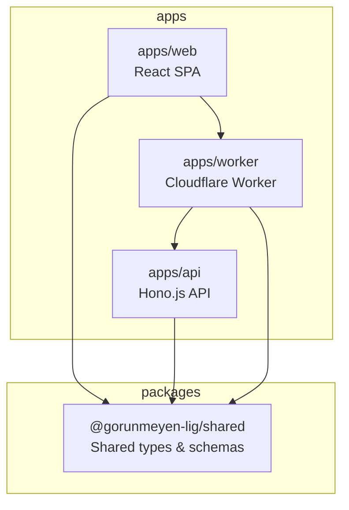
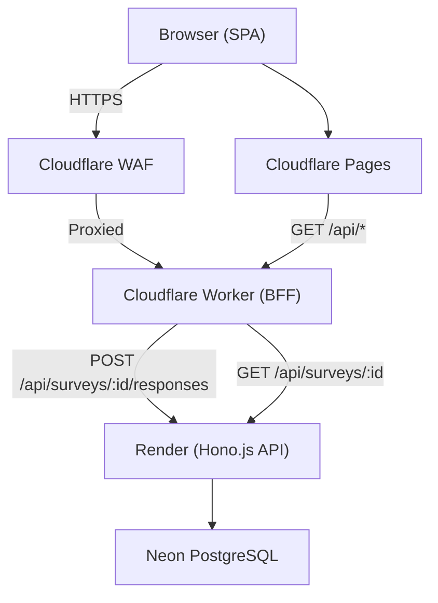
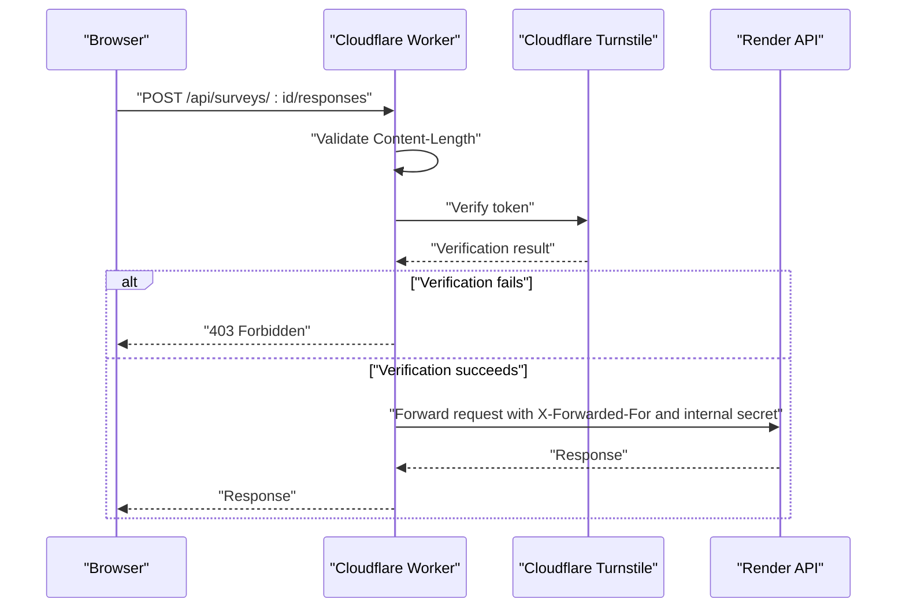
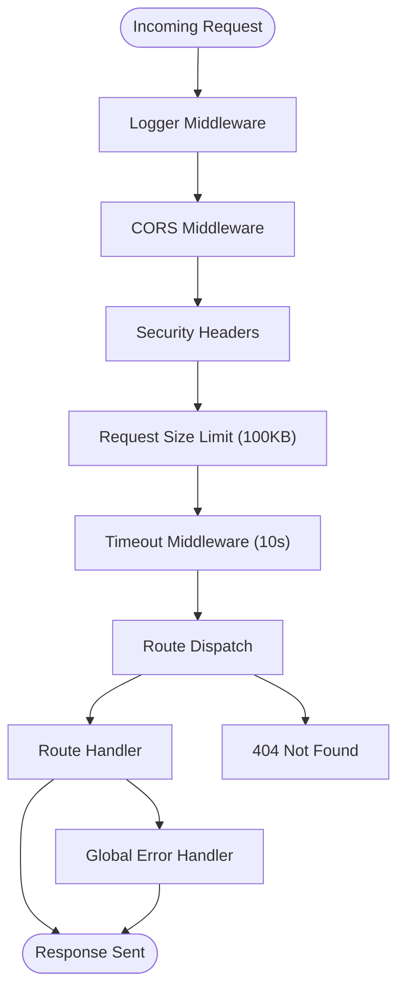
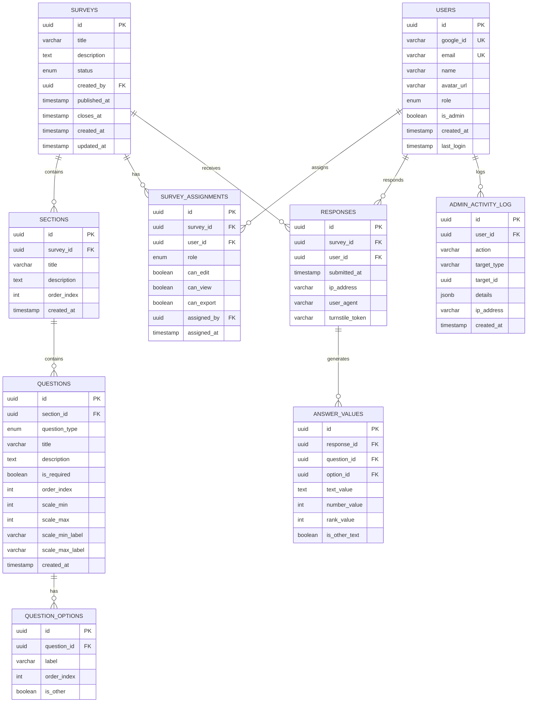
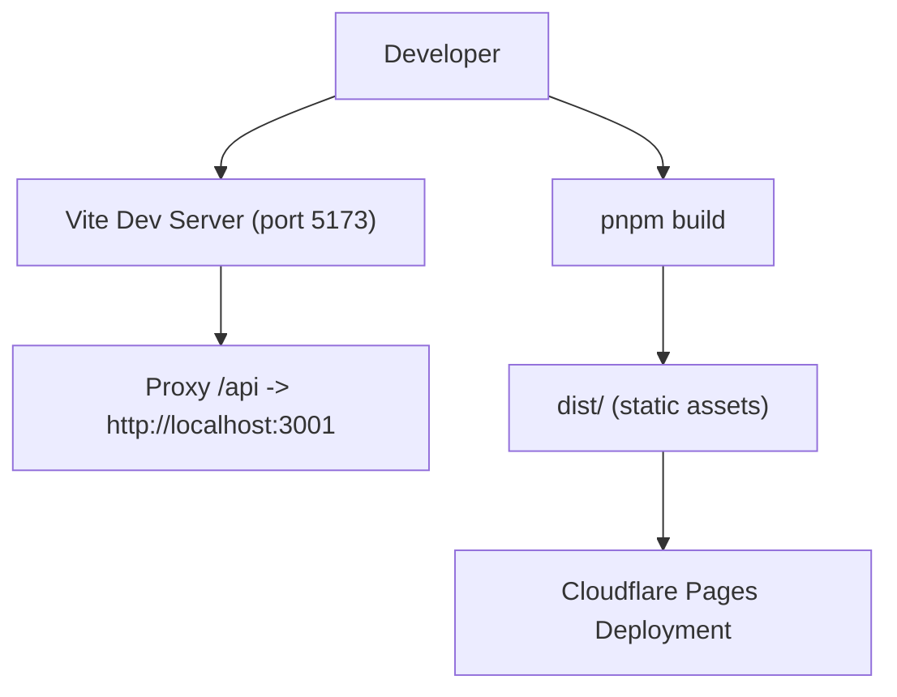
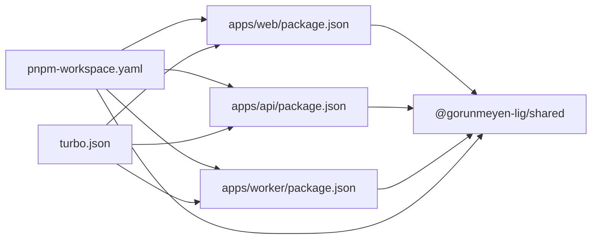
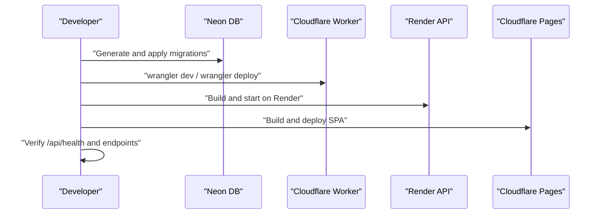

# Deployment and Operations

<cite>
**Referenced Files in This Document**
- [apps/worker/wrangler.toml](file://apps/worker/wrangler.toml)
- [apps/worker/src/index.ts](file://apps/worker/src/index.ts)
- [apps/worker/package.json](file://apps/worker/package.json)
- [apps/api/src/index.ts](file://apps/api/src/index.ts)
- [apps/api/src/db/index.ts](file://apps/api/src/db/index.ts)
- [apps/api/src/db/schema.ts](file://apps/api/src/db/schema.ts)
- [apps/api/drizzle.config.ts](file://apps/api/drizzle.config.ts)
- [apps/api/package.json](file://apps/api/package.json)
- [apps/web/vite.config.ts](file://apps/web/vite.config.ts)
- [apps/web/package.json](file://apps/web/package.json)
- [packages/shared/package.json](file://packages/shared/package.json)
- [turbo.json](file://turbo.json)
- [pnpm-workspace.yaml](file://pnpm-workspace.yaml)
- [plan.md](file://plan.md)
</cite>

## Table of Contents
1. [Introduction](#introduction)
2. [Project Structure](#project-structure)
3. [Core Components](#core-components)
4. [Architecture Overview](#architecture-overview)
5. [Detailed Component Analysis](#detailed-component-analysis)
6. [Dependency Analysis](#dependency-analysis)
7. [Performance Considerations](#performance-considerations)
8. [Monitoring and Logging](#monitoring-and-logging)
9. [Backup and Disaster Recovery](#backup-and-disaster-recovery)
10. [Scaling Considerations](#scaling-considerations)
11. [Operational Security Measures](#operational-security-measures)
12. [Complete Deployment Pipeline](#complete-deployment-pipeline)
13. [Troubleshooting Guide](#troubleshooting-guide)
14. [Conclusion](#conclusion)

## Introduction
This document provides production-focused deployment and operations guidance for the project. It covers Cloudflare deployment configuration (Wrangler TOML, environment variables, and deployment workflows), database setup and management with Neon PostgreSQL, frontend build and deployment for Cloudflare Pages, monitoring and logging strategies, performance optimization techniques, troubleshooting procedures, backup and disaster recovery, scaling considerations, operational security measures, and the complete deployment pipeline from development through production with proper environment management.

## Project Structure
The project is a monorepo organized into three applications and a shared package:
- apps/web: React SPA hosted on Cloudflare Pages
- apps/api: Hono.js REST API hosted on Render
- apps/worker: Cloudflare Worker acting as a BFF proxy
- packages/shared: Shared types and validation schemas

**Diagram sources**
- [pnpm-workspace.yaml:1-4](file://pnpm-workspace.yaml#L1-L4)
- [apps/web/package.json:1-51](file://apps/web/package.json#L1-L51)
- [apps/api/package.json:1-34](file://apps/api/package.json#L1-L34)
- [apps/worker/package.json:1-24](file://apps/worker/package.json#L1-L24)
- [packages/shared/package.json:1-18](file://packages/shared/package.json#L1-L18)

**Section sources**
- [pnpm-workspace.yaml:1-4](file://pnpm-workspace.yaml#L1-L4)
- [turbo.json:1-29](file://turbo.json#L1-L29)

## Core Components
- Cloudflare Worker (BFF Proxy): Enforces security (Turnstile, rate limiting, CORS), proxies API requests to Render, and forwards client IP and internal secret headers.
- Hono.js API (Render): Provides REST endpoints, middleware stack (CORS, security headers, request size limits, timeouts), health checks, and centralized error handling.
- Neon PostgreSQL (via Drizzle ORM): Type-safe schema definitions, migrations, and connection management.
- Cloudflare Pages (frontend): Static SPA hosting with Vite build pipeline.

Key operational scripts and configuration:
- Worker deployment scripts and Wrangler configuration
- API database migration and build scripts
- Web build and preview scripts

**Section sources**
- [apps/worker/src/index.ts:1-106](file://apps/worker/src/index.ts#L1-L106)
- [apps/worker/wrangler.toml:1-13](file://apps/worker/wrangler.toml#L1-L13)
- [apps/worker/package.json:6-11](file://apps/worker/package.json#L6-L11)
- [apps/api/src/index.ts:1-67](file://apps/api/src/index.ts#L1-L67)
- [apps/api/src/db/index.ts:1-9](file://apps/api/src/db/index.ts#L1-L9)
- [apps/api/drizzle.config.ts:1-11](file://apps/api/drizzle.config.ts#L1-L11)
- [apps/web/vite.config.ts:1-26](file://apps/web/vite.config.ts#L1-L26)
- [apps/web/package.json:6-11](file://apps/web/package.json#L6-L11)

## Architecture Overview
The system follows an edge-first architecture:
- Cloudflare WAF and security features protect traffic.
- Cloudflare Workers validate bot protection and enforce rate limits before forwarding requests to the backend.
- The backend (Render) hosts the Hono.js API with strict middleware and security controls.
- Neon PostgreSQL serves as the serverless database with Drizzle ORM.

**Diagram sources**
- [plan.md:139-184](file://plan.md#L139-L184)
- [apps/worker/src/index.ts:42-79](file://apps/worker/src/index.ts#L42-L79)
- [apps/api/src/index.ts:11-37](file://apps/api/src/index.ts#L11-L37)

## Detailed Component Analysis

### Cloudflare Worker (BFF Proxy)
Responsibilities:
- Enforce CORS for the frontend origin only
- Apply security headers
- Validate Cloudflare Turnstile for specific endpoints
- Enforce request size limits
- Proxy all /api/* requests to the backend with forwarded client IP and internal secret header

Operational configuration:
- Variables for API base URL and frontend URL
- Secret keys for Turnstile and Upstash Redis (configured externally)

**Diagram sources**
- [apps/worker/src/index.ts:15-40](file://apps/worker/src/index.ts#L15-L40)
- [apps/worker/src/index.ts:42-79](file://apps/worker/src/index.ts#L42-L79)
- [apps/worker/src/index.ts:81-103](file://apps/worker/src/index.ts#L81-L103)
- [apps/worker/wrangler.toml:5-12](file://apps/worker/wrangler.toml#L5-L12)

**Section sources**
- [apps/worker/src/index.ts:1-106](file://apps/worker/src/index.ts#L1-L106)
- [apps/worker/wrangler.toml:1-13](file://apps/worker/wrangler.toml#L1-L13)
- [apps/worker/package.json:6-11](file://apps/worker/package.json#L6-L11)

### Hono.js API (Render)
Responsibilities:
- Centralized middleware stack: CORS, security headers, request size limits, timeouts
- Health check endpoint
- Global error handling and 404 handling
- Environment-driven configuration for ports and origins

**Diagram sources**
- [apps/api/src/index.ts:11-58](file://apps/api/src/index.ts#L11-L58)

**Section sources**
- [apps/api/src/index.ts:1-67](file://apps/api/src/index.ts#L1-L67)

### Database Setup and Management (Neon PostgreSQL)
Schema and connection:
- Drizzle ORM schema defines enums, tables, indexes, and relationships
- Neon serverless driver connection with environment variable for database URL
- Drizzle Kit configuration for migrations

**Diagram sources**
- [apps/api/src/db/schema.ts:19-247](file://apps/api/src/db/schema.ts#L19-L247)

**Section sources**
- [apps/api/src/db/index.ts:1-9](file://apps/api/src/db/index.ts#L1-L9)
- [apps/api/src/db/schema.ts:1-247](file://apps/api/src/db/schema.ts#L1-L247)
- [apps/api/drizzle.config.ts:1-11](file://apps/api/drizzle.config.ts#L1-L11)

### Frontend Build and Deployment (Cloudflare Pages)
Build configuration:
- Vite with React plugin
- Local proxy to backend during development
- Production build output directory and sourcemaps disabled

**Diagram sources**
- [apps/web/vite.config.ts:12-25](file://apps/web/vite.config.ts#L12-L25)
- [apps/web/package.json:6-11](file://apps/web/package.json#L6-L11)

**Section sources**
- [apps/web/vite.config.ts:1-26](file://apps/web/vite.config.ts#L1-L26)
- [apps/web/package.json:1-51](file://apps/web/package.json#L1-L51)

## Dependency Analysis
Internal dependencies:
- apps/web depends on packages/shared
- apps/api depends on packages/shared
- apps/worker depends on packages/shared

Workspace and build orchestration:
- pnpm workspace configuration
- Turborepo tasks for building, linting, and database operations

**Diagram sources**
- [pnpm-workspace.yaml:1-4](file://pnpm-workspace.yaml#L1-L4)
- [turbo.json:3-27](file://turbo.json#L3-L27)
- [apps/web/package.json:12-17](file://apps/web/package.json#L12-L17)
- [apps/api/package.json:16-17](file://apps/api/package.json#L16-L17)
- [apps/worker/package.json:12-13](file://apps/worker/package.json#L12-L13)
- [packages/shared/package.json:1-18](file://packages/shared/package.json#L1-L18)

**Section sources**
- [pnpm-workspace.yaml:1-4](file://pnpm-workspace.yaml#L1-L4)
- [turbo.json:1-29](file://turbo.json#L1-L29)

## Performance Considerations
- Database connection pooling: Neon proxy-based connections with direct connections disabled
- Request size limits and timeouts at the edge and backend reduce resource contention
- Keep-Alive strategy to prevent Render free tier idle sleep
- CDN caching and static asset delivery via Cloudflare Pages

[No sources needed since this section provides general guidance]

## Monitoring and Logging
- API logs: Hono logger middleware captures requests; global error handler ensures errors are logged and returned as JSON
- Health checks: Dedicated endpoint for uptime and readiness probes
- Worker observability: Cloudflare Workers dashboard for metrics and logs
- Database monitoring: Neon console for query performance and connection stats

**Section sources**
- [apps/api/src/index.ts:12-12](file://apps/api/src/index.ts#L12-L12)
- [apps/api/src/index.ts:40-42](file://apps/api/src/index.ts#L40-L42)
- [apps/worker/src/index.ts:16-28](file://apps/worker/src/index.ts#L16-L28)

## Backup and Disaster Recovery
- Neon branching: Create isolated branches from live database for testing and rollback
- Drizzle migrations: Versioned schema changes applied consistently across environments
- Secrets management: Store sensitive values as Cloudflare Worker secrets and environment variables on Render

**Section sources**
- [plan.md:209-212](file://plan.md#L209-L212)
- [apps/api/drizzle.config.ts:7-9](file://apps/api/drizzle.config.ts#L7-L9)
- [apps/worker/wrangler.toml:9-12](file://apps/worker/wrangler.toml#L9-L12)

## Scaling Considerations
- Current free tier constraints and risk assessment for Cloudflare Pages, Workers, Render, Neon, and Upstash Redis
- Upgrade paths: Neon Pro, Render Starter
- Keep-Alive strategy to maintain Render instances awake

**Section sources**
- [plan.md:750-763](file://plan.md#L750-L763)
- [plan.md:738-742](file://plan.md#L738-L742)

## Operational Security Measures
- Triple firewall: Cloudflare WAF/DDoS → Worker validations → Hono middleware
- Bot protection: Cloudflare Turnstile (invisible), rate limiting with Upstash Redis
- Network isolation: Render IP whitelist allows only Cloudflare IPs
- Input validation and sanitization: Zod runtime validation, DOMPurify for frontend
- CORS enforcement and security headers at the edge and backend

**Section sources**
- [plan.md:187-262](file://plan.md#L187-L262)
- [apps/worker/src/index.ts:42-79](file://apps/worker/src/index.ts#L42-L79)
- [apps/api/src/index.ts:15-22](file://apps/api/src/index.ts#L15-L22)

## Complete Deployment Pipeline
End-to-end deployment workflow:
- Local development: Vite dev server with proxy to backend
- Database migrations: Generate and apply migrations via Drizzle Kit
- Worker deployment: Use Wrangler scripts for local dev and production deployment
- Frontend deployment: Build and deploy static assets to Cloudflare Pages
- Backend deployment: Build and start the Hono.js API on Render with health checks

**Diagram sources**
- [apps/api/package.json:10-14](file://apps/api/package.json#L10-L14)
- [apps/worker/package.json:7-10](file://apps/worker/package.json#L7-L10)
- [apps/web/package.json:7-10](file://apps/web/package.json#L7-L10)
- [apps/api/src/index.ts:40-42](file://apps/api/src/index.ts#L40-L42)

**Section sources**
- [apps/api/package.json:1-34](file://apps/api/package.json#L1-L34)
- [apps/worker/package.json:1-24](file://apps/worker/package.json#L1-L24)
- [apps/web/package.json:1-51](file://apps/web/package.json#L1-L51)
- [apps/api/src/index.ts:40-42](file://apps/api/src/index.ts#L40-L42)

## Troubleshooting Guide
Common issues and resolutions:
- CORS failures: Verify FRONTEND_URL matches the origin and Worker CORS configuration
- Turnstile verification errors: Confirm TURNSTILE_SECRET_KEY is set and token is present in request body
- Database connectivity: Ensure DATABASE_URL is configured and reachable; verify Neon connection string
- Request size errors: Requests exceeding 100KB will be rejected by Worker and API middleware
- Health check failures: Confirm API health endpoint responds and Render health check path is correct
- Worker deployment: Use dry-run before deploying; verify vars and secrets are configured

**Section sources**
- [apps/worker/src/index.ts:16-28](file://apps/worker/src/index.ts#L16-L28)
- [apps/worker/src/index.ts:42-79](file://apps/worker/src/index.ts#L42-L79)
- [apps/api/src/db/index.ts:5-5](file://apps/api/src/db/index.ts#L5-L5)
- [apps/api/src/index.ts:25-32](file://apps/api/src/index.ts#L25-L32)
- [apps/api/src/index.ts:40-42](file://apps/api/src/index.ts#L40-L42)
- [apps/worker/wrangler.toml:5-12](file://apps/worker/wrangler.toml#L5-L12)

## Conclusion
This guide consolidates production deployment and operations practices for the project. By leveraging Cloudflare’s edge capabilities, Render for backend hosting, and Neon for database management, the system achieves strong security, scalability, and maintainability. Follow the outlined procedures for environment configuration, deployment workflows, monitoring, and operational security to ensure reliable service delivery.