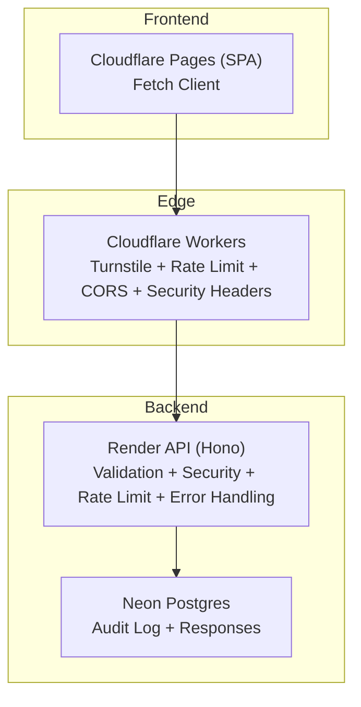
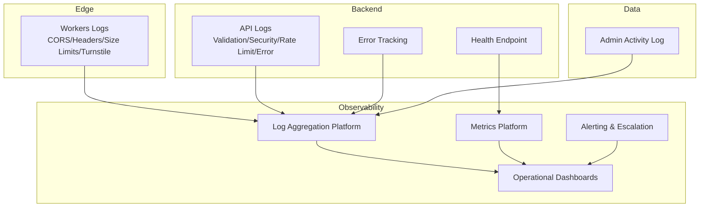
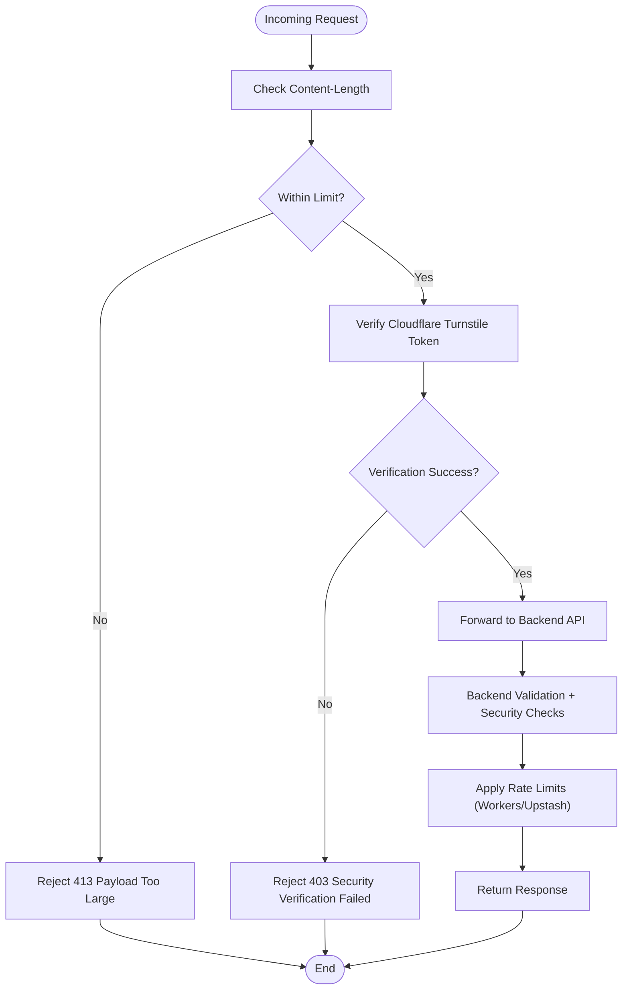
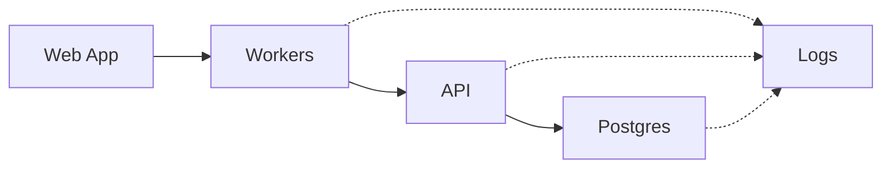

# Monitoring and Logging

<cite>
**Referenced Files in This Document**
- [apps/api/src/index.ts](file://apps/api/src/index.ts)
- [apps/api/src/middleware/rateLimit.ts](file://apps/api/src/middleware/rateLimit.ts)
- [apps/api/src/middleware/security.ts](file://apps/api/src/middleware/security.ts)
- [apps/api/src/middleware/validate.ts](file://apps/api/src/middleware/validate.ts)
- [apps/api/src/db/schema.ts](file://apps/api/src/db/schema.ts)
- [apps/worker/src/index.ts](file://apps/worker/src/index.ts)
- [apps/worker/wrangler.toml](file://apps/worker/wrangler.toml)
- [apps/web/src/lib/api.ts](file://apps/web/src/lib/api.ts)
- [apps/web/src/stores/auth-store.ts](file://apps/web/src/stores/auth-store.ts)
- [plan.md](file://plan.md)
</cite>

## Table of Contents
1. [Introduction](#introduction)
2. [Project Structure](#project-structure)
3. [Core Components](#core-components)
4. [Architecture Overview](#architecture-overview)
5. [Detailed Component Analysis](#detailed-component-analysis)
6. [Dependency Analysis](#dependency-analysis)
7. [Performance Considerations](#performance-considerations)
8. [Troubleshooting Guide](#troubleshooting-guide)
9. [Conclusion](#conclusion)
10. [Appendices](#appendices)

## Introduction
This document defines a comprehensive monitoring and logging strategy for production observability and operational visibility across the Cloudflare Workers-based edge proxy and the backend API. It covers logging approaches for both environments, structured logging and log aggregation, monitoring for application performance, error tracking, and security events, plus rate limiting and security monitoring. It also outlines alerting configurations, dashboard setup, and incident response procedures, ensuring a complete monitoring strategy from basic health checks to advanced analytics and alerting with escalation.

## Project Structure
The system consists of:
- Cloudflare Pages frontend (React SPA)
- Cloudflare Workers edge proxy (BFF) with Turnstile, rate limiting, and request forwarding
- Render-hosted backend API (Hono.js) with middleware for validation, security, rate limiting, and error handling
- Neon Postgres for data persistence with audit logging
- Shared package for types and schemas

**Diagram sources**
- [apps/worker/src/index.ts:1-106](file://apps/worker/src/index.ts#L1-L106)
- [apps/api/src/index.ts:1-67](file://apps/api/src/index.ts#L1-L67)
- [apps/api/src/db/schema.ts:228-246](file://apps/api/src/db/schema.ts#L228-L246)
- [apps/web/src/lib/api.ts:1-60](file://apps/web/src/lib/api.ts#L1-L60)

**Section sources**
- [plan.md:139-176](file://plan.md#L139-L176)

## Core Components
- Cloudflare Workers edge proxy: Enforces CORS, security headers, request size limits, Turnstile verification for submissions, and forwards requests to the backend with forwarded client metadata.
- Render backend API: Provides health checks, structured logging via middleware, request timeouts, CORS, security headers, validation, security checks, rate limiting, and centralized error handling.
- Database schema: Includes an admin activity log table suitable for audit and security event tracking.
- Frontend API client: Centralized fetch wrapper for API interactions.

Key monitoring touchpoints:
- Structured logs for requests, errors, and security events
- Health endpoints for uptime monitoring
- Rate limiting headers and metrics
- Security middleware outputs (timing, honeypot, validation)
- Audit log table for admin actions

**Section sources**
- [apps/worker/src/index.ts:15-40](file://apps/worker/src/index.ts#L15-L40)
- [apps/worker/src/index.ts:42-79](file://apps/worker/src/index.ts#L42-L79)
- [apps/api/src/index.ts:12-37](file://apps/api/src/index.ts#L12-L37)
- [apps/api/src/index.ts:39-42](file://apps/api/src/index.ts#L39-L42)
- [apps/api/src/index.ts:49-58](file://apps/api/src/index.ts#L49-L58)
- [apps/api/src/db/schema.ts:228-246](file://apps/api/src/db/schema.ts#L228-L246)
- [apps/web/src/lib/api.ts:1-60](file://apps/web/src/lib/api.ts#L1-L60)

## Architecture Overview
The monitoring and logging architecture integrates edge and backend layers with centralized log aggregation and alerting.

**Diagram sources**
- [apps/worker/src/index.ts:15-40](file://apps/worker/src/index.ts#L15-L40)
- [apps/worker/src/index.ts:42-79](file://apps/worker/src/index.ts#L42-L79)
- [apps/api/src/index.ts:12-37](file://apps/api/src/index.ts#L12-L37)
- [apps/api/src/index.ts:39-42](file://apps/api/src/index.ts#L39-L42)
- [apps/api/src/index.ts:49-58](file://apps/api/src/index.ts#L49-L58)
- [apps/api/src/db/schema.ts:228-246](file://apps/api/src/db/schema.ts#L228-L246)

## Detailed Component Analysis

### Logging Strategy
- Cloudflare Workers: Use console logging for request lifecycle events, security checks, and forwarding outcomes. Emit structured log records with correlation IDs, endpoint, method, status, and latency.
- Backend API: Use the built-in logger middleware to emit structured HTTP access logs. Augment with contextual fields such as user ID, IP, user agent, and request duration.
- Log aggregation: Forward logs to a centralized platform (e.g., Cloudflare Logs, external SIEM) for retention, filtering, and alerting.
- Log fields: Include timestamp, level, service, region, request ID, endpoint, method, status, duration, client IP, user agent, and error messages.

Implementation anchors:
- Workers request lifecycle and security checks
- API logger middleware and global error handler

**Section sources**
- [apps/worker/src/index.ts:15-40](file://apps/worker/src/index.ts#L15-L40)
- [apps/worker/src/index.ts:42-79](file://apps/worker/src/index.ts#L42-L79)
- [apps/api/src/index.ts:12-12](file://apps/api/src/index.ts#L12-L12)
- [apps/api/src/index.ts:49-53](file://apps/api/src/index.ts#L49-L53)

### Monitoring Setup
- Health checks: Expose a GET health endpoint returning service status and timestamp. Monitor via synthetic checks and uptime services.
- Performance: Track request latency, throughput, and error rates. Use platform-native metrics or export Prometheus metrics.
- Error tracking: Capture unhandled exceptions and validation failures. Aggregate by endpoint, error type, and user segment.
- Security events: Capture Turnstile verification outcomes, rate limit triggers, and admin activity log entries.

Implementation anchors:
- Health endpoint
- Global error handler
- Admin activity log table

**Section sources**
- [apps/api/src/index.ts:39-42](file://apps/api/src/index.ts#L39-L42)
- [apps/api/src/index.ts:49-58](file://apps/api/src/index.ts#L49-L58)
- [apps/api/src/db/schema.ts:228-246](file://apps/api/src/db/schema.ts#L228-L246)

### Rate Limiting and Security Monitoring
- Edge rate limiting: Workers enforces request size limits and optional rate limiting via Upstash Redis. Security headers and CORS are enforced at the edge.
- Backend rate limiting: In-memory rate limiter is provided for development; production should use Upstash-backed rate limiting in Workers.
- Security monitoring: Timing checks and honeypot fields detect automated submissions. Validation middleware ensures input integrity. Turnstile verifies human submissions.

Implementation anchors:
- Workers request size limit and Turnstile verification
- Backend rate limiting middleware
- Security middleware (timing, honeypot, IP/user agent extraction)

**Diagram sources**
- [apps/worker/src/index.ts:33-40](file://apps/worker/src/index.ts#L33-L40)
- [apps/worker/src/index.ts:42-79](file://apps/worker/src/index.ts#L42-L79)
- [apps/api/src/middleware/rateLimit.ts:14-53](file://apps/api/src/middleware/rateLimit.ts#L14-L53)
- [apps/api/src/middleware/security.ts:7-30](file://apps/api/src/middleware/security.ts#L7-L30)

**Section sources**
- [apps/worker/src/index.ts:33-40](file://apps/worker/src/index.ts#L33-L40)
- [apps/worker/src/index.ts:42-79](file://apps/worker/src/index.ts#L42-L79)
- [apps/api/src/middleware/rateLimit.ts:14-53](file://apps/api/src/middleware/rateLimit.ts#L14-L53)
- [apps/api/src/middleware/security.ts:7-30](file://apps/api/src/middleware/security.ts#L7-L30)

### Alerting Configurations
- Threshold-based alerts:
  - High error rate (>2% over 5 minutes)
  - Latency P95 > 2s
  - Health endpoint downtime
  - Rate limit exceeded (>5% of requests blocked)
  - Security events spikes (failed Turnstile, repeated honeypot hits)
- Anomaly detection:
  - Sudden spikes in response size or submission volume
  - Unusual geographic distribution of requests
- Escalation:
  - Page immediately on critical alerts
  - Notify on-call engineer after first threshold breach
  - Auto-ticket creation for repeated incidents

[No sources needed since this section provides general guidance]

### Dashboard Setup
- Operational dashboards:
  - Requests/sec, error rate, latency (p50/p95/p99)
  - Top endpoints by error rate and latency
  - Rate limit counters and resets
  - Security events: Turnstile failures, validation errors, honeypot hits
  - Admin activity log trends
- Real-time views:
  - Live logs with filters by service, level, and endpoint
  - Geo distribution of requests
- Retention and archival:
  - 30-day logs, 90-day metrics, long-term audit log retention

[No sources needed since this section provides general guidance]

### Incident Response Procedures
- Severity tiers:
  - S1: Service outage or data loss
  - S2: High error rate or latency degradation
  - S3: Security incident (unauthorized access, brute force)
  - S4: Minor performance regression
- Playbook:
  - Confirm impact and scope
  - Roll back recent changes if correlated
  - Scale resources or adjust rate limits
  - Investigate logs and security events
  - Communicate with stakeholders
  - Postmortem and remediation

[No sources needed since this section provides general guidance]

## Dependency Analysis
The monitoring stack depends on:
- Workers for edge enforcement and forwarding
- Backend API for validation, security, and rate limiting
- Database for audit logging
- Frontend for initiating requests

**Diagram sources**
- [apps/web/src/lib/api.ts:1-60](file://apps/web/src/lib/api.ts#L1-L60)
- [apps/worker/src/index.ts:82-103](file://apps/worker/src/index.ts#L82-L103)
- [apps/api/src/index.ts:1-67](file://apps/api/src/index.ts#L1-L67)
- [apps/api/src/db/schema.ts:228-246](file://apps/api/src/db/schema.ts#L228-L246)

**Section sources**
- [apps/web/src/lib/api.ts:1-60](file://apps/web/src/lib/api.ts#L1-L60)
- [apps/worker/src/index.ts:82-103](file://apps/worker/src/index.ts#L82-L103)
- [apps/api/src/index.ts:1-67](file://apps/api/src/index.ts#L1-L67)

## Performance Considerations
- Minimize edge-to-origin latency by keeping Workers logic close to user traffic.
- Use Upstash Redis for distributed rate limiting to avoid state inconsistencies.
- Apply request size limits to prevent oversized payloads from consuming backend resources.
- Instrument critical paths with timing and error tracking to identify bottlenecks.
- Tune rate limits per endpoint to balance user experience and abuse prevention.

[No sources needed since this section provides general guidance]

## Troubleshooting Guide
Common issues and resolutions:
- Health endpoint down: Verify deployment and environment variables. Check synthetic monitors.
- Frequent 413 errors: Reduce payload sizes or increase limits at the edge.
- Turnstile failures: Validate secret key configuration and network connectivity to the Turnstile endpoint.
- Rate limit exceeded: Increase thresholds temporarily or implement adaptive rate limiting.
- Validation errors: Review Zod schemas and client-side sanitization.
- Security events: Investigate spikes in honeypot or timing violations; review IP/user agent patterns.

**Section sources**
- [apps/api/src/index.ts:39-42](file://apps/api/src/index.ts#L39-L42)
- [apps/worker/src/index.ts:25-32](file://apps/worker/src/index.ts#L25-L32)
- [apps/worker/src/index.ts:57-76](file://apps/worker/src/index.ts#L57-L76)
- [apps/api/src/middleware/rateLimit.ts:38-44](file://apps/api/src/middleware/rateLimit.ts#L38-L44)
- [apps/api/src/middleware/validate.ts:7-28](file://apps/api/src/middleware/validate.ts#L7-L28)

## Conclusion
This monitoring and logging strategy leverages structured logs, health checks, rate limiting, and security middleware to deliver robust observability. By centralizing logs and metrics, setting actionable alerts, and maintaining clear dashboards and incident procedures, the system supports continuous reliability and rapid incident response across the edge and backend layers.

[No sources needed since this section summarizes without analyzing specific files]

## Appendices

### Appendix A: Logging Fields Reference
- Timestamp: ISO timestamp of the event
- Level: Log level (info, warn, error)
- Service: Service name (workers, api)
- Region: Edge region or deployment region
- RequestID: Correlation ID for request tracing
- Endpoint: Full path and method
- Status: HTTP status code
- DurationMs: Request duration in milliseconds
- ClientIP: Extracted client IP
- UserAgent: Client user agent
- ErrorMsg: Error message for failures
- Details: Additional structured details (validation errors, security events)

[No sources needed since this section provides general guidance]

### Appendix B: Rate Limiting Configuration Anchors
- Workers request size limit: [apps/worker/src/index.ts:33-40](file://apps/worker/src/index.ts#L33-L40)
- Workers Turnstile verification: [apps/worker/src/index.ts:42-79](file://apps/worker/src/index.ts#L42-L79)
- Backend in-memory rate limiter: [apps/api/src/middleware/rateLimit.ts:14-53](file://apps/api/src/middleware/rateLimit.ts#L14-L53)

**Section sources**
- [apps/worker/src/index.ts:33-40](file://apps/worker/src/index.ts#L33-L40)
- [apps/worker/src/index.ts:42-79](file://apps/worker/src/index.ts#L42-L79)
- [apps/api/src/middleware/rateLimit.ts:14-53](file://apps/api/src/middleware/rateLimit.ts#L14-L53)

### Appendix C: Security Middleware Anchors
- Timing check: [apps/api/src/middleware/security.ts:7-30](file://apps/api/src/middleware/security.ts#L7-L30)
- Honeypot check: [apps/api/src/middleware/security.ts:36-53](file://apps/api/src/middleware/security.ts#L36-L53)
- IP/User-Agent extraction: [apps/api/src/middleware/security.ts:58-72](file://apps/api/src/middleware/security.ts#L58-L72)

**Section sources**
- [apps/api/src/middleware/security.ts:7-30](file://apps/api/src/middleware/security.ts#L7-L30)
- [apps/api/src/middleware/security.ts:36-53](file://apps/api/src/middleware/security.ts#L36-L53)
- [apps/api/src/middleware/security.ts:58-72](file://apps/api/src/middleware/security.ts#L58-L72)

### Appendix D: Validation and Sanitization Anchors
- Body validation: [apps/api/src/middleware/validate.ts:7-28](file://apps/api/src/middleware/validate.ts#L7-L28)
- Query validation: [apps/api/src/middleware/validate.ts:33-49](file://apps/api/src/middleware/validate.ts#L33-L49)
- String/object sanitization: [apps/api/src/middleware/validate.ts:54-83](file://apps/api/src/middleware/validate.ts#L54-L83)

**Section sources**
- [apps/api/src/middleware/validate.ts:7-28](file://apps/api/src/middleware/validate.ts#L7-L28)
- [apps/api/src/middleware/validate.ts:33-49](file://apps/api/src/middleware/validate.ts#L33-L49)
- [apps/api/src/middleware/validate.ts:54-83](file://apps/api/src/middleware/validate.ts#L54-L83)

### Appendix E: Audit Logging Schema Anchor
- Admin activity log table: [apps/api/src/db/schema.ts:228-246](file://apps/api/src/db/schema.ts#L228-L246)

**Section sources**
- [apps/api/src/db/schema.ts:228-246](file://apps/api/src/db/schema.ts#L228-L246)