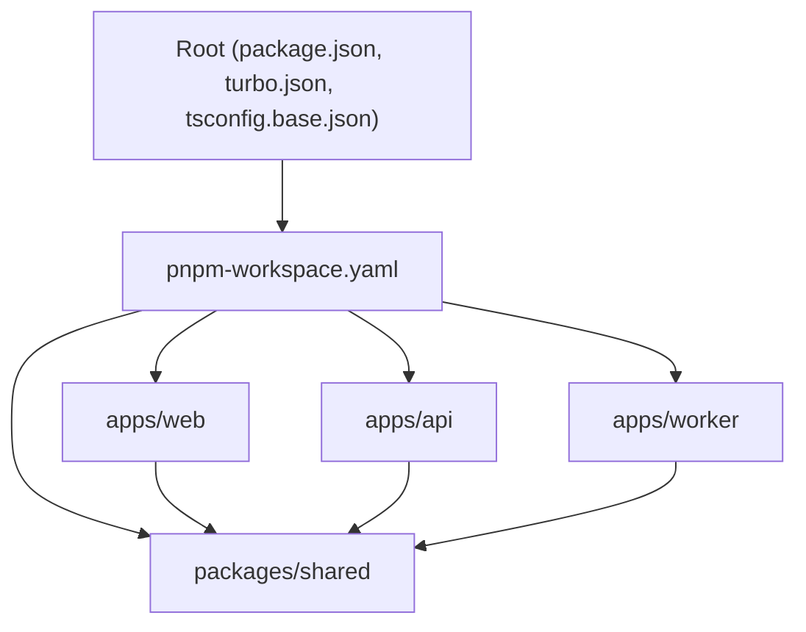
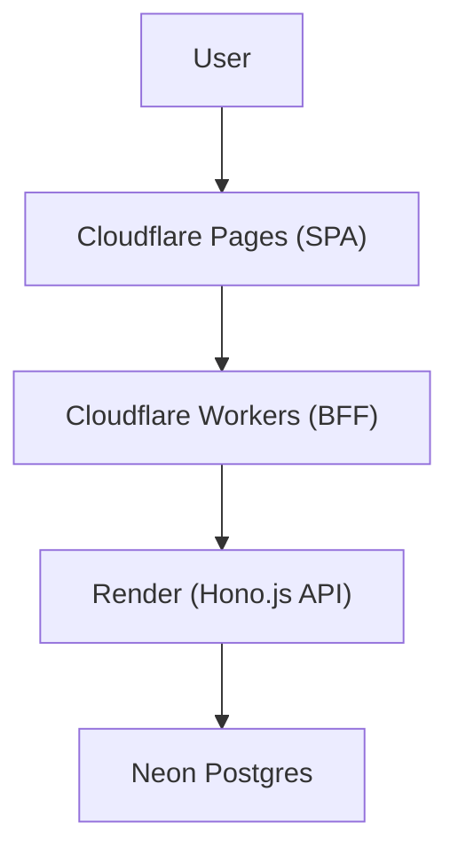
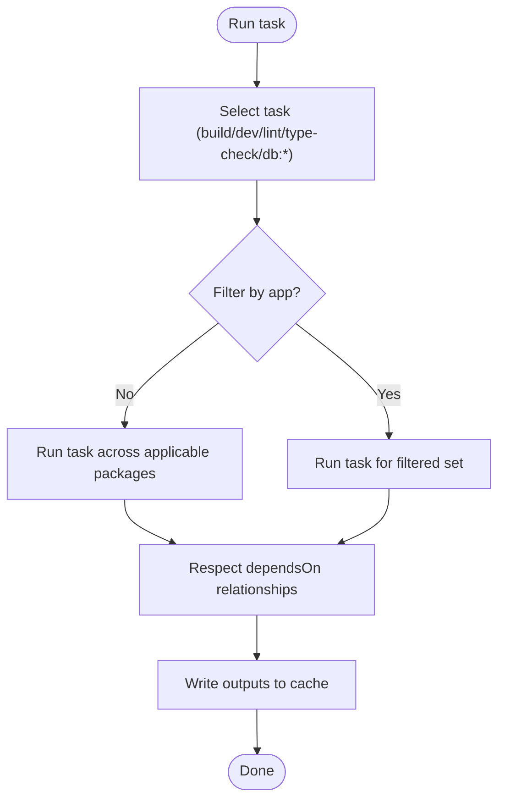
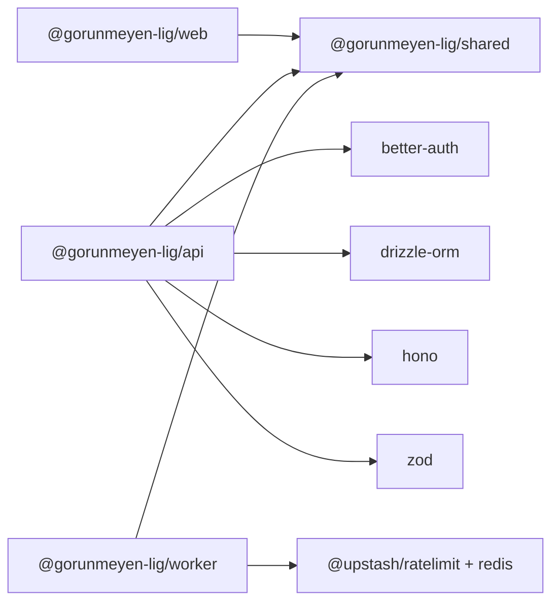

# Development Guidelines

<cite>
**Referenced Files in This Document**
- [package.json](file://package.json)
- [pnpm-workspace.yaml](file://pnpm-workspace.yaml)
- [turbo.json](file://turbo.json)
- [tsconfig.base.json](file://tsconfig.base.json)
- [apps/web/package.json](file://apps/web/package.json)
- [apps/web/tsconfig.json](file://apps/web/tsconfig.json)
- [apps/web/vite.config.ts](file://apps/web/vite.config.ts)
- [apps/web/tailwind.config.ts](file://apps/web/tailwind.config.ts)
- [apps/api/package.json](file://apps/api/package.json)
- [apps/api/tsconfig.json](file://apps/api/tsconfig.json)
- [apps/worker/package.json](file://apps/worker/package.json)
- [apps/worker/tsconfig.json](file://apps/worker/tsconfig.json)
- [packages/shared/package.json](file://packages/shared/package.json)
- [packages/shared/tsconfig.json](file://packages/shared/tsconfig.json)
- [plan.md](file://plan.md)
</cite>

## Table of Contents
1. [Introduction](#introduction)
2. [Project Structure](#project-structure)
3. [Core Components](#core-components)
4. [Architecture Overview](#architecture-overview)
5. [Detailed Component Analysis](#detailed-component-analysis)
6. [Dependency Analysis](#dependency-analysis)
7. [Performance Considerations](#performance-considerations)
8. [Troubleshooting Guide](#troubleshooting-guide)
9. [Conclusion](#conclusion)
10. [Appendices](#appendices)

## Introduction
This document defines development guidelines for the cursoranket project, covering code style, conventions, and best practices. It explains the Turborepo configuration for task orchestration, build processes, and development workflows; the pnpm workspace setup and monorepo navigation patterns; TypeScript configuration standards; linting and formatting expectations; practical development commands; testing strategies; code review processes; contribution guidelines; environment configuration; CI/CD integration; and release management procedures.

## Project Structure
The project is a monorepo organized with pnpm workspaces and Turborepo. The root coordinates tasks and shared configuration, while applications and packages are organized under apps and packages respectively. Shared types and validation schemas live in packages/shared.

**Diagram sources**
- [package.json:1-30](file://package.json#L1-L30)
- [pnpm-workspace.yaml:1-4](file://pnpm-workspace.yaml#L1-L4)
- [turbo.json:1-29](file://turbo.json#L1-L29)
- [tsconfig.base.json:1-19](file://tsconfig.base.json#L1-L19)

**Section sources**
- [package.json:1-30](file://package.json#L1-L30)
- [pnpm-workspace.yaml:1-4](file://pnpm-workspace.yaml#L1-L4)
- [turbo.json:1-29](file://turbo.json#L1-L29)
- [tsconfig.base.json:1-19](file://tsconfig.base.json#L1-L19)

## Core Components
- Root workspace scripts orchestrate development, builds, database tasks, linting, and type checks via Turborepo.
- apps/web is a React 19 SPA built with Vite, styled with Tailwind CSS and shadcn/ui, using Zustand for state and SWR for data fetching.
- apps/api is a Hono.js REST API (Node.js) using better-auth for Google OAuth, Drizzle ORM for type-safe database access, and Zod for runtime validation.
- apps/worker is a Cloudflare Worker acting as a BFF proxy, integrating Turnstile verification, Upstash rate limiting, and CORS enforcement.
- packages/shared provides shared TypeScript types and Zod schemas consumed by all apps.

Key conventions:
- Strict TypeScript configuration via a shared base.
- Workspace package names prefixed with the workspace scope.
- Consistent script naming for dev/build/lint/type-check across apps.
- Centralized overrides for dependency versions at the root.

**Section sources**
- [package.json:6-28](file://package.json#L6-L28)
- [apps/web/package.json:1-51](file://apps/web/package.json#L1-L51)
- [apps/api/package.json:1-34](file://apps/api/package.json#L1-L34)
- [apps/worker/package.json:1-24](file://apps/worker/package.json#L1-L24)
- [packages/shared/package.json:1-18](file://packages/shared/package.json#L1-L18)

## Architecture Overview
The system follows an edge-first architecture: Cloudflare WAF and Turnstile protect traffic at the edge; Cloudflare Workers enforce rate limiting and CORS; the SPA hosted on Cloudflare Pages proxies API requests to Cloudflare Workers, which forward to Render-hosted Hono.js backend. Neon Postgres serves as the serverless database.

**Diagram sources**
- [plan.md:141-177](file://plan.md#L141-L177)

**Section sources**
- [plan.md:139-184](file://plan.md#L139-L184)

## Detailed Component Analysis

### Turborepo Task Orchestration
- Tasks include build, dev, lint, type-check, and database tasks (generate/migrate/push).
- Build depends on upstream builds; dev is persistent and not cached; lint and type-check depend on build outputs.
- Root scripts delegate to Turborepo with optional filters for specific apps.

**Diagram sources**
- [turbo.json:3-27](file://turbo.json#L3-L27)
- [package.json:6-18](file://package.json#L6-L18)

**Section sources**
- [turbo.json:1-29](file://turbo.json#L1-L29)
- [package.json:6-18](file://package.json#L6-L18)

### pnpm Workspace Setup and Navigation
- Workspaces include apps/* and packages/*.
- Internal dependencies use workspace:* to ensure local linking.
- Overrides pin compatible versions for key libraries (e.g., drizzle-orm).

Navigation tips:
- Use pnpm scripts at root to run tasks across the monorepo.
- Install dependencies once at the root; Turborepo will execute per-app scripts.
- Use package names with the workspace scope when importing from shared packages.

**Section sources**
- [pnpm-workspace.yaml:1-4](file://pnpm-workspace.yaml#L1-L4)
- [package.json:24-28](file://package.json#L24-L28)
- [apps/web/package.json:12-13](file://apps/web/package.json#L12-L13)
- [apps/api/package.json:17](file://apps/api/package.json#L17)
- [apps/worker/package.json:12-13](file://apps/worker/package.json#L12-L13)
- [packages/shared/package.json:5](file://packages/shared/package.json#L5)

### TypeScript Configuration Standards
- Shared base sets strict compiler options, ESNext module resolution, and source/declaration maps.
- Each app extends the base and sets app-specific options (jsx, module, moduleResolution).
- packages/shared centralizes shared types and schemas.

Guidelines:
- Keep strict mode enabled.
- Prefer ESNext modules and bundler resolution for consistency.
- Use explicit outDir and rootDir per app.
- Add path aliases consistently (e.g., @/*) for maintainability.

**Section sources**
- [tsconfig.base.json:2-17](file://tsconfig.base.json#L2-L17)
- [apps/web/tsconfig.json:2-12](file://apps/web/tsconfig.json#L2-L12)
- [apps/api/tsconfig.json:2-10](file://apps/api/tsconfig.json#L2-L10)
- [apps/worker/tsconfig.json:2-12](file://apps/worker/tsconfig.json#L2-L12)
- [packages/shared/tsconfig.json:2-8](file://packages/shared/tsconfig.json#L2-L8)

### Linting and Formatting
- packages/shared exposes an ESLint-based lint script for shared code.
- Enforce consistent formatting and lint rules across the monorepo using shared tooling.
- Integrate pre-commit hooks to run lint and type-check locally before pushing.

Note: Specific ESLint and Prettier configurations are not present in the provided files; adopt a shared configuration at the root or in packages/shared to ensure uniformity.

**Section sources**
- [packages/shared/package.json:9](file://packages/shared/package.json#L9)

### Frontend (apps/web) Development Workflow
- Dev server runs on port 5173 with proxy to the backend API.
- Tailwind CSS configured with dark mode and custom theme tokens.
- React 19 with Vite; state managed by Zustand; data fetching by SWR; UI components from shadcn/ui.

Recommended commands:
- Start dev server: run the dev script in apps/web.
- Build for production: run the build script in apps/web.
- Preview production build: run the preview script in apps/web.
- Type-check: run the type-check script in apps/web.

**Section sources**
- [apps/web/package.json:6-11](file://apps/web/package.json#L6-L11)
- [apps/web/vite.config.ts:12-24](file://apps/web/vite.config.ts#L12-L24)
- [apps/web/tailwind.config.ts:4-52](file://apps/web/tailwind.config.ts#L4-L52)

### Backend (apps/api) Development Workflow
- Dev watcher uses tsx; build compiles TypeScript; start runs the compiled server.
- Drizzle ORM with drizzle-kit for schema generation, migrations, and studio.
- better-auth handles Google OAuth and session management; Hono.js routes; Zod validation.

Recommended commands:
- Start dev server: run the dev script in apps/api.
- Build: run the build script in apps/api.
- Start production: run the start script in apps/api.
- Generate schema: run the db:generate script in apps/api.
- Apply migrations: run the db:migrate script in apps/api.
- Push schema: run the db:push script in apps/api.
- Open schema studio: run the db:studio script in apps/api.
- Type-check: run the type-check script in apps/api.

**Section sources**
- [apps/api/package.json:6-15](file://apps/api/package.json#L6-L15)

### Edge Worker (apps/worker) Development Workflow
- Dev runs wrangler dev; build performs a dry-run deploy; deploy executes a real deploy.
- Integrates Turnstile verification, Upstash rate limiting, and CORS enforcement.
- Uses shared types and schemas.

Recommended commands:
- Start dev server: run the dev script in apps/worker.
- Dry-run build: run the build script in apps/worker.
- Deploy: run the deploy script in apps/worker.
- Type-check: run the type-check script in apps/worker.

**Section sources**
- [apps/worker/package.json:6-11](file://apps/worker/package.json#L6-L11)

### Shared Package (packages/shared)
- Provides shared types and Zod schemas.
- Exposes type-check and lint scripts for centralized validation.

Usage:
- Import shared types and schemas into apps/web, apps/api, and apps/worker.
- Keep shared schemas aligned with backend validation.

**Section sources**
- [packages/shared/package.json:1-18](file://packages/shared/package.json#L1-L18)

### Database Schema and Migrations
- Drizzle ORM is used for type-safe database operations.
- Migration commands are exposed via the API app’s scripts.
- The project plan documents the full schema and relationships.

Best practices:
- Keep schema definitions in sync with backend validation.
- Use migrations for incremental schema changes.
- Use drizzle studio for local schema inspection.

**Section sources**
- [apps/api/package.json:10-14](file://apps/api/package.json#L10-L14)
- [plan.md:265-394](file://plan.md#L265-L394)

## Dependency Analysis
- apps/web depends on packages/shared and UI libraries.
- apps/api depends on packages/shared, better-auth, Drizzle ORM, Hono, and Zod.
- apps/worker depends on packages/shared, Hono, and Upstash.
- packages/shared depends on Zod.

**Diagram sources**
- [apps/web/package.json:12-38](file://apps/web/package.json#L12-L38)
- [apps/api/package.json:16-26](file://apps/api/package.json#L16-L26)
- [apps/worker/package.json:12-17](file://apps/worker/package.json#L12-L17)
- [packages/shared/package.json:11-12](file://packages/shared/package.json#L11-L12)

**Section sources**
- [apps/web/package.json:12-38](file://apps/web/package.json#L12-L38)
- [apps/api/package.json:16-26](file://apps/api/package.json#L16-L26)
- [apps/worker/package.json:12-17](file://apps/worker/package.json#L12-L17)
- [packages/shared/package.json:11-12](file://packages/shared/package.json#L11-L12)

## Performance Considerations
- Edge-first design reduces backend load by validating and rate-limiting at the edge.
- Keep frontend bundles lean; enable production builds with minimal sourcemaps.
- Use efficient state management (Zustand) and caching (SWR) to minimize re-renders and network calls.
- Optimize database queries with proper indexing and schema design.

[No sources needed since this section provides general guidance]

## Troubleshooting Guide
Common issues and resolutions:
- Port conflicts during local development: adjust ports in Vite configuration or stop conflicting services.
- API proxy failures: verify proxy target matches the backend port and CORS settings.
- Database connectivity: confirm DATABASE_URL and credentials; ensure migrations are applied.
- Worker deployment errors: validate Wrangler configuration and secrets; check dry-run logs before deploying.
- Type errors: run type-check in affected packages; align shared types with schemas.

**Section sources**
- [apps/web/vite.config.ts:12-24](file://apps/web/vite.config.ts#L12-L24)
- [apps/api/package.json:10-14](file://apps/api/package.json#L10-L14)
- [apps/worker/package.json:6-11](file://apps/worker/package.json#L6-L11)

## Conclusion
This guide consolidates development practices for the cursoranket monorepo. By adhering to shared TypeScript configuration, consistent scripts, and Turborepo orchestration, teams can maintain a scalable and reliable development workflow. Align linting and formatting standards, enforce strict typing, and follow the recommended commands for local development, building, and deployment.

[No sources needed since this section summarizes without analyzing specific files]

## Appendices

### Development Commands Reference
- Root scripts:
  - Start all apps in dev: run the dev:web, dev:api, dev:worker scripts.
  - Build all: run the build script.
  - Build specific app: run the build:web, build:api, or build:worker scripts.
  - Database tasks: run db:generate, db:migrate, or db:push for the API app.
  - Lint and type-check: run lint and type-check at the root.
- apps/web:
  - dev, build, preview, type-check.
- apps/api:
  - dev, build, start, db:generate, db:migrate, db:push, db:studio, type-check.
- apps/worker:
  - dev, build (dry-run), deploy, type-check.
- packages/shared:
  - type-check, lint.

**Section sources**
- [package.json:6-18](file://package.json#L6-L18)
- [apps/web/package.json:6-11](file://apps/web/package.json#L6-L11)
- [apps/api/package.json:6-15](file://apps/api/package.json#L6-L15)
- [apps/worker/package.json:6-11](file://apps/worker/package.json#L6-L11)
- [packages/shared/package.json:7-10](file://packages/shared/package.json#L7-L10)

### Testing Strategies
- Unit tests: write unit tests for shared logic and small components; run via your test runner.
- Integration tests: validate API endpoints and database interactions using test databases.
- E2E tests: simulate user flows from SPA to backend through Workers.
- Snapshot tests: maintain UI stability for critical components.
- CI pipeline: run lint, type-check, unit tests, integration tests, and build verification on pull requests.

[No sources needed since this section provides general guidance]

### Code Review Processes
- Pull requests must pass lint, type-check, and tests.
- Review shared types and schemas for consistency across apps.
- Verify database migrations and schema changes.
- Confirm environment variables and secrets are handled securely.

[No sources needed since this section provides general guidance]

### Contribution Guidelines
- Branch by feature; keep commits small and focused.
- Update documentation and schemas when changing shared types.
- Add tests for new features and bug fixes.
- Rebase onto the latest main before opening PRs.

[No sources needed since this section provides general guidance]

### Environment Configuration
- Use .env.example as a template; populate environment variables per service.
- Keep secrets out of source code; use secure secret management.
- Validate environment variables at startup and fail fast on missing values.

**Section sources**
- [plan.md:668-700](file://plan.md#L668-L700)

### CI/CD Integration
- Pipeline stages: install dependencies, lint, type-check, build, test, and deploy.
- Cache dependencies and build outputs to speed up jobs.
- Deploy SPA to Cloudflare Pages, API to Render, and Worker to Cloudflare.
- Keep-alive strategy: periodic health checks to prevent cold starts on free tiers.

**Section sources**
- [plan.md:704-747](file://plan.md#L704-L747)

### Release Management
- Tag releases and create changelogs.
- Promote builds from staging to production after validation.
- Monitor edge logs and backend metrics post-release.

[No sources needed since this section provides general guidance]