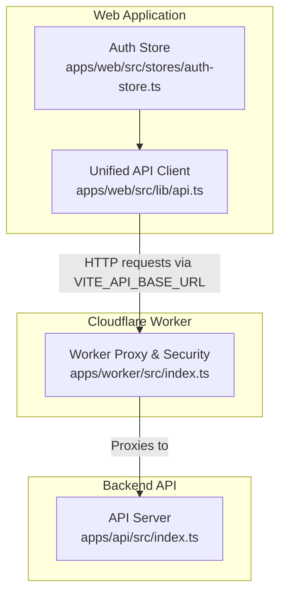
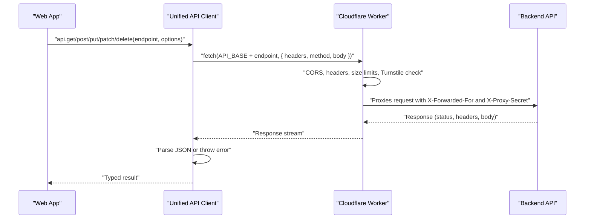
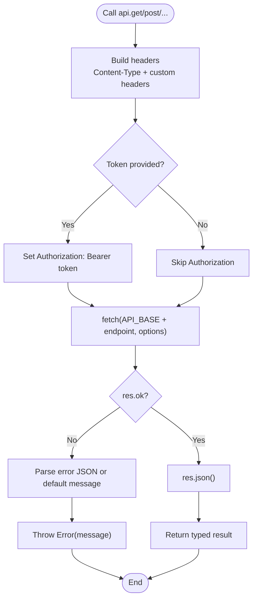
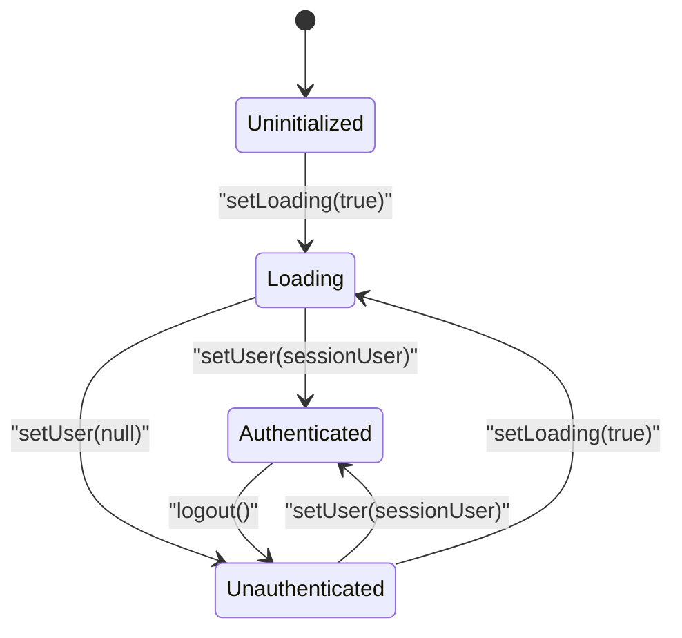
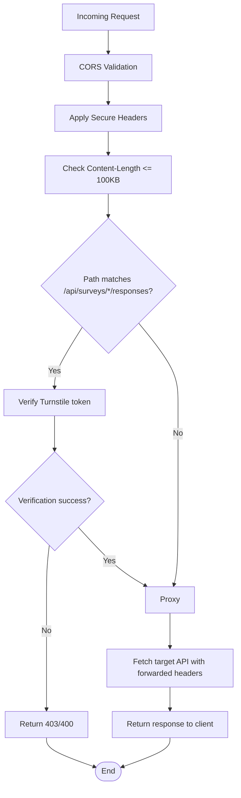
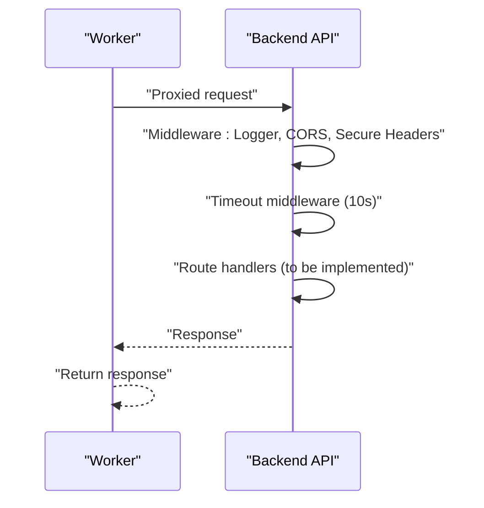
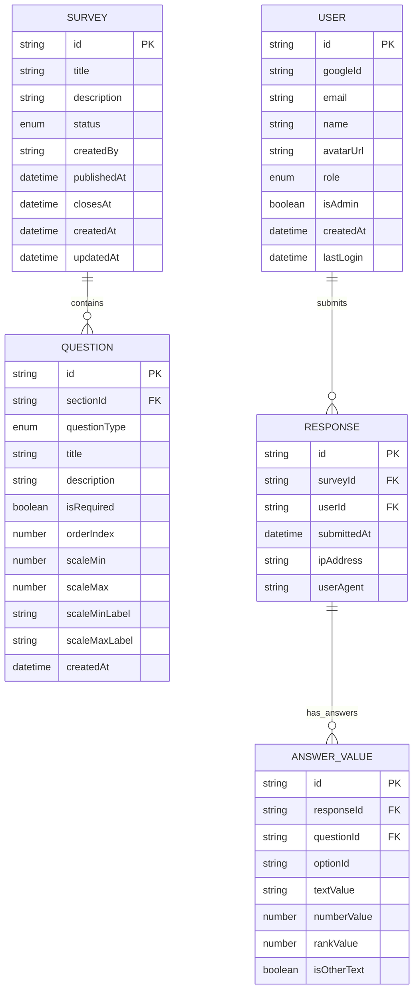
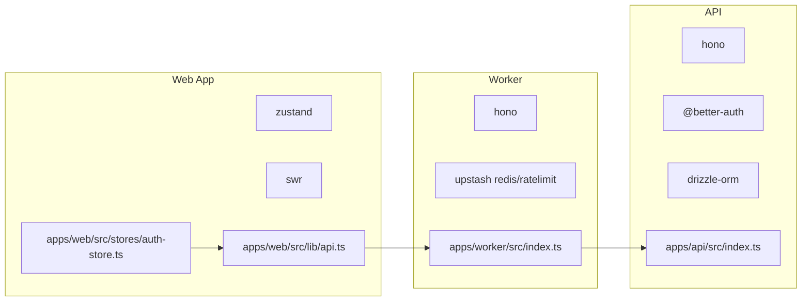

# API Integration Patterns

<cite>
**Referenced Files in This Document**
- [api.ts](file://apps/web/src/lib/api.ts)
- [auth-store.ts](file://apps/web/src/stores/auth-store.ts)
- [index.ts](file://apps/worker/src/index.ts)
- [index.ts](file://apps/api/src/index.ts)
- [user.ts](file://packages/shared/src/types/user.ts)
- [survey.ts](file://packages/shared/src/types/survey.ts)
- [question.ts](file://packages/shared/src/types/question.ts)
- [response.ts](file://packages/shared/src/types/response.ts)
- [survey.schema.ts](file://packages/shared/src/schemas/survey.schema.ts)
- [web package.json](file://apps/web/package.json)
- [worker package.json](file://apps/worker/package.json)
- [api package.json](file://apps/api/package.json)
</cite>

## Table of Contents
1. [Introduction](#introduction)
2. [Project Structure](#project-structure)
3. [Core Components](#core-components)
4. [Architecture Overview](#architecture-overview)
5. [Detailed Component Analysis](#detailed-component-analysis)
6. [Dependency Analysis](#dependency-analysis)
7. [Performance Considerations](#performance-considerations)
8. [Troubleshooting Guide](#troubleshooting-guide)
9. [Conclusion](#conclusion)
10. [Appendices](#appendices)

## Introduction
This document explains the API integration patterns implemented in the project, focusing on a unified client, token-based authentication, error handling, request/response transformations, and integration with a Cloudflare Worker proxy and backend API. It also covers practical usage patterns, state synchronization, security considerations, rate limiting strategies, offline handling, debugging techniques, and performance optimizations.

## Project Structure
The API integration spans three layers:
- Web application: Provides the unified API client and authentication state store.
- Cloudflare Worker: Acts as a proxy and applies security middleware for selected endpoints.
- Backend API: Serves endpoints with CORS, timeouts, logging, and global error handling.

**Diagram sources**
- [api.ts:1-60](file://apps/web/src/lib/api.ts#L1-L60)
- [auth-store.ts:1-31](file://apps/web/src/stores/auth-store.ts#L1-L31)
- [index.ts:1-106](file://apps/worker/src/index.ts#L1-L106)
- [index.ts:1-67](file://apps/api/src/index.ts#L1-L67)

**Section sources**
- [api.ts:1-60](file://apps/web/src/lib/api.ts#L1-L60)
- [auth-store.ts:1-31](file://apps/web/src/stores/auth-store.ts#L1-L31)
- [index.ts:1-106](file://apps/worker/src/index.ts#L1-L106)
- [index.ts:1-67](file://apps/api/src/index.ts#L1-L67)

## Core Components
- Unified API Client: A typed wrapper around fetch supporting GET, POST, PUT, PATCH, DELETE with automatic JSON serialization, Authorization header injection, and robust error handling.
- Authentication Store: A lightweight Zustand store managing user session, authentication state, and loading indicators.
- Worker Proxy: A Cloudflare Worker that proxies requests to the backend API, enforces CORS, sets security headers, validates request body sizes, performs Cloudflare Turnstile checks for specific endpoints, and forwards request/response metadata.
- Backend API: An Hono server with CORS, secure headers, request size limits, timeout middleware, health check endpoint, and global error handling.

Key capabilities:
- Token propagation: The API client injects Authorization headers when a token is provided.
- Error normalization: Non-OK responses are parsed and thrown as errors with user-friendly messages.
- Endpoint coverage: The worker proxies all /api/* routes while applying targeted security checks.
- Shared types and schemas: Strong typing for user, survey, question, and response domains.

**Section sources**
- [api.ts:1-60](file://apps/web/src/lib/api.ts#L1-L60)
- [auth-store.ts:1-31](file://apps/web/src/stores/auth-store.ts#L1-L31)
- [index.ts:1-106](file://apps/worker/src/index.ts#L1-L106)
- [index.ts:1-67](file://apps/api/src/index.ts#L1-L67)
- [user.ts:1-22](file://packages/shared/src/types/user.ts#L1-L22)
- [survey.ts:1-50](file://packages/shared/src/types/survey.ts#L1-L50)
- [question.ts:1-66](file://packages/shared/src/types/question.ts#L1-L66)
- [response.ts:1-53](file://packages/shared/src/types/response.ts#L1-L53)
- [survey.schema.ts:1-22](file://packages/shared/src/schemas/survey.schema.ts#L1-L22)

## Architecture Overview
The system routes client requests through a Cloudflare Worker proxy to the backend API. The worker enforces security policies and forwards traffic with minimal transformation. The backend API exposes endpoints with standardized middleware and error handling.

**Diagram sources**
- [api.ts:7-30](file://apps/web/src/lib/api.ts#L7-L30)
- [index.ts:82-103](file://apps/worker/src/index.ts#L82-L103)
- [index.ts:40-58](file://apps/api/src/index.ts#L40-L58)

## Detailed Component Analysis

### Unified API Client
The client encapsulates HTTP operations with:
- Base URL resolution via environment variable with fallback.
- Token-based Authorization header injection.
- JSON serialization for request bodies.
- Robust error handling with user-friendly messages derived from the backend.
- Typed responses using generics.

Practical usage patterns:
- Data fetching: Call api.get with optional token for protected resources.
- Mutations: Use api.post/api.put/api.patch with JSON payloads.
- Deletions: Use api.delete for resource removal.
- State synchronization: Combine with the auth store to pass tokens and reflect loading states.

Security and error handling:
- Authorization header is only added when a token is supplied.
- Non-2xx responses trigger normalized errors.
- JSON parsing failure is handled gracefully.

**Diagram sources**
- [api.ts:7-30](file://apps/web/src/lib/api.ts#L7-L30)

**Section sources**
- [api.ts:1-60](file://apps/web/src/lib/api.ts#L1-L60)

### Authentication Store
The store manages:
- Current user profile and authentication state.
- Loading state during authentication transitions.
- Logout action to reset state.

Integration with the API client:
- Retrieve the current token from the store and pass it to api.get/post/... calls.
- Reflect isLoading in UI to prevent concurrent actions and improve UX.

**Diagram sources**
- [auth-store.ts:13-30](file://apps/web/src/stores/auth-store.ts#L13-L30)

**Section sources**
- [auth-store.ts:1-31](file://apps/web/src/stores/auth-store.ts#L1-L31)
- [user.ts:15-21](file://packages/shared/src/types/user.ts#L15-L21)

### Cloudflare Worker Proxy and Security
The worker:
- Enforces CORS for allowed origins with credentials support.
- Adds security headers to all responses.
- Validates request body size to prevent abuse.
- Performs Cloudflare Turnstile verification for specific endpoints (surveys responses).
- Proxies all /api/* routes to the backend with forwarded IP and internal secret header.

Operational notes:
- The worker sets X-Forwarded-For and X-Proxy-Secret for downstream tracing and internal routing.
- Turnstile verification is performed only for the designated endpoint pattern.

**Diagram sources**
- [index.ts:15-40](file://apps/worker/src/index.ts#L15-L40)
- [index.ts:42-79](file://apps/worker/src/index.ts#L42-L79)
- [index.ts:81-103](file://apps/worker/src/index.ts#L81-L103)

**Section sources**
- [index.ts:1-106](file://apps/worker/src/index.ts#L1-L106)

### Backend API Server
The backend:
- Applies CORS, secure headers, and request size limits.
- Adds a timeout middleware for all /api/* endpoints.
- Exposes a health check endpoint.
- Provides global error handling and 404 handling.

**Diagram sources**
- [index.ts:11-37](file://apps/api/src/index.ts#L11-L37)
- [index.ts:40-58](file://apps/api/src/index.ts#L40-L58)

**Section sources**
- [index.ts:1-67](file://apps/api/src/index.ts#L1-L67)

### Data Types and Transformation Workflows
Shared types define the shape of user, survey, question, and response data. These types inform how the API client serializes requests and deserializes responses.

Transformation workflows:
- Requests: Serialize payload objects to JSON before sending.
- Responses: Deserialize JSON into strongly-typed models for safe UI rendering.
- Validation: Use shared schemas for input validation on the backend.

**Diagram sources**
- [user.ts:3-21](file://packages/shared/src/types/user.ts#L3-L21)
- [survey.ts:5-49](file://packages/shared/src/types/survey.ts#L5-L49)
- [question.ts:30-65](file://packages/shared/src/types/question.ts#L30-L65)
- [response.ts:1-52](file://packages/shared/src/types/response.ts#L1-L52)
- [survey.schema.ts:3-17](file://packages/shared/src/schemas/survey.schema.ts#L3-L17)

**Section sources**
- [user.ts:1-22](file://packages/shared/src/types/user.ts#L1-L22)
- [survey.ts:1-50](file://packages/shared/src/types/survey.ts#L1-L50)
- [question.ts:1-66](file://packages/shared/src/types/question.ts#L1-L66)
- [response.ts:1-53](file://packages/shared/src/types/response.ts#L1-L53)
- [survey.schema.ts:1-22](file://packages/shared/src/schemas/survey.schema.ts#L1-L22)

### Practical Examples and State Synchronization
- Fetching surveys: Use api.get with a token from the auth store to retrieve survey lists or details.
- Submitting responses: Use api.post with the Turnstile token and answers payload; ensure the worker’s Turnstile check passes.
- Updating survey metadata: Use api.put with validated inputs from shared schemas.
- State synchronization: On successful API calls, update the auth store to reflect loaded data and clear loading states.

Note: The current web app routes are minimal. Integrate the API client and auth store in page components to orchestrate data fetching and state updates.

**Section sources**
- [api.ts:32-59](file://apps/web/src/lib/api.ts#L32-L59)
- [auth-store.ts:13-30](file://apps/web/src/stores/auth-store.ts#L13-L30)
- [survey.schema.ts:3-17](file://packages/shared/src/schemas/survey.schema.ts#L3-L17)

## Dependency Analysis
External libraries and their roles:
- Web app:
  - Zustand: Lightweight state management for authentication.
  - SWR: Data fetching and caching library (available but not used in the API client).
- Worker:
  - Hono: Minimal server framework for middleware and routing.
  - Upstash Redis/Ratelimit: Rate limiting primitives (available but not yet configured).
- API:
  - Hono: Server framework with middleware stack.
  - Better Auth, Drizzle ORM: Authentication and database toolkit (available but routes not wired in the current server).

**Diagram sources**
- [web package.json:37-37](file://apps/web/package.json#L37-L37)
- [web package.json:34-34](file://apps/web/package.json#L34-L34)
- [worker package.json:14-16](file://apps/worker/package.json#L14-L16)
- [api package.json:19-25](file://apps/api/package.json#L19-L25)

**Section sources**
- [web package.json:1-51](file://apps/web/package.json#L1-L51)
- [worker package.json:1-24](file://apps/worker/package.json#L1-L24)
- [api package.json:1-34](file://apps/api/package.json#L1-L34)

## Performance Considerations
- Caching: Use SWR in the web app to cache responses and reduce redundant network calls.
- Request batching: Group related mutations to minimize round trips.
- Payload minimization: Send only required fields and avoid large payloads.
- Compression: Enable gzip/deflate on the backend if not already handled by the platform.
- Connection reuse: Reuse browser connections via keep-alive defaults.
- Debouncing: Debounce frequent reads to avoid thrashing the API.

[No sources needed since this section provides general guidance]

## Troubleshooting Guide
Common issues and resolutions:
- Network errors: Verify VITE_API_BASE_URL and ensure the worker is deployed and reachable.
- CORS failures: Confirm allowed origins and credentials settings in the worker and API servers.
- Unauthorized requests: Ensure the token is present in the API client options and the auth store is hydrated.
- Body too large: Reduce payload size below the 100KB limit enforced by the worker and API.
- Turnstile failures: Validate the token is included in the payload for the surveys responses endpoint.
- Timeouts: Increase backend timeout or optimize heavy endpoints; consider pagination.
- Error parsing: The API client normalizes non-OK responses; inspect thrown error messages for details.

Debugging techniques:
- Enable logging in the backend API server.
- Inspect request/response headers in the worker logs.
- Use browser dev tools to monitor network requests and error payloads.
- Add console logs in the API client around fetch and error parsing.

**Section sources**
- [api.ts:24-27](file://apps/web/src/lib/api.ts#L24-L27)
- [index.ts:34-40](file://apps/worker/src/index.ts#L34-L40)
- [index.ts:25-32](file://apps/api/src/index.ts#L25-L32)
- [index.ts:34-37](file://apps/api/src/index.ts#L34-L37)

## Conclusion
The project implements a clean, unified API integration pattern with explicit token handling, robust error management, and strong typing via shared schemas. The Cloudflare Worker proxy centralizes security and request enforcement, while the backend API provides standardized middleware and error handling. By combining the API client with the auth store and leveraging caching, teams can build reliable, maintainable features with predictable performance and security.

[No sources needed since this section summarizes without analyzing specific files]

## Appendices

### Environment Variables and Configuration
- VITE_API_BASE_URL: Base URL for API requests in the web app.
- FRONTEND_URL: Allowed origin for CORS in both worker and API servers.
- TURNSTILE_SECRET_KEY: Secret key for Turnstile verification in the worker.
- API_BASE_URL: Target backend base URL for the worker proxy.
- API_PORT: Port for the local API server.

**Section sources**
- [api.ts:1-1](file://apps/web/src/lib/api.ts#L1-L1)
- [index.ts:5-11](file://apps/worker/src/index.ts#L5-L11)
- [index.ts:60-64](file://apps/api/src/index.ts#L60-L64)