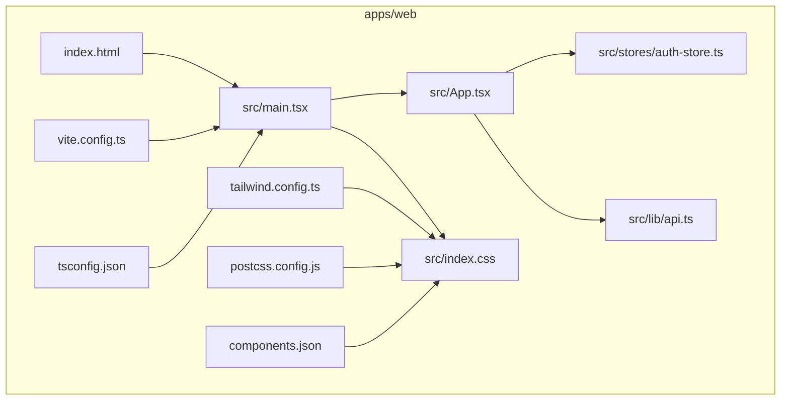
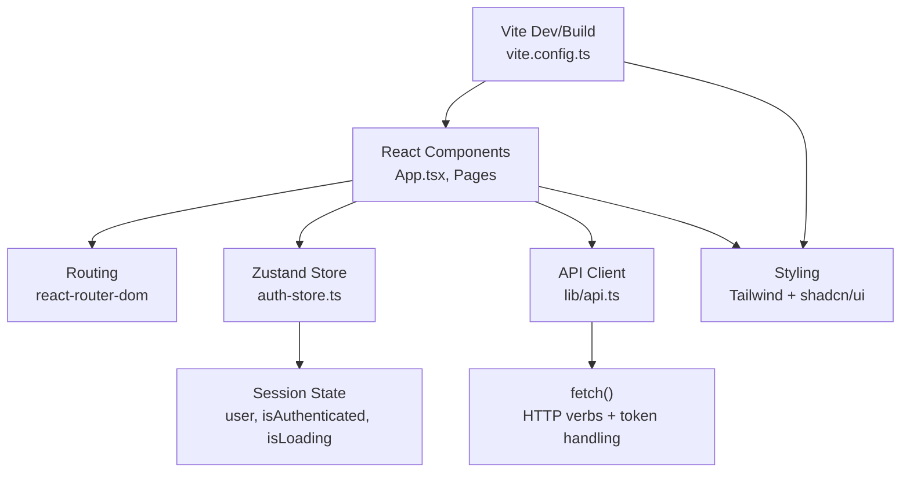
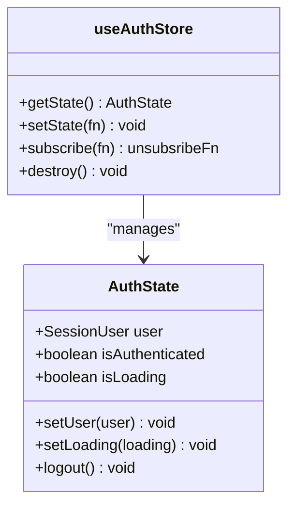
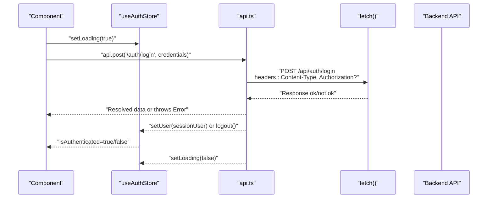
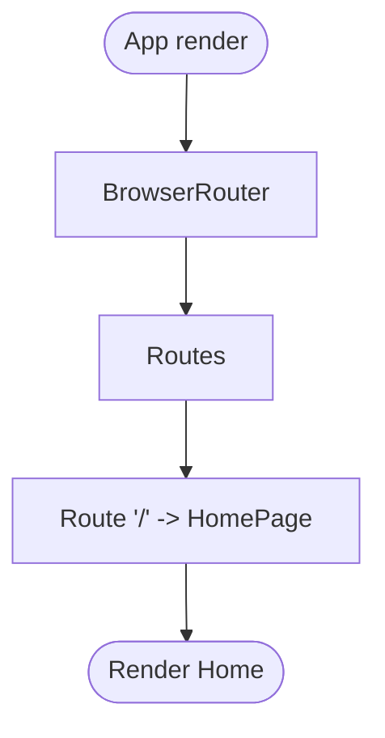
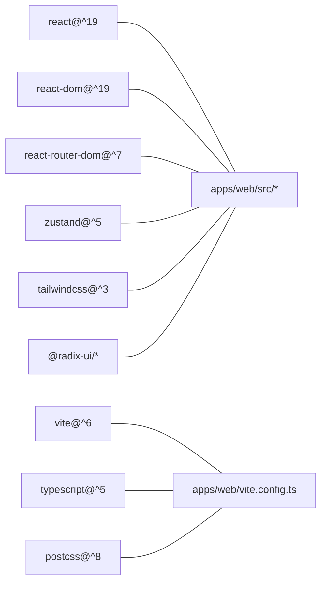

# Frontend Application (Web)

<cite>
**Referenced Files in This Document**
- [App.tsx](file://apps/web/src/App.tsx)
- [main.tsx](file://apps/web/src/main.tsx)
- [auth-store.ts](file://apps/web/src/stores/auth-store.ts)
- [api.ts](file://apps/web/src/lib/api.ts)
- [package.json](file://apps/web/package.json)
- [vite.config.ts](file://apps/web/vite.config.ts)
- [tailwind.config.ts](file://apps/web/tailwind.config.ts)
- [postcss.config.js](file://apps/web/postcss.config.js)
- [index.html](file://apps/web/index.html)
- [index.css](file://apps/web/src/index.css)
- [components.json](file://apps/web/components.json)
- [tsconfig.json](file://apps/web/tsconfig.json)
- [user.ts](file://packages/shared/src/types/user.ts)
- [index.ts](file://packages/shared/src/index.ts)
</cite>

## Table of Contents
1. [Introduction](#introduction)
2. [Project Structure](#project-structure)
3. [Core Components](#core-components)
4. [Architecture Overview](#architecture-overview)
5. [Detailed Component Analysis](#detailed-component-analysis)
6. [Dependency Analysis](#dependency-analysis)
7. [Performance Considerations](#performance-considerations)
8. [Troubleshooting Guide](#troubleshooting-guide)
9. [Conclusion](#conclusion)
10. [Appendices](#appendices)

## Introduction
This document describes the frontend application built as a React 19 Single Page Application (SPA). It covers the application structure, component hierarchy, state management with Zustand, routing and navigation, styling with Tailwind CSS and shadcn/ui, API integration via a unified client, build configuration with Vite, and responsive and accessibility considerations. The goal is to provide a clear understanding for developers and stakeholders to contribute effectively and maintain the application.

## Project Structure
The web application is organized around a small but cohesive set of files under apps/web. The structure emphasizes:
- Entry point rendering and routing
- Centralized state management
- Unified API client
- Styling with Tailwind CSS and shadcn/ui configuration
- Build and dev server configuration

**Diagram sources**
- [index.html:1-14](file://apps/web/index.html#L1-L14)
- [main.tsx:1-11](file://apps/web/src/main.tsx#L1-L11)
- [App.tsx:1-23](file://apps/web/src/App.tsx#L1-L23)
- [auth-store.ts:1-31](file://apps/web/src/stores/auth-store.ts#L1-L31)
- [api.ts:1-60](file://apps/web/src/lib/api.ts#L1-L60)
- [index.css:1-61](file://apps/web/src/index.css#L1-L61)
- [vite.config.ts:1-26](file://apps/web/vite.config.ts#L1-L26)
- [tailwind.config.ts:1-55](file://apps/web/tailwind.config.ts#L1-L55)
- [postcss.config.js:1-7](file://apps/web/postcss.config.js#L1-L7)
- [components.json:1-21](file://apps/web/components.json#L1-L21)
- [tsconfig.json:1-14](file://apps/web/tsconfig.json#L1-L14)

**Section sources**
- [index.html:1-14](file://apps/web/index.html#L1-L14)
- [main.tsx:1-11](file://apps/web/src/main.tsx#L1-L11)
- [App.tsx:1-23](file://apps/web/src/App.tsx#L1-L23)
- [auth-store.ts:1-31](file://apps/web/src/stores/auth-store.ts#L1-L31)
- [api.ts:1-60](file://apps/web/src/lib/api.ts#L1-L60)
- [index.css:1-61](file://apps/web/src/index.css#L1-L61)
- [vite.config.ts:1-26](file://apps/web/vite.config.ts#L1-L26)
- [tailwind.config.ts:1-55](file://apps/web/tailwind.config.ts#L1-L55)
- [postcss.config.js:1-7](file://apps/web/postcss.config.js#L1-L7)
- [components.json:1-21](file://apps/web/components.json#L1-L21)
- [tsconfig.json:1-14](file://apps/web/tsconfig.json#L1-L14)

## Core Components
- Application shell and routing: The root App component sets up React Router’s BrowserRouter, Routes, and a single route to a home page component. This establishes the SPA routing foundation.
- Root rendering: The main entry point creates the React root and renders the App component inside a strict mode wrapper.
- Authentication state: A Zustand store manages user session, authentication status, and loading state. It exposes setters for user, loading, and logout actions.
- API client: A typed, token-aware client wraps fetch with standardized HTTP verbs and error handling.
- Styling: Tailwind CSS is configured with a custom theme and color tokens, plus animations. shadcn/ui is configured for component library usage.

Practical usage examples (described):
- Routing: Add routes and nested layouts by extending the Routes block in App and creating page components.
- Store interactions: Consume the auth store hook to read user and loading state, and to update or clear the session.
- API communication: Call api.get, api.post, etc., optionally passing a token in the options to include an Authorization header.

**Section sources**
- [App.tsx:1-23](file://apps/web/src/App.tsx#L1-L23)
- [main.tsx:1-11](file://apps/web/src/main.tsx#L1-L11)
- [auth-store.ts:1-31](file://apps/web/src/stores/auth-store.ts#L1-L31)
- [api.ts:1-60](file://apps/web/src/lib/api.ts#L1-L60)
- [index.css:1-61](file://apps/web/src/index.css#L1-L61)
- [tailwind.config.ts:1-55](file://apps/web/tailwind.config.ts#L1-L55)
- [components.json:1-21](file://apps/web/components.json#L1-L21)

## Architecture Overview
The frontend follows a layered architecture:
- Presentation layer: React components and pages
- State layer: Zustand store for authentication state
- Services layer: Unified API client with token support
- Infrastructure layer: Vite build and dev server, Tailwind CSS styling

**Diagram sources**
- [App.tsx:1-23](file://apps/web/src/App.tsx#L1-L23)
- [auth-store.ts:1-31](file://apps/web/src/stores/auth-store.ts#L1-L31)
- [api.ts:1-60](file://apps/web/src/lib/api.ts#L1-L60)
- [vite.config.ts:1-26](file://apps/web/vite.config.ts#L1-L26)
- [tailwind.config.ts:1-55](file://apps/web/tailwind.config.ts#L1-L55)

## Detailed Component Analysis

### Authentication State Management with Zustand
The auth store encapsulates:
- State fields: user, isAuthenticated, isLoading
- Actions: setUser, setLoading, logout
- Behavior: automatically updates isAuthenticated based on user presence and toggles isLoading appropriately

**Diagram sources**
- [auth-store.ts:1-31](file://apps/web/src/stores/auth-store.ts#L1-L31)
- [user.ts:15-21](file://packages/shared/src/types/user.ts#L15-L21)

Usage patterns:
- Reading state: consume the hook to access user, isAuthenticated, and isLoading
- Updating state: call setUser with a SessionUser or null to reflect login/logout
- Loading indicators: call setLoading(true/false) around async operations; the store auto-clears isLoading after setUser

**Section sources**
- [auth-store.ts:1-31](file://apps/web/src/stores/auth-store.ts#L1-L31)
- [user.ts:15-21](file://packages/shared/src/types/user.ts#L15-L21)

### API Integration Pattern with Unified Client
The API client provides:
- Base URL resolution from environment variables
- Token injection via Authorization header
- Standardized HTTP verb helpers (get, post, put, patch, delete)
- Robust error handling with structured messages

**Diagram sources**
- [api.ts:1-60](file://apps/web/src/lib/api.ts#L1-L60)
- [auth-store.ts:1-31](file://apps/web/src/stores/auth-store.ts#L1-L31)

Key behaviors:
- Token support: pass token in options to include Bearer token
- Error handling: non-OK responses throw a structured error with a message
- Type safety: generic return types per endpoint

**Section sources**
- [api.ts:1-60](file://apps/web/src/lib/api.ts#L1-L60)

### Routing and Navigation Patterns
The current routing setup defines a single route to a home page component. To extend:
- Add new routes in Routes
- Create page components
- Use Link or useNavigate for programmatic navigation

**Diagram sources**
- [App.tsx:1-23](file://apps/web/src/App.tsx#L1-L23)

**Section sources**
- [App.tsx:1-23](file://apps/web/src/App.tsx#L1-L23)

### Styling with Tailwind CSS and shadcn/ui
- Tailwind is configured with custom color tokens and radius variables, supporting light/dark modes via CSS variables.
- Animations plugin is enabled for transitions.
- shadcn/ui is configured with aliases for components, utils, hooks, and UI primitives.

Responsive and accessibility patterns:
- Use utility classes for responsive breakpoints and semantic layouts
- Prefer semantic HTML and proper contrast for accessibility
- Leverage Radix UI primitives for accessible interactions

**Section sources**
- [index.css:1-61](file://apps/web/src/index.css#L1-L61)
- [tailwind.config.ts:1-55](file://apps/web/tailwind.config.ts#L1-L55)
- [postcss.config.js:1-7](file://apps/web/postcss.config.js#L1-L7)
- [components.json:1-21](file://apps/web/components.json#L1-L21)

## Dependency Analysis
External dependencies relevant to the frontend include React 19, React Router, Zustand, Tailwind CSS, and various Radix UI components. The build system relies on Vite, TypeScript, and PostCSS.

**Diagram sources**
- [package.json:12-49](file://apps/web/package.json#L12-L49)
- [vite.config.ts:1-26](file://apps/web/vite.config.ts#L1-L26)

**Section sources**
- [package.json:12-49](file://apps/web/package.json#L12-L49)
- [vite.config.ts:1-26](file://apps/web/vite.config.ts#L1-L26)

## Performance Considerations
- Keep components pure and memoized where appropriate to minimize re-renders.
- Use the store selectively; avoid subscribing to large slices unnecessarily.
- Lazy-load heavy routes or components to reduce initial bundle size.
- Enable source maps only in development; disable in production builds.
- Use CSS containment and efficient selectors to keep styles performant.

## Troubleshooting Guide
Common issues and resolutions:
- API errors: The unified client throws structured errors on non-OK responses. Catch and display user-friendly messages; ensure token is passed when required.
- Environment variables: Verify VITE_API_BASE_URL is set during development; confirm proxy configuration in Vite matches backend address.
- Tailwind classes not applying: Ensure content globs include the source paths and rebuild after adding new files.
- Build failures: Run type checks and fix TypeScript errors; confirm Vite and plugin versions match expectations.

**Section sources**
- [api.ts:24-27](file://apps/web/src/lib/api.ts#L24-L27)
- [vite.config.ts:14-19](file://apps/web/vite.config.ts#L14-L19)
- [tailwind.config.ts](file://apps/web/tailwind.config.ts#L6)

## Conclusion
The React 19 SPA is structured for simplicity and scalability, with clear separation of concerns. Zustand provides straightforward state management for authentication, the unified API client standardizes HTTP interactions, and Tailwind CSS with shadcn/ui enables rapid, accessible UI development. Vite streamlines development and build processes. Extending the app involves adding routes, components, and integrating with the existing store and API client patterns.

## Appendices

### Build Configuration with Vite
- Scripts: dev, build, preview, type-check
- Aliases: @ resolves to src
- Dev server: port 5173 with proxy for /api to backend
- Build output: dist, with source maps disabled

Environment variables:
- VITE_API_BASE_URL controls the API base URL at runtime

**Section sources**
- [package.json:6-11](file://apps/web/package.json#L6-L11)
- [vite.config.ts:7-24](file://apps/web/vite.config.ts#L7-L24)
- [api.ts](file://apps/web/src/lib/api.ts#L1)

### Development Server Setup
- Start dev server with npm/yarn/pnpm script
- Access the app at http://localhost:5173
- Proxy forwards /api requests to the backend service

**Section sources**
- [vite.config.ts:12-19](file://apps/web/vite.config.ts#L12-L19)

### Production Deployment Considerations
- Build with the build script to generate optimized assets
- Serve the dist directory behind a reverse proxy or static host
- Set VITE_API_BASE_URL to the production backend URL
- Ensure environment-specific configuration for API base and any feature flags

**Section sources**
- [package.json](file://apps/web/package.json#L8)
- [vite.config.ts:21-24](file://apps/web/vite.config.ts#L21-L24)
- [api.ts](file://apps/web/src/lib/api.ts#L1)

### Accessibility and Responsive Design
- Use semantic HTML and ARIA attributes where needed
- Ensure sufficient color contrast and readable typography
- Test keyboard navigation and screen reader compatibility
- Apply responsive utilities for mobile-first layouts

**Section sources**
- [index.css:52-60](file://apps/web/src/index.css#L52-L60)
- [tailwind.config.ts:8-49](file://apps/web/tailwind.config.ts#L8-L49)