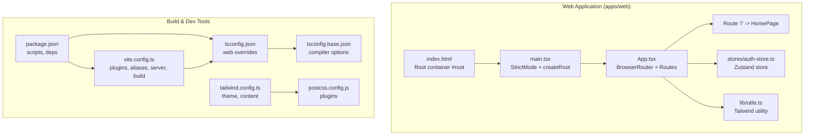
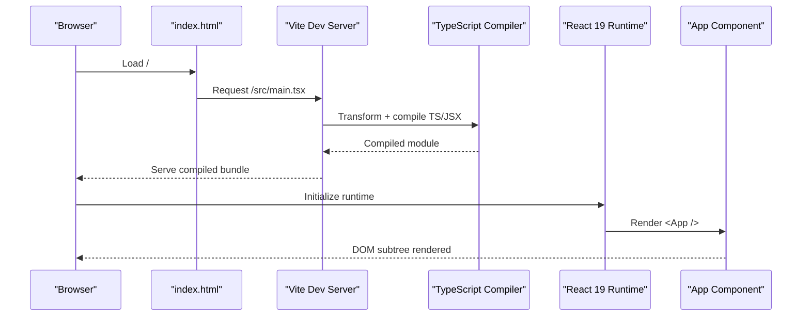
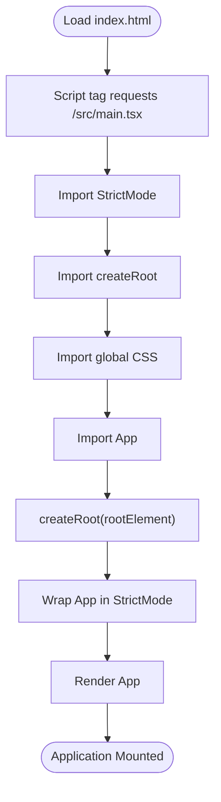
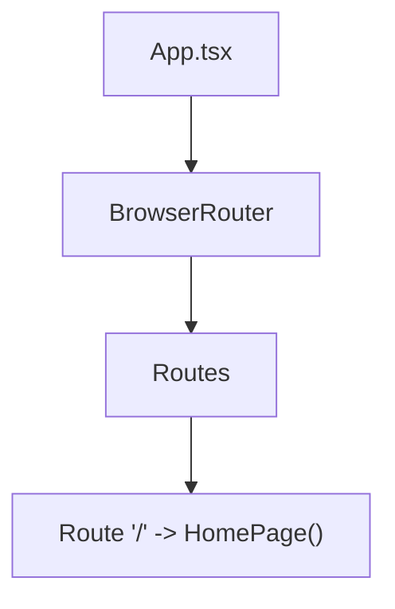
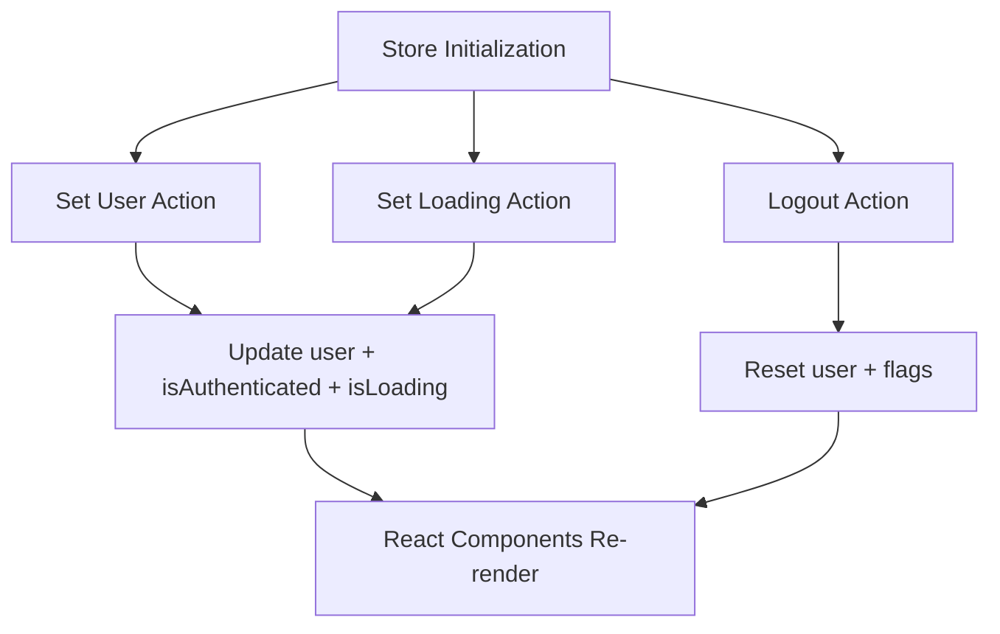
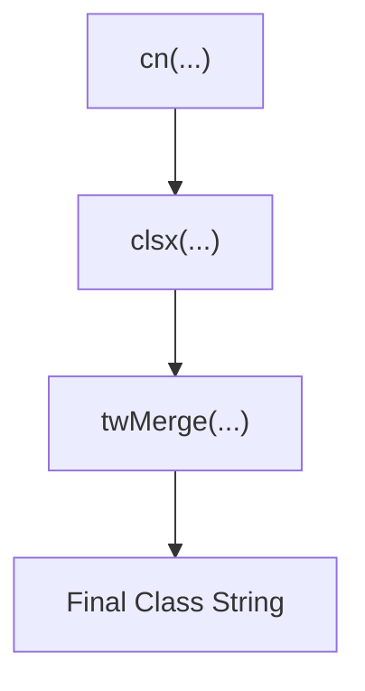
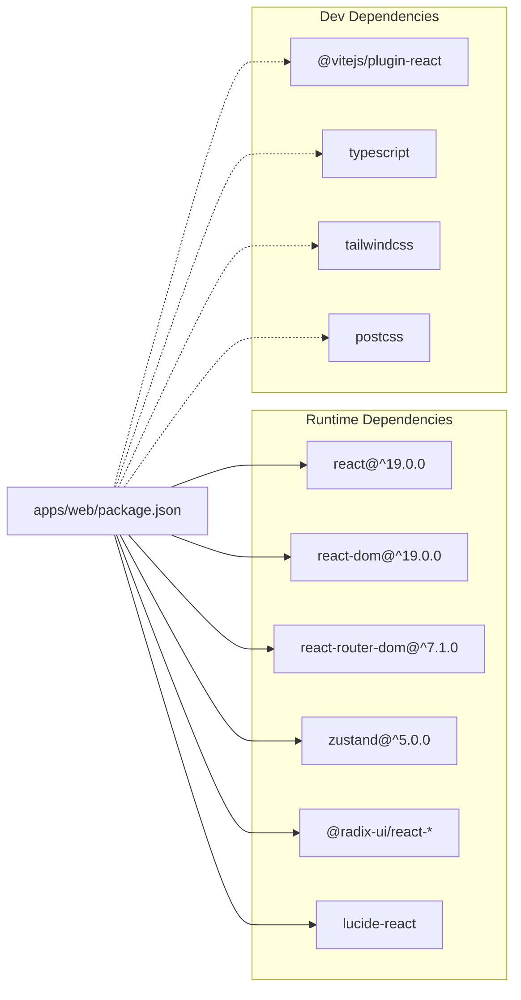

# React Application Structure

<cite>
**Referenced Files in This Document**
- [main.tsx](file://apps/web/src/main.tsx)
- [App.tsx](file://apps/web/src/App.tsx)
- [index.html](file://apps/web/index.html)
- [vite.config.ts](file://apps/web/vite.config.ts)
- [package.json](file://apps/web/package.json)
- [tsconfig.json](file://apps/web/tsconfig.json)
- [tsconfig.base.json](file://tsconfig.base.json)
- [tailwind.config.ts](file://apps/web/tailwind.config.ts)
- [postcss.config.js](file://apps/web/postcss.config.js)
- [utils.ts](file://apps/web/src/lib/utils.ts)
- [auth-store.ts](file://apps/web/src/stores/auth-store.ts)
- [pnpm-workspace.yaml](file://pnpm-workspace.yaml)
- [turbo.json](file://turbo.json)
- [api/index.ts](file://apps/api/src/index.ts)
</cite>

## Table of Contents
1. [Introduction](#introduction)
2. [Project Structure](#project-structure)
3. [Core Components](#core-components)
4. [Architecture Overview](#architecture-overview)
5. [Detailed Component Analysis](#detailed-component-analysis)
6. [Dependency Analysis](#dependency-analysis)
7. [Performance Considerations](#performance-considerations)
8. [Troubleshooting Guide](#troubleshooting-guide)
9. [Conclusion](#conclusion)

## Introduction
This document explains the React 19 application structure for the web frontend, focusing on the initialization process, component hierarchy, and the Vite configuration that powers development and build workflows. It covers how the application boots up from the entry point, how routing is organized, and how Vite integrates with React to enable fast development and optimized production builds. Practical patterns for organizing components and stores are included, along with guidance on development server configuration, hot module replacement, and build optimization.

## Project Structure
The web application follows a monorepo layout using pnpm workspaces and Turbo. The React application resides under apps/web and is structured around a clear separation of concerns:
- Entry point and root rendering in main.tsx
- Application shell and routing in App.tsx
- HTML template with a root container in index.html
- Vite configuration for development, proxying, and build outputs
- TypeScript configuration extending a base configuration
- Styling via Tailwind CSS and PostCSS
- Shared types and schemas in packages/shared

**Diagram sources**
- [index.html:1-14](file://apps/web/index.html#L1-L14)
- [main.tsx:1-11](file://apps/web/src/main.tsx#L1-L11)
- [App.tsx:1-23](file://apps/web/src/App.tsx#L1-L23)
- [vite.config.ts:1-26](file://apps/web/vite.config.ts#L1-L26)
- [package.json:1-51](file://apps/web/package.json#L1-L51)
- [tsconfig.json:1-14](file://apps/web/tsconfig.json#L1-L14)
- [tsconfig.base.json:1-19](file://tsconfig.base.json#L1-L19)
- [tailwind.config.ts:1-55](file://apps/web/tailwind.config.ts#L1-L55)
- [postcss.config.js:1-7](file://apps/web/postcss.config.js#L1-L7)

**Section sources**
- [pnpm-workspace.yaml:1-4](file://pnpm-workspace.yaml#L1-L4)
- [turbo.json:1-29](file://turbo.json#L1-L29)

## Core Components
This section documents the initialization and core components that form the foundation of the React application.

- Application entry point and root rendering
  - The HTML page defines a root container and loads the module script for the entry point.
  - The entry point imports StrictMode, the root renderer, global styles, and the root App component.
  - The renderer mounts the App inside StrictMode to enforce best practices during development.

- Root application shell and routing
  - The App component sets up a browser-based router and defines a single route pointing to a home page component.
  - The home page component renders a centered layout with branding and descriptive text.

- Store and utility organization
  - A Zustand-backed authentication store encapsulates user session state and loading indicators.
  - A Tailwind utility function composes and merges class names for consistent styling.

**Section sources**
- [index.html:1-14](file://apps/web/index.html#L1-L14)
- [main.tsx:1-11](file://apps/web/src/main.tsx#L1-L11)
- [App.tsx:1-23](file://apps/web/src/App.tsx#L1-L23)
- [auth-store.ts:1-31](file://apps/web/src/stores/auth-store.ts#L1-L31)
- [utils.ts:1-7](file://apps/web/src/lib/utils.ts#L1-L7)

## Architecture Overview
The React application lifecycle begins at the HTML entry point and proceeds through Vite’s development server and React’s rendering pipeline. The Vite configuration enables React Fast Refresh, TypeScript compilation, and asset handling, while the API server is proxied locally for seamless development.

**Diagram sources**
- [index.html:1-14](file://apps/web/index.html#L1-L14)
- [main.tsx:1-11](file://apps/web/src/main.tsx#L1-L11)
- [vite.config.ts:1-26](file://apps/web/vite.config.ts#L1-L26)
- [package.json:1-51](file://apps/web/package.json#L1-L51)

## Detailed Component Analysis

### Entry Point and Root Rendering
The entry point establishes the React 19 rendering context:
- Imports StrictMode to catch potential issues early.
- Uses the modern root API to render the App component.
- Loads global CSS before mounting to ensure styles are available during initial render.

**Diagram sources**
- [index.html:10-11](file://apps/web/index.html#L10-L11)
- [main.tsx:1-11](file://apps/web/src/main.tsx#L1-L11)

**Section sources**
- [index.html:1-14](file://apps/web/index.html#L1-L14)
- [main.tsx:1-11](file://apps/web/src/main.tsx#L1-L11)

### Routing and Component Hierarchy
The App component organizes navigation using a browser router and a single route to a home page component. This pattern scales to nested routes and lazy loading as the application grows.

**Diagram sources**
- [App.tsx:1-23](file://apps/web/src/App.tsx#L1-L23)

**Section sources**
- [App.tsx:1-23](file://apps/web/src/App.tsx#L1-L23)

### State Management Pattern with Zustand
The authentication store demonstrates a clean, minimal state container pattern:
- Defines a typed state interface and actions.
- Exposes a hook-like selector for consuming state.
- Encapsulates transitions like setting user, toggling loading, and logging out.

**Diagram sources**
- [auth-store.ts:1-31](file://apps/web/src/stores/auth-store.ts#L1-L31)

**Section sources**
- [auth-store.ts:1-31](file://apps/web/src/stores/auth-store.ts#L1-L31)

### Styling and Utility Composition
The Tailwind utility function composes and merges class names, ensuring predictable styling across components. Tailwind is configured to scan HTML and TypeScript files, and PostCSS applies necessary transformations.

**Diagram sources**
- [utils.ts:1-7](file://apps/web/src/lib/utils.ts#L1-L7)
- [tailwind.config.ts:1-55](file://apps/web/tailwind.config.ts#L1-L55)
- [postcss.config.js:1-7](file://apps/web/postcss.config.js#L1-L7)

**Section sources**
- [utils.ts:1-7](file://apps/web/src/lib/utils.ts#L1-L7)
- [tailwind.config.ts:1-55](file://apps/web/tailwind.config.ts#L1-L55)
- [postcss.config.js:1-7](file://apps/web/postcss.config.js#L1-L7)

## Dependency Analysis
The web application relies on React 19, React Router, and a suite of UI primitives and state libraries. Vite and TypeScript handle compilation and development ergonomics, while the API server is proxied locally for seamless development.

**Diagram sources**
- [package.json:12-38](file://apps/web/package.json#L12-L38)
- [package.json:39-49](file://apps/web/package.json#L39-L49)

**Section sources**
- [package.json:1-51](file://apps/web/package.json#L1-L51)

## Performance Considerations
- Build output and source maps
  - The build configuration targets a dedicated output directory and disables source maps in production to reduce bundle size and improve load performance.
- Development server
  - The dev server runs on a fixed port and proxies API requests to the backend service, minimizing cross-origin complexity during local development.
- Asset handling
  - Vite handles TypeScript compilation, JSX transforms, and static assets efficiently. Tailwind and PostCSS are integrated for optimized CSS generation.

Practical recommendations:
- Enable source maps in development for easier debugging.
- Consider enabling code splitting for larger applications.
- Use React Compiler (when available) to optimize component rendering.

**Section sources**
- [vite.config.ts:21-24](file://apps/web/vite.config.ts#L21-L24)
- [vite.config.ts:12-20](file://apps/web/vite.config.ts#L12-L20)

## Troubleshooting Guide
Common issues and resolutions:
- Root element missing
  - Ensure the HTML template contains a root container with the expected ID so the renderer can mount the application.
- Strict Mode warnings
  - Strict mode enforces best practices; treat warnings as opportunities to refactor for robustness.
- Proxy configuration
  - Verify the API proxy target matches the backend service address and port.
- TypeScript errors
  - Confirm compiler options align with the base configuration and that path aliases resolve correctly.

**Section sources**
- [index.html:10-11](file://apps/web/index.html#L10-L11)
- [main.tsx:1-11](file://apps/web/src/main.tsx#L1-L11)
- [vite.config.ts:14-18](file://apps/web/vite.config.ts#L14-L18)
- [tsconfig.json:8-10](file://apps/web/tsconfig.json#L8-L10)
- [tsconfig.base.json:2-16](file://tsconfig.base.json#L2-L16)

## Conclusion
The React 19 application is structured for clarity and scalability, with a concise entry point, a simple routing setup, and a pragmatic state management pattern. Vite streamlines development with fast refresh and efficient TypeScript compilation, while Tailwind and PostCSS provide a flexible styling pipeline. The API proxy simplifies local development by connecting frontend and backend seamlessly. As the application evolves, adopt modular component organization, lazy loading, and incremental improvements to maintain performance and developer experience.