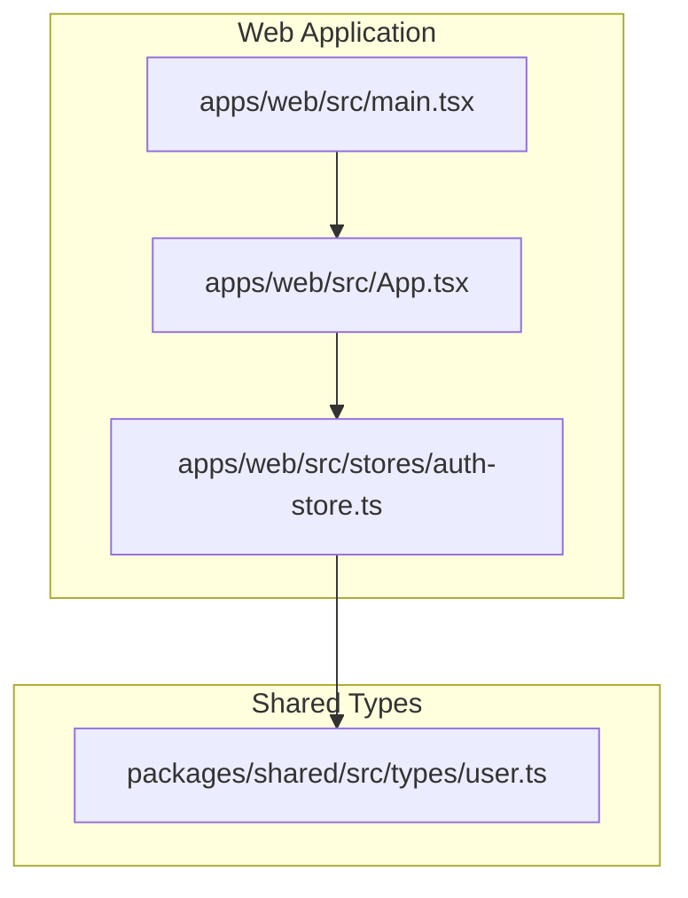
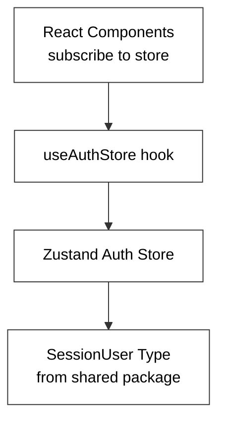
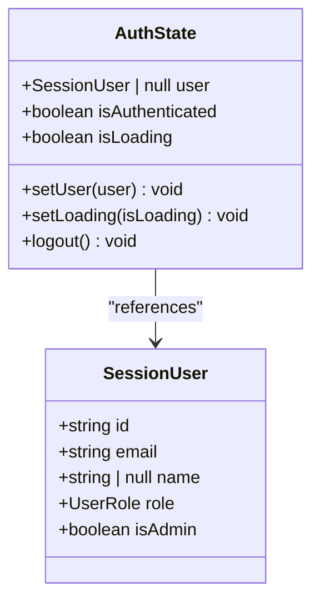
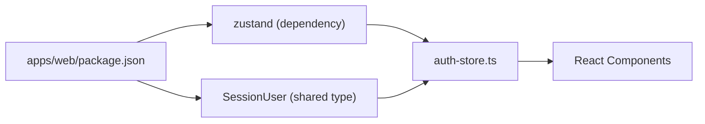

# State Management with Zustand

<cite>
**Referenced Files in This Document**
- [auth-store.ts](file://apps/web/src/stores/auth-store.ts)
- [user.ts](file://packages/shared/src/types/user.ts)
- [App.tsx](file://apps/web/src/App.tsx)
- [main.tsx](file://apps/web/src/main.tsx)
- [package.json](file://apps/web/package.json)
</cite>

## Table of Contents
1. [Introduction](#introduction)
2. [Project Structure](#project-structure)
3. [Core Components](#core-components)
4. [Architecture Overview](#architecture-overview)
5. [Detailed Component Analysis](#detailed-component-analysis)
6. [Dependency Analysis](#dependency-analysis)
7. [Performance Considerations](#performance-considerations)
8. [Troubleshooting Guide](#troubleshooting-guide)
9. [Conclusion](#conclusion)

## Introduction
This document explains the authentication state management architecture built with Zustand in the web application. It covers the store structure, actions, and state updates for user authentication, integration patterns with React components via hooks, and practical guidance for initialization, mutations, effects, persistence, error handling, debugging, and performance optimization. The focus is on the authentication store that manages user identity, authentication status, and loading indicators.

## Project Structure
The authentication state is encapsulated in a single Zustand store located under the web application. The store integrates with shared TypeScript types to define the session user model. The React application bootstraps the UI and routes, while the store remains independent of routing concerns.

**Diagram sources**
- [auth-store.ts:1-31](file://apps/web/src/stores/auth-store.ts#L1-L31)
- [user.ts:1-22](file://packages/shared/src/types/user.ts#L1-L22)
- [App.tsx:1-23](file://apps/web/src/App.tsx#L1-L23)
- [main.tsx:1-11](file://apps/web/src/main.tsx#L1-L11)

**Section sources**
- [auth-store.ts:1-31](file://apps/web/src/stores/auth-store.ts#L1-L31)
- [user.ts:1-22](file://packages/shared/src/types/user.ts#L1-L22)
- [App.tsx:1-23](file://apps/web/src/App.tsx#L1-L23)
- [main.tsx:1-11](file://apps/web/src/main.tsx#L1-L11)

## Core Components
The authentication store defines a minimal but effective contract for managing user authentication state. It exposes typed state fields and action methods to mutate state and drive UI behavior.

Key elements:
- State fields
  - user: SessionUser | null
  - isAuthenticated: boolean
  - isLoading: boolean
- Actions
  - setUser(user): sets user, computes isAuthenticated from user presence, and clears loading
  - setLoading(isLoading): toggles loading indicator
  - logout(): resets user and authentication status, clears loading

These actions form the backbone of the authentication lifecycle: initial loading, successful login, logout, and error scenarios.

**Section sources**
- [auth-store.ts:4-11](file://apps/web/src/stores/auth-store.ts#L4-L11)
- [auth-store.ts:13-30](file://apps/web/src/stores/auth-store.ts#L13-L30)

## Architecture Overview
The authentication store is a standalone module that can be consumed by any React component. Components subscribe to the store using the provided hook and react to state changes. The store does not depend on routing or UI concerns, keeping the architecture modular and testable.

**Diagram sources**
- [auth-store.ts:1-31](file://apps/web/src/stores/auth-store.ts#L1-L31)
- [user.ts:15-21](file://packages/shared/src/types/user.ts#L15-L21)

## Detailed Component Analysis

### Authentication Store: Structure and Actions
The store is initialized with default state indicating no user, not authenticated, and loading enabled. Actions update state atomically and consistently.

**Diagram sources**
- [auth-store.ts:4-11](file://apps/web/src/stores/auth-store.ts#L4-L11)
- [user.ts:15-21](file://packages/shared/src/types/user.ts#L15-L21)

Implementation highlights:
- setUser: Updates user, derives isAuthenticated from user presence, and disables loading
- setLoading: Sets loading state independently for UX feedback
- logout: Clears user and authentication status, disables loading

These behaviors enable consistent UI updates for loading states and authentication transitions.

**Section sources**
- [auth-store.ts:13-30](file://apps/web/src/stores/auth-store.ts#L13-L30)

### Integration Patterns with React Components
Components integrate with the store by importing and using the provided hook. Typical integration steps:
- Import the hook from the store module
- Subscribe to state fields (e.g., user, isAuthenticated, isLoading)
- Invoke actions (e.g., setUser, setLoading, logout) in response to user interactions or API responses

Example integration pattern (described):
- Initialize loading state on app startup
- On successful authentication, call setUser with the received session data
- On sign-out, call logout to reset state
- Render loading indicators while isLoading is true

Note: The current application skeleton does not yet render the authentication UI; however, the store is ready to support these patterns.

**Section sources**
- [auth-store.ts:8-11](file://apps/web/src/stores/auth-store.ts#L8-L11)
- [App.tsx:1-23](file://apps/web/src/App.tsx#L1-L23)

### Practical Examples: Initialization, Mutations, and Effects
Below are practical examples of how to use the store in a component lifecycle. These describe the intended flow without embedding code.

Initialization:
- On app mount, set isLoading to true to trigger loading UI
- Optionally fetch current session data and call setUser when resolved

State mutations:
- setUser: Update user and automatically compute isAuthenticated and disable loading
- setLoading: Toggle loading indicator during network requests
- logout: Clear user and authentication state

Effects:
- Use useEffect to handle side effects after state changes
- Example: Redirect unauthenticated users after logout; persist/loading state in UI

[No sources needed since this section describes conceptual usage patterns]

### Automatic Loading Indicators
The store’s isLoading flag enables consistent loading UX:
- Set isLoading to true before async operations
- Call setUser to clear loading upon success
- Call setLoading to reflect intermediate states

This pattern ensures the UI remains responsive and informative during authentication workflows.

**Section sources**
- [auth-store.ts:16-22](file://apps/web/src/stores/auth-store.ts#L16-L22)
- [auth-store.ts:23-23](file://apps/web/src/stores/auth-store.ts#L23-L23)

### Session Handling Mechanisms
Session handling is modeled around the SessionUser type:
- user field holds the current session data
- isAuthenticated reflects whether a valid session exists
- logout clears the session and resets flags

This separation allows components to render different views based on authentication state and to avoid rendering sensitive content until a valid session is present.

**Section sources**
- [auth-store.ts:5-11](file://apps/web/src/stores/auth-store.ts#L5-L11)
- [user.ts:15-21](file://packages/shared/src/types/user.ts#L15-L21)

## Dependency Analysis
The authentication store depends on shared types for type safety and Zustand for state management. The web application depends on the store for authentication state and on React for rendering.

**Diagram sources**
- [auth-store.ts:1-2](file://apps/web/src/stores/auth-store.ts#L1-L2)
- [user.ts:15-21](file://packages/shared/src/types/user.ts#L15-L21)
- [package.json:37-37](file://apps/web/package.json#L37-L37)

**Section sources**
- [auth-store.ts:1-2](file://apps/web/src/stores/auth-store.ts#L1-L2)
- [package.json:37-37](file://apps/web/package.json#L37-L37)

## Performance Considerations
- Keep state minimal: The store currently holds only essential fields, reducing unnecessary re-renders
- Prefer granular selectors: When subscribing, select only the fields needed by the component
- Avoid excessive subscriptions: Subscribe per-component rather than globally to limit re-renders
- Batch updates: Group related state changes within a single action to minimize intermediate renders
- Memoization: Use memoized selectors for derived data to prevent recomputation

[No sources needed since this section provides general guidance]

## Troubleshooting Guide
Common issues and remedies:
- Store not updating UI: Verify components subscribe to the correct fields and that actions are invoked
- Stale user state: Ensure setUser is called after successful authentication and logout after sign-out
- Loading indicator stuck: Confirm setLoading is toggled appropriately during async flows
- Type errors: Validate that the provided user object conforms to SessionUser

Debugging techniques:
- Log state changes: Temporarily log store state in development builds
- Use React DevTools: Inspect component subscriptions and re-renders
- Add middleware: Integrate Zustand middleware for logging or tracing actions

[No sources needed since this section provides general guidance]

## Conclusion
The Zustand-based authentication store provides a clean, type-safe foundation for managing user sessions. Its simple API supports loading indicators, session updates, and logout flows. By integrating the store with React components and following best practices for subscriptions and performance, teams can build reliable and maintainable authentication experiences.