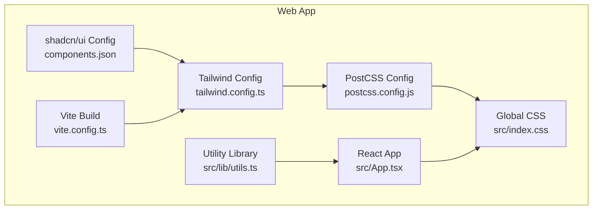
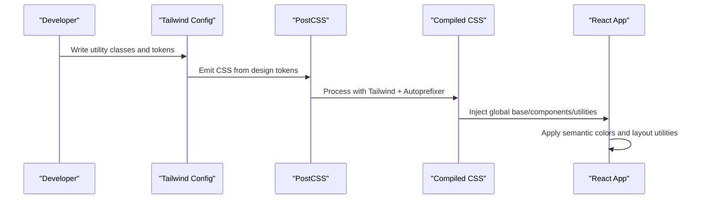
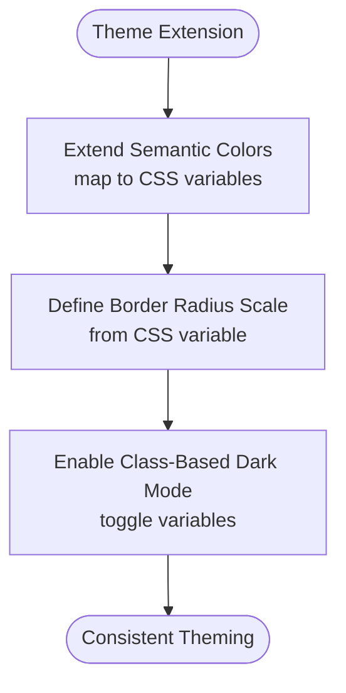
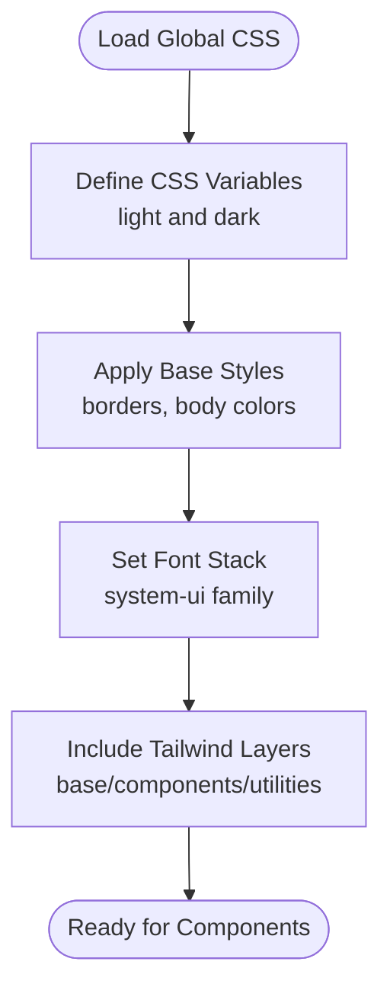
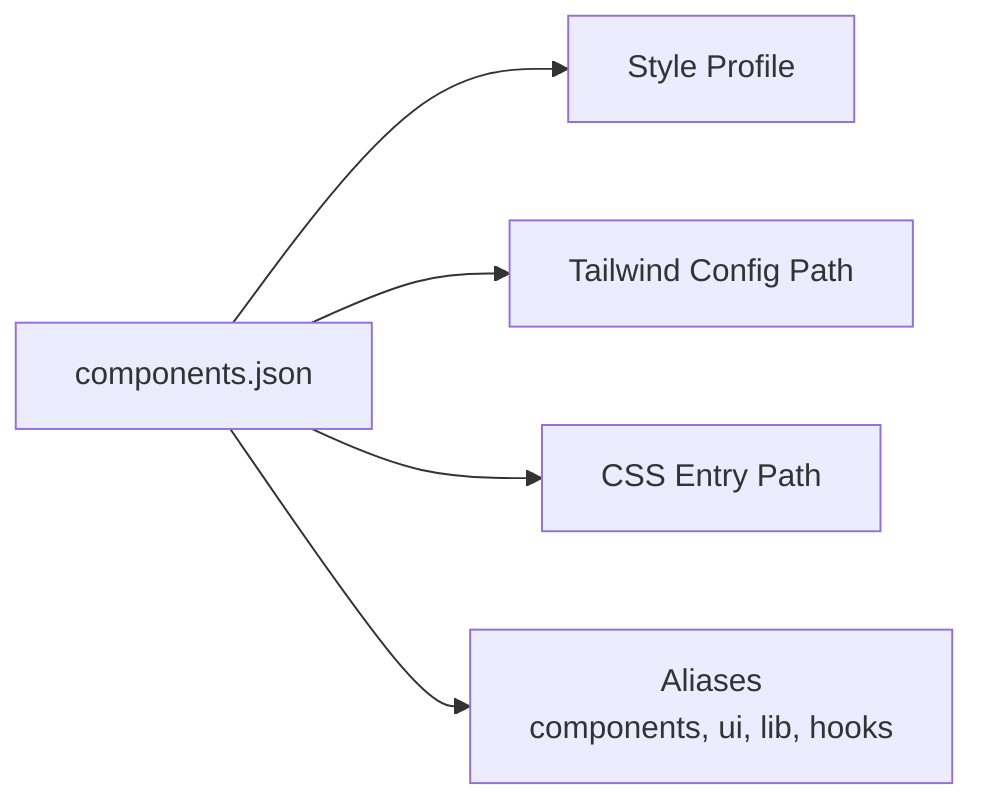
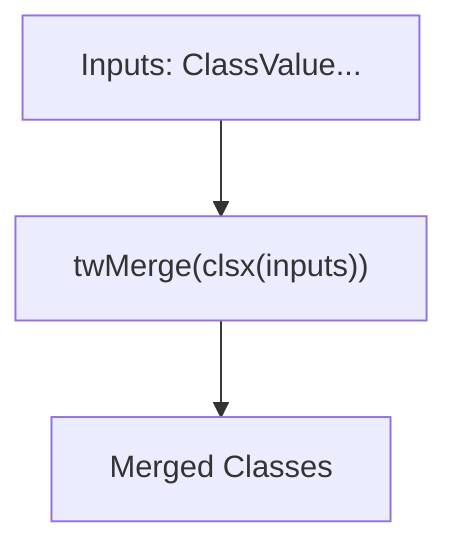
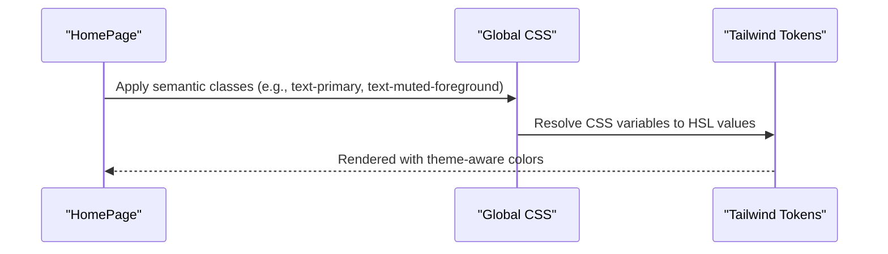
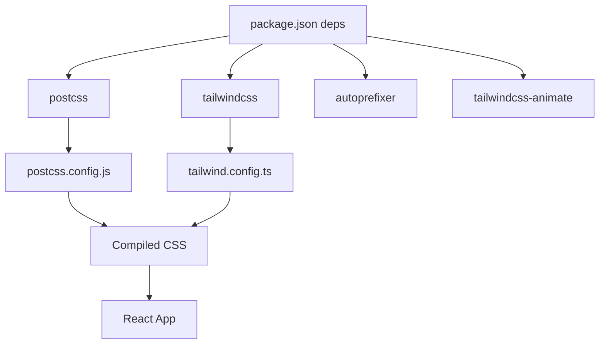

# Styling and UI Components

<cite>
**Referenced Files in This Document**
- [tailwind.config.ts](file://apps/web/tailwind.config.ts)
- [index.css](file://apps/web/src/index.css)
- [components.json](file://apps/web/components.json)
- [postcss.config.js](file://apps/web/postcss.config.js)
- [package.json](file://apps/web/package.json)
- [vite.config.ts](file://apps/web/vite.config.ts)
- [App.tsx](file://apps/web/src/App.tsx)
- [utils.ts](file://apps/web/src/lib/utils.ts)
</cite>

## Table of Contents
1. [Introduction](#introduction)
2. [Project Structure](#project-structure)
3. [Core Components](#core-components)
4. [Architecture Overview](#architecture-overview)
5. [Detailed Component Analysis](#detailed-component-analysis)
6. [Dependency Analysis](#dependency-analysis)
7. [Performance Considerations](#performance-considerations)
8. [Troubleshooting Guide](#troubleshooting-guide)
9. [Conclusion](#conclusion)

## Introduction
This document explains the styling and UI architecture used in the web application. It covers the Tailwind CSS configuration, the utility-first approach, the integration with shadcn/ui, the CSS architecture and custom styles, responsive design patterns, dark mode support, accessibility considerations, and the build pipeline for CSS generation and optimization.

## Project Structure
The styling stack centers on Tailwind CSS configured via a dedicated configuration file, PostCSS for processing, and a small set of custom CSS layers. The project also integrates shadcn/ui for prebuilt component primitives and a utility function for merging Tailwind classes safely.

**Diagram sources**
- [tailwind.config.ts:1-55](file://apps/web/tailwind.config.ts#L1-L55)
- [postcss.config.js:1-7](file://apps/web/postcss.config.js#L1-L7)
- [index.css:1-61](file://apps/web/src/index.css#L1-L61)
- [components.json:1-21](file://apps/web/components.json#L1-L21)
- [vite.config.ts:1-26](file://apps/web/vite.config.ts#L1-L26)
- [App.tsx:1-23](file://apps/web/src/App.tsx#L1-L23)
- [utils.ts:1-7](file://apps/web/src/lib/utils.ts#L1-L7)

**Section sources**
- [tailwind.config.ts:1-55](file://apps/web/tailwind.config.ts#L1-L55)
- [index.css:1-61](file://apps/web/src/index.css#L1-L61)
- [components.json:1-21](file://apps/web/components.json#L1-L21)
- [postcss.config.js:1-7](file://apps/web/postcss.config.js#L1-L7)
- [vite.config.ts:1-26](file://apps/web/vite.config.ts#L1-L26)
- [App.tsx:1-23](file://apps/web/src/App.tsx#L1-L23)
- [utils.ts:1-7](file://apps/web/src/lib/utils.ts#L1-L7)

## Core Components
- Tailwind CSS configuration defines the design system tokens and extends the theme with semantic color roles and border radius scale. It enables class-based dark mode and registers an animation plugin.
- Global CSS establishes CSS variables for light and dark themes, applies base layer styles, and ensures consistent borders and typography.
- shadcn/ui configuration aligns Tailwind settings, CSS variables usage, and aliases for components, utilities, and hooks.
- PostCSS pipeline runs Tailwind and Autoprefixer to produce vendor-prefixed CSS.
- Utility function merges Tailwind classes safely, preventing conflicts and ensuring predictable overrides.

Practical usage examples:
- Semantic color classes are applied in the home page header to achieve consistent primary and muted text styling.
- The utility function is used to merge conditional classes in components.

**Section sources**
- [tailwind.config.ts:4-52](file://apps/web/tailwind.config.ts#L4-L52)
- [index.css:5-60](file://apps/web/src/index.css#L5-L60)
- [components.json:6-19](file://apps/web/components.json#L6-L19)
- [postcss.config.js:1-7](file://apps/web/postcss.config.js#L1-L7)
- [utils.ts:4-6](file://apps/web/src/lib/utils.ts#L4-L6)
- [App.tsx:7-8](file://apps/web/src/App.tsx#L7-L8)

## Architecture Overview
The styling pipeline transforms design tokens into runtime CSS through Tailwind, then compiles and prefixes the output using PostCSS. shadcn/ui components consume the design tokens and are themed consistently across light and dark modes.

**Diagram sources**
- [tailwind.config.ts:4-52](file://apps/web/tailwind.config.ts#L4-L52)
- [postcss.config.js:1-7](file://apps/web/postcss.config.js#L1-L7)
- [index.css:1-3](file://apps/web/src/index.css#L1-L3)
- [App.tsx:5-11](file://apps/web/src/App.tsx#L5-L11)

## Detailed Component Analysis

### Tailwind Design Tokens and Theme Extension
- Color system: The theme extends semantic roles (background, foreground, primary, secondary, destructive, muted, accent, card, popover, border, input, ring) mapped to CSS variables. This enables consistent theming across components and modes.
- Border radius: Radius scales are defined using a shared CSS variable for rounded corners, allowing global adjustments.
- Dark mode: Enabled via class strategy, switching variables under a dedicated selector to invert color roles.

**Diagram sources**
- [tailwind.config.ts:7-49](file://apps/web/tailwind.config.ts#L7-L49)

**Section sources**
- [tailwind.config.ts:7-49](file://apps/web/tailwind.config.ts#L7-L49)

### Global CSS Layers and Base Styles
- Base layer: Establishes CSS variables for light and dark modes, sets up border defaults for all elements, and applies background and text colors to the body.
- Typography: Uses a system font stack for readable, native-feeling text rendering.
- Utilities: Tailwind’s base, components, and utilities layers are included to ensure all generated styles are available.

**Diagram sources**
- [index.css:5-60](file://apps/web/src/index.css#L5-L60)

**Section sources**
- [index.css:5-60](file://apps/web/src/index.css#L5-L60)

### shadcn/ui Integration and Aliases
- Style profile: Default style is selected with TSX enabled and CSS variables enabled.
- Tailwind alignment: Tailwind config and CSS path are aligned with the project structure.
- Aliases: Components, UI primitives, lib utilities, and hooks are aliased for consistent imports across the app.

**Diagram sources**
- [components.json:2-19](file://apps/web/components.json#L2-L19)

**Section sources**
- [components.json:2-19](file://apps/web/components.json#L2-L19)

### Utility Function for Class Merging
- Purpose: Safely merge Tailwind classes while avoiding duplicates and conflicts.
- Usage pattern: Combine conditional classes and variants with base classes.

**Diagram sources**
- [utils.ts:4-6](file://apps/web/src/lib/utils.ts#L4-L6)

**Section sources**
- [utils.ts:4-6](file://apps/web/src/lib/utils.ts#L4-L6)

### Example: Applying Semantic Colors in a Page
- The home page demonstrates applying semantic color classes to headings and paragraphs, ensuring consistent brand and text contrast.

**Diagram sources**
- [App.tsx:7-8](file://apps/web/src/App.tsx#L7-L8)
- [index.css:52-60](file://apps/web/src/index.css#L52-L60)
- [tailwind.config.ts:9-43](file://apps/web/tailwind.config.ts#L9-L43)

**Section sources**
- [App.tsx:7-8](file://apps/web/src/App.tsx#L7-L8)
- [index.css:52-60](file://apps/web/src/index.css#L52-L60)
- [tailwind.config.ts:9-43](file://apps/web/tailwind.config.ts#L9-L43)

## Dependency Analysis
- Tailwind CSS and PostCSS are integrated into the build pipeline. Tailwind generates CSS from design tokens, and PostCSS adds vendor prefixes and processes the output.
- shadcn/ui relies on the Tailwind configuration and CSS variables to render components with consistent theming.
- The React app consumes the compiled CSS and applies utility classes directly in JSX.

**Diagram sources**
- [package.json:39-49](file://apps/web/package.json#L39-L49)
- [tailwind.config.ts:1-2](file://apps/web/tailwind.config.ts#L1-L2)
- [postcss.config.js:1-7](file://apps/web/postcss.config.js#L1-L7)
- [index.css:1-3](file://apps/web/src/index.css#L1-L3)

**Section sources**
- [package.json:39-49](file://apps/web/package.json#L39-L49)
- [tailwind.config.ts:1-2](file://apps/web/tailwind.config.ts#L1-L2)
- [postcss.config.js:1-7](file://apps/web/postcss.config.js#L1-L7)
- [index.css:1-3](file://apps/web/src/index.css#L1-L3)

## Performance Considerations
- Purge unused CSS: Tailwind’s content scanning targets HTML and TypeScript/TSX files to remove unreachable styles in production builds.
- CSS variables: Using CSS variables for theme tokens reduces duplication and improves maintainability.
- Minification and source maps: The build configuration disables source maps in production to reduce bundle size; ensure minification is handled by the bundler.
- Animation plugin: The animation plugin is registered but should be used selectively to avoid bloating the stylesheet.

[No sources needed since this section provides general guidance]

## Troubleshooting Guide
- Dark mode not applying: Verify the class-based strategy is present and that the dark selector updates CSS variables correctly.
- Colors not resolving: Ensure semantic color roles are defined in the Tailwind theme and that CSS variables are declared in the base layer.
- Conflicting classes: Use the utility function to merge classes and avoid duplicates.
- Build errors: Confirm Tailwind and PostCSS are installed and configured in the project dependencies and configs.

**Section sources**
- [tailwind.config.ts:5-6](file://apps/web/tailwind.config.ts#L5-L6)
- [index.css:29-49](file://apps/web/src/index.css#L29-L49)
- [utils.ts:4-6](file://apps/web/src/lib/utils.ts#L4-L6)
- [package.json:39-49](file://apps/web/package.json#L39-L49)

## Conclusion
The project employs a clean, utility-first styling approach powered by Tailwind CSS and enhanced by CSS variables for theming. shadcn/ui integration ensures consistent component primitives, while a minimal PostCSS pipeline produces optimized CSS. The design system emphasizes semantic color roles, dark mode support, and maintainable class composition, with practical examples demonstrated in the home page and supported by a robust utility function.