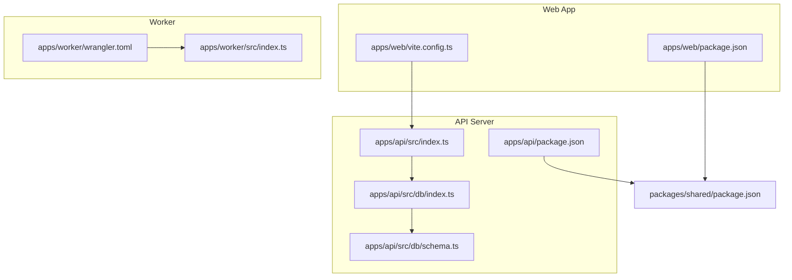

# Getting Started

<cite>
**Referenced Files in This Document**
- [package.json](file://package.json)
- [pnpm-workspace.yaml](file://pnpm-workspace.yaml)
- [turbo.json](file://turbo.json)
- [tsconfig.base.json](file://tsconfig.base.json)
- [apps/web/package.json](file://apps/web/package.json)
- [apps/web/vite.config.ts](file://apps/web/vite.config.ts)
- [apps/web/tailwind.config.ts](file://apps/web/tailwind.config.ts)
- [apps/api/package.json](file://apps/api/package.json)
- [apps/api/src/index.ts](file://apps/api/src/index.ts)
- [apps/api/src/db/index.ts](file://apps/api/src/db/index.ts)
- [apps/api/src/db/schema.ts](file://apps/api/src/db/schema.ts)
- [apps/api/drizzle.config.ts](file://apps/api/drizzle.config.ts)
- [apps/worker/package.json](file://apps/worker/package.json)
- [apps/worker/wrangler.toml](file://apps/worker/wrangler.toml)
- [apps/worker/src/index.ts](file://apps/worker/src/index.ts)
- [packages/shared/package.json](file://packages/shared/package.json)
</cite>

## Table of Contents
1. [Introduction](#introduction)
2. [Prerequisites](#prerequisites)
3. [Development Environment Setup](#development-environment-setup)
4. [Running Applications](#running-applications)
5. [Environment Variables](#environment-variables)
6. [Database Setup](#database-setup)
7. [Cloudflare Worker Deployment Preparation](#cloudflare-worker-deployment-preparation)
8. [Architecture Overview](#architecture-overview)
9. [Troubleshooting Guide](#troubleshooting-guide)
10. [Conclusion](#conclusion)

## Introduction
Welcome to the cursoranket project! This guide helps you set up a complete local development environment and onboard contributors quickly. The project follows a monorepo structure using pnpm workspaces and Turbo for orchestration. It includes three main applications:
- Web application (React 19 with Vite)
- API server (Hono on Node.js)
- Cloudflare Worker proxy

You will configure the workspace, install dependencies, start the development servers, and prepare for deployment.

## Prerequisites
Before starting, ensure you have:
- Node.js LTS installed (required by Vite, Hono, and Wrangler)
- pnpm installed (project specifies a version in package metadata)
- Basic TypeScript knowledge (all apps use TypeScript)
- A PostgreSQL-compatible database endpoint (Neon recommended by the API app)
- Optional: Cloudflare account and Wrangler CLI for worker deployment

These requirements align with the tooling declared in the repository:
- Node.js and pnpm are used across all apps
- TypeScript is configured in base and app configurations
- Drizzle ORM expects a PostgreSQL-compatible connection
- Wrangler is used for Cloudflare Worker development and deployment

**Section sources**
- [package.json:1-25](file://package.json#L1-L25)
- [apps/api/package.json:1-34](file://apps/api/package.json#L1-L34)
- [apps/worker/package.json:1-24](file://apps/worker/package.json#L1-L24)
- [apps/web/package.json:1-51](file://apps/web/package.json#L1-L51)
- [tsconfig.base.json:1-19](file://tsconfig.base.json#L1-L19)

## Development Environment Setup
Follow these steps to prepare your local environment:

1. **Install pnpm globally**
   - Use your preferred package manager to install pnpm according to your platform.

2. **Clone and install dependencies**
   - Navigate to the repository root.
   - Run the pnpm install command to bootstrap the workspace and install all dependencies across apps and packages.

3. **Verify workspace configuration**
   - The pnpm workspace is configured to include apps and packages under the root.
   - Turbo orchestrates tasks across the monorepo.

4. **Build shared package**
   - The shared package is a workspace dependency for all apps. Build it first to ensure type definitions and artifacts are available.

5. **Run type checks**
   - Use the provided scripts to run type checks across the workspace.

Key commands and their purposes:
- Install dependencies: [package.json:6-19](file://package.json#L6-L19)
- Workspace definition: [pnpm-workspace.yaml:1-4](file://pnpm-workspace.yaml#L1-L4)
- Task orchestration: [turbo.json:1-29](file://turbo.json#L1-L29)
- Shared package type checking: [packages/shared/package.json:7-10](file://packages/shared/package.json#L7-L10)

Verification steps:
- Confirm that the shared package builds without errors.
- Verify that TypeScript compilation passes for all apps.

**Section sources**
- [pnpm-workspace.yaml:1-4](file://pnpm-workspace.yaml#L1-L4)
- [turbo.json:1-29](file://turbo.json#L1-L29)
- [packages/shared/package.json:7-10](file://packages/shared/package.json#L7-L10)
- [package.json:6-19](file://package.json#L6-L19)

## Running Applications
Start the web, API, and worker applications independently. Each app exposes a development script suitable for local iteration.

### Web Application
- Purpose: React 19 single-page application with Vite.
- Ports: Defaults to port 5173; configured in Vite.
- Proxy: Requests to /api are proxied to the API server running on port 3001.
- Scripts: dev, build, preview, type-check.

Steps:
1. Start the web app:
   - Use the development script defined in the web app package.
2. Open the browser to the Vite dev server URL.
3. Verify that the proxy forwards API requests to the backend.

Key configuration:
- Vite dev server and proxy: [apps/web/vite.config.ts:12-20](file://apps/web/vite.config.ts#L12-L20)
- Web app scripts: [apps/web/package.json:6-11](file://apps/web/package.json#L6-L11)

Verification:
- Access the home page and confirm network requests to /api are proxied to the backend.

**Section sources**
- [apps/web/vite.config.ts:12-20](file://apps/web/vite.config.ts#L12-L20)
- [apps/web/package.json:6-11](file://apps/web/package.json#L6-L11)

### API Server
- Purpose: Hono-based REST API with middleware for logging, CORS, security headers, and timeouts.
- Ports: Defaults to port 3001; configurable via environment variable.
- Scripts: dev, build, start, db:* (Drizzle operations), type-check.

Steps:
1. Start the API server:
   - Use the development script defined in the API app package.
2. Visit the health endpoint to confirm the server is running.
3. Ensure CORS allows requests from the web app origin.

Key configuration:
- Server startup and middleware: [apps/api/src/index.ts:60-64](file://apps/api/src/index.ts#L60-L64)
- CORS configuration: [apps/api/src/index.ts:13-22](file://apps/api/src/index.ts#L13-L22)
- API app scripts: [apps/api/package.json:6-15](file://apps/api/package.json#L6-L15)

Verification:
- Call the health endpoint and expect a JSON response indicating the service is healthy.

**Section sources**
- [apps/api/src/index.ts:13-22](file://apps/api/src/index.ts#L13-L22)
- [apps/api/src/index.ts:60-64](file://apps/api/src/index.ts#L60-L64)
- [apps/api/package.json:6-15](file://apps/api/package.json#L6-L15)

### Cloudflare Worker Proxy
- Purpose: A Cloudflare Worker that proxies /api/* requests to the API server and adds security validations (rate limiting, Turnstile verification).
- Local development: Uses Wrangler dev mode.
- Configuration: Wrangler TOML defines the worker name, compatibility date, and environment variables.

Steps:
1. Start the worker in development mode:
   - Use the development script defined in the worker package.
2. Configure secrets locally (see Environment Variables section).
3. Ensure the worker forwards requests to the API server and applies security checks.

Key configuration:
- Worker entrypoint and proxy logic: [apps/worker/src/index.ts:81-103](file://apps/worker/src/index.ts#L81-L103)
- Wrangler configuration: [apps/worker/wrangler.toml:1-13](file://apps/worker/wrangler.toml#L1-13)
- Worker app scripts: [apps/worker/package.json:6-11](file://apps/worker/package.json#L6-L11)

Verification:
- Send a request to the worker’s /api/health endpoint and observe that it proxies to the API server.

**Section sources**
- [apps/worker/src/index.ts:81-103](file://apps/worker/src/index.ts#L81-L103)
- [apps/worker/wrangler.toml:1-13](file://apps/worker/wrangler.toml#L1-L13)
- [apps/worker/package.json:6-11](file://apps/worker/package.json#L6-L11)

## Environment Variables
Configure environment variables for each application as needed during development.

### API Server
- Required:
  - DATABASE_URL: PostgreSQL connection string for Neon-compatible database
  - FRONTEND_URL: Origin of the web app (used for CORS)
  - API_PORT: Port for the API server (defaults to 3001)
- Optional:
  - Turnstile secret key and Redis credentials for rate limiting and security features (refer to worker configuration)

Where they are used:
- Database connection: [apps/api/src/db/index.ts:5](file://apps/api/src/db/index.ts#L5)
- Drizzle configuration: [apps/api/drizzle.config.ts:7-8](file://apps/api/drizzle.config.ts#L7-L8)
- CORS origin: [apps/api/src/index.ts:16](file://apps/api/src/index.ts#L16)
- Server port: [apps/api/src/index.ts:60](file://apps/api/src/index.ts#L60)

### Web Application
- No explicit environment variables are required by default.
- Proxy target is configured in Vite to forward /api to the API server.

Where it is used:
- Proxy configuration: [apps/web/vite.config.ts:14-18](file://apps/web/vite.config.ts#L14-L18)

### Cloudflare Worker
- Required:
  - API_BASE_URL: Target backend URL for proxying
  - FRONTEND_URL: Allowed origin for CORS
  - TURNSTILE_SECRET_KEY: Secret key for Turnstile site verification
  - UPSTASH_REDIS_REST_URL and UPSTASH_REDIS_REST_TOKEN: Upstash Redis credentials for rate limiting
- These are defined in Wrangler TOML and set via Wrangler secrets during development.

Where it is used:
- Worker env vars and CORS: [apps/worker/src/index.ts:5-28](file://apps/worker/src/index.ts#L5-L28)
- Wrangler vars: [apps/worker/wrangler.toml:5-7](file://apps/worker/wrangler.toml#L5-L7)

**Section sources**
- [apps/api/src/db/index.ts:5](file://apps/api/src/db/index.ts#L5)
- [apps/api/drizzle.config.ts:7-8](file://apps/api/drizzle.config.ts#L7-L8)
- [apps/api/src/index.ts:16](file://apps/api/src/index.ts#L16)
- [apps/api/src/index.ts:60](file://apps/api/src/index.ts#L60)
- [apps/web/vite.config.ts:14-18](file://apps/web/vite.config.ts#L14-L18)
- [apps/worker/src/index.ts:5-28](file://apps/worker/src/index.ts#L5-L28)
- [apps/worker/wrangler.toml:5-7](file://apps/worker/wrangler.toml#L5-L7)

## Database Setup
The API app uses Drizzle ORM with a Neon-compatible PostgreSQL client. Follow these steps to prepare your database:

1. **Create a PostgreSQL-compatible database**
   - Use a service like Neon, Supabase, or any compatible provider.

2. **Set DATABASE_URL**
   - Export or configure the DATABASE_URL environment variable pointing to your database.

3. **Generate and apply migrations**
   - Use Drizzle Kit commands exposed by the API app scripts:
     - Generate migrations: [apps/api/package.json:10](file://apps/api/package.json#L10)
     - Apply migrations: [apps/api/package.json:11](file://apps/api/package.json#L11)
     - Preview schema: [apps/api/package.json:12](file://apps/api/package.json#L12)
   - Drizzle configuration reads DATABASE_URL from the environment: [apps/api/drizzle.config.ts:7-8](file://apps/api/drizzle.config.ts#L7-L8)

4. **Verify schema**
   - The schema file defines tables and enums used by the application: [apps/api/src/db/schema.ts:1-247](file://apps/api/src/db/schema.ts#L1-L247)

5. **Connect the app to the database**
   - The database client is initialized using the environment variable: [apps/api/src/db/index.ts:5](file://apps/api/src/db/index.ts#L5)

Verification:
- After applying migrations, confirm that tables are created in your database.
- Test a simple query through the API to ensure connectivity.

**Section sources**
- [apps/api/package.json:10-12](file://apps/api/package.json#L10-L12)
- [apps/api/drizzle.config.ts:7-8](file://apps/api/drizzle.config.ts#L7-L8)
- [apps/api/src/db/schema.ts:1-247](file://apps/api/src/db/schema.ts#L1-L247)
- [apps/api/src/db/index.ts:5](file://apps/api/src/db/index.ts#L5)

## Cloudflare Worker Deployment Preparation
Prepare your Cloudflare Worker for deployment:

1. **Install Wrangler**
   - Ensure Wrangler CLI is installed and authenticated.

2. **Configure Wrangler**
   - The worker name and compatibility date are defined in the configuration file: [apps/worker/wrangler.toml:1-13](file://apps/worker/wrangler.toml#L1-L13)

3. **Set secrets**
   - Set the following secrets using Wrangler:
     - TURNSTILE_SECRET_KEY
     - UPSTASH_REDIS_REST_URL
     - UPSTASH_REDIS_REST_TOKEN
   - These are referenced in the worker code for Turnstile verification and rate limiting: [apps/worker/src/index.ts:8-11](file://apps/worker/src/index.ts#L8-L11)

4. **Local development**
   - Start the worker in dev mode to test locally: [apps/worker/package.json:7](file://apps/worker/package.json#L7)

5. **Deploy preview**
   - Dry-run deployment to preview changes: [apps/worker/package.json:8](file://apps/worker/package.json#L8)

6. **Deploy**
   - Deploy the worker to production: [apps/worker/package.json:9](file://apps/worker/package.json#L9)

Verification:
- Confirm that the worker responds to /api/health and proxies requests to the API server.
- Ensure Turnstile verification and rate limiting behave as expected.

**Section sources**
- [apps/worker/wrangler.toml:1-13](file://apps/worker/wrangler.toml#L1-L13)
- [apps/worker/src/index.ts:8-11](file://apps/worker/src/index.ts#L8-L11)
- [apps/worker/package.json:7-9](file://apps/worker/package.json#L7-L9)

## Architecture Overview
The development stack consists of three independently runnable applications orchestrated by Turbo and pnpm workspaces.

**Diagram sources**
- [apps/web/package.json:1-51](file://apps/web/package.json#L1-L51)
- [apps/web/vite.config.ts:1-26](file://apps/web/vite.config.ts#L1-L26)
- [apps/api/package.json:1-34](file://apps/api/package.json#L1-L34)
- [apps/api/src/index.ts:1-67](file://apps/api/src/index.ts#L1-L67)
- [apps/api/src/db/index.ts:1-9](file://apps/api/src/db/index.ts#L1-L9)
- [apps/api/src/db/schema.ts:1-247](file://apps/api/src/db/schema.ts#L1-L247)
- [apps/worker/wrangler.toml:1-13](file://apps/worker/wrangler.toml#L1-L13)
- [apps/worker/src/index.ts:1-106](file://apps/worker/src/index.ts#L1-L106)
- [packages/shared/package.json:1-18](file://packages/shared/package.json#L1-L18)

## Troubleshooting Guide
Common setup and runtime issues with resolutions:

- **pnpm install fails**
  - Ensure pnpm is installed and matches the version indicated by the project metadata.
  - Clear caches if necessary and retry installation.

- **TypeScript errors across workspace**
  - Run type checks for the entire workspace to identify issues.
  - Ensure base TypeScript configuration is respected by all apps.

- **Web app cannot reach API**
  - Confirm the API server is running on port 3001.
  - Verify Vite proxy configuration targets the correct host and port.
  - Check CORS settings in the API app to allow the web origin.

- **API server cannot connect to database**
  - Confirm DATABASE_URL is set and points to a reachable PostgreSQL-compatible endpoint.
  - Generate and apply migrations using the API app scripts.
  - Validate that the schema matches the database state.

- **Worker fails to start or proxy does not work**
  - Ensure Wrangler is installed and authenticated.
  - Set required secrets locally for Turnstile and Redis.
  - Confirm API_BASE_URL and FRONTEND_URL match your local setup.

- **Health checks fail**
  - Verify the health endpoints for the API and worker are reachable.
  - Check logs for middleware errors and CORS mismatches.

**Section sources**
- [package.json:6-19](file://package.json#L6-L19)
- [apps/web/vite.config.ts:12-20](file://apps/web/vite.config.ts#L12-L20)
- [apps/api/src/index.ts:13-22](file://apps/api/src/index.ts#L13-L22)
- [apps/api/src/db/index.ts:5](file://apps/api/src/db/index.ts#L5)
- [apps/api/package.json:10-12](file://apps/api/package.json#L10-L12)
- [apps/worker/package.json:6-11](file://apps/worker/package.json#L6-L11)

## Conclusion
You now have the essentials to onboard contributors and run the cursoranket project locally. By installing dependencies, configuring environment variables, preparing the database, and starting each application independently, you can develop efficiently across the web, API, and worker layers. Use the verification steps and troubleshooting tips to resolve common issues quickly.