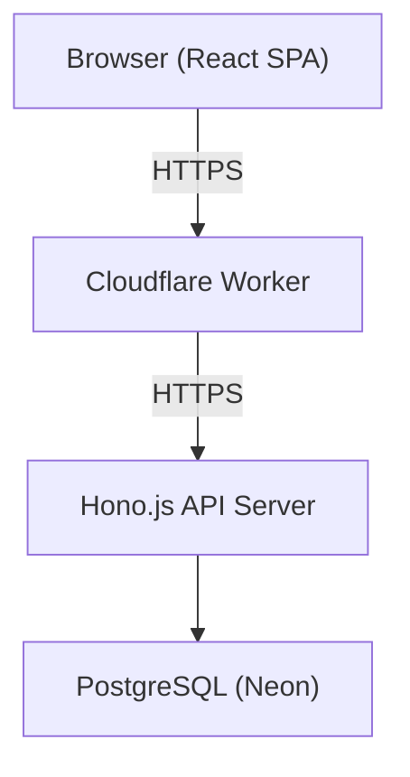
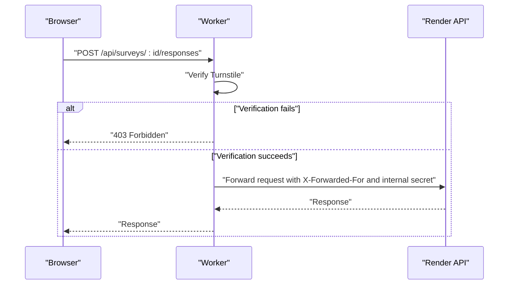
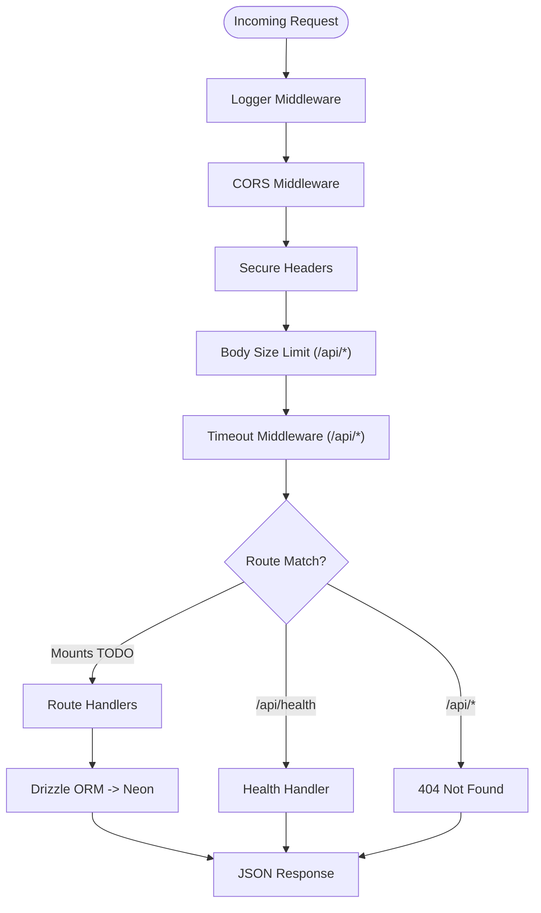
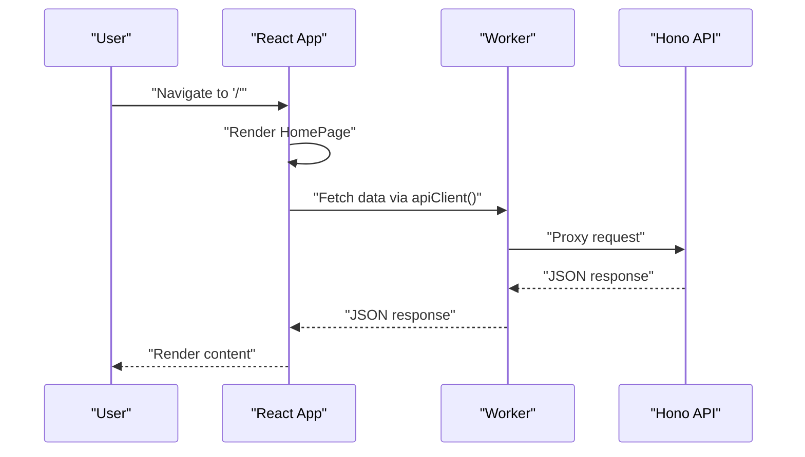
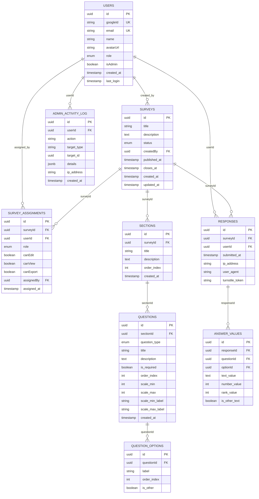
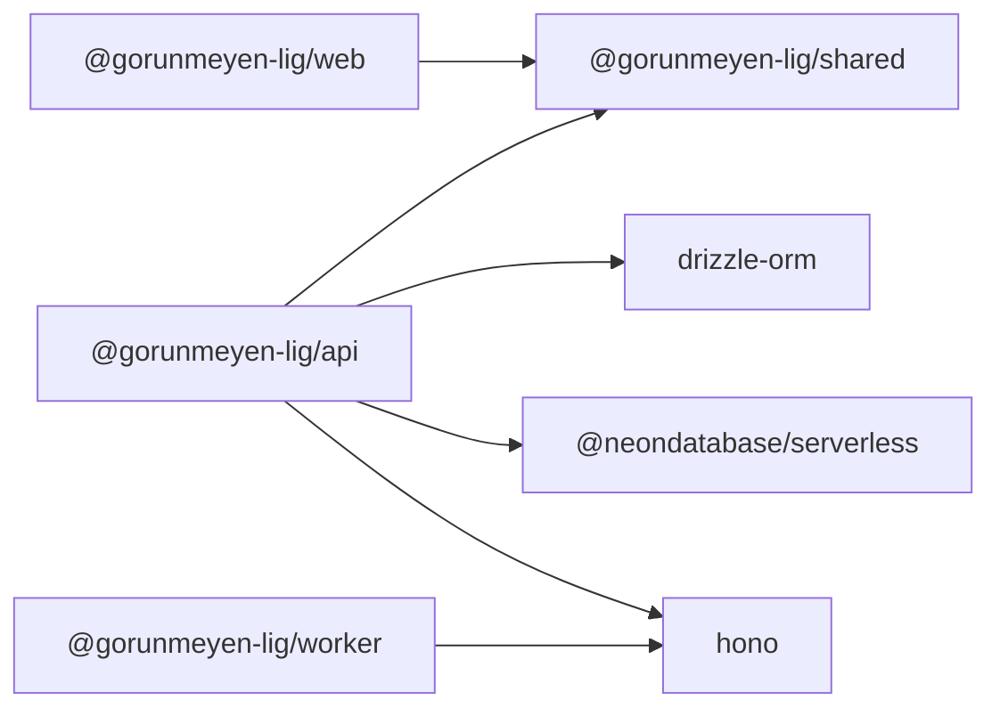

# Architecture Overview

<cite>
**Referenced Files in This Document**
- [apps/api/src/index.ts](file://apps/api/src/index.ts)
- [apps/api/src/db/index.ts](file://apps/api/src/db/index.ts)
- [apps/api/src/db/schema.ts](file://apps/api/src/db/schema.ts)
- [apps/web/src/main.tsx](file://apps/web/src/main.tsx)
- [apps/web/src/App.tsx](file://apps/web/src/App.tsx)
- [apps/web/src/lib/api.ts](file://apps/web/src/lib/api.ts)
- [apps/web/src/stores/auth-store.ts](file://apps/web/src/stores/auth-store.ts)
- [apps/worker/src/index.ts](file://apps/worker/src/index.ts)
- [apps/worker/wrangler.toml](file://apps/worker/wrangler.toml)
- [packages/shared/src/index.ts](file://packages/shared/src/index.ts)
- [package.json](file://package.json)
- [pnpm-workspace.yaml](file://pnpm-workspace.yaml)
- [turbo.json](file://turbo.json)
</cite>

## Table of Contents
1. [Introduction](#introduction)
2. [Project Structure](#project-structure)
3. [Core Components](#core-components)
4. [Architecture Overview](#architecture-overview)
5. [Detailed Component Analysis](#detailed-component-analysis)
6. [Dependency Analysis](#dependency-analysis)
7. [Performance Considerations](#performance-considerations)
8. [Troubleshooting Guide](#troubleshooting-guide)
9. [Conclusion](#conclusion)
10. [Appendices](#appendices)

## Introduction
This document describes the cursoranket survey platform’s system design. It is a monorepo composed of three primary applications:
- Web frontend built with React and Vite
- API backend powered by Hono.js and Drizzle ORM
- Cloudflare Worker acting as an edge proxy and security gateway

The architecture emphasizes edge computing benefits, centralized database-first design, and clean separation of concerns across the stack. Cross-cutting concerns include security (CORS, secure headers, Cloudflare Turnstile), request limits, timeouts, and robust error handling.

## Project Structure
The repository follows a Turborepo-style monorepo with PNPM workspaces:
- apps/api: Backend service exposing REST-like endpoints via Hono.js
- apps/web: React single-page application with routing and state management
- apps/worker: Cloudflare Worker handling CORS, security headers, request limits, Turnstile verification, and proxying to the API
- packages/shared: Shared TypeScript types and Zod schemas consumed by both frontend and backend
- Root scripts orchestrate development, builds, and database tasks

```mermaid
graph TB
subgraph "Monorepo"
subgraph "Apps"
WEB["apps/web<br/>React SPA"]
API["apps/api<br/>Hono.js API"]
WORKER["apps/worker<br/>Cloudflare Worker"]
end
subgraph "Packages"
SHARED["packages/shared<br/>Types & Schemas"]
end
end
WEB --> |"HTTP API calls"| WORKER
WORKER --> |"Proxies to"| API
API --> |"Drizzle ORM"| DB["PostgreSQL (Neon)"
SHARED --> WEB
SHARED --> API
```

**Diagram sources**
- [apps/web/src/lib/api.ts:1-60](file://apps/web/src/lib/api.ts#L1-L60)
- [apps/worker/src/index.ts:82-103](file://apps/worker/src/index.ts#L82-L103)
- [apps/api/src/db/index.ts:1-9](file://apps/api/src/db/index.ts#L1-L9)
- [packages/shared/src/index.ts:1-10](file://packages/shared/src/index.ts#L1-L10)

**Section sources**
- [pnpm-workspace.yaml:1-4](file://pnpm-workspace.yaml#L1-L4)
- [turbo.json:1-29](file://turbo.json#L1-L29)
- [package.json:1-30](file://package.json#L1-L30)

## Core Components
- Cloudflare Worker
  - Enforces CORS for the frontend origin
  - Applies secure headers
  - Limits request body size
  - Verifies Cloudflare Turnstile for survey response submissions
  - Proxies all /api/* traffic to the backend with forwarded client IP and internal secret header
- Hono.js API
  - Provides logging, CORS, secure headers, and timeout middleware
  - Exposes health endpoint and placeholder route mounts for auth, surveys, and admin
  - Uses Drizzle ORM with Neon PostgreSQL for persistence
- React Web Frontend
  - Minimal homepage with routing
  - Centralized API client for HTTP calls
  - Zustand-backed authentication store
  - Consumes shared types and schemas

**Section sources**
- [apps/worker/src/index.ts:1-106](file://apps/worker/src/index.ts#L1-L106)
- [apps/api/src/index.ts:1-67](file://apps/api/src/index.ts#L1-L67)
- [apps/api/src/db/index.ts:1-9](file://apps/api/src/db/index.ts#L1-L9)
- [apps/web/src/lib/api.ts:1-60](file://apps/web/src/lib/api.ts#L1-L60)
- [apps/web/src/stores/auth-store.ts:1-31](file://apps/web/src/stores/auth-store.ts#L1-L31)
- [packages/shared/src/index.ts:1-10](file://packages/shared/src/index.ts#L1-L10)

## Architecture Overview
The system operates as a distributed edge-to-backend architecture:
- Edge: Cloudflare Worker receives inbound requests, applies security checks, and proxies to the backend
- Mid-tier: Hono.js server handles API logic and integrates with the database
- Data: PostgreSQL managed by Neon, accessed via Drizzle ORM



**Diagram sources**
- [apps/worker/src/index.ts:82-103](file://apps/worker/src/index.ts#L82-L103)
- [apps/api/src/index.ts:1-67](file://apps/api/src/index.ts#L1-L67)
- [apps/api/src/db/index.ts:1-9](file://apps/api/src/db/index.ts#L1-L9)

## Detailed Component Analysis

### Cloudflare Worker
Responsibilities:
- CORS enforcement restricted to the configured frontend origin
- Secure headers applied to all responses
- Request body size limit enforced for /api/*
- Turnstile verification for POST requests to survey response endpoints
- Proxy to backend with X-Forwarded-For and internal secret header



**Diagram sources**
- [apps/worker/src/index.ts:42-79](file://apps/worker/src/index.ts#L42-L79)
- [apps/worker/src/index.ts:82-103](file://apps/worker/src/index.ts#L82-L103)

**Section sources**
- [apps/worker/src/index.ts:1-106](file://apps/worker/src/index.ts#L1-L106)
- [apps/worker/wrangler.toml:1-13](file://apps/worker/wrangler.toml#L1-L13)

### Hono.js API
Responsibilities:
- Centralized middleware: logging, CORS, secure headers, request size limit, timeout
- Health check endpoint
- Placeholder route mounts for auth, surveys, and admin
- Global error and 404 handlers
- Database connection via Drizzle and Neon



**Diagram sources**
- [apps/api/src/index.ts:12-58](file://apps/api/src/index.ts#L12-L58)
- [apps/api/src/db/index.ts:1-9](file://apps/api/src/db/index.ts#L1-L9)

**Section sources**
- [apps/api/src/index.ts:1-67](file://apps/api/src/index.ts#L1-L67)
- [apps/api/src/db/index.ts:1-9](file://apps/api/src/db/index.ts#L1-L9)

### React Web Frontend
Responsibilities:
- Renders a minimal homepage with routing
- Centralized API client abstraction
- Authentication store using Zustand
- Consumes shared types and schemas



**Diagram sources**
- [apps/web/src/App.tsx:1-23](file://apps/web/src/App.tsx#L1-L23)
- [apps/web/src/lib/api.ts:1-60](file://apps/web/src/lib/api.ts#L1-L60)
- [apps/worker/src/index.ts:82-103](file://apps/worker/src/index.ts#L82-L103)
- [apps/api/src/index.ts:40-42](file://apps/api/src/index.ts#L40-L42)

**Section sources**
- [apps/web/src/main.tsx:1-11](file://apps/web/src/main.tsx#L1-L11)
- [apps/web/src/App.tsx:1-23](file://apps/web/src/App.tsx#L1-L23)
- [apps/web/src/lib/api.ts:1-60](file://apps/web/src/lib/api.ts#L1-L60)
- [apps/web/src/stores/auth-store.ts:1-31](file://apps/web/src/stores/auth-store.ts#L1-L31)

### Database Design (PostgreSQL via Drizzle)
The schema defines entities for users, surveys, assignments, sections, questions, question options, responses, answer values, and admin activity logs. Enumerations model roles, statuses, and question types. Indexes optimize common joins and uniqueness constraints.



**Diagram sources**
- [apps/api/src/db/schema.ts:1-247](file://apps/api/src/db/schema.ts#L1-L247)

**Section sources**
- [apps/api/src/db/schema.ts:1-247](file://apps/api/src/db/schema.ts#L1-L247)

## Dependency Analysis
- Monorepo tooling
  - Turborepo orchestrates builds, dev servers, and database tasks across apps and packages
  - PNPM workspaces link local packages
  - Root package.json scripts coordinate development and build commands
- Application dependencies
  - apps/web depends on @gorunmeyen-lig/shared for types and schemas
  - apps/api depends on @gorunmeyen-lig/shared, Drizzle ORM, Neon, Hono, and related middleware
  - apps/worker depends on Hono and uses environment variables and secrets for configuration



**Diagram sources**
- [apps/web/package.json:1-51](file://apps/web/package.json#L1-L51)
- [apps/api/package.json:1-34](file://apps/api/package.json#L1-L34)
- [apps/worker/src/index.ts:1-13](file://apps/worker/src/index.ts#L1-L13)

**Section sources**
- [turbo.json:1-29](file://turbo.json#L1-L29)
- [pnpm-workspace.yaml:1-4](file://pnpm-workspace.yaml#L1-L4)
- [package.json:1-30](file://package.json#L1-L30)
- [apps/web/package.json:1-51](file://apps/web/package.json#L1-L51)
- [apps/api/package.json:1-34](file://apps/api/package.json#L1-L34)

## Performance Considerations
- Edge computing with Cloudflare Workers reduces latency by proximity to users and offloads security checks from the backend
- Request size limits and timeouts prevent resource exhaustion and improve resilience
- Database queries benefit from indexes defined in the schema; keep migrations synchronized with schema updates
- Frontend caching and efficient rendering reduce load on the API
- Monitor API health endpoint for operational visibility

[No sources needed since this section provides general guidance]

## Troubleshooting Guide
- Health endpoint
  - Verify API availability via GET /api/health
- CORS errors
  - Confirm frontend origin matches configured CORS origin in both Worker and API
- Turnstile failures
  - Ensure TURNSTILE_SECRET_KEY is set in Worker environment and challenge endpoint is reachable
- Proxy issues
  - Check API_BASE_URL and that the backend is reachable from the Worker runtime
- Database connectivity
  - Validate DATABASE_URL and Neon credentials; confirm Drizzle connection initialization

**Section sources**
- [apps/api/src/index.ts:40-42](file://apps/api/src/index.ts#L40-L42)
- [apps/worker/src/index.ts:15-28](file://apps/worker/src/index.ts#L15-L28)
- [apps/worker/wrangler.toml:5-7](file://apps/worker/wrangler.toml#L5-L7)
- [apps/api/src/db/index.ts:1-9](file://apps/api/src/db/index.ts#L1-L9)

## Conclusion
The cursoranket platform leverages a modern, edge-first architecture: Cloudflare Workers enforce security and proxy requests, Hono.js provides a lightweight API server, and a centralized PostgreSQL database ensures data consistency. The monorepo structure promotes code reuse and streamlined development across the frontend, backend, and edge layers.

[No sources needed since this section summarizes without analyzing specific files]

## Appendices

### Technology Stack Decisions
- Cloudflare Workers: Low-latency edge security and proxying
- Hono.js: Minimal, fast HTTP framework for API logic
- React + Vite: Modern SPA with efficient builds
- Drizzle ORM + Neon: Developer-friendly Postgres ORM with serverless connectivity
- Turborepo + PNPM: Scalable monorepo orchestration and dependency management
- Shared package: Type and schema reuse across apps

**Section sources**
- [apps/worker/src/index.ts:1-13](file://apps/worker/src/index.ts#L1-L13)
- [apps/api/src/index.ts:1-9](file://apps/api/src/index.ts#L1-L9)
- [apps/web/src/lib/api.ts:1-60](file://apps/web/src/lib/api.ts#L1-L60)
- [apps/api/src/db/index.ts:1-9](file://apps/api/src/db/index.ts#L1-L9)
- [turbo.json:1-29](file://turbo.json#L1-L29)
- [pnpm-workspace.yaml:1-4](file://pnpm-workspace.yaml#L1-L4)

### Deployment Topology and Infrastructure Requirements
- Frontend: Static hosting (Vite build artifacts)
- Edge: Cloudflare Worker deployed with environment variables and secrets
- Backend: Hono.js service (e.g., Render or similar platform)
- Database: PostgreSQL via Neon with Drizzle ORM
- Secrets management: Cloudflare Worker secrets for Turnstile and Redis (if used)

**Section sources**
- [apps/worker/wrangler.toml:1-13](file://apps/worker/wrangler.toml#L1-L13)
- [apps/api/src/db/index.ts:1-9](file://apps/api/src/db/index.ts#L1-L9)

### Cross-Cutting Concerns
- Security
  - CORS restricted to frontend origin
  - Secure headers applied at edge and backend
  - Turnstile verification for survey response submissions
- Rate limiting and timeouts
  - Body size limits and request timeouts enforced at edge and backend
- Observability
  - Logging middleware and health endpoint for monitoring

**Section sources**
- [apps/worker/src/index.ts:15-40](file://apps/worker/src/index.ts#L15-L40)
- [apps/api/src/index.ts:12-37](file://apps/api/src/index.ts#L12-L37)