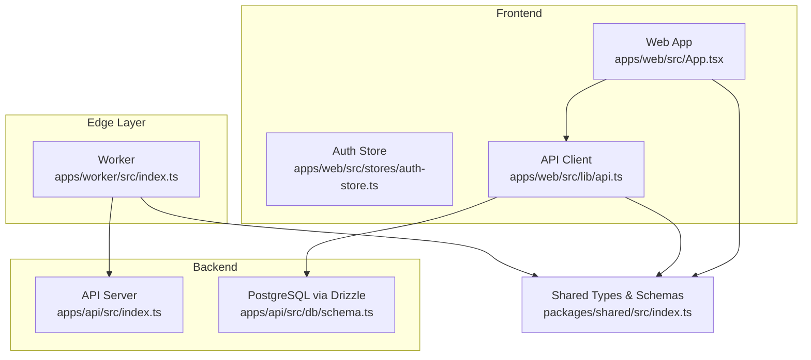
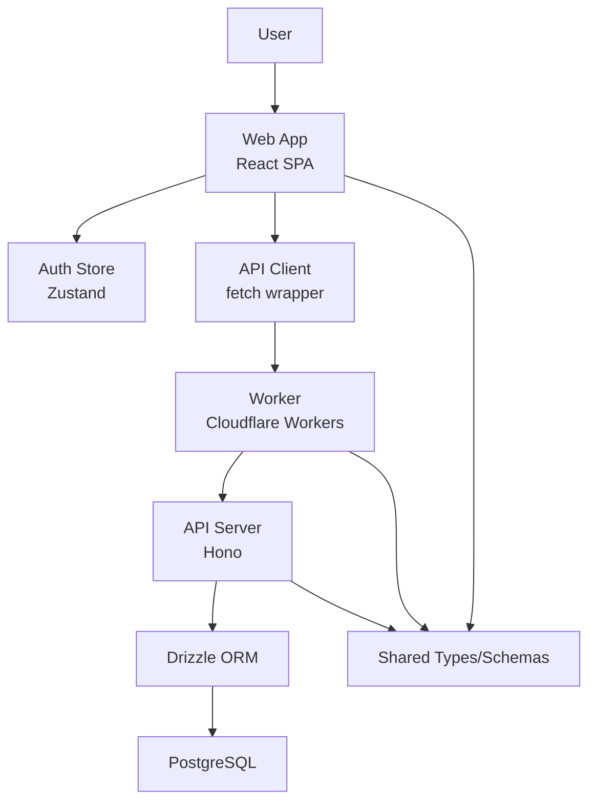
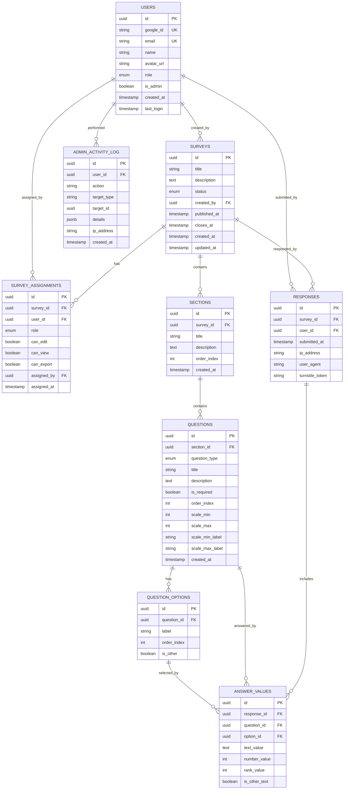
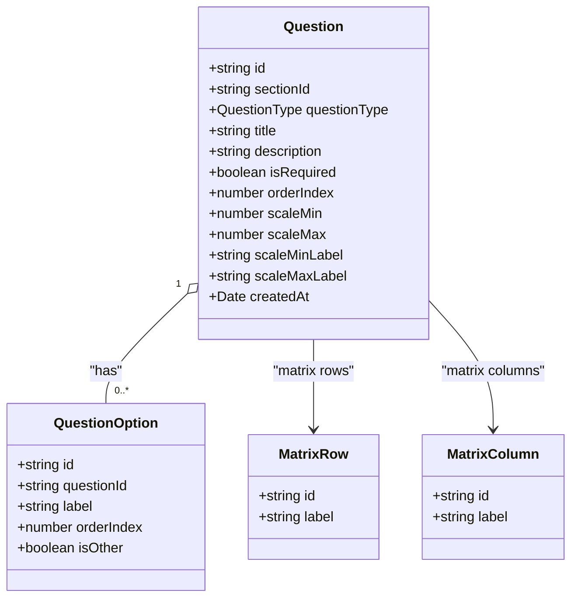
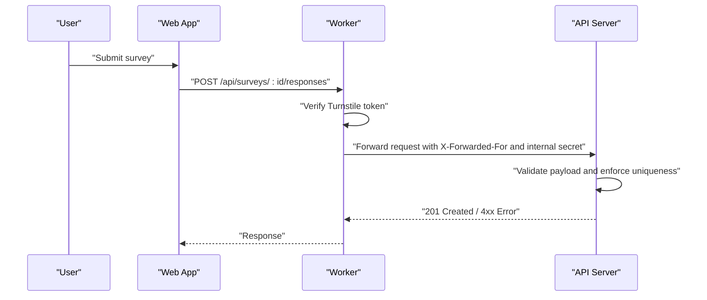
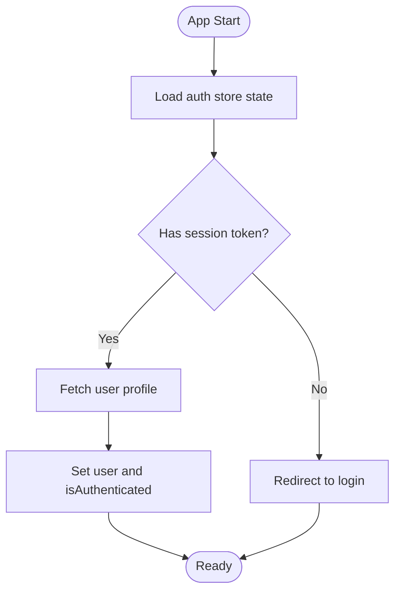
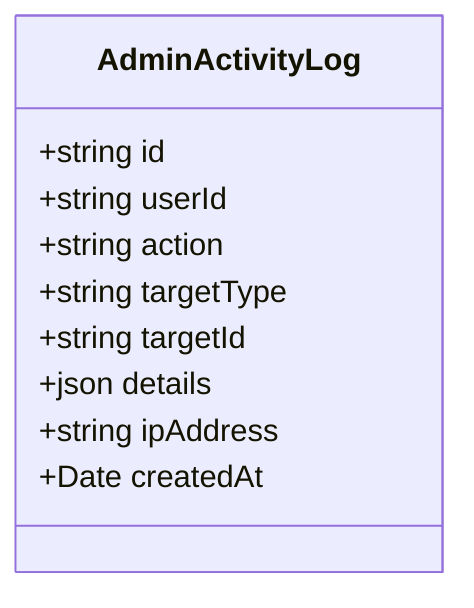
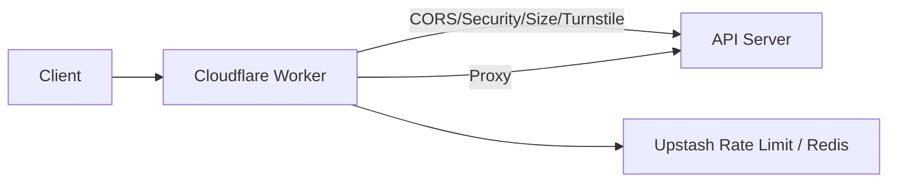
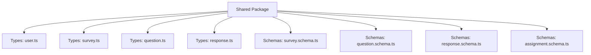
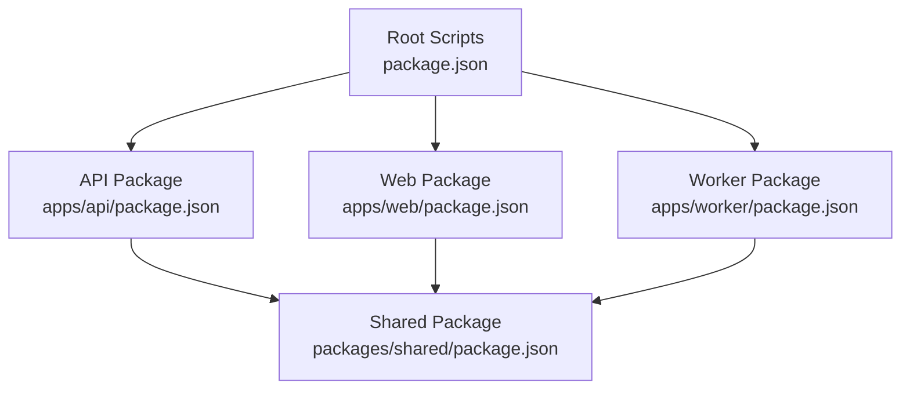

# Feature Overview

<cite>
**Referenced Files in This Document**
- [apps/api/src/index.ts](file://apps/api/src/index.ts)
- [apps/api/src/db/schema.ts](file://apps/api/src/db/schema.ts)
- [apps/worker/src/index.ts](file://apps/worker/src/index.ts)
- [apps/web/src/App.tsx](file://apps/web/src/App.tsx)
- [apps/web/src/stores/auth-store.ts](file://apps/web/src/stores/auth-store.ts)
- [apps/web/src/lib/api.ts](file://apps/web/src/lib/api.ts)
- [apps/web/src/lib/utils.ts](file://apps/web/src/lib/utils.ts)
- [packages/shared/src/index.ts](file://packages/shared/src/index.ts)
- [packages/shared/src/types/survey.ts](file://packages/shared/src/types/survey.ts)
- [packages/shared/src/types/question.ts](file://packages/shared/src/types/question.ts)
- [packages/shared/src/types/response.ts](file://packages/shared/src/types/response.ts)
- [packages/shared/src/types/user.ts](file://packages/shared/src/types/user.ts)
- [package.json](file://package.json)
- [apps/api/package.json](file://apps/api/package.json)
- [apps/web/package.json](file://apps/web/package.json)
- [apps/worker/package.json](file://apps/worker/package.json)
- [packages/shared/package.json](file://packages/shared/package.json)
</cite>

## Table of Contents
1. [Introduction](#introduction)
2. [Project Structure](#project-structure)
3. [Core Components](#core-components)
4. [Architecture Overview](#architecture-overview)
5. [Detailed Component Analysis](#detailed-component-analysis)
6. [Dependency Analysis](#dependency-analysis)
7. [Performance Considerations](#performance-considerations)
8. [Troubleshooting Guide](#troubleshooting-guide)
9. [Conclusion](#conclusion)
10. [Appendices](#appendices)

## Introduction
Cursoranket is a cloud-native survey platform designed for Turkish football supporter communities and general survey use cases. It emphasizes type-safe, reusable code via a shared package, robust survey lifecycle management (creation, editing, publishing), a comprehensive question type system (12 question types), response collection with anti-tamper measures, and admin capabilities. The platform leverages Cloudflare Workers for edge routing, rate limiting, and CAPTCHA verification, while the API server handles business logic and persistence.

## Project Structure
The project follows a monorepo workspace managed by Turbo. It consists of three applications and a shared package:
- Worker: Edge proxy and security enforcement (Cloudflare Workers)
- API: Backend service (Hono) with database schema and Drizzle ORM
- Web: Frontend SPA (React) with shared types and utilities
- Shared: TypeScript types, Zod schemas, and cross-app contracts

**Diagram sources**
- [apps/worker/src/index.ts:1-106](file://apps/worker/src/index.ts#L1-L106)
- [apps/api/src/index.ts:1-67](file://apps/api/src/index.ts#L1-L67)
- [apps/api/src/db/schema.ts:1-247](file://apps/api/src/db/schema.ts#L1-L247)
- [apps/web/src/App.tsx:1-23](file://apps/web/src/App.tsx#L1-L23)
- [apps/web/src/stores/auth-store.ts:1-31](file://apps/web/src/stores/auth-store.ts#L1-L31)
- [apps/web/src/lib/api.ts:1-60](file://apps/web/src/lib/api.ts#L1-L60)
- [packages/shared/src/index.ts:1-10](file://packages/shared/src/index.ts#L1-L10)

**Section sources**
- [package.json:1-30](file://package.json#L1-L30)
- [apps/api/package.json:1-34](file://apps/api/package.json#L1-L34)
- [apps/web/package.json:1-51](file://apps/web/package.json#L1-L51)
- [apps/worker/package.json:1-24](file://apps/worker/package.json#L1-L24)
- [packages/shared/package.json:1-18](file://packages/shared/package.json#L1-L18)

## Core Components
- Survey Management: Surveys, Sections, Questions, and Assignments with status transitions and role-based permissions.
- Question Type System: 12 distinct question types covering text, choice, scale, rating, yes/no, date, number, ranking, and matrix.
- Response Collection: Unique per-user-per-survey responses with Turnstile CAPTCHA, IP/user agent tracking, and typed answer storage.
- Authentication and Authorization: Google OAuth integration and role-based access control (RBAC) with session management.
- Admin Dashboard: Activity logging and administrative controls (planned).
- Cloud-Native Edge: Worker-based proxy, rate limiting, and security enforcement.
- Shared Package: Centralized types and schemas for type safety and reuse.

**Section sources**
- [apps/api/src/db/schema.ts:19-35](file://apps/api/src/db/schema.ts#L19-L35)
- [packages/shared/src/types/question.ts:1-66](file://packages/shared/src/types/question.ts#L1-L66)
- [packages/shared/src/types/survey.ts:1-50](file://packages/shared/src/types/survey.ts#L1-L50)
- [packages/shared/src/types/response.ts:1-53](file://packages/shared/src/types/response.ts#L1-L53)
- [packages/shared/src/types/user.ts:1-22](file://packages/shared/src/types/user.ts#L1-L22)
- [apps/worker/src/index.ts:42-79](file://apps/worker/src/index.ts#L42-L79)

## Architecture Overview
The platform uses a layered architecture:
- Edge (Worker): Enforces CORS, security headers, request size limits, Turnstile verification, and proxies API requests.
- API: Hono server with middleware, health checks, and route placeholders for auth, surveys, and admin.
- Database: PostgreSQL with Drizzle ORM, modeling users, surveys, assignments, sections, questions, options, responses, and answer values.
- Frontend: React SPA with Zustand for auth state, SWR for data fetching, and shared types for type safety.
- Shared: Exported types and schemas enabling consistent contracts across apps.

**Diagram sources**
- [apps/worker/src/index.ts:1-106](file://apps/worker/src/index.ts#L1-L106)
- [apps/api/src/index.ts:1-67](file://apps/api/src/index.ts#L1-L67)
- [apps/api/src/db/schema.ts:1-247](file://apps/api/src/db/schema.ts#L1-L247)
- [apps/web/src/stores/auth-store.ts:1-31](file://apps/web/src/stores/auth-store.ts#L1-L31)
- [apps/web/src/lib/api.ts:1-60](file://apps/web/src/lib/api.ts#L1-L60)
- [packages/shared/src/index.ts:1-10](file://packages/shared/src/index.ts#L1-L10)

## Detailed Component Analysis

### Survey Management System
- Entities: Users, Surveys, SurveyAssignments, Sections, Questions, QuestionOptions, Responses, AnswerValues, AdminActivityLog.
- Statuses: draft, published, closed for surveys.
- Roles: admin, editor, viewer, user for global roles; editor/viewer for survey assignments.
- Workflows:
  - Creation: Create survey with sections and questions; assign collaborators with granular permissions.
  - Editing: Modify titles, descriptions, required flags, scales, and options.
  - Publishing: Transition to published; optionally set close date; track publish timestamp.
  - Analytics: Response counts and question-level stats (planned).

**Diagram sources**
- [apps/api/src/db/schema.ts:41-246](file://apps/api/src/db/schema.ts#L41-L246)

**Section sources**
- [apps/api/src/db/schema.ts:19-35](file://apps/api/src/db/schema.ts#L19-L35)
- [packages/shared/src/types/survey.ts:3-19](file://packages/shared/src/types/survey.ts#L3-L19)
- [packages/shared/src/types/question.ts:1-66](file://packages/shared/src/types/question.ts#L1-L66)
- [packages/shared/src/types/response.ts:1-53](file://packages/shared/src/types/response.ts#L1-L53)

### Question Type System
- Supported types: short_text, long_text, single_choice, multiple_choice, dropdown, linear_scale, rating, yes_no, date, number, ranking, matrix.
- UI labels are provided for localization.
- Options support “other” variants for open-ended selections.
- Matrix questions define rows and columns separately.

**Diagram sources**
- [packages/shared/src/types/question.ts:30-66](file://packages/shared/src/types/question.ts#L30-L66)

**Section sources**
- [packages/shared/src/types/question.ts:1-66](file://packages/shared/src/types/question.ts#L1-L66)
- [apps/api/src/db/schema.ts:126-167](file://apps/api/src/db/schema.ts#L126-L167)

### Response Collection and Management
- Uniqueness: One response per user per survey enforced by a unique index.
- Submission pipeline:
  - Turnstile verification on response submission endpoints.
  - Proxy to backend with forwarded client IP and internal secret header.
  - Storage of IP address, user agent, and Turnstile token for auditability.
- Answer values:
  - Text, number, and rank values depending on question type.
  - Option linkage for choice-based answers.
  - “Other” text flagging for open-ended selections.

**Diagram sources**
- [apps/worker/src/index.ts:42-103](file://apps/worker/src/index.ts#L42-L103)
- [apps/api/src/index.ts:25-37](file://apps/api/src/index.ts#L25-L37)
- [packages/shared/src/types/response.ts:25-37](file://packages/shared/src/types/response.ts#L25-L37)

**Section sources**
- [apps/worker/src/index.ts:42-103](file://apps/worker/src/index.ts#L42-L103)
- [apps/api/src/db/schema.ts:173-222](file://apps/api/src/db/schema.ts#L173-L222)
- [packages/shared/src/types/response.ts:1-53](file://packages/shared/src/types/response.ts#L1-L53)

### Authentication and User Management
- Google OAuth integration is integrated via Better Auth in the API package.
- Role-based access control:
  - Global roles: admin, editor, viewer, user.
  - Survey-specific roles: editor, viewer with granular permissions (edit, view, export).
- Frontend auth store manages session state and logout.

**Diagram sources**
- [apps/web/src/stores/auth-store.ts:1-31](file://apps/web/src/stores/auth-store.ts#L1-L31)
- [packages/shared/src/types/user.ts:1-22](file://packages/shared/src/types/user.ts#L1-L22)
- [apps/api/package.json:19-25](file://apps/api/package.json#L19-L25)

**Section sources**
- [apps/web/src/stores/auth-store.ts:1-31](file://apps/web/src/stores/auth-store.ts#L1-L31)
- [packages/shared/src/types/user.ts:1-22](file://packages/shared/src/types/user.ts#L1-L22)
- [apps/api/package.json:19-25](file://apps/api/package.json#L19-L25)

### Admin Dashboard and Analytics
- Admin activity log captures actions performed by administrators.
- Planned features include user management and analytics dashboards.

**Diagram sources**
- [apps/api/src/db/schema.ts:228-246](file://apps/api/src/db/schema.ts#L228-L246)

**Section sources**
- [apps/api/src/db/schema.ts:228-246](file://apps/api/src/db/schema.ts#L228-L246)

### Cloud-Native Edge Features
- Worker enforces CORS, security headers, and request size limits.
- Turnstile CAPTCHA verification for response submissions.
- Proxies API requests with forwarded client IP and internal secret header.
- Upstash Redis and rate limiting libraries present for potential caching and throttling.

**Diagram sources**
- [apps/worker/src/index.ts:1-106](file://apps/worker/src/index.ts#L1-L106)
- [apps/worker/package.json:12-17](file://apps/worker/package.json#L12-L17)

**Section sources**
- [apps/worker/src/index.ts:15-103](file://apps/worker/src/index.ts#L15-L103)
- [apps/worker/package.json:12-17](file://apps/worker/package.json#L12-L17)

### Shared Package Architecture
- Exports user, survey, question, and response types and Zod schemas for runtime validation.
- Enables type-safe contracts across API, Worker, and Web applications.

**Diagram sources**
- [packages/shared/src/index.ts:1-10](file://packages/shared/src/index.ts#L1-L10)
- [packages/shared/src/types/user.ts:1-22](file://packages/shared/src/types/user.ts#L1-L22)
- [packages/shared/src/types/survey.ts:1-50](file://packages/shared/src/types/survey.ts#L1-L50)
- [packages/shared/src/types/question.ts:1-66](file://packages/shared/src/types/question.ts#L1-L66)
- [packages/shared/src/types/response.ts:1-53](file://packages/shared/src/types/response.ts#L1-L53)

**Section sources**
- [packages/shared/src/index.ts:1-10](file://packages/shared/src/index.ts#L1-L10)
- [packages/shared/src/types/user.ts:1-22](file://packages/shared/src/types/user.ts#L1-L22)
- [packages/shared/src/types/survey.ts:1-50](file://packages/shared/src/types/survey.ts#L1-L50)
- [packages/shared/src/types/question.ts:1-66](file://packages/shared/src/types/question.ts#L1-L66)
- [packages/shared/src/types/response.ts:1-53](file://packages/shared/src/types/response.ts#L1-L53)

## Dependency Analysis
- Workspace scripts orchestrate development and builds across all apps and the shared package.
- API depends on shared types, Drizzle ORM, Hono, and Better Auth.
- Web depends on shared types and UI libraries.
- Worker depends on shared types and Hono, with Upstash for rate limiting/Redis.

**Diagram sources**
- [package.json:6-18](file://package.json#L6-L18)
- [apps/api/package.json:16-32](file://apps/api/package.json#L16-L32)
- [apps/web/package.json:12-50](file://apps/web/package.json#L12-L50)
- [apps/worker/package.json:12-23](file://apps/worker/package.json#L12-L23)
- [packages/shared/package.json:7-17](file://packages/shared/package.json#L7-L17)

**Section sources**
- [package.json:6-18](file://package.json#L6-L18)
- [apps/api/package.json:16-32](file://apps/api/package.json#L16-L32)
- [apps/web/package.json:12-50](file://apps/web/package.json#L12-L50)
- [apps/worker/package.json:12-23](file://apps/worker/package.json#L12-L23)
- [packages/shared/package.json:7-17](file://packages/shared/package.json#L7-L17)

## Performance Considerations
- Edge-first design: Cloudflare Workers reduce latency and improve resilience for routing and security checks.
- Request size limits prevent oversized payloads.
- Unique constraints and indexes optimize response insertion and retrieval.
- Consider adding Upstash Redis for caching frequently accessed survey metadata and rate limiting for submission bursts.

## Troubleshooting Guide
- Health checks: Verify the API health endpoint for server status.
- CORS errors: Confirm frontend origin matches configured allowed origins.
- Turnstile failures: Ensure secret key is configured and challenge passes verification.
- 413 Payload too large: Reduce request body size below the enforced limit.
- 404 endpoints: Confirm route placeholders are implemented and paths match expectations.
- Authentication issues: Validate Better Auth configuration and session tokens.

**Section sources**
- [apps/api/src/index.ts:40-58](file://apps/api/src/index.ts#L40-L58)
- [apps/worker/src/index.ts:15-40](file://apps/worker/src/index.ts#L15-L40)
- [apps/worker/src/index.ts:42-79](file://apps/worker/src/index.ts#L42-L79)

## Conclusion
Cursoranket delivers a modern, type-safe, and cloud-native survey platform tailored for Turkish football communities and general use. Its layered architecture, comprehensive question types, robust response collection with anti-tamper measures, RBAC, and edge computing enable scalable, secure, and maintainable survey experiences. The shared package ensures consistency across applications, while planned admin features and analytics will further enhance operational capabilities.

## Appendices

### Practical Scenarios and Workflows
- Creating a survey with sections and questions:
  - Define survey metadata and status as draft.
  - Add sections and questions with appropriate types and required flags.
  - Assign collaborators with editor/viewer roles.
- Publishing a survey:
  - Transition to published, set optional close date, and record publish timestamp.
- Collecting responses:
  - Users submit answers; Turnstile verification occurs at the edge.
  - Responses are stored uniquely per user per survey with IP/user agent tracking.
- Managing duplicates and validation:
  - Unique index prevents multiple submissions; Turnstile mitigates bot submissions.
  - Frontend and backend validation leverage shared types and schemas.
- Admin tasks:
  - Monitor admin activity logs and manage users and survey permissions.

[No sources needed since this section provides general guidance]