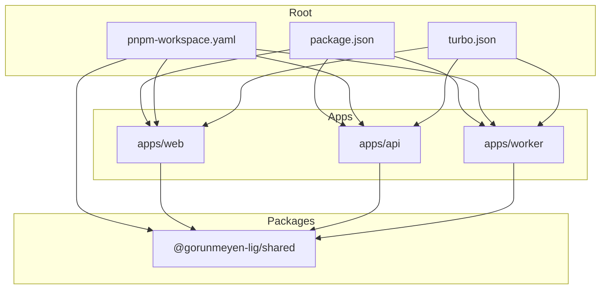
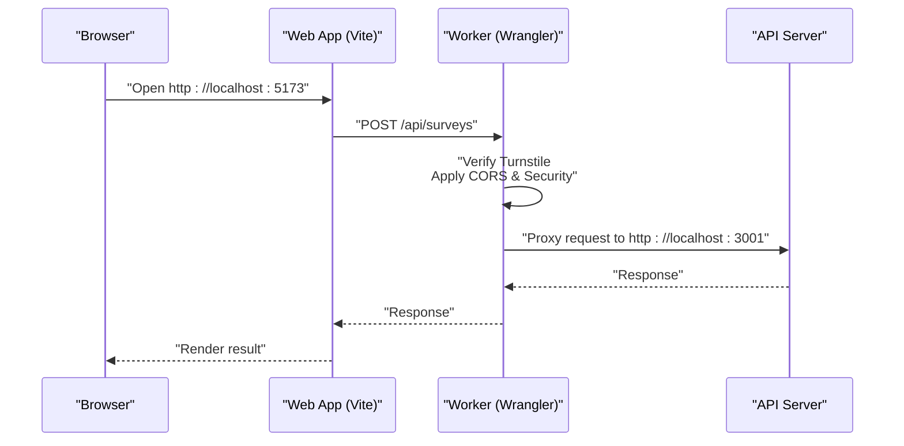
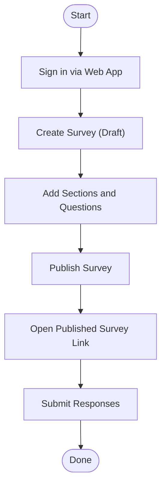

# Getting Started

<cite>
**Referenced Files in This Document**
- [package.json](file://package.json)
- [pnpm-workspace.yaml](file://pnpm-workspace.yaml)
- [turbo.json](file://turbo.json)
- [apps/web/package.json](file://apps/web/package.json)
- [apps/web/vite.config.ts](file://apps/web/vite.config.ts)
- [apps/web/tailwind.config.ts](file://apps/web/tailwind.config.ts)
- [apps/api/package.json](file://apps/api/package.json)
- [apps/api/src/index.ts](file://apps/api/src/index.ts)
- [apps/api/drizzle.config.ts](file://apps/api/drizzle.config.ts)
- [apps/api/src/db/schema.ts](file://apps/api/src/db/schema.ts)
- [apps/worker/package.json](file://apps/worker/package.json)
- [apps/worker/wrangler.toml](file://apps/worker/wrangler.toml)
- [apps/worker/src/index.ts](file://apps/worker/src/index.ts)
- [packages/shared/package.json](file://packages/shared/package.json)
- [packages/shared/src/index.ts](file://packages/shared/src/index.ts)
- [packages/shared/src/types/survey.ts](file://packages/shared/src/types/survey.ts)
- [packages/shared/src/schemas/survey.schema.ts](file://packages/shared/src/schemas/survey.schema.ts)
</cite>

## Table of Contents
1. [Introduction](#introduction)
2. [Prerequisites](#prerequisites)
3. [Project Structure](#project-structure)
4. [Monorepo Setup with pnpm Workspaces](#monorepo-setup-with-pnpm-workspaces)
5. [Environment Variables](#environment-variables)
6. [Local Development Workflow](#local-development-workflow)
7. [Running the Complete Stack Locally](#running-the-complete-stack-locally)
8. [Development Commands Reference](#development-commands-reference)
9. [Initial Project Walkthrough](#initial-project-walkthrough)
10. [First-Time Contributor Guidance](#first-time-contributor-guidance)
11. [Creating Your First Survey](#creating-your-first-survey)
12. [Troubleshooting Guide](#troubleshooting-guide)
13. [Conclusion](#conclusion)

## Introduction
Cursoranket is a survey platform built as a modern monorepo with three applications:
- Web UI (React 19, Vite, TailwindCSS)
- API service (Hono, PostgreSQL via Drizzle ORM)
- Worker (Cloudflare Workers proxy with rate limiting and Turnstile checks)

The stack uses pnpm workspaces and Turborepo for efficient builds, caching, and orchestration across the monorepo.

## Prerequisites
- Node.js: Required for running the development servers and tooling.
- pnpm: Package manager configured in the repository.
- Cloudflare CLI (Wrangler): Required for developing and previewing the Worker locally.

Ensure these tools are installed globally before proceeding.

**Section sources**
- [package.json:1-30](file://package.json#L1-L30)
- [apps/worker/package.json:1-24](file://apps/worker/package.json#L1-L24)

## Project Structure
The repository follows a classic monorepo layout:
- apps/
  - web: React SPA with Vite and TailwindCSS
  - api: Hono-based Node.js server with Drizzle ORM and PostgreSQL
  - worker: Cloudflare Worker proxy and security middleware
- packages/shared: Shared TypeScript types and Zod schemas used by all apps
- Root configs: pnpm-workspace.yaml, turbo.json, package.json

**Diagram sources**
- [pnpm-workspace.yaml:1-4](file://pnpm-workspace.yaml#L1-L4)
- [turbo.json:1-29](file://turbo.json#L1-L29)
- [apps/web/package.json:1-51](file://apps/web/package.json#L1-L51)
- [apps/api/package.json:1-34](file://apps/api/package.json#L1-L34)
- [apps/worker/package.json:1-24](file://apps/worker/package.json#L1-L24)
- [packages/shared/package.json:1-18](file://packages/shared/package.json#L1-L18)

**Section sources**
- [pnpm-workspace.yaml:1-4](file://pnpm-workspace.yaml#L1-L4)
- [turbo.json:1-29](file://turbo.json#L1-L29)
- [package.json:1-30](file://package.json#L1-L30)

## Monorepo Setup with pnpm Workspaces
- Install dependencies at the repository root using pnpm. This will link workspace packages and install all app dependencies.
- The workspace configuration includes apps and packages directories.

Steps:
1. Open a terminal at the repository root.
2. Run the pnpm install command to set up the monorepo.

What to expect:
- pnpm links @gorunmeyen-lig/shared across apps automatically.
- Turborepo is configured to orchestrate tasks across apps.

**Section sources**
- [pnpm-workspace.yaml:1-4](file://pnpm-workspace.yaml#L1-L4)
- [package.json:1-30](file://package.json#L1-L30)

## Environment Variables
Environment variables are used across apps. Below are the essential ones grouped by component.

- API server
  - DATABASE_URL: PostgreSQL connection string for migrations and ORM
  - FRONTEND_URL: Origin of the web app for CORS
  - API_PORT: Port for the API server (default used in code)

- Worker
  - API_BASE_URL: Target backend base URL for proxying
  - FRONTEND_URL: Allowed origin for CORS
  - TURNSTILE_SECRET_KEY: Cloudflare Turnstile secret for spam protection
  - UPSTASH_REDIS_REST_URL and UPSTASH_REDIS_REST_TOKEN: Upstash Redis credentials for rate limiting

- Web app
  - No environment variables are referenced in the current Vite config; it proxies to the API on localhost.

Notes:
- The Worker’s wrangler.toml defines vars and comments on secrets to be set via Wrangler.
- The API server reads environment variables for CORS and runtime behavior.

**Section sources**
- [apps/api/src/index.ts:15-22](file://apps/api/src/index.ts#L15-L22)
- [apps/api/src/index.ts:60-67](file://apps/api/src/index.ts#L60-L67)
- [apps/api/drizzle.config.ts:7-9](file://apps/api/drizzle.config.ts#L7-L9)
- [apps/worker/wrangler.toml:5-13](file://apps/worker/wrangler.toml#L5-L13)
- [apps/web/vite.config.ts:14-19](file://apps/web/vite.config.ts#L14-L19)

## Local Development Workflow
Each application provides scripts to run in development mode. Turborepo orchestrates these tasks.

- Web app
  - Script: dev
  - Starts Vite dev server on port 5173
  - Proxies /api to the API server on localhost:3001

- API app
  - Script: dev
  - Starts TSX watcher on src/index.ts
  - Serves on port 3001 by default

- Worker app
  - Script: dev
  - Starts Wrangler dev server
  - Proxies /api/* to the API server and adds security headers and Turnstile verification

- Root scripts
  - dev:web, dev:api, dev:worker: Turborepo filters to start individual apps
  - build, build:web, build:api, build:worker: Build tasks
  - db:generate, db:migrate, db:push: Drizzle ORM database tasks
  - lint, type-check: Linting and type checking across the monorepo

**Section sources**
- [apps/web/package.json:6-11](file://apps/web/package.json#L6-L11)
- [apps/web/vite.config.ts:12-20](file://apps/web/vite.config.ts#L12-L20)
- [apps/api/package.json:6-15](file://apps/api/package.json#L6-L15)
- [apps/api/src/index.ts:60-67](file://apps/api/src/index.ts#L60-L67)
- [apps/worker/package.json:6-11](file://apps/worker/package.json#L6-L11)
- [package.json:6-19](file://package.json#L6-L19)
- [turbo.json:3-27](file://turbo.json#L3-L27)

## Running the Complete Stack Locally
Follow these steps to run the entire stack:

1. Install dependencies
   - From the repository root, run the pnpm install command.

2. Set environment variables
   - Create a .env file at the repository root or configure your shell with the required variables for API and Worker.

3. Start the API server
   - Run the API dev script to start the Hono server.

4. Start the Worker
   - Run the Worker dev script to start the Cloudflare Worker proxy locally.

5. Start the Web app
   - Run the Web dev script to start the React SPA.

6. Verify connectivity
   - Open the Web app in your browser (default port 5173).
   - Confirm that /api requests are proxied to the API server.

**Diagram sources**
- [apps/web/vite.config.ts:14-19](file://apps/web/vite.config.ts#L14-L19)
- [apps/worker/src/index.ts:82-103](file://apps/worker/src/index.ts#L82-L103)
- [apps/api/src/index.ts:40-47](file://apps/api/src/index.ts#L40-L47)

**Section sources**
- [apps/web/vite.config.ts:12-20](file://apps/web/vite.config.ts#L12-L20)
- [apps/worker/src/index.ts:15-28](file://apps/worker/src/index.ts#L15-L28)
- [apps/worker/src/index.ts:42-79](file://apps/worker/src/index.ts#L42-L79)
- [apps/worker/src/index.ts:82-103](file://apps/worker/src/index.ts#L82-L103)
- [apps/api/src/index.ts:11-22](file://apps/api/src/index.ts#L11-L22)

## Development Commands Reference
- Root
  - pnpm run dev:web, pnpm run dev:api, pnpm run dev:worker
  - pnpm run build, pnpm run build:web, pnpm run build:api, pnpm run build:worker
  - pnpm run db:generate, pnpm run db:migrate, pnpm run db:push
  - pnpm run lint, pnpm run type-check

- Web
  - pnpm dev, pnpm build, pnpm preview

- API
  - pnpm dev, pnpm build, pnpm start
  - pnpm run db:generate, pnpm run db:migrate, pnpm run db:push, pnpm run db:studio

- Worker
  - pnpm dev, pnpm build, pnpm deploy

- Shared
  - pnpm run type-check, pnpm run lint

**Section sources**
- [package.json:6-19](file://package.json#L6-L19)
- [apps/web/package.json:6-11](file://apps/web/package.json#L6-L11)
- [apps/api/package.json:6-15](file://apps/api/package.json#L6-L15)
- [apps/worker/package.json:6-11](file://apps/worker/package.json#L6-L11)
- [packages/shared/package.json:7-10](file://packages/shared/package.json#L7-L10)

## Initial Project Walkthrough
- Web app
  - Entry point renders the root React element.
  - Vite config sets up React plugin, path aliases, and a proxy for /api to the API server.
  - TailwindCSS is configured for styling.

- API app
  - Hono server with logging, CORS, secure headers, and request size/timeouts.
  - Health check endpoint is present.
  - Drizzle ORM schema defines database tables and enums.

- Worker app
  - CORS restricted to FRONTEND_URL.
  - Turnstile verification for POST requests to survey response endpoints.
  - Proxies all /api/* requests to the API server with forwarded headers.

- Shared package
  - Exports shared types and Zod schemas for surveys, questions, responses, and assignments.

**Section sources**
- [apps/web/src/main.tsx:1-11](file://apps/web/src/main.tsx#L1-L11)
- [apps/web/vite.config.ts:1-26](file://apps/web/vite.config.ts#L1-L26)
- [apps/web/tailwind.config.ts:1-55](file://apps/web/tailwind.config.ts#L1-L55)
- [apps/api/src/index.ts:1-67](file://apps/api/src/index.ts#L1-L67)
- [apps/api/src/db/schema.ts:1-247](file://apps/api/src/db/schema.ts#L1-L247)
- [apps/worker/src/index.ts:1-106](file://apps/worker/src/index.ts#L1-L106)
- [packages/shared/src/index.ts:1-10](file://packages/shared/src/index.ts#L1-L10)

## First-Time Contributor Guidance
- Code organization
  - apps/web: React components, stores, and utilities; uses Vite and TailwindCSS.
  - apps/api: Hono routes and server logic; integrates Drizzle ORM and PostgreSQL.
  - apps/worker: Cloudflare Worker proxy with Turnstile and rate-limiting integrations.
  - packages/shared: Reusable types and Zod schemas.

- Development conventions
  - Use pnpm scripts defined in each app and root for consistent workflows.
  - Keep shared types and schemas in packages/shared to avoid duplication.
  - Apply CORS and security headers consistently across API and Worker.

- Testing approaches
  - Type-check and lint tasks are available at root and per-app level.
  - For functional tests, integrate unit tests in each app and end-to-end tests for the full stack.

**Section sources**
- [packages/shared/src/types/survey.ts:1-50](file://packages/shared/src/types/survey.ts#L1-L50)
- [packages/shared/src/schemas/survey.schema.ts:1-22](file://packages/shared/src/schemas/survey.schema.ts#L1-L22)
- [package.json:6-19](file://package.json#L6-L19)
- [apps/web/package.json:6-11](file://apps/web/package.json#L6-L11)
- [apps/api/package.json:6-15](file://apps/api/package.json#L6-L15)
- [apps/worker/package.json:6-11](file://apps/worker/package.json#L6-L11)

## Creating Your First Survey
Below is a practical, step-by-step guide to create a survey and submit a response. This workflow covers authentication, survey creation, publishing, and response submission.

Step 1: Start the stack
- Ensure the API server, Worker, and Web app are running locally.

Step 2: Authenticate
- Access the Web app in your browser.
- Authentication is handled by Better Auth on the API. Use the appropriate provider to sign in.

Step 3: Create a survey
- Navigate to the survey creation page in the Web app.
- Fill in the title and optional description.
- Save as draft.

Step 4: Publish the survey
- Change the survey status to published.
- Note the survey URL generated by the platform.

Step 5: Submit a response
- Open the published survey URL.
- Complete the survey form.
- Submit the response; the Worker validates Turnstile and proxies the request to the API.

[No sources needed since this diagram shows conceptual workflow, not actual code structure]

## Troubleshooting Guide
Common setup and runtime issues:

- Port conflicts
  - Web app runs on port 5173; API server on port 3001.
  - If ports are busy, adjust the ports in the respective configurations.

- CORS errors
  - Ensure FRONTEND_URL matches the Web app origin.
  - Verify CORS configuration in both API and Worker.

- Database migration issues
  - Set DATABASE_URL correctly.
  - Use the database tasks to generate, migrate, and push schema changes.

- Worker secrets missing
  - TURNSTILE_SECRET_KEY and Upstash Redis credentials must be set via Wrangler.
  - Confirm wrangler.toml vars and secrets configuration.

- Proxy not working
  - Confirm API_BASE_URL points to the running API server.
  - Check that the Worker dev server is running and proxying /api/*.

**Section sources**
- [apps/web/vite.config.ts:12-20](file://apps/web/vite.config.ts#L12-L20)
- [apps/api/src/index.ts:15-22](file://apps/api/src/index.ts#L15-L22)
- [apps/api/drizzle.config.ts:7-9](file://apps/api/drizzle.config.ts#L7-L9)
- [apps/worker/wrangler.toml:5-13](file://apps/worker/wrangler.toml#L5-L13)
- [apps/worker/src/index.ts:82-103](file://apps/worker/src/index.ts#L82-L103)

## Conclusion
You now have the essentials to set up and run the Cursoranket survey platform locally. Use the provided scripts, configure environment variables, and follow the development workflow to iterate quickly across the Web app, API server, and Worker. For deeper customization, explore the shared types and schemas, and expand the API routes as needed.