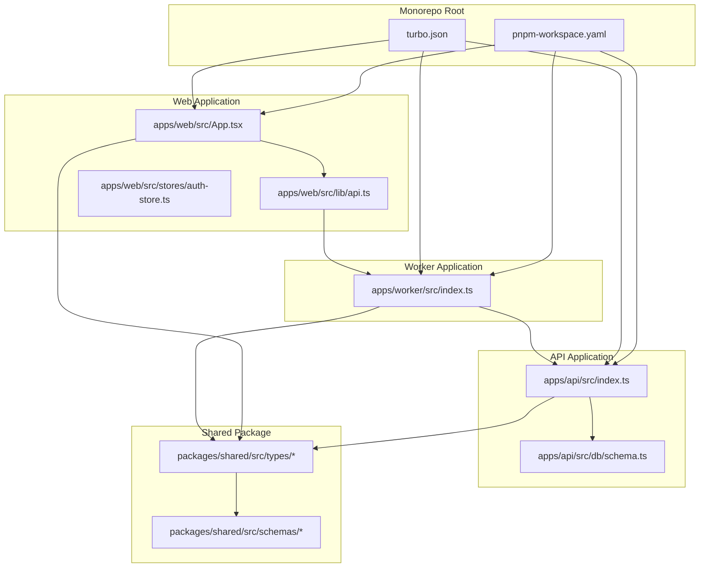
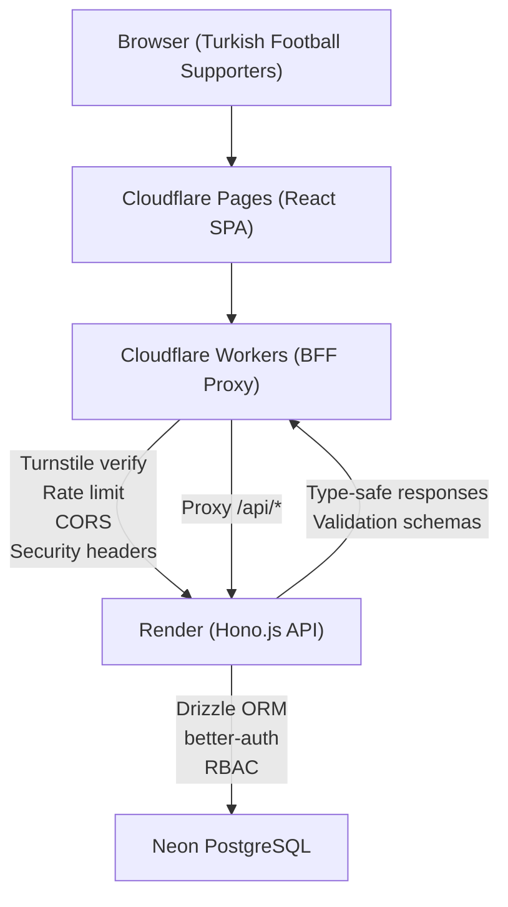
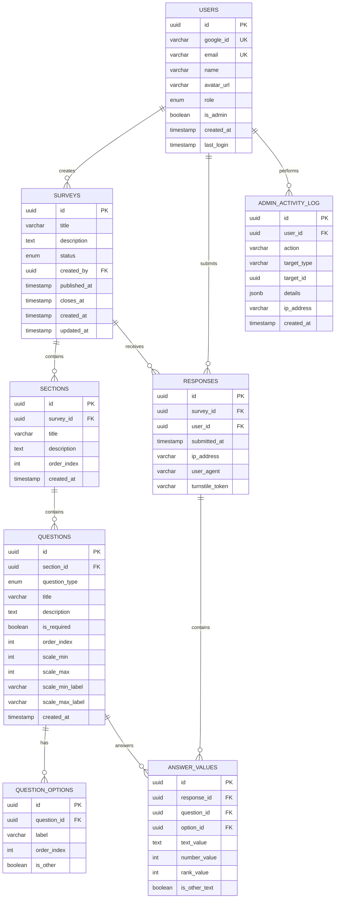
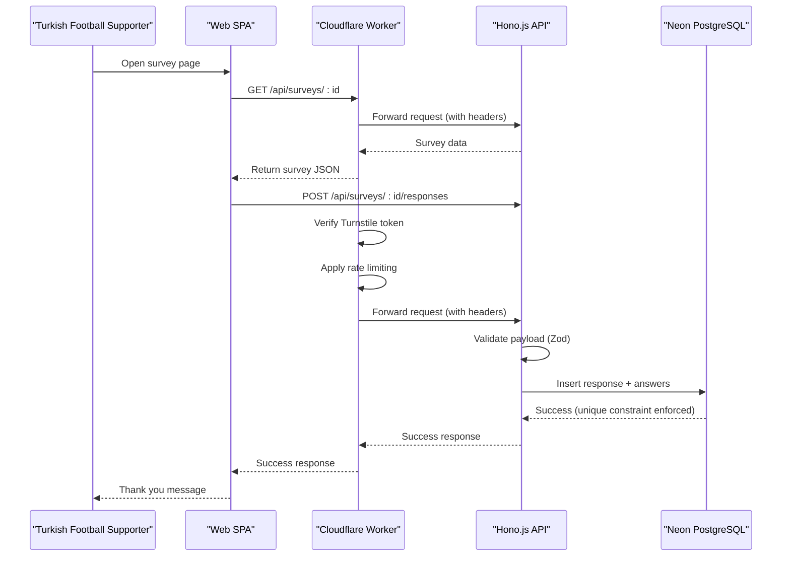
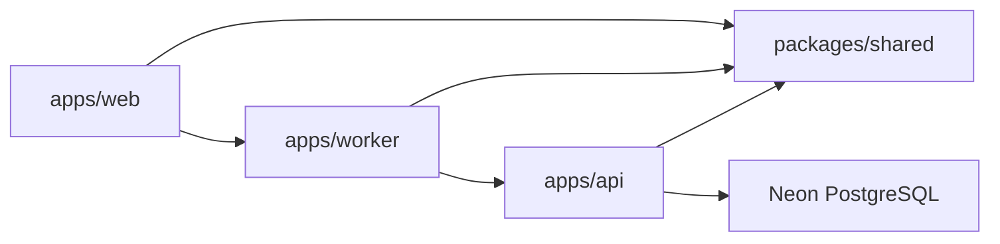

# Project Overview

<cite>
**Referenced Files in This Document**
- [plan.md](file://plan.md)
- [App.tsx](file://apps/web/src/App.tsx)
- [api.ts](file://apps/web/src/lib/api.ts)
- [auth-store.ts](file://apps/web/src/stores/auth-store.ts)
- [index.ts](file://apps/api/src/index.ts)
- [schema.ts](file://apps/api/src/db/schema.ts)
- [index.ts](file://apps/worker/src/index.ts)
- [survey.ts](file://packages/shared/src/types/survey.ts)
- [question.ts](file://packages/shared/src/types/question.ts)
- [response.ts](file://packages/shared/src/types/response.ts)
- [question.schema.ts](file://packages/shared/src/schemas/question.schema.ts)
- [survey.schema.ts](file://packages/shared/src/schemas/survey.schema.ts)
- [turbo.json](file://turbo.json)
- [pnpm-workspace.yaml](file://pnpm-workspace.yaml)
</cite>

## Table of Contents
1. [Introduction](#introduction)
2. [Project Structure](#project-structure)
3. [Core Components](#core-components)
4. [Architecture Overview](#architecture-overview)
5. [Detailed Component Analysis](#detailed-component-analysis)
6. [Dependency Analysis](#dependency-analysis)
7. [Performance Considerations](#performance-considerations)
8. [Troubleshooting Guide](#troubleshooting-guide)
9. [Conclusion](#conclusion)

## Introduction
Görünmeyen Lig Anketi is a Turkish football supporter survey and polling platform designed specifically for Turkish football fans. The platform enables users to discover, complete, and share insights from football-related polls while providing administrators with powerful tools to create, manage, and analyze survey content. Built with a modern edge-first architecture, it combines a React single-page application (SPA), a Hono.js backend API, and Cloudflare Workers as a front-door firewall and proxy to deliver a secure, scalable, and responsive experience for Turkish football supporters.

Key value proposition:
- Tailored for Turkish football culture and language
- Comprehensive survey platform with 12+ question types for nuanced fan insights
- Robust security pipeline with Cloudflare WAF, Turnstile bot protection, and rate limiting
- Real-time analytics and hourly polling for administrators
- Monorepo architecture ensuring type-safe, maintainable development across web, API, and edge layers

Target audience:
- Turkish football fans who want to participate in polls and share opinions
- Administrators and editors managing surveys, responses, and team assignments

Differentiators:
- Edge-first security and performance with Cloudflare Workers validating requests before they reach the backend
- Rich question types supporting everything from simple yes/no votes to complex matrix and ranking scales
- Strict anti-abuse measures including Turnstile verification, rate limiting, and database-level uniqueness constraints
- Hourly polling strategy for real-time admin dashboards with caching controls

## Project Structure
The project follows a monorepo layout managed by Turborepo and pnpm workspaces, separating concerns into three primary applications and a shared package for types and validation schemas.

**Diagram sources**
- [pnpm-workspace.yaml:1-4](file://pnpm-workspace.yaml#L1-L4)
- [turbo.json:1-29](file://turbo.json#L1-L29)
- [App.tsx:1-23](file://apps/web/src/App.tsx#L1-L23)
- [api.ts:1-60](file://apps/web/src/lib/api.ts#L1-L60)
- [auth-store.ts:1-31](file://apps/web/src/stores/auth-store.ts#L1-L31)
- [index.ts:1-67](file://apps/api/src/index.ts#L1-L67)
- [schema.ts:1-247](file://apps/api/src/db/schema.ts#L1-L247)
- [index.ts:1-106](file://apps/worker/src/index.ts#L1-L106)
- [survey.ts:1-50](file://packages/shared/src/types/survey.ts#L1-L50)
- [question.ts:1-66](file://packages/shared/src/types/question.ts#L1-L66)
- [response.ts:1-53](file://packages/shared/src/types/response.ts#L1-L53)
- [question.schema.ts:1-65](file://packages/shared/src/schemas/question.schema.ts#L1-L65)
- [survey.schema.ts:1-22](file://packages/shared/src/schemas/survey.schema.ts#L1-L22)

**Section sources**
- [pnpm-workspace.yaml:1-4](file://pnpm-workspace.yaml#L1-L4)
- [turbo.json:1-29](file://turbo.json#L1-L29)
- [plan.md:527-664](file://plan.md#L527-L664)

## Core Components
This section outlines the platform’s building blocks and their roles in delivering a seamless survey experience.

- Web SPA (React + Vite): Provides the user-facing interface for browsing published surveys, completing questionnaires, and viewing thank-you confirmations. It integrates with the shared types and validation schemas for type-safe interactions.
- API (Hono.js + Drizzle ORM): Implements REST endpoints for authentication, survey management, response collection, and administrative functions. It enforces security middleware, request validation, and database constraints.
- Worker (Cloudflare Workers + Hono.js): Acts as a front-door firewall and proxy. It validates Cloudflare Turnstile tokens, applies rate limiting, enforces CORS, and forwards requests to the backend API with appropriate headers.
- Shared Types and Schemas: Define consistent data contracts across the web, worker, and API layers, ensuring type safety and reducing integration errors.

Practical examples:
- A user visits the homepage and navigates to a published survey. The SPA fetches survey details via the worker proxy, which forwards the request to the API. After successful authentication, the user submits responses. The worker validates the Turnstile token and rate limits, then the API persists the response and enforces uniqueness constraints.
- An administrator logs in, edits survey sections and questions, manages permissions, and exports responses as CSV. The worker ensures only trusted requests reach the API, while the API maintains RBAC and audit logging.

**Section sources**
- [App.tsx:1-23](file://apps/web/src/App.tsx#L1-L23)
- [api.ts:1-60](file://apps/web/src/lib/api.ts#L1-L60)
- [auth-store.ts:1-31](file://apps/web/src/stores/auth-store.ts#L1-L31)
- [index.ts:1-67](file://apps/api/src/index.ts#L1-L67)
- [index.ts:1-106](file://apps/worker/src/index.ts#L1-L106)
- [survey.ts:1-50](file://packages/shared/src/types/survey.ts#L1-L50)
- [question.ts:1-66](file://packages/shared/src/types/question.ts#L1-L66)
- [response.ts:1-53](file://packages/shared/src/types/response.ts#L1-L53)
- [question.schema.ts:1-65](file://packages/shared/src/schemas/question.schema.ts#L1-L65)
- [survey.schema.ts:1-22](file://packages/shared/src/schemas/survey.schema.ts#L1-L22)

## Architecture Overview
The platform employs an edge-first architecture to maximize security and performance. Requests traverse Cloudflare’s global network before reaching the backend, where they are validated and processed.

**Diagram sources**
- [plan.md:139-184](file://plan.md#L139-L184)
- [index.ts:1-106](file://apps/worker/src/index.ts#L1-L106)
- [index.ts:1-67](file://apps/api/src/index.ts#L1-L67)
- [schema.ts:1-247](file://apps/api/src/db/schema.ts#L1-L247)

How it works conceptually:
- Edge validation: Cloudflare Workers performs Turnstile verification, rate limiting, and CORS enforcement before forwarding requests to the backend.
- Backend processing: The Hono.js API handles authentication, authorization, and business logic, using Drizzle ORM for database operations.
- Data persistence: All survey data, responses, and user sessions are stored in a serverless PostgreSQL database.
- Frontend integration: The React SPA communicates with the backend via the worker proxy, ensuring consistent security and performance.

**Section sources**
- [plan.md:139-184](file://plan.md#L139-L184)
- [index.ts:1-106](file://apps/worker/src/index.ts#L1-L106)
- [index.ts:1-67](file://apps/api/src/index.ts#L1-L67)
- [schema.ts:1-247](file://apps/api/src/db/schema.ts#L1-L247)

## Detailed Component Analysis

### Technology Stack Summary
- Frontend: React 19, Vite, TypeScript, Tailwind CSS, shadcn/ui, @dnd-kit, React Router, Zustand, SWR, DOMPurify
- Backend: Hono.js, better-auth, Drizzle ORM, Zod, Neon Serverless Driver
- Edge: Cloudflare Workers, Cloudflare Turnstile, Upstash Redis
- Database: Neon Postgres (serverless)
- DevOps: Turborepo, pnpm, Cloudflare Pages, Render, Cloudflare DNS + WAF

**Section sources**
- [plan.md:87-136](file://plan.md#L87-L136)

### Data Model and Question Types
The platform supports a rich set of question types to capture diverse fan insights, from simple text inputs to complex matrix scales.

**Diagram sources**
- [schema.ts:41-246](file://apps/api/src/db/schema.ts#L41-L246)

Key question types supported:
- Text-based: short_text, long_text
- Choice-based: single_choice, multiple_choice, dropdown
- Scale-based: linear_scale, rating
- Binary: yes_no
- Temporal: date
- Quantitative: number
- Ordered: ranking
- Matrix: matrix

These question types enable administrators to craft detailed surveys tailored to Turkish football culture, capturing preferences, ratings, rankings, and open-ended feedback.

**Section sources**
- [question.ts:1-66](file://packages/shared/src/types/question.ts#L1-L66)
- [question.schema.ts:1-65](file://packages/shared/src/schemas/question.schema.ts#L1-L65)
- [schema.ts:22-35](file://apps/api/src/db/schema.ts#L22-L35)

### API Workflow: Survey Response Collection
The platform’s response collection process ensures security, uniqueness, and real-time updates.

**Diagram sources**
- [plan.md:428-444](file://plan.md#L428-L444)
- [index.ts:1-106](file://apps/worker/src/index.ts#L1-L106)
- [index.ts:1-67](file://apps/api/src/index.ts#L1-L67)
- [schema.ts:173-196](file://apps/api/src/db/schema.ts#L173-L196)

Common use cases:
- Live match prediction polls with multiple-choice and ranking options
- Fan preference surveys with linear scales and matrix questions
- Post-match sentiment analysis using yes/no and rating question types
- Open-ended feedback collection via short and long text inputs

**Section sources**
- [plan.md:428-444](file://plan.md#L428-L444)
- [index.ts:1-106](file://apps/worker/src/index.ts#L1-L106)
- [index.ts:1-67](file://apps/api/src/index.ts#L1-L67)
- [schema.ts:173-196](file://apps/api/src/db/schema.ts#L173-L196)

## Dependency Analysis
The monorepo’s dependency graph emphasizes clear separation of concerns and shared contracts.

**Diagram sources**
- [pnpm-workspace.yaml:1-4](file://pnpm-workspace.yaml#L1-L4)
- [turbo.json:1-29](file://turbo.json#L1-L29)
- [schema.ts:1-247](file://apps/api/src/db/schema.ts#L1-L247)

Observations:
- Cohesion: Each app encapsulates its responsibilities—web for presentation, worker for edge security/proxy, API for business logic and persistence.
- Coupling: Shared package provides types and schemas, minimizing duplication and ensuring consistent contracts.
- External dependencies: Cloudflare ecosystem (Workers, Turnstile, Redis), Render for hosting, Neon for database, and npm packages for frontend/backend.

**Section sources**
- [pnpm-workspace.yaml:1-4](file://pnpm-workspace.yaml#L1-L4)
- [turbo.json:1-29](file://turbo.json#L1-L29)

## Performance Considerations
- Edge-first validation reduces backend load by blocking invalid or abusive requests early.
- Hourly polling strategy for admin dashboards balances real-time visibility with caching efficiency.
- Database indexing on frequently queried columns (surveys, responses, assignments) improves query performance.
- Keep-alive strategy prevents cold starts on Render’s free tier by periodic health checks.

[No sources needed since this section provides general guidance]

## Troubleshooting Guide
Common issues and resolutions:
- Authentication failures: Verify Google OAuth configuration and better-auth settings in environment variables.
- Turnstile verification errors: Confirm Turnstile secret key and site configuration; ensure the worker proxy is correctly forwarding requests.
- Rate limiting blocks: Review Upstash Redis configuration and adjust sliding window thresholds as needed.
- Database connectivity: Validate Neon connection strings and ensure migrations are applied.
- CORS errors: Confirm allowed origins and credentials settings in worker CORS middleware.

**Section sources**
- [plan.md:668-700](file://plan.md#L668-L700)
- [index.ts:1-106](file://apps/worker/src/index.ts#L1-L106)
- [index.ts:1-67](file://apps/api/src/index.ts#L1-L67)

## Conclusion
Görünmeyen Lig Anketi delivers a robust, secure, and culturally relevant survey platform for Turkish football supporters. Its edge-first architecture, comprehensive question types, and strong security pipeline position it as a reliable solution for collecting meaningful fan insights. The monorepo structure and shared contracts ensure maintainability and scalability, while the hourly polling and real-time admin dashboards support dynamic engagement and analysis.