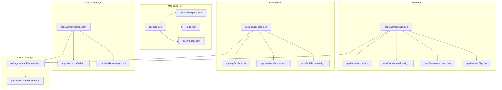
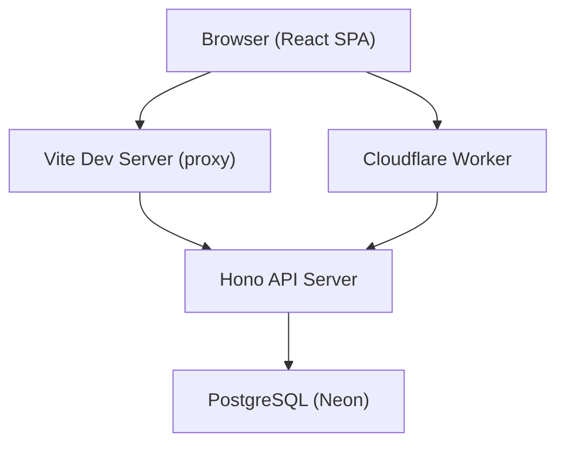
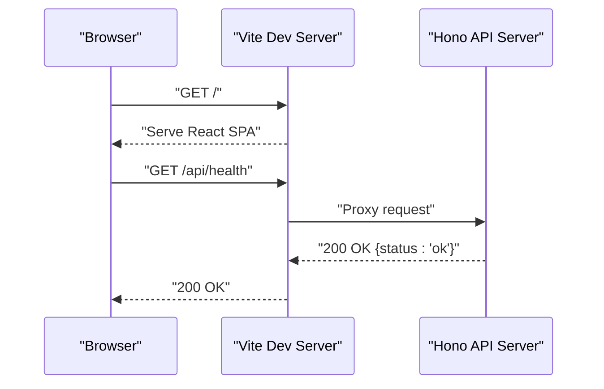
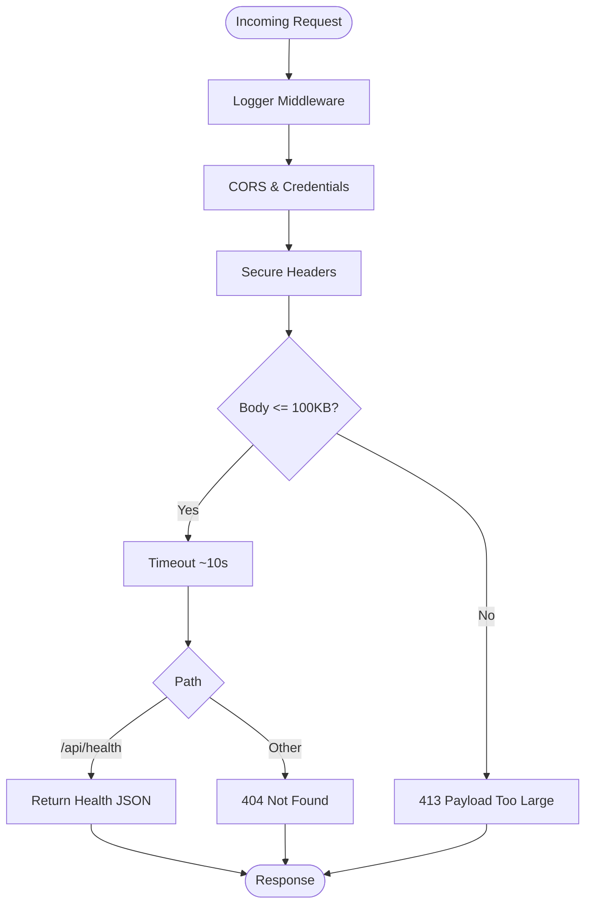
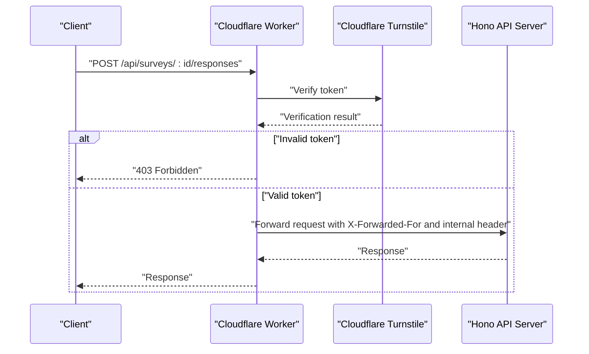
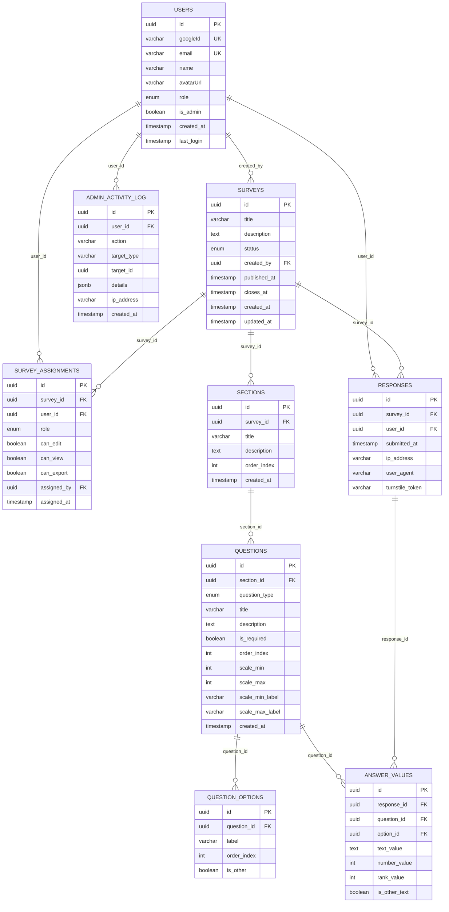
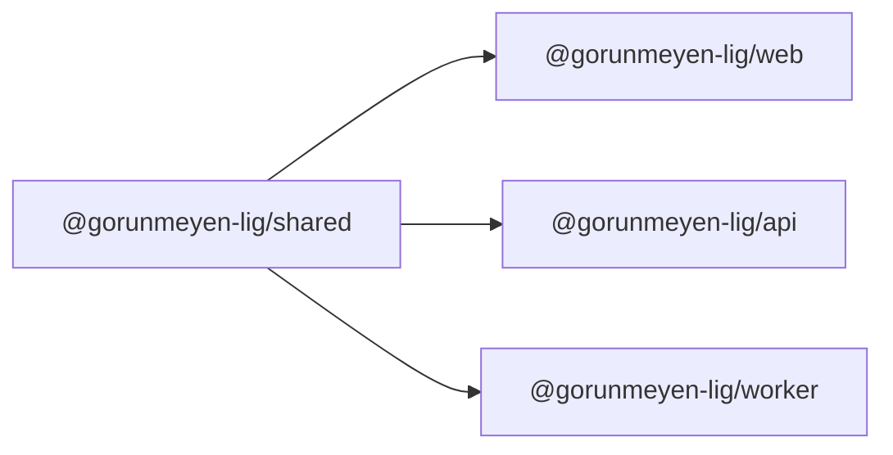
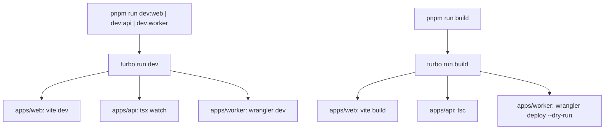

# Technology Stack

<cite>
**Referenced Files in This Document**
- [package.json](file://package.json)
- [pnpm-workspace.yaml](file://pnpm-workspace.yaml)
- [turbo.json](file://turbo.json)
- [tsconfig.base.json](file://tsconfig.base.json)
- [apps/web/package.json](file://apps/web/package.json)
- [apps/web/vite.config.ts](file://apps/web/vite.config.ts)
- [apps/web/tailwind.config.ts](file://apps/web/tailwind.config.ts)
- [apps/web/components.json](file://apps/web/components.json)
- [apps/web/src/App.tsx](file://apps/web/src/App.tsx)
- [apps/api/package.json](file://apps/api/package.json)
- [apps/api/src/index.ts](file://apps/api/src/index.ts)
- [apps/api/src/db/schema.ts](file://apps/api/src/db/schema.ts)
- [apps/api/drizzle.config.ts](file://apps/api/drizzle.config.ts)
- [apps/worker/package.json](file://apps/worker/package.json)
- [apps/worker/src/index.ts](file://apps/worker/src/index.ts)
- [apps/worker/wrangler.toml](file://apps/worker/wrangler.toml)
- [packages/shared/package.json](file://packages/shared/package.json)
- [packages/shared/src/index.ts](file://packages/shared/src/index.ts)
</cite>

## Table of Contents
1. [Introduction](#introduction)
2. [Project Structure](#project-structure)
3. [Core Components](#core-components)
4. [Architecture Overview](#architecture-overview)
5. [Detailed Component Analysis](#detailed-component-analysis)
6. [Dependency Analysis](#dependency-analysis)
7. [Performance Considerations](#performance-considerations)
8. [Security and Scalability](#security-and-scalability)
9. [Development Tools and Workflow](#development-tools-and-workflow)
10. [Version Compatibility and Upgrade Paths](#version-compatibility-and-upgrade-paths)
11. [Conclusion](#conclusion)

## Introduction
This document describes the cursoranket platform’s technology stack, focusing on frontend, backend, database, and Cloudflare edge integration. It explains the rationale behind each technology choice, highlights performance and security characteristics, and outlines development workflows using Turborepo, pnpm workspaces, and TypeScript.

## Project Structure
The project is organized as a monorepo with three applications and a shared package:
- apps/web: React 19 single-page application with Vite, Tailwind CSS, and shadcn/ui components
- apps/api: Hono.js server exposing REST endpoints and integrating better-auth and Drizzle ORM
- apps/worker: Cloudflare Worker proxying API requests and enforcing Turnstile CAPTCHA
- packages/shared: Shared TypeScript types and Zod schemas used across the platform
- Root tooling: Turborepo for task orchestration, pnpm for workspace management, and base TypeScript configuration

**Diagram sources**
- [package.json:1-30](file://package.json#L1-L30)
- [pnpm-workspace.yaml:1-4](file://pnpm-workspace.yaml#L1-L4)
- [turbo.json:1-29](file://turbo.json#L1-L29)
- [tsconfig.base.json:1-19](file://tsconfig.base.json#L1-L19)
- [apps/web/package.json:1-51](file://apps/web/package.json#L1-L51)
- [apps/web/vite.config.ts:1-26](file://apps/web/vite.config.ts#L1-L26)
- [apps/web/tailwind.config.ts:1-55](file://apps/web/tailwind.config.ts#L1-L55)
- [apps/web/components.json:1-21](file://apps/web/components.json#L1-L21)
- [apps/web/src/App.tsx:1-23](file://apps/web/src/App.tsx#L1-L23)
- [apps/api/package.json:1-34](file://apps/api/package.json#L1-L34)
- [apps/api/src/index.ts:1-67](file://apps/api/src/index.ts#L1-L67)
- [apps/api/src/db/schema.ts:1-247](file://apps/api/src/db/schema.ts#L1-L247)
- [apps/api/drizzle.config.ts:1-11](file://apps/api/drizzle.config.ts#L1-L11)
- [apps/worker/package.json:1-24](file://apps/worker/package.json#L1-L24)
- [apps/worker/src/index.ts:1-106](file://apps/worker/src/index.ts#L1-L106)
- [apps/worker/wrangler.toml:1-13](file://apps/worker/wrangler.toml#L1-L13)
- [packages/shared/package.json:1-18](file://packages/shared/package.json#L1-L18)
- [packages/shared/src/index.ts:1-10](file://packages/shared/src/index.ts#L1-L10)

**Section sources**
- [pnpm-workspace.yaml:1-4](file://pnpm-workspace.yaml#L1-L4)
- [turbo.json:1-29](file://turbo.json#L1-L29)
- [tsconfig.base.json:1-19](file://tsconfig.base.json#L1-L19)

## Core Components
- Frontend: React 19 with Vite for fast dev/build, Tailwind CSS for utility-first styling, and shadcn/ui for accessible component primitives
- Backend: Hono.js minimal server framework, better-auth for flexible authentication, Drizzle ORM for type-safe Postgres operations
- Edge: Cloudflare Worker proxies requests to the backend and enforces Turnstile CAPTCHA
- Database: PostgreSQL via Neon with Drizzle ORM migrations and schema definitions
- Monorepo Tooling: Turborepo for task orchestration, pnpm workspaces for dependency management, TypeScript for type safety

**Section sources**
- [apps/web/package.json:12-38](file://apps/web/package.json#L12-L38)
- [apps/api/package.json:16-26](file://apps/api/package.json#L16-L26)
- [apps/worker/package.json:12-17](file://apps/worker/package.json#L12-L17)
- [apps/api/src/db/schema.ts:1-247](file://apps/api/src/db/schema.ts#L1-L247)
- [apps/worker/src/index.ts:42-79](file://apps/worker/src/index.ts#L42-L79)

## Architecture Overview
The platform follows a decoupled architecture:
- apps/web serves the React SPA and proxies API calls to the backend during development
- apps/api exposes REST endpoints secured with CORS, secure headers, timeouts, and request size limits
- apps/worker acts as an edge proxy and CAPTCHA gatekeeper, forwarding requests to the backend and validating Turnstile tokens
- packages/shared provides shared types and Zod schemas to maintain consistency across services
- Drizzle ORM manages schema and migrations against a PostgreSQL-compatible database (Neon)

**Diagram sources**
- [apps/web/vite.config.ts:14-19](file://apps/web/vite.config.ts#L14-L19)
- [apps/api/src/index.ts:9-58](file://apps/api/src/index.ts#L9-L58)
- [apps/worker/src/index.ts:82-103](file://apps/worker/src/index.ts#L82-L103)
- [apps/api/src/db/schema.ts:1-247](file://apps/api/src/db/schema.ts#L1-L247)

## Detailed Component Analysis

### Frontend: React 19, Vite, Tailwind CSS, shadcn/ui
- React 19 provides concurrent rendering and improved DX
- Vite offers fast cold starts and HMR; the dev server proxies /api to the backend
- Tailwind CSS with custom theme variables and tailwindcss-animate enables rapid UI iteration
- shadcn/ui components are configured with TSX support and local aliases for components and utilities
- Routing is handled by react-router-dom; the app mounts a basic home route

**Diagram sources**
- [apps/web/vite.config.ts:14-19](file://apps/web/vite.config.ts#L14-L19)
- [apps/api/src/index.ts:40-42](file://apps/api/src/index.ts#L40-L42)

**Section sources**
- [apps/web/package.json:12-38](file://apps/web/package.json#L12-L38)
- [apps/web/vite.config.ts:1-26](file://apps/web/vite.config.ts#L1-L26)
- [apps/web/tailwind.config.ts:1-55](file://apps/web/tailwind.config.ts#L1-L55)
- [apps/web/components.json:1-21](file://apps/web/components.json#L1-L21)
- [apps/web/src/App.tsx:1-23](file://apps/web/src/App.tsx#L1-L23)

### Backend: Hono.js, better-auth, Drizzle ORM
- Hono.js provides a small, fast server with middleware support for logging, CORS, secure headers, timeouts, and request size limits
- better-auth integrates flexible authentication flows; the API is structured to mount auth and resource routes
- Drizzle ORM defines enums, tables, indexes, and foreign keys for users, surveys, assignments, sections, questions, options, responses, answers, and admin logs
- Drizzle Kit configuration points to the schema and DATABASE_URL for migrations

**Diagram sources**
- [apps/api/src/index.ts:12-58](file://apps/api/src/index.ts#L12-L58)

**Section sources**
- [apps/api/package.json:16-26](file://apps/api/package.json#L16-L26)
- [apps/api/src/index.ts:1-67](file://apps/api/src/index.ts#L1-L67)
- [apps/api/src/db/schema.ts:1-247](file://apps/api/src/db/schema.ts#L1-L247)
- [apps/api/drizzle.config.ts:1-11](file://apps/api/drizzle.config.ts#L1-L11)

### Cloudflare Edge: Worker Proxy and Turnstile
- The Worker enforces CORS restricted to the frontend origin, applies secure headers, and enforces a 100KB request size limit
- Turnstile verification is performed for POST requests to survey response endpoints by calling the Cloudflare challenge endpoint with the secret key
- All other /api/* requests are proxied to the backend with forwarded client IP and an internal header for upstream validation

**Diagram sources**
- [apps/worker/src/index.ts:42-79](file://apps/worker/src/index.ts#L42-L79)
- [apps/worker/src/index.ts:82-103](file://apps/worker/src/index.ts#L82-L103)

**Section sources**
- [apps/worker/package.json:12-17](file://apps/worker/package.json#L12-L17)
- [apps/worker/src/index.ts:1-106](file://apps/worker/src/index.ts#L1-L106)
- [apps/worker/wrangler.toml:1-13](file://apps/worker/wrangler.toml#L1-L13)

### Database: PostgreSQL with Neon and Drizzle ORM
- The schema defines enums for roles, statuses, and question types, and tables for users, surveys, assignments, sections, questions, options, responses, answers, and admin logs
- Indexes are defined for frequently queried columns to optimize joins and lookups
- Drizzle Kit configuration uses a PostgreSQL dialect and DATABASE_URL for migrations

**Diagram sources**
- [apps/api/src/db/schema.ts:19-246](file://apps/api/src/db/schema.ts#L19-L246)

**Section sources**
- [apps/api/src/db/schema.ts:1-247](file://apps/api/src/db/schema.ts#L1-L247)
- [apps/api/drizzle.config.ts:1-11](file://apps/api/drizzle.config.ts#L1-L11)

### Shared Types and Schemas
- The shared package re-exports user, survey, question, and response types and Zod schemas to prevent duplication and ensure consistency across services
- This enables strong typing between frontend, backend, and worker code

**Section sources**
- [packages/shared/package.json:11-13](file://packages/shared/package.json#L11-L13)
- [packages/shared/src/index.ts:1-10](file://packages/shared/src/index.ts#L1-10)

## Dependency Analysis
The monorepo uses pnpm workspaces to manage cross-package dependencies. The shared package is consumed by all apps, ensuring consistent types and schemas.

**Diagram sources**
- [apps/web/package.json:13](file://apps/web/package.json#L13)
- [apps/api/package.json:17](file://apps/api/package.json#L17)
- [apps/worker/package.json:13](file://apps/worker/package.json#L13)
- [packages/shared/package.json:1-18](file://packages/shared/package.json#L1-L18)

**Section sources**
- [pnpm-workspace.yaml:1-4](file://pnpm-workspace.yaml#L1-L4)
- [apps/web/package.json:13](file://apps/web/package.json#L13)
- [apps/api/package.json:17](file://apps/api/package.json#L17)
- [apps/worker/package.json:13](file://apps/worker/package.json#L13)

## Performance Considerations
- Frontend
  - Vite’s bundler and React 19 enable fast builds and efficient updates
  - Tailwind CSS generates only used styles; keep purge/content globs scoped to reduce bundle size
- Backend
  - Hono’s middleware pipeline adds minimal overhead; timeouts and size limits protect resources
  - Drizzle ORM compiles SQL queries at build-time; ensure indexes align with query patterns
- Edge
  - Cloudflare Workers execute close to users; Turnstile reduces bot traffic before hitting the API
  - Proxies avoid CORS preflights where possible and forwards client IPs for audit trails

[No sources needed since this section provides general guidance]

## Security and Scalability
- Security
  - Turnstile CAPTCHA prevents automated submissions at the edge
  - Secure headers middleware hardens HTTP responses
  - CORS restricts origins and credentials
  - Internal header and forwarded IP propagation aid logging and rate limiting
- Scalability
  - Cloudflare Workers scale automatically with global placement
  - Hono API scales horizontally behind a CDN/proxy
  - Neon provides serverless Postgres scaling and low-latency connections

**Section sources**
- [apps/worker/src/index.ts:30-40](file://apps/worker/src/index.ts#L30-L40)
- [apps/api/src/index.ts:23-37](file://apps/api/src/index.ts#L23-L37)

## Development Tools and Workflow
- Turborepo orchestrates tasks across apps and packages, enabling incremental builds and caching
- pnpm workspaces manage dependencies and enforce consistent versions
- TypeScript base config ensures consistent compiler options across the monorepo

**Diagram sources**
- [package.json:6-18](file://package.json#L6-L18)
- [turbo.json:3-27](file://turbo.json#L3-L27)

**Section sources**
- [package.json:1-30](file://package.json#L1-L30)
- [turbo.json:1-29](file://turbo.json#L1-L29)
- [tsconfig.base.json:1-19](file://tsconfig.base.json#L1-L19)

## Version Compatibility and Upgrade Paths
- React 19 and Vite 6 are aligned with modern module resolution and ESM-first toolchains
- Hono 4.x maintains a compact API surface suitable for microservices
- better-auth 1.x provides flexible auth with evolving plugin ecosystem
- Drizzle ORM 0.45.x brings type-safe migrations and schema introspection
- Cloudflare Workers and Upstash Redis are compatible with ES modules and typed environments
- Neon PostgreSQL supports standard SQL and migration tooling

Upgrade recommendations:
- Pin major versions in overrides and update incrementally with regression tests
- Keep Turborepo and pnpm versions aligned with LTS Node targets
- Validate middleware and schema changes after upgrading Hono/better-auth/Drizzle

[No sources needed since this section provides general guidance]

## Conclusion
The cursoranket platform leverages a modern, scalable stack: React 19 with Vite for the frontend, Hono.js for a lightweight backend, better-auth for authentication, Drizzle ORM for type-safe database operations, and Cloudflare Workers for edge security and routing. The monorepo structure, powered by Turborepo and pnpm, streamlines development while maintaining type safety and shared contracts through the shared package.