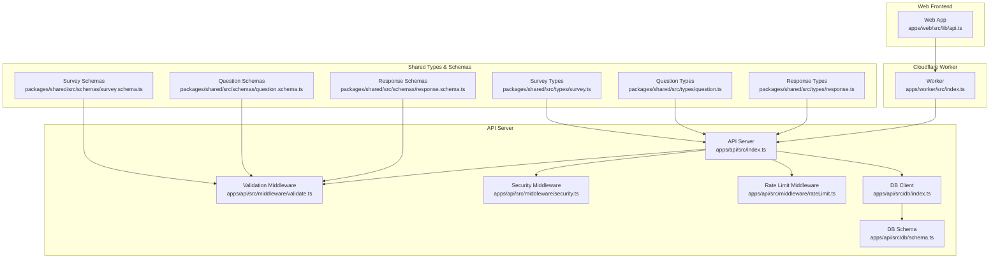
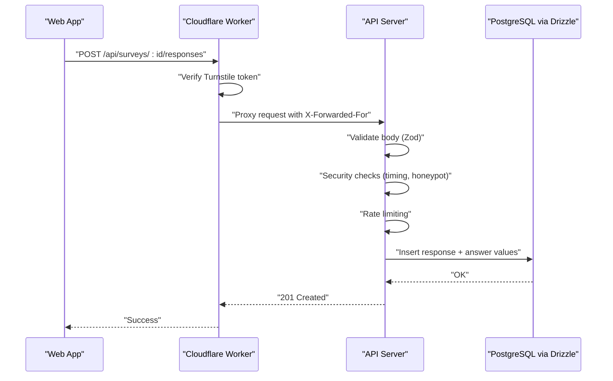
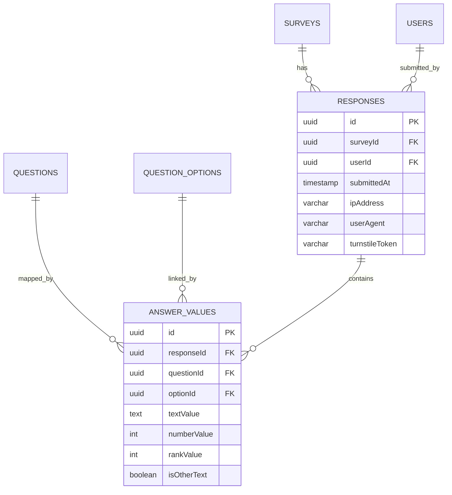
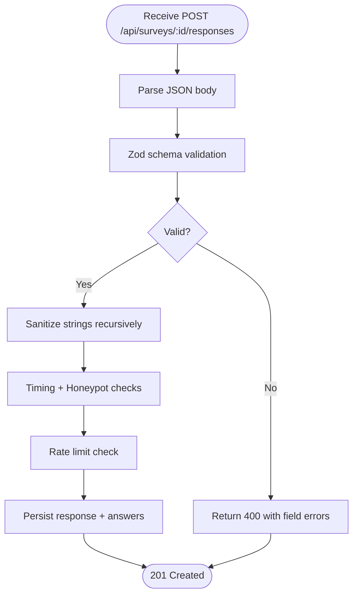
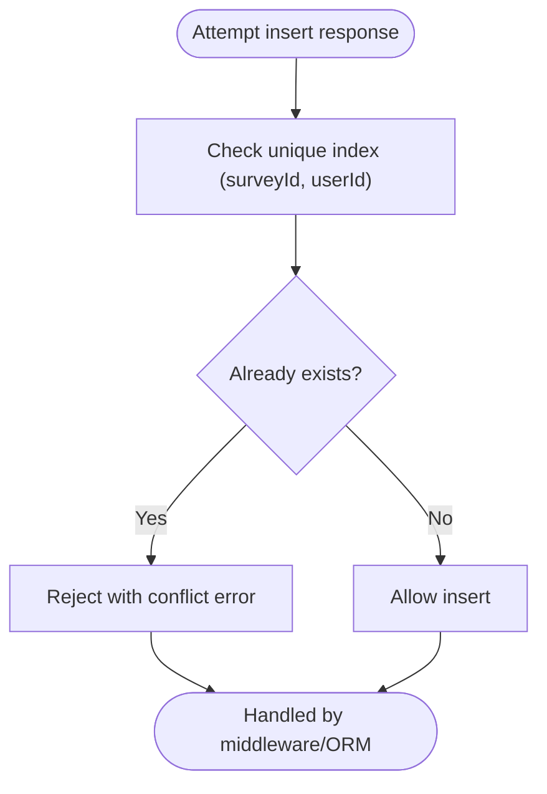
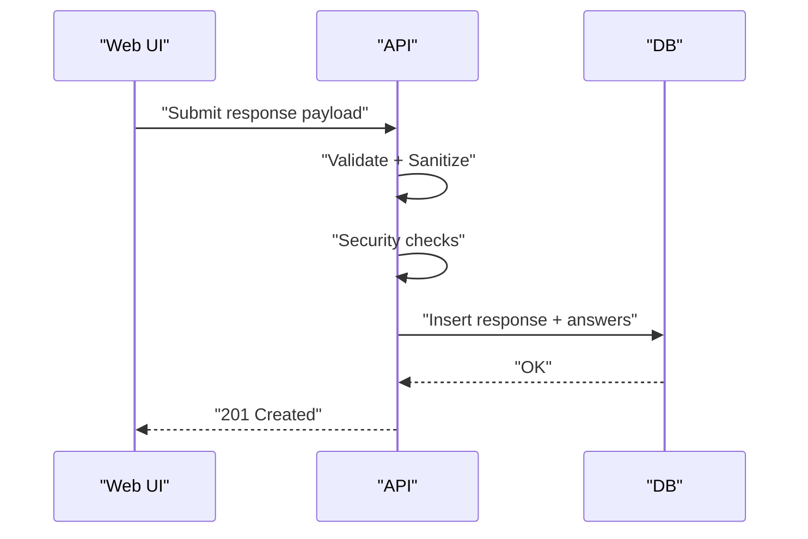
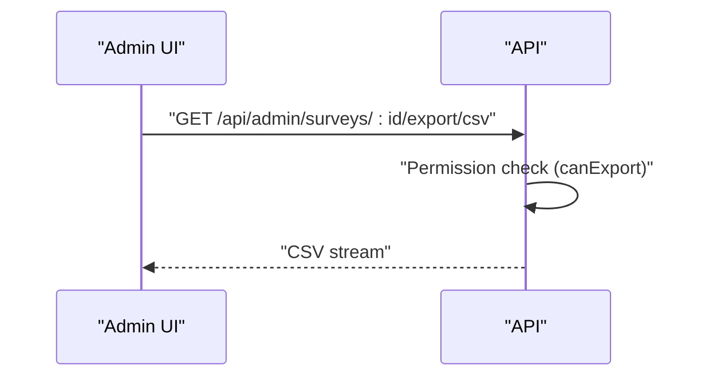
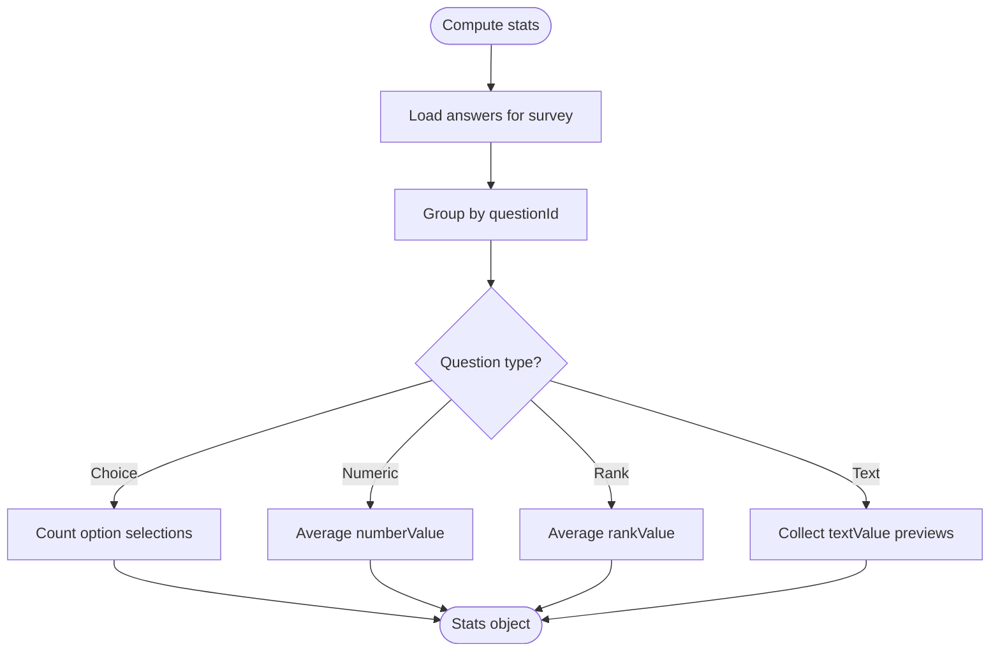
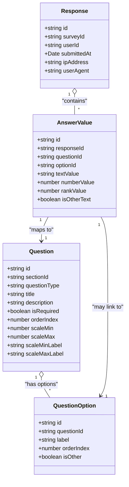
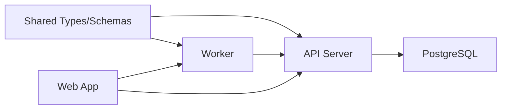

# Response Collection System

<cite>
**Referenced Files in This Document**
- [response.schema.ts](file://packages/shared/src/schemas/response.schema.ts)
- [response.ts](file://packages/shared/src/types/response.ts)
- [question.schema.ts](file://packages/shared/src/schemas/question.schema.ts)
- [question.ts](file://packages/shared/src/types/question.ts)
- [survey.schema.ts](file://packages/shared/src/schemas/survey.schema.ts)
- [survey.ts](file://packages/shared/src/types/survey.ts)
- [schema.ts](file://apps/api/src/db/schema.ts)
- [db/index.ts](file://apps/api/src/db/index.ts)
- [index.ts](file://apps/api/src/index.ts)
- [index.ts](file://apps/worker/src/index.ts)
- [api.ts](file://apps/web/src/lib/api.ts)
- [security.ts](file://apps/api/src/middleware/security.ts)
- [rateLimit.ts](file://apps/api/src/middleware/rateLimit.ts)
- [validate.ts](file://apps/api/src/middleware/validate.ts)
- [plan.md](file://plan.md)
</cite>

## Table of Contents
1. [Introduction](#introduction)
2. [Project Structure](#project-structure)
3. [Core Components](#core-components)
4. [Architecture Overview](#architecture-overview)
5. [Detailed Component Analysis](#detailed-component-analysis)
6. [Dependency Analysis](#dependency-analysis)
7. [Performance Considerations](#performance-considerations)
8. [Troubleshooting Guide](#troubleshooting-guide)
9. [Conclusion](#conclusion)
10. [Appendices](#appendices)

## Introduction
This document describes the response collection system for submitting, validating, storing, and exporting survey responses. It explains the response data model, answer value handling, duplicate prevention, validation and sanitization, real-time tracking, CSV export, analytics, and the relationship between responses and survey questions. It also provides practical examples of submission flows, export operations, and performance considerations for high-volume scenarios.

## Project Structure
The response collection system spans shared types and schemas, the API server, a Cloudflare Worker proxy, and the web client. The shared package defines the canonical data models and validation schemas. The API server connects to PostgreSQL via Drizzle ORM and exposes endpoints for responses, statistics, and exports. The Worker acts as a Cloudflare front door that verifies Cloudflare Turnstile tokens and proxies requests to the API. The web app communicates with the backend via a typed API client.

**Diagram sources**
- [api.ts:1-60](file://apps/web/src/lib/api.ts#L1-L60)
- [index.ts:1-106](file://apps/worker/src/index.ts#L1-L106)
- [index.ts:1-67](file://apps/api/src/index.ts#L1-L67)
- [validate.ts:1-83](file://apps/api/src/middleware/validate.ts#L1-L83)
- [security.ts:1-55](file://apps/api/src/middleware/security.ts#L1-L55)
- [rateLimit.ts:42-70](file://apps/api/src/middleware/rateLimit.ts#L42-L70)
- [db/index.ts:1-9](file://apps/api/src/db/index.ts#L1-L9)
- [schema.ts:1-247](file://apps/api/src/db/schema.ts#L1-L247)
- [response.ts:1-53](file://packages/shared/src/types/response.ts#L1-L53)
- [response.schema.ts:1-24](file://packages/shared/src/schemas/response.schema.ts#L1-L24)
- [question.ts:1-66](file://packages/shared/src/types/question.ts#L1-L66)
- [question.schema.ts:1-65](file://packages/shared/src/schemas/question.schema.ts#L1-L65)
- [survey.ts:1-50](file://packages/shared/src/types/survey.ts#L1-L50)
- [survey.schema.ts:1-22](file://packages/shared/src/schemas/survey.schema.ts#L1-L22)

**Section sources**
- [api.ts:1-60](file://apps/web/src/lib/api.ts#L1-L60)
- [index.ts:1-106](file://apps/worker/src/index.ts#L1-L106)
- [index.ts:1-67](file://apps/api/src/index.ts#L1-L67)
- [validate.ts:1-83](file://apps/api/src/middleware/validate.ts#L1-L83)
- [security.ts:1-55](file://apps/api/src/middleware/security.ts#L1-L55)
- [rateLimit.ts:42-70](file://apps/api/src/middleware/rateLimit.ts#L42-L70)
- [db/index.ts:1-9](file://apps/api/src/db/index.ts#L1-L9)
- [schema.ts:1-247](file://apps/api/src/db/schema.ts#L1-L247)
- [response.ts:1-53](file://packages/shared/src/types/response.ts#L1-L53)
- [response.schema.ts:1-24](file://packages/shared/src/schemas/response.schema.ts#L1-L24)
- [question.ts:1-66](file://packages/shared/src/types/question.ts#L1-L66)
- [question.schema.ts:1-65](file://packages/shared/src/schemas/question.schema.ts#L1-L65)
- [survey.ts:1-50](file://packages/shared/src/types/survey.ts#L1-L50)
- [survey.schema.ts:1-22](file://packages/shared/src/schemas/survey.schema.ts#L1-L22)

## Core Components
- Response data model: A response belongs to a survey and a user, with metadata such as submission time, IP address, and user agent. Answers are stored separately with polymorphic value fields supporting text, number, and rank values, plus optional linked option identifiers.
- Answer value handling: Each answer maps to a question and may include one or more of textValue, numberValue, rankValue, and/or optionId. A flag indicates whether the text was supplied as an "other" option.
- Duplicate prevention: Responses are uniquely constrained per survey-user pair, preventing multiple submissions per user per survey.
- Validation and sanitization: Request bodies are validated against Zod schemas; string inputs are sanitized to remove HTML and control characters; additional bot checks include Turnstile verification, a minimum form-open-to-submit delay, and a honeypot field.
- Real-time tracking: Submission metadata (IP, user agent) is captured; analytics include counts and previews aggregated per question.
- CSV export: Admin endpoints support exporting response datasets as CSV.
- Analytics: Aggregated stats include response counts, option distributions, averages for numeric scales, and text previews.

**Section sources**
- [response.ts:1-53](file://packages/shared/src/types/response.ts#L1-L53)
- [response.schema.ts:1-24](file://packages/shared/src/schemas/response.schema.ts#L1-L24)
- [schema.ts:173-222](file://apps/api/src/db/schema.ts#L173-L222)
- [validate.ts:1-83](file://apps/api/src/middleware/validate.ts#L1-L83)
- [security.ts:1-55](file://apps/api/src/middleware/security.ts#L1-L55)
- [index.ts:42-79](file://apps/worker/src/index.ts#L42-L79)
- [plan.md:479-514](file://plan.md#L479-L514)

## Architecture Overview
The submission pipeline begins at the web client, which posts to the Worker. The Worker verifies Cloudflare Turnstile and proxies to the API. The API applies validation, security, and rate-limiting middleware, persists the response and answers to the database, and returns a success response. Admins can retrieve responses, compute stats, and export CSV.

**Diagram sources**
- [index.ts:42-79](file://apps/worker/src/index.ts#L42-L79)
- [index.ts:25-37](file://apps/api/src/index.ts#L25-L37)
- [validate.ts:7-28](file://apps/api/src/middleware/validate.ts#L7-L28)
- [security.ts:7-30](file://apps/api/src/middleware/security.ts#L7-L30)
- [rateLimit.ts:42-70](file://apps/api/src/middleware/rateLimit.ts#L42-L70)
- [schema.ts:173-222](file://apps/api/src/db/schema.ts#L173-L222)

## Detailed Component Analysis

### Response Data Model and Answer Values
The response entity captures survey participation with per-user uniqueness. Answer values are normalized to support multiple question types while maintaining referential integrity to questions and options.

**Diagram sources**
- [schema.ts:57-69](file://apps/api/src/db/schema.ts#L57-L69)
- [schema.ts:173-196](file://apps/api/src/db/schema.ts#L173-L196)
- [schema.ts:202-222](file://apps/api/src/db/schema.ts#L202-L222)

**Section sources**
- [response.ts:1-23](file://packages/shared/src/types/response.ts#L1-L23)
- [schema.ts:173-222](file://apps/api/src/db/schema.ts#L173-L222)

### Validation and Sanitization
Submission payloads are validated using Zod schemas that enforce:
- Turnstile token presence
- Non-empty answers array with a maximum size
- Optional honeypot field must remain empty
- Optional timing field indicating minimum submission delay

Sanitization strips HTML tags and control characters from strings and recursively sanitizes nested objects.

**Diagram sources**
- [validate.ts:7-28](file://apps/api/src/middleware/validate.ts#L7-L28)
- [validate.ts:54-83](file://apps/api/src/middleware/validate.ts#L54-L83)
- [security.ts:7-30](file://apps/api/src/middleware/security.ts#L7-L30)
- [rateLimit.ts:42-70](file://apps/api/src/middleware/rateLimit.ts#L42-L70)
- [response.schema.ts:12-20](file://packages/shared/src/schemas/response.schema.ts#L12-L20)

**Section sources**
- [response.schema.ts:1-24](file://packages/shared/src/schemas/response.schema.ts#L1-L24)
- [validate.ts:1-83](file://apps/api/src/middleware/validate.ts#L1-L83)
- [security.ts:1-55](file://apps/api/src/middleware/security.ts#L1-L55)
- [rateLimit.ts:42-70](file://apps/api/src/middleware/rateLimit.ts#L42-L70)

### Duplicate Prevention Mechanism
A unique index on (surveyId, userId) prevents multiple responses per user per survey, ensuring one-response-per-survey-user policy.

**Diagram sources**
- [schema.ts:188-195](file://apps/api/src/db/schema.ts#L188-L195)

**Section sources**
- [schema.ts:188-195](file://apps/api/src/db/schema.ts#L188-L195)

### Response Submission Workflow
End-to-end submission flow:
- Web app constructs payload with turnstileToken and answers.
- Worker verifies Turnstile and forwards to API.
- API validates, sanitizes, applies security and rate limits.
- API inserts response and answer values atomically.
- Success response returned to client.

**Diagram sources**
- [api.ts:32-60](file://apps/web/src/lib/api.ts#L32-L60)
- [index.ts:25-37](file://apps/api/src/index.ts#L25-L37)
- [validate.ts:7-28](file://apps/api/src/middleware/validate.ts#L7-L28)
- [security.ts:7-30](file://apps/api/src/middleware/security.ts#L7-L30)
- [schema.ts:173-222](file://apps/api/src/db/schema.ts#L173-L222)

**Section sources**
- [api.ts:1-60](file://apps/web/src/lib/api.ts#L1-L60)
- [index.ts:1-67](file://apps/api/src/index.ts#L1-L67)
- [validate.ts:1-83](file://apps/api/src/middleware/validate.ts#L1-L83)
- [security.ts:1-55](file://apps/api/src/middleware/security.ts#L1-L55)
- [schema.ts:173-222](file://apps/api/src/db/schema.ts#L173-L222)

### CSV Export Functionality
Admins can export responses for a survey as CSV via a dedicated endpoint. Access is governed by granular permissions defined in the assignment model.

**Diagram sources**
- [plan.md](file://plan.md#L505)
- [survey.ts:37-49](file://packages/shared/src/types/survey.ts#L37-L49)

**Section sources**
- [plan.md:479-514](file://plan.md#L479-L514)
- [survey.ts:37-49](file://packages/shared/src/types/survey.ts#L37-L49)

### Analytics and Data Aggregation
Aggregated statistics include:
- Total responses
- Per-question response counts
- Option distribution counts for choice questions
- Average numeric values for scales
- Text previews for open-ended questions

These are computed from stored answer values and question metadata.

**Diagram sources**
- [response.ts:39-52](file://packages/shared/src/types/response.ts#L39-L52)
- [schema.ts:202-222](file://apps/api/src/db/schema.ts#L202-L222)
- [question.ts:30-51](file://packages/shared/src/types/question.ts#L30-L51)

**Section sources**
- [response.ts:39-52](file://packages/shared/src/types/response.ts#L39-L52)
- [schema.ts:202-222](file://apps/api/src/db/schema.ts#L202-L222)
- [question.ts:30-51](file://packages/shared/src/types/question.ts#L30-L51)

### Relationship Between Responses and Survey Questions
Each answer references a question and optionally an option. Required questions and option constraints are enforced at creation time. The answer value schema supports multiple value types depending on question type.

**Diagram sources**
- [response.ts:1-23](file://packages/shared/src/types/response.ts#L1-L23)
- [question.ts:30-51](file://packages/shared/src/types/question.ts#L30-L51)
- [schema.ts:126-147](file://apps/api/src/db/schema.ts#L126-L147)
- [schema.ts:153-167](file://apps/api/src/db/schema.ts#L153-L167)
- [schema.ts:202-222](file://apps/api/src/db/schema.ts#L202-L222)

**Section sources**
- [response.ts:1-23](file://packages/shared/src/types/response.ts#L1-L23)
- [question.ts:30-51](file://packages/shared/src/types/question.ts#L30-L51)
- [question.schema.ts:18-35](file://packages/shared/src/schemas/question.schema.ts#L18-L35)
- [schema.ts:126-167](file://apps/api/src/db/schema.ts#L126-L167)
- [schema.ts:202-222](file://apps/api/src/db/schema.ts#L202-L222)

### Practical Examples

#### Example: Submitting a Response
- Payload includes a Turnstile token and an array of answers.
- Each answer specifies questionId and one or more value fields appropriate to the question type.
- Optional fields include formOpenedAt for timing checks and honeypot for bot detection.

**Section sources**
- [response.schema.ts:12-20](file://packages/shared/src/schemas/response.schema.ts#L12-L20)
- [response.ts:25-37](file://packages/shared/src/types/response.ts#L25-L37)

#### Example: Exporting Responses as CSV
- Admin requests CSV export for a specific survey.
- Backend streams CSV data derived from stored responses and answers.

**Section sources**
- [plan.md](file://plan.md#L505)

#### Example: Real-Time Tracking
- Submission records IP address and user agent.
- Analytics aggregates counts and previews for quick insights.

**Section sources**
- [schema.ts:173-196](file://apps/api/src/db/schema.ts#L173-L196)
- [response.ts:39-52](file://packages/shared/src/types/response.ts#L39-L52)

## Dependency Analysis
The system exhibits clear separation of concerns:
- Shared package defines types and schemas consumed by both API and Worker.
- API depends on Drizzle ORM and PostgreSQL for persistence.
- Worker depends on Cloudflare Turnstile for bot protection and proxies to API.
- Web app depends on a typed API client for all backend interactions.

**Diagram sources**
- [response.ts:1-53](file://packages/shared/src/types/response.ts#L1-L53)
- [question.ts:1-66](file://packages/shared/src/types/question.ts#L1-L66)
- [survey.ts:1-50](file://packages/shared/src/types/survey.ts#L1-L50)
- [response.schema.ts:1-24](file://packages/shared/src/schemas/response.schema.ts#L1-L24)
- [question.schema.ts:1-65](file://packages/shared/src/schemas/question.schema.ts#L1-L65)
- [survey.schema.ts:1-22](file://packages/shared/src/schemas/survey.schema.ts#L1-L22)
- [index.ts:1-67](file://apps/api/src/index.ts#L1-L67)
- [index.ts:1-106](file://apps/worker/src/index.ts#L1-L106)
- [db/index.ts:1-9](file://apps/api/src/db/index.ts#L1-L9)
- [api.ts:1-60](file://apps/web/src/lib/api.ts#L1-L60)

**Section sources**
- [response.ts:1-53](file://packages/shared/src/types/response.ts#L1-L53)
- [question.ts:1-66](file://packages/shared/src/types/question.ts#L1-L66)
- [survey.ts:1-50](file://packages/shared/src/types/survey.ts#L1-L50)
- [response.schema.ts:1-24](file://packages/shared/src/schemas/response.schema.ts#L1-L24)
- [question.schema.ts:1-65](file://packages/shared/src/schemas/question.schema.ts#L1-L65)
- [survey.schema.ts:1-22](file://packages/shared/src/schemas/survey.schema.ts#L1-L22)
- [index.ts:1-67](file://apps/api/src/index.ts#L1-L67)
- [index.ts:1-106](file://apps/worker/src/index.ts#L1-L106)
- [db/index.ts:1-9](file://apps/api/src/db/index.ts#L1-L9)
- [api.ts:1-60](file://apps/web/src/lib/api.ts#L1-L60)

## Performance Considerations
- Database constraints: Unique index on (surveyId, userId) prevents duplicates and supports efficient lookup.
- Request limits: Body size cap and timeouts prevent resource exhaustion.
- Rate limiting: Separate limits for general API traffic and submissions reduce abuse.
- Validation early exit: Zod validation and sanitization occur before heavy processing.
- Streaming exports: CSV generation should stream large datasets to avoid memory pressure.
- Indexes: Existing indexes on foreign keys and composite unique keys optimize reads and writes.

[No sources needed since this section provides general guidance]

## Troubleshooting Guide
Common issues and remedies:
- Validation errors: Inspect field-specific messages returned by the validation middleware.
- Security failures: Turnstile verification failures, missing tokens, or invalid requests trigger explicit errors.
- Too fast submission: Timing checks reject submissions below the minimum threshold.
- Honeypot detected: Requests with non-empty honeypot fields are rejected.
- Rate limit exceeded: Excessive submissions or requests receive throttled responses with reset headers.
- Database conflicts: Duplicate submissions raise constraint violations; handle gracefully in API handlers.

**Section sources**
- [validate.ts:13-26](file://apps/api/src/middleware/validate.ts#L13-L26)
- [index.ts:53-76](file://apps/worker/src/index.ts#L53-L76)
- [security.ts:17-24](file://apps/api/src/middleware/security.ts#L17-L24)
- [security.ts:45-47](file://apps/api/src/middleware/security.ts#L45-L47)
- [rateLimit.ts:42-52](file://apps/api/src/middleware/rateLimit.ts#L42-L52)
- [schema.ts:188-195](file://apps/api/src/db/schema.ts#L188-L195)

## Conclusion
The response collection system integrates robust validation, sanitization, and security measures with a clear data model and analytics pipeline. The Worker provides Turnstile verification and request proxying, while the API ensures data integrity and performance through middleware and database constraints. Admins can export and analyze responses efficiently, and the design supports high-volume scenarios with streaming and indexing strategies.

## Appendices

### Endpoint Reference (Admin)
- GET /api/admin/surveys/:id/responses
- GET /api/admin/surveys/:id/stats
- GET /api/admin/surveys/:id/export/csv

**Section sources**
- [plan.md:479-514](file://plan.md#L479-L514)