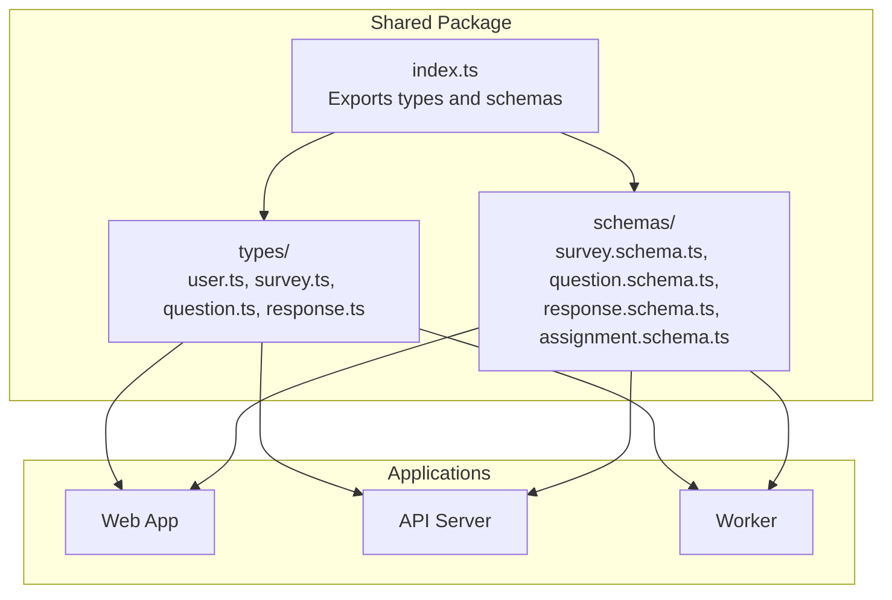
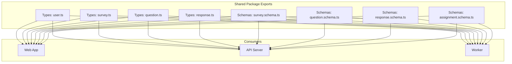
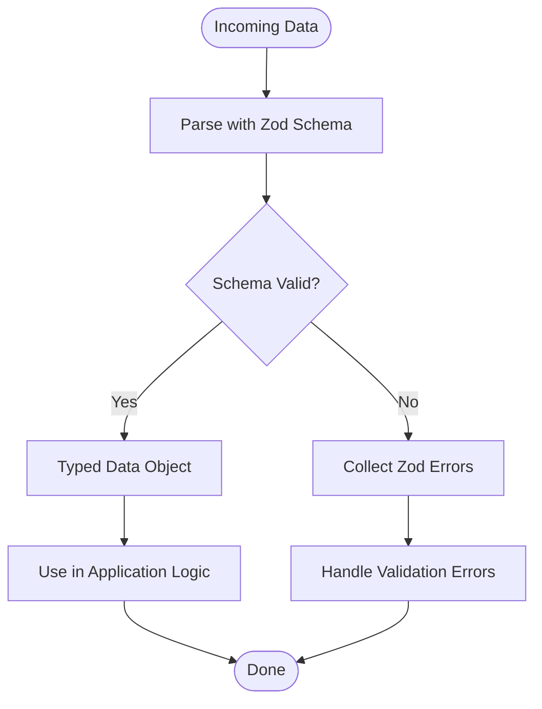
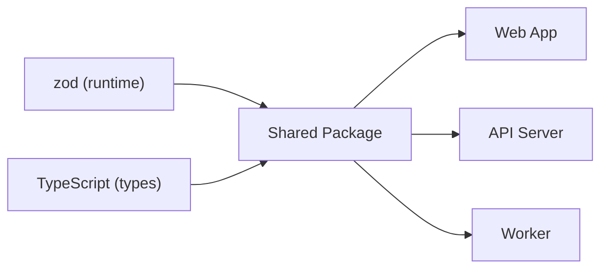

# Shared Package (Types and Schemas)

<cite>
**Referenced Files in This Document**
- [index.ts](file://packages/shared/src/index.ts)
- [package.json](file://packages/shared/package.json)
- [tsconfig.json](file://packages/shared/tsconfig.json)
- [survey.schema.ts](file://packages/shared/src/schemas/survey.schema.ts)
- [question.schema.ts](file://packages/shared/src/schemas/question.schema.ts)
- [response.schema.ts](file://packages/shared/src/schemas/response.schema.ts)
- [assignment.schema.ts](file://packages/shared/src/schemas/assignment.schema.ts)
- [user.ts](file://packages/shared/src/types/user.ts)
- [survey.ts](file://packages/shared/src/types/survey.ts)
- [question.ts](file://packages/shared/src/types/question.ts)
- [response.ts](file://packages/shared/src/types/response.ts)
</cite>

## Table of Contents
1. [Introduction](#introduction)
2. [Project Structure](#project-structure)
3. [Core Components](#core-components)
4. [Architecture Overview](#architecture-overview)
5. [Detailed Component Analysis](#detailed-component-analysis)
6. [Dependency Analysis](#dependency-analysis)
7. [Performance Considerations](#performance-considerations)
8. [Troubleshooting Guide](#troubleshooting-guide)
9. [Versioning and Migration Strategy](#versioning-and-migration-strategy)
10. [Conclusion](#conclusion)

## Introduction
This document describes the shared package responsible for TypeScript type definitions and Zod validation schemas used across the monorepo. It explains the shared types for questions, responses, surveys, and user roles, documents the Zod schemas for data integrity and API validation, and outlines import patterns, type safety benefits, and cross-application integration strategies. It also covers versioning, backward compatibility, and migration approaches to maintain consistency across applications.

## Project Structure
The shared package exports:
- TypeScript types for user, survey, question, and response models
- Zod schemas for survey, question, response, and assignment validation

**Diagram sources**
- [index.ts:1-10](file://packages/shared/src/index.ts#L1-L10)

**Section sources**
- [index.ts:1-10](file://packages/shared/src/index.ts#L1-L10)
- [package.json:1-18](file://packages/shared/package.json#L1-L18)
- [tsconfig.json:1-9](file://packages/shared/tsconfig.json#L1-L9)

## Core Components
- Types: user, survey, question, response define the canonical data models used across applications.
- Schemas: survey, question, response, and assignment define Zod validation rules ensuring data integrity for forms, API requests, and persistence.

Key export surface:
- index.ts re-exports all types and schemas for convenient imports across the monorepo.

**Section sources**
- [index.ts:1-10](file://packages/shared/src/index.ts#L1-L10)

## Architecture Overview
The shared package acts as a single source of truth for typed models and validation logic. Applications import types and schemas from the shared package to ensure consistent behavior and reduce duplication.

**Diagram sources**
- [index.ts:1-10](file://packages/shared/src/index.ts#L1-L10)

## Detailed Component Analysis

### Type Definitions
The shared package defines canonical TypeScript types for domain entities. These types are imported by applications to maintain consistent typing across the monorepo.

- User model: Defines identity and role-related attributes used across applications.
- Survey model: Describes survey metadata and structure.
- Question model: Encapsulates question content, type, and options.
- Response model: Represents a single response submission.

These types enable strong typing for state management, API clients, and database models.

**Section sources**
- [user.ts](file://packages/shared/src/types/user.ts)
- [survey.ts](file://packages/shared/src/types/survey.ts)
- [question.ts](file://packages/shared/src/types/question.ts)
- [response.ts](file://packages/shared/src/types/response.ts)

### Zod Validation Schemas
Zod schemas provide runtime validation for data integrity and API contracts. They are exported from the shared package for use in applications.

- Survey schema: Validates survey creation/update payloads and persisted records.
- Question schema: Validates question definitions and submissions.
- Response schema: Validates response payloads and ensures correctness against the question type.
- Assignment schema: Validates assignment-related data (e.g., linking users to surveys).

Validation benefits:
- Centralized validation rules
- Consistent error messages across applications
- Strong guarantees for API boundaries and form submissions

**Diagram sources**
- [survey.schema.ts](file://packages/shared/src/schemas/survey.schema.ts)
- [question.schema.ts](file://packages/shared/src/schemas/question.schema.ts)
- [response.schema.ts](file://packages/shared/src/schemas/response.schema.ts)
- [assignment.schema.ts](file://packages/shared/src/schemas/assignment.schema.ts)

**Section sources**
- [survey.schema.ts](file://packages/shared/src/schemas/survey.schema.ts)
- [question.schema.ts](file://packages/shared/src/schemas/question.schema.ts)
- [response.schema.ts](file://packages/shared/src/schemas/response.schema.ts)
- [assignment.schema.ts](file://packages/shared/src/schemas/assignment.schema.ts)

### Import Patterns and Type Safety Benefits
Applications import types and schemas from the shared package to:
- Ensure consistent typing across web, API, and worker applications
- Share validation logic for forms, API routes, and background jobs
- Reduce duplication and improve maintainability

Recommended import patterns:
- Import types for model definitions and state interfaces
- Import schemas for request/response validation and form validation
- Prefer named imports for specific types/schemas to minimize bundle size

Type safety benefits:
- Compile-time detection of type mismatches
- Clear contract definitions for APIs and internal modules
- Improved refactoring confidence across the monorepo

**Section sources**
- [index.ts:1-10](file://packages/shared/src/index.ts#L1-L10)

### Cross-Application Integration Examples
Common integration scenarios:
- Web app form validation: Use question and response schemas to validate user input before submission.
- API server request validation: Apply survey and assignment schemas to incoming requests.
- Worker job processing: Validate persisted survey and response data using shared schemas.

These integrations ensure that all applications operate on the same validated data model, reducing bugs and inconsistencies.

**Section sources**
- [survey.schema.ts](file://packages/shared/src/schemas/survey.schema.ts)
- [question.schema.ts](file://packages/shared/src/schemas/question.schema.ts)
- [response.schema.ts](file://packages/shared/src/schemas/response.schema.ts)
- [assignment.schema.ts](file://packages/shared/src/schemas/assignment.schema.ts)

## Dependency Analysis
The shared package depends on Zod for validation and TypeScript for type definitions. It is consumed by the web, API, and worker applications.

**Diagram sources**
- [package.json:11-13](file://packages/shared/package.json#L11-L13)

**Section sources**
- [package.json:11-13](file://packages/shared/package.json#L11-L13)

## Performance Considerations
- Keep schemas lean: Avoid overly complex validations that could slow down request processing.
- Reuse schemas across applications: Centralizing schemas reduces duplication and improves consistency.
- Use selective imports: Import only the needed types/schemas to minimize bundle sizes.
- Leverage compile-time checks: Rely on TypeScript to catch errors early, reducing runtime overhead.

## Troubleshooting Guide
Common issues and resolutions:
- Type mismatch errors: Ensure all applications import types from the shared package to align models.
- Validation failures: Inspect schema definitions and adjust payloads to match expected shapes.
- Build errors: Verify TypeScript configuration extends the base config and includes the src directory.

**Section sources**
- [tsconfig.json:1-9](file://packages/shared/tsconfig.json#L1-L9)

## Versioning and Migration Strategy
Versioning:
- The package is currently at version 0.1.0. Treat it as pre-1.0.0 and expect breaking changes between minor releases.
- Increment major version when introducing incompatible changes to types or schemas.

Backward compatibility:
- Avoid removing or renaming fields in types and schemas.
- Add optional fields with defaults when extending models.
- Provide migration scripts for persistent data when schemas change.

Migration strategies:
- Gradual rollout: Introduce new schemas alongside old ones during a transition period.
- Dual validation: Accept both old and new formats temporarily while updating consumers.
- Automated migrations: Write scripts to transform persisted data according to new schema rules.

**Section sources**
- [package.json:3](file://packages/shared/package.json#L3)

## Conclusion
The shared package centralizes type definitions and Zod validation schemas, enabling consistent, type-safe, and maintainable development across the monorepo. By importing from the shared package, applications benefit from unified contracts, reduced duplication, and improved reliability. Adopting careful versioning and migration practices will help preserve backward compatibility and ease transitions as the system evolves.