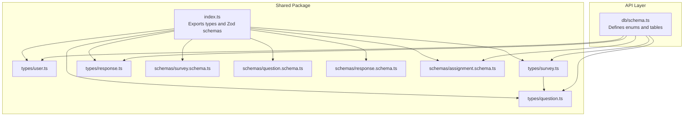
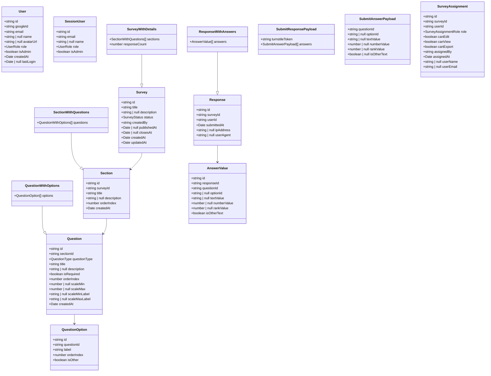
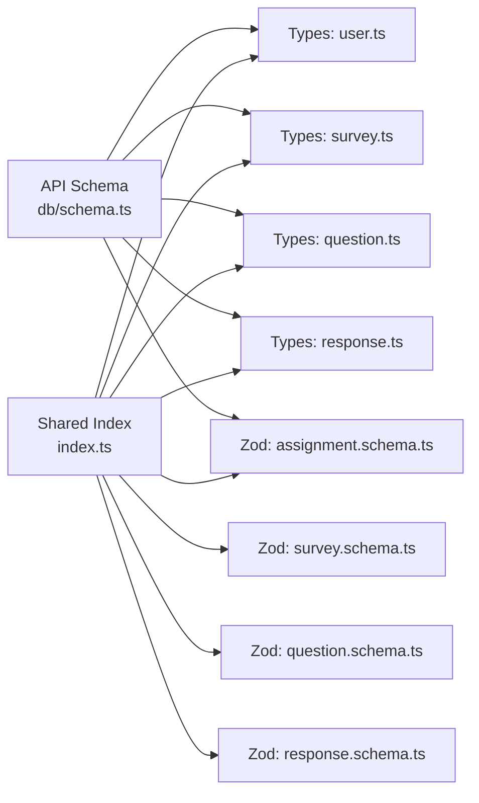

# TypeScript Types

<cite>
**Referenced Files in This Document**
- [user.ts](file://packages/shared/src/types/user.ts)
- [survey.ts](file://packages/shared/src/types/survey.ts)
- [question.ts](file://packages/shared/src/types/question.ts)
- [response.ts](file://packages/shared/src/types/response.ts)
- [survey.schema.ts](file://packages/shared/src/schemas/survey.schema.ts)
- [question.schema.ts](file://packages/shared/src/schemas/question.schema.ts)
- [response.schema.ts](file://packages/shared/src/schemas/response.schema.ts)
- [assignment.schema.ts](file://packages/shared/src/schemas/assignment.schema.ts)
- [index.ts](file://packages/shared/src/index.ts)
- [schema.ts](file://apps/api/src/db/schema.ts)
</cite>

## Table of Contents
1. [Introduction](#introduction)
2. [Project Structure](#project-structure)
3. [Core Components](#core-components)
4. [Architecture Overview](#architecture-overview)
5. [Detailed Component Analysis](#detailed-component-analysis)
6. [Dependency Analysis](#dependency-analysis)
7. [Performance Considerations](#performance-considerations)
8. [Troubleshooting Guide](#troubleshooting-guide)
9. [Conclusion](#conclusion)
10. [Appendices](#appendices)

## Introduction
This document provides a comprehensive guide to the TypeScript type definitions used across the application’s shared package and API database schema. It focuses on:
- User roles and permissions
- Survey structures and metadata
- Question types and configurations
- Response models and submission payloads
- Type safety, compile-time validation, and runtime patterns
- Practical usage examples in frontend and backend contexts
- Guidance for extending types while maintaining compatibility

## Project Structure
The shared types and Zod schemas are organized under a single shared package and re-exported via a central index. The API layer defines database enums and tables that align with the shared types.

**Diagram sources**
- [index.ts:1-10](file://packages/shared/src/index.ts#L1-L10)
- [user.ts:1-22](file://packages/shared/src/types/user.ts#L1-L22)
- [survey.ts:1-50](file://packages/shared/src/types/survey.ts#L1-L50)
- [question.ts:1-66](file://packages/shared/src/types/question.ts#L1-L66)
- [response.ts:1-53](file://packages/shared/src/types/response.ts#L1-L53)
- [survey.schema.ts:1-22](file://packages/shared/src/schemas/survey.schema.ts#L1-L22)
- [question.schema.ts:1-65](file://packages/shared/src/schemas/question.schema.ts#L1-L65)
- [response.schema.ts:1-24](file://packages/shared/src/schemas/response.schema.ts#L1-L24)
- [assignment.schema.ts:1-20](file://packages/shared/src/schemas/assignment.schema.ts#L1-L20)
- [schema.ts:1-247](file://apps/api/src/db/schema.ts#L1-L247)

**Section sources**
- [index.ts:1-10](file://packages/shared/src/index.ts#L1-L10)
- [schema.ts:1-247](file://apps/api/src/db/schema.ts#L1-L247)

## Core Components
This section summarizes the primary type categories and their relationships.

- User roles and permissions
  - Role union type and user entity with computed flags
  - Session user representation for frontend consumption
- Survey lifecycle and access control
  - Status union type and survey metadata
  - Sections and questions composition
  - Assignment roles and permissions
- Question model and variants
  - Question type union and labels
  - Options and matrix row/column structures
- Response and submission payloads
  - Response entity and answer values
  - Submission payload and statistics

**Section sources**
- [user.ts:1-22](file://packages/shared/src/types/user.ts#L1-L22)
- [survey.ts:1-50](file://packages/shared/src/types/survey.ts#L1-L50)
- [question.ts:1-66](file://packages/shared/src/types/question.ts#L1-L66)
- [response.ts:1-53](file://packages/shared/src/types/response.ts#L1-L53)

## Architecture Overview
The type system is designed around a shared contract between frontend and backend. The API layer enforces database-level enums and constraints that mirror the shared types, ensuring strong alignment.

**Diagram sources**
- [user.ts:1-22](file://packages/shared/src/types/user.ts#L1-L22)
- [survey.ts:1-50](file://packages/shared/src/types/survey.ts#L1-L50)
- [question.ts:1-66](file://packages/shared/src/types/question.ts#L1-L66)
- [response.ts:1-53](file://packages/shared/src/types/response.ts#L1-L53)

## Detailed Component Analysis

### User Roles and Permissions
- Role union type
  - Values: admin, editor, viewer, user
- User entity
  - Fields include identifiers, profile data, role, computed admin flag, timestamps
  - Optional fields: name, avatarUrl, lastLogin
- Session user
  - Subset of user fields suitable for client-side session representation
- Backend alignment
  - Database enum mirrors the role union

Practical usage examples:
- Frontend: Use SessionUser to render UI based on role and admin flag.
- Backend: Enforce role checks against database enum values when authorizing actions.

**Section sources**
- [user.ts:1-22](file://packages/shared/src/types/user.ts#L1-L22)
- [schema.ts:19-20](file://apps/api/src/db/schema.ts#L19-L20)

### Survey Structures and Metadata
- Status union type
  - Values: draft, published, closed
- Survey entity
  - Identifiers, title, description, status, creator, publication and closure timestamps, creation/update timestamps
  - Optional fields: description, publishedAt, closesAt
- SurveyWithDetails
  - Extends Survey with composed sections and response count
- Section and SectionWithQuestions
  - Section: identifiers, survey linkage, title/description, ordering, timestamps
  - SectionWithQuestions: adds questions collection typed as QuestionWithOptions
- Assignment roles and permissions
  - Role union: editor, viewer
  - Assignment: identifiers, user and survey linkage, role, granular permissions, assigner and timestamp, optional user name/email

Practical usage examples:
- Frontend: Render survey preview with sections and question counts; show edit/view/export controls based on assignment flags.
- Backend: Validate status transitions and enforce assignment permissions before mutating resources.

**Section sources**
- [survey.ts:1-50](file://packages/shared/src/types/survey.ts#L1-L50)
- [schema.ts:20-21](file://apps/api/src/db/schema.ts#L20-L21)
- [schema.ts:75-99](file://apps/api/src/db/schema.ts#L75-L99)

### Question Types and Configurations
- Question type union
  - Values: short_text, long_text, single_choice, multiple_choice, dropdown, linear_scale, rating, yes_no, date, number, ranking, matrix
- Labels mapping
  - Record keyed by QuestionType to localized labels
- Question entity
  - Identifiers, section linkage, type, title/description, required flag, ordering, optional scale bounds and labels, creation timestamp
- Options and matrix structures
  - QuestionOption: identifiers, question linkage, label, ordering, “other” flag
  - QuestionWithOptions: Question plus options array
  - Matrix row/column structures for matrix-type questions

Practical usage examples:
- Frontend: Render question UI based on questionType; handle options for choice/matrix/ranking; apply required and scale constraints.
- Backend: Validate questionType against the union and enforce option constraints.

**Section sources**
- [question.ts:1-66](file://packages/shared/src/types/question.ts#L1-L66)
- [schema.ts:22-35](file://apps/api/src/db/schema.ts#L22-L35)
- [question.schema.ts:3-16](file://packages/shared/src/schemas/question.schema.ts#L3-L16)

### Response Models and Submission Payloads
- Response entity
  - Identifiers, survey and user linkage, submission timestamp, optional IP and user agent
- AnswerValue
  - Identifiers, response and question linkage, optional option/text/number/rank values, “other text” flag
- ResponseWithAnswers
  - Response plus answers collection
- Submission payloads
  - SubmitResponsePayload: Turnstile token and answers array
  - SubmitAnswerPayload: questionId and one of optionId/textValue/numberValue/rankValue, optional “other text” flag
- Statistics
  - ResponseStats: total responses and per-question stats including option counts, averages, and text previews

Practical usage examples:
- Frontend: Build submission payload from user input; present statistics after submission.
- Backend: Validate submission payload using Zod schemas; persist answers and deduplicate per-survey-per-user.

**Section sources**
- [response.ts:1-53](file://packages/shared/src/types/response.ts#L1-L53)
- [schema.ts:173-222](file://apps/api/src/db/schema.ts#L173-L222)
- [response.schema.ts:1-24](file://packages/shared/src/schemas/response.schema.ts#L1-L24)

### Role-Based Access Control Types
- User role union and computed admin flag
- Survey assignment role union and permission flags
- Backend enforcement via database enums and constraints

Guidance:
- Extend roles or permissions by updating both the union/type and the database enum; keep flags consistent with role semantics.
- Use assignment permissions to gate UI actions and API endpoints.

**Section sources**
- [user.ts:1-22](file://packages/shared/src/types/user.ts#L1-L22)
- [survey.ts:35-49](file://packages/shared/src/types/survey.ts#L35-L49)
- [schema.ts:19-21](file://apps/api/src/db/schema.ts#L19-L21)
- [schema.ts:75-99](file://apps/api/src/db/schema.ts#L75-L99)

### Survey Status Enums
- Union type for lifecycle states
- Backend enum mirrors the union for database storage and validation

Guidance:
- Add new statuses carefully; ensure transitions are validated in business logic.
- Keep UI state machines aligned with the enum values.

**Section sources**
- [survey.ts](file://packages/shared/src/types/survey.ts#L3)
- [schema.ts](file://apps/api/src/db/schema.ts#L20)
- [survey.schema.ts:15-17](file://packages/shared/src/schemas/survey.schema.ts#L15-L17)

### Question Type Enumerations
- Union type for question kinds
- Labels mapping for rendering
- Backend enum ensures consistent storage and validation

Guidance:
- When adding new question types, update the union, labels, and backend enum; add corresponding UI and validation logic.
- Maintain parity between frontend labels and backend constraints.

**Section sources**
- [question.ts:1-28](file://packages/shared/src/types/question.ts#L1-L28)
- [schema.ts:22-35](file://apps/api/src/db/schema.ts#L22-L35)
- [question.schema.ts:3-16](file://packages/shared/src/schemas/question.schema.ts#L3-L16)

### Response Data Structures
- Response entity and answer values define the canonical shape for persisted submissions
- Statistics structures enable reporting and analytics

Guidance:
- Normalize answer values to leverage option/text/number/rank fields appropriately.
- Use statistics to power dashboards and exportable reports.

**Section sources**
- [response.ts:1-53](file://packages/shared/src/types/response.ts#L1-L53)
- [schema.ts:173-222](file://apps/api/src/db/schema.ts#L173-L222)

## Dependency Analysis
The shared types are re-exported centrally and consumed by both frontend and backend. The API database schema mirrors the shared types to ensure consistency.

**Diagram sources**
- [index.ts:1-10](file://packages/shared/src/index.ts#L1-L10)
- [schema.ts:1-247](file://apps/api/src/db/schema.ts#L1-L247)

**Section sources**
- [index.ts:1-10](file://packages/shared/src/index.ts#L1-L10)
- [schema.ts:1-247](file://apps/api/src/db/schema.ts#L1-L247)

## Performance Considerations
- Prefer union types for enums to enable exhaustive switch statements and reduce runtime branching errors.
- Use optional fields judiciously to minimize unnecessary allocations and simplify validation.
- Leverage Zod schemas for server-side validation to fail fast and reduce downstream processing overhead.
- Keep composed types (e.g., SurveyWithDetails) selective to avoid loading large datasets unnecessarily in frontend lists.

## Troubleshooting Guide
Common issues and resolutions:
- Type mismatch between frontend and backend
  - Ensure database enums match shared unions; update both sides when extending.
- Validation failures on submission
  - Verify Zod schemas align with payload shapes; confirm required fields and constraints.
- Missing optional fields causing runtime errors
  - Guard optional fields with null checks or defaults before rendering or processing.
- Permission denials
  - Confirm assignment flags and role semantics; log permission decisions for auditability.

**Section sources**
- [question.schema.ts:18-39](file://packages/shared/src/schemas/question.schema.ts#L18-L39)
- [response.schema.ts:12-20](file://packages/shared/src/schemas/response.schema.ts#L12-L20)
- [assignment.schema.ts:3-16](file://packages/shared/src/schemas/assignment.schema.ts#L3-L16)

## Conclusion
The shared type system provides a cohesive contract across frontend and backend, with database-level enums ensuring consistency. By adhering to union types, optional fields, and Zod validation, the system achieves strong type safety, compile-time checks, and predictable runtime behavior. Extending types should be done systematically, updating both frontend and backend definitions and database enums to preserve compatibility.

## Appendices

### Type Safety Benefits and Compile-Time Validation
- Union types prevent invalid values at compile time.
- Optional fields reduce implicit undefined handling errors.
- Zod schemas provide runtime validation and type inference for inputs and outputs.

### Runtime Type Checking Patterns
- Validate payloads before persistence or processing.
- Use defensive checks for optional fields and derived flags.
- Log and audit permission decisions for compliance.

### Extending Types While Maintaining Compatibility
- Add new members to unions and enums consistently across shared types, Zod schemas, and database enums.
- Introduce optional fields cautiously; provide defaults or guards.
- Update labels and UI logic to reflect new question types or roles.
- Keep assignment permissions and flags aligned with role semantics.