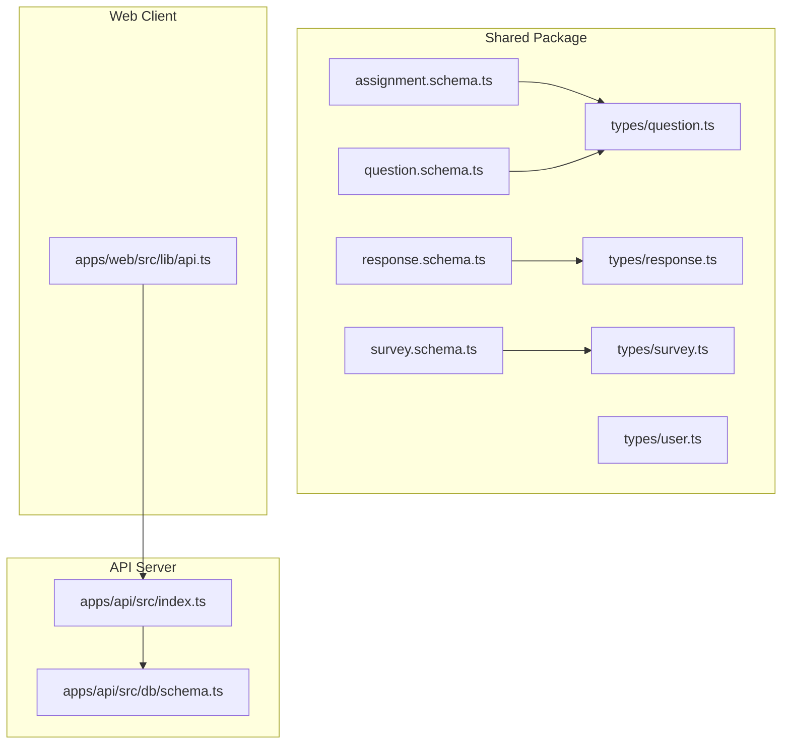
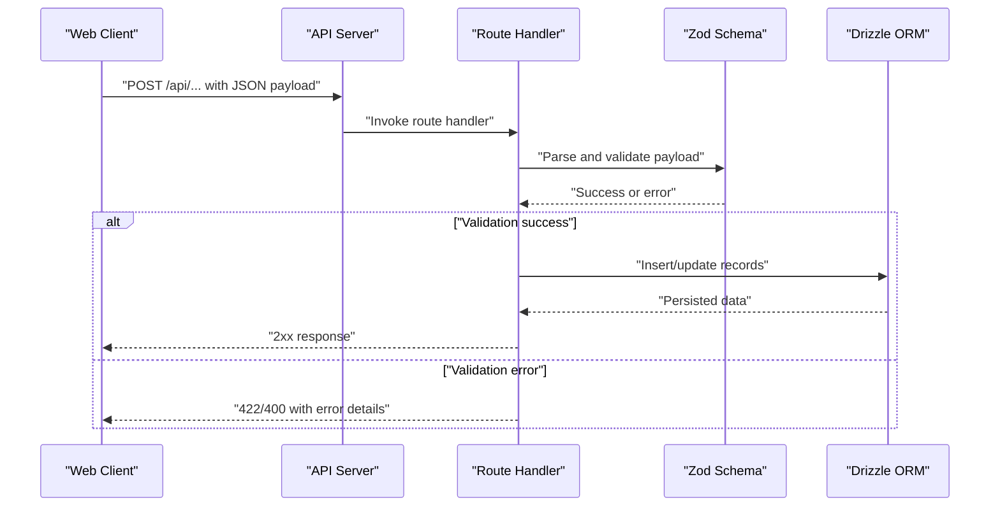
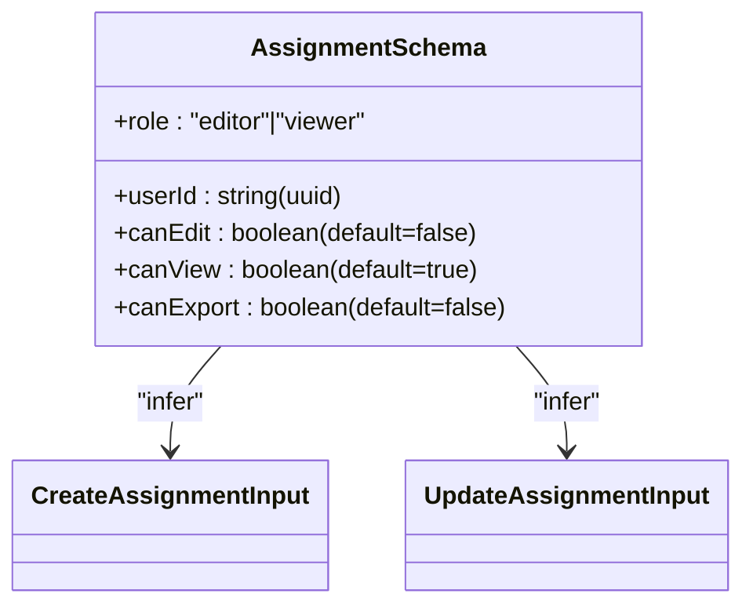
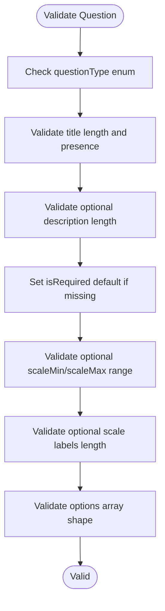
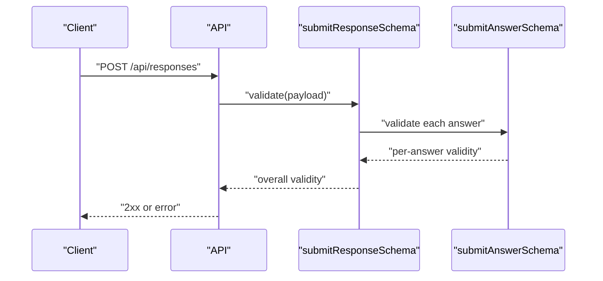
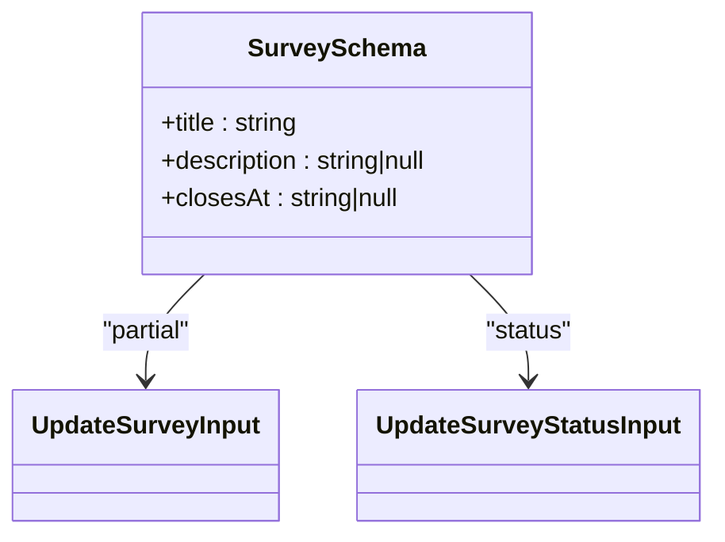
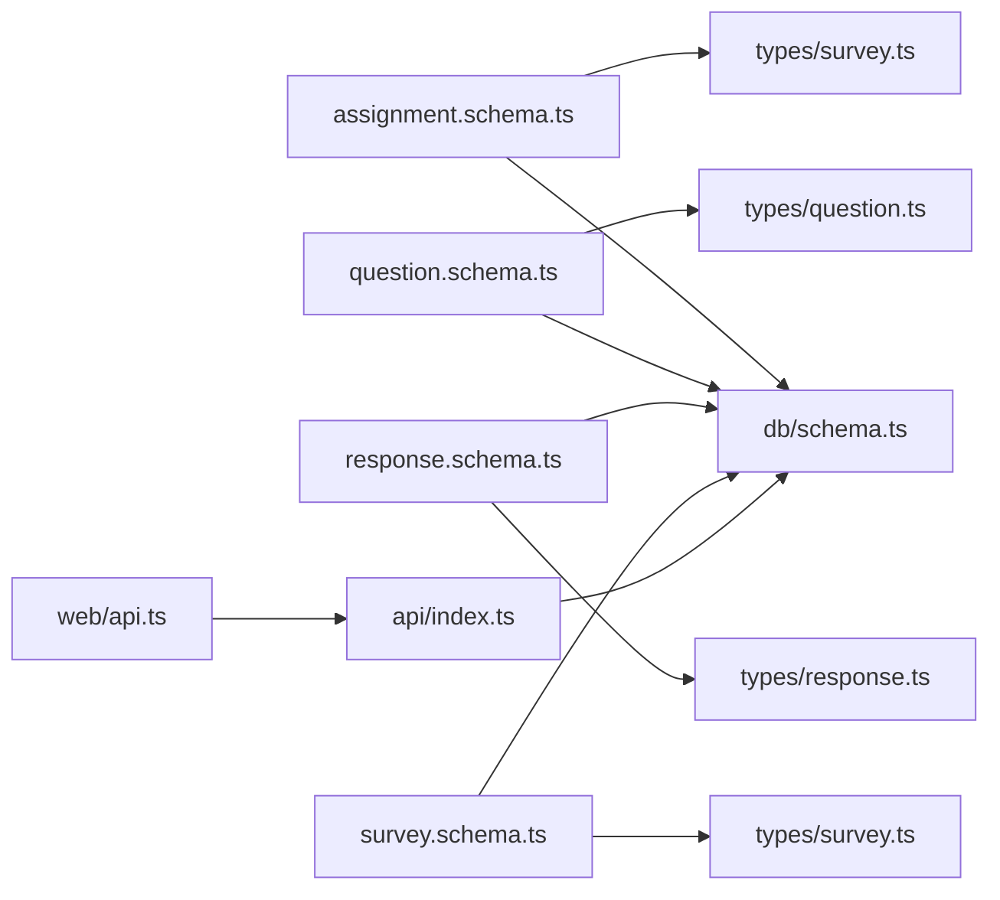

# Validation Schemas

<cite>
**Referenced Files in This Document**
- [assignment.schema.ts](file://packages/shared/src/schemas/assignment.schema.ts)
- [question.schema.ts](file://packages/shared/src/schemas/question.schema.ts)
- [response.schema.ts](file://packages/shared/src/schemas/response.schema.ts)
- [survey.schema.ts](file://packages/shared/src/schemas/survey.schema.ts)
- [question.ts](file://packages/shared/src/types/question.ts)
- [response.ts](file://packages/shared/src/types/response.ts)
- [survey.ts](file://packages/shared/src/types/survey.ts)
- [user.ts](file://packages/shared/src/types/user.ts)
- [schema.ts](file://apps/api/src/db/schema.ts)
- [index.ts](file://apps/api/src/index.ts)
- [api.ts](file://apps/web/src/lib/api.ts)
</cite>

## Table of Contents
1. [Introduction](#introduction)
2. [Project Structure](#project-structure)
3. [Core Components](#core-components)
4. [Architecture Overview](#architecture-overview)
5. [Detailed Component Analysis](#detailed-component-analysis)
6. [Dependency Analysis](#dependency-analysis)
7. [Performance Considerations](#performance-considerations)
8. [Troubleshooting Guide](#troubleshooting-guide)
9. [Conclusion](#conclusion)
10. [Appendices](#appendices)

## Introduction
This document provides comprehensive documentation for the Zod validation schemas used across the application for assignment permissions, question configurations, response validation, and survey structures. It explains each schema’s field validations, type constraints, defaults, and transformations; describes the validation pipeline from API requests to database persistence; and outlines composition patterns, conditional validation, and nested object validation. Practical usage examples are provided for form validation, API request validation, and data transformation. Guidance on error handling, custom validation messages, and schema evolution is included to support safe extension while maintaining backward compatibility.

## Project Structure
The validation logic is centralized in the shared package under schemas, with corresponding TypeScript types in the types folder. The API server defines middleware and global error handling, while the web client provides a generic API client used by frontend components.

**Diagram sources**
- [assignment.schema.ts:1-20](file://packages/shared/src/schemas/assignment.schema.ts#L1-L20)
- [question.schema.ts:1-65](file://packages/shared/src/schemas/question.schema.ts#L1-L65)
- [response.schema.ts:1-24](file://packages/shared/src/schemas/response.schema.ts#L1-L24)
- [survey.schema.ts:1-22](file://packages/shared/src/schemas/survey.schema.ts#L1-L22)
- [question.ts:1-66](file://packages/shared/src/types/question.ts#L1-L66)
- [response.ts:1-53](file://packages/shared/src/types/response.ts#L1-L53)
- [survey.ts:1-50](file://packages/shared/src/types/survey.ts#L1-L50)
- [user.ts:1-22](file://packages/shared/src/types/user.ts#L1-L22)
- [index.ts:1-67](file://apps/api/src/index.ts#L1-L67)
- [schema.ts:1-247](file://apps/api/src/db/schema.ts#L1-L247)
- [api.ts:1-60](file://apps/web/src/lib/api.ts#L1-L60)

**Section sources**
- [assignment.schema.ts:1-20](file://packages/shared/src/schemas/assignment.schema.ts#L1-L20)
- [question.schema.ts:1-65](file://packages/shared/src/schemas/question.schema.ts#L1-L65)
- [response.schema.ts:1-24](file://packages/shared/src/schemas/response.schema.ts#L1-L24)
- [survey.schema.ts:1-22](file://packages/shared/src/schemas/survey.schema.ts#L1-L22)
- [question.ts:1-66](file://packages/shared/src/types/question.ts#L1-L66)
- [response.ts:1-53](file://packages/shared/src/types/response.ts#L1-L53)
- [survey.ts:1-50](file://packages/shared/src/types/survey.ts#L1-L50)
- [user.ts:1-22](file://packages/shared/src/types/user.ts#L1-L22)
- [index.ts:1-67](file://apps/api/src/index.ts#L1-L67)
- [schema.ts:1-247](file://apps/api/src/db/schema.ts#L1-L247)
- [api.ts:1-60](file://apps/web/src/lib/api.ts#L1-L60)

## Core Components
This section summarizes each validation schema, highlighting field validations, defaults, and transformations.

- Assignment Permissions
  - createAssignmentSchema: Validates user assignment with role enum and permission booleans, including defaults for canEdit and canExport.
  - updateAssignmentSchema: Partial update schema allowing optional fields for role and permissions.
  - Types: CreateAssignmentInput, UpdateAssignmentInput.

- Question Configurations
  - createQuestionSchema: Validates question type, title, description, requirement flag, optional scale bounds and labels, and options array with label and isOther flag.
  - updateQuestionSchema: Partial schema extended with optional orderIndex.
  - reorderSchema: Validates batch reordering with arrays of id and orderIndex pairs.
  - createOptionSchema and updateOptionSchema: Validate option creation and updates with label and optional orderIndex.
  - Types: CreateQuestionInput, UpdateQuestionInput, ReorderInput, CreateOptionInput, UpdateOptionInput.

- Response Validation
  - submitAnswerSchema: Validates a single answer with questionId, optional optionId, textValue, numberValue, rankValue, and isOtherText flag.
  - submitResponseSchema: Validates a response submission payload with turnstileToken, answers array constrained by min/max, optional honeypot, and optional formOpenedAt.
  - Types: SubmitAnswerInput, SubmitResponseInput.

- Survey Structures
  - createSurveySchema: Validates title, optional description, and optional closesAt datetime.
  - updateSurveySchema: Allows partial updates to title, description, and nullable closesAt.
  - updateSurveyStatusSchema: Validates status transitions among draft, published, closed.
  - Types: CreateSurveyInput, UpdateSurveyInput, UpdateSurveyStatusInput.

**Section sources**
- [assignment.schema.ts:1-20](file://packages/shared/src/schemas/assignment.schema.ts#L1-L20)
- [question.schema.ts:1-65](file://packages/shared/src/schemas/question.schema.ts#L1-L65)
- [response.schema.ts:1-24](file://packages/shared/src/schemas/response.schema.ts#L1-L24)
- [survey.schema.ts:1-22](file://packages/shared/src/schemas/survey.schema.ts#L1-L22)

## Architecture Overview
The validation pipeline follows a consistent pattern:
- Frontend collects user input and sends it via the API client to the backend.
- The API server applies middleware and routes to handlers.
- Handlers use Zod schemas to parse and validate incoming requests.
- On success, validated data is transformed into domain types and persisted to the database using Drizzle ORM.
- On failure, errors are handled centrally with appropriate HTTP responses.

**Diagram sources**
- [api.ts:1-60](file://apps/web/src/lib/api.ts#L1-L60)
- [index.ts:1-67](file://apps/api/src/index.ts#L1-L67)
- [schema.ts:1-247](file://apps/api/src/db/schema.ts#L1-L247)

## Detailed Component Analysis

### Assignment Permissions Schema
- Purpose: Define and validate user-to-survey permission assignments.
- Fields and Constraints:
  - userId: UUID string.
  - role: Enum of editor or viewer.
  - canEdit: Boolean with default false.
  - canView: Boolean with default true.
  - canExport: Boolean with default false.
- Composition Pattern:
  - Separate create and update schemas enable strict creation and flexible updates.
- Defaults:
  - Permission flags default to conservative values to minimize unintended access.
- Usage:
  - Form validation: Enforce role and permission selections.
  - API request validation: Validate assignment creation/update payloads.
  - Data transformation: Map validated inputs to database entities.

**Diagram sources**
- [assignment.schema.ts:1-20](file://packages/shared/src/schemas/assignment.schema.ts#L1-L20)

**Section sources**
- [assignment.schema.ts:1-20](file://packages/shared/src/schemas/assignment.schema.ts#L1-L20)

### Question Configuration Schema
- Purpose: Define and validate question metadata and options.
- Fields and Constraints:
  - questionType: Enum of supported question types.
  - title: Non-empty string with max length; includes custom error message.
  - description: Optional string with max length.
  - isRequired: Boolean with default true.
  - scaleMin/scaleMax: Integer bounds with inclusive min/max; optional.
  - scaleMinLabel/scaleMaxLabel: Optional short labels.
  - options: Array of option objects with label and isOther flag; optional.
- Composition Pattern:
  - updateQuestionSchema extends a partial of createQuestionSchema and adds orderIndex.
  - reorderSchema validates batch updates with id/orderIndex pairs.
  - Option schemas separate creation from updates.
- Nested Validation:
  - Options array contains nested objects with label and isOther.
- Usage:
  - Form validation: Enforce question type-specific constraints.
  - API request validation: Validate creation, updates, and reordering.
  - Data transformation: Normalize options and indices.

**Diagram sources**
- [question.schema.ts:1-65](file://packages/shared/src/schemas/question.schema.ts#L1-L65)

**Section sources**
- [question.schema.ts:1-65](file://packages/shared/src/schemas/question.schema.ts#L1-L65)
- [question.ts:1-66](file://packages/shared/src/types/question.ts#L1-L66)

### Response Validation Schema
- Purpose: Validate individual answers and complete response submissions.
- Fields and Constraints:
  - submitAnswerSchema:
    - questionId: UUID string.
    - optionId: Optional UUID.
    - textValue: Optional string with max length.
    - numberValue: Optional integer.
    - rankValue: Optional integer with min.
    - isOtherText: Boolean with default false.
  - submitResponseSchema:
    - turnstileToken: Non-empty string with custom error message.
    - answers: Array of submitAnswerSchema with min/max constraints.
    - honeypot: Optional string with zero-length requirement.
    - formOpenedAt: Optional integer.
- Conditional Validation:
  - Depending on question type, certain answer fields may be required or ignored.
- Usage:
  - Form validation: Enforce per-answer constraints and submission limits.
  - API request validation: Validate full response payloads.
  - Data transformation: Map answers to answer values table.

**Diagram sources**
- [response.schema.ts:1-24](file://packages/shared/src/schemas/response.schema.ts#L1-L24)

**Section sources**
- [response.schema.ts:1-24](file://packages/shared/src/schemas/response.schema.ts#L1-L24)
- [response.ts:1-53](file://packages/shared/src/types/response.ts#L1-L53)

### Survey Structure Schema
- Purpose: Define and validate survey metadata and status.
- Fields and Constraints:
  - createSurveySchema:
    - title: Non-empty string with max length; includes custom error message.
    - description: Optional string with max length.
    - closesAt: Optional datetime string.
  - updateSurveySchema:
    - title: Optional with max length.
    - description: Optional with max length.
    - closesAt: Optional datetime string (nullable).
  - updateSurveyStatusSchema:
    - status: Enum of draft, published, closed.
- Usage:
  - Form validation: Enforce title and scheduling constraints.
  - API request validation: Validate creation, updates, and status transitions.
  - Data transformation: Map to survey entity with status lifecycle.

**Diagram sources**
- [survey.schema.ts:1-22](file://packages/shared/src/schemas/survey.schema.ts#L1-L22)

**Section sources**
- [survey.schema.ts:1-22](file://packages/shared/src/schemas/survey.schema.ts#L1-L22)
- [survey.ts:1-50](file://packages/shared/src/types/survey.ts#L1-L50)

## Dependency Analysis
The schemas are consumed by the API server and types define the runtime representation. The database schema aligns with the validated inputs to ensure data integrity.

**Diagram sources**
- [assignment.schema.ts:1-20](file://packages/shared/src/schemas/assignment.schema.ts#L1-L20)
- [question.schema.ts:1-65](file://packages/shared/src/schemas/question.schema.ts#L1-L65)
- [response.schema.ts:1-24](file://packages/shared/src/schemas/response.schema.ts#L1-L24)
- [survey.schema.ts:1-22](file://packages/shared/src/schemas/survey.schema.ts#L1-L22)
- [survey.ts:1-50](file://packages/shared/src/types/survey.ts#L1-L50)
- [question.ts:1-66](file://packages/shared/src/types/question.ts#L1-L66)
- [response.ts:1-53](file://packages/shared/src/types/response.ts#L1-L53)
- [schema.ts:1-247](file://apps/api/src/db/schema.ts#L1-L247)
- [api.ts:1-60](file://apps/web/src/lib/api.ts#L1-L60)
- [index.ts:1-67](file://apps/api/src/index.ts#L1-L67)

**Section sources**
- [schema.ts:1-247](file://apps/api/src/db/schema.ts#L1-L247)
- [survey.ts:1-50](file://packages/shared/src/types/survey.ts#L1-L50)
- [question.ts:1-66](file://packages/shared/src/types/question.ts#L1-L66)
- [response.ts:1-53](file://packages/shared/src/types/response.ts#L1-L53)
- [user.ts:1-22](file://packages/shared/src/types/user.ts#L1-L22)

## Performance Considerations
- Keep validation logic lightweight and avoid expensive computations inside Zod validators.
- Prefer early exits and concise constraints to reduce CPU overhead during parsing.
- Use array constraints (min/max) judiciously to prevent large payloads from being processed unnecessarily.
- Centralize error handling to avoid redundant checks and improve response times.

## Troubleshooting Guide
- Common Validation Errors:
  - Missing required fields: Ensure all non-optional fields are present.
  - Enum mismatches: Verify values match allowed enums exactly.
  - Length violations: Respect max/min constraints for strings and arrays.
  - Type mismatches: Confirm numeric and boolean fields are provided in correct format.
- Custom Messages:
  - Use explicit error messages for user-facing feedback (e.g., title and turnstile messages).
- Error Handling Pipeline:
  - API server applies middleware and a global error handler; ensure validation errors propagate as structured JSON with appropriate status codes.
- Debug Tips:
  - Log raw payloads and parsed results to isolate schema mismatches.
  - Test edge cases: empty arrays, nullables, and boundary values for integers.

**Section sources**
- [index.ts:49-58](file://apps/api/src/index.ts#L49-L58)
- [question.schema.ts:20-21](file://packages/shared/src/schemas/question.schema.ts#L20-L21)
- [response.schema.ts:13-18](file://packages/shared/src/schemas/response.schema.ts#L13-L18)

## Conclusion
The Zod schemas provide robust, composable validation for assignments, questions, responses, and surveys. By leveraging partial updates, defaults, and nested structures, the system supports flexible workflows while preserving data integrity. The centralized validation pipeline, combined with clear error handling and alignment to database schemas, ensures reliable operation across API requests and database persistence.

## Appendices

### Schema Composition Patterns
- Partial Updates: Use .partial() on base schemas to allow selective field updates.
- Extending Schemas: Add optional fields (e.g., orderIndex) to existing schemas for specialized operations.
- Nested Objects: Validate arrays of objects with inner constraints for options and answers.

**Section sources**
- [question.schema.ts:37-39](file://packages/shared/src/schemas/question.schema.ts#L37-L39)
- [question.schema.ts:50-58](file://packages/shared/src/schemas/question.schema.ts#L50-L58)

### Conditional Validation Examples
- Linear Scale Questions: Require scaleMin and scaleMax when questionType is linear_scale.
- Ranking Questions: Require rankValue for ranking-type answers.
- Required Questions: Enforce presence of answers when isRequired is true.

[No sources needed since this section provides conceptual guidance]

### Error Handling Strategies
- Centralized Error Handler: Return structured JSON with user-friendly messages.
- HTTP Status Codes: Use 422 for validation errors, 400 for malformed requests, 413 for oversized payloads, and 500 for internal errors.
- Custom Messages: Provide localized messages for critical fields (e.g., title, turnstile).

**Section sources**
- [index.ts:25-32](file://apps/api/src/index.ts#L25-L32)
- [index.ts:49-58](file://apps/api/src/index.ts#L49-L58)
- [question.schema.ts:20-21](file://packages/shared/src/schemas/question.schema.ts#L20-L21)
- [response.schema.ts:13-18](file://packages/shared/src/schemas/response.schema.ts#L13-L18)

### Schema Evolution Patterns
- Backward Compatibility:
  - Add optional fields to update schemas.
  - Avoid removing or renaming required fields.
  - Use nullable fields for optional transitions.
- Migration Strategy:
  - Introduce new enums and statuses gradually.
  - Keep old values supported until migration completes.
- Versioning:
  - Consider versioned endpoints or headers if major breaking changes are needed.

**Section sources**
- [survey.schema.ts:9-13](file://packages/shared/src/schemas/survey.schema.ts#L9-L13)
- [survey.ts:3-15](file://packages/shared/src/types/survey.ts#L3-L15)