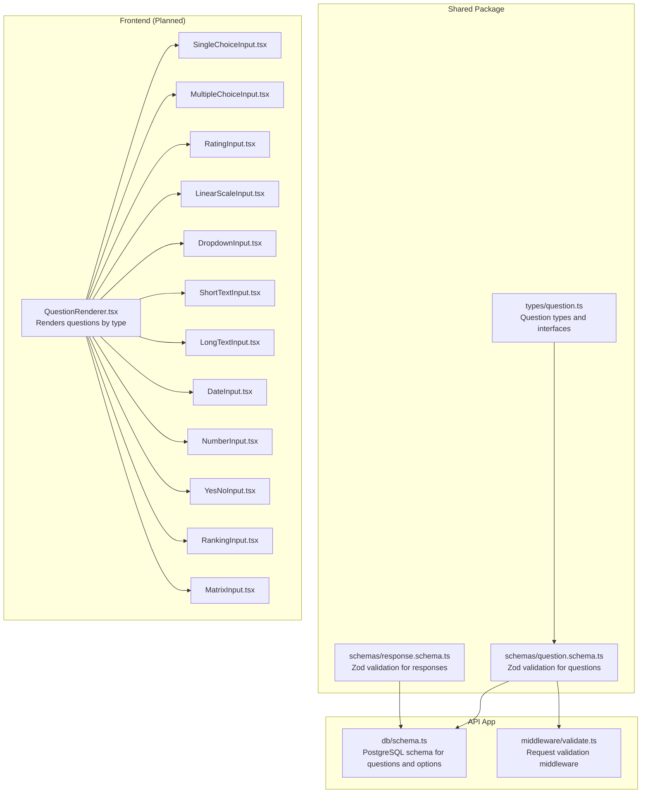
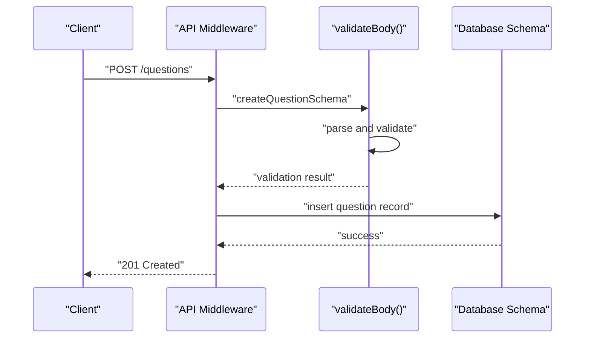
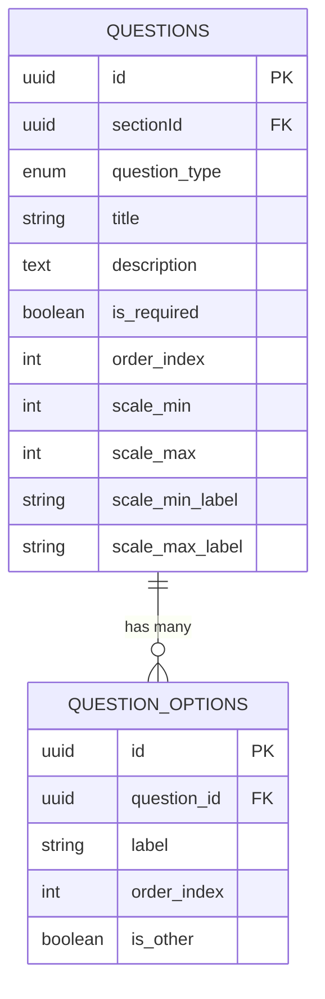
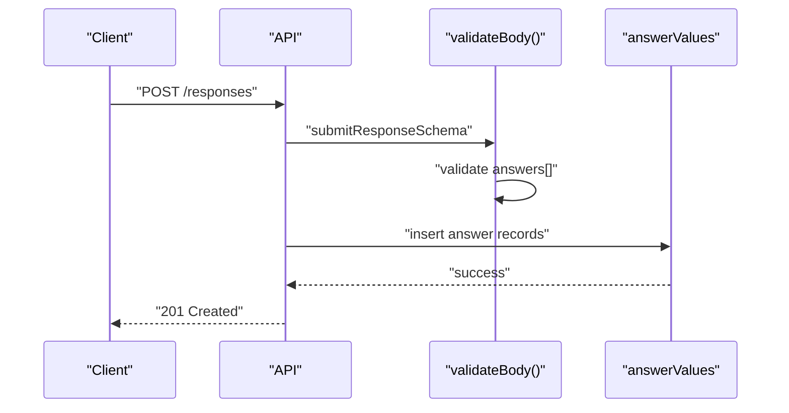
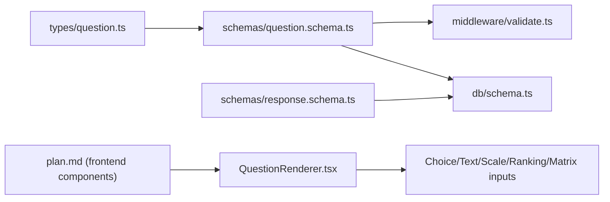

# Question Types System

<cite>
**Referenced Files in This Document**
- [question.ts](file://packages/shared/src/types/question.ts)
- [question.schema.ts](file://packages/shared/src/schemas/question.schema.ts)
- [schema.ts](file://apps/api/src/db/schema.ts)
- [response.schema.ts](file://packages/shared/src/schemas/response.schema.ts)
- [validate.ts](file://apps/api/src/middleware/validate.ts)
- [plan.md](file://plan.md)
</cite>

## Table of Contents
1. [Introduction](#introduction)
2. [Project Structure](#project-structure)
3. [Core Components](#core-components)
4. [Architecture Overview](#architecture-overview)
5. [Detailed Component Analysis](#detailed-component-analysis)
6. [Dependency Analysis](#dependency-analysis)
7. [Performance Considerations](#performance-considerations)
8. [Troubleshooting Guide](#troubleshooting-guide)
9. [Conclusion](#conclusion)

## Introduction
This document describes the comprehensive question types system that supports 12 distinct question formats. It explains the QuestionWithOptions interface, how different question types extend base question properties, option management, ordering, validation constraints, and required field handling. Practical examples illustrate creating questions, configuring options, and type-specific behaviors. The document also details the relationship between questions and their associated options, including dynamic option management and validation rules.

## Project Structure
The question types system spans shared type definitions, validation schemas, database schema, and response handling. The frontend components referenced in the plan support rendering and managing each question type.

**Diagram sources**
- [question.ts:1-66](file://packages/shared/src/types/question.ts#L1-L66)
- [question.schema.ts:1-64](file://packages/shared/src/schemas/question.schema.ts#L1-L64)
- [schema.ts:22-167](file://apps/api/src/db/schema.ts#L22-L167)
- [validate.ts:7-28](file://apps/api/src/middleware/validate.ts#L7-L28)
- [plan.md:537-550](file://plan.md#L537-L550)

**Section sources**
- [question.ts:1-66](file://packages/shared/src/types/question.ts#L1-L66)
- [question.schema.ts:1-64](file://packages/shared/src/schemas/question.schema.ts#L1-L64)
- [schema.ts:22-167](file://apps/api/src/db/schema.ts#L22-L167)
- [validate.ts:7-28](file://apps/api/src/middleware/validate.ts#L7-L28)
- [plan.md:537-550](file://plan.md#L537-L550)

## Core Components
- QuestionType union defines supported question formats: short_text, long_text, single_choice, multiple_choice, dropdown, linear_scale, rating, yes_no, date, number, ranking, matrix.
- Question interface encapsulates base properties: identifiers, section linkage, type, title, description, required flag, ordering, and scale bounds with optional labels.
- QuestionWithOptions extends Question with an options array for applicable question types.
- QuestionOption defines option metadata: identifier, parent question, label, ordering, and "other" flag.
- MatrixRow and MatrixColumn define row/column structures for matrix-type questions.

Key relationships:
- Questions are grouped under sections and ordered within sections.
- Options belong to a single question and maintain their own ordering.
- Scale min/max and labels apply to linear/rating scales.

Validation constraints:
- Question creation requires a valid type, title length limits, optional description, required flag defaults to true, and optional scale bounds with label lengths.
- Options arrays are optional during creation; each option has a label and an "other" flag.
- Update operations allow reordering via orderIndex.
- Reordering requests accept an array of items with ids and new order indices.

**Section sources**
- [question.ts:1-66](file://packages/shared/src/types/question.ts#L1-L66)
- [question.schema.ts:18-48](file://packages/shared/src/schemas/question.schema.ts#L18-L48)

## Architecture Overview
The system separates concerns across shared types, validation, persistence, and response handling. Validation middleware enforces schemas at the API boundary, while database schemas persist questions, options, and answers.

**Diagram sources**
- [validate.ts:7-28](file://apps/api/src/middleware/validate.ts#L7-L28)
- [question.schema.ts:18-35](file://packages/shared/src/schemas/question.schema.ts#L18-L35)
- [schema.ts:126-147](file://apps/api/src/db/schema.ts#L126-L147)

## Detailed Component Analysis

### Question Types and Base Properties
- QuestionType union enumerates all supported formats.
- Question interface defines immutable metadata and presentation hints (scale labels).
- QuestionWithOptions adds an options array for questions that present choices.

Implementation highlights:
- Ordering is enforced via orderIndex on both questions and options.
- Required field handling is explicit via isRequired.
- Scale bounds (scaleMin, scaleMax) and labels enable linear/rating scales.

Practical example references:
- Creating a question with type, title, description, required flag, and optional scale parameters.
- Updating a question to change orderIndex for reordering.

**Section sources**
- [question.ts:1-43](file://packages/shared/src/types/question.ts#L1-L43)
- [question.schema.ts:18-39](file://packages/shared/src/schemas/question.schema.ts#L18-L39)

### Question Option Management
- QuestionOption defines label, ordering, and "other" flag.
- Options are persisted with foreign-key linkage to questions.
- Option creation and updates support label changes and reordering.

Practical example references:
- Creating options with labels and "other" flags.
- Updating option labels and order indices.

**Section sources**
- [question.ts:45-51](file://packages/shared/src/types/question.ts#L45-L51)
- [question.schema.ts:50-58](file://packages/shared/src/schemas/question.schema.ts#L50-L58)
- [schema.ts:153-167](file://apps/api/src/db/schema.ts#L153-L167)

### Ordering Systems
- Questions are ordered within sections via orderIndex.
- Options are ordered per question via orderIndex.
- Reorder requests accept bulk updates with item ids and new indices.

Practical example references:
- Bulk reordering of questions using reorderSchema.

**Section sources**
- [question.schema.ts:41-48](file://packages/shared/src/schemas/question.schema.ts#L41-L48)
- [schema.ts:126-147](file://apps/api/src/db/schema.ts#L126-L147)
- [schema.ts:153-167](file://apps/api/src/db/schema.ts#L153-L167)

### Validation Constraints and Required Fields
- Validation middleware wraps request bodies and returns structured errors with field paths.
- Question creation enforces title length, optional description, required flag default, and scale bounds.
- Option creation enforces label length and "other" flag.
- Response submission validates answer shapes per question type.

Practical example references:
- Using validateBody with createQuestionSchema.
- Validating submitAnswerSchema for different value fields.

**Section sources**
- [validate.ts:7-28](file://apps/api/src/middleware/validate.ts#L7-L28)
- [question.schema.ts:18-35](file://packages/shared/src/schemas/question.schema.ts#L18-L35)
- [question.schema.ts:50-58](file://packages/shared/src/schemas/question.schema.ts#L50-L58)
- [response.schema.ts:3-10](file://packages/shared/src/schemas/response.schema.ts#L3-L10)

### Type-Specific Behaviors

#### Text Inputs
- short_text: single-line text input.
- long_text: multi-line text input.

Practical example references:
- Creating a short_text question with title and optional description.
- Creating a long_text question with similar structure.

**Section sources**
- [question.ts:1-13](file://packages/shared/src/types/question.ts#L1-L13)
- [question.schema.ts:18-26](file://packages/shared/src/schemas/question.schema.ts#L18-L26)

#### Choice-Based Inputs
- single_choice: radio button selection (one option selectable).
- multiple_choice: checkbox selection (multiple options selectable).
- dropdown: select dropdown with options.

Practical example references:
- Creating a single_choice question with options array.
- Creating a multiple_choice question with options array.

**Section sources**
- [question.ts:1-13](file://packages/shared/src/types/question.ts#L1-L13)
- [question.schema.ts:27-35](file://packages/shared/src/schemas/question.schema.ts#L27-L35)

#### Rating and Scale
- linear_scale: numeric scale with optional min/max labels.
- rating: star-based rating scale.

Practical example references:
- Creating a linear_scale with scaleMin, scaleMax, and optional labels.
- Creating a rating question with scale bounds.

**Section sources**
- [question.ts:1-13](file://packages/shared/src/types/question.ts#L1-L13)
- [question.schema.ts:23-26](file://packages/shared/src/schemas/question.schema.ts#L23-L26)

#### Boolean and Date/Time
- yes_no: yes/no selection.
- date: calendar date input.
- number: numeric input.

Practical example references:
- Creating a yes_no question.
- Creating a date question.
- Creating a number question.

**Section sources**
- [question.ts:1-13](file://packages/shared/src/types/question.ts#L1-L13)
- [question.schema.ts:18-26](file://packages/shared/src/schemas/question.schema.ts#L18-L26)

#### Ranking
- ranking: order-based selection among options.

Practical example references:
- Creating a ranking question with options array.

**Section sources**
- [question.ts:1-13](file://packages/shared/src/types/question.ts#L1-L13)
- [question.schema.ts:27-35](file://packages/shared/src/schemas/question.schema.ts#L27-L35)

#### Matrix
- matrix: rows and columns defining a grid of selections.

Practical example references:
- Creating a matrix question with row and column definitions.

**Section sources**
- [question.ts:57-65](file://packages/shared/src/types/question.ts#L57-L65)
- [question.schema.ts:18-26](file://packages/shared/src/schemas/question.schema.ts#L18-L26)

### Relationship Between Questions and Options
Questions and options maintain a strict parent-child relationship:
- Each option belongs to exactly one question.
- Options are ordered independently per question.
- Deleting a question cascades to its options.

**Diagram sources**
- [schema.ts:126-167](file://apps/api/src/db/schema.ts#L126-L167)

### Response Submission and Value Storage
Answers are stored per response with question-specific value fields:
- optionId for choice-based questions.
- textValue for text inputs.
- numberValue for numeric inputs.
- rankValue for ranking.
- isOtherText flag for "other" text responses.

**Diagram sources**
- [response.schema.ts:12-20](file://packages/shared/src/schemas/response.schema.ts#L12-L20)
- [schema.ts:202-222](file://apps/api/src/db/schema.ts#L202-L222)

## Dependency Analysis
The system exhibits clear separation of concerns:
- Shared types and schemas define contracts for questions and responses.
- API middleware enforces validation.
- Database schema persists data with appropriate constraints.
- Frontend components (as planned) render question types and manage interactions.

**Diagram sources**
- [question.ts:1-66](file://packages/shared/src/types/question.ts#L1-L66)
- [question.schema.ts:1-64](file://packages/shared/src/schemas/question.schema.ts#L1-L64)
- [validate.ts:7-28](file://apps/api/src/middleware/validate.ts#L7-L28)
- [schema.ts:22-222](file://apps/api/src/db/schema.ts#L22-L222)
- [plan.md:537-550](file://plan.md#L537-L550)

**Section sources**
- [question.ts:1-66](file://packages/shared/src/types/question.ts#L1-L66)
- [question.schema.ts:1-64](file://packages/shared/src/schemas/question.schema.ts#L1-L64)
- [schema.ts:22-222](file://apps/api/src/db/schema.ts#L22-L222)
- [validate.ts:7-28](file://apps/api/src/middleware/validate.ts#L7-L28)
- [plan.md:537-550](file://plan.md#L537-L550)

## Performance Considerations
- Indexes on foreign keys (questions.sectionId, question_options.questionId, answer_values.responseId, answer_values.questionId) optimize joins and filtering.
- Limiting answer counts prevents excessive payload sizes.
- Using enums for question types ensures efficient storage and validation.
- Minimizing repeated validations by leveraging shared schemas reduces overhead.

## Troubleshooting Guide
Common validation errors:
- Title length violations trigger messages for minimum and maximum constraints.
- Option label length violations occur when labels exceed configured maxima.
- Scale bounds must satisfy min/max constraints and reasonable ranges.
- Reorder requests require valid UUIDs and non-negative integers.

Operational tips:
- Use validateBody middleware to capture structured error details with field paths.
- Ensure options arrays are provided for choice-based question types when required.
- Verify required flag alignment with business logic for mandatory questions.

**Section sources**
- [validate.ts:7-28](file://apps/api/src/middleware/validate.ts#L7-L28)
- [question.schema.ts:18-48](file://packages/shared/src/schemas/question.schema.ts#L18-L48)
- [response.schema.ts:12-20](file://packages/shared/src/schemas/response.schema.ts#L12-L20)

## Conclusion
The question types system provides a robust, extensible foundation for 12 question formats. Through shared types, strict validation schemas, and relational persistence, it supports rich question configurations, dynamic option management, and precise validation rules. The modular design enables straightforward extension to additional question types and integrates seamlessly with response handling and ordering mechanisms.