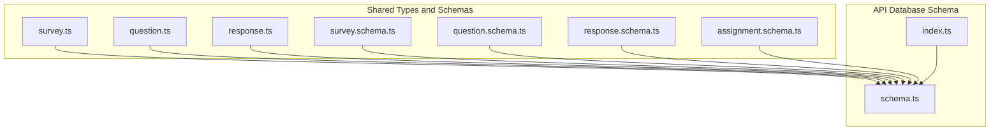
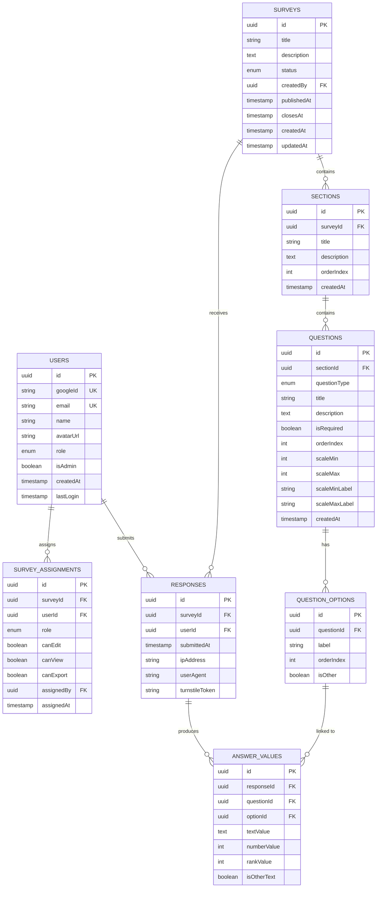
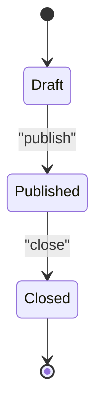
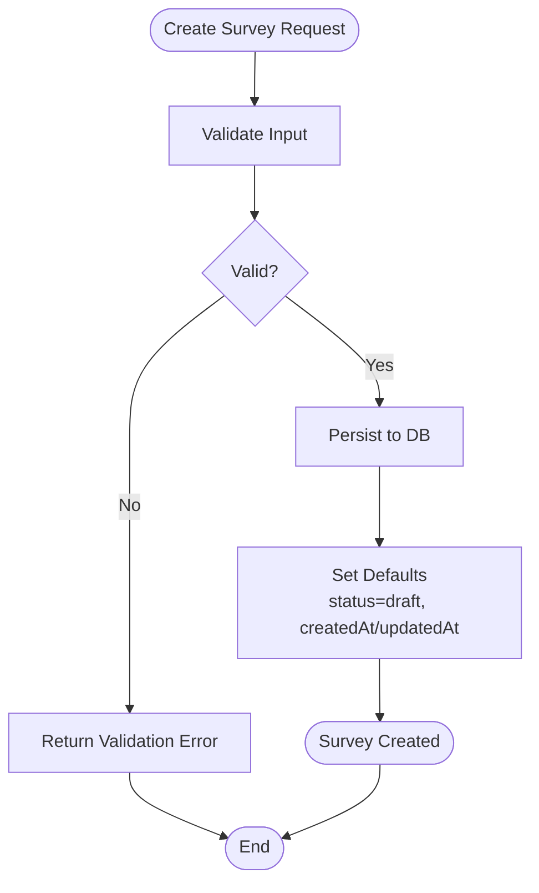
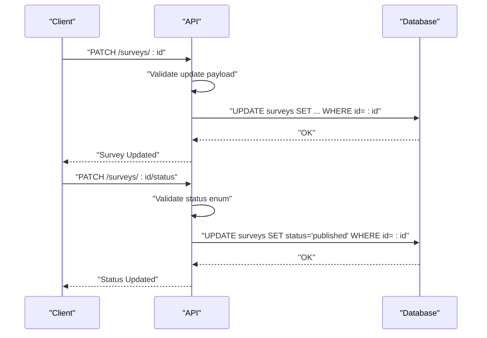
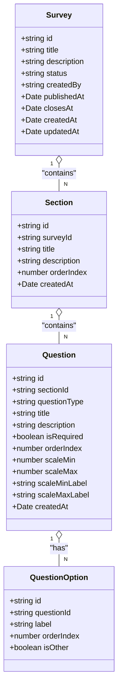
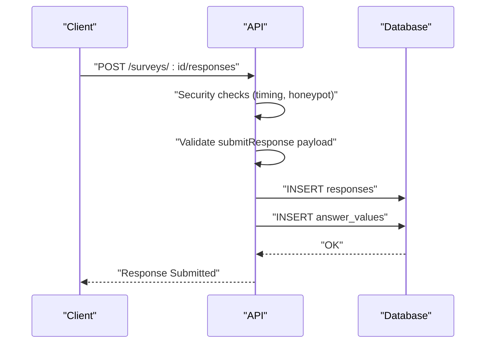
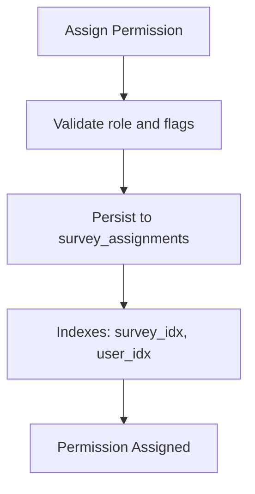
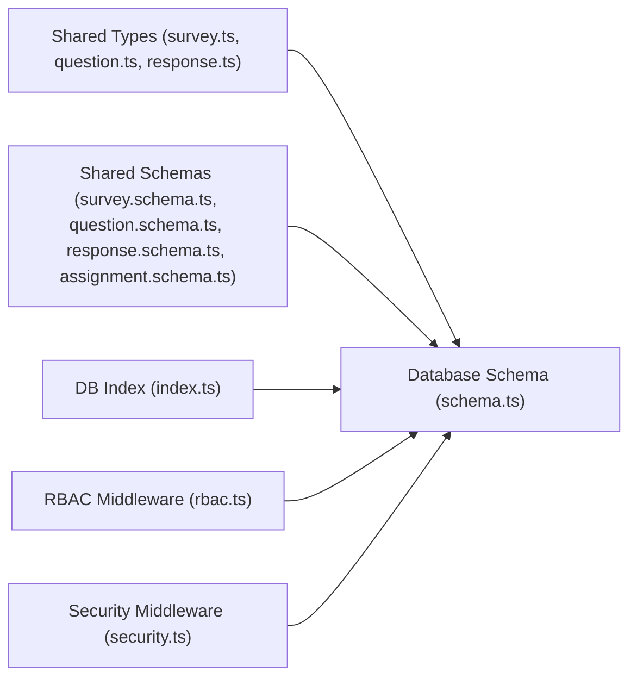

# Survey Data Model

<cite>
**Referenced Files in This Document**
- [survey.ts](file://packages/shared/src/types/survey.ts)
- [survey.schema.ts](file://packages/shared/src/schemas/survey.schema.ts)
- [question.ts](file://packages/shared/src/types/question.ts)
- [question.schema.ts](file://packages/shared/src/schemas/question.schema.ts)
- [response.ts](file://packages/shared/src/types/response.ts)
- [response.schema.ts](file://packages/shared/src/schemas/response.schema.ts)
- [assignment.schema.ts](file://packages/shared/src/schemas/assignment.schema.ts)
- [schema.ts](file://apps/api/src/db/schema.ts)
- [index.ts](file://apps/api/src/db/index.ts)
- [rbac.ts](file://apps/api/src/middleware/rbac.ts)
- [security.ts](file://apps/api/src/middleware/security.ts)
- [plan.md](file://plan.md)
</cite>

## Table of Contents
1. [Introduction](#introduction)
2. [Project Structure](#project-structure)
3. [Core Components](#core-components)
4. [Architecture Overview](#architecture-overview)
5. [Detailed Component Analysis](#detailed-component-analysis)
6. [Dependency Analysis](#dependency-analysis)
7. [Performance Considerations](#performance-considerations)
8. [Troubleshooting Guide](#troubleshooting-guide)
9. [Conclusion](#conclusion)

## Introduction
This document provides comprehensive data model documentation for the survey system. It covers the Survey entity and its lifecycle, the SurveyWithDetails extension, Section and Question relationships, SurveyAssignment permissions, and the underlying database schema. It also documents validation rules, business constraints, and practical examples for creating surveys, updating statuses, and assigning permissions.

## Project Structure
The survey data model spans shared TypeScript types and Zod schemas, plus the database schema definition. The shared package defines the canonical types and validation rules, while the API database schema maps these types to PostgreSQL tables with foreign keys and indexes.

**Diagram sources**
- [survey.ts:1-50](file://packages/shared/src/types/survey.ts#L1-L50)
- [question.ts:1-66](file://packages/shared/src/types/question.ts#L1-L66)
- [response.ts:1-53](file://packages/shared/src/types/response.ts#L1-L53)
- [survey.schema.ts:1-22](file://packages/shared/src/schemas/survey.schema.ts#L1-L22)
- [question.schema.ts:1-65](file://packages/shared/src/schemas/question.schema.ts#L1-L65)
- [response.schema.ts:1-24](file://packages/shared/src/schemas/response.schema.ts#L1-L24)
- [assignment.schema.ts:1-20](file://packages/shared/src/schemas/assignment.schema.ts#L1-L20)
- [schema.ts:1-247](file://apps/api/src/db/schema.ts#L1-L247)
- [index.ts:1-9](file://apps/api/src/db/index.ts#L1-L9)

**Section sources**
- [survey.ts:1-50](file://packages/shared/src/types/survey.ts#L1-L50)
- [survey.schema.ts:1-22](file://packages/shared/src/schemas/survey.schema.ts#L1-L22)
- [question.ts:1-66](file://packages/shared/src/types/question.ts#L1-L66)
- [question.schema.ts:1-65](file://packages/shared/src/schemas/question.schema.ts#L1-L65)
- [response.ts:1-53](file://packages/shared/src/types/response.ts#L1-L53)
- [response.schema.ts:1-24](file://packages/shared/src/schemas/response.schema.ts#L1-L24)
- [assignment.schema.ts:1-20](file://packages/shared/src/schemas/assignment.schema.ts#L1-L20)
- [schema.ts:1-247](file://apps/api/src/db/schema.ts#L1-L247)
- [index.ts:1-9](file://apps/api/src/db/index.ts#L1-L9)

## Core Components
This section documents the primary data structures and their relationships.

- Survey
  - Fields: id, title, description, status, createdBy, publishedAt, closesAt, createdAt, updatedAt
  - Status lifecycle: draft → published → closed
  - Validation rules: title length limits, optional description, optional closesAt datetime
  - Business constraints: status defaults to draft; publishedAt set when status becomes published; closesAt controls expiration

- SurveyWithDetails
  - Extends Survey with sections and responseCount
  - Sections: ordered collection of SectionWithQuestions
  - responseCount: computed metric for analytics

- Section and SectionWithQuestions
  - Section: id, surveyId, title, description, orderIndex, createdAt
  - SectionWithQuestions: includes questions array of QuestionWithOptions

- Question and QuestionWithOptions
  - Question: id, sectionId, questionType, title, description, isRequired, orderIndex, scaleMin/max, scaleMinLabel/maxLabel, createdAt
  - QuestionWithOptions: includes options array of QuestionOption

- Response and AnswerValue
  - Response: id, surveyId, userId, submittedAt, ipAddress, userAgent
  - AnswerValue: links responses to questions/options/text/number/rank values

- SurveyAssignment
  - Role-based permissions: editor and viewer roles with canEdit, canView, canExport flags
  - Assignment metadata: assignedBy, assignedAt, optional user name/email

**Section sources**
- [survey.ts:3-49](file://packages/shared/src/types/survey.ts#L3-L49)
- [survey.schema.ts:3-17](file://packages/shared/src/schemas/survey.schema.ts#L3-L17)
- [question.ts:30-65](file://packages/shared/src/types/question.ts#L30-L65)
- [question.schema.ts:18-48](file://packages/shared/src/schemas/question.schema.ts#L18-L48)
- [response.ts:1-23](file://packages/shared/src/types/response.ts#L1-L23)
- [response.schema.ts:3-20](file://packages/shared/src/schemas/response.schema.ts#L3-L20)
- [assignment.schema.ts:3-16](file://packages/shared/src/schemas/assignment.schema.ts#L3-L16)

## Architecture Overview
The data model follows a normalized relational design with explicit foreign keys and indexes. The shared types and schemas define the contract, while the database schema enforces referential integrity and constraints.

**Diagram sources**
- [schema.ts:41-222](file://apps/api/src/db/schema.ts#L41-L222)
- [survey.ts:5-49](file://packages/shared/src/types/survey.ts#L5-L49)
- [question.ts:30-65](file://packages/shared/src/types/question.ts#L30-L65)
- [response.ts:1-23](file://packages/shared/src/types/response.ts#L1-L23)

## Detailed Component Analysis

### Survey Lifecycle and Status Transitions
- Draft: Initial state; survey is editable and not visible to respondents
- Published: Survey becomes visible to respondents; publishedAt timestamp is set
- Closed: Survey ends; closesAt timestamp controls expiration; no new submissions accepted

**Diagram sources**
- [survey.ts:3-15](file://packages/shared/src/types/survey.ts#L3-L15)
- [survey.schema.ts:15-17](file://packages/shared/src/schemas/survey.schema.ts#L15-L17)
- [schema.ts:57-69](file://apps/api/src/db/schema.ts#L57-L69)

**Section sources**
- [survey.ts:3-15](file://packages/shared/src/types/survey.ts#L3-L15)
- [survey.schema.ts:15-17](file://packages/shared/src/schemas/survey.schema.ts#L15-L17)
- [schema.ts:57-69](file://apps/api/src/db/schema.ts#L57-L69)

### Survey Creation and Validation
- Required fields: title
- Optional fields: description, closesAt
- Validation constraints: title min/max lengths, description max length, closesAt datetime nullable

**Diagram sources**
- [survey.schema.ts:3-7](file://packages/shared/src/schemas/survey.schema.ts#L3-L7)
- [schema.ts:57-69](file://apps/api/src/db/schema.ts#L57-L69)

**Section sources**
- [survey.schema.ts:3-7](file://packages/shared/src/schemas/survey.schema.ts#L3-L7)
- [schema.ts:57-69](file://apps/api/src/db/schema.ts#L57-L69)

### Survey Update and Status Management
- Update title/description/closesAt with optional fields
- Status update restricted to enum values: draft, published, closed

**Diagram sources**
- [survey.schema.ts:9-17](file://packages/shared/src/schemas/survey.schema.ts#L9-L17)
- [schema.ts:57-69](file://apps/api/src/db/schema.ts#L57-L69)

**Section sources**
- [survey.schema.ts:9-17](file://packages/shared/src/schemas/survey.schema.ts#L9-L17)
- [schema.ts:57-69](file://apps/api/src/db/schema.ts#L57-L69)

### Section and Question Relationships
- Sections belong to a Survey via surveyId and are ordered by orderIndex
- Questions belong to a Section via sectionId and are ordered by orderIndex
- Options belong to Questions and support dynamic ordering

**Diagram sources**
- [survey.ts:22-33](file://packages/shared/src/types/survey.ts#L22-L33)
- [question.ts:30-65](file://packages/shared/src/types/question.ts#L30-L65)
- [schema.ts:105-167](file://apps/api/src/db/schema.ts#L105-L167)

**Section sources**
- [survey.ts:22-33](file://packages/shared/src/types/survey.ts#L22-L33)
- [question.ts:30-65](file://packages/shared/src/types/question.ts#L30-L65)
- [schema.ts:105-167](file://apps/api/src/db/schema.ts#L105-L167)

### Response Submission and Answer Values
- Responses are unique per user per survey
- AnswerValues link responses to questions and options, supporting text, number, and rank values

**Diagram sources**
- [response.schema.ts:12-20](file://packages/shared/src/schemas/response.schema.ts#L12-L20)
- [security.ts:7-30](file://apps/api/src/middleware/security.ts#L7-L30)
- [schema.ts:173-222](file://apps/api/src/db/schema.ts#L173-L222)

**Section sources**
- [response.ts:1-23](file://packages/shared/src/types/response.ts#L1-L23)
- [response.schema.ts:12-20](file://packages/shared/src/schemas/response.schema.ts#L12-L20)
- [security.ts:7-30](file://apps/api/src/middleware/security.ts#L7-L30)
- [schema.ts:173-222](file://apps/api/src/db/schema.ts#L173-L222)

### SurveyAssignment Permissions
- Roles: editor, viewer
- Permissions: canEdit, canView, canExport
- Unique constraint: (surveyId, userId) prevents duplicate assignments
- AssignedBy links to users who granted permissions

**Diagram sources**
- [assignment.schema.ts:3-16](file://packages/shared/src/schemas/assignment.schema.ts#L3-L16)
- [schema.ts:75-99](file://apps/api/src/db/schema.ts#L75-L99)
- [rbac.ts:38-55](file://apps/api/src/middleware/rbac.ts#L38-L55)

**Section sources**
- [survey.ts:35-49](file://packages/shared/src/types/survey.ts#L35-L49)
- [assignment.schema.ts:3-16](file://packages/shared/src/schemas/assignment.schema.ts#L3-L16)
- [schema.ts:75-99](file://apps/api/src/db/schema.ts#L75-L99)
- [rbac.ts:38-55](file://apps/api/src/middleware/rbac.ts#L38-L55)

## Dependency Analysis
The following diagram shows how shared types and schemas depend on the database schema and vice versa.

**Diagram sources**
- [survey.ts:1-50](file://packages/shared/src/types/survey.ts#L1-L50)
- [question.ts:1-66](file://packages/shared/src/types/question.ts#L1-L66)
- [response.ts:1-53](file://packages/shared/src/types/response.ts#L1-L53)
- [survey.schema.ts:1-22](file://packages/shared/src/schemas/survey.schema.ts#L1-L22)
- [question.schema.ts:1-65](file://packages/shared/src/schemas/question.schema.ts#L1-L65)
- [response.schema.ts:1-24](file://packages/shared/src/schemas/response.schema.ts#L1-L24)
- [assignment.schema.ts:1-20](file://packages/shared/src/schemas/assignment.schema.ts#L1-L20)
- [schema.ts:1-247](file://apps/api/src/db/schema.ts#L1-L247)
- [index.ts:1-9](file://apps/api/src/db/index.ts#L1-L9)
- [rbac.ts:1-56](file://apps/api/src/middleware/rbac.ts#L1-L56)
- [security.ts:1-73](file://apps/api/src/middleware/security.ts#L1-L73)

**Section sources**
- [survey.ts:1-50](file://packages/shared/src/types/survey.ts#L1-L50)
- [question.ts:1-66](file://packages/shared/src/types/question.ts#L1-L66)
- [response.ts:1-53](file://packages/shared/src/types/response.ts#L1-L53)
- [survey.schema.ts:1-22](file://packages/shared/src/schemas/survey.schema.ts#L1-L22)
- [question.schema.ts:1-65](file://packages/shared/src/schemas/question.schema.ts#L1-L65)
- [response.schema.ts:1-24](file://packages/shared/src/schemas/response.schema.ts#L1-L24)
- [assignment.schema.ts:1-20](file://packages/shared/src/schemas/assignment.schema.ts#L1-L20)
- [schema.ts:1-247](file://apps/api/src/db/schema.ts#L1-L247)
- [index.ts:1-9](file://apps/api/src/db/index.ts#L1-L9)
- [rbac.ts:1-56](file://apps/api/src/middleware/rbac.ts#L1-L56)
- [security.ts:1-73](file://apps/api/src/middleware/security.ts#L1-L73)

## Performance Considerations
- Indexes on foreign keys and frequently queried columns improve join performance and reduce query times.
- Unique indexes prevent duplicate entries and maintain data integrity.
- Validation at the schema level reduces downstream errors and improves reliability.
- Consider partitioning or materialized views for large-scale analytics on responses and statistics.

## Troubleshooting Guide
Common issues and resolutions:
- Validation errors on survey creation/update: Ensure title length constraints and optional fields meet requirements.
- Status update failures: Verify status value matches allowed enum values.
- Duplicate assignments: Unique index on (surveyId, userId) prevents duplicates; handle conflict gracefully.
- Response submission rejections: Check timing and honeypot middleware configurations; ensure formOpenedAt and honeypot fields are correctly handled.
- Permission denials: Confirm user has appropriate role and flags set in survey_assignments.

**Section sources**
- [survey.schema.ts:3-17](file://packages/shared/src/schemas/survey.schema.ts#L3-L17)
- [assignment.schema.ts:3-16](file://packages/shared/src/schemas/assignment.schema.ts#L3-L16)
- [response.schema.ts:12-20](file://packages/shared/src/schemas/response.schema.ts#L12-L20)
- [security.ts:7-30](file://apps/api/src/middleware/security.ts#L7-L30)
- [schema.ts:75-99](file://apps/api/src/db/schema.ts#L75-L99)

## Conclusion
The survey system’s data model is designed around clear entities and relationships, enforced by shared types and schemas and implemented in PostgreSQL with robust foreign keys and indexes. The model supports a complete lifecycle from creation to publishing and closing, with granular permission control and validated input handling. These foundations enable reliable survey administration, secure submissions, and accurate analytics.