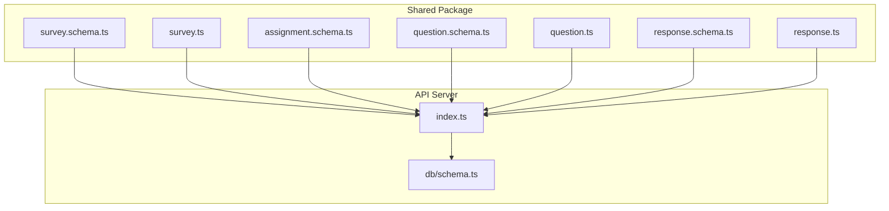
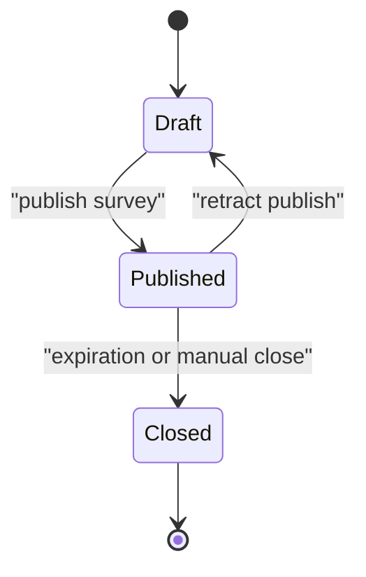
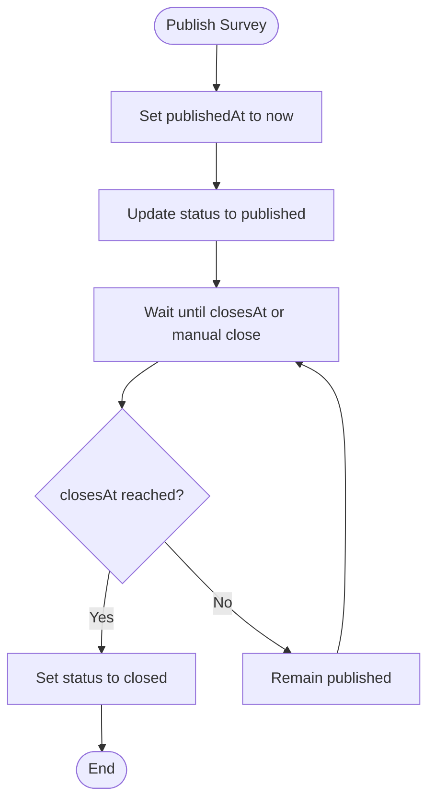
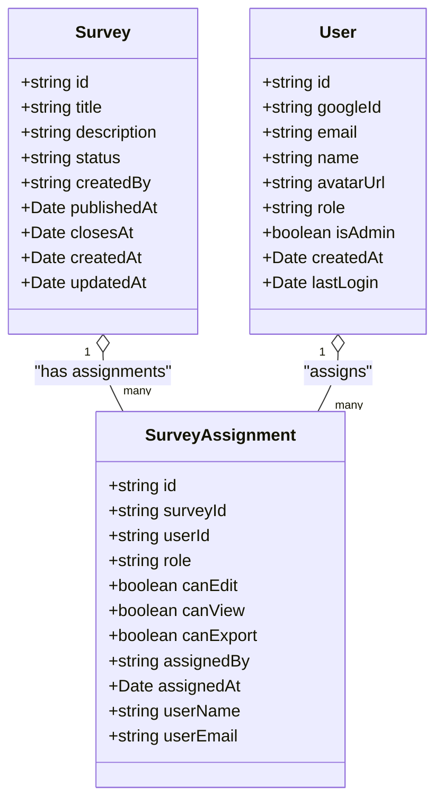
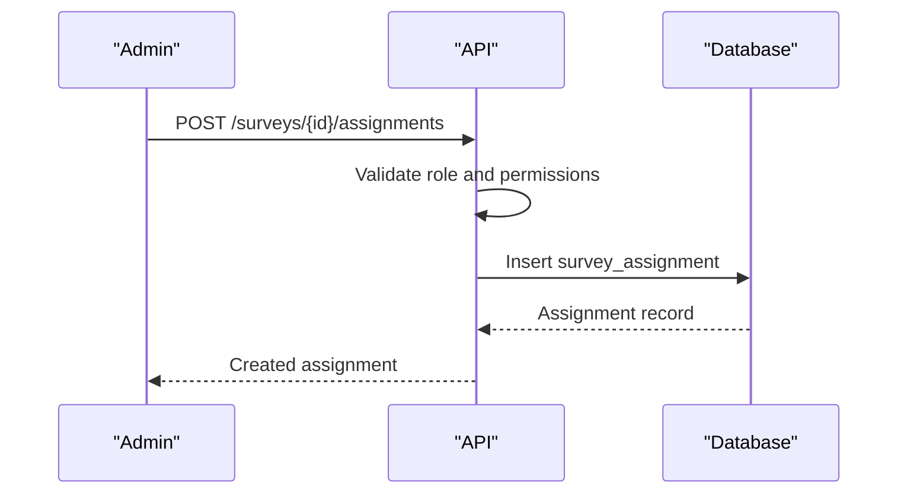
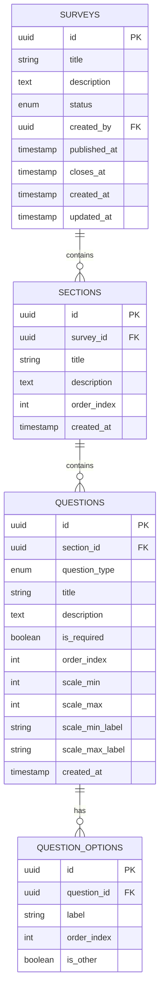
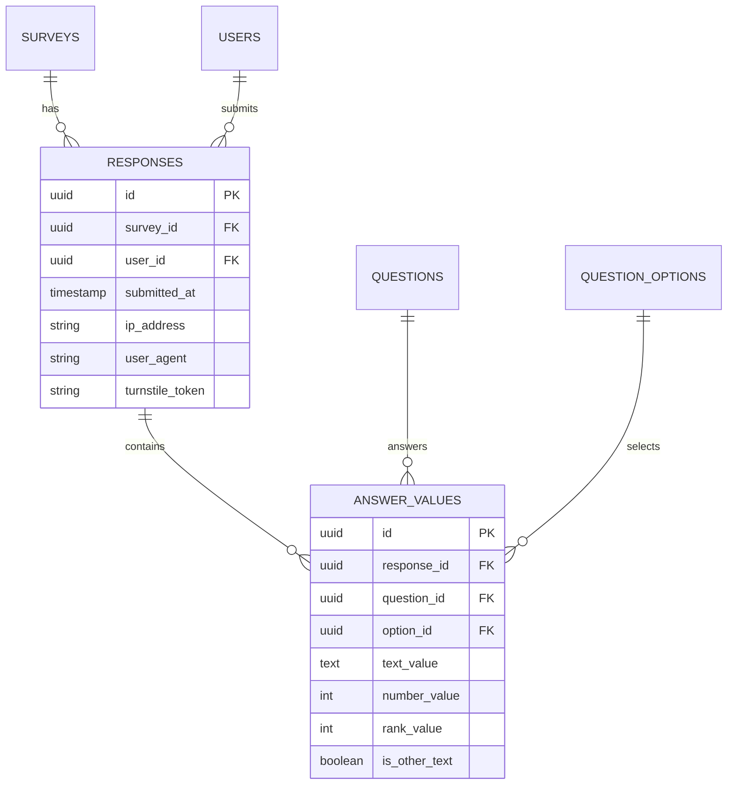
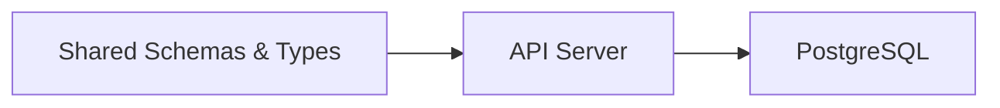

# Survey Lifecycle Management

<cite>
**Referenced Files in This Document**
- [survey.schema.ts](file://packages/shared/src/schemas/survey.schema.ts)
- [survey.ts](file://packages/shared/src/types/survey.ts)
- [assignment.schema.ts](file://packages/shared/src/schemas/assignment.schema.ts)
- [question.schema.ts](file://packages/shared/src/schemas/question.schema.ts)
- [question.ts](file://packages/shared/src/types/question.ts)
- [response.schema.ts](file://packages/shared/src/schemas/response.schema.ts)
- [response.ts](file://packages/shared/src/types/response.ts)
- [schema.ts](file://apps/api/src/db/schema.ts)
- [index.ts](file://apps/api/src/index.ts)
</cite>

## Table of Contents
1. [Introduction](#introduction)
2. [Project Structure](#project-structure)
3. [Core Components](#core-components)
4. [Architecture Overview](#architecture-overview)
5. [Detailed Component Analysis](#detailed-component-analysis)
6. [Dependency Analysis](#dependency-analysis)
7. [Performance Considerations](#performance-considerations)
8. [Troubleshooting Guide](#troubleshooting-guide)
9. [Conclusion](#conclusion)
10. [Appendices](#appendices)

## Introduction
This document provides comprehensive documentation for survey lifecycle management, covering the complete workflow from creation to closure. It explains status transitions (draft → published → closed), timing controls using publishedAt and closesAt fields, survey publishing workflows, automatic status changes, expiration handling, and the survey assignment system for managing editor and viewer permissions with role-based access control and permission inheritance. It also covers duplication prevention mechanisms, response tracking, and analytics integration. Practical examples demonstrate survey creation workflows, status management, permission assignments, and automated lifecycle events. Finally, it outlines best practices for survey organization, section management, and question ordering.

## Project Structure
The survey lifecycle management spans shared TypeScript types and Zod schemas, and the API server with Drizzle ORM database schema. The shared package defines the canonical data contracts for surveys, assignments, questions, and responses. The API server hosts route handlers and integrates with the database schema to enforce business rules and manage data persistence.



**Diagram sources**
- [survey.schema.ts:1-22](file://packages/shared/src/schemas/survey.schema.ts#L1-L22)
- [survey.ts:1-50](file://packages/shared/src/types/survey.ts#L1-L50)
- [assignment.schema.ts:1-20](file://packages/shared/src/schemas/assignment.schema.ts#L1-L20)
- [question.schema.ts:1-65](file://packages/shared/src/schemas/question.schema.ts#L1-L65)
- [question.ts:1-66](file://packages/shared/src/types/question.ts#L1-L66)
- [response.schema.ts:1-24](file://packages/shared/src/schemas/response.schema.ts#L1-L24)
- [response.ts:1-53](file://packages/shared/src/types/response.ts#L1-L53)
- [schema.ts:1-247](file://apps/api/src/db/schema.ts#L1-L247)
- [index.ts:1-67](file://apps/api/src/index.ts#L1-L67)

**Section sources**
- [survey.schema.ts:1-22](file://packages/shared/src/schemas/survey.schema.ts#L1-L22)
- [survey.ts:1-50](file://packages/shared/src/types/survey.ts#L1-L50)
- [assignment.schema.ts:1-20](file://packages/shared/src/schemas/assignment.schema.ts#L1-L20)
- [question.schema.ts:1-65](file://packages/shared/src/schemas/question.schema.ts#L1-L65)
- [question.ts:1-66](file://packages/shared/src/types/question.ts#L1-L66)
- [response.schema.ts:1-24](file://packages/shared/src/schemas/response.schema.ts#L1-L24)
- [response.ts:1-53](file://packages/shared/src/types/response.ts#L1-L53)
- [schema.ts:1-247](file://apps/api/src/db/schema.ts#L1-L247)
- [index.ts:1-67](file://apps/api/src/index.ts#L1-L67)

## Core Components
- Survey lifecycle and metadata: Surveys have status, timestamps, and ownership metadata. Status transitions are constrained to draft, published, and closed.
- Timing controls: publishedAt captures when a survey was published; closesAt defines the expiration boundary.
- Assignment system: Users can be assigned roles (editor, viewer) with granular permissions (canEdit, canView, canExport).
- Sections and questions: Surveys are organized into ordered sections containing ordered questions with various types and options.
- Responses and analytics: Responses are tracked per user per survey with answer values supporting multiple question types.

Key implementation references:
- Survey schema and types define status enums, timing fields, and assignment roles.
- Database schema enforces uniqueness and foreign keys for surveys, assignments, sections, questions, and responses.
- Shared schemas validate inputs for creating/updating surveys, assignments, questions, and responses.

**Section sources**
- [survey.schema.ts:1-22](file://packages/shared/src/schemas/survey.schema.ts#L1-L22)
- [survey.ts:1-50](file://packages/shared/src/types/survey.ts#L1-L50)
- [assignment.schema.ts:1-20](file://packages/shared/src/schemas/assignment.schema.ts#L1-L20)
- [question.schema.ts:1-65](file://packages/shared/src/schemas/question.schema.ts#L1-L65)
- [question.ts:1-66](file://packages/shared/src/types/question.ts#L1-L66)
- [response.schema.ts:1-24](file://packages/shared/src/schemas/response.schema.ts#L1-L24)
- [response.ts:1-53](file://packages/shared/src/types/response.ts#L1-L53)
- [schema.ts:1-247](file://apps/api/src/db/schema.ts#L1-L247)

## Architecture Overview
The system follows a layered architecture:
- Presentation layer: API routes (placeholder in current codebase) will handle requests.
- Application services: Business logic for survey lifecycle, assignment management, and response processing.
- Persistence layer: PostgreSQL schema via Drizzle ORM with unique constraints preventing duplicates and cascading deletes for referential integrity.

```mermaid
graph TB
Client["Client"]
Routes["API Routes<br/>index.ts"]
Services["Application Services<br/>(to be implemented)"]
DB[("PostgreSQL Database")]
Schema["Drizzle Schema<br/>schema.ts"]
Client --> Routes
Routes --> Services
Services --> DB
DB <- --> Schema
```

**Diagram sources**
- [index.ts:1-67](file://apps/api/src/index.ts#L1-L67)
- [schema.ts:1-247](file://apps/api/src/db/schema.ts#L1-L247)

## Detailed Component Analysis

### Survey Lifecycle Management
Surveys progress through three statuses: draft, published, and closed. The system tracks publication and closure via timestamps and enforces status transitions through validation and service logic.



- Status transitions:
  - draft → published: sets publishedAt to current time.
  - published → closed: triggered by expiration (closesAt reached) or manual action.
  - draft ↔ published: retraction resets publishedAt.
- Timing controls:
  - publishedAt: populated upon publishing.
  - closesAt: optional; when reached, triggers closure.
- Expiration handling:
  - Implement a scheduled job or worker to check surveys whose closesAt is in the past and set status to closed.



**Diagram sources**
- [survey.ts:5-15](file://packages/shared/src/types/survey.ts#L5-L15)
- [survey.schema.ts:15-17](file://packages/shared/src/schemas/survey.schema.ts#L15-L17)
- [schema.ts:57-69](file://apps/api/src/db/schema.ts#L57-L69)

Practical example scenarios:
- Creating a survey: Use the create survey schema to validate title and optional description and closesAt. Persist to the surveys table with status defaulting to draft.
- Publishing a survey: Call updateSurveyStatus with published; the service sets publishedAt automatically.
- Closing a survey: Either wait for closesAt to pass (automatic) or call updateSurveyStatus with closed.

Best practices:
- Always set closesAt before publishing if you want automatic expiration.
- Use draft for internal editing; avoid exposing draft surveys publicly.
- Keep description concise and informative for clarity.

**Section sources**
- [survey.ts:5-15](file://packages/shared/src/types/survey.ts#L5-L15)
- [survey.schema.ts:3-17](file://packages/shared/src/schemas/survey.schema.ts#L3-L17)
- [schema.ts:57-69](file://apps/api/src/db/schema.ts#L57-L69)

### Survey Assignment System and Role-Based Access Control
Assignments link users to surveys with roles and permissions. Roles include editor and viewer, with canEdit, canView, and canExport flags.



- Role-based access control:
  - editor: canEdit is true; typically implies canView is true.
  - viewer: canView is true; canEdit and canExport are false by default.
- Permission inheritance:
  - Assignments override global user roles for the specific survey context.
  - canView implies visibility; canEdit implies modification rights; canExport enables data export capabilities.
- Duplication prevention:
  - Unique index on (surveyId, userId) prevents duplicate assignments for the same user-survey pair.



**Diagram sources**
- [assignment.schema.ts:3-9](file://packages/shared/src/schemas/assignment.schema.ts#L3-L9)
- [survey.ts:37-49](file://packages/shared/src/types/survey.ts#L37-L49)
- [schema.ts:75-99](file://apps/api/src/db/schema.ts#L75-L99)

Practical example scenarios:
- Assigning an editor: POST assignment with role editor and canEdit true.
- Assigning a viewer: POST assignment with role viewer and canEdit false.
- Updating permissions: PATCH assignment to toggle canExport flag.

Best practices:
- Default to viewer for broad distribution; grant editor only when necessary.
- Use canExport judiciously; consider audit logging for exports.
- Remove stale assignments periodically to maintain clean access control.

**Section sources**
- [assignment.schema.ts:1-20](file://packages/shared/src/schemas/assignment.schema.ts#L1-L20)
- [survey.ts:35-49](file://packages/shared/src/types/survey.ts#L35-L49)
- [schema.ts:75-99](file://apps/api/src/db/schema.ts#L75-L99)

### Section and Question Management
Surveys are composed of ordered sections and questions. Sections define grouping and order; questions define content and options.



**Diagram sources**
- [schema.ts:57-167](file://apps/api/src/db/schema.ts#L57-L167)

Practical example scenarios:
- Creating a default section during survey creation ensures immediate usability.
- Reordering sections and questions maintains logical presentation.
- Matrix questions require separate row/column definitions; ensure proper labeling and ordering.

Best practices:
- Use meaningful section titles and descriptions to guide respondents.
- Keep question titles concise but descriptive.
- Order questions logically; group related items within sections.
- Use scale labels for linear scales to improve clarity.

**Section sources**
- [schema.ts:105-167](file://apps/api/src/db/schema.ts#L105-L167)
- [question.schema.ts:18-48](file://packages/shared/src/schemas/question.schema.ts#L18-L48)
- [question.ts:30-65](file://packages/shared/src/types/question.ts#L30-L65)

### Response Tracking and Analytics Integration
Responses are recorded per user per survey with answer values supporting multiple question types. Analytics can derive counts and distributions from stored answers.



**Diagram sources**
- [schema.ts:173-222](file://apps/api/src/db/schema.ts#L173-L222)
- [response.ts:1-53](file://packages/shared/src/types/response.ts#L1-L53)

Practical example scenarios:
- Submitting a response validates turnstileToken and answer array limits.
- Analytics queries can compute totals, option counts, averages, and text previews per question.
- Export functionality can leverage canExport flag from assignments.

Best practices:
- Enforce turnstileToken validation to prevent spam.
- Limit answer arrays to reasonable sizes to maintain performance.
- Store minimal identifying information; anonymize where possible.

**Section sources**
- [response.schema.ts:12-20](file://packages/shared/src/schemas/response.schema.ts#L12-L20)
- [response.ts:25-52](file://packages/shared/src/types/response.ts#L25-L52)
- [schema.ts:173-222](file://apps/api/src/db/schema.ts#L173-L222)

## Dependency Analysis
The system exhibits clear separation of concerns:
- Shared schemas and types define contracts consumed by the API server.
- The API server depends on the database schema for persistence and integrity.
- Unique indexes and foreign keys enforce data integrity and prevent duplication.



**Diagram sources**
- [survey.schema.ts:1-22](file://packages/shared/src/schemas/survey.schema.ts#L1-L22)
- [survey.ts:1-50](file://packages/shared/src/types/survey.ts#L1-L50)
- [assignment.schema.ts:1-20](file://packages/shared/src/schemas/assignment.schema.ts#L1-L20)
- [question.schema.ts:1-65](file://packages/shared/src/schemas/question.schema.ts#L1-L65)
- [question.ts:1-66](file://packages/shared/src/types/question.ts#L1-L66)
- [response.schema.ts:1-24](file://packages/shared/src/schemas/response.schema.ts#L1-L24)
- [response.ts:1-53](file://packages/shared/src/types/response.ts#L1-L53)
- [schema.ts:1-247](file://apps/api/src/db/schema.ts#L1-L247)
- [index.ts:1-67](file://apps/api/src/index.ts#L1-L67)

**Section sources**
- [schema.ts:1-247](file://apps/api/src/db/schema.ts#L1-L247)
- [index.ts:1-67](file://apps/api/src/index.ts#L1-L67)

## Performance Considerations
- Indexes: Unique indexes on (surveyId, userId) for assignments and (surveyId, userId) for responses prevent duplicates and speed up lookups.
- Query patterns: Use targeted queries for survey details, section ordering, and question options to minimize payload size.
- Validation: Leverage Zod schemas to validate inputs early and reduce database round trips.
- Caching: Consider caching frequently accessed survey metadata and section/question lists for improved responsiveness.

## Troubleshooting Guide
Common issues and resolutions:
- Duplicate assignment errors: Ensure unique constraint (surveyId, userId) is respected; check existing assignments before inserting.
- Permission denied: Verify assignment role and flags (canView, canEdit, canExport) match intended access.
- Response submission failures: Confirm turnstileToken validation and answer array constraints.
- Expiration not triggering: Verify closesAt is set and that the lifecycle job runs regularly.

**Section sources**
- [schema.ts:94-98](file://apps/api/src/db/schema.ts#L94-L98)
- [response.schema.ts:12-20](file://packages/shared/src/schemas/response.schema.ts#L12-L20)

## Conclusion
The survey lifecycle management system provides a robust foundation for creating, publishing, and closing surveys while enforcing strong access control and data integrity. By leveraging timestamps, status enums, unique constraints, and role-based permissions, the system supports scalable survey administration and reliable analytics. Following the best practices outlined ensures efficient organization, clear user experiences, and maintainable operations.

## Appendices
- API endpoint placeholders: The API server currently includes placeholder comments indicating where survey, assignment, and admin routes will be mounted. These should be implemented to expose CRUD operations for surveys, assignments, and analytics endpoints.
- Worker considerations: Implement a background worker or scheduled job to handle automatic closure based on closesAt and to perform periodic cleanup tasks.

**Section sources**
- [index.ts:44-47](file://apps/api/src/index.ts#L44-L47)